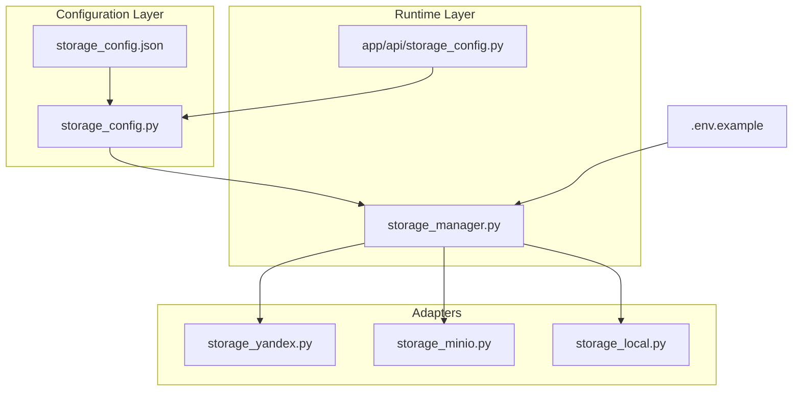
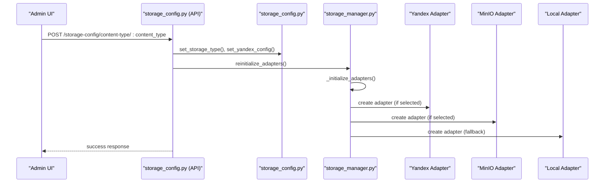
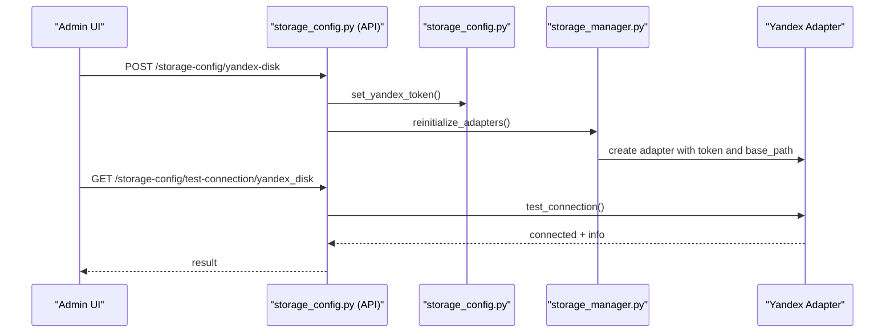
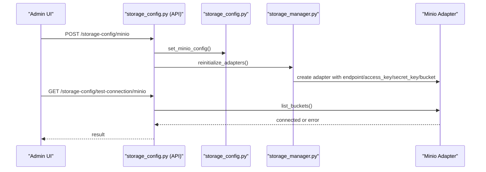
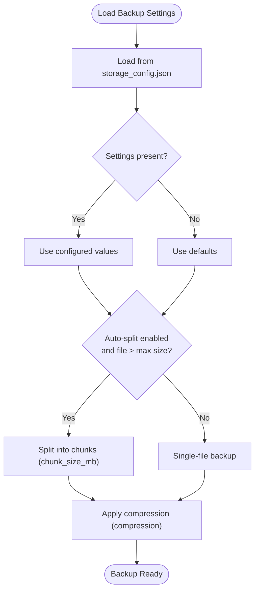
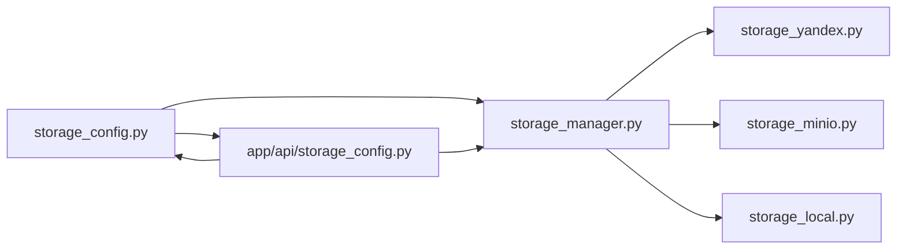

# JSON Configuration Files

<cite>
**Referenced Files in This Document**
- [storage_config.json](file://vertex-ar/config/storage_config.json)
- [storage_config.py](file://vertex-ar/storage_config.py)
- [storage_manager.py](file://vertex-ar/storage_manager.py)
- [storage_config.py (API)](file://vertex-ar/app/api/storage_config.py)
- [storage_yandex.py](file://vertex-ar/app/storage_yandex.py)
- [storage_minio.py](file://vertex-ar/app/storage_minio.py)
- [storage_local.py](file://vertex-ar/app/storage_local.py)
- [.env.example](file://vertex-ar/.env.example)
- [backup_manager.py](file://vertex-ar/backup_manager.py)
- [admin_storage.html](file://vertex-ar/templates/admin_storage.html)
- [admin_settings.html](file://vertex-ar/templates/admin_settings.html)
- [admin.py](file://vertex-ar/app/api/admin.py)
- [test_storage_config.py](file://test_files/integration/test_storage_config.py)
</cite>

## Table of Contents
1. [Introduction](#introduction)
2. [Project Structure](#project-structure)
3. [Core Components](#core-components)
4. [Architecture Overview](#architecture-overview)
5. [Detailed Component Analysis](#detailed-component-analysis)
6. [Dependency Analysis](#dependency-analysis)
7. [Performance Considerations](#performance-considerations)
8. [Troubleshooting Guide](#troubleshooting-guide)
9. [Conclusion](#conclusion)
10. [Appendices](#appendices)

## Introduction
This document explains the JSON-based configuration system used by Vertex AR to define storage behavior across content types and integrate remote storage providers. It focuses on the structure and purpose of storage_config.json, how environment variables control high-level settings, and how runtime components consume these configurations. It also covers Yandex.Disk OAuth integration, backup settings, MinIO connectivity, and validation/error handling for malformed configurations.

## Project Structure
The configuration system centers around a JSON file that defines per-content-type storage policies and global settings. Runtime components load this configuration, apply environment-level overrides, and initialize storage adapters accordingly.

**Diagram sources**
- [storage_config.json](file://vertex-ar/config/storage_config.json#L1-L49)
- [storage_config.py](file://vertex-ar/storage_config.py#L1-L203)
- [storage_manager.py](file://vertex-ar/storage_manager.py#L1-L120)
- [storage_config.py (API)](file://vertex-ar/app/api/storage_config.py#L1-L120)
- [storage_yandex.py](file://vertex-ar/app/storage_yandex.py#L1-L120)
- [storage_minio.py](file://vertex-ar/app/storage_minio.py#L1-L60)
- [storage_local.py](file://vertex-ar/app/storage_local.py#L1-L40)
- [.env.example](file://vertex-ar/.env.example#L40-L71)

**Section sources**
- [storage_config.json](file://vertex-ar/config/storage_config.json#L1-L49)
- [storage_config.py](file://vertex-ar/storage_config.py#L1-L120)
- [storage_manager.py](file://vertex-ar/storage_manager.py#L1-L120)
- [.env.example](file://vertex-ar/.env.example#L40-L71)

## Core Components
- storage_config.json: Defines per-content-type storage policies and global settings (backup, Yandex.Disk, MinIO).
- storage_config.py: Loads, validates, and persists the JSON configuration; exposes getters/setters for content types, backup settings, and provider configs.
- storage_manager.py: Initializes storage adapters based on configuration and environment; provides adapter selection and reinitialization.
- app/api/storage_config.py: Exposes admin APIs to update configuration and test connections.
- Adapters: storage_yandex.py, storage_minio.py, storage_local.py implement the actual storage operations.

Key responsibilities:
- Hierarchical configuration: JSON files define detailed policies; environment variables control high-level settings (e.g., STORAGE_TYPE).
- Provider integration: Yandex.Disk and MinIO are integrated via adapters; local storage is used as fallback/default.
- Validation and error handling: Defaults are provided when files are missing or invalid; adapters handle provider-specific errors.

**Section sources**
- [storage_config.json](file://vertex-ar/config/storage_config.json#L1-L49)
- [storage_config.py](file://vertex-ar/storage_config.py#L1-L203)
- [storage_manager.py](file://vertex-ar/storage_manager.py#L1-L120)
- [storage_config.py (API)](file://vertex-ar/app/api/storage_config.py#L1-L120)

## Architecture Overview
The runtime reads storage_config.json and environment variables, selects an adapter per content type, and routes file operations through the chosen adapter. Admin endpoints allow updating configuration and testing provider connectivity.

**Diagram sources**
- [storage_config.py (API)](file://vertex-ar/app/api/storage_config.py#L76-L125)
- [storage_config.py](file://vertex-ar/storage_config.py#L112-L141)
- [storage_manager.py](file://vertex-ar/storage_manager.py#L35-L94)

## Detailed Component Analysis

### storage_config.json: Structure and Purpose
The JSON file defines:
- content_types: Per-content-type storage policy with storage_type and optional yandex_disk base_path.
- backup_settings: Backup behavior controls (auto_split_backups, max_backup_size_mb, chunk_size_mb, compression).
- yandex_disk: Global OAuth token and enable flag.
- minio: Global MinIO enablement and connection parameters.

Configuration sections:
- content_types.portraits/videos/previews/nft_markers:
  - storage_type: local, minio, or yandex_disk.
  - yandex_disk.enabled/base_path: per-content-type Yandex.Disk toggles and base path.
- backup_settings:
  - auto_split_backups: Whether to split large backups automatically.
  - max_backup_size_mb: Threshold to trigger splitting.
  - chunk_size_mb: Size of each split part.
  - compression: Compression algorithm for backups.
- yandex_disk:
  - oauth_token: OAuth token for Yandex.Disk API.
  - enabled: Whether Yandex.Disk is globally enabled.
- minio:
  - enabled: Whether MinIO is enabled.
  - endpoint, access_key, secret_key, bucket: Connection parameters.

Validation and defaults:
- If the file is missing or unreadable, a default configuration is generated and saved.
- Missing keys are filled with safe defaults.

Operational behavior:
- Updating content_type storage_type or yandex_disk settings triggers adapter reinitialization.
- Backup settings are consumed by the backup manager to control splitting and compression.

**Section sources**
- [storage_config.json](file://vertex-ar/config/storage_config.json#L1-L49)
- [storage_config.py](file://vertex-ar/storage_config.py#L28-L107)
- [storage_config.py](file://vertex-ar/storage_config.py#L108-L187)
- [backup_manager.py](file://vertex-ar/backup_manager.py#L178-L203)

### Environment Variables: High-Level Controls
Environment variables influence runtime behavior:
- STORAGE_TYPE: Selects the primary storage type for the application (local or minio).
- MINIO_ENDPOINT, MINIO_ACCESS_KEY, MINIO_SECRET_KEY, MINIO_BUCKET, MINIO_SECURE: MinIO connection parameters.
- BASE_URL: Used by adapters to construct public URLs.

These variables complement the JSON configuration by controlling global defaults and provider availability.

**Section sources**
- [.env.example](file://vertex-ar/.env.example#L40-L71)
- [.env.example](file://vertex-ar/.env.example#L1-L40)
- [storage_manager.py](file://vertex-ar/storage_manager.py#L55-L63)

### Yandex.Disk Integration: OAuth Tokens and Base Paths
- OAuth token management:
  - The admin UI collects the OAuth token and saves it via the API endpoint.
  - The token is persisted in storage_config.json under yandex_disk.oauth_token and enables Yandex.Disk globally.
- Base paths:
  - Each content type can override the base path for Yandex.Disk via yandex_disk.base_path.
  - The adapter uses a configurable base path and supports directory caching with TTL and size limits.
- Tuning parameters:
  - The adapter uses settings from app.config (e.g., request timeout, chunk size, concurrency, cache TTL/size, session pool sizes).
- Connection testing:
  - The API provides a test endpoint to validate Yandex.Disk connectivity and retrieve storage info.

**Diagram sources**
- [storage_config.py (API)](file://vertex-ar/app/api/storage_config.py#L158-L187)
- [storage_config.py](file://vertex-ar/storage_config.py#L155-L167)
- [storage_manager.py](file://vertex-ar/storage_manager.py#L64-L86)
- [storage_yandex.py](file://vertex-ar/app/storage_yandex.py#L1-L120)

**Section sources**
- [admin_storage.html](file://vertex-ar/templates/admin_storage.html#L587-L604)
- [admin_settings.html](file://vertex-ar/templates/admin_settings.html#L907-L1021)
- [admin.py](file://vertex-ar/app/api/admin.py#L485-L518)
- [storage_config.py (API)](file://vertex-ar/app/api/storage_config.py#L220-L345)
- [storage_yandex.py](file://vertex-ar/app/storage_yandex.py#L1-L120)

### MinIO Configuration: Setup and Testing
- Configuration persistence:
  - The API endpoint updates MinIO settings in storage_config.json and triggers adapter reinitialization.
- Connection testing:
  - The API tests MinIO connectivity by listing buckets; failures are logged and surfaced to the caller.
- Environment fallback:
  - The environment variables provide default MinIO parameters if not explicitly configured.

**Diagram sources**
- [storage_config.py (API)](file://vertex-ar/app/api/storage_config.py#L189-L218)
- [storage_config.py](file://vertex-ar/storage_config.py#L172-L183)
- [storage_manager.py](file://vertex-ar/storage_manager.py#L55-L63)
- [storage_minio.py](file://vertex-ar/app/storage_minio.py#L1-L40)

**Section sources**
- [storage_config.py (API)](file://vertex-ar/app/api/storage_config.py#L189-L218)
- [storage_config.py](file://vertex-ar/storage_config.py#L172-L183)
- [storage_manager.py](file://vertex-ar/storage_manager.py#L55-L63)
- [storage_minio.py](file://vertex-ar/app/storage_minio.py#L1-L40)

### Backup Settings: Auto Splitting and Compression
- Configuration:
  - backup_settings controls auto_split_backups, max_backup_size_mb, chunk_size_mb, and compression.
- Consumption:
  - The backup manager loads these settings to decide whether to split backups and how large each chunk should be.
- Defaults:
  - If the configuration is unavailable, the backup manager falls back to sensible defaults.

**Diagram sources**
- [backup_manager.py](file://vertex-ar/backup_manager.py#L178-L203)
- [backup_manager.py](file://vertex-ar/backup_manager.py#L307-L339)
- [storage_config.json](file://vertex-ar/config/storage_config.json#L32-L37)

**Section sources**
- [storage_config.json](file://vertex-ar/config/storage_config.json#L32-L37)
- [backup_manager.py](file://vertex-ar/backup_manager.py#L178-L203)
- [backup_manager.py](file://vertex-ar/backup_manager.py#L307-L339)

### Configuration Scenarios and Strategies
- Local-only storage:
  - Set storage_type to local for all content types.
  - Keep yandex_disk.enabled false and minio.enabled false.
- Hybrid with Yandex.Disk:
  - Enable yandex_disk globally and set content_types to use yandex_disk for desired content types.
  - Configure base_path per content type for organization.
- MinIO-only storage:
  - Set storage_type to minio and configure MinIO endpoint, access keys, and bucket.
  - Optionally keep yandex_disk disabled.

These strategies are enforced by the adapter selection logic and can be updated via admin endpoints.

**Section sources**
- [storage_manager.py](file://vertex-ar/storage_manager.py#L35-L94)
- [storage_config.py (API)](file://vertex-ar/app/api/storage_config.py#L76-L125)

### Validation Rules and Error Handling
- JSON validation and defaults:
  - If storage_config.json is missing or unreadable, a default configuration is generated and saved.
  - Missing keys are filled with defaults for content types, backup settings, and provider configs.
- API-level validation:
  - Endpoints validate content_type values and return HTTP 400 for invalid inputs.
  - Connection tests return explicit errors when providers are not configured.
- Adapter-level error handling:
  - Yandex.Disk adapter records metrics and logs for timeouts, HTTP errors, and connection issues.
  - MinIO adapter raises exceptions on S3 errors and handles file-not-found scenarios.
- UI validation:
  - Admin UI enforces folder naming patterns and provides user-friendly error messages.

**Section sources**
- [storage_config.py](file://vertex-ar/storage_config.py#L28-L54)
- [storage_config.py (API)](file://vertex-ar/app/api/storage_config.py#L91-L96)
- [storage_config.py (API)](file://vertex-ar/app/api/storage_config.py#L220-L304)
- [storage_yandex.py](file://vertex-ar/app/storage_yandex.py#L272-L305)
- [storage_minio.py](file://vertex-ar/app/storage_minio.py#L43-L66)
- [test_storage_config.py](file://test_files/integration/test_storage_config.py#L1-L167)

## Dependency Analysis
The configuration system exhibits clear separation of concerns:
- storage_config.json drives per-content-type policies.
- storage_config.py centralizes configuration loading, saving, and updates.
- storage_manager.py orchestrates adapter instantiation and reinitialization.
- app/api/storage_config.py exposes admin endpoints for configuration and testing.
- Adapters encapsulate provider-specific logic and error handling.

**Diagram sources**
- [storage_config.py](file://vertex-ar/storage_config.py#L1-L120)
- [storage_manager.py](file://vertex-ar/storage_manager.py#L1-L120)
- [storage_config.py (API)](file://vertex-ar/app/api/storage_config.py#L1-L120)
- [storage_yandex.py](file://vertex-ar/app/storage_yandex.py#L1-L120)
- [storage_minio.py](file://vertex-ar/app/storage_minio.py#L1-L60)
- [storage_local.py](file://vertex-ar/app/storage_local.py#L1-L40)

**Section sources**
- [storage_config.py](file://vertex-ar/storage_config.py#L1-L120)
- [storage_manager.py](file://vertex-ar/storage_manager.py#L1-L120)
- [storage_config.py (API)](file://vertex-ar/app/api/storage_config.py#L1-L120)

## Performance Considerations
- Yandex.Disk:
  - Directory caching with TTL reduces repeated API calls.
  - Chunked uploads/downloads improve throughput for large files.
  - Connection pooling and retries enhance reliability.
- MinIO:
  - Bucket creation and existence checks are performed at startup.
  - Public URL construction avoids extra network calls.
- Local storage:
  - Direct filesystem I/O is efficient; directory cleanup removes empty parents.

[No sources needed since this section provides general guidance]

## Troubleshooting Guide
Common issues and resolutions:
- Missing or corrupted storage_config.json:
  - The system generates defaults automatically; verify the file path and permissions.
- Yandex.Disk not configured:
  - Ensure oauth_token is set via admin UI and reinitialize adapters.
  - Use the test connection endpoint to verify connectivity.
- MinIO connection failures:
  - Verify endpoint, access keys, and bucket; test via the admin endpoint.
  - Check environment variables for MINIO_* settings.
- Backup splitting not working:
  - Confirm auto_split_backups is enabled and max_backup_size_mb is exceeded.
  - Adjust chunk_size_mb for optimal upload performance.

**Section sources**
- [storage_config.py](file://vertex-ar/storage_config.py#L28-L54)
- [storage_config.py (API)](file://vertex-ar/app/api/storage_config.py#L220-L304)
- [storage_manager.py](file://vertex-ar/storage_manager.py#L64-L94)
- [backup_manager.py](file://vertex-ar/backup_manager.py#L307-L339)

## Conclusion
Vertex AR’s JSON-based configuration system provides a flexible, hierarchical approach to storage management. The JSON file defines per-content-type policies, while environment variables control high-level defaults. Admin endpoints enable dynamic updates and provider testing. Robust validation and error handling ensure graceful degradation and clear diagnostics. This design supports diverse storage strategies and integrates seamlessly with Yandex.Disk and MinIO.

[No sources needed since this section summarizes without analyzing specific files]

## Appendices

### Appendix A: Configuration Keys Reference
- content_types.*.storage_type: local | minio | yandex_disk
- content_types.*.yandex_disk.enabled/base_path: per-content-type Yandex.Disk toggle and path
- backup_settings.auto_split_backups: boolean
- backup_settings.max_backup_size_mb: integer
- backup_settings.chunk_size_mb: integer
- backup_settings.compression: string
- yandex_disk.oauth_token: string
- yandex_disk.enabled: boolean
- minio.enabled: boolean
- minio.endpoint: string
- minio.access_key: string
- minio.secret_key: string
- minio.bucket: string

**Section sources**
- [storage_config.json](file://vertex-ar/config/storage_config.json#L1-L49)

### Appendix B: Environment Variables Reference
- STORAGE_TYPE: local | minio
- MINIO_ENDPOINT, MINIO_ACCESS_KEY, MINIO_SECRET_KEY, MINIO_BUCKET, MINIO_SECURE
- BASE_URL: used for constructing public URLs

**Section sources**
- [.env.example](file://vertex-ar/.env.example#L40-L71)
- [.env.example](file://vertex-ar/.env.example#L1-L40)