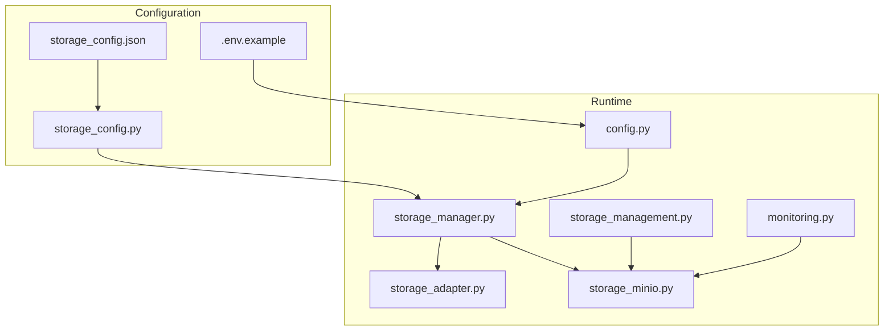
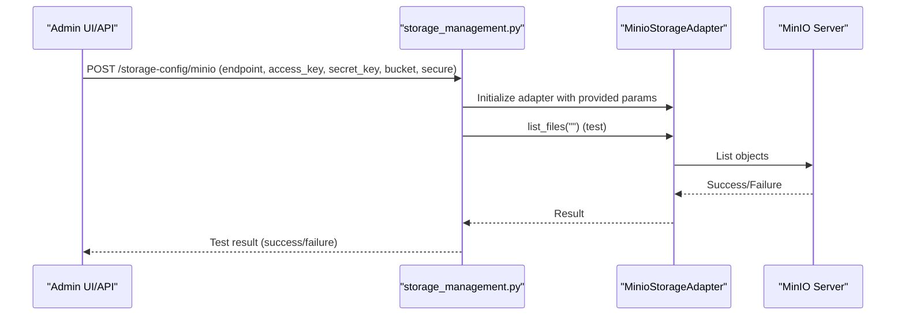
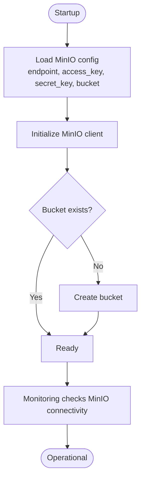
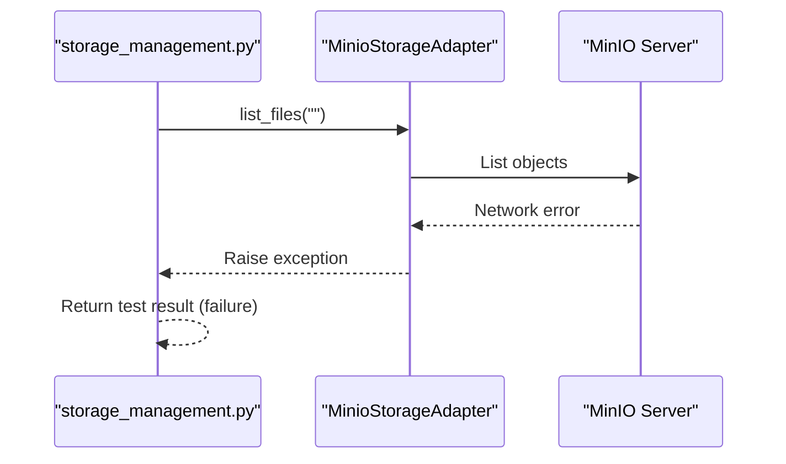
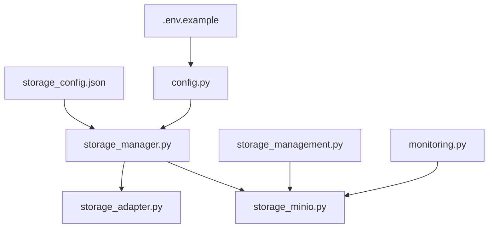

# MinIO Storage Configuration

<cite>
**Referenced Files in This Document**
- [storage_config.json](file://vertex-ar/config/storage_config.json)
- [.env.example](file://vertex-ar/.env.example)
- [storage_config.py](file://vertex-ar/storage_config.py)
- [storage_manager.py](file://vertex-ar/storage_manager.py)
- [storage_adapter.py](file://vertex-ar/storage_adapter.py)
- [storage_minio.py](file://vertex-ar/app/storage_minio.py)
- [config.py](file://vertex-ar/app/config.py)
- [storage_management.py](file://vertex-ar/app/api/storage_management.py)
- [monitoring.py](file://vertex-ar/app/monitoring.py)
</cite>

## Table of Contents
1. [Introduction](#introduction)
2. [Project Structure](#project-structure)
3. [Core Components](#core-components)
4. [Architecture Overview](#architecture-overview)
5. [Detailed Component Analysis](#detailed-component-analysis)
6. [Dependency Analysis](#dependency-analysis)
7. [Performance Considerations](#performance-considerations)
8. [Troubleshooting Guide](#troubleshooting-guide)
9. [Conclusion](#conclusion)

## Introduction
This document explains how to configure and operate MinIO as the primary or fallback storage for any content type in the application. It covers the MinIO section in storage_config.json, environment variables, configuration validation at startup, error recovery strategies, and performance tuning. It also clarifies compatibility with S3-compatible services beyond MinIO.

## Project Structure
MinIO configuration spans configuration files, environment variables, and runtime components:
- storage_config.json defines per-content-type storage selection and MinIO settings.
- .env.example documents environment variables for MinIO endpoints, credentials, and optional public URL.
- storage_config.py loads and manages the storage configuration.
- storage_manager.py selects adapters per content type and initializes MinIO adapters.
- storage_adapter.py provides a unified adapter interface and MinIO adapter implementation.
- storage_minio.py provides an async MinIO adapter used by APIs and monitoring.
- config.py reads environment variables for MinIO settings.
- storage_management.py exposes admin endpoints to test and save MinIO configurations.
- monitoring.py performs health checks against MinIO when configured.

**Diagram sources**
- [storage_config.json](file://vertex-ar/config/storage_config.json#L1-L49)
- [.env.example](file://vertex-ar/.env.example#L48-L71)
- [storage_config.py](file://vertex-ar/storage_config.py#L1-L203)
- [storage_manager.py](file://vertex-ar/storage_manager.py#L1-L120)
- [storage_adapter.py](file://vertex-ar/storage_adapter.py#L1-L120)
- [storage_minio.py](file://vertex-ar/app/storage_minio.py#L1-L120)
- [config.py](file://vertex-ar/app/config.py#L64-L70)
- [storage_management.py](file://vertex-ar/app/api/storage_management.py#L180-L241)
- [monitoring.py](file://vertex-ar/app/monitoring.py#L871-L902)

**Section sources**
- [storage_config.json](file://vertex-ar/config/storage_config.json#L1-L49)
- [.env.example](file://vertex-ar/.env.example#L48-L71)
- [storage_config.py](file://vertex-ar/storage_config.py#L1-L203)
- [storage_manager.py](file://vertex-ar/storage_manager.py#L1-L120)
- [storage_adapter.py](file://vertex-ar/storage_adapter.py#L1-L120)
- [storage_minio.py](file://vertex-ar/app/storage_minio.py#L1-L120)
- [config.py](file://vertex-ar/app/config.py#L64-L70)
- [storage_management.py](file://vertex-ar/app/api/storage_management.py#L180-L241)
- [monitoring.py](file://vertex-ar/app/monitoring.py#L871-L902)

## Core Components
- MinIO section in storage_config.json: controls whether MinIO is enabled and provides endpoint, access_key, secret_key, and bucket.
- Environment variables: MINIO_ENDPOINT, MINIO_ACCESS_KEY, MINIO_SECRET_KEY, MINIO_BUCKET, MINIO_SECURE, MINIO_PUBLIC_URL.
- Storage manager: selects adapters per content type and initializes MinIO adapter with values from storage_config.json.
- Unified adapter interface: abstracts local and remote storage operations.
- Async MinIO adapter: used by admin APIs and monitoring for connectivity checks.
- Startup validation: bucket existence check and health monitoring.

**Section sources**
- [storage_config.json](file://vertex-ar/config/storage_config.json#L42-L48)
- [.env.example](file://vertex-ar/.env.example#L48-L71)
- [storage_manager.py](file://vertex-ar/storage_manager.py#L49-L63)
- [storage_adapter.py](file://vertex-ar/storage_adapter.py#L19-L47)
- [storage_minio.py](file://vertex-ar/app/storage_minio.py#L10-L42)
- [monitoring.py](file://vertex-ar/app/monitoring.py#L871-L902)

## Architecture Overview
MinIO can be configured as:
- Primary storage for a content type by setting storage_type to minio in storage_config.json for that content type.
- Fallback storage when a content type’s storage_type is not minio, but MinIO is globally enabled and configured.

**Diagram sources**
- [storage_management.py](file://vertex-ar/app/api/storage_management.py#L180-L241)
- [storage_minio.py](file://vertex-ar/app/storage_minio.py#L10-L42)

## Detailed Component Analysis

### MinIO Section in storage_config.json
- enabled: Boolean flag to enable MinIO for the application-wide MinIO configuration.
- endpoint: MinIO server URL. Must not include scheme; the adapter strips http:// or https:// prefixes.
- access_key and secret_key: Credentials for MinIO authentication.
- bucket: Target storage container/bucket name.

These fields are read by the storage manager to initialize MinIO adapters for content types configured to use minio.

**Section sources**
- [storage_config.json](file://vertex-ar/config/storage_config.json#L42-L48)
- [storage_manager.py](file://vertex-ar/storage_manager.py#L55-L62)

### Environment Variables for MinIO
- MINIO_ENDPOINT: MinIO server host and port (no scheme). For local MinIO, use localhost:9000. For remote MinIO or S3-compatible services, use the public endpoint.
- MINIO_ACCESS_KEY and MINIO_SECRET_KEY: Credentials for authentication.
- MINIO_BUCKET: Target bucket name.
- MINIO_SECURE: Boolean string to enable HTTPS (true/false). Controls whether the MinIO client connects securely.
- MINIO_PUBLIC_URL: Optional public URL for constructing file access URLs. If unset, constructed from MINIO_SECURE and MINIO_ENDPOINT.

These variables are used by the adapter to initialize the MinIO client and construct public URLs.

**Section sources**
- [.env.example](file://vertex-ar/.env.example#L48-L71)
- [storage_adapter.py](file://vertex-ar/storage_adapter.py#L144-L163)
- [config.py](file://vertex-ar/app/config.py#L64-L70)

### Configuring MinIO as Primary Storage
To make MinIO the primary storage for a content type:
- Set content_types.<content_type>.storage_type to minio in storage_config.json.
- Ensure the minio section has enabled=true and valid endpoint, access_key, secret_key, bucket.
- Optionally set MINIO_SECURE to true for HTTPS/remote deployments.

The storage manager creates a MinioStorageAdapter for each content type configured to use minio.

**Section sources**
- [storage_manager.py](file://vertex-ar/storage_manager.py#L39-L63)
- [storage_config.json](file://vertex-ar/config/storage_config.json#L1-L49)

### Configuring MinIO as Fallback Storage
If a content type’s storage_type is not minio, the system falls back to local storage. There is no explicit fallback mechanism to MinIO for individual content types beyond this default behavior. To achieve a fallback-like behavior, you would need to adjust content_types.<content_type>.storage_type to minio.

**Section sources**
- [storage_manager.py](file://vertex-ar/storage_manager.py#L88-L93)

### Valid Endpoint Formats
- Local MinIO: localhost:9000
- Remote MinIO or S3-compatible: example.com:9000 or s3.amazonaws.com
- HTTPS endpoints: set MINIO_SECURE=true and use the public endpoint

The adapter strips http:// or https:// prefixes from MINIO_ENDPOINT and constructs URLs accordingly.

**Section sources**
- [.env.example](file://vertex-ar/.env.example#L52-L56)
- [storage_adapter.py](file://vertex-ar/storage_adapter.py#L144-L152)

### Secure Credential Management Practices
- Store MINIO_ACCESS_KEY and MINIO_SECRET_KEY in environment variables or secure configuration systems.
- Avoid committing secrets to version control.
- For production, rotate credentials regularly and restrict bucket policies to least privilege.
- Use HTTPS (MINIO_SECURE=true) for remote deployments.

**Section sources**
- [.env.example](file://vertex-ar/.env.example#L318-L339)
- [storage_adapter.py](file://vertex-ar/storage_adapter.py#L154-L157)

### Compatibility with S3-Compatible Services
MinIO is S3-compatible. The application can connect to:
- Self-hosted MinIO instances
- AWS S3
- Other S3-compatible providers (e.g., Cloudflare R2, DigitalOcean Spaces, Scaleway S3)

Configure MINIO_ENDPOINT to the provider’s endpoint and MINIO_SECURE according to the provider’s requirements.

**Section sources**
- [.env.example](file://vertex-ar/.env.example#L52-L56)
- [storage_adapter.py](file://vertex-ar/storage_adapter.py#L164-L173)

### Validation Checks at Startup
- Bucket existence: The adapter checks if the bucket exists and creates it if missing.
- Health monitoring: When STORAGE_TYPE=minio, the monitoring module initializes a MinioStorageAdapter and lists objects to verify connectivity.

**Diagram sources**
- [storage_adapter.py](file://vertex-ar/storage_adapter.py#L176-L187)
- [monitoring.py](file://vertex-ar/app/monitoring.py#L871-L902)

**Section sources**
- [storage_adapter.py](file://vertex-ar/storage_adapter.py#L176-L187)
- [monitoring.py](file://vertex-ar/app/monitoring.py#L871-L902)

### Error Recovery Strategies for Transient Network Issues
- The adapters catch S3 errors and return None or False for operations, allowing higher-level logic to handle failures gracefully.
- For admin APIs, the adapter attempts to list files to validate connectivity; on failure, it returns a test result indicating failure or suggests manual bucket creation.
- The monitoring module records MinIO health status and response time; transient failures will show unhealthy status until recovery.

**Diagram sources**
- [storage_management.py](file://vertex-ar/app/api/storage_management.py#L180-L241)
- [storage_minio.py](file://vertex-ar/app/storage_minio.py#L10-L42)

**Section sources**
- [storage_management.py](file://vertex-ar/app/api/storage_management.py#L180-L241)
- [storage_minio.py](file://vertex-ar/app/storage_minio.py#L10-L42)

### Performance Tuning Considerations
- Connection pooling and timeouts: The MinIO client used by the adapters does not expose explicit connection pool or timeout parameters in the current implementation. Operations rely on the underlying MinIO library defaults.
- Public URL construction: MINIO_PUBLIC_URL allows serving files via a CDN or reverse proxy, reducing direct MinIO load.
- Monitoring: The monitoring module measures MinIO response time during health checks, which can help detect latency issues.

**Section sources**
- [storage_adapter.py](file://vertex-ar/storage_adapter.py#L164-L173)
- [monitoring.py](file://vertex-ar/app/monitoring.py#L871-L902)

## Dependency Analysis
MinIO configuration and usage depend on:
- storage_config.json for per-content-type storage selection and MinIO settings.
- Environment variables for endpoint, credentials, bucket, secure flag, and public URL.
- storage_manager.py to instantiate MinioStorageAdapter for each content type.
- storage_adapter.py for the unified adapter interface and MinIO adapter implementation.
- storage_minio.py for async adapter used by admin APIs and monitoring.
- config.py for reading environment variables.
- storage_management.py for admin endpoints to test and save MinIO configuration.
- monitoring.py for health checks.

**Diagram sources**
- [storage_config.json](file://vertex-ar/config/storage_config.json#L1-L49)
- [.env.example](file://vertex-ar/.env.example#L48-L71)
- [storage_manager.py](file://vertex-ar/storage_manager.py#L39-L63)
- [storage_adapter.py](file://vertex-ar/storage_adapter.py#L19-L47)
- [storage_minio.py](file://vertex-ar/app/storage_minio.py#L10-L42)
- [config.py](file://vertex-ar/app/config.py#L64-L70)
- [storage_management.py](file://vertex-ar/app/api/storage_management.py#L180-L241)
- [monitoring.py](file://vertex-ar/app/monitoring.py#L871-L902)

**Section sources**
- [storage_config.json](file://vertex-ar/config/storage_config.json#L1-L49)
- [.env.example](file://vertex-ar/.env.example#L48-L71)
- [storage_manager.py](file://vertex-ar/storage_manager.py#L39-L63)
- [storage_adapter.py](file://vertex-ar/storage_adapter.py#L19-L47)
- [storage_minio.py](file://vertex-ar/app/storage_minio.py#L10-L42)
- [config.py](file://vertex-ar/app/config.py#L64-L70)
- [storage_management.py](file://vertex-ar/app/api/storage_management.py#L180-L241)
- [monitoring.py](file://vertex-ar/app/monitoring.py#L871-L902)

## Performance Considerations
- Use MINIO_SECURE=true for HTTPS endpoints to ensure secure transport.
- Set MINIO_PUBLIC_URL to a CDN or reverse proxy to reduce direct MinIO load and improve latency.
- Monitor MinIO health via the monitoring module to detect and address latency or downtime.
- For high-throughput scenarios, consider deploying MinIO close to the application or using a managed S3-compatible service.

[No sources needed since this section provides general guidance]

## Troubleshooting Guide
- Connectivity test failures: The admin API attempts to list files to validate connectivity. If it fails, the response indicates failure; ensure endpoint, credentials, and bucket are correct.
- Bucket not found: The adapter creates the bucket if it does not exist; if creation fails, verify permissions and endpoint.
- Health check failures: The monitoring module records MinIO health status and response time; investigate network issues or endpoint misconfiguration.

**Section sources**
- [storage_management.py](file://vertex-ar/app/api/storage_management.py#L180-L241)
- [storage_adapter.py](file://vertex-ar/storage_adapter.py#L176-L187)
- [monitoring.py](file://vertex-ar/app/monitoring.py#L871-L902)

## Conclusion
MinIO can be configured as the primary storage for any content type by setting storage_type to minio in storage_config.json and providing valid endpoint, credentials, and bucket. The system validates connectivity at startup and during monitoring, and supports S3-compatible services beyond MinIO. For production, use HTTPS, secure credentials, and monitor health to ensure reliability.