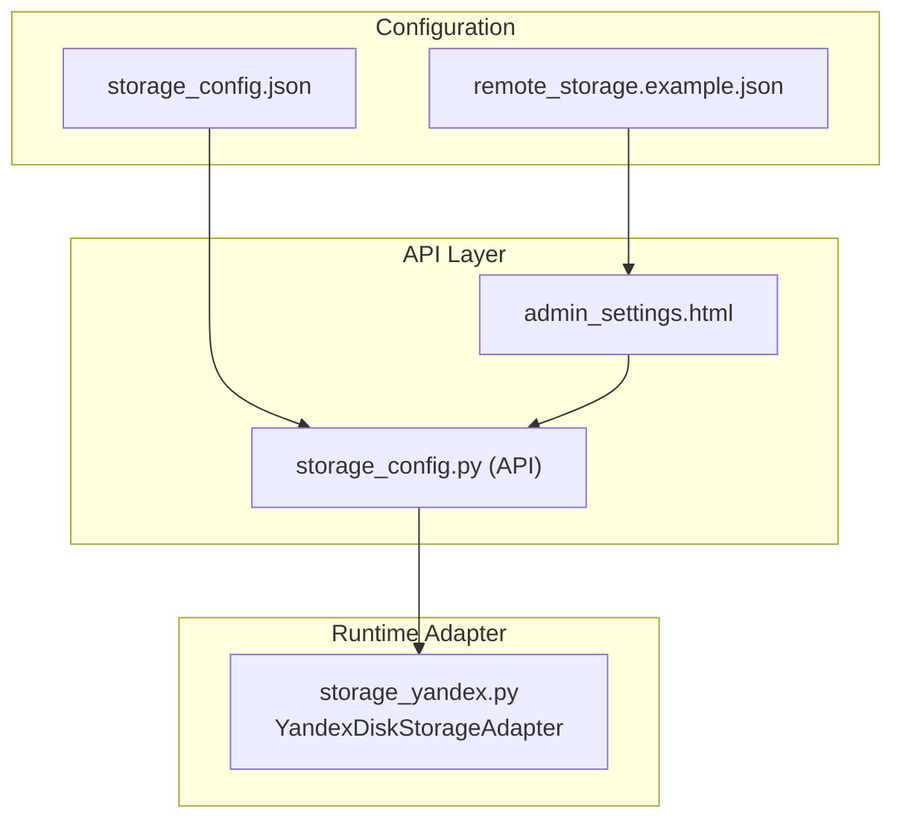
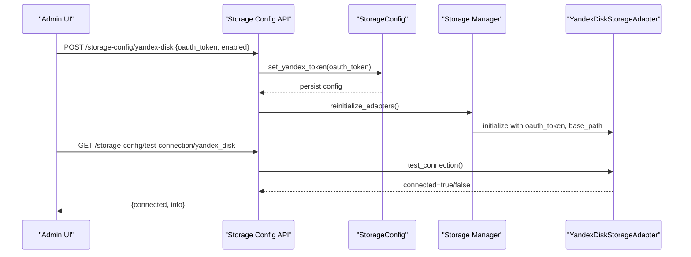
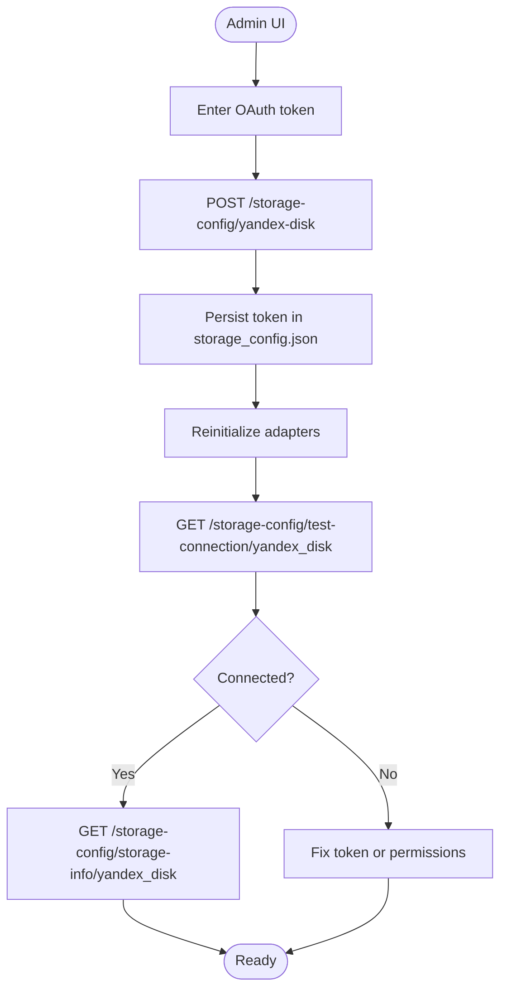
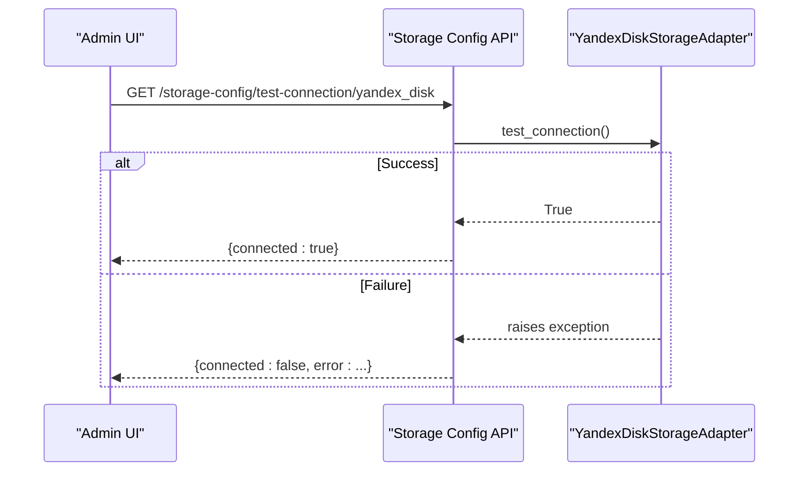
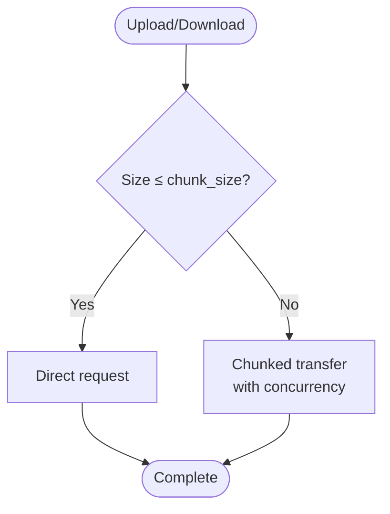
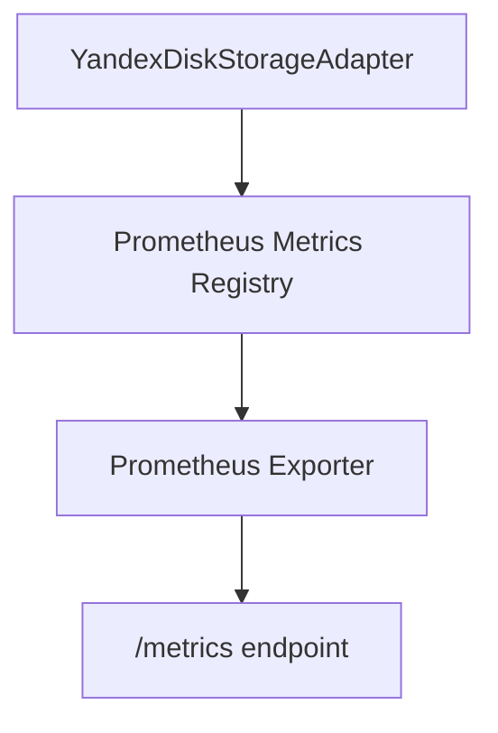
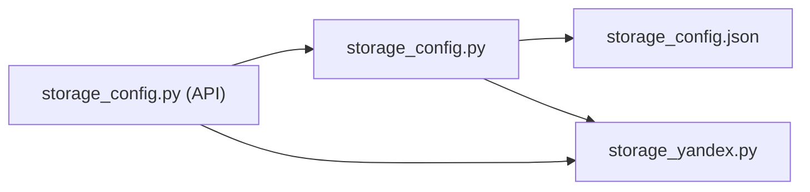

# Yandex.Disk Integration

<cite>
**Referenced Files in This Document**
- [storage_config.json](file://vertex-ar/config/storage_config.json)
- [remote_storage.example.json](file://vertex-ar/config/remote_storage.example.json)
- [storage_config.py](file://vertex-ar/storage_config.py)
- [storage_yandex.py](file://vertex-ar/app/storage_yandex.py)
- [storage_config.py (API)](file://vertex-ar/app/api/storage_config.py)
- [admin_settings.html](file://vertex-ar/templates/admin_settings.html)
- [YANDEX_STORAGE_OPTIMIZATION.md](file://docs/YANDEX_STORAGE_OPTIMIZATION.md)
- [YANDEX_STORAGE_OPTIMIZATION_SUMMARY.md](file://docs/YANDEX_STORAGE_OPTIMIZATION_SUMMARY.md)
</cite>

## Table of Contents
1. [Introduction](#introduction)
2. [Project Structure](#project-structure)
3. [Core Components](#core-components)
4. [Architecture Overview](#architecture-overview)
5. [Detailed Component Analysis](#detailed-component-analysis)
6. [Dependency Analysis](#dependency-analysis)
7. [Performance Considerations](#performance-considerations)
8. [Troubleshooting Guide](#troubleshooting-guide)
9. [Conclusion](#conclusion)

## Introduction
This document explains how Yandex.Disk is integrated into the system via configuration files and runtime components. It covers:
- The top-level yandex_disk object in storage_config.json and its role in enabling system-wide Yandex.Disk access
- Content-type-specific Yandex.Disk settings under content_types
- How to obtain and secure OAuth tokens, configure base_path values, and validate connectivity
- Differences between example and production configuration
- Retry mechanisms, monitoring, and error handling for Yandex.Disk synchronization

## Project Structure
The Yandex.Disk integration spans configuration files and runtime modules:
- Configuration files define storage types and Yandex.Disk settings
- API endpoints manage configuration updates and connectivity testing
- The Yandex.Disk adapter encapsulates API interactions, retries, and monitoring

**Diagram sources**
- [storage_config.json](file://vertex-ar/config/storage_config.json#L1-L49)
- [remote_storage.example.json](file://vertex-ar/config/remote_storage.example.json#L1-L14)
- [storage_config.py (API)](file://vertex-ar/app/api/storage_config.py#L158-L187)
- [admin_settings.html](file://vertex-ar/templates/admin_settings.html#L468-L518)
- [storage_yandex.py](file://vertex-ar/app/storage_yandex.py#L84-L145)

**Section sources**
- [storage_config.json](file://vertex-ar/config/storage_config.json#L1-L49)
- [remote_storage.example.json](file://vertex-ar/config/remote_storage.example.json#L1-L14)
- [storage_config.py (API)](file://vertex-ar/app/api/storage_config.py#L158-L187)
- [admin_settings.html](file://vertex-ar/templates/admin_settings.html#L468-L518)
- [storage_yandex.py](file://vertex-ar/app/storage_yandex.py#L84-L145)

## Core Components
- Top-level yandex_disk in storage_config.json controls system-wide Yandex.Disk availability and token:
  - oauth_token: OAuth token for Yandex.Disk API
  - enabled: Enables/disables Yandex.Disk globally
- Content-type-specific yandex_disk under content_types configures per-content-type Yandex.Disk usage:
  - enabled: Enable Yandex.Disk for a specific content type
  - base_path: Remote base path for that content type

These settings are persisted and reloaded by the configuration manager and used by the storage manager to initialize adapters.

**Section sources**
- [storage_config.json](file://vertex-ar/config/storage_config.json#L38-L41)
- [storage_config.json](file://vertex-ar/config/storage_config.json#L5-L31)
- [storage_config.py](file://vertex-ar/storage_config.py#L155-L167)
- [storage_config.py](file://vertex-ar/storage_config.py#L122-L141)

## Architecture Overview
The integration follows a layered approach:
- Configuration layer: storage_config.json and remote_storage.example.json define settings
- API layer: endpoints to update configuration and test connectivity
- Runtime adapter: YandexDiskStorageAdapter performs API calls, retries, and monitoring

**Diagram sources**
- [storage_config.py (API)](file://vertex-ar/app/api/storage_config.py#L158-L187)
- [storage_config.py](file://vertex-ar/storage_config.py#L155-L167)
- [storage_yandex.py](file://vertex-ar/app/storage_yandex.py#L816-L833)
- [admin_settings.html](file://vertex-ar/templates/admin_settings.html#L906-L955)

## Detailed Component Analysis

### Top-Level yandex_disk Configuration
- Purpose: Enables system-wide Yandex.Disk access and stores the OAuth token
- Fields:
  - oauth_token: OAuth token for Yandex.Disk API
  - enabled: Boolean to enable/disable Yandex.Disk globally
- Behavior:
  - Setting oauth_token also sets enabled to true
  - Used by the adapter to authorize API requests

**Section sources**
- [storage_config.json](file://vertex-ar/config/storage_config.json#L38-L41)
- [storage_config.py](file://vertex-ar/storage_config.py#L155-L167)
- [storage_yandex.py](file://vertex-ar/app/storage_yandex.py#L169-L173)

### Content-Type-Specific Yandex.Disk Settings
- Location: Under content_types for each content type (e.g., portraits, videos, previews, nft_markers)
- Fields:
  - enabled: Enable Yandex.Disk for this content type
  - base_path: Remote base path for this content type
- Effect: Determines whether and where files for a content type are stored on Yandex.Disk

**Section sources**
- [storage_config.json](file://vertex-ar/config/storage_config.json#L5-L31)
- [storage_config.py](file://vertex-ar/storage_config.py#L122-L141)

### Obtaining and Securing OAuth Tokens
- Obtain OAuth token from Yandex.Disk API
- Secure token handling:
  - The example configuration file contains placeholders for tokens
  - The admin UI allows saving tokens and testing connectivity
  - The configuration persists the token and enables Yandex.Disk automatically when a token is set

**Diagram sources**
- [remote_storage.example.json](file://vertex-ar/config/remote_storage.example.json#L1-L14)
- [admin_settings.html](file://vertex-ar/templates/admin_settings.html#L906-L955)
- [storage_config.py (API)](file://vertex-ar/app/api/storage_config.py#L158-L187)
- [storage_config.py](file://vertex-ar/storage_config.py#L155-L167)
- [storage_yandex.py](file://vertex-ar/app/storage_yandex.py#L816-L833)

**Section sources**
- [remote_storage.example.json](file://vertex-ar/config/remote_storage.example.json#L1-L14)
- [admin_settings.html](file://vertex-ar/templates/admin_settings.html#L468-L518)
- [admin_settings.html](file://vertex-ar/templates/admin_settings.html#L906-L955)
- [storage_config.py (API)](file://vertex-ar/app/api/storage_config.py#L158-L187)
- [storage_config.py](file://vertex-ar/storage_config.py#L155-L167)

### Setting base_path Values
- base_path defines the remote directory for each content type
- Example values in storage_config.json:
  - portraits: vertex-ar/portraits
  - videos: vertex-ar/videos
  - previews: vertex-ar/previews
  - nft_markers: vertex-ar/nft_markers
- These paths are combined with file paths during uploads and downloads

**Section sources**
- [storage_config.json](file://vertex-ar/config/storage_config.json#L5-L31)
- [storage_yandex.py](file://vertex-ar/app/storage_yandex.py#L363-L366)

### Difference Between Example and Production Usage
- remote_storage.example.json contains placeholders for tokens and optional provider settings
- storage_config.json contains the actual runtime configuration for the system
- Example usage:
  - Use remote_storage.example.json to bootstrap initial settings
  - Populate storage_config.json with real values for production

**Section sources**
- [remote_storage.example.json](file://vertex-ar/config/remote_storage.example.json#L1-L14)
- [storage_config.json](file://vertex-ar/config/storage_config.json#L1-L49)

### Connectivity Validation and Authentication Errors
- Validation:
  - GET /storage-config/test-connection/yandex_disk tests connectivity
  - The adapter’s test_connection() calls the Yandex.Disk API root endpoint
- Authentication errors:
  - Unauthorized or invalid token leads to HTTP errors captured and logged
  - The API surfaces connection status and error messages to the admin UI

**Diagram sources**
- [storage_config.py (API)](file://vertex-ar/app/api/storage_config.py#L220-L256)
- [storage_yandex.py](file://vertex-ar/app/storage_yandex.py#L816-L833)

**Section sources**
- [storage_config.py (API)](file://vertex-ar/app/api/storage_config.py#L220-L256)
- [storage_yandex.py](file://vertex-ar/app/storage_yandex.py#L272-L305)
- [storage_yandex.py](file://vertex-ar/app/storage_yandex.py#L816-L833)

### Retry Mechanisms for Failed Uploads
- The adapter uses a persistent session with retry strategy for HTTP requests
- Retry policy:
  - Retries on specific status codes and methods
  - Backoff factor and allowed methods configured
- Uploads and downloads:
  - Small files use direct requests
  - Large files use chunked uploads/downloads with concurrency control

**Diagram sources**
- [storage_yandex.py](file://vertex-ar/app/storage_yandex.py#L146-L174)
- [storage_yandex.py](file://vertex-ar/app/storage_yandex.py#L376-L451)
- [storage_yandex.py](file://vertex-ar/app/storage_yandex.py#L506-L560)

**Section sources**
- [storage_yandex.py](file://vertex-ar/app/storage_yandex.py#L146-L174)
- [storage_yandex.py](file://vertex-ar/app/storage_yandex.py#L376-L451)
- [storage_yandex.py](file://vertex-ar/app/storage_yandex.py#L506-L560)

### Monitoring Yandex.Disk Synchronization Status
- Prometheus metrics are exported for Yandex.Disk operations:
  - Operation counters and durations
  - Error counters by type
  - Bytes transferred and chunks
  - Directory cache hits/misses and size
- Metrics are exposed via the Prometheus exporter and can be scraped at the standard endpoint

**Diagram sources**
- [storage_yandex.py](file://vertex-ar/app/storage_yandex.py#L176-L247)
- [YANDEX_STORAGE_OPTIMIZATION.md](file://docs/YANDEX_STORAGE_OPTIMIZATION.md#L188-L235)
- [YANDEX_STORAGE_OPTIMIZATION_SUMMARY.md](file://docs/YANDEX_STORAGE_OPTIMIZATION_SUMMARY.md#L88-L114)

**Section sources**
- [storage_yandex.py](file://vertex-ar/app/storage_yandex.py#L176-L247)
- [YANDEX_STORAGE_OPTIMIZATION.md](file://docs/YANDEX_STORAGE_OPTIMIZATION.md#L188-L235)
- [YANDEX_STORAGE_OPTIMIZATION_SUMMARY.md](file://docs/YANDEX_STORAGE_OPTIMIZATION_SUMMARY.md#L88-L114)

## Dependency Analysis
- Configuration persistence:
  - storage_config.py reads/writes storage_config.json and exposes getters/setters for Yandex.Disk settings
- API endpoints:
  - storage_config.py (API) updates configuration and triggers adapter reinitialization
- Adapter:
  - storage_yandex.py implements Yandex.Disk operations, retries, and monitoring

**Diagram sources**
- [storage_config.py](file://vertex-ar/storage_config.py#L1-L107)
- [storage_config.py (API)](file://vertex-ar/app/api/storage_config.py#L158-L187)
- [storage_yandex.py](file://vertex-ar/app/storage_yandex.py#L84-L145)

**Section sources**
- [storage_config.py](file://vertex-ar/storage_config.py#L1-L107)
- [storage_config.py (API)](file://vertex-ar/app/api/storage_config.py#L158-L187)
- [storage_yandex.py](file://vertex-ar/app/storage_yandex.py#L84-L145)

## Performance Considerations
- Connection pooling and retries reduce overhead and improve resilience
- Chunked transfers minimize memory usage for large files
- Directory cache reduces redundant API calls
- Tuning parameters:
  - Upload concurrency and chunk size
  - Session pool sizes
  - Request timeouts

**Section sources**
- [storage_yandex.py](file://vertex-ar/app/storage_yandex.py#L146-L174)
- [storage_yandex.py](file://vertex-ar/app/storage_yandex.py#L376-L451)
- [YANDEX_STORAGE_OPTIMIZATION_SUMMARY.md](file://docs/YANDEX_STORAGE_OPTIMIZATION_SUMMARY.md#L59-L87)

## Troubleshooting Guide
Common issues and resolutions:
- Invalid OAuth token:
  - Use the admin UI to save the token and test connectivity
  - Review logs for HTTP error types and status codes
- Connectivity failures:
  - Verify enabled flag and token presence
  - Check network and Yandex.Disk API availability
- Monitoring:
  - Inspect Prometheus metrics for error rates and latency
  - Use cache statistics to diagnose directory existence checks

**Section sources**
- [admin_settings.html](file://vertex-ar/templates/admin_settings.html#L906-L955)
- [storage_yandex.py](file://vertex-ar/app/storage_yandex.py#L272-L305)
- [YANDEX_STORAGE_OPTIMIZATION.md](file://docs/YANDEX_STORAGE_OPTIMIZATION.md#L188-L235)

## Conclusion
The Yandex.Disk integration is configured centrally via storage_config.json and validated through API endpoints. The adapter provides robust retry and monitoring capabilities, while the admin UI streamlines token management and connectivity testing. Properly setting base_path and enabling Yandex.Disk per content type ensures organized and scalable remote storage.