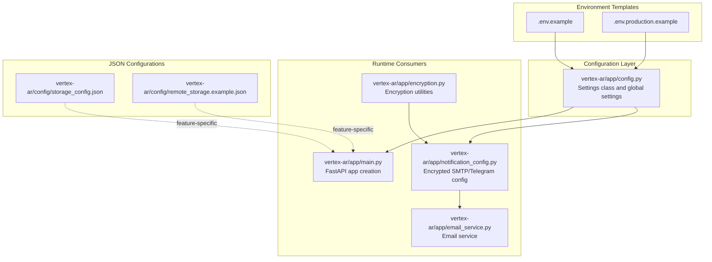
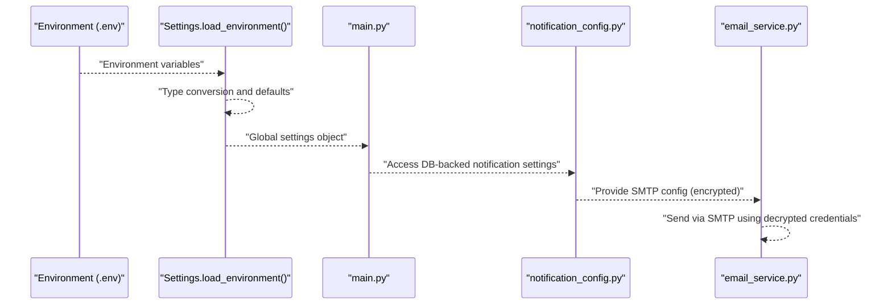
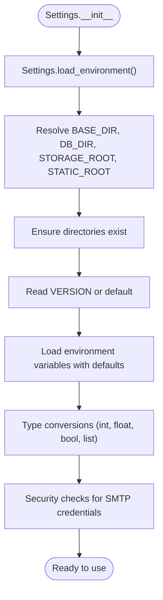
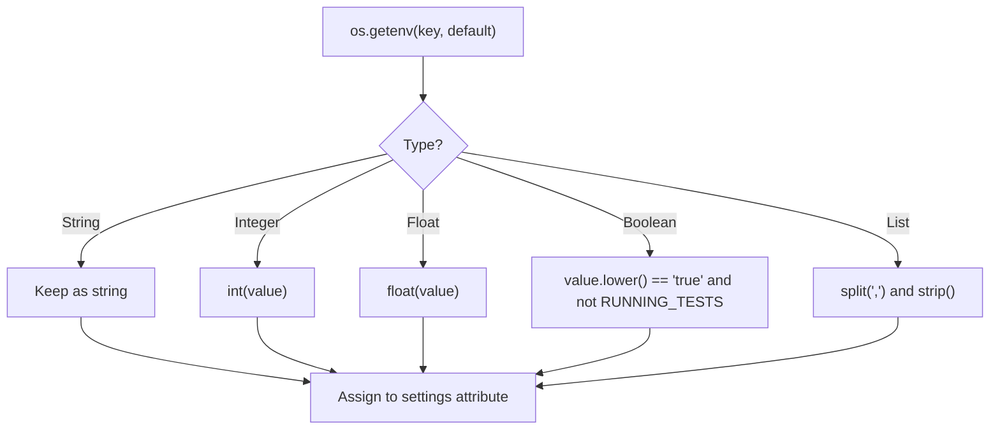
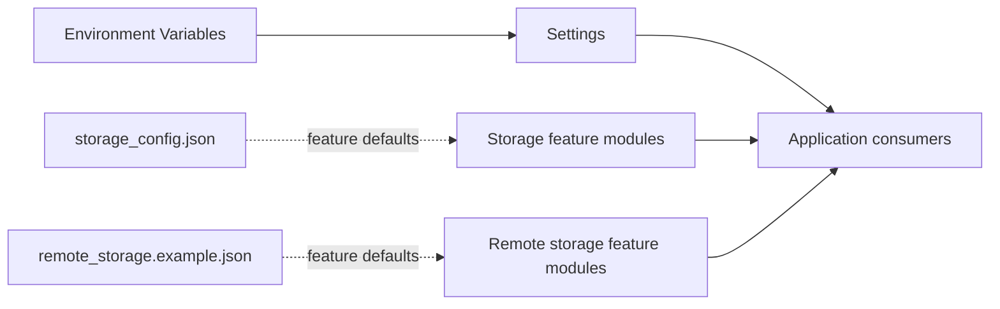
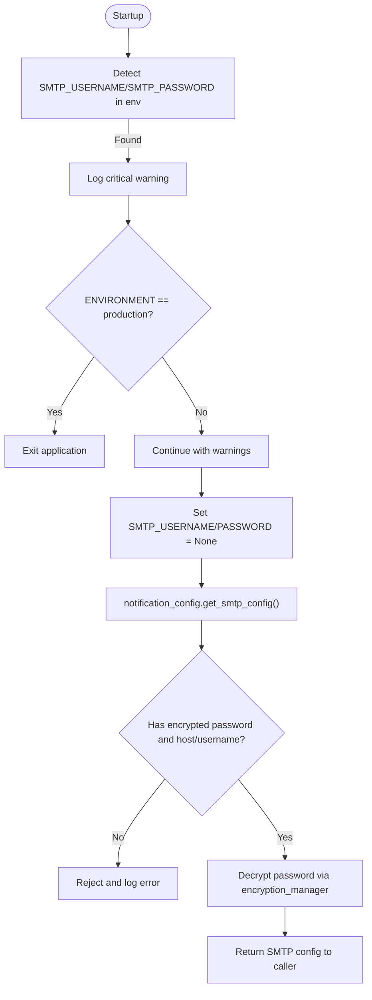
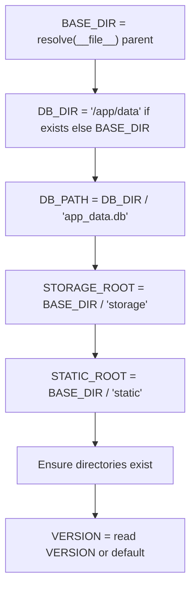
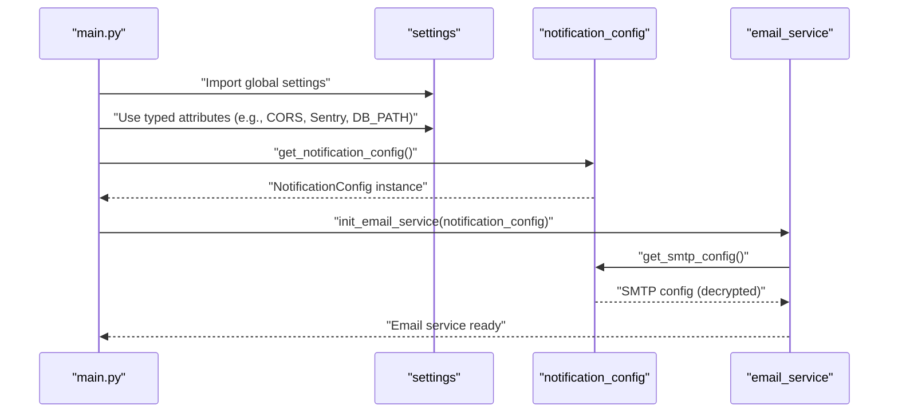
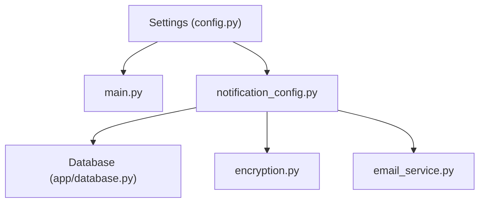

# Runtime Configuration Loading

<cite>
**Referenced Files in This Document**
- [config.py](file://vertex-ar/app/config.py)
- [.env.example](file://vertex-ar/.env.example)
- [.env.production.example](file://vertex-ar/.env.production.example)
- [main.py](file://vertex-ar/app/main.py)
- [notification_config.py](file://vertex-ar/app/notification_config.py)
- [email_service.py](file://vertex-ar/app/email_service.py)
- [encryption.py](file://vertex-ar/app/encryption.py)
- [storage_config.json](file://vertex-ar/config/storage_config.json)
- [remote_storage.example.json](file://vertex-ar/config/remote_storage.example.json)
- [logging_setup.py](file://vertex-ar/logging_setup.py)
- [SMTP_SECURITY_ENHANCEMENT_SUMMARY.md](file://docs/SMTP_SECURITY_ENHANCEMENT_SUMMARY.md)
- [EMAIL_MIGRATION.md](file://docs/EMAIL_MIGRATION.md)
</cite>

## Table of Contents
1. [Introduction](#introduction)
2. [Project Structure](#project-structure)
3. [Core Components](#core-components)
4. [Architecture Overview](#architecture-overview)
5. [Detailed Component Analysis](#detailed-component-analysis)
6. [Dependency Analysis](#dependency-analysis)
7. [Performance Considerations](#performance-considerations)
8. [Troubleshooting Guide](#troubleshooting-guide)
9. [Conclusion](#conclusion)

## Introduction
This document explains the runtime configuration loading system implemented in the application’s configuration module. It focuses on the Settings class design pattern, lazy loading of environment variables, initialization behavior, type conversions, prioritization of configuration sources, and integration with JSON configuration files. It also covers security-sensitive handling for SMTP credentials, path resolution and directory creation, version management, and performance/error handling characteristics.

## Project Structure
The configuration system centers around a single module that loads environment variables and exposes a global settings object consumed by the application. Supporting files include environment templates, JSON configuration files for storage, and components that consume configuration values at runtime.

**Diagram sources**
- [config.py](file://vertex-ar/app/config.py#L1-L244)
- [.env.example](file://vertex-ar/.env.example#L1-L339)
- [.env.production.example](file://vertex-ar/.env.production.example#L1-L93)
- [main.py](file://vertex-ar/app/main.py#L1-L200)
- [notification_config.py](file://vertex-ar/app/notification_config.py#L1-L221)
- [email_service.py](file://vertex-ar/app/email_service.py#L1-L200)
- [encryption.py](file://vertex-ar/app/encryption.py#L1-L84)
- [storage_config.json](file://vertex-ar/config/storage_config.json#L1-L49)
- [remote_storage.example.json](file://vertex-ar/config/remote_storage.example.json#L1-L14)

**Section sources**
- [config.py](file://vertex-ar/app/config.py#L1-L244)
- [.env.example](file://vertex-ar/.env.example#L1-L339)
- [.env.production.example](file://vertex-ar/.env.production.example#L1-L93)
- [main.py](file://vertex-ar/app/main.py#L1-L200)
- [notification_config.py](file://vertex-ar/app/notification_config.py#L1-L221)
- [email_service.py](file://vertex-ar/app/email_service.py#L1-L200)
- [encryption.py](file://vertex-ar/app/encryption.py#L1-L84)
- [storage_config.json](file://vertex-ar/config/storage_config.json#L1-L49)
- [remote_storage.example.json](file://vertex-ar/config/remote_storage.example.json#L1-L14)

## Core Components
- Settings class: Central configuration holder that lazily loads environment variables during initialization and exposes typed attributes for the application.
- Global settings instance: Instantiated once and imported by other modules.
- Environment templates: Provide documented variables for development and production.
- JSON configuration files: Provide structured defaults for storage and remote storage features.
- Notification configuration: Loads encrypted credentials from the database and enforces security policies.
- Email service: Consumes notification configuration for SMTP transport.

**Section sources**
- [config.py](file://vertex-ar/app/config.py#L1-L244)
- [.env.example](file://vertex-ar/.env.example#L1-L339)
- [storage_config.json](file://vertex-ar/config/storage_config.json#L1-L49)
- [notification_config.py](file://vertex-ar/app/notification_config.py#L1-L221)
- [email_service.py](file://vertex-ar/app/email_service.py#L1-L200)

## Architecture Overview
The configuration architecture follows a layered approach:
- Environment variables provide runtime configuration with sensible defaults.
- The Settings class performs lazy initialization and type conversion.
- JSON configuration files supply feature-level defaults (e.g., storage).
- Security-sensitive values (e.g., SMTP credentials) are enforced to be stored encrypted in the database and accessed only via controlled APIs.
- Runtime consumers import the global settings instance and use typed attributes.

**Diagram sources**
- [config.py](file://vertex-ar/app/config.py#L12-L244)
- [main.py](file://vertex-ar/app/main.py#L1-L200)
- [notification_config.py](file://vertex-ar/app/notification_config.py#L1-L221)
- [email_service.py](file://vertex-ar/app/email_service.py#L1-L200)

## Detailed Component Analysis

### Settings Class Design Pattern
- Lazy loading: The Settings constructor calls the environment loader, which sets all typed attributes from environment variables and defaults.
- Directory creation: Paths for database, storage, and static assets are resolved and ensured to exist.
- Version management: Reads a VERSION file or falls back to a default.
- Type conversions: Strings are converted to integers, floats, booleans, lists, and computed constants (e.g., MAX_FILE_SIZE).
- Security enforcement: Detects deprecated environment-based SMTP credentials and enforces production startup policy.

```mermaid
classDiagram
class Settings {
+BASE_DIR
+DB_DIR
+DB_PATH
+STORAGE_ROOT
+STATIC_ROOT
+VERSION
+BASE_URL
+INTERNAL_HEALTH_URL
+APP_HOST
+APP_PORT
+SECRET_KEY
+SESSION_TIMEOUT_MINUTES
+AUTH_MAX_ATTEMPTS
+AUTH_LOCKOUT_MINUTES
+RUNNING_TESTS
+RATE_LIMIT_ENABLED
+GLOBAL_RATE_LIMIT
+AUTH_RATE_LIMIT
+UPLOAD_RATE_LIMIT
+CORS_ORIGINS
+SENTRY_DSN
+SENTRY_TRACES_SAMPLE_RATE
+SENTRY_ENVIRONMENT
+STORAGE_TYPE
+MINIO_ENDPOINT
+MINIO_ACCESS_KEY
+MINIO_SECRET_KEY
+MINIO_BUCKET
+TELEGRAM_BOT_TOKEN
+TELEGRAM_CHAT_ID
+SMTP_SERVER
+SMTP_PORT
+EMAIL_FROM
+ADMIN_EMAILS
+SMTP_USERNAME
+SMTP_PASSWORD
+CACHE_ENABLED
+REDIS_URL
+CACHE_TTL
+CACHE_NAMESPACE
+CACHE_MAX_SIZE
+CACHE_PAGE_SIZE_DEFAULT
+CACHE_PAGE_SIZE_MAX
+ALERTING_ENABLED
+CPU_THRESHOLD
+MEMORY_THRESHOLD
+DISK_THRESHOLD
+HEALTH_CHECK_INTERVAL
+WEEKLY_REPORT_DAY
+WEEKLY_REPORT_TIME
+MONITORING_CONSECUTIVE_FAILURES
+MONITORING_DEDUP_WINDOW
+MONITORING_MAX_RUNTIME
+HEALTH_CHECK_COOLDOWN
+ALERT_RECOVERY_MINUTES
+NOTIFICATION_SYNC_INTERVAL
+NOTIFICATION_CLEANUP_INTERVAL
+NOTIFICATION_RETENTION_DAYS
+NOTIFICATION_AUTO_ARCHIVE_HOURS
+NOTIFICATION_DEDUP_WINDOW
+WEBHOOK_URLS
+WEBHOOK_TIMEOUT
+WEBHOOK_MAX_RETRIES
+NOTIFICATION_TELEGRAM_ENABLED
+NOTIFICATION_EMAIL_ENABLED
+NOTIFICATION_WEBHOOK_ENABLED
+CRITICAL_NOTIFICATION_ROUTES
+HIGH_NOTIFICATION_ROUTES
+MEDIUM_NOTIFICATION_ROUTES
+LOW_NOTIFICATION_ROUTES
+MAX_FILE_SIZE
+ALLOWED_IMAGE_TYPES
+ALLOWED_VIDEO_TYPES
+DEFAULT_ADMIN_USERNAME
+DEFAULT_ADMIN_PASSWORD
+DEFAULT_ADMIN_EMAIL
+DEFAULT_ADMIN_FULL_NAME
+VIDEO_SCHEDULER_ENABLED
+VIDEO_SCHEDULER_CHECK_INTERVAL
+VIDEO_SCHEDULER_ROTATION_INTERVAL
+VIDEO_SCHEDULER_ARCHIVE_AFTER_HOURS
+VIDEO_SCHEDULER_NOTIFICATIONS_ENABLED
+LIFECYCLE_SCHEDULER_ENABLED
+LIFECYCLE_CHECK_INTERVAL_SECONDS
+LIFECYCLE_NOTIFICATIONS_ENABLED
+EMAIL_RETRY_MAX_ATTEMPTS
+EMAIL_RETRY_DELAYS
+EMAIL_DEFAULT_FROM
+EMAIL_QUEUE_WORKERS
+YANDEX_REQUEST_TIMEOUT
+YANDEX_CHUNK_SIZE_MB
+YANDEX_UPLOAD_CONCURRENCY
+YANDEX_DIRECTORY_CACHE_TTL
+YANDEX_DIRECTORY_CACHE_SIZE
+YANDEX_SESSION_POOL_CONNECTIONS
+YANDEX_SESSION_POOL_MAXSIZE
+UVICORN_WORKERS
+UVICORN_KEEPALIVE_TIMEOUT
+UVICORN_TIMEOUT_KEEP_ALIVE
+UVICORN_LIMIT_CONCURRENCY
+UVICORN_BACKLOG
+UVICORN_PROXY_HEADERS
+UVICORN_TIMEOUT_GRACEFUL_SHUTDOWN
+WEB_HEALTH_CHECK_TIMEOUT
+WEB_HEALTH_CHECK_USE_HEAD
+WEB_HEALTH_CHECK_COOLDOWN
+MONITORING_PROCESS_HISTORY_SIZE
+MONITORING_SLOW_QUERY_THRESHOLD_MS
+MONITORING_SLOW_QUERY_RING_SIZE
+MONITORING_SLOW_ENDPOINT_THRESHOLD_MS
+MONITORING_SLOW_ENDPOINT_RING_SIZE
+MONITORING_TRACEMALLOC_ENABLED
+MONITORING_TRACEMALLOC_THRESHOLD_MB
+MONITORING_TRACEMALLOC_TOP_N
+__init__()
+load_environment()
}
```

**Diagram sources**
- [config.py](file://vertex-ar/app/config.py#L1-L244)

**Section sources**
- [config.py](file://vertex-ar/app/config.py#L12-L244)

### Initialization Process: __init__ and load_environment
- __init__: Immediately invokes the environment loader to populate all typed settings.
- load_environment: Resolves base paths, creates directories, reads version, and loads environment variables with defaults and type conversions.

**Diagram sources**
- [config.py](file://vertex-ar/app/config.py#L12-L244)

**Section sources**
- [config.py](file://vertex-ar/app/config.py#L12-L244)

### Configuration Value Prioritization and Type Conversion
- Prioritization: Environment variables override defaults. Defaults are embedded in the loader.
- Type conversion:
  - Integers: Ports, limits, sizes, counts.
  - Floats: Thresholds, timeouts, sizes.
  - Booleans: Lowercase comparison for “true/false”, with explicit “1” for tests.
  - Lists: Split by commas and strip whitespace.
  - Special: MAX_FILE_SIZE computed from megabytes; EMAIL_RETRY_DELAYS parsed as floats; CPU count-derived default workers.
- Environment templates: Provide comprehensive documented variables for development and production.

**Diagram sources**
- [config.py](file://vertex-ar/app/config.py#L35-L240)
- [.env.example](file://vertex-ar/.env.example#L1-L339)

**Section sources**
- [config.py](file://vertex-ar/app/config.py#L35-L240)
- [.env.example](file://vertex-ar/.env.example#L1-L339)

### Integration Between Environment Variables and JSON Configuration Files
- Environment variables drive runtime behavior and defaults.
- JSON configuration files provide feature-level defaults (e.g., storage content types, backup settings, Yandex/MinIO toggles). While not directly merged into the Settings object, they inform feature behavior and can be used by feature modules (e.g., storage managers) to align with application configuration.

**Diagram sources**
- [config.py](file://vertex-ar/app/config.py#L1-L244)
- [storage_config.json](file://vertex-ar/config/storage_config.json#L1-L49)
- [remote_storage.example.json](file://vertex-ar/config/remote_storage.example.json#L1-L14)

**Section sources**
- [storage_config.json](file://vertex-ar/config/storage_config.json#L1-L49)
- [remote_storage.example.json](file://vertex-ar/config/remote_storage.example.json#L1-L14)
- [config.py](file://vertex-ar/app/config.py#L1-L244)

### Security-Sensitive Configuration Handling: SMTP Credentials
- Detection: The loader checks for deprecated environment-based SMTP credentials and logs a critical warning.
- Production enforcement: In production, startup exits immediately if environment-based SMTP credentials are present.
- Runtime protection: The settings object never exposes SMTP_USERNAME or SMTP_PASSWORD; they are set to None.
- Database-backed access: Notification configuration retrieves encrypted credentials from the database, decrypts them, and enforces guardrails before returning configuration to callers.

**Diagram sources**
- [config.py](file://vertex-ar/app/config.py#L81-L113)
- [notification_config.py](file://vertex-ar/app/notification_config.py#L83-L145)
- [encryption.py](file://vertex-ar/app/encryption.py#L1-L84)
- [SMTP_SECURITY_ENHANCEMENT_SUMMARY.md](file://docs/SMTP_SECURITY_ENHANCEMENT_SUMMARY.md#L1-L320)
- [EMAIL_MIGRATION.md](file://docs/EMAIL_MIGRATION.md#L1-L43)

**Section sources**
- [config.py](file://vertex-ar/app/config.py#L81-L113)
- [notification_config.py](file://vertex-ar/app/notification_config.py#L83-L145)
- [encryption.py](file://vertex-ar/app/encryption.py#L1-L84)
- [SMTP_SECURITY_ENHANCEMENT_SUMMARY.md](file://docs/SMTP_SECURITY_ENHANCEMENT_SUMMARY.md#L1-L320)
- [EMAIL_MIGRATION.md](file://docs/EMAIL_MIGRATION.md#L1-L43)

### Path Resolution, Version Management, and Directory Creation
- Path resolution: BASE_DIR is derived from the module path; DB_DIR is either a container path or the application base; STORAGE_ROOT and STATIC_ROOT are subdirectories under BASE_DIR.
- Version management: VERSION is read from a VERSION file; if absent, a default is used.
- Directory creation: Ensures DB_DIR, STORAGE_ROOT, and STATIC_ROOT exist before use.

**Diagram sources**
- [config.py](file://vertex-ar/app/config.py#L18-L33)
- [config.py](file://vertex-ar/app/config.py#L237-L240)

**Section sources**
- [config.py](file://vertex-ar/app/config.py#L18-L33)
- [config.py](file://vertex-ar/app/config.py#L237-L240)

### Runtime Consumers and Usage Patterns
- Application startup: The main application imports the global settings instance and uses attributes for CORS, Sentry, static mounts, and scheduling.
- Email service: Retrieves SMTP configuration from the notification configuration layer, which decrypts credentials from the database and enforces guardrails.

**Diagram sources**
- [main.py](file://vertex-ar/app/main.py#L1-L200)
- [notification_config.py](file://vertex-ar/app/notification_config.py#L213-L221)
- [email_service.py](file://vertex-ar/app/email_service.py#L270-L292)

**Section sources**
- [main.py](file://vertex-ar/app/main.py#L1-L200)
- [notification_config.py](file://vertex-ar/app/notification_config.py#L213-L221)
- [email_service.py](file://vertex-ar/app/email_service.py#L270-L292)

## Dependency Analysis
- Settings depends on environment variables and filesystem paths.
- Main application depends on Settings for runtime configuration.
- Notification configuration depends on Database and Encryption Manager to retrieve and decrypt credentials.
- Email service depends on Notification configuration for SMTP transport.

**Diagram sources**
- [config.py](file://vertex-ar/app/config.py#L1-L244)
- [main.py](file://vertex-ar/app/main.py#L1-L200)
- [notification_config.py](file://vertex-ar/app/notification_config.py#L1-L221)
- [email_service.py](file://vertex-ar/app/email_service.py#L1-L200)
- [encryption.py](file://vertex-ar/app/encryption.py#L1-L84)

**Section sources**
- [config.py](file://vertex-ar/app/config.py#L1-L244)
- [main.py](file://vertex-ar/app/main.py#L1-L200)
- [notification_config.py](file://vertex-ar/app/notification_config.py#L1-L221)
- [email_service.py](file://vertex-ar/app/email_service.py#L1-L200)
- [encryption.py](file://vertex-ar/app/encryption.py#L1-L84)

## Performance Considerations
- Lazy initialization: Settings is constructed once at import time, avoiding repeated environment parsing.
- Minimal I/O: Version file is read once; directories are created once.
- Type conversions: Parsing is O(n) per setting; negligible overhead.
- Worker scaling: Uvicorn worker count is derived from CPU count with a formula, balancing throughput and resource usage.
- Email queue: Persistent and in-memory queues provide resilience and performance; metrics are tracked for observability.

[No sources needed since this section provides general guidance]

## Troubleshooting Guide
- Missing or invalid values:
  - If a required environment variable is missing, the loader applies a default; verify the environment template for expected keys.
  - For numeric values, ensure the environment contains valid integers/floats; otherwise, defaults apply.
- SMTP credentials:
  - If deprecated environment-based SMTP credentials are detected, warnings are logged; in production, the application exits. Migrate to database-backed encrypted storage via the admin UI.
  - Confirm that the database contains encrypted credentials and that the notification configuration returns a valid SMTP config.
- Logging sensitive data:
  - The logging system redacts sensitive fields; confirm that logs show redacted values and that the environment variables are not exposed in process environment.
- Startup failures:
  - Review the critical warning and production exit behavior; remove deprecated SMTP environment variables and configure via admin UI.

**Section sources**
- [config.py](file://vertex-ar/app/config.py#L81-L113)
- [notification_config.py](file://vertex-ar/app/notification_config.py#L83-L145)
- [logging_setup.py](file://vertex-ar/logging_setup.py#L75-L122)
- [SMTP_SECURITY_ENHANCEMENT_SUMMARY.md](file://docs/SMTP_SECURITY_ENHANCEMENT_SUMMARY.md#L1-L320)
- [EMAIL_MIGRATION.md](file://docs/EMAIL_MIGRATION.md#L1-L43)

## Conclusion
The configuration system uses a robust, lazy-loading Settings class to centralize environment-driven configuration with strong defaults and type conversions. Security-sensitive values are enforced to be stored encrypted in the database and accessed only via controlled APIs. JSON configuration files complement environment variables for feature-level defaults. The system balances performance with safety, providing clear operational guidance and hardening for production deployments.