# AR Content Management

<cite>
**Referenced Files in This Document**   
- [ar.py](file://vertex-ar/app/api/ar.py)
- [database.py](file://vertex-ar/app/database.py)
- [nft_marker_generator.py](file://vertex-ar/nft_marker_generator.py)
- [preview_generator.py](file://vertex-ar/preview_generator.py)
- [ar_page.html](file://vertex-ar/templates/ar_page.html)
- [storage.py](file://vertex-ar/storage.py)
</cite>

## Table of Contents
1. [Introduction](#introduction)
2. [Data Model](#data-model)
3. [API Endpoints](#api-endpoints)
4. [AR Content Creation Process](#ar-content-creation-process)
5. [Public AR Page Rendering](#public-ar-page-rendering)
6. [Tracking and Analytics](#tracking-and-analytics)
7. [NFT Marker Generation](#nft-marker-generation)
8. [Storage and Media Handling](#storage-and-media-handling)
9. [Security Considerations](#security-considerations)
10. [Performance Implications](#performance-implications)
11. [Use Cases](#use-cases)
12. [Troubleshooting Guide](#troubleshooting-guide)

## Introduction
The AR Content Management system enables the creation, retrieval, tracking, and deletion of augmented reality experiences. The system allows administrators to upload image and video pairs that form AR content, which can be accessed by end users through QR codes or direct links. When a user scans a QR code or visits a link, they are presented with an AR experience where a video is overlaid on the physical image when viewed through a smartphone camera.

The system integrates with NFT generation for marker creation, supports comprehensive tracking of views and interactions, and provides a complete CRUD interface for managing AR content. This documentation covers the technical implementation, data model, API endpoints, and operational aspects of the AR content management system.

## Data Model
The AR content data model is designed to store all necessary information for creating and tracking augmented reality experiences. The primary data structure is the AR content record, which contains references to media files, tracking markers, and metadata.

### AR Content Database Schema
The AR content is stored in the `ar_content` table with the following fields:

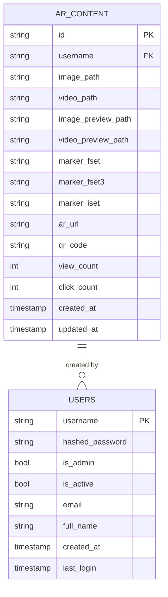

**Diagram sources**
- [database.py](file://vertex-ar/app/database.py#L1111-L1177)

**Section sources**
- [database.py](file://vertex-ar/app/database.py#L1111-L1177)

### Field Definitions
The AR content model includes several key fields that enable the AR functionality:

- **image_path**: File system path to the source image used as the AR trigger. This image is analyzed to create tracking markers.
- **video_path**: File system path to the video that will be overlaid in the AR experience when the image is detected.
- **marker_fset**: Path to the .fset file containing the feature set for NFT (Natural Feature Tracking) marker detection.
- **marker_fset3**: Path to the .fset3 file containing the 3D feature set for enhanced marker tracking.
- **marker_iset**: Path to the .iset file containing the image set for marker recognition.
- **ar_url**: Public URL that users can access to view the AR content, typically in the format `BASE_URL/ar/{content_id}`.
- **qr_code**: Base64-encoded PNG image of the QR code that links to the AR content URL, allowing quick access via QR scanning.

The system also tracks engagement metrics with:
- **view_count**: Number of times the AR content has been accessed through the public URL.
- **click_count**: Number of interaction events tracked for the AR content.

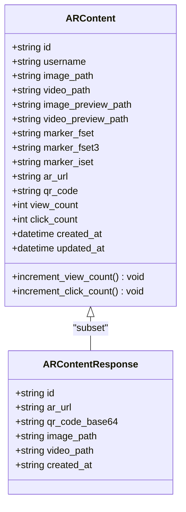

**Diagram sources**
- [database.py](file://vertex-ar/app/database.py#L1111-L1177)
- [models.py](file://vertex-ar/app/models.py#L69-L77)

**Section sources**
- [database.py](file://vertex-ar/app/database.py#L1111-L1177)
- [models.py](file://vertex-ar/app/models.py#L69-L77)

## API Endpoints
The AR content management system provides a comprehensive REST API for CRUD operations, tracking, and public access to AR content.

### CRUD Endpoints
The system exposes the following endpoints for managing AR content:

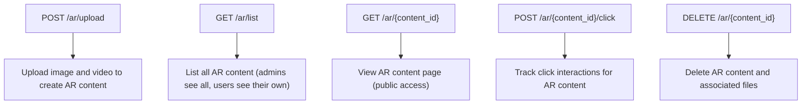

**Diagram sources**
- [ar.py](file://vertex-ar/app/api/ar.py#L42-L210)

**Section sources**
- [ar.py](file://vertex-ar/app/api/ar.py#L42-L210)

#### Upload Endpoint
The `/ar/upload` endpoint creates new AR content by accepting an image and video file:

- **Method**: POST
- **Path**: `/ar/upload`
- **Authentication**: Admin only (via `require_admin` dependency)
- **Rate Limiting**: 10 requests per minute
- **Request**: Multipart form data with `image` and `video` file fields
- **Response**: `ARContentResponse` with details of the created content

The endpoint validates that the uploaded files are of the correct type (image/* and video/*), generates a UUID for the content, creates a storage directory, saves the files, generates previews, creates a QR code, generates NFT markers, and stores the record in the database.

#### List Endpoint
The `/ar/list` endpoint returns a list of AR content records:

- **Method**: GET
- **Path**: `/ar/list`
- **Authentication**: User authentication required
- **Behavior**: Admins see all content; regular users see only their own content

#### View Endpoint
The `/ar/{content_id}` endpoint serves the public AR experience:

- **Method**: GET
- **Path**: `/ar/{content_id}`
- **Authentication**: None (public access)
- **Behavior**: Returns HTML page with AR viewer, increments view count

#### Click Tracking Endpoint
The `/ar/{content_id}/click` endpoint records interaction events:

- **Method**: POST
- **Path**: `/ar/{content_id}/click`
- **Authentication**: None (public access)
- **Behavior**: Validates content exists, increments click count, returns success status

#### Delete Endpoint
The `/ar/{content_id}` endpoint removes AR content:

- **Method**: DELETE
- **Path**: `/ar/{content_id}`
- **Authentication**: Admin only
- **Behavior**: Deletes files from storage and record from database

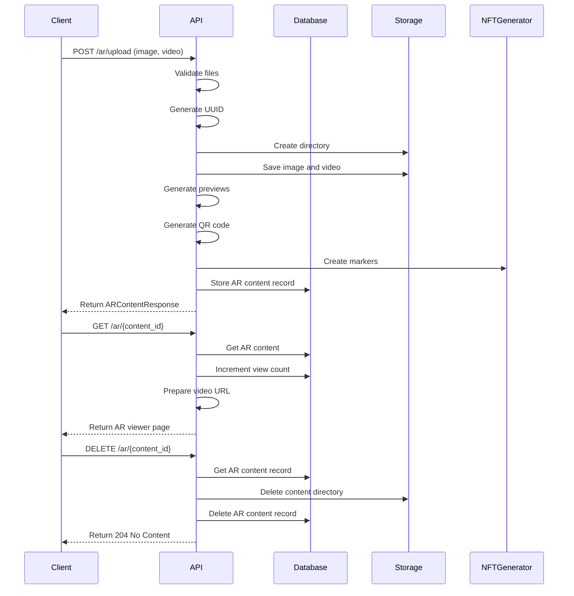

**Diagram sources**
- [ar.py](file://vertex-ar/app/api/ar.py#L42-L210)

**Section sources**
- [ar.py](file://vertex-ar/app/api/ar.py#L42-L210)

## AR Content Creation Process
The AR content creation process involves several steps that transform uploaded media files into a fully functional augmented reality experience.

### Upload and Validation
When an administrator uploads an image and video, the system first validates the file types to ensure they are appropriate for AR content. The image must have a content type starting with "image/" and the video with "video/". This validation prevents users from uploading incompatible file types.

After validation, the system generates a UUID for the content ID, ensuring uniqueness across the system. It then creates a storage directory structure organized by username and content ID, following the pattern `STORAGE_ROOT/ar_content/username/content_id`.

### Preview Generation
The system generates preview images for both the uploaded image and video to provide thumbnails for display in management interfaces. This is handled by the `PreviewGenerator` class:

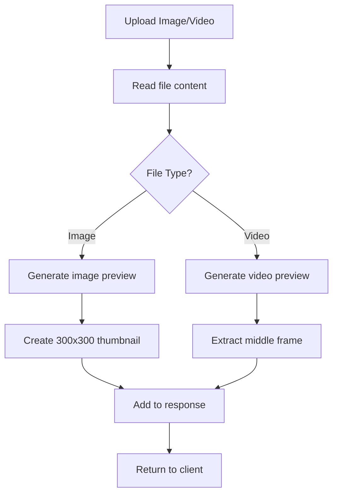

**Diagram sources**
- [preview_generator.py](file://vertex-ar/preview_generator.py#L17-L326)

**Section sources**
- [preview_generator.py](file://vertex-ar/preview_generator.py#L17-L326)

The image preview is created by opening the image, converting it to RGB if necessary, creating a thumbnail with LANCZOS resampling for high quality, centering it on a white background, and saving it in WebP format with 85% quality. The video preview extracts the middle frame of the video, applies Gaussian blur to reduce compression artifacts, converts it to RGB, creates a thumbnail, centers it on a black background, adds a play icon overlay, and saves it in WebP format.

### QR Code Generation
The system generates a QR code that links to the public AR content URL. The QR code is created using the `qrcode` library with the following process:

1. Construct the AR URL using the base URL and content ID: `f"{base_url}/ar/{content_id}"`
2. Generate a QR code image with the URL as data
3. Save the QR code to a BytesIO buffer in PNG format
4. Encode the image data as base64
5. Store the base64 string in the database

This allows the QR code to be embedded directly in responses and displayed in management interfaces without requiring additional HTTP requests.

## Public AR Page Rendering
The public AR experience is delivered through a dedicated HTML page that uses AR.js and A-Frame to create the augmented reality effect.

### AR Viewer Template
The `ar_page.html` template provides the frontend for the AR experience:

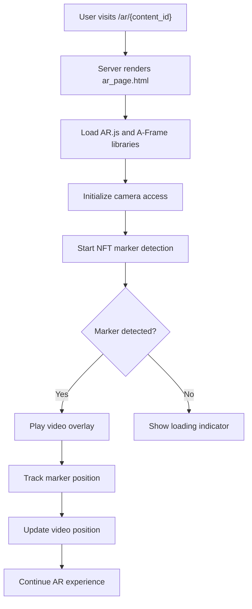

**Diagram sources**
- [ar_page.html](file://vertex-ar/templates/ar_page.html#L1-L303)

**Section sources**
- [ar_page.html](file://vertex-ar/templates/ar_page.html#L1-L303)

The template includes several key components:
- A start button for mobile browsers that require user interaction to start video playback
- A status indicator showing the current state (loading, marker detected, etc.)
- An AR.js loader overlay during initialization
- The A-Frame scene with NFT marker detection
- A video entity that is overlaid when the marker is detected
- JavaScript event handlers for marker detection and video control

### A-Frame Scene Configuration
The AR experience is built using A-Frame with the AR.js extension:

```html
<a-scene
    vr-mode-ui="enabled: false"
    embedded
    arjs="trackingMethod: best; sourceType: webcam; debugUIEnabled: false;"
    renderer="logarithmicDepthBuffer: true;"
    id="ar-scene"
>
    <a-nft
        type="nft"
        url="{{ request.url.scheme }}://{{ request.url.netloc }}/nft-markers/{{ record.id }}"
        smooth="true"
        smoothCount="10"
        smoothTolerance="0.01"
        smoothThreshold="5"
        id="nft-marker"
    >
        <a-video
            id="ar-video"
            src="{{ record.video_url }}"
            width="1.5"
            height="1"
            position="0 0 0"
            rotation="-90 0"
            scale="1 1 1"
            autoplay="false"
            webkit-playsinline
            playsinline
            muted
            loop="false"
        ></a-video>
    </a-nft>
    <a-entity camera></a-entity>
</a-scene>
```

The NFT marker URL points to the marker files in the `/nft-markers/{content_id}` directory, where the three marker files (.fset, .fset3, .iset) are served. The video source URL points to the video file in the storage system.

### JavaScript Event Handling
The AR experience is controlled by JavaScript event handlers that respond to AR.js events:

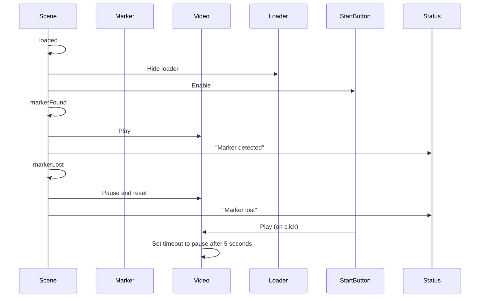

**Diagram sources**
- [ar_page.html](file://vertex-ar/templates/ar_page.html#L170-L293)

**Section sources**
- [ar_page.html](file://vertex-ar/templates/ar_page.html#L170-L293)

When the AR scene loads, the loader overlay is hidden and the start button is enabled. When a marker is detected, the video begins playing. When the marker is lost, the video is paused and reset. On mobile devices, the start button allows users to manually start video playback, with a 5-second timeout that automatically pauses the video if no marker is detected.

## Tracking and Analytics
The system provides comprehensive tracking of AR content engagement through view and click counters.

### View Tracking
View tracking is implemented as a side effect of accessing the public AR page:

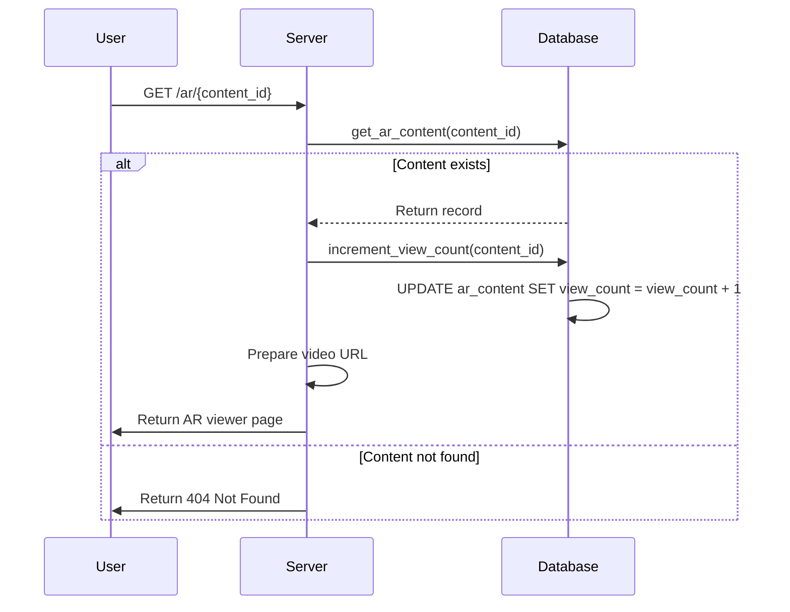

**Diagram sources**
- [ar.py](file://vertex-ar/app/api/ar.py#L170-L195)
- [database.py](file://vertex-ar/app/database.py#L1159-L1164)

**Section sources**
- [ar.py](file://vertex-ar/app/api/ar.py#L170-L195)
- [database.py](file://vertex-ar/app/database.py#L1159-L1164)

The `increment_view_count` method in the database class executes a simple SQL UPDATE statement to increment the view count for the specified content ID. This operation is atomic and thread-safe, ensuring accurate counts even with concurrent access.

### Click Tracking
Click tracking is implemented as a separate endpoint that can be called by client applications:

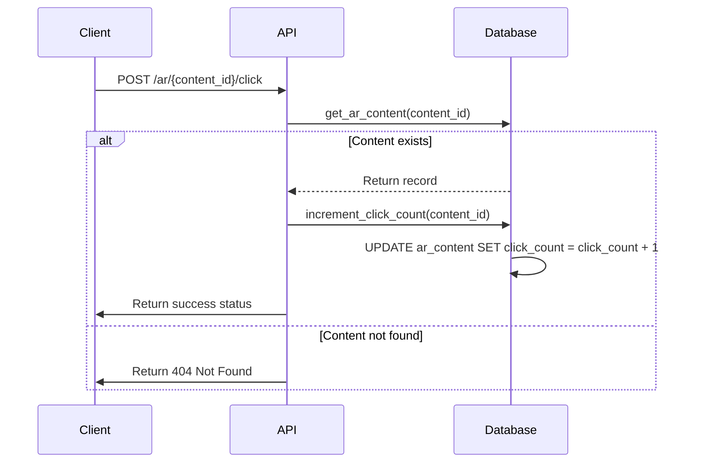

**Diagram sources**
- [ar.py](file://vertex-ar/app/api/ar.py#L197-L206)
- [database.py](file://vertex-ar/app/database.py#L1166-L1171)

**Section sources**
- [ar.py](file://vertex-ar/app/api/ar.py#L197-L206)
- [database.py](file://vertex-ar/app/database.py#L1166-L1171)

The click tracking endpoint allows client applications to record interaction events, such as when a user performs a specific action within the AR experience. This provides more granular analytics beyond simple view counting.

### Analytics Integration
The system integrates with the admin dashboard to provide aggregated statistics:

```python
@router.get("/content-stats")
async def get_content_stats(
    company_id: Optional[str] = None,
    _: str = Depends(require_admin)
) -> List[Dict[str, Any]]:
    """Return aggregated AR content statistics for the admin dashboard."""
    database = get_database()

    # Get records based on company filter
    if company_id:
        clients = database.list_clients(company_id=company_id)
        client_ids = [client["id"] for client in clients]
        records = []
        for client_id in client_ids:
            client_records = database.list_ar_content(client_id)
            records.extend(client_records)
    else:
        records = database.list_ar_content()

    # Format statistics
    stats: List[Dict[str, Any]] = []
    for record in records:
        stats.append({
            "id": record["id"],
            "views": record.get("view_count", 0),
            "clicks": record.get("click_count", 0),
            "created_at": record.get("created_at"),
            "ar_url": record.get("ar_url"),
        })
    stats.sort(key=lambda item: item["views"], reverse=True)
    return stats
```

This endpoint allows administrators to view content performance sorted by view count, providing insights into the most popular AR experiences.

## NFT Marker Generation
The system uses NFT (Natural Feature Tracking) markers to enable AR experiences without requiring artificial markers like QR codes. The marker generation process creates three binary files that AR.js uses for image recognition and tracking.

### Marker File Types
The NFT marker system generates three files for each AR content item:

- **.fset**: Feature Set file containing 2D feature points extracted from the image
- **.fset3**: Feature Set 3D file containing multi-level feature pyramids for robust tracking
- **.iset**: Image Set file containing image pyramids for template matching

```mermaid
erDiagram
NFT_MARKER {
string image_path
string fset_path
string fset3_path
string iset_path
int width
int height
int dpi
float quality_score
float generation_time
}
NFT_MARKER_GENERATOR {
string storage_root
string markers_dir
NFTAnalysisCache cache
dict metrics
}
NFT_MARKER_GENERATOR --> NFT_MARKER : "generates"
NFTAnalysisCache {
string cache_dir
int ttl_days
}
NFT_MARKER_GENERATOR --> NFTAnalysisCache : "uses"
```

**Diagram sources**
- [nft_marker_generator.py](file://vertex-ar/nft_marker_generator.py#L211-L663)

**Section sources**
- [nft_marker_generator.py](file://vertex-ar/nft_marker_generator.py#L211-L663)

### Marker Generation Process
The marker generation process begins when AR content is uploaded:

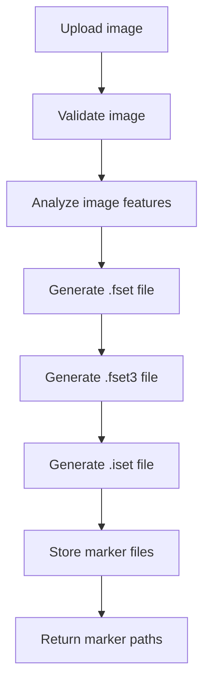

**Diagram sources**
- [nft_marker_generator.py](file://vertex-ar/nft_marker_generator.py#L603-L646)

**Section sources**
- [nft_marker_generator.py](file://vertex-ar/nft_marker_generator.py#L603-L646)

The `NFTMarkerGenerator` class handles the creation of these files. It first validates the image to ensure it meets minimum size requirements (480x480 pixels) and doesn't exceed maximum size limits (8192x8192 pixels). It then analyzes the image features, calculating brightness, contrast, and tracking quality.

The .fset file is generated by detecting feature points in the image using a simplified Harris-like corner detection algorithm. The .fset3 file creates a 3D feature pyramid with multiple levels of detail. The .iset file generates an image pyramid by resizing the original image at different scales.

### Marker Configuration
The marker generation process is configurable through the `NFTMarkerConfig` class:

```python
config = NFTMarkerConfig(
    feature_density="high", 
    levels=3,
    max_image_size=8192,
    max_image_area=50_000_000
)
```

This configuration allows adjustment of:
- **feature_density**: Controls the number of feature points (low, medium, high)
- **levels**: Number of pyramid levels for multi-scale tracking
- **max_image_size**: Maximum dimension for input images
- **max_image_area**: Maximum pixel count for input images

The system also includes an analysis cache that stores image analysis results with a configurable TTL (time-to-live), improving performance for repeated processing of the same images.

## Storage and Media Handling
The system implements a comprehensive storage strategy for managing AR content files, previews, and markers.

### Storage Architecture
The storage system is designed with a clear separation of concerns:

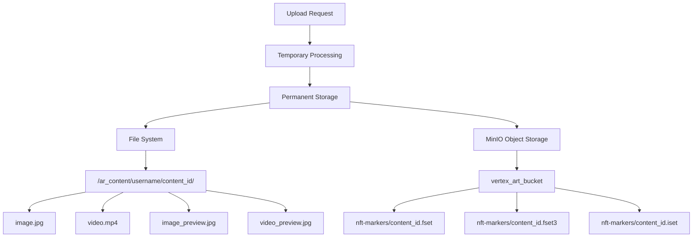

**Diagram sources**
- [storage.py](file://vertex-ar/storage.py#L1-L195)
- [ar.py](file://vertex-ar/app/api/ar.py#L66-L86)

**Section sources**
- [storage.py](file://vertex-ar/storage.py#L1-L195)
- [ar.py](file://vertex-ar/app/api/ar.py#L66-L86)

AR content files (images and videos) are stored in the local file system under the `STORAGE_ROOT/ar_content/username/content_id/` directory. NFT marker files are stored in object storage (MinIO) under the `nft-markers/` prefix. This separation allows for different retention policies and access patterns for media files versus marker files.

### Media File Processing
The system processes media files to optimize them for AR experiences:

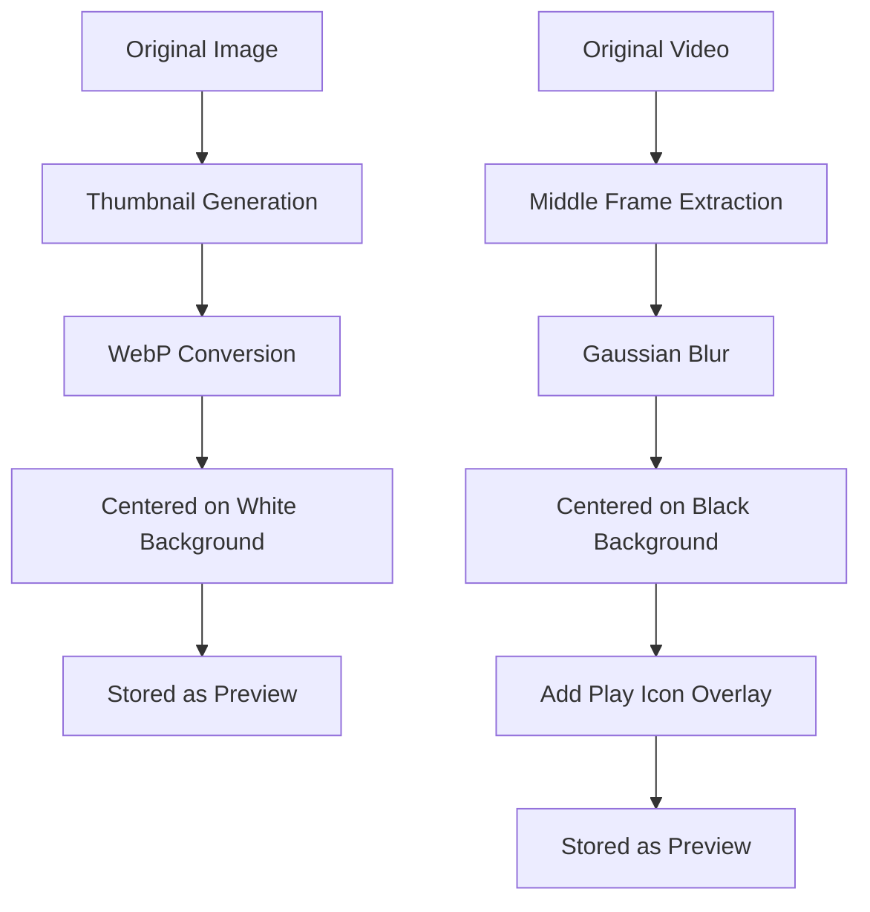

**Diagram sources**
- [preview_generator.py](file://vertex-ar/preview_generator.py#L17-L198)

**Section sources**
- [preview_generator.py](file://vertex-ar/preview_generator.py#L17-L198)

Image previews are generated in WebP format with 85% quality and method 6 compression for optimal file size and quality. Video previews use the middle frame of the video to provide a representative image, with a play icon overlay to indicate it's a video.

### Storage Management
The system includes robust error handling for storage operations:

```python
# Delete AR content and associated files
content_dir = Path(image_path).parent if image_path else None
if content_dir and content_dir.exists():
    try:
        shutil.rmtree(content_dir)
    except OSError as exc:
        logger.error(
            "Failed to remove AR content directory",
            extra={"content_id": content_id, "path": str(content_dir)},
            exc_info=exc,
        )
        raise HTTPException(
            status_code=status.HTTP_500_INTERNAL_SERVER_ERROR,
            detail="Failed to remove stored content files",
        )
```

When deleting AR content, the system removes the entire content directory and all files within it. It uses `shutil.rmtree` for recursive deletion and includes comprehensive error handling to log failures and return appropriate HTTP errors.

## Security Considerations
The system implements several security measures to protect AR content and prevent unauthorized access.

### Authentication and Authorization
Access to AR content management is controlled through role-based authentication:

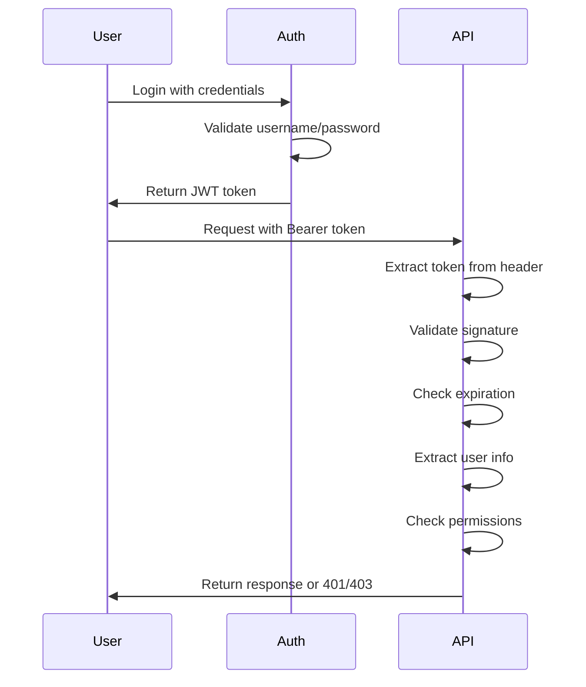

**Diagram sources**
- [ar.py](file://vertex-ar/app/api/ar.py#L47)
- [auth.py](file://vertex-ar/app/api/auth.py)

**Section sources**
- [ar.py](file://vertex-ar/app/api/ar.py#L47)

The `/ar/upload` and `/ar/{content_id}` (DELETE) endpoints require admin authentication through the `require_admin` dependency. The `/ar/list` endpoint requires user authentication but allows regular users to see their own content. The public view endpoint (`/ar/{content_id}`) does not require authentication, allowing open access to AR experiences.

### Rate Limiting
The upload endpoint implements rate limiting to prevent abuse:

```python
@router.post("/upload", response_model=ARContentResponse, dependencies=[Depends(create_rate_limit_dependency("10/minute"))])
```

This limits users to 10 uploads per minute, preventing denial-of-service attacks through excessive file uploads.

### Input Validation
The system validates all user inputs to prevent security vulnerabilities:

```python
if not image.content_type or not image.content_type.startswith("image/"):
    raise HTTPException(status_code=status.HTTP_400_BAD_REQUEST, detail="Invalid image file")

if not video.content_type or not video.content_type.startswith("video/"):
    raise HTTPException(status_code=status.HTTP_400_BAD_REQUEST, detail="Invalid video file")
```

File types are validated based on content type headers, preventing users from uploading executable files or other potentially dangerous content.

### Public Endpoint Security
The public AR viewing endpoint includes several security considerations:

- The endpoint validates that the requested content exists before incrementing the view count
- It uses the `BASE_URL` configuration to construct the video URL, preventing open redirect vulnerabilities
- The AR viewer page is served with appropriate security headers and content security policies
- The system logs all AR content access for audit purposes

## Performance Implications
The AR content management system has several performance considerations related to media file handling, marker generation, and AR rendering.

### Media Processing Performance
The system performs several computationally intensive operations during AR content creation:

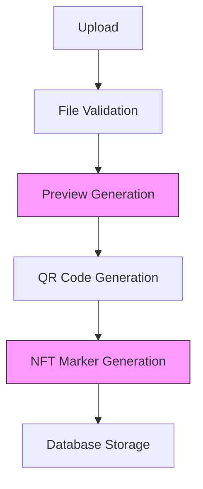

**Section sources**
- [ar.py](file://vertex-ar/app/api/ar.py#L88-L132)

Preview generation and NFT marker generation are the most resource-intensive operations. Image preview generation uses LANCZOS resampling for high-quality thumbnails, while video preview generation requires decoding the video to extract a frame. NFT marker generation involves image analysis and feature detection algorithms that can be CPU-intensive.

### Caching Strategy
The system implements caching to improve performance:

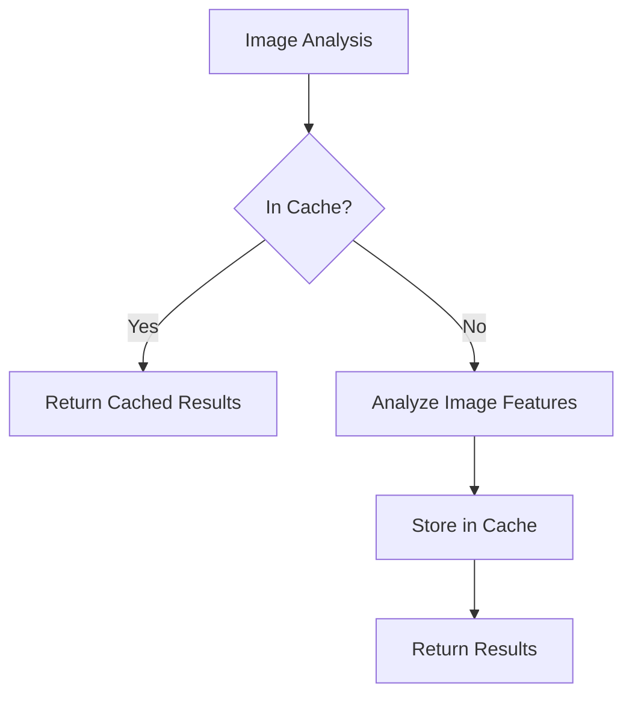

**Diagram sources**
- [nft_marker_generator.py](file://vertex-ar/nft_marker_generator.py#L664-L688)

The NFT marker generator includes an analysis cache that stores image analysis results with a 7-day TTL. This prevents redundant processing when the same image is used multiple times.

### AR Rendering Performance
The client-side AR experience has performance implications for end-user devices:

- The AR.js library requires significant CPU and GPU resources for real-time camera processing
- Video files should be optimized for web delivery (H.264 encoding, appropriate resolution)
- Marker complexity affects tracking performance (higher feature density requires more processing)
- Network latency affects the loading time of marker files and videos

The system addresses these by:
- Generating optimized video previews
- Using WebP format for smaller file sizes
- Providing configuration options for marker complexity
- Implementing lazy loading of resources

## Use Cases
The AR content management system supports various use cases across different industries.

### Marketing Campaigns
The system is ideal for interactive marketing campaigns:

- **Product Packaging**: Consumers scan product packaging to view promotional videos
- **Print Media**: Magazines and posters include QR codes linking to AR experiences
- **Event Promotion**: Event posters come to life with video content when scanned
- **Retail Displays**: In-store displays trigger AR experiences when customers approach

For example, a beverage company could include a QR code on their product labels that, when scanned, shows a video of the product being made or used in creative ways.

### Interactive Media
The system enables interactive media experiences:

- **Art Exhibitions**: Visitors scan artwork to see artist interviews or behind-the-scenes content
- **Educational Materials**: Textbooks come alive with 3D models and explanatory videos
- **Museum Displays**: Historical artifacts trigger AR reconstructions when viewed
- **Real Estate**: Property listings include AR walkthroughs of the space

A museum could use the system to provide additional context for exhibits, with AR experiences showing how artifacts were used historically or providing interviews with curators.

### Brand Engagement
The system facilitates deeper brand engagement:

- **Customer Stories**: Share customer testimonials through AR experiences
- **Product Demonstrations**: Show products in use through AR overlays
- **Brand Heritage**: Tell the brand's story through interactive timelines
- **Limited Editions**: Create exclusive AR content for special product releases

## Troubleshooting Guide
This section addresses common issues and their solutions for the AR content management system.

### AR Content Not Displaying
If AR content is not displaying correctly:

1. **Verify content exists**: Check that the content ID is correct and the record exists in the database
2. **Check file paths**: Ensure the image and video files exist at the specified paths
3. **Validate marker files**: Confirm the .fset, .fset3, and .iset files were generated and are accessible
4. **Test video URL**: Directly access the video URL to ensure it's served correctly
5. **Check browser compatibility**: Ensure the device/browser supports WebRTC and the required APIs

### Marker Detection Issues
If markers are not being detected:

1. **Image quality**: Ensure the source image has sufficient contrast and detail
2. **Lighting conditions**: Test in different lighting environments
3. **Camera focus**: Ensure the camera can focus on the image
4. **Marker complexity**: Try using images with more distinctive features
5. **Distance and angle**: Adjust the distance and angle between the camera and image

### Performance Problems
If experiencing performance issues:

1. **Large media files**: Optimize image and video files for web delivery
2. **Network latency**: Ensure marker files and videos are served from a fast CDN
3. **Device capabilities**: Test on different devices to identify hardware limitations
4. **Marker complexity**: Reduce feature density for simpler markers
5. **Browser optimization**: Ensure the latest browser version is used

### Upload Failures
If uploads are failing:

1. **File type validation**: Ensure files have correct content types
2. **Storage space**: Check that sufficient disk space is available
3. **Permissions**: Verify the application has write permissions to the storage directory
4. **Rate limiting**: Check if the rate limit has been exceeded
5. **File size**: Ensure files are within acceptable size limits