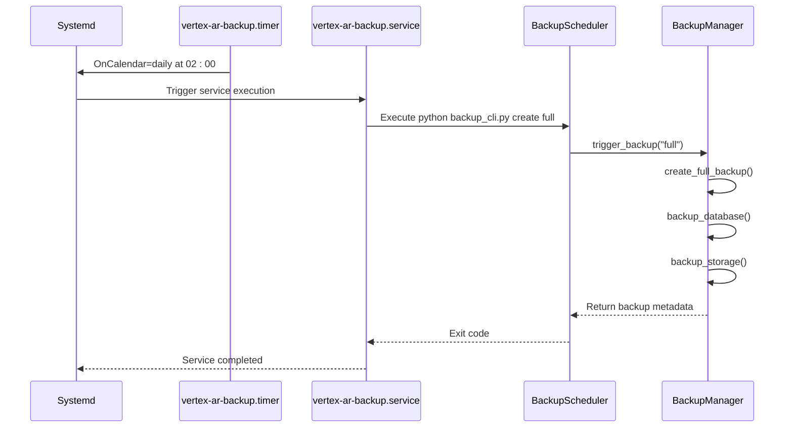
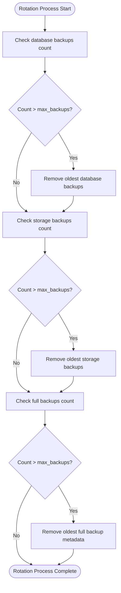
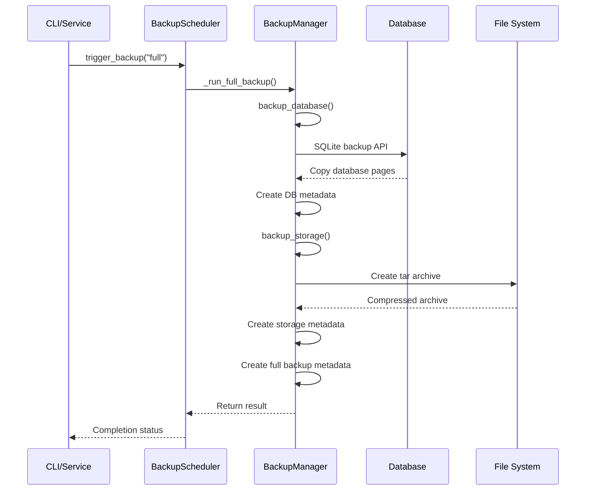
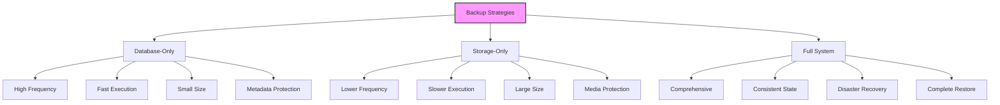
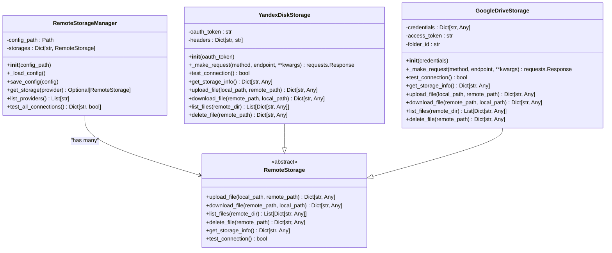
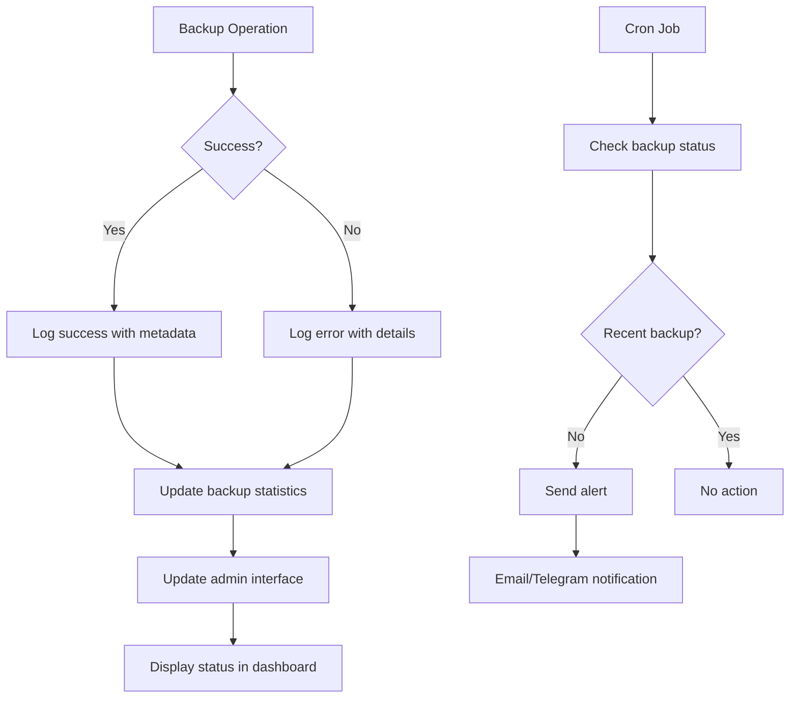
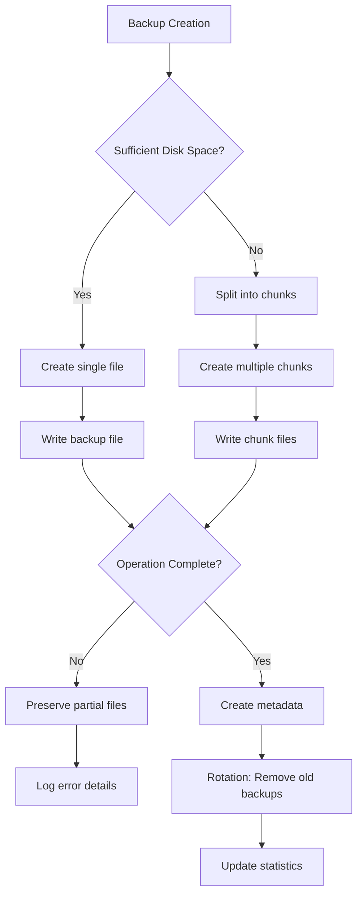
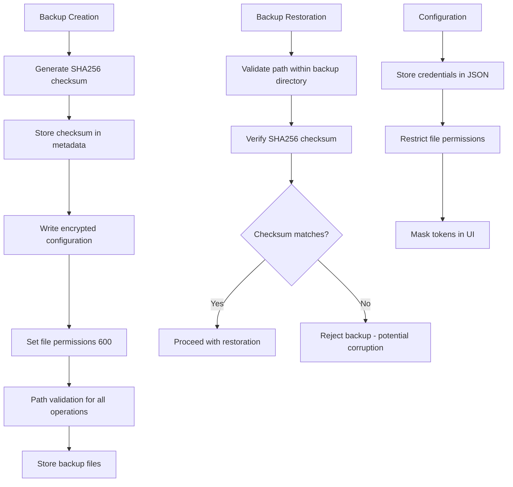
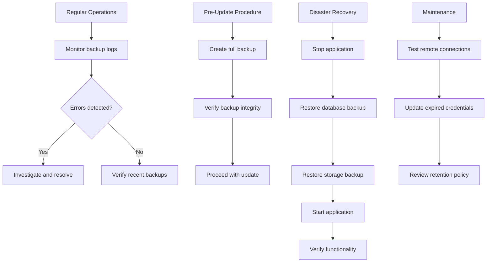
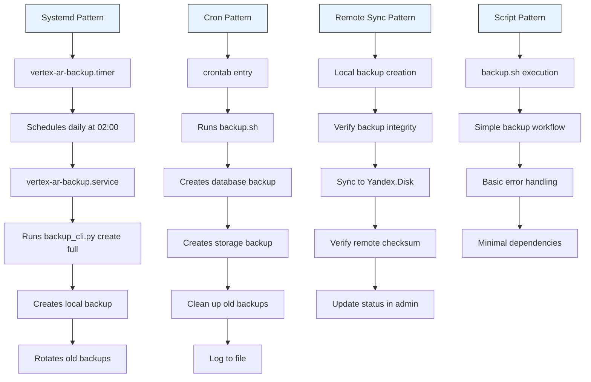

# Automated Backups

<cite>
**Referenced Files in This Document**   
- [backup_scheduler.py](file://vertex-ar/backup_scheduler.py)
- [backup_manager.py](file://vertex-ar/backup_manager.py)
- [backup.sh](file://scripts/backup.sh)
- [vertex-ar-backup.timer](file://vertex-ar/systemd/vertex-ar-backup.timer)
- [vertex-ar-backup.service](file://vertex-ar/systemd/vertex-ar-backup.service)
- [backup.cron.example](file://vertex-ar/backup.cron.example)
- [backup_cli.py](file://vertex-ar/backup_cli.py)
- [remote_storage.py](file://vertex-ar/remote_storage.py)
- [remote_storage.example.json](file://vertex-ar/config/remote_storage.example.json)
- [backup-system.md](file://docs/operations/backup-system.md)
- [remote-backups.md](file://docs/features/remote-backups.md)
- [yandex-disk-backup.md](file://docs/operations/yandex-disk-backup.md)
- [yandex-disk-storage-flow.md](file://docs/features/yandex-disk-storage-flow.md)
</cite>

## Table of Contents
1. [Introduction](#introduction)
2. [Backup Scheduling Mechanism](#backup-scheduling-mechanism)
3. [Retention Policies and Rotation](#retention-policies-and-rotation)
4. [Execution Workflow](#execution-workflow)
5. [Backup Strategies](#backup-strategies)
6. [Remote Backup Capabilities](#remote-backup-capabilities)
7. [Monitoring and Status Reporting](#monitoring-and-status-reporting)
8. [Failure Recovery and Disk Space Management](#failure-recovery-and-disk-space-management)
9. [Encryption and Security](#encryption-and-security)
10. [Operational Procedures](#operational-procedures)
11. [Production Deployment Patterns](#production-deployment-patterns)

## Introduction

The Automated Backups system in Vertex AR provides a comprehensive solution for data protection, ensuring the integrity and availability of critical application data. This system implements a multi-layered approach to backup management, combining scheduled execution, retention policies, and remote storage capabilities to create a robust disaster recovery framework. The architecture supports multiple backup types including database, storage files, and full system backups, with flexible configuration options for different operational requirements.

The system is designed with enterprise-grade reliability in mind, incorporating features such as checksum verification, automatic file splitting for large backups, and integration with cloud storage providers like Yandex.Disk. The backup infrastructure is accessible through multiple interfaces including a command-line tool, REST API, and systemd integration, allowing for flexible deployment patterns in various environments.

**Section sources**
- [backup-system.md](file://docs/operations/backup-system.md#L1-L577)
- [remote-backups.md](file://docs/features/remote-backups.md#L1-L311)

## Backup Scheduling Mechanism

The backup scheduling system in Vertex AR utilizes a dual approach, supporting both cron-based triggers and systemd timers for maximum flexibility across different deployment environments. At the core of the scheduling mechanism is the `BackupScheduler` class, which leverages the APScheduler library to manage periodic backup jobs with precision and reliability.

The `BackupScheduler` class provides a comprehensive configuration interface through environment variables, allowing administrators to customize backup frequencies without modifying code. The scheduler supports four distinct backup types, each with its own configurable schedule:

- **Database backups**: Configured via `BACKUP_DATABASE_SCHEDULE` (default: daily at 2 AM)
- **Storage backups**: Configured via `BACKUP_STORAGE_SCHEDULE` (default: weekly on Sunday at 3 AM)
- **Full backups**: Configured via `BACKUP_FULL_SCHEDULE` (default: weekly on Sunday at 3 AM)
- **Rotation jobs**: Configured via `BACKUP_ROTATION_SCHEDULE` (default: daily at 4 AM)

Each backup type can be individually enabled or disabled through corresponding environment variables (`BACKUP_DATABASE_ENABLED`, `BACKUP_STORAGE_ENABLED`, etc.), providing granular control over the backup process. The scheduler implements a 5-minute grace period for job execution, ensuring that missed triggers due to system downtime are executed upon the next system startup.

For production deployments, the system supports integration with systemd timers, which provide enhanced reliability and system integration. The `vertex-ar-backup.timer` configuration runs daily at 2:00 AM and includes the `Persistent=true` directive, ensuring that missed backups are executed when the system comes back online. This systemd integration works in conjunction with the `vertex-ar-backup.service` unit, which executes the backup process as a one-shot service under the dedicated `vertex-ar` user account.

**Diagram sources**
- [vertex-ar-backup.timer](file://vertex-ar/systemd/vertex-ar-backup.timer#L1-L14)
- [vertex-ar-backup.service](file://vertex-ar/systemd/vertex-ar-backup.service#L1-L18)
- [backup_scheduler.py](file://vertex-ar/backup_scheduler.py#L1-L303)

**Section sources**
- [backup_scheduler.py](file://vertex-ar/backup_scheduler.py#L1-L303)
- [vertex-ar-backup.timer](file://vertex-ar/systemd/vertex-ar-backup.timer#L1-L14)
- [vertex-ar-backup.service](file://vertex-ar/systemd/vertex-ar-backup.service#L1-L18)

## Retention Policies and Rotation

The retention and rotation system in Vertex AR implements a configurable policy-based approach to managing backup lifecycle, ensuring optimal disk usage while maintaining adequate recovery points. The system automatically removes old backups based on a configurable retention count, with separate policies for different backup types.

The `BackupManager` class handles rotation through its `rotate_backups()` method, which scans the backup directories and removes files exceeding the maximum retention count. By default, the system retains the 7 most recent backups of each type, but this can be customized through the `max_backups` parameter or environment variables. The rotation process is designed to be atomic and safe, with individual file deletion operations wrapped in try-catch blocks to prevent partial cleanup in case of errors.

The retention policy applies differently to various backup types:
- **Database backups**: Individual `.db` files are rotated, with the oldest files removed first
- **Storage backups**: Compressed tar archives are rotated based on modification time
- **Full backups**: Metadata JSON files are rotated, preserving the record of complete system states

The rotation process is typically scheduled to run daily at 4:00 AM, ensuring that old backups are cleaned up after new backups have been created. This timing prevents the accumulation of excessive disk space while maintaining a safety window for verification. The system logs all rotation activities, including the count of removed backups by type, providing an audit trail for compliance purposes.

**Diagram sources**
- [backup_manager.py](file://vertex-ar/backup_manager.py#L465-L530)
- [backup.cron.example](file://vertex-ar/backup.cron.example#L37-L38)

**Section sources**
- [backup_manager.py](file://vertex-ar/backup_manager.py#L465-L530)
- [backup.cron.example](file://vertex-ar/backup.cron.example#L37-L38)

## Execution Workflow

The backup execution workflow in Vertex AR follows a structured process that ensures data consistency and integrity throughout the backup operation. The workflow is orchestrated by the `BackupManager` class, which coordinates the creation, verification, and cataloging of backup artifacts.

When a backup is initiated, the system follows a standardized sequence of operations. For database backups, the system uses SQLite's built-in backup API to create a consistent snapshot without locking the database for extended periods. The process begins by establishing connections to both the source and destination databases, then performs an online backup using the `backup()` method, which copies pages incrementally. After the backup completes, both connections are properly closed, and metadata including timestamp, file size, and SHA256 checksum is recorded in a companion JSON file.

For storage backups, the system creates compressed tar archives of the storage directory. The compression format is configurable (gz, bz2, xz, or none), with gzip being the default. The archiving process preserves file permissions and directory structure, ensuring faithful restoration. Before archiving, the system calculates the expected file count for verification purposes.

The full backup workflow coordinates both database and storage backups, creating a comprehensive system snapshot. This process executes the database and storage backups sequentially, then creates a master metadata file that references both components. If either component fails, the full backup is marked as failed, but the successful component's backup is preserved.

**Diagram sources**
- [backup_manager.py](file://vertex-ar/backup_manager.py#L212-L422)
- [backup_scheduler.py](file://vertex-ar/backup_scheduler.py#L149-L169)

**Section sources**
- [backup_manager.py](file://vertex-ar/backup_manager.py#L212-L422)
- [backup_scheduler.py](file://vertex-ar/backup_scheduler.py#L149-L169)

## Backup Strategies

Vertex AR implements a tiered backup strategy that addresses different data protection requirements through specialized backup types. The system supports three primary backup strategies: database-only, storage-only, and full system backups, each serving distinct operational purposes.

**Database backups** focus on the SQLite database containing all application metadata, user information, and configuration settings. These backups are optimized for speed and frequency, typically scheduled every 6 hours to minimize potential data loss. The backup process uses SQLite's online backup API, allowing the database to remain available for read-write operations during the backup. Database backups are relatively small (typically under 10MB) and can be created quickly, making them ideal for frequent execution.

**Storage backups** target the media files directory, which contains user-uploaded images, videos, AR content, and NFT markers. These backups are typically scheduled less frequently (weekly) due to their larger size and the slower compression process. The system creates compressed tar archives with configurable compression levels, balancing storage efficiency against CPU usage. For large storage directories, the system can automatically split backups into smaller chunks to improve reliability and facilitate transfer.

**Full backups** combine both database and storage components into a comprehensive system snapshot. These are typically scheduled daily or weekly, providing complete recovery points for disaster recovery scenarios. The full backup process ensures consistency between the database state and the file system, creating a reliable restore point.

The system also supports manual backup creation through the CLI interface, allowing administrators to create on-demand backups before system updates or other critical operations. The `backup_cli.py` script provides a user-friendly interface for creating, listing, and restoring backups with detailed progress information.

**Diagram sources**
- [backup_manager.py](file://vertex-ar/backup_manager.py#L212-L422)
- [backup_cli.py](file://vertex-ar/backup_cli.py#L25-L43)
- [backup-system.md](file://docs/operations/backup-system.md#L124-L163)

**Section sources**
- [backup_manager.py](file://vertex-ar/backup_manager.py#L212-L422)
- [backup_cli.py](file://vertex-ar/backup_cli.py#L25-L43)
- [backup-system.md](file://docs/operations/backup-system.md#L124-L163)

## Remote Backup Capabilities

The remote backup capabilities in Vertex AR provide secure synchronization of backup files to cloud storage providers, implementing the 3-2-1 backup rule with offsite copies. The system supports multiple cloud storage providers through a pluggable architecture, with current implementations for Yandex.Disk and Google Drive.

The remote backup functionality is built around the `RemoteStorage` abstract base class, which defines a standard interface for cloud storage operations including file upload, download, listing, deletion, and storage information retrieval. Concrete implementations for each provider inherit from this base class and implement the required methods. The `RemoteStorageManager` class handles configuration loading and provider initialization, allowing multiple storage providers to be configured simultaneously.

Yandex.Disk integration uses OAuth 2.0 authentication with the Yandex Disk API, requiring the `cloud_api:disk.read` and `cloud_api:disk.write` scopes. The system automatically handles token management and provides real-time storage quota information. For large backup files, the system implements automatic file splitting into configurable chunk sizes (default 100MB), working around Yandex.Disk's 2GB file size limit for free accounts.

The synchronization process is designed to be resilient, with automatic retry mechanisms for failed uploads and progress tracking for long-running operations. When syncing a backup, the system first uploads the metadata file, then uploads the backup file (or its chunks), ensuring that partial uploads can be detected and resumed. The system maintains checksums for integrity verification during both upload and download operations.

**Diagram sources**
- [remote_storage.py](file://vertex-ar/remote_storage.py#L1-L550)
- [remote_storage.example.json](file://vertex-ar/config/remote_storage.example.json#L1-L14)

**Section sources**
- [remote_storage.py](file://vertex-ar/remote_storage.py#L1-L550)
- [remote_storage.example.json](file://vertex-ar/config/remote_storage.example.json#L1-L14)
- [yandex-disk-backup.md](file://docs/operations/yandex-disk-backup.md#L1-L243)

## Monitoring and Status Reporting

The monitoring and status reporting system in Vertex AR provides comprehensive visibility into backup operations, enabling administrators to verify backup success and receive alerts for failures. The system implements multiple monitoring channels, including structured logging, CLI status reporting, and integration with the admin interface.

All backup operations generate structured log entries with consistent fields including timestamp, operation type, file paths, sizes, and success status. These logs are written to both the application log and a dedicated backup log file, facilitating troubleshooting and auditing. Error conditions are logged with full stack traces, while successful operations include performance metrics such as duration and transfer rates.

The `backup_cli.py` script provides a `stats` command that summarizes backup statistics, including counts of different backup types, storage usage in megabytes, and information about the most recent backup. This command outputs human-readable formatted text, making it suitable for both automated monitoring scripts and manual inspection.

The admin interface includes a dedicated backup management section that displays the status of recent backups, retention policy compliance, and storage usage trends. This interface also provides controls for manual backup creation and restoration, with real-time feedback on operation progress. Monitoring hooks report backup status to the admin interface, allowing administrators to verify backup success without accessing the command line.

For automated monitoring, the system can be integrated with external alerting systems through cron jobs that check backup status and send notifications if backups are overdue. The example configuration includes a daily check at 5:00 AM that verifies the presence of recent backups and sends email alerts if none are found.

**Diagram sources**
- [backup_manager.py](file://vertex-ar/backup_manager.py#L700-L729)
- [backup_cli.py](file://vertex-ar/backup_cli.py#L109-L138)
- [backup.cron.example](file://vertex-ar/backup.cron.example#L65-L66)

**Section sources**
- [backup_manager.py](file://vertex-ar/backup_manager.py#L700-L729)
- [backup_cli.py](file://vertex-ar/backup_cli.py#L109-L138)
- [backup.cron.example](file://vertex-ar/backup.cron.example#L65-L66)

## Failure Recovery and Disk Space Management

The failure recovery and disk space management system in Vertex AR implements robust mechanisms to handle backup failures and optimize storage usage. The system is designed to gracefully handle various failure scenarios while maintaining data integrity and system stability.

When a backup operation fails, the system preserves any partially created files for diagnostic purposes while preventing incomplete backups from being used for restoration. The `BackupManager` class implements comprehensive error handling with try-catch blocks around critical operations, ensuring that failures in one component (e.g., database backup) do not prevent other components (e.g., storage backup) from completing in a full backup operation.

For disk space management, the system implements automatic rotation of old backups based on the retention policy. Before creating new backups, the system checks available disk space and can be configured to split large backup files into smaller chunks to prevent filling the disk. The `auto_split_backups` feature automatically divides backup files exceeding a configurable size threshold (default 500MB) into smaller segments (default 100MB each), improving reliability for systems with limited disk space or network bandwidth.

The restoration process includes built-in safety features, such as creating a backup of the current database before overwriting it and verifying checksums before restoration. The system also implements path traversal protection to prevent security vulnerabilities during file operations, using `Path.relative_to()` to validate that all file operations remain within the designated backup directory.

**Diagram sources**
- [backup_manager.py](file://vertex-ar/backup_manager.py#L63-L125)
- [yandex-disk-backup.md](file://docs/operations/yandex-disk-backup.md#L66-L91)

**Section sources**
- [backup_manager.py](file://vertex-ar/backup_manager.py#L63-L125)
- [yandex-disk-backup.md](file://docs/operations/yandex-disk-backup.md#L66-L91)

## Encryption and Security

The encryption and security framework in Vertex AR's backup system implements multiple layers of protection to safeguard backup data from unauthorized access and tampering. While the core system currently focuses on integrity verification through checksums, it provides extensibility points for encryption and includes robust security controls for backup operations.

All backup files are accompanied by JSON metadata files that include SHA256 checksums of the backup content. These checksums are verified automatically during the restoration process, ensuring that backups have not been corrupted or tampered with. The verification can be disabled with the `--no-verify` flag, but this is not recommended for production use.

The system implements strict path validation to prevent directory traversal attacks. When accessing backup files, the system uses `Path.resolve()` and `relative_to()` to ensure that all file operations remain within the designated backup directory, preventing access to files outside this directory. This security measure is particularly important for the web-based restore functionality.

For sensitive configuration data, such as cloud storage credentials, the system stores this information in JSON configuration files with restricted permissions. The `remote_storage.json` file should be protected with file system permissions (chmod 600) to prevent unauthorized access. The system never displays OAuth tokens in the user interface after they have been entered, reducing the risk of accidental exposure.

While native encryption is not currently implemented in the core backup system, the architecture supports integration with external encryption tools. Administrators can use standard tools like GPG or OpenSSL to encrypt backup files after creation, with examples provided in the documentation for both symmetric and asymmetric encryption methods.

**Diagram sources**
- [backup_manager.py](file://vertex-ar/backup_manager.py#L204-L211)
- [backup_cli.py](file://vertex-ar/backup_cli.py#L174-L178)
- [backup-system.md](file://docs/operations/backup-system.md#L477-L493)

**Section sources**
- [backup_manager.py](file://vertex-ar/backup_manager.py#L204-L211)
- [backup_cli.py](file://vertex-ar/backup_cli.py#L174-L178)
- [backup-system.md](file://docs/operations/backup-system.md#L477-L493)

## Operational Procedures

The operational procedures for backup management in Vertex AR encompass backup verification, disaster recovery scenarios, and routine maintenance tasks. These procedures ensure that backups are reliable and can be successfully restored when needed.

For backup verification, administrators should periodically test the restoration process using non-production systems. The recommended procedure involves downloading a backup file, verifying its checksum, and restoring it to a test environment to confirm data integrity. The `verify_backup()` method in the `BackupManager` class can be used to check backup integrity without performing a full restoration.

In disaster recovery scenarios, the restoration process follows a specific sequence: first restoring the database backup, then the storage backup, ensuring consistency between metadata and files. The system provides both automated and manual restoration methods, with the CLI interface offering a guided process that includes confirmation prompts to prevent accidental data loss.

Routine maintenance includes monitoring backup logs for errors, verifying that scheduled backups are executing successfully, and ensuring sufficient disk space for new backups. Administrators should also periodically review and update cloud storage credentials before they expire, and test the connection to remote storage providers.

The system supports various operational workflows, including pre-update backups before system upgrades, migration to new servers using remote backups, and compliance with data retention policies through configurable rotation schedules.

**Diagram sources**
- [backup_manager.py](file://vertex-ar/backup_manager.py#L630-L698)
- [backup_cli.py](file://vertex-ar/backup_cli.py#L141-L178)
- [backup-system.md](file://docs/operations/backup-system.md#L233-L290)

**Section sources**
- [backup_manager.py](file://vertex-ar/backup_manager.py#L630-L698)
- [backup_cli.py](file://vertex-ar/backup_cli.py#L141-L178)
- [backup-system.md](file://docs/operations/backup-system.md#L233-L290)

## Production Deployment Patterns

The production deployment patterns for the Vertex AR backup system demonstrate how the various components integrate in real-world scenarios. These patterns leverage the flexibility of the backup architecture to accommodate different infrastructure requirements and operational constraints.

The primary production pattern uses systemd integration for reliable scheduling. The `vertex-ar-backup.service` unit runs as a one-shot service under the dedicated `vertex-ar` user account, ensuring proper permissions and isolation. The accompanying `vertex-ar-backup.timer` provides calendar-based scheduling with persistence, guaranteeing that missed backups are executed when the system resumes operation.

An alternative pattern uses cron scheduling, which is particularly useful in containerized environments or when more complex scheduling logic is required. The `backup.cron.example` file provides a comprehensive configuration with multiple backup frequencies, rotation schedules, and monitoring checks. This pattern allows for environment-specific customization and integration with existing cron-based monitoring systems.

For remote backup synchronization, production deployments typically implement a two-stage process: first creating local backups, then synchronizing them to cloud storage. This approach ensures that backups are available locally for quick restoration while providing offsite copies for disaster recovery. The synchronization can be triggered immediately after backup creation or scheduled for off-peak hours to minimize network impact.

The `backup.sh` script provides a simple, portable backup mechanism that can be easily integrated into various deployment workflows. This bash script handles the basic backup operations and cleanup, making it suitable for lightweight deployments or as a fallback mechanism.

**Diagram sources**
- [vertex-ar-backup.timer](file://vertex-ar/systemd/vertex-ar-backup.timer#L1-L14)
- [vertex-ar-backup.service](file://vertex-ar/systemd/vertex-ar-backup.service#L1-L18)
- [backup.cron.example](file://vertex-ar/backup.cron.example#L1-L121)
- [backup.sh](file://scripts/backup.sh#L1-L27)

**Section sources**
- [vertex-ar-backup.timer](file://vertex-ar/systemd/vertex-ar-backup.timer#L1-L14)
- [vertex-ar-backup.service](file://vertex-ar/systemd/vertex-ar-backup.service#L1-L18)
- [backup.cron.example](file://vertex-ar/backup.cron.example#L1-L121)
- [backup.sh](file://scripts/backup.sh#L1-L27)