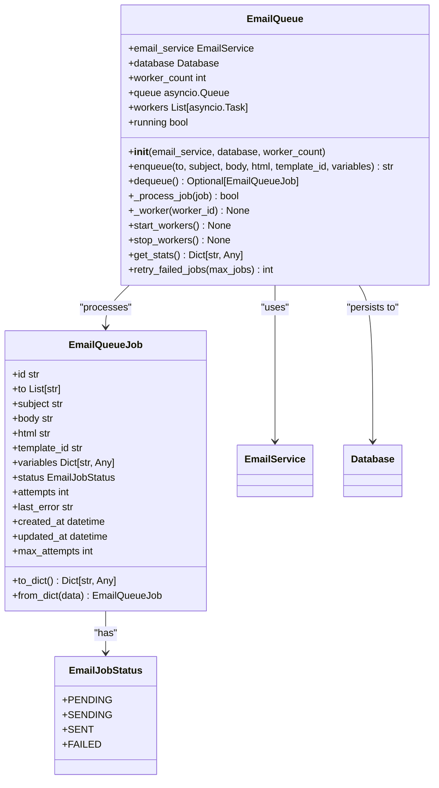
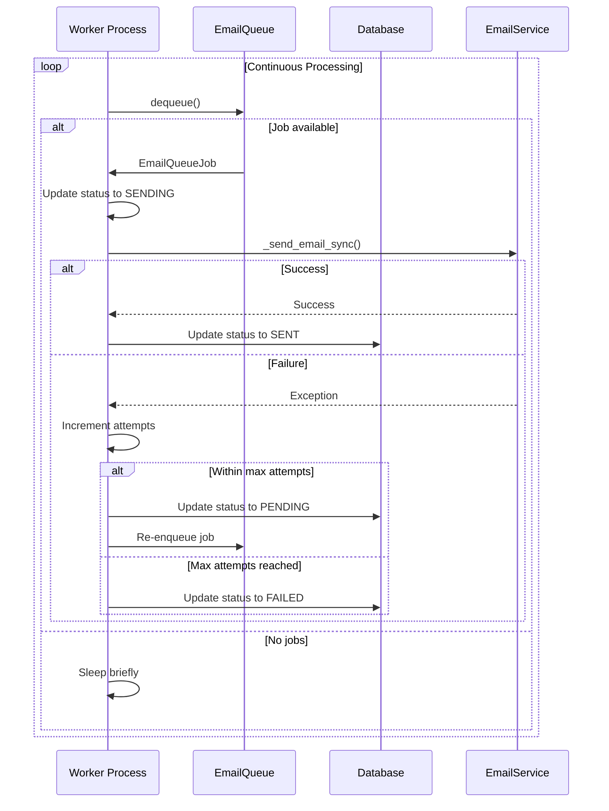
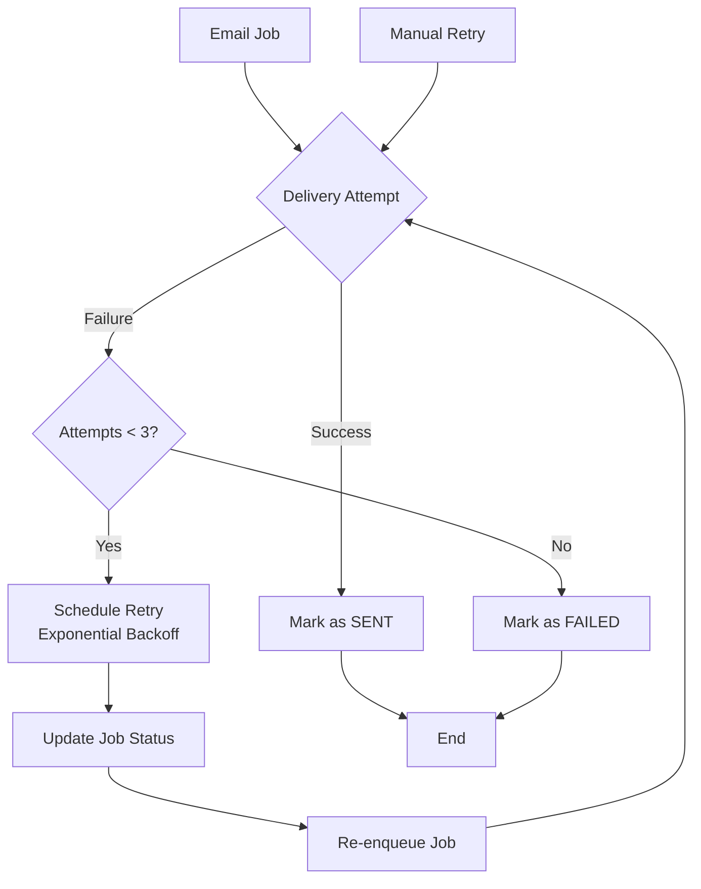
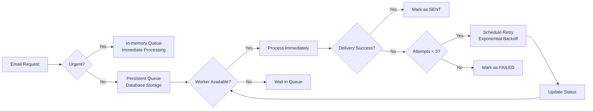
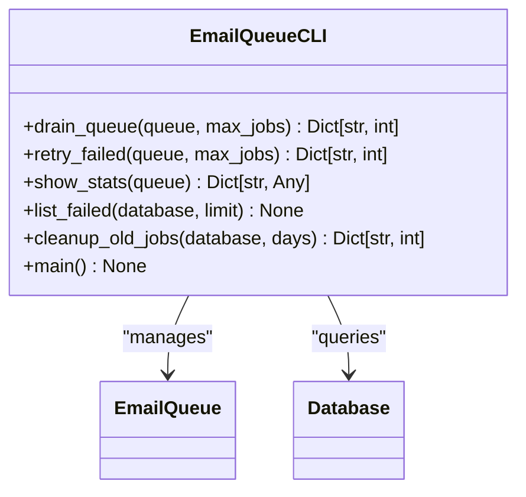

# Email Processing

<cite>
**Referenced Files in This Document**   
- [process_email_queue.py](file://scripts/process_email_queue.py)
- [email_queue.py](file://vertex-ar/app/services/email_queue.py)
- [email_service.py](file://vertex-ar/app/services/email_service.py)
- [email_service.py](file://vertex-ar/app/email_service.py)
- [database.py](file://vertex-ar/app/database.py)
- [notification_config.py](file://vertex-ar/app/notification_config.py)
- [EMAIL_QUEUE.md](file://docs/EMAIL_QUEUE.md)
- [EMAIL_MONITORING.md](file://docs/EMAIL_MONITORING.md)
- [test_email_queue.py](file://test_files/unit/test_email_queue.py)
- [test_email_service.py](file://test_files/unit/test_email_service.py)
</cite>

## Table of Contents
1. [Introduction](#introduction)
2. [EmailQueue Service Architecture](#emailqueue-service-architecture)
3. [Persistence Mechanism](#persistence-mechanism)
4. [Worker Process Implementation](#worker-process-implementation)
5. [Retry Logic and Failure Handling](#retry-logic-and-failure-handling)
6. [Rate Limiting and Concurrency Control](#rate-limiting-and-concurrency-control)
7. [Integration Points](#integration-points)
8. [Command-Line Interface](#command-line-interface)
9. [Security Considerations](#security-considerations)
10. [Monitoring and Metrics](#monitoring-and-metrics)
11. [Troubleshooting Guide](#troubleshooting-guide)

## Introduction

The Vertex AR email processing system implements a robust, asynchronous queue-based architecture for reliable email delivery. This system ensures that email notifications are delivered consistently even during application restarts or temporary service disruptions. The core components include a persistent email queue, database-backed storage, worker processes for asynchronous processing, comprehensive retry mechanisms, and integration with business events such as user registration, backup completion, and system alerts.

The system is designed with reliability as a primary concern, using database persistence to survive application restarts and implementing exponential backoff retry strategies to handle transient failures. The architecture separates concerns between email queuing, processing, and delivery, allowing for scalable and maintainable email operations.

**Section sources**
- [EMAIL_QUEUE.md](file://docs/EMAIL_QUEUE.md#overview)
- [EMAIL_MONITORING.md](file://docs/EMAIL_MONITORING.md#overview)

## EmailQueue Service Architecture

The EmailQueue service forms the backbone of the email processing system, providing durable storage and asynchronous processing capabilities. The service is implemented as an async Python class that manages a pool of worker processes to handle email delivery tasks.

The architecture follows a producer-consumer pattern where email messages are enqueued by various application components and processed by worker processes. The service maintains an in-memory queue for fast access while ensuring persistence through database storage. This hybrid approach provides both performance and reliability.

The EmailQueue class is initialized with references to the EmailService for actual email delivery and the Database for persistence. It supports configurable worker counts, allowing administrators to adjust concurrency based on system resources and email volume requirements.



**Diagram sources**
- [email_queue.py](file://vertex-ar/app/services/email_queue.py#L95-L380)
- [email_service.py](file://vertex-ar/app/services/email_service.py#L28-L566)

**Section sources**
- [email_queue.py](file://vertex-ar/app/services/email_queue.py#L95-L380)
- [EMAIL_QUEUE.md](file://docs/EMAIL_QUEUE.md#architecture)

## Persistence Mechanism

The email queue implements a persistent storage mechanism using SQLite database to ensure message durability across application restarts. All email jobs are stored in a dedicated `email_queue` table with comprehensive metadata to support reliable delivery and monitoring.

The database schema includes essential fields for tracking email state:
- `id`: Unique identifier (UUID) for each email job
- `recipient_to`: Comma-separated recipient email addresses
- `subject`: Email subject line
- `body`: Plain text content
- `html`: HTML content (optional)
- `template_id`: Reference to email templates
- `variables`: JSON-encoded template variables
- `status`: Current job status (pending, sending, sent, failed)
- `attempts`: Number of delivery attempts
- `last_error`: Error message from last failed attempt
- `created_at`: Job creation timestamp
- `updated_at`: Last update timestamp

The persistence mechanism follows a two-phase approach:
1. When an email is enqueued, it is immediately persisted to the database
2. The job is then added to an in-memory asyncio.Queue for immediate processing

This design ensures that even if the application crashes during processing, all pending jobs can be recovered from the database upon restart. The system automatically reloads pending jobs into memory when workers start.

Database operations are optimized with appropriate indexes on status and creation timestamp fields to ensure efficient querying of pending jobs and historical analysis.

```sql
CREATE TABLE email_queue (
    id TEXT PRIMARY KEY,
    recipient_to TEXT NOT NULL,
    subject TEXT NOT NULL,
    body TEXT NOT NULL,
    html TEXT,
    template_id TEXT,
    variables TEXT,
    status TEXT NOT NULL DEFAULT 'pending',
    attempts INTEGER NOT NULL DEFAULT 0,
    last_error TEXT,
    created_at TIMESTAMP NOT NULL,
    updated_at TIMESTAMP NOT NULL
);

CREATE INDEX idx_email_queue_status ON email_queue(status);
CREATE INDEX idx_email_queue_created_at ON email_queue(created_at);
CREATE INDEX idx_email_queue_status_created ON email_queue(status, created_at);
```

**Diagram sources**
- [database.py](file://vertex-ar/app/database.py#L87-L200)
- [EMAIL_QUEUE.md](file://docs/EMAIL_QUEUE.md#database-schema)

**Section sources**
- [database.py](file://vertex-ar/app/database.py#L87-L200)
- [email_queue.py](file://vertex-ar/app/services/email_queue.py#L156-L157)
- [EMAIL_QUEUE.md](file://docs/EMAIL_QUEUE.md#database-schema)

## Worker Process Implementation

The worker process implementation provides concurrent processing of email jobs through a configurable pool of async workers. Each worker runs as an independent asyncio task, continuously polling for jobs to process.

Worker lifecycle management includes:
- **Startup**: Workers are started during application initialization, automatically reloading pending jobs from the database
- **Processing**: Each worker dequeues jobs and processes them sequentially
- **Shutdown**: Workers are gracefully stopped during application shutdown, allowing in-flight jobs to complete

The worker implementation follows a structured processing flow:
1. Check for shutdown signals
2. Dequeue the next job (first from memory queue, then from database)
3. Update job status to "sending"
4. Attempt email delivery through EmailService
5. Update job status based on delivery outcome
6. Handle success or failure appropriately
7. Briefly sleep if no jobs are available

The system supports configurable worker counts through the `worker_count` parameter, allowing administrators to balance resource usage and processing throughput. By default, three workers are configured to provide adequate concurrency while avoiding resource exhaustion.



**Diagram sources**
- [email_queue.py](file://vertex-ar/app/services/email_queue.py#L244-L315)
- [EMAIL_QUEUE.md](file://docs/EMAIL_QUEUE.md#processing)

**Section sources**
- [email_queue.py](file://vertex-ar/app/services/email_queue.py#L244-L315)
- [EMAIL_QUEUE.md](file://docs/EMAIL_QUEUE.md#worker-lifecycle)

## Retry Logic and Failure Handling

The email processing system implements comprehensive retry logic and failure handling to ensure reliable delivery despite transient issues. The retry mechanism follows an exponential backoff strategy with a maximum of three attempts per email job.

When a delivery attempt fails, the system:
1. Records the error message
2. Increments the attempt counter
3. Updates the job status
4. Requeues the job for future processing if within the retry limit

Jobs that exceed the maximum retry attempts (3) are marked as permanently failed and moved to a failed state for administrative review. This prevents infinite retry loops while ensuring transient issues are properly handled.

The failure handling strategy includes:
- **Temporary failures**: Jobs are automatically retried with increasing delays
- **Permanent failures**: Jobs exceeding retry limits are archived for analysis
- **Error classification**: Different error types are logged for troubleshooting
- **Alerting**: High failure rates trigger automated alerts

The system also provides manual recovery options through the CLI tool, allowing administrators to retry failed jobs after resolving underlying issues.



**Diagram sources**
- [email_queue.py](file://vertex-ar/app/services/email_queue.py#L224-L242)
- [EMAIL_QUEUE.md](file://docs/EMAIL_QUEUE.md#job-lifecycle)

**Section sources**
- [email_queue.py](file://vertex-ar/app/services/email_queue.py#L224-L242)
- [EMAIL_QUEUE.md](file://docs/EMAIL_QUEUE.md#failure-recovery)

## Rate Limiting and Concurrency Control

The email processing system implements rate limiting and concurrency control at multiple levels to prevent resource exhaustion and ensure system stability.

Worker-level concurrency is controlled through the configurable `worker_count` parameter, which determines the number of concurrent email delivery processes. This prevents overwhelming the SMTP server or consuming excessive system resources.

For bulk email operations, the system implements additional concurrency control through semaphores that limit the number of simultaneous sends. The `send_bulk_email` method accepts a `max_concurrent` parameter to control parallelism.

The retry mechanism incorporates exponential backoff with delays of 1, 2, and 4 minutes for successive attempts, preventing thundering herd problems when multiple emails fail simultaneously.

Database access is protected by locks to ensure thread safety in the multi-worker environment. The system also monitors queue depth and can trigger alerts when thresholds are exceeded, allowing administrators to adjust concurrency settings as needed.



**Diagram sources**
- [email_service.py](file://vertex-ar/app/services/email_service.py#L190-L275)
- [email_queue.py](file://vertex-ar/app/services/email_queue.py#L114-L115)

**Section sources**
- [email_service.py](file://vertex-ar/app/services/email_service.py#L190-L275)
- [email_queue.py](file://vertex-ar/app/services/email_queue.py#L114-L115)

## Integration Points

The email processing system integrates with various business events throughout the application, providing notifications for critical system activities.

### User Registration
When new users register, the system sends welcome emails and account verification messages. These notifications are triggered through the standard email service interface, ensuring reliable delivery even during high-traffic registration periods.

### Backup Completion
The backup system integrates with email notifications to report successful backup operations and alert administrators to failures. After each backup job completes, status updates are sent to configured recipients, providing visibility into data protection operations.

### System Alerts
Critical system events such as resource thresholds, service disruptions, and security incidents trigger automated email alerts. The monitoring system uses the email queue to ensure these important notifications are delivered reliably.

### Template-Based Notifications
The system supports template-based emails for consistent messaging. Templates are stored in the database and can include variables that are populated at send time. This allows for personalized notifications while maintaining brand consistency.

Integration with these business events follows a consistent pattern:
1. Event detection by the relevant system component
2. Email composition with appropriate content and recipients
3. Enqueueing through the EmailService interface
4. Asynchronous processing by worker processes
5. Delivery status tracking and error handling

**Section sources**
- [users.py](file://vertex-ar/app/api/users.py#L70-L167)
- [backup_manager.py](file://vertex-ar/backup_manager.py)
- [email_service.py](file://vertex-ar/app/services/email_service.py#L138-L188)

## Command-Line Interface

The system provides a comprehensive command-line interface through the `process_email_queue.py` script for manual management and troubleshooting of the email queue.

The CLI tool supports the following commands:

### Drain Command
Processes all pending jobs in the queue:
```bash
python scripts/process_email_queue.py drain --max 100
```

### Retry Command
Retries failed jobs:
```bash
python scripts/process_email_queue.py retry --max 10
```

### Statistics Command
Displays queue statistics:
```bash
python scripts/process_email_queue.py stats
```

### Failed Jobs Command
Lists recently failed jobs:
```bash
python scripts/process_email_queue.py failed --limit 20
```

### Cleanup Command
Removes old sent and failed jobs:
```bash
python scripts/process_email_queue.py cleanup --days 30
```

The CLI tool is particularly useful for recovery operations after system issues, allowing administrators to manually process backlogged emails or retry failed deliveries after resolving configuration problems.



**Diagram sources**
- [process_email_queue.py](file://scripts/process_email_queue.py#L25-L256)
- [EMAIL_QUEUE.md](file://docs/EMAIL_QUEUE.md#cli-management)

**Section sources**
- [process_email_queue.py](file://scripts/process_email_queue.py#L25-L256)
- [EMAIL_QUEUE.md](file://docs/EMAIL_QUEUE.md#cli-management)

## Security Considerations

The email processing system implements multiple security measures to protect email content and prevent abuse.

### Content Security
Email content is validated and sanitized to prevent injection attacks. HTML content is processed to remove potentially dangerous elements while preserving legitimate formatting. The system follows secure coding practices to prevent XSS and other web vulnerabilities.

### SPF/DKIM Configuration
The system is designed to work with proper SPF and DKIM configurations to ensure email deliverability and prevent spoofing. Administrators are encouraged to configure DNS records that authorize the sending server and implement DKIM signing for email authentication.

### Spam Prevention
Several mechanisms protect against accidental spam:
- Rate limiting to prevent excessive email volume
- Duplicate detection to avoid sending the same email multiple times
- Content analysis to detect potential spam patterns
- Administrative controls for email templates

### Access Control
SMTP credentials are stored securely in the database with encryption. The notification configuration system ensures that sensitive information is properly protected and access is logged for audit purposes.

### Data Protection
Email addresses and content are treated as sensitive data. The system implements appropriate logging practices that avoid recording full email content while still providing sufficient information for troubleshooting delivery issues.

**Section sources**
- [notification_config.py](file://vertex-ar/app/notification_config.py#L40-L221)
- [EMAIL_MONITORING.md](file://docs/EMAIL_MONITORING.md#security-considerations)
- [SECURITY.md](file://SECURITY.md)

## Monitoring and Metrics

The email processing system provides comprehensive monitoring capabilities through multiple channels.

### Prometheus Metrics
The system exports detailed metrics in Prometheus format at the `/metrics` endpoint:
- `vertex_ar_email_sent_total`: Counter for successfully sent emails
- `vertex_ar_email_failed_total`: Counter for failed delivery attempts
- `vertex_ar_email_queue_depth`: Current queue size
- `vertex_ar_email_pending_count`: Number of pending emails
- `vertex_ar_email_failed_count`: Number of permanently failed emails
- `vertex_ar_email_send_duration_seconds`: Histogram of delivery durations

### Automated Alerting
The system automatically monitors failure rates and triggers alerts when thresholds are exceeded:
- High failure rate (>10% over 1 hour)
- Growing queue depth (>50 emails)
- Slow delivery (95th percentile >10 seconds)
- Multiple permanently failed emails (>10)

### REST API
Administrative endpoints provide detailed email service statistics:
```json
{
  "success": true,
  "data": {
    "service": {
      "enabled": true,
      "processing": false
    },
    "queue": {
      "pending": 5,
      "retry_queue": 2,
      "permanent_failed": 1,
      "total_sent": 142,
      "total_failed": 8,
      "queue_depth": 7
    },
    "performance": {
      "failure_rate_1h_percent": 5.2,
      "recent_attempts_1h": 25
    }
  }
}
```

### Grafana Dashboards
Pre-configured dashboards visualize key metrics including send rates, failure rates, queue depth, and delivery durations, providing operational visibility into email delivery performance.

**Section sources**
- [EMAIL_MONITORING.md](file://docs/EMAIL_MONITORING.md#prometheus-metrics)
- [monitoring.py](file://vertex-ar/app/api/monitoring.py)
- [prometheus_metrics.py](file://vertex-ar/app/prometheus_metrics.py)

## Troubleshooting Guide

This section provides guidance for diagnosing and resolving common issues with the email processing system.

### Queue Not Processing
**Symptoms**: Jobs remain in pending state, no delivery attempts.
**Checks**:
- Verify workers are running: `await queue.get_stats()`
- Check application logs for worker errors
- Confirm SMTP configuration is available
- Ensure database connectivity

**Resolution**: Restart the application or manually drain the queue using the CLI tool.

### High Failure Rate
**Symptoms**: Many jobs in failed state, delivery alerts.
**Checks**:
- Review error messages from failed jobs
- Test SMTP connectivity manually
- Verify credentials and server availability
- Check for rate limiting by the email provider

**Resolution**: Correct SMTP configuration and retry failed jobs through the CLI.

### Database Lock Errors
**Symptoms**: Worker timeouts, database access errors.
**Checks**: SQLite concurrency limitations.
**Resolution**: Reduce worker count, increase timeout settings, or consider migrating to PostgreSQL for high-volume environments.

### Performance Issues
**Symptoms**: Slow processing, growing queue.
**Checks**:
- Monitor worker utilization
- Check SMTP server response times
- Review database performance
- Analyze email size and content complexity

**Resolution**: Adjust worker count, optimize SMTP configuration, or implement connection pooling.

**Section sources**
- [EMAIL_QUEUE.md](file://docs/EMAIL_QUEUE.md#troubleshooting)
- [EMAIL_MONITORING.md](file://docs/EMAIL_MONITORING.md#troubleshooting)
- [test_email_queue.py](file://test_files/unit/test_email_queue.py#L125-L348)
- [test_email_service.py](file://test_files/unit/test_email_service.py#L123-L636)