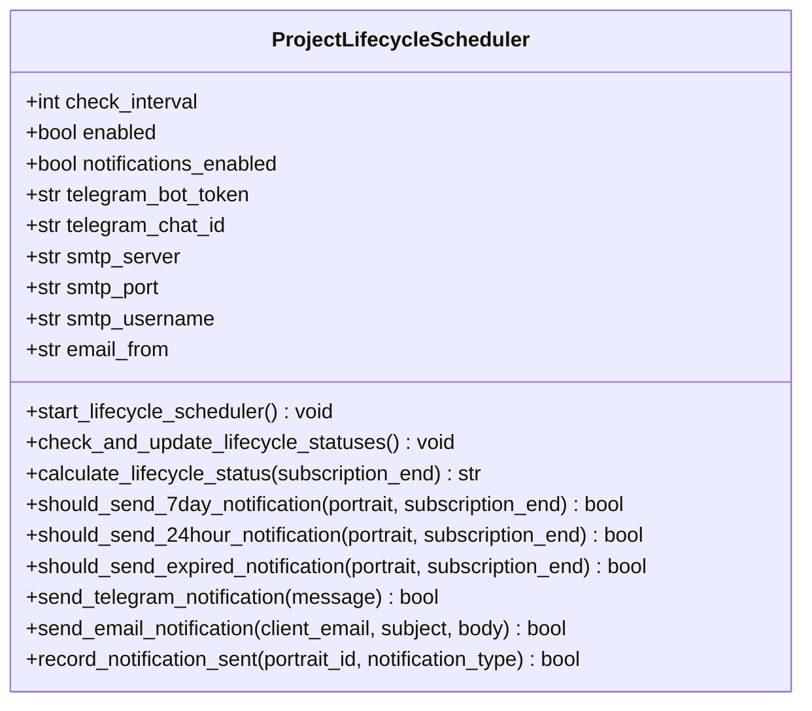
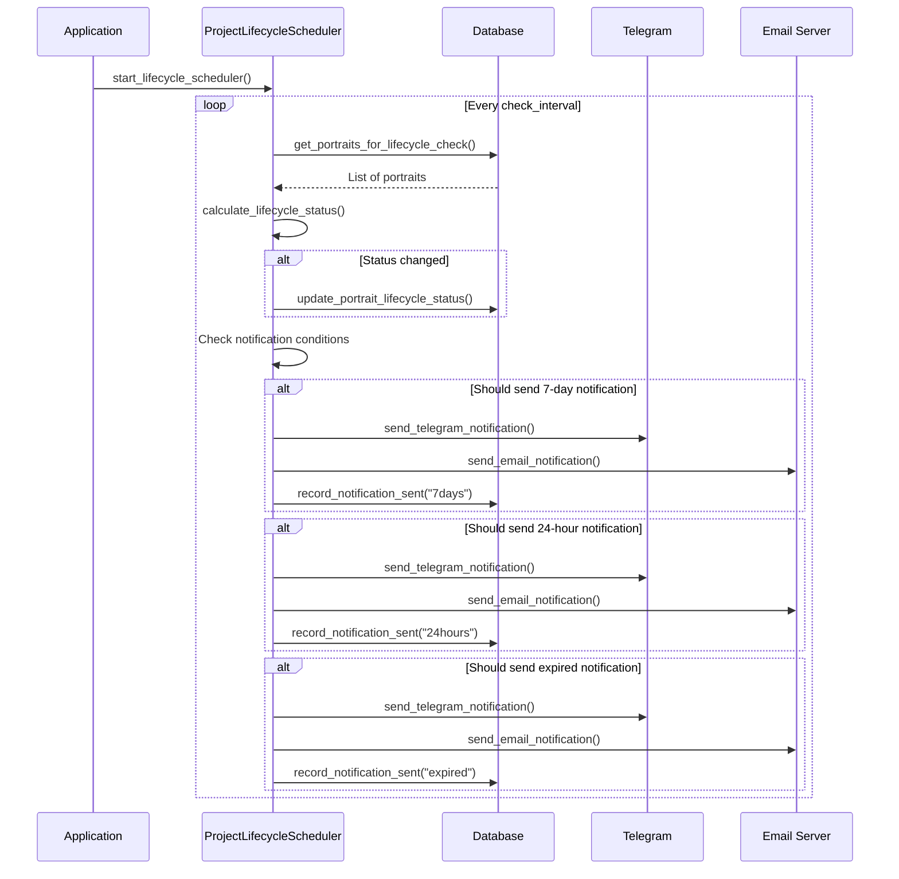
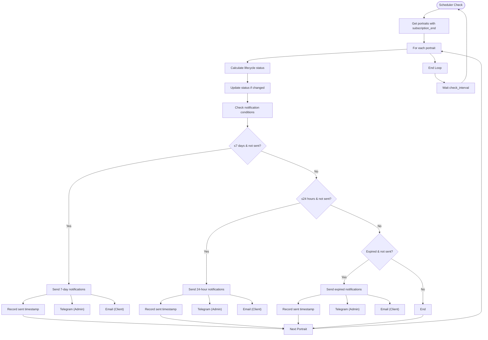

# Lifecycle Management

<cite>
**Referenced Files in This Document**   
- [project_lifecycle.py](file://vertex-ar/app/project_lifecycle.py)
- [lifecycle-fields.md](file://docs/features/lifecycle-fields.md)
- [lifecycle-scheduler.md](file://docs/features/lifecycle-scheduler.md)
- [lifecycle-scheduler-summary.md](file://docs/features/lifecycle-scheduler-summary.md)
- [models.py](file://vertex-ar/app/models.py)
- [database.py](file://vertex-ar/app/database.py)
- [projects.py](file://vertex-ar/app/api/projects.py)
- [orders.py](file://vertex-ar/app/api/orders.py)
</cite>

## Table of Contents
1. [Introduction](#introduction)
2. [Lifecycle Fields](#lifecycle-fields)
3. [ProjectLifecycle Class](#projectlifecycle-class)
4. [Scheduler Integration](#scheduler-integration)
5. [API Endpoints](#api-endpoints)
6. [Business Rules](#business-rules)
7. [Notification System](#notification-system)
8. [Audit and Compliance](#audit-and-compliance)
9. [Backup Integration](#backup-integration)
10. [Examples](#examples)

## Introduction

The Lifecycle Management system provides automated handling of project states from creation through archival or deletion. This system tracks subscription end dates, manages status transitions, and sends notifications at key milestones. The implementation includes both projects and portraits (orders), with automatic status updates based on expiration dates and configurable notification triggers.

The lifecycle management system is designed to ensure that content remains accessible only for authorized periods, with proper notifications sent to administrators and clients before expiration. The system supports manual overrides through API endpoints while maintaining automated time-based transitions.

**Section sources**
- [lifecycle-fields.md](file://docs/features/lifecycle-fields.md#L5-L298)
- [lifecycle-scheduler.md](file://docs/features/lifecycle-scheduler.md#L5-L433)

## Lifecycle Fields

The lifecycle management system introduces several fields to track the state of projects and portraits throughout their lifecycle.

### Projects Table Fields

The `projects` table contains the following lifecycle-related fields:

- `status` (TEXT): Lifecycle status with CHECK constraint for 'active', 'expiring', 'archived'; default is 'active'
- `subscription_end` (TIMESTAMP): Subscription expiration date in ISO format; NULL means no expiration
- `last_status_change` (TIMESTAMP): Timestamp of the last status update, automatically set
- `notified_7d` (TIMESTAMP): Timestamp when 7-day warning notification was sent
- `notified_24h` (TIMESTAMP): Timestamp when 24-hour warning notification was sent
- `notified_expired` (TIMESTAMP): Timestamp when expiration notification was sent

### Portraits Table Fields

The `portraits` table includes these lifecycle fields:

- `subscription_end` (TIMESTAMP): Subscription expiration date
- `lifecycle_status` (TEXT): Status with CHECK constraint for 'active', 'expiring', 'archived'
- `last_status_change` (TIMESTAMP): Timestamp of last status update
- `notification_7days_sent` (TIMESTAMP): Timestamp of 7-day warning notification
- `notification_24hours_sent` (TIMESTAMP): Timestamp of 24-hour warning notification
- `notification_expired_sent` (TIMESTAMP): Timestamp of expiration notification

### Status Values

The system recognizes three status values:

- **active**: More than 7 days remaining until expiration (or no expiration date)
- **expiring**: 7 days or less remaining until expiration
- **archived**: Past expiration date

Status can be managed through three mechanisms: automatic calculation based on `subscription_end` date, manual API updates, or background scheduler updates.

**Section sources**
- [lifecycle-fields.md](file://docs/features/lifecycle-fields.md#L9-L298)
- [models.py](file://vertex-ar/app/models.py#L620-L700)

## ProjectLifecycle Class

The `ProjectLifecycleScheduler` class implements the core functionality for automated lifecycle management.



**Diagram sources**
- [project_lifecycle.py](file://vertex-ar/app/project_lifecycle.py#L1-L540)

### Core Methods

The class provides several key methods for lifecycle management:

- `check_and_update_lifecycle_statuses()`: Main method that processes all portraits with subscription end dates
- `calculate_lifecycle_status()`: Determines the current status based on time remaining until expiration
- `should_send_*_notification()`: Business logic methods that determine if notifications should be sent
- `send_telegram_notification()`: Sends admin alerts via Telegram
- `send_email_notification()`: Sends client notifications via email
- `record_notification_sent()`: Updates database with notification timestamps

The scheduler runs in a continuous loop, checking for status updates at regular intervals defined by the `check_interval` configuration parameter.

**Section sources**
- [project_lifecycle.py](file://vertex-ar/app/project_lifecycle.py#L1-L540)
- [lifecycle-scheduler.md](file://docs/features/lifecycle-scheduler.md#L180-L433)

## Scheduler Integration

The lifecycle scheduler is integrated into the application startup process and runs as a background task.



**Diagram sources**
- [project_lifecycle.py](file://vertex-ar/app/project_lifecycle.py#L525-L540)
- [lifecycle-scheduler.md](file://docs/features/lifecycle-scheduler.md#L215-L271)

### Startup Configuration

The scheduler is registered as a background task in the application startup process:

```python
if settings.LIFECYCLE_SCHEDULER_ENABLED:
    from app.project_lifecycle import project_lifecycle_scheduler
    
    @app.on_event("startup")
    async def start_lifecycle_scheduler():
        asyncio.create_task(project_lifecycle_scheduler.start_lifecycle_scheduler())
        logger.info("Lifecycle scheduler started")
```

The scheduler configuration is controlled by environment variables:

- `LIFECYCLE_SCHEDULER_ENABLED`: Enables/disables the scheduler (default: true)
- `LIFECYCLE_CHECK_INTERVAL_SECONDS`: Check interval in seconds (default: 3600 = 1 hour)
- `LIFECYCLE_NOTIFICATIONS_ENABLED`: Enables/disables notifications (default: true)

**Section sources**
- [project_lifecycle.py](file://vertex-ar/app/project_lifecycle.py#L525-L540)
- [lifecycle-scheduler.md](file://docs/features/lifecycle-scheduler.md#L190-L211)

## API Endpoints

The system provides API endpoints for querying lifecycle states and triggering manual transitions.

### Project Endpoints

#### POST /api/projects
Create a new project with lifecycle fields:

```json
{
  "name": "Project Name",
  "description": "Optional description",
  "company_id": "company-uuid",
  "status": "active",
  "subscription_end": "2024-12-31T23:59:59Z"
}
```

#### PUT /api/projects/{project_id}
Update project lifecycle fields:

```json
{
  "name": "Updated Name",
  "status": "expiring",
  "subscription_end": "2024-06-30T23:59:59Z"
}
```

#### GET /api/projects/{project_id}
Response includes lifecycle fields:

```json
{
  "id": "project-uuid",
  "name": "Project Name",
  "description": "Description",
  "company_id": "company-uuid",
  "created_at": "2024-01-01T00:00:00Z",
  "status": "active",
  "subscription_end": "2024-12-31T23:59:59Z",
  "last_status_change": "2024-01-01T00:00:00Z"
}
```

### Order/Portrait Endpoints

#### POST /orders/create
Create order with subscription end date:

```
POST /orders/create
Content-Type: multipart/form-data

phone: "+1234567890"
name: "Client Name"
image: <file>
video: <file>
description: "Optional description"
company_id: "company-uuid"
subscription_end: "2024-12-31T23:59:59Z"
```

#### Portrait Response
All portrait responses include lifecycle information:

```json
{
  "id": "portrait-uuid",
  "client_id": "client-uuid",
  "permanent_link": "portrait_xxx",
  "created_at": "2024-01-01T00:00:00Z",
  "view_count": 0,
  "subscription_end": "2024-12-31T23:59:59Z",
  "lifecycle_status": "active",
  "last_status_change": "2024-01-01T00:00:00Z"
}
```

**Section sources**
- [projects.py](file://vertex-ar/app/api/projects.py#L31-L170)
- [orders.py](file://vertex-ar/app/api/orders.py#L494-L512)
- [lifecycle-fields.md](file://docs/features/lifecycle-fields.md#L50-L124)

## Business Rules

The lifecycle management system enforces several business rules governing state changes.

### Status Transition Rules

- A project/portrait with no `subscription_end` date remains in 'active' status indefinitely
- When `subscription_end` is set, status is calculated based on time remaining:
  - >7 days remaining: 'active'
  - ≤7 days remaining: 'expiring'
  - Past expiration date: 'archived'
- Manual status changes via API override automatic calculations
- Status changes automatically update the `last_status_change` timestamp

### Notification Rules

The system sends notifications at three critical milestones:

#### 7-Day Warning
- Triggered when ≤7 days remain before expiration
- Sent once per portrait (tracked to avoid duplicates)
- Includes days remaining and expiration date
- Sent via Telegram (admin) and Email (client, if email exists)

#### 24-Hour Warning
- Triggered when ≤24 hours remain before expiration
- Sent once per portrait (tracked to avoid duplicates)
- Final reminder before expiration
- Sent via Telegram (admin) and Email (client, if email exists)

#### Post-Expiry Notification
- Triggered immediately after subscription expires
- Notifies that portrait has been archived
- Includes renewal instructions
- Sent via Telegram (admin) and Email (client, if email exists)

Notifications are tracked in the database to prevent duplicates, with separate timestamp fields for each notification type.

**Section sources**
- [lifecycle-scheduler.md](file://docs/features/lifecycle-scheduler.md#L13-L47)
- [project_lifecycle.py](file://vertex-ar/app/project_lifecycle.py#L1-L540)

## Notification System

The notification system integrates with both Telegram and email services to alert administrators and clients.

### Notification Flow



**Diagram sources**
- [lifecycle-scheduler.md](file://docs/features/lifecycle-scheduler.md#L215-L271)
- [project_lifecycle.py](file://vertex-ar/app/project_lifecycle.py#L1-L540)

### Bilingual Support

All client notifications include both Russian and English versions:

**7-Day Warning:**
```
Subject RU: Подписка истекает через 7 дней
Subject EN: Subscription expires in 7 days
```

**24-Hour Warning:**
```
Subject RU: Подписка истекает через 24 часа
Subject EN: Subscription expires in 24 hours
```

**Post-Expiry:**
```
Subject RU: Подписка истекла
Subject EN: Subscription expired
```

The system logs all sent notifications to the `notification_history` table for audit purposes.

**Section sources**
- [lifecycle-scheduler.md](file://docs/features/lifecycle-scheduler.md#L47-L67)
- [lifecycle-scheduler.md](file://docs/features/lifecycle-scheduler.md#L295-L304)

## Audit and Compliance

The lifecycle management system includes comprehensive audit and compliance features.

### Logging

The scheduler logs all operations with appropriate severity levels:

```
INFO: Starting lifecycle scheduler - checking every 3600 seconds
INFO: Updated lifecycle status for portrait abc123: active -> expiring
INFO: Sent 7-day notification for portrait abc123
INFO: Updated 5 portrait lifecycle statuses
```

Error conditions are logged with ERROR level, including stack traces when appropriate.

### Monitoring

The system exposes metrics for monitoring via Prometheus:

- `lifecycle_portraits_active`: Number of active portraits
- `lifecycle_portraits_expiring`: Number of expiring portraits
- `lifecycle_portraits_archived`: Number of archived portraits
- `lifecycle_notifications_sent_total`: Counter of sent notifications

These metrics allow system administrators to monitor the health of the lifecycle management system and identify potential issues.

### Data Integrity

The system ensures data integrity through several mechanisms:

- Database CHECK constraints on status fields
- Transactional updates to ensure consistency
- Timestamp tracking for all status changes and notifications
- Prevention of duplicate notifications through sent timestamp fields

**Section sources**
- [lifecycle-scheduler.md](file://docs/features/lifecycle-scheduler.md#L273-L294)
- [lifecycle-scheduler.md](file://docs/features/lifecycle-scheduler.md#L295-L304)

## Backup Integration

The lifecycle management system integrates with the backup system during project termination.

When a project reaches the 'archived' status, the system can trigger backup operations based on configuration:

- Automatic backup of project data to configured storage
- Notification to administrators about archived projects requiring backup
- Integration with remote backup providers (Yandex Disk, Google Drive, etc.)

The backup system respects lifecycle policies, ensuring that only active and expiring projects are included in regular backups, while archived projects are handled according to retention policies.

The system prevents deletion of the last backup of any type, ensuring that at least one restore point is always available:

```python
if is_last_of_type:
    can_delete = False
    reason = f"Cannot delete the last {backup_type_to_delete} backup"
    recommendation = (
        f"This is your only {backup_type_to_delete} backup. "
        f"To maintain at least one restore point, please create a new "
        f"{backup_type_to_delete} or full backup before deleting this one."
    )
```

This integration ensures compliance with data retention policies and provides a safety net against accidental data loss.

**Section sources**
- [backups.py](file://vertex-ar/app/api/backups.py#L407-L471)
- [lifecycle-scheduler.md](file://docs/features/lifecycle-scheduler.md#L413-L416)

## Examples

### Example 1: Creating a Project with Expiration

```python
from datetime import datetime, timedelta

# Create a project that expires in 30 days
project_data = {
    "name": "Temporary Campaign",
    "description": "30-day promotional campaign",
    "company_id": "company-123",
    "subscription_end": (datetime.utcnow() + timedelta(days=30)).isoformat()
}

# POST /api/projects with project_data
# Result: Project created with status 'active'
```

After 23 days, the scheduler will automatically update the status to 'expiring' and send a 7-day warning notification.

### Example 2: Manual Status Update

```python
# Manually archive a project
update_data = {
    "status": "archived"
}

# PUT /api/projects/{project_id} with update_data
# Result: Project status updated to 'archived', last_status_change timestamp updated
```

### Example 3: Renewing an Expired Project

```python
from datetime import datetime, timedelta

# Renew subscription for another 30 days
update_data = {
    "subscription_end": (datetime.utcnow() + timedelta(days=30)).isoformat(),
    "status": "active"
}

# PUT /api/projects/{project_id} with update_data
# Result: Project reactivated with new expiration date
```

After renewal, administrators should reset notification flags to ensure clients receive appropriate notifications for the new subscription period.

**Section sources**
- [lifecycle-scheduler.md](file://docs/features/lifecycle-scheduler.md#L319-L330)
- [lifecycle-scheduler.md](file://docs/features/lifecycle-scheduler.md#L338-L349)
- [lifecycle-fields.md](file://docs/features/lifecycle-fields.md#L50-L74)