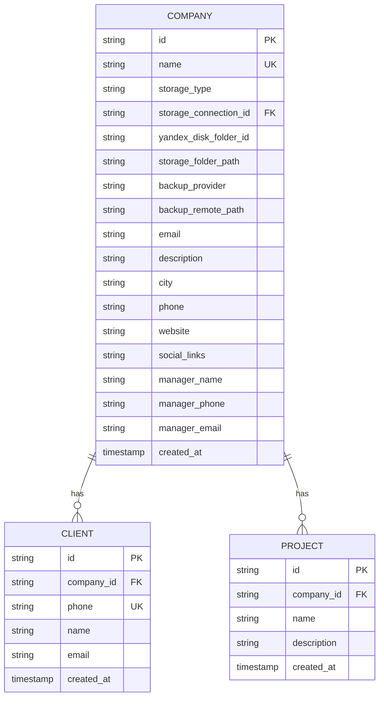
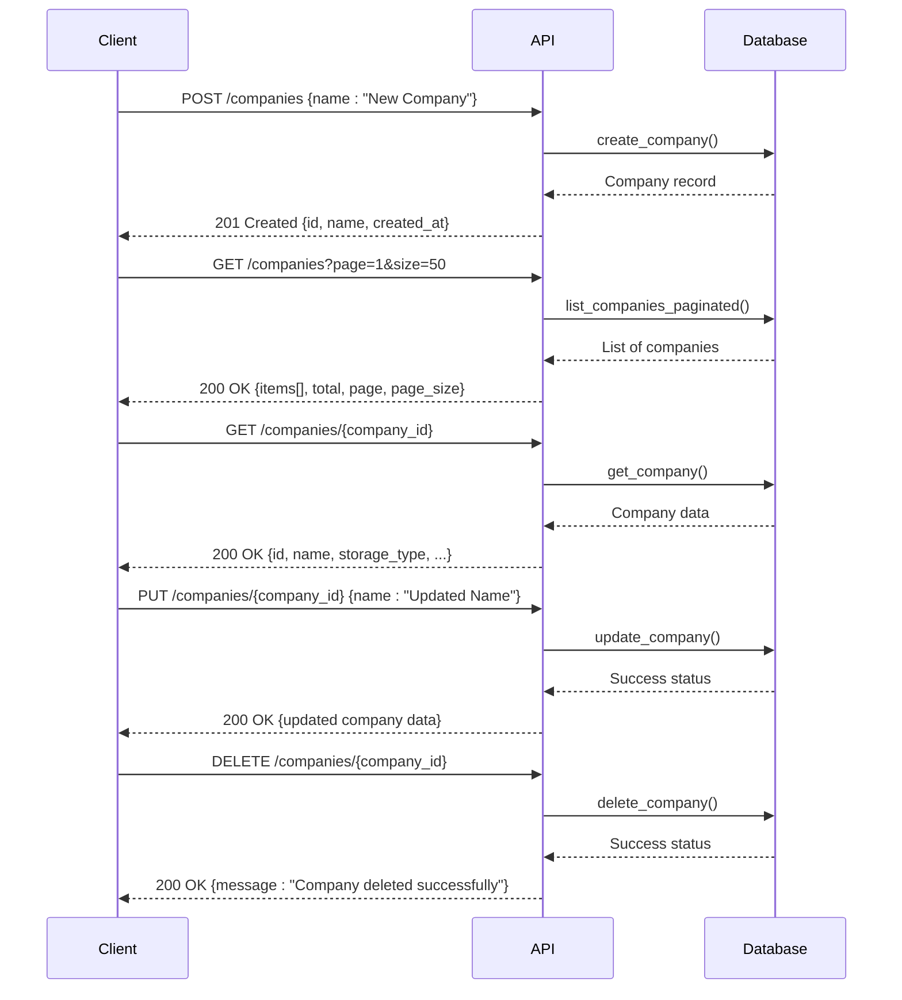
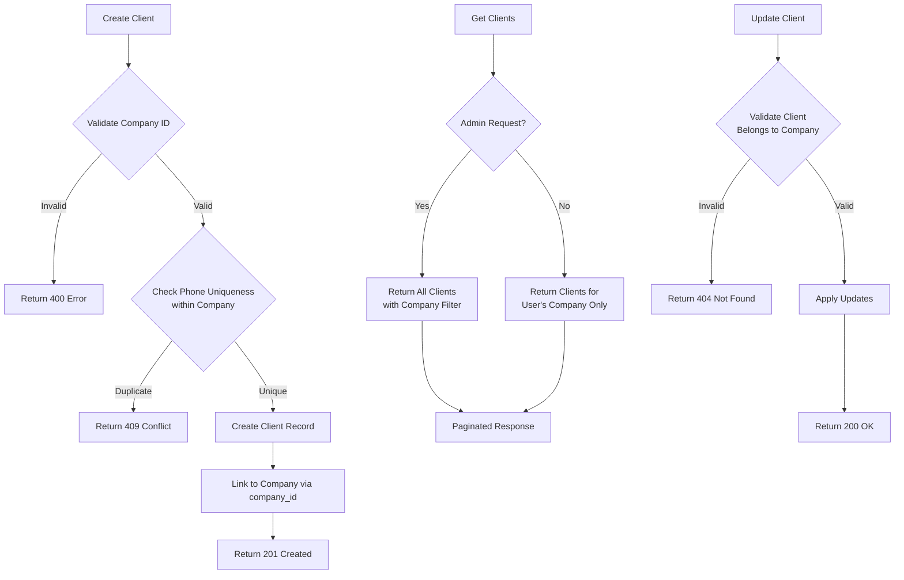
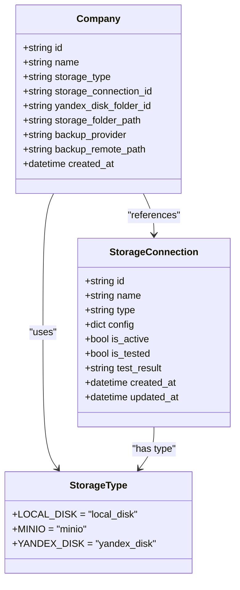
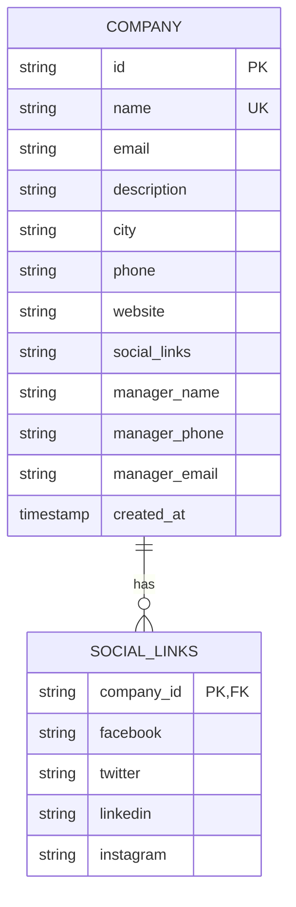
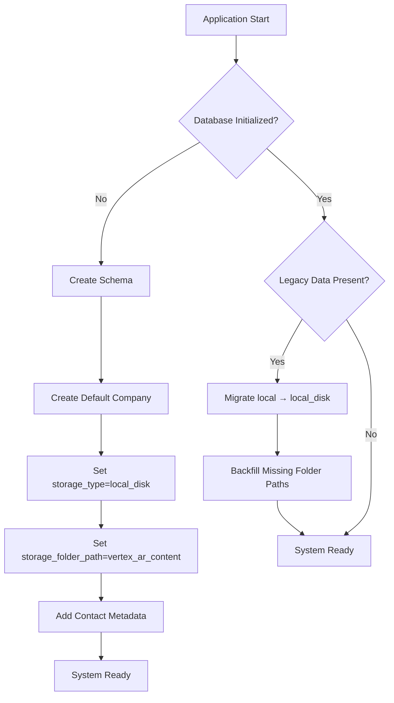
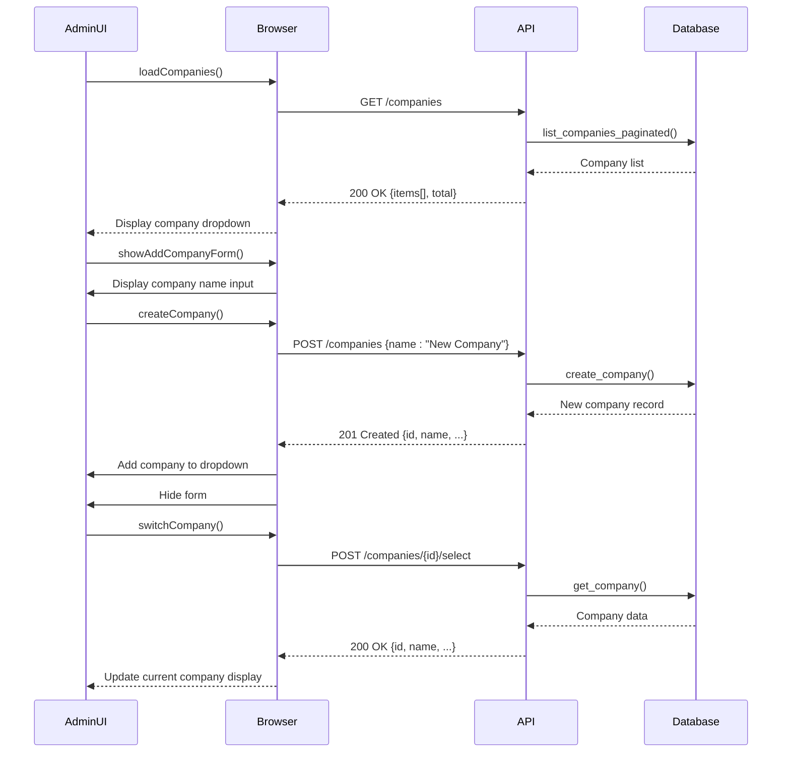
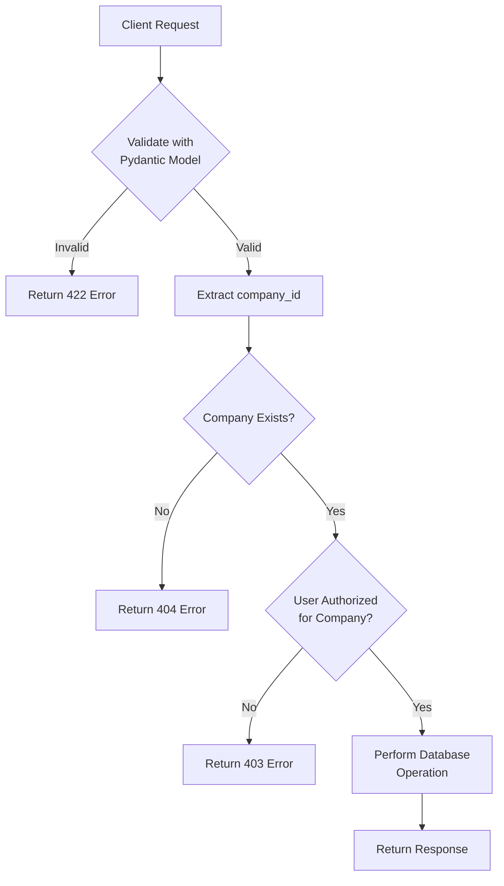

# Multi-Company Tenancy

<cite>
**Referenced Files in This Document**   
- [multicompany.md](file://docs/features/multicompany.md)
- [models.py](file://vertex-ar/app/models.py)
- [companies.py](file://vertex-ar/app/api/companies.py)
- [database.py](file://vertex-ar/app/database.py)
- [clients.py](file://vertex-ar/app/api/clients.py)
- [COMPANY_STORAGE_DEFAULTS_MIGRATION.md](file://COMPANY_STORAGE_DEFAULTS_MIGRATION.md)
- [COMPANY_CONTACT_FIELDS_IMPLEMENTATION.md](file://COMPANY_CONTACT_FIELDS_IMPLEMENTATION.md)
- [test_company_storage_defaults.py](file://test_files/unit/test_company_storage_defaults.py)
- [test_company_contact_fields.py](file://test_files/unit/test_company_contact_fields.py)
</cite>

## Table of Contents
1. [Introduction](#introduction)
2. [Company Model and Data Structure](#company-model-and-data-structure)
3. [API Endpoints for Company Management](#api-endpoints-for-company-management)
4. [Client Management and Company Isolation](#client-management-and-company-isolation)
5. [Storage Configuration and Defaults](#storage-configuration-and-defaults)
6. [Contact Fields and Company Metadata](#contact-fields-and-company-metadata)
7. [Configuration Inheritance and Default Company](#configuration-inheritance-and-default-company)
8. [Administrative Workflows and UI Integration](#administrative-workflows-and-ui-integration)
9. [Data Privacy and Access Controls](#data-privacy-and-access-controls)
10. [Real-World Usage Scenarios](#real-world-usage-scenarios)
11. [Code Examples and Implementation Patterns](#code-examples-and-implementation-patterns)

## Introduction

The Multi-Company Tenancy system in Vertex AR enables a single application instance to support multiple independent company environments within a shared infrastructure. This architecture allows enterprises to manage multiple brands, subsidiaries, or client organizations while maintaining strict data isolation between them. Each company operates as a separate tenant with its own clients, content, and configuration settings, all managed through a unified administrative interface. The system is designed with security, scalability, and ease of management in mind, providing robust isolation mechanisms while allowing administrators to efficiently manage multiple companies from a central dashboard.

**Section sources**
- [multicompany.md](file://docs/features/multicompany.md#L1-L230)

## Company Model and Data Structure

The Company model serves as the foundation for multi-tenancy in the Vertex AR system, providing the structural basis for data isolation and tenant-specific configuration. The model is implemented as a database table with a unique identifier, name, and creation timestamp, establishing each company as a distinct entity within the system. The core architecture ensures that all related data entities, such as clients, projects, and media content, are linked to a specific company through foreign key relationships, creating a hierarchical data structure that enforces tenant isolation.

The companies table is defined with a primary key ID, a unique name constraint, and a creation timestamp, ensuring that each company has a distinct identity within the system. This design prevents naming conflicts and provides a reliable mechanism for company identification across the application. The model supports comprehensive metadata storage, including contact information, location details, and manager information, allowing each company to maintain a complete profile within the system.

**Diagram sources**
- [database.py](file://vertex-ar/app/database.py#L127-L131)
- [database.py](file://vertex-ar/app/database.py#L169-L176)
- [database.py](file://vertex-ar/app/database.py#L139-L146)

**Section sources**
- [multicompany.md](file://docs/features/multicompany.md#L9-L15)
- [models.py](file://vertex-ar/app/models.py#L79-L192)
- [database.py](file://vertex-ar/app/database.py#L127-L131)

## API Endpoints for Company Management

The system provides a comprehensive set of API endpoints for managing companies, enabling creation, retrieval, updating, and deletion of company records through standardized RESTful interfaces. These endpoints are secured with authentication and authorization mechanisms, ensuring that only authorized administrators can perform company management operations. The API design follows REST principles with appropriate HTTP methods and status codes, providing a consistent and predictable interface for programmatic interaction with the multi-tenancy system.

The company management API includes endpoints for creating new companies, listing existing companies with pagination and filtering capabilities, retrieving specific company details, updating company information, and deleting companies. Each endpoint is designed with appropriate validation and error handling to ensure data integrity and provide meaningful feedback to clients. The API also includes specialized endpoints for company selection and storage configuration, supporting the complete lifecycle of company management within the multi-tenancy framework.

**Diagram sources**
- [companies.py](file://vertex-ar/app/api/companies.py#L86-L338)
- [companies.py](file://vertex-ar/app/api/companies.py#L177-L257)
- [companies.py](file://vertex-ar/app/api/companies.py#L259-L296)

**Section sources**
- [multicompany.md](file://docs/features/multicompany.md#L31-L96)
- [companies.py](file://vertex-ar/app/api/companies.py#L86-L787)

## Client Management and Company Isolation

Client management in the multi-company tenancy system is designed with strict company isolation, ensuring that clients belong exclusively to a single company and cannot be accessed or modified by users associated with other companies. The client model includes a company_id field that establishes a foreign key relationship with the companies table, creating a direct link between each client and their parent company. This relationship enforces data isolation at the database level, with cascading deletes ensuring that when a company is removed, all associated clients are automatically deleted as well.

The system implements unique constraints that operate within the context of each company, allowing different companies to have clients with identical phone numbers while preventing duplicates within the same company. This design supports real-world scenarios where multiple organizations may have clients with the same contact information without creating conflicts in the system. Client operations, including creation, retrieval, updating, and deletion, all require the company context to be specified, ensuring that actions are performed within the appropriate tenant boundary.

**Diagram sources**
- [database.py](file://vertex-ar/app/database.py#L169-L176)
- [clients.py](file://vertex-ar/app/api/clients.py#L72-L131)
- [clients.py](file://vertex-ar/app/api/clients.py#L147-L235)

**Section sources**
- [multicompany.md](file://docs/features/multicompany.md#L18-L29)
- [models.py](file://vertex-ar/app/models.py#L536-L614)
- [clients.py](file://vertex-ar/app/api/clients.py#L72-L524)

## Storage Configuration and Defaults

The storage configuration system provides flexible options for managing company-specific storage settings, allowing each company to have its own storage type, connection, and folder structure. The system supports multiple storage types including local disk, MinIO, and Yandex Disk, with configuration options that can be set at the company level. This design enables organizations to optimize their storage strategy based on performance, cost, and reliability requirements for each subsidiary or brand they manage.

Storage defaults are implemented through a combination of database schema design, model defaults, and migration logic to ensure consistency across the system. The default company "Vertex AR" is configured with local disk storage and a predefined folder path, serving as a template for new companies. When creating new companies, the system applies sensible defaults for storage configuration, including "local_disk" as the default storage type and "vertex_ar_content" as the default folder path, while allowing these values to be overridden during company creation.

**Diagram sources**
- [models.py](file://vertex-ar/app/models.py#L80-L192)
- [COMPANY_STORAGE_DEFAULTS_MIGRATION.md](file://COMPANY_STORAGE_DEFAULTS_MIGRATION.md#L1-L219)
- [test_company_storage_defaults.py](file://test_files/unit/test_company_storage_defaults.py#L1-L453)

**Section sources**
- [COMPANY_STORAGE_DEFAULTS_MIGRATION.md](file://COMPANY_STORAGE_DEFAULTS_MIGRATION.md#L1-L219)
- [models.py](file://vertex-ar/app/models.py#L80-L192)
- [test_company_storage_defaults.py](file://test_files/unit/test_company_storage_defaults.py#L1-L453)

## Contact Fields and Company Metadata

The company model includes comprehensive contact fields and metadata to support rich company profiles, enabling organizations to maintain detailed information about each subsidiary or brand within the system. These fields include email, description, city, phone, website, social media links, and manager information, providing a complete organizational profile for each company. The implementation uses nullable database columns to accommodate varying levels of information completeness across different companies.

The contact fields are integrated into the company creation and update workflows, allowing administrators to populate this information when setting up new companies or modifying existing ones. The system validates input for these fields using standardized validation functions for email, phone numbers, URLs, and names, ensuring data quality and consistency across all company records. Social media links are stored as JSON-formatted strings, allowing flexible storage of multiple platform links while maintaining database compatibility.

**Diagram sources**
- [COMPANY_CONTACT_FIELDS_IMPLEMENTATION.md](file://COMPANY_CONTACT_FIELDS_IMPLEMENTATION.md#L1-L40)
- [test_company_contact_fields.py](file://test_files/unit/test_company_contact_fields.py#L1-L250)
- [database.py](file://vertex-ar/app/database.py#L217-L235)

**Section sources**
- [COMPANY_CONTACT_FIELDS_IMPLEMENTATION.md](file://COMPANY_CONTACT_FIELDS_IMPLEMENTATION.md#L1-L40)
- [test_company_contact_fields.py](file://test_files/unit/test_company_contact_fields.py#L1-L250)

## Configuration Inheritance and Default Company

The system implements a configuration inheritance model centered around the default company "Vertex AR," which serves as a template and fallback for the entire multi-tenancy system. This default company is automatically created during application initialization and cannot be deleted, ensuring that the system always has at least one operational company. The default company has predefined storage settings that cannot be modified, maintaining system stability and providing a consistent baseline configuration.

Configuration inheritance is implemented through database defaults and application logic that ensures new companies inherit sensible default values for storage configuration and other settings. When creating new companies, the system applies default values for storage type ("local_disk") and storage folder path ("vertex_ar_content"), while allowing these to be overridden with custom values. This design balances ease of use with flexibility, enabling rapid company setup while supporting customized configurations for specific organizational needs.

The system includes migration logic that automatically converts legacy storage type values ("local") to the current standard ("local_disk") during database initialization, ensuring consistency across all company records. This migration is idempotent and includes backfilling of missing storage folder paths, making it safe to run multiple times and ensuring data integrity across upgrades.

**Diagram sources**
- [COMPANY_STORAGE_DEFAULTS_MIGRATION.md](file://COMPANY_STORAGE_DEFAULTS_MIGRATION.md#L42-L54)
- [database.py](file://vertex-ar/app/database.py#L212-L246)
- [test_company_storage_defaults.py](file://test_files/unit/test_company_storage_defaults.py#L223-L265)

**Section sources**
- [COMPANY_STORAGE_DEFAULTS_MIGRATION.md](file://COMPANY_STORAGE_DEFAULTS_MIGRATION.md#L42-L54)
- [database.py](file://vertex-ar/app/database.py#L212-L246)
- [test_company_storage_defaults.py](file://test_files/unit/test_company_storage_defaults.py#L223-L265)

## Administrative Workflows and UI Integration

Administrative workflows for company management are tightly integrated with the user interface, providing administrators with intuitive tools for creating, selecting, and managing multiple companies from a centralized dashboard. The UI includes a company management block that displays the current company, provides a dropdown for switching between available companies, and includes buttons for creating new companies and deleting the current one. This design enables seamless navigation between company contexts while maintaining clear visual indication of the currently active company.

The administrative interface implements JavaScript functions that correspond to the backend API endpoints, creating a responsive and interactive experience for company management. These functions include loading the company list, showing and hiding the company creation form, creating new companies, switching between companies, and handling company deletion with confirmation dialogs. The UI enforces business rules such as preventing deletion of the default company and providing real-time feedback on company creation and selection operations.

**Diagram sources**
- [multicompany.md](file://docs/features/multicompany.md#L110-L158)
- [admin-dashboard.js](file://vertex-ar/static/js/admin-dashboard.js#L843-L880)
- [companies.py](file://vertex-ar/app/api/companies.py#L497-L522)

**Section sources**
- [multicompany.md](file://docs/features/multicompany.md#L110-L158)
- [admin-dashboard.js](file://vertex-ar/static/js/admin-dashboard.js#L843-L880)

## Data Privacy and Access Controls

Data privacy and access controls are fundamental to the multi-company tenancy system, ensuring that each company's data remains isolated and accessible only to authorized users. The system implements role-based access control with administrator privileges required for all company management operations, preventing unauthorized creation, modification, or deletion of company records. Authentication is enforced through session tokens, with all API endpoints requiring valid authentication credentials to access company-related functionality.

The access control model is implemented at multiple levels, including the API layer, database layer, and application logic, creating a defense-in-depth approach to data security. At the API level, endpoints validate that the requesting user has administrative privileges before processing company management requests. At the database level, foreign key relationships and cascading deletes ensure referential integrity and automatic cleanup of related data when companies are removed. Application logic enforces business rules such as preventing deletion of the default company and validating storage configurations before they are applied.

Audit logging is integrated throughout the system, recording all company management operations with timestamps, user information, and operation details. This provides a comprehensive audit trail for security monitoring and compliance purposes, allowing administrators to track changes to company configurations and investigate potential security incidents. The logging system captures successful operations, failed attempts, and validation errors, providing complete visibility into company management activities.

**Section sources**
- [multicompany.md](file://docs/features/multicompany.md#L205-L209)
- [companies.py](file://vertex-ar/app/api/companies.py#L47-L84)
- [middleware.py](file://vertex-ar/app/middleware.py#L18-L156)

## Real-World Usage Scenarios

The multi-company tenancy system supports a variety of real-world usage scenarios where enterprises need to manage multiple brands, subsidiaries, or client organizations within a single platform. One common scenario involves a marketing agency that manages AR campaigns for multiple clients, with each client organization represented as a separate company in the system. This allows the agency to maintain clear separation between client data while using a unified platform for content creation and management.

Another scenario involves a large corporation with multiple divisions or product lines, each operating as a semi-autonomous unit with its own branding and marketing initiatives. The multi-company tenancy system enables each division to have its own isolated environment for AR content creation, with customized storage configurations and contact information that reflect their specific operational requirements. This structure supports decentralized management while maintaining centralized oversight and control.

Franchise operations represent another important use case, where a central organization provides AR technology to multiple franchise locations. Each franchise location can be represented as a separate company, allowing them to manage their own clients and content while adhering to brand guidelines and sharing resources through the central platform. This model supports scalability and local customization, enabling rapid deployment of AR experiences across a distributed network of locations.

**Section sources**
- [multicompany.md](file://docs/features/multicompany.md#L167-L170)

## Code Examples and Implementation Patterns

The implementation of multi-company tenancy follows several key patterns that ensure data isolation, maintainability, and extensibility. One fundamental pattern is the use of company_id as a required parameter in all data operations, ensuring that queries and mutations are scoped to the appropriate tenant. This pattern is evident in the client creation example, where the company_id is explicitly specified when creating a new client record, establishing the relationship between the client and their parent company.

Another important pattern is the use of Pydantic models for request validation and response serialization, providing type safety and automatic validation of input data. The CompanyCreate model demonstrates this pattern, defining the structure of company creation requests with field constraints and validation methods that ensure data quality before it reaches the database layer. This approach reduces the risk of data integrity issues and provides clear error messages when validation fails.

The system also implements a repository pattern for database operations, with the Database class providing a clean interface for data access while encapsulating the underlying SQL implementation. This pattern promotes separation of concerns and makes the codebase more testable and maintainable. The use of parameterized queries and connection pooling further enhances performance and security, protecting against SQL injection attacks and optimizing database resource usage.

**Section sources**
- [multicompany.md](file://docs/features/multicompany.md#L171-L177)
- [models.py](file://vertex-ar/app/models.py#L80-L192)
- [database.py](file://vertex-ar/app/database.py#L34-L4163)