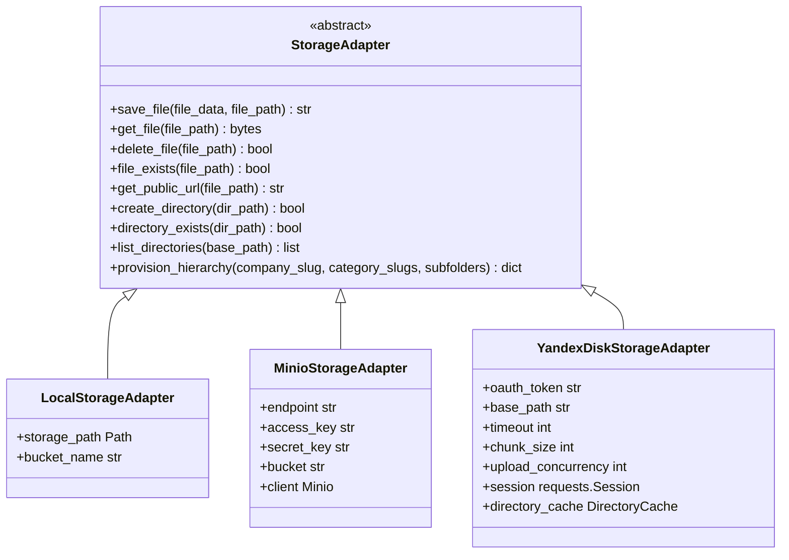
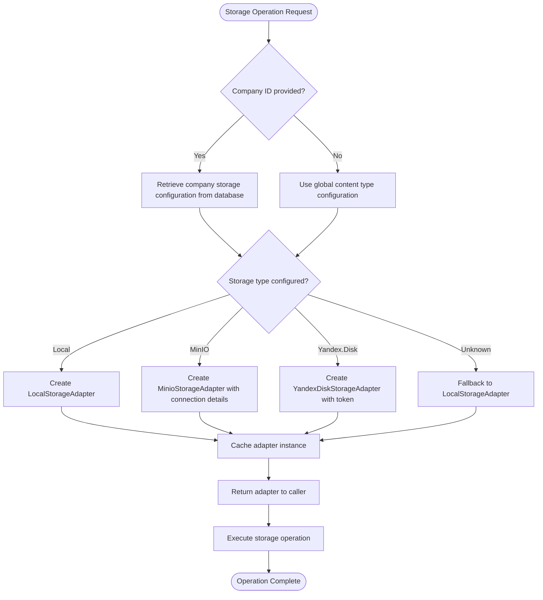
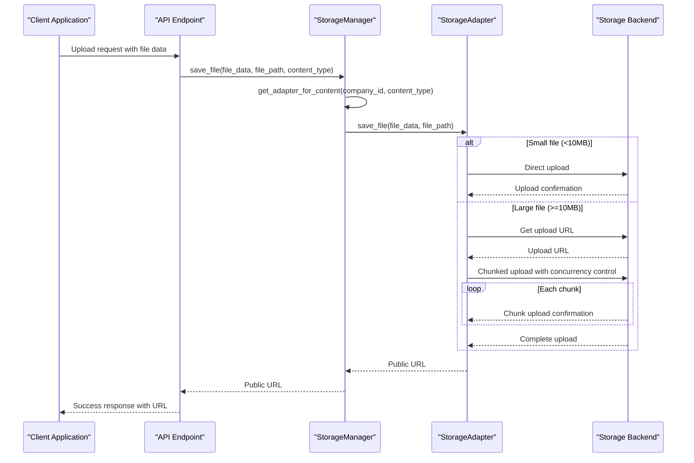
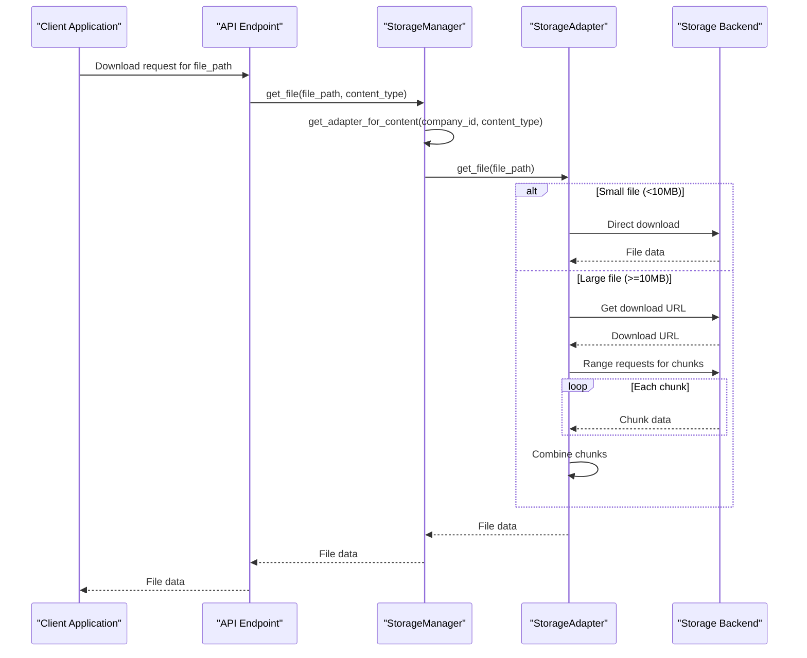

# Storage Orchestration

<cite>
**Referenced Files in This Document**   
- [storage_manager.py](file://vertex-ar/storage_manager.py)
- [storage_adapter.py](file://vertex-ar/storage_adapter.py)
- [storage_config.py](file://vertex-ar/storage_config.py)
- [storage_minio.py](file://vertex-ar/app/storage_minio.py)
- [storage_yandex.py](file://vertex-ar/app/storage_yandex.py)
- [storage_config.json](file://vertex-ar/config/storage_config.json)
- [remote_storage.example.json](file://vertex-ar/config/remote_storage.example.json)
</cite>

## Table of Contents
1. [Introduction](#introduction)
2. [Adapter Pattern Implementation](#adapter-pattern-implementation)
3. [StorageManager Class](#storagemanager-class)
4. [Configuration Files](#configuration-files)
5. [Runtime Storage Selection](#runtime-storage-selection)
6. [Data Flow Diagrams](#data-flow-diagrams)
7. [Failover Mechanisms](#failover-mechanisms)
8. [Path Resolution and Metadata](#path-resolution-and-metadata)
9. [Performance Considerations](#performance-considerations)
10. [Migration Strategies](#migration-strategies)
11. [Backup Integration](#backup-integration)

## Introduction

The Storage Orchestration system in Vertex AR provides a flexible and extensible architecture for managing multiple storage backends through a unified interface. This system enables seamless integration of different storage solutions including local disk, MinIO/S3-compatible object storage, and Yandex.Disk cloud storage. The design follows the adapter pattern, allowing pluggable storage backends that can be configured independently for different content types such as portraits, videos, previews, and NFT markers. This documentation details the implementation, configuration, and operational aspects of this storage orchestration system.

**Section sources**
- [storage_manager.py](file://vertex-ar/storage_manager.py#L1-L582)
- [storage_adapter.py](file://vertex-ar/storage_adapter.py#L1-L341)

## Adapter Pattern Implementation

The storage system implements the adapter pattern to provide a consistent interface across different storage backends. The core of this implementation is the `StorageAdapter` abstract base class defined in `storage_adapter.py`, which declares the common interface that all storage implementations must follow. This interface includes methods for saving, retrieving, deleting, and checking the existence of files, as well as generating public URLs and managing directory structures.

Three concrete adapter implementations are provided:
- `LocalStorageAdapter` for local filesystem storage
- `MinioStorageAdapter` for MinIO/S3-compatible object storage
- `YandexDiskStorageAdapter` for Yandex.Disk cloud storage

Each adapter implements the same interface but handles the specific requirements and APIs of its respective storage backend. This design allows the application code to interact with storage through a uniform API while supporting multiple backend technologies. The adapter pattern enables easy extension to additional storage providers by simply implementing the adapter interface for the new backend.



**Diagram sources**
- [storage_adapter.py](file://vertex-ar/storage_adapter.py#L19-L341)
- [storage_local.py](file://vertex-ar/storage_local.py#L1-L92)
- [storage_minio.py](file://vertex-ar/app/storage_minio.py#L1-L237)
- [storage_yandex.py](file://vertex-ar/app/storage_yandex.py#L84-L1168)

## StorageManager Class

The `StorageManager` class serves as the central orchestrator for storage operations in the Vertex AR application. It acts as a factory and router, managing instances of different storage adapters based on content type and company-specific configurations. The manager is initialized with a storage root path and automatically loads configuration from `storage_config.json`.

The manager maintains two levels of adapter caching:
1. Global adapters for each content type (portraits, videos, previews, nft_markers)
2. Company-specific adapters that can override global settings

When a storage operation is requested, the manager routes it to the appropriate adapter based on the content type and optional company ID. For company-specific storage configurations, the manager retrieves the company's storage settings from the database and creates a specialized adapter instance. This allows different companies to use different storage backends or configurations within the same application instance.

The manager also provides methods for reinitializing adapters when configuration changes, clearing adapter caches, and provisioning complete storage hierarchies for new companies.

**Section sources**
- [storage_manager.py](file://vertex-ar/storage_manager.py#L19-L582)

## Configuration Files

### storage_config.json

The primary configuration file `storage_config.json` defines the storage settings for different content types and global storage parameters. The configuration is organized into several sections:

```json
{
  "content_types": {
    "portraits": {
      "storage_type": "local",
      "yandex_disk": {
        "enabled": false,
        "base_path": "vertex-ar/portraits"
      }
    },
    "videos": {
      "storage_type": "local",
      "yandex_disk": {
        "enabled": false,
        "base_path": "vertex-ar/videos"
      }
    }
  },
  "backup_settings": {
    "auto_split_backups": true,
    "max_backup_size_mb": 500,
    "chunk_size_mb": 100,
    "compression": "gz"
  },
  "yandex_disk": {
    "oauth_token": "",
    "enabled": false
  },
  "minio": {
    "enabled": false,
    "endpoint": "",
    "access_key": "",
    "secret_key": "",
    "bucket": ""
  }
}
```

The `content_types` section specifies the storage backend for each content type, with options for local storage or Yandex.Disk. The `backup_settings` section configures parameters for backup operations. The `yandex_disk` and `minio` sections contain connection details for remote storage services.

### remote_storage.example.json

This example configuration file demonstrates how to configure remote storage services:

```json
{
  "yandex_disk": {
    "enabled": false,
    "oauth_token": "YOUR_YANDEX_DISK_OAUTH_TOKEN"
  },
  "google_drive": {
    "enabled": false,
    "credentials": {
      "access_token": "YOUR_GOOGLE_DRIVE_ACCESS_TOKEN",
      "folder_id": "OPTIONAL_FOLDER_ID_FOR_BACKUPS"
    }
  }
}
```

This file serves as a template for configuring additional remote storage providers beyond those natively supported. It shows the structure for Yandex.Disk and Google Drive configurations, which can be extended to support other cloud storage services.

**Section sources**
- [storage_config.json](file://vertex-ar/config/storage_config.json#L1-L49)
- [remote_storage.example.json](file://vertex-ar/config/remote_storage.example.json#L1-L14)
- [storage_config.py](file://vertex-ar/storage_config.py#L1-L203)

## Runtime Storage Selection

The storage orchestration system uses a hierarchical approach to determine which storage backend to use for each operation. The selection logic follows these rules:

1. **Content Type Configuration**: Each content type (portraits, videos, etc.) has a default storage type configured in `storage_config.json`
2. **Company Override**: Companies can have their own storage configuration stored in the database, which takes precedence over global settings
3. **Connection Configuration**: For remote storage, specific connection details are retrieved from the database
4. **Fallback Mechanism**: If a configured storage backend is unavailable, the system falls back to local storage

The `StorageManager` class implements this selection logic through several methods:

- `get_adapter(content_type)`: Returns the global adapter for a content type
- `get_company_adapter(company_id, content_type)`: Returns a company-specific adapter
- `get_adapter_for_content(company_id, content_type)`: Returns the appropriate adapter based on company context

When retrieving a company-specific adapter, the manager first checks its cache. If no cached adapter exists, it retrieves the company's storage configuration from the database and creates a new adapter instance based on the storage type and connection details. This adapter is then cached for future use.



**Diagram sources**
- [storage_manager.py](file://vertex-ar/storage_manager.py#L200-L316)
- [storage_config.py](file://vertex-ar/storage_config.py#L108-L121)

## Data Flow Diagrams

### Upload Flow

The upload process follows a consistent pattern across all storage backends, with variations in how large files are handled:



**Diagram sources**
- [storage_manager.py](file://vertex-ar/storage_manager.py#L110-L122)
- [storage_minio.py](file://vertex-ar/app/storage_minio.py#L43-L63)
- [storage_yandex.py](file://vertex-ar/app/storage_yandex.py#L452-L502)

### Download Flow

The download process also follows a consistent pattern, with optimizations for large files:



**Diagram sources**
- [storage_manager.py](file://vertex-ar/storage_manager.py#L124-L135)
- [storage_minio.py](file://vertex-ar/app/storage_minio.py#L67-L81)
- [storage_yandex.py](file://vertex-ar/app/storage_yandex.py#L561-L600)

## Failover Mechanisms

The storage orchestration system includes several failover mechanisms to ensure reliability and availability:

1. **Configuration Validation**: During adapter creation, the system validates that required configuration is present
2. **Graceful Degradation**: If a remote storage backend is unavailable, the system falls back to local storage
3. **Retry Logic**: Remote storage adapters implement retry strategies for transient failures
4. **Connection Pooling**: Persistent sessions with connection pooling improve reliability

The `YandexDiskStorageAdapter` implements comprehensive error handling with retry logic through the `urllib3` library's retry mechanism:

```python
retry_strategy = Retry(
    total=3,
    backoff_factor=1,
    status_forcelist=[429, 500, 502, 503, 504],
    allowed_methods=["HEAD", "GET", "PUT", "DELETE", "OPTIONS", "TRACE"]
)
```

This configuration retries failed requests up to three times with exponential backoff for common HTTP error codes.

When creating adapters, the system implements fallback logic:

```python
elif storage_type == "yandex_disk":
    token = self.config.get_yandex_token()
    if not token:
        logger.error("Yandex Disk token not configured, falling back to local storage")
        return LocalStorageAdapter(self.storage_root)
```

This ensures that if the Yandex.Disk token is missing or invalid, the system automatically falls back to local storage rather than failing completely.

**Section sources**
- [storage_manager.py](file://vertex-ar/storage_manager.py#L64-L93)
- [storage_yandex.py](file://vertex-ar/app/storage_yandex.py#L146-L167)
- [storage_adapter.py](file://vertex-ar/storage_adapter.py#L270-L274)

## Path Resolution and Metadata

The storage system handles path resolution and metadata management consistently across all backends. Each adapter is responsible for translating logical paths to physical storage locations according to its backend's requirements.

### Path Resolution

The `YandexDiskStorageAdapter` resolves paths by combining the base path with the file path:

```python
def _get_full_path(self, file_path: str) -> str:
    """Get full path on Yandex Disk."""
    return f"{self.base_path}/{file_path}".replace('//', '/')
```

The `MinioStorageAdapter` uses the bucket name as a namespace for all objects:

```python
def get_public_url(self, file_path: str) -> str:
    """Get public URL for file access."""
    from app.config import settings
    if not self.endpoint.startswith('http'):
        protocol = 'https' if self.endpoint.endswith(':443') else 'http'
        base_url = f"{protocol}://{self.endpoint}"
    else:
        base_url = self.endpoint
        
    return f"{base_url}/{self.bucket}/{file_path}"
```

### Metadata Handling

The system handles metadata through several mechanisms:

1. **Directory Caching**: The Yandex.Disk adapter implements an LRU cache with TTL for directory existence checks
2. **Prometheus Metrics**: Storage operations are instrumented with metrics for monitoring
3. **Logging**: Comprehensive logging captures operation details and performance

The `DirectoryCache` class in `storage_yandex.py` provides efficient directory existence checking:

```python
class DirectoryCache:
    """LRU cache with TTL for directory existence checks."""
    
    def __init__(self, max_size: int = 1000, ttl_seconds: int = 300):
        self.max_size = max_size
        self.ttl_seconds = ttl_seconds
        self.cache: OrderedDict[str, Tuple[bool, float]] = OrderedDict()
```

This cache reduces the number of API calls to Yandex.Disk by storing directory existence results for 300 seconds.

**Section sources**
- [storage_yandex.py](file://vertex-ar/app/storage_yandex.py#L33-L81)
- [storage_minio.py](file://vertex-ar/app/storage_minio.py#L118-L134)
- [storage_yandex.py](file://vertex-ar/app/storage_yandex.py#L363-L365)

## Performance Considerations

The storage orchestration system includes several performance optimizations, particularly for remote storage backends:

### Bandwidth Optimization

The Yandex.Disk adapter implements chunked uploads and downloads to optimize bandwidth usage and memory consumption:

```python
def __init__(
    self,
    oauth_token: str,
    base_path: str = "vertex-ar",
    timeout: int = 30,
    chunk_size_mb: int = 10,
    upload_concurrency: int = 3,
    cache_ttl: int = 300,
    cache_size: int = 1000,
    pool_connections: int = 10,
    pool_maxsize: int = 20
):
    self.chunk_size = chunk_size_mb * 1024 * 1024  # Convert to bytes
    self.upload_concurrency = upload_concurrency
```

Files larger than the chunk size (default 10MB) are uploaded and downloaded in chunks, with configurable concurrency for uploads.

### Connection Management

The system uses connection pooling and persistent sessions to reduce connection overhead:

```python
def _create_session(self, pool_connections: int, pool_maxsize: int) -> requests.Session:
    """Create persistent session with retry logic and connection pooling."""
    session = requests.Session()
    
    # Mount adapter with connection pooling
    adapter = HTTPAdapter(
        max_retries=retry_strategy,
        pool_connections=pool_connections,
        pool_maxsize=pool_maxsize,
        pool_block=False
    )
    session.mount("https://", adapter)
    session.mount("http://", adapter)
```

### Cost Implications

Different storage tiers have different cost implications:

- **Local Storage**: Lowest cost, but limited scalability and no built-in redundancy
- **MinIO/S3**: Moderate cost, scalable, with configurable redundancy and durability
- **Yandex.Disk**: Higher cost for large volumes, but includes built-in sharing and collaboration features

The system allows organizations to optimize costs by using different storage tiers for different content types. For example, frequently accessed portraits might use local storage for performance, while archival videos use Yandex.Disk for its cost-effective long-term storage.

**Section sources**
- [storage_yandex.py](file://vertex-ar/app/storage_yandex.py#L92-L103)
- [storage_yandex.py](file://vertex-ar/app/storage_yandex.py#L146-L167)
- [storage_yandex.py](file://vertex-ar/app/storage_yandex.py#L376-L450)

## Migration Strategies

The storage orchestration system supports several migration strategies for moving data between storage systems:

### Provisioning New Storage Hierarchies

The `provision_company_storage` method in `StorageManager` creates complete storage hierarchies for new companies:

```python
async def provision_company_storage(
    self,
    company_id: str,
    category_slugs: list,
    subfolders: Optional[list] = None
) -> Dict[str, Any]:
    """Provision complete storage hierarchy for a company across all configured storage types."""
```

This method creates the necessary directory structure for all content types and subfolders, ensuring that new companies have a complete storage environment.

### Storage Type Migration

The system supports changing storage types for existing content through configuration updates:

1. Update the storage configuration for a content type
2. Reinitialize the storage manager to create new adapters
3. New operations use the new storage backend
4. Optionally migrate existing data using batch operations

### Backup Integration

The system integrates with backup processes through the backup settings in the configuration:

```json
"backup_settings": {
    "auto_split_backups": true,
    "max_backup_size_mb": 500,
    "chunk_size_mb": 100,
    "compression": "gz"
}
```

These settings control how backups are created, including splitting large backups into manageable chunks and applying compression to reduce storage requirements.

**Section sources**
- [storage_manager.py](file://vertex-ar/storage_manager.py#L435-L511)
- [storage_config.json](file://vertex-ar/config/storage_config.json#L32-L37)
- [storage_adapter.py](file://vertex-ar/storage_adapter.py#L109-L121)