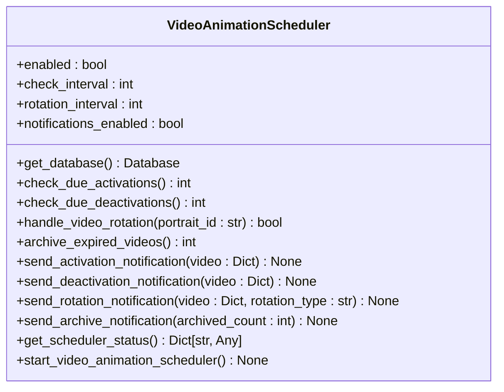
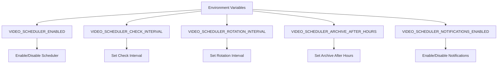
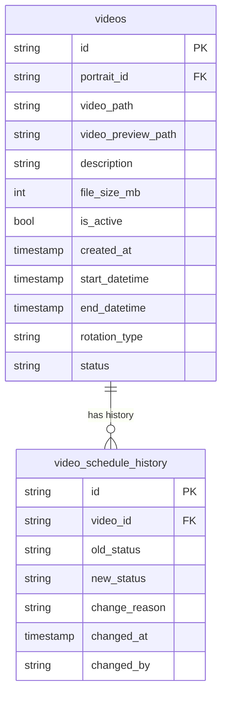
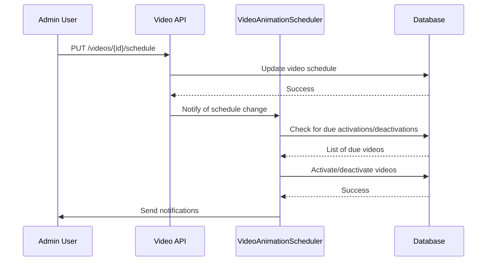

# Video Scheduling

<cite>
**Referenced Files in This Document**   
- [video_animation_scheduler.py](file://vertex-ar/app/video_animation_scheduler.py)
- [database.py](file://vertex-ar/app/database.py)
- [models.py](file://vertex-ar/app/models.py)
- [videos.py](file://vertex-ar/app/api/videos.py)
- [config.py](file://vertex-ar/app/config.py)
- [video-scheduler.md](file://docs/features/video-scheduler.md)
- [video-scheduler-detailed.md](file://docs/features/video-scheduler-detailed.md)
</cite>

## Table of Contents
1. [Introduction](#introduction)
2. [VideoAnimationScheduler Class](#videoanimationscheduler-class)
3. [Configuration Format](#configuration-format)
4. [Database Integration](#database-integration)
5. [API Endpoints](#api-endpoints)
6. [Use Cases](#use-cases)
7. [Schedule Parsing and Validation](#schedule-parsing-and-validation)
8. [Timezone and Daylight Saving Time](#timezone-and-daylight-saving-time)
9. [Conflict Resolution](#conflict-resolution)
10. [Performance Considerations](#performance-considerations)

## Introduction
The Video Scheduling system in Vertex AR enables automated rotation and animation of video content based on time-based rules. This system allows administrators to schedule videos for digital signage, time-based promotions, and dynamic content rotation. The core component is the VideoAnimationScheduler class, which manages the activation, deactivation, and rotation of videos according to predefined schedules. The system integrates with the database layer to store scheduling metadata and provides API endpoints for managing scheduled videos and retrieving active content.

**Section sources**
- [video-scheduler.md](file://docs/features/video-scheduler.md#L1-L10)
- [video-scheduler-detailed.md](file://docs/features/video-scheduler-detailed.md#L1-L10)

## VideoAnimationScheduler Class
The VideoAnimationScheduler class is responsible for managing video animation scheduling and rotation. It checks for videos that are due for activation or deactivation based on their start and end datetime values. The scheduler also handles video rotation for portraits with multiple videos, supporting both sequential and cyclic rotation types. The class is initialized with configuration settings from the environment, including the check interval, rotation interval, and notification settings.

**Diagram sources **
- [video_animation_scheduler.py](file://vertex-ar/app/video_animation_scheduler.py#L17-L344)

**Section sources**
- [video_animation_scheduler.py](file://vertex-ar/app/video_animation_scheduler.py#L17-L344)

## Configuration Format
The Video Scheduling system is configured through environment variables that control its behavior. These variables include enabling or disabling the scheduler, setting the check and rotation intervals, and configuring notification settings. The configuration is loaded from the environment when the application starts, allowing for flexible deployment across different environments.

**Diagram sources **
- [config.py](file://vertex-ar/app/config.py#L173-L178)

**Section sources**
- [config.py](file://vertex-ar/app/config.py#L173-L178)
- [video-scheduler.md](file://docs/features/video-scheduler.md#L46-L63)

## Database Integration
The Video Scheduling system integrates with the database layer to store and retrieve scheduling metadata. The videos table has been enhanced with columns for start_datetime, end_datetime, rotation_type, and status. A new video_schedule_history table tracks changes to video schedules, providing an audit trail for administrative purposes. Indexes have been created on the scheduling columns to optimize query performance.

**Diagram sources **
- [database.py](file://vertex-ar/app/database.py#L288-L304)
- [database.py](file://vertex-ar/app/database.py#L306-L319)

**Section sources**
- [database.py](file://vertex-ar/app/database.py#L288-L319)

## API Endpoints
The Video Scheduling system provides several API endpoints for managing scheduled videos and retrieving active content. These endpoints allow administrators to update video schedules, trigger manual rotations, and view the scheduler status. The endpoints are protected by admin authentication, ensuring that only authorized users can modify scheduling settings.

**Diagram sources **
- [videos.py](file://vertex-ar/app/api/videos.py#L514-L662)

**Section sources**
- [videos.py](file://vertex-ar/app/api/videos.py#L514-L662)
- [video-scheduler-detailed.md](file://docs/features/video-scheduler-detailed.md#L47-L100)

## Use Cases
The Video Scheduling system supports several use cases, including digital signage, time-based promotions, and dynamic content rotation. For digital signage, videos can be scheduled to display during specific hours or days. Time-based promotions allow for targeted marketing campaigns that activate and deactivate automatically. Dynamic content rotation enables the sequential or cyclic display of multiple videos for a single portrait.

**Section sources**
- [video-scheduler.md](file://docs/features/video-scheduler.md#L1-L10)
- [video-scheduler-detailed.md](file://docs/features/video-scheduler-detailed.md#L1-L10)

## Schedule Parsing and Validation
The system parses and validates schedule data when updating video schedules. The start and end datetime values are validated to ensure they are in ISO format and represent valid dates. The rotation_type and status fields are validated against predefined values to prevent invalid configurations. Error handling is implemented to provide meaningful feedback when validation fails.

**Section sources**
- [models.py](file://vertex-ar/app/models.py#L836-L854)
- [video-scheduler-detailed.md](file://docs/features/video-scheduler-detailed.md#L203-L207)

## Timezone and Daylight Saving Time
The Video Scheduling system uses UTC for all datetime values to avoid issues with timezone and daylight saving time changes. This ensures consistent behavior across different regions and prevents scheduling conflicts during daylight saving time transitions. Administrators should convert local times to UTC when setting up schedules.

**Section sources**
- [video_animation_scheduler.py](file://vertex-ar/app/video_animation_scheduler.py#L40-L68)
- [video_animation_scheduler.py](file://vertex-ar/app/video_animation_scheduler.py#L70-L102)

## Conflict Resolution
The system handles conflicts between overlapping schedules by prioritizing the most recently updated schedule. When multiple videos are scheduled to be active at the same time, the system activates the video with the most recent update timestamp. This ensures predictable behavior and prevents conflicts from causing unexpected content changes.

**Section sources**
- [video_animation_scheduler.py](file://vertex-ar/app/video_animation_scheduler.py#L39-L102)

## Performance Considerations
Frequent schedule evaluations can impact system performance, especially with a large number of videos. To optimize query performance, indexes have been created on the scheduling columns in the videos table. The scheduler runs at configurable intervals, allowing administrators to balance responsiveness with system load. Caching strategies can be implemented to further improve performance for frequently accessed data.

**Section sources**
- [database.py](file://vertex-ar/app/database.py#L322-L338)
- [video_animation_scheduler.py](file://vertex-ar/app/video_animation_scheduler.py#L315-L341)