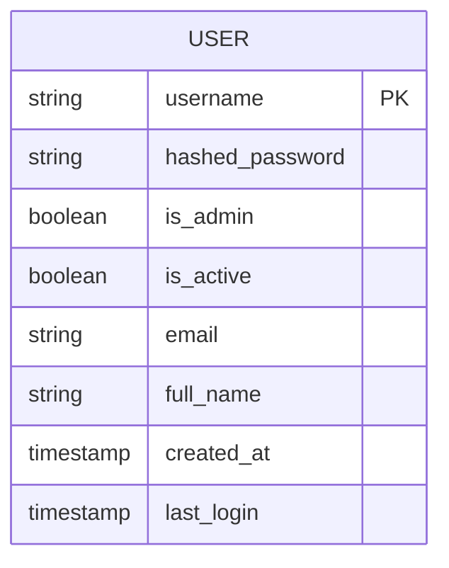
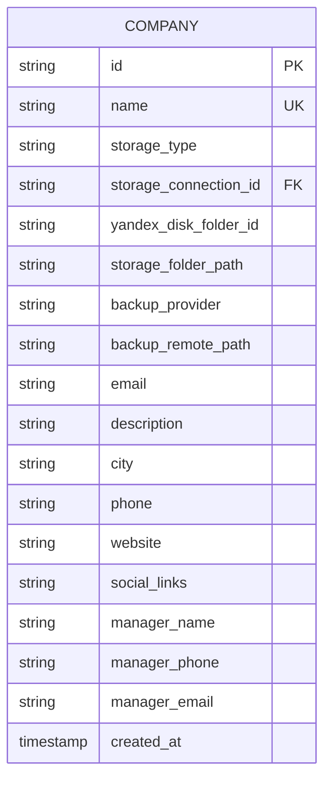
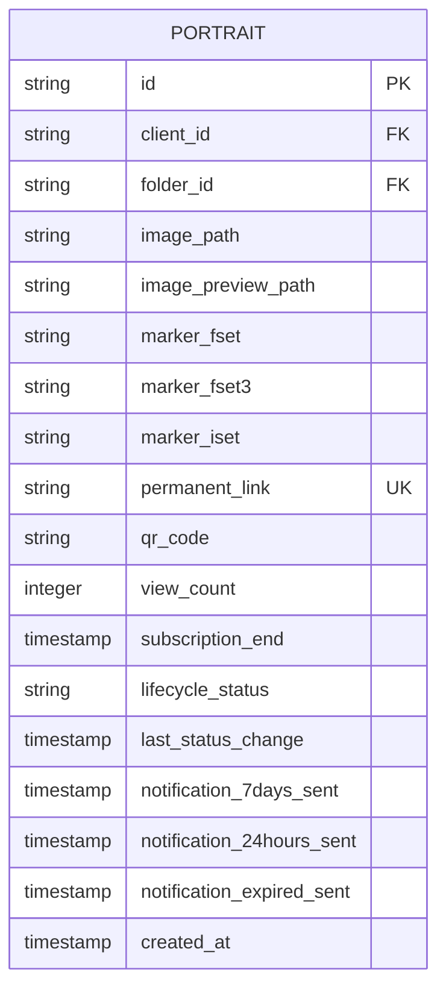
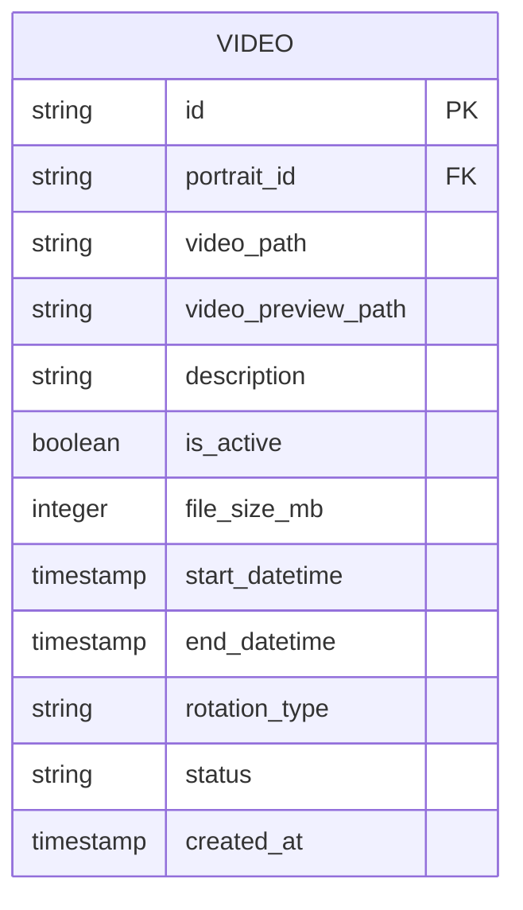
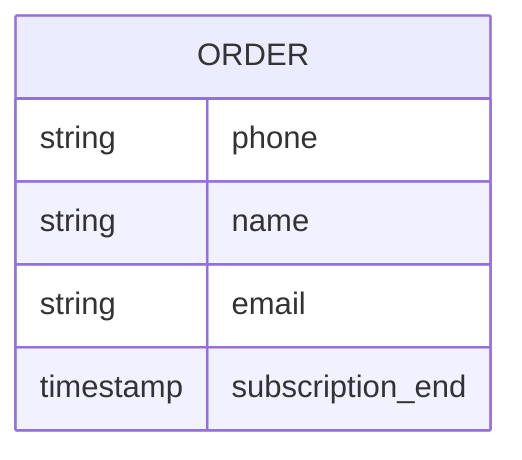
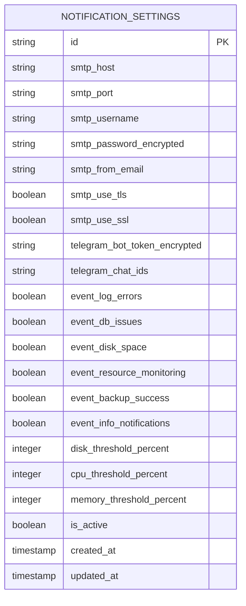
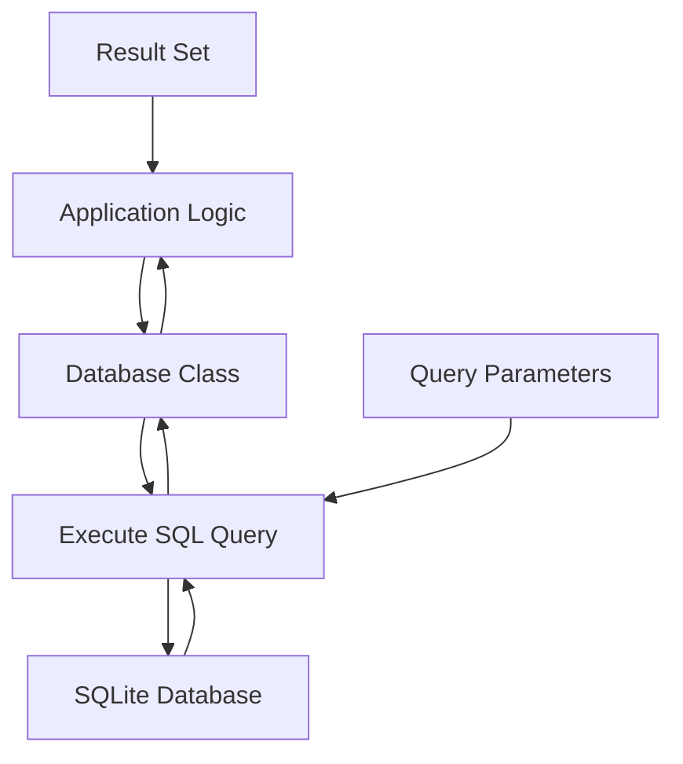
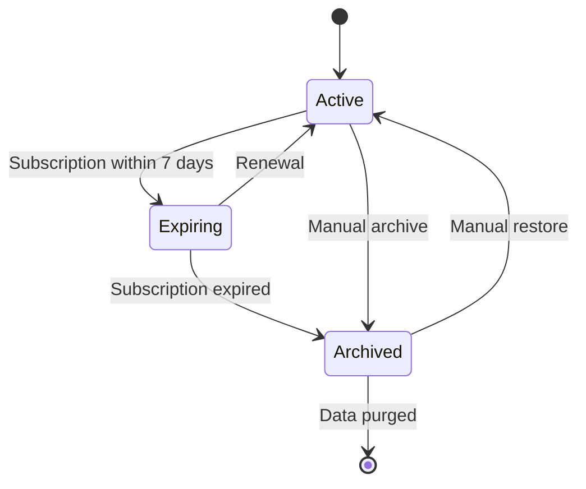
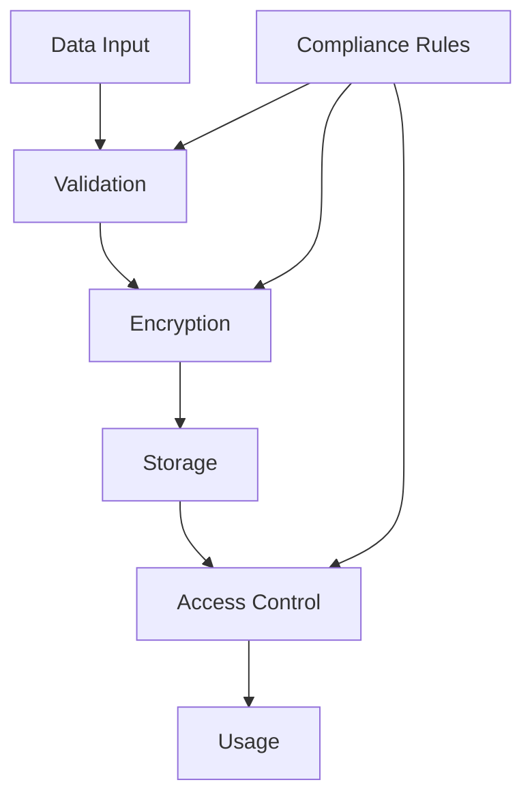

# Data Models & ORM Mapping

<cite>
**Referenced Files in This Document**   
- [models.py](file://vertex-ar/app/models.py)
- [database.py](file://vertex-ar/app/database.py)
- [test_videos_list_endpoint.py](file://test_files/unit/test_videos_list_endpoint.py)
- [test_order_workflow_storage_folders.py](file://test_files/integration/test_order_workflow_storage_folders.py)
- [test_videos_schedule_endpoint.py](file://test_files/unit/test_videos_schedule_endpoint.py)
- [lifecycle-fields.md](file://docs/features/lifecycle-fields.md)
</cite>

## Table of Contents
1. [Introduction](#introduction)
2. [Core Entity Relationships](#core-entity-relationships)
3. [User Model](#user-model)
4. [Company Model](#company-model)
5. [Portrait Model](#portrait-model)
6. [Video Model](#video-model)
7. [Order Model](#order-model)
8. [Notification Model](#notification-model)
9. [Data Access Patterns](#data-access-patterns)
10. [Data Lifecycle Management](#data-lifecycle-management)
11. [Security and Compliance](#security-and-compliance)
12. [Appendices](#appendices)

## Introduction

This document provides comprehensive documentation for the core database schema of the Vertex AR application. The system is built around a relational data model with SQLite as the primary database engine, featuring a well-defined set of entities that support augmented reality content management, client tracking, and business operations.

The core data model centers on six primary entities: User, Company, Portrait, Video, Order, and Notification. These entities are interconnected through well-defined relationships that support the application's business logic. The schema implements proper normalization principles while maintaining performance through strategic indexing and relationship management.

The data model supports multi-tenancy through the Company entity, which serves as the top-level organizational unit. All client data, portraits, and videos are associated with a specific company, enabling isolated data management for different business customers.

This documentation covers the complete structure of each entity, including field definitions, data types, constraints, indexes, and relationships. It also details the SQLAlchemy ORM mapping patterns, data access methods, lifecycle management policies, and security considerations implemented throughout the system.

**Section sources**
- [database.py](file://vertex-ar/app/database.py#L88-L800)
- [models.py](file://vertex-ar/app/models.py#L1-L800)

## Core Entity Relationships

The data model implements a hierarchical structure with clear parent-child relationships between entities. The Company entity serves as the root of the hierarchy, with Clients belonging to Companies, Portraits belonging to Clients, and Videos belonging to Portraits.

```mermaid
erDiagram
USER {
string username PK
string hashed_password
boolean is_admin
boolean is_active
string email
string full_name
timestamp created_at
timestamp last_login
}
COMPANY {
string id PK
string name UK
string storage_type
string storage_connection_id FK
string yandex_disk_folder_id
string storage_folder_path
string backup_provider
string backup_remote_path
string email
string description
string city
string phone
string website
string social_links
string manager_name
string manager_phone
string manager_email
timestamp created_at
}
CLIENT {
string id PK
string company_id FK
string phone UK
string name
string email
timestamp created_at
}
PORTRAIT {
string id PK
string client_id FK
string folder_id FK
string image_path
string image_preview_path
string marker_fset
string marker_fset3
string marker_iset
string permanent_link UK
string qr_code
integer view_count
timestamp subscription_end
string lifecycle_status
timestamp last_status_change
timestamp notification_7days_sent
timestamp notification_24hours_sent
timestamp notification_expired_sent
timestamp created_at
}
VIDEO {
string id PK
string portrait_id FK
string video_path
string video_preview_path
string description
boolean is_active
integer file_size_mb
timestamp start_datetime
timestamp end_datetime
string rotation_type
string status
timestamp created_at
}
NOTIFICATION_SETTINGS {
string id PK
string smtp_host
string smtp_port
string smtp_username
string smtp_password_encrypted
string smtp_from_email
boolean smtp_use_tls
boolean smtp_use_ssl
string telegram_bot_token_encrypted
string telegram_chat_ids
boolean event_log_errors
boolean event_db_issues
boolean event_disk_space
boolean event_resource_monitoring
boolean event_backup_success
boolean event_info_notifications
integer disk_threshold_percent
integer cpu_threshold_percent
integer memory_threshold_percent
boolean is_active
timestamp created_at
timestamp updated_at
}
USER ||--o{ COMPANY : "manages"
COMPANY ||--o{ CLIENT : "has"
CLIENT ||--o{ PORTRAIT : "owns"
PORTRAIT ||--o{ VIDEO : "contains"
COMPANY ||--o{ NOTIFICATION_SETTINGS : "has"
STORAGE_CONNECTION ||--o{ COMPANY : "used_by"
```



**Diagram sources**
- [database.py](file://vertex-ar/app/database.py#L124-L210)
- [database.py](file://vertex-ar/app/database.py#L166-L209)

## User Model

The User model represents administrative users who manage the Vertex AR platform. This model is distinct from client users and is used exclusively for authentication and authorization within the admin interface.

The User entity contains authentication credentials, profile information, and role-based access control attributes. It serves as the foundation for the application's security model, with the `is_admin` field determining administrative privileges and the `is_active` field controlling account status.



**Diagram sources**
- [database.py](file://vertex-ar/app/database.py#L88-L102)

The User model includes the following fields:

- **username**: Primary key, serves as the unique identifier and login credential
- **hashed_password**: Stores the bcrypt-hashed password for secure authentication
- **is_admin**: Boolean flag indicating administrative privileges
- **is_active**: Boolean flag controlling account status (active/inactive)
- **email**: Contact email address for the user
- **full_name**: Display name for the user
- **created_at**: Timestamp of account creation
- **last_login**: Timestamp of the most recent successful login

The model implements proper security practices by storing only hashed passwords and providing fields for account status management. Indexes on the `email` and `is_active` fields enable efficient user lookups and status filtering.

**Section sources**
- [database.py](file://vertex-ar/app/database.py#L88-L102)
- [models.py](file://vertex-ar/app/models.py#L20-L57)

## Company Model

The Company model represents business organizations that use the Vertex AR platform. This entity serves as the top-level container for all client data and content, enabling multi-tenancy within the application.



**Diagram sources**
- [database.py](file://vertex-ar/app/database.py#L124-L133)

The Company model includes comprehensive business information and storage configuration:

- **id**: Primary key, unique identifier for the company
- **name**: Unique name of the company, serves as the business identifier
- **storage_type**: Specifies the storage backend (local_disk, minio, yandex_disk)
- **storage_connection_id**: Foreign key to storage_connections table for remote storage
- **yandex_disk_folder_id**: Path identifier for Yandex Disk storage
- **storage_folder_path**: Local filesystem path for content storage
- **backup_provider**: Remote backup provider (yandex_disk, google_drive, local)
- **backup_remote_path**: Remote directory path for backups
- **email**: Company contact email address
- **description**: Business description
- **city**: Geographic location
- **phone**: Company phone number
- **website**: Official website URL
- **social_links**: JSON string containing social media links
- **manager_name**: Primary contact person
- **manager_phone**: Contact phone number
- **manager_email**: Contact email address
- **created_at**: Timestamp of company creation

The model implements business rules through validators that ensure data quality, including phone number formatting, email validation, URL validation, and name validation. The storage configuration is validated to ensure that remote storage types have the necessary connection information.

**Section sources**
- [database.py](file://vertex-ar/app/database.py#L124-L133)
- [models.py](file://vertex-ar/app/models.py#L79-L215)

## Portrait Model

The Portrait model represents augmented reality content created for clients. This entity serves as the central hub for AR experiences, linking client information with visual content and tracking engagement metrics.



**Diagram sources**
- [database.py](file://vertex-ar/app/database.py#L180-L195)

The Portrait model includes the following fields:

- **id**: Primary key, unique identifier for the portrait
- **client_id**: Foreign key to the Client entity
- **folder_id**: Foreign key to the Folder entity for organizational grouping
- **image_path**: Filesystem path to the source image
- **image_preview_path**: Filesystem path to the preview image
- **marker_fset**: Path to the FSET marker file
- **marker_fset3**: Path to the FSET3 marker file
- **marker_iset**: Path to the ISET marker file
- **permanent_link**: Unique URL-friendly identifier for public access
- **qr_code**: Base64-encoded QR code image for mobile access
- **view_count**: Counter for content views
- **subscription_end**: Timestamp indicating when the subscription expires
- **lifecycle_status**: Current status (active, expiring, archived)
- **last_status_change**: Timestamp of the most recent status change
- **notification_7days_sent**: Timestamp when 7-day expiration notification was sent
- **notification_24hours_sent**: Timestamp when 24-hour expiration notification was sent
- **notification_expired_sent**: Timestamp when expired notification was sent
- **created_at**: Timestamp of portrait creation

The model implements lifecycle management through the subscription and status fields, enabling automated notifications and content archiving. The permanent_link field provides a stable, user-friendly URL for accessing the AR content.

**Section sources**
- [database.py](file://vertex-ar/app/database.py#L180-L195)
- [lifecycle-fields.md](file://docs/features/lifecycle-fields.md#L110-L124)

## Video Model

The Video model represents video content associated with portraits. This entity enables the animation and dynamic content features of the AR experiences, with support for scheduling and rotation.



**Diagram sources**
- [database.py](file://vertex-ar/app/database.py#L198-L209)

The Video model includes the following fields:

- **id**: Primary key, unique identifier for the video
- **portrait_id**: Foreign key to the Portrait entity
- **video_path**: Filesystem path to the video file
- **video_preview_path**: Filesystem path to the video preview image
- **description**: Optional description of the video content
- **is_active**: Boolean flag indicating whether this video is currently active
- **file_size_mb**: Size of the video file in megabytes
- **start_datetime**: Scheduled start time for video display
- **end_datetime**: Scheduled end time for video display
- **rotation_type**: Scheduling pattern (none, sequential, cyclic)
- **status**: Current status (active, inactive, archived)
- **created_at**: Timestamp of video creation

The model supports sophisticated video scheduling through the start_datetime, end_datetime, and rotation_type fields. The rotation_type field implements a constraint ensuring values are limited to 'none', 'sequential', or 'cyclic', providing different playback patterns for AR experiences.

Indexes on start_datetime and end_datetime enable efficient querying for scheduled content, while the status index supports filtering by video state. The is_active field provides a quick way to determine the currently displayed video for a portrait.

**Section sources**
- [database.py](file://vertex-ar/app/database.py#L198-L209)
- [test_videos_schedule_endpoint.py](file://test_files/unit/test_videos_schedule_endpoint.py#L64-L117)

## Order Model

The Order model represents client orders for AR content creation. This entity captures the business transaction details and serves as the entry point for new portrait creation.



**Diagram sources**
- [models.py](file://vertex-ar/app/models.py#L767-L799)

The Order model includes the following fields:

- **phone**: Client phone number, used as a primary identifier
- **name**: Client name
- **email**: Client email address for notifications
- **subscription_end**: Timestamp indicating when the subscription expires

The model implements comprehensive validation to ensure data quality:
- Phone numbers are validated for proper formatting
- Names are validated for appropriate characters
- Email addresses are validated for correct syntax
- Subscription end dates are validated as ISO format timestamps

The Order model serves as a request object for creating new portraits, with the data used to create corresponding Client and Portrait entities in the database. The subscription_end field establishes the initial lifecycle for the created portrait.

**Section sources**
- [models.py](file://vertex-ar/app/models.py#L767-L799)
- [lifecycle-fields.md](file://docs/features/lifecycle-fields.md#L94-L108)

## Notification Model

The Notification model represents the system's notification configuration and history. This entity enables centralized management of email and messaging settings for system alerts and client communications.



**Diagram sources**
- [database.py](file://vertex-ar/app/database.py#L637-L665)

The Notification model includes comprehensive configuration options:

- **id**: Primary key, unique identifier for the notification configuration
- **smtp_host**: SMTP server hostname
- **smtp_port**: SMTP server port
- **smtp_username**: SMTP authentication username
- **smtp_password_encrypted**: Encrypted SMTP password
- **smtp_from_email**: Sender email address
- **smtp_use_tls**: Flag indicating TLS encryption usage
- **smtp_use_ssl**: Flag indicating SSL encryption usage
- **telegram_bot_token_encrypted**: Encrypted Telegram bot token
- **telegram_chat_ids**: JSON array of Telegram chat IDs
- **event_log_errors**: Flag enabling error log notifications
- **event_db_issues**: Flag enabling database issue notifications
- **event_disk_space**: Flag enabling disk space alerts
- **event_resource_monitoring**: Flag enabling resource usage alerts
- **event_backup_success**: Flag enabling backup success notifications
- **event_info_notifications**: Flag enabling general information notifications
- **disk_threshold_percent**: Disk usage percentage threshold for alerts
- **cpu_threshold_percent**: CPU usage percentage threshold for alerts
- **memory_threshold_percent**: Memory usage percentage threshold for alerts
- **is_active**: Flag indicating whether notifications are enabled
- **created_at**: Timestamp of configuration creation
- **updated_at**: Timestamp of last configuration update

The model implements security best practices by storing sensitive credentials in encrypted form. The event flags provide granular control over notification types, allowing administrators to customize alerting behavior based on their needs.

**Section sources**
- [database.py](file://vertex-ar/app/database.py#L637-L665)

## Data Access Patterns

The application implements a repository pattern for data access, with the Database class providing methods for CRUD operations on all entities. This pattern abstracts the underlying SQL operations and provides a clean interface for business logic.



**Diagram sources**
- [database.py](file://vertex-ar/app/database.py#L48-L86)

Key data access patterns include:

- **Parameterized Queries**: All database operations use parameterized queries to prevent SQL injection
- **Connection Pooling**: The database connection is shared across threads with proper locking
- **Transaction Management**: Critical operations are wrapped in transactions to ensure data consistency
- **Error Handling**: Comprehensive error handling with logging for debugging
- **Performance Monitoring**: Slow query tracking for performance optimization

The Database class implements proper resource management with connection pooling and thread safety. The _lock attribute ensures that database operations are thread-safe, preventing race conditions in multi-threaded environments.

Query optimization is achieved through strategic indexing on frequently queried fields such as foreign keys, status fields, and timestamp ranges. The application also implements query caching for frequently accessed data to reduce database load.

**Section sources**
- [database.py](file://vertex-ar/app/database.py#L48-L86)
- [database.py](file://vertex-ar/app/database.py#L322-L343)

## Data Lifecycle Management

The system implements comprehensive data lifecycle management through a combination of database fields, business logic, and background processes. This ensures that content is properly managed from creation through expiration and archival.



**Diagram sources**
- [lifecycle-fields.md](file://docs/features/lifecycle-fields.md#L43-L46)

The lifecycle management system includes:

- **Automated Status Calculation**: Status is automatically calculated based on subscription_end date
- **Manual Status Control**: Status can be manually set via API
- **Background Scheduler**: A background process updates statuses and sends notifications
- **Notification Tracking**: Timestamps track when expiration notifications were sent
- **Status Change History**: last_status_change field records when status was last updated

The system sends automated notifications at key lifecycle points:
- 7 days before expiration
- 24 hours before expiration
- When subscription expires

These notifications are tracked with dedicated timestamp fields to prevent duplicate messages and ensure reliable delivery.

**Section sources**
- [lifecycle-fields.md](file://docs/features/lifecycle-fields.md#L43-L46)
- [database.py](file://vertex-ar/app/database.py#L351-L373)

## Security and Compliance

The application implements multiple layers of security and compliance measures at the data model level to protect sensitive information and ensure regulatory compliance.



**Diagram sources**
- [database.py](file://vertex-ar/app/database.py#L492-L508)

Security measures include:

- **Input Validation**: All user input is validated using Pydantic models with field validators
- **Data Encryption**: Sensitive credentials are stored in encrypted form
- **Access Control**: Role-based access control limits data access
- **Audit Logging**: Critical operations are logged for security auditing
- **Data Retention**: Policies govern how long data is retained
- **Privacy Compliance**: Personal data is handled according to privacy regulations

The system implements proper password security by storing only bcrypt-hashed passwords. Sensitive configuration data such as SMTP passwords and API tokens are encrypted before storage.

Access to data is controlled through the User model's is_admin and is_active fields, which determine administrative privileges and account status. The system also implements session management with expiration and revocation capabilities.

**Section sources**
- [database.py](file://vertex-ar/app/database.py#L492-L508)
- [models.py](file://vertex-ar/app/models.py#L9-L17)

## Appendices

### Sample Data Records

**Company Record**
```json
{
  "id": "vertex-ar-default",
  "name": "Vertex AR",
  "storage_type": "local_disk",
  "storage_folder_path": "vertex_ar_content",
  "email": "contact@vertex-ar.com",
  "description": "Default company for Vertex AR platform",
  "city": "Moscow",
  "phone": "+7 (495) 000-00-00",
  "website": "https://vertex-ar.com",
  "manager_name": "System Administrator",
  "manager_phone": "+7 (495) 000-00-00",
  "manager_email": "admin@vertex-ar.com",
  "created_at": "2025-01-01T00:00:00Z"
}
```

**Portrait Record**
```json
{
  "id": "test-portrait",
  "client_id": "test-client",
  "image_path": "test/image.jpg",
  "marker_fset": "test.fset",
  "marker_fset3": "test.fset3",
  "marker_iset": "test.iset",
  "permanent_link": "http://test.com/portrait",
  "view_count": 0,
  "subscription_end": "2025-12-31T23:59:59Z",
  "lifecycle_status": "active",
  "created_at": "2025-01-01T00:00:00Z"
}
```

**Video Record**
```json
{
  "id": "test-video",
  "portrait_id": "test-portrait",
  "video_path": "test/video.mp4",
  "is_active": true,
  "start_datetime": "2025-01-01T00:00:00",
  "end_datetime": "2025-12-31T23:59:59",
  "rotation_type": "sequential",
  "status": "active",
  "created_at": "2025-01-01T00:00:00Z"
}
```

### Query Examples

**List all active videos for a company:**
```sql
SELECT v.*
FROM videos v
JOIN portraits p ON v.portrait_id = p.id
JOIN clients c ON p.client_id = c.id
WHERE c.company_id = ?
AND v.status = 'active'
ORDER BY v.created_at DESC
```

**Count active portraits for a company:**
```sql
SELECT COUNT(DISTINCT portraits.id) as count
FROM portraits
JOIN videos ON videos.portrait_id = portraits.id AND videos.is_active = 1
JOIN clients ON clients.id = portraits.client_id
WHERE clients.company_id = ?
```

**Find portraits by search criteria:**
```sql
SELECT 
    portraits.id,
    portraits.image_path,
    portraits.image_preview_path,
    portraits.permanent_link,
    portraits.qr_code,
    portraits.view_count,
    portraits.created_at,
    portraits.subscription_end,
    portraits.lifecycle_status,
    clients.name AS client_name,
    clients.phone AS client_phone,
    clients.company_id,
    videos.id AS video_id,
    videos.video_path,
    videos.video_preview_path,
    videos.description AS video_description
FROM portraits
JOIN clients ON clients.id = portraits.client_id
LEFT JOIN videos ON videos.portrait_id = portraits.id AND videos.is_active = 1
WHERE clients.company_id = ?
AND (LOWER(clients.name) LIKE ? OR clients.phone LIKE ? OR LOWER(portraits.permanent_link) LIKE ? OR LOWER(portraits.id) LIKE ?)
AND portraits.lifecycle_status = ?
```