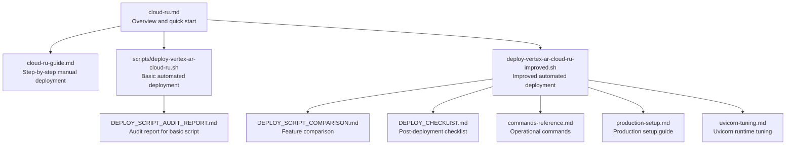
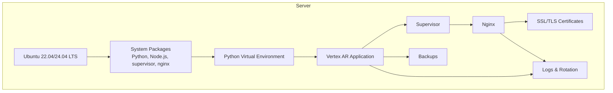
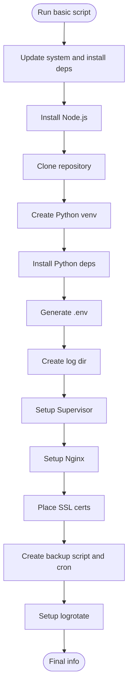
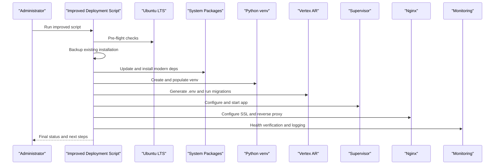
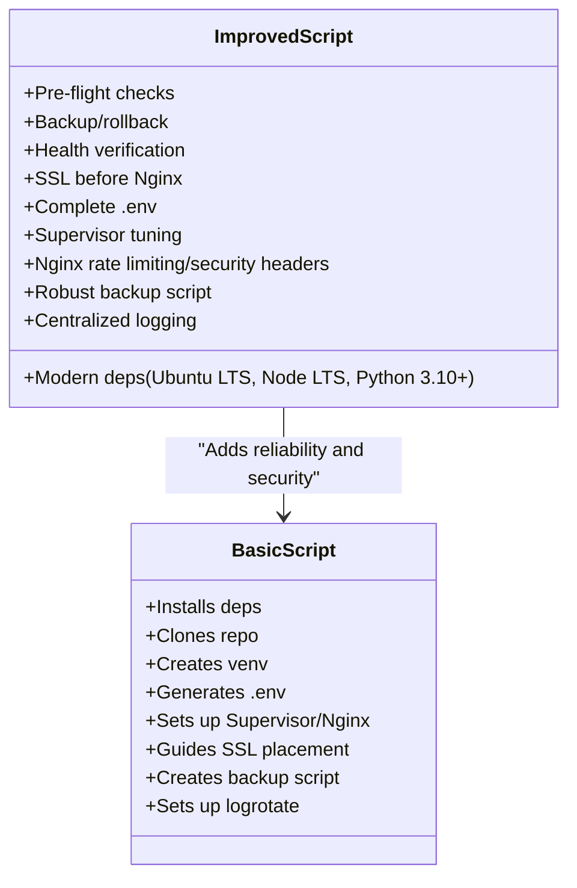
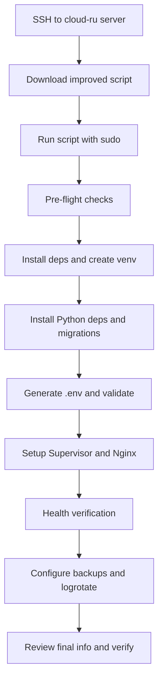
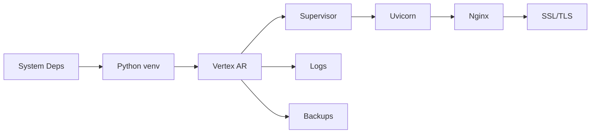

# Cloud Provider Deployment

<cite>
**Referenced Files in This Document**
- [deploy-vertex-ar-cloud-ru.sh](file://scripts/deploy-vertex-ar-cloud-ru.sh)
- [deploy-vertex-ar-cloud-ru-improved.sh](file://deploy-vertex-ar-cloud-ru-improved.sh)
- [cloud-ru.md](file://docs/deployment/cloud-ru.md)
- [cloud-ru-guide.md](file://docs/deployment/cloud-ru-guide.md)
- [DEPLOY_SCRIPT_COMPARISON.md](file://DEPLOY_SCRIPT_COMPARISON.md)
- [DEPLOY_CHECKLIST.md](file://DEPLOY_CHECKLIST.md)
- [commands-reference.md](file://docs/deployment/commands-reference.md)
- [production-setup.md](file://docs/deployment/production-setup.md)
- [uvicorn-tuning.md](file://docs/deployment/uvincon-tuning.md)
- [DEPLOY_SCRIPT_AUDIT_REPORT.md](file://DEPLOY_SCRIPT_AUDIT_REPORT.md)
</cite>

## Table of Contents
1. [Introduction](#introduction)
2. [Project Structure](#project-structure)
3. [Core Components](#core-components)
4. [Architecture Overview](#architecture-overview)
5. [Detailed Component Analysis](#detailed-component-analysis)
6. [Dependency Analysis](#dependency-analysis)
7. [Performance Considerations](#performance-considerations)
8. [Troubleshooting Guide](#troubleshooting-guide)
9. [Conclusion](#conclusion)
10. [Appendices](#appendices)

## Introduction
This document provides cloud-specific deployment guidance for hosting the AR application on cloud-ru infrastructure. It focuses on automated deployment via the provided scripts, prerequisites (SSH access, firewall, domain setup), post-deployment verification, performance tuning, and scaling recommendations. It also compares the basic and improved deployment scripts to help you select the right approach for your environment.

## Project Structure
The repository includes:
- Automated deployment scripts tailored for cloud-ru environments
- Comprehensive deployment documentation for cloud-ru and production setups
- Operational guides for monitoring, logging, and maintenance
- Performance tuning documentation for Uvicorn and Nginx

**Diagram sources**
- [cloud-ru.md](file://docs/deployment/cloud-ru.md#L1-L277)
- [cloud-ru-guide.md](file://docs/deployment/cloud-ru-guide.md#L1-L659)
- [deploy-vertex-ar-cloud-ru.sh](file://scripts/deploy-vertex-ar-cloud-ru.sh#L1-L534)
- [deploy-vertex-ar-cloud-ru-improved.sh](file://deploy-vertex-ar-cloud-ru-improved.sh#L1-L1293)
- [DEPLOY_SCRIPT_COMPARISON.md](file://DEPLOY_SCRIPT_COMPARISON.md#L1-L697)
- [DEPLOY_CHECKLIST.md](file://DEPLOY_CHECKLIST.md#L1-L366)
- [commands-reference.md](file://docs/deployment/commands-reference.md#L1-L788)
- [production-setup.md](file://docs/deployment/production-setup.md#L1-L273)
- [uvicorn-tuning.md](file://docs/deployment/uvincon-tuning.md#L1-L623)
- [DEPLOY_SCRIPT_AUDIT_REPORT.md](file://DEPLOY_SCRIPT_AUDIT_REPORT.md#L1-L1003)

**Section sources**
- [cloud-ru.md](file://docs/deployment/cloud-ru.md#L1-L277)
- [cloud-ru-guide.md](file://docs/deployment/cloud-ru-guide.md#L1-L659)

## Core Components
- Basic automated deployment script for cloud-ru (Ubuntu 18.04 + Cpanel)
- Improved automated deployment script with pre-flight checks, backup/rollback, health verification, modern dependencies, and robust logging
- Production setup and operational guides for monitoring, logging, and maintenance
- Performance tuning documentation for Uvicorn and Nginx

Key differences between the scripts:
- Security: improved script generates secure admin credentials and validates production secrets
- Reliability: improved script includes backup/rollback, health checks, and strict error handling
- Compatibility: improved script targets modern Ubuntu LTS and Node.js LTS
- Observability: improved script logs deployment progress and integrates with monitoring

**Section sources**
- [deploy-vertex-ar-cloud-ru.sh](file://scripts/deploy-vertex-ar-cloud-ru.sh#L1-L534)
- [deploy-vertex-ar-cloud-ru-improved.sh](file://deploy-vertex-ar-cloud-ru-improved.sh#L1-L1293)
- [DEPLOY_SCRIPT_COMPARISON.md](file://DEPLOY_SCRIPT_COMPARISON.md#L1-L697)
- [DEPLOY_SCRIPT_AUDIT_REPORT.md](file://DEPLOY_SCRIPT_AUDIT_REPORT.md#L1-L1003)

## Architecture Overview
The deployment installs and configures:
- System dependencies (Python, Node.js, supervisor, nginx)
- Application virtual environment and dependencies
- Application configuration (.env)
- Reverse proxy (Nginx) and process manager (Supervisor)
- SSL/TLS certificates and rate limiting
- Backup automation and log rotation

**Diagram sources**
- [deploy-vertex-ar-cloud-ru-improved.sh](file://deploy-vertex-ar-cloud-ru-improved.sh#L800-L1293)
- [production-setup.md](file://docs/deployment/production-setup.md#L1-L273)
- [uvicorn-tuning.md](file://docs/deployment/uvincon-tuning.md#L1-L623)

## Detailed Component Analysis

### Basic Automated Deployment Script (cloud-ru)
- Installs system dependencies and Node.js
- Clones the repository and sets ownership
- Creates a Python virtual environment and installs dependencies
- Generates a production-ready .env file with defaults
- Sets up Supervisor and Nginx
- Guides SSL certificate placement and restarts Nginx
- Creates a backup script and schedules it via cron
- Configures log rotation

**Diagram sources**
- [deploy-vertex-ar-cloud-ru.sh](file://scripts/deploy-vertex-ar-cloud-ru.sh#L1-L534)

**Section sources**
- [deploy-vertex-ar-cloud-ru.sh](file://scripts/deploy-vertex-ar-cloud-ru.sh#L1-L534)

### Improved Automated Deployment Script (cloud-ru)
- Pre-flight checks: OS version, system requirements, user existence, port availability
- Backup before deployment and rollback capability
- Health verification after service start
- Modern dependencies: Ubuntu LTS, Node.js LTS, Python 3.10+
- SSL setup before Nginx to avoid startup failures
- Complete .env generation with production tuning variables
- Supervisor configuration with worker count and graceful shutdown
- Nginx with rate limiting and security headers
- Backup script with robust error handling and cleanup
- Centralized logging and deployment audit trail

**Diagram sources**
- [deploy-vertex-ar-cloud-ru-improved.sh](file://deploy-vertex-ar-cloud-ru-improved.sh#L1-L1293)

**Section sources**
- [deploy-vertex-ar-cloud-ru-improved.sh](file://deploy-vertex-ar-cloud-ru-improved.sh#L1-L1293)
- [DEPLOY_SCRIPT_COMPARISON.md](file://DEPLOY_SCRIPT_COMPARISON.md#L1-L697)

### Comparison Between Basic and Improved Scripts
- Security: improved script generates secure admin credentials and validates production secrets
- Reliability: improved script includes backup/rollback, health checks, and strict error handling
- Compatibility: improved script targets modern Ubuntu LTS and Node.js LTS
- Observability: improved script logs deployment progress and integrates with monitoring

**Diagram sources**
- [DEPLOY_SCRIPT_COMPARISON.md](file://DEPLOY_SCRIPT_COMPARISON.md#L1-L697)

**Section sources**
- [DEPLOY_SCRIPT_COMPARISON.md](file://DEPLOY_SCRIPT_COMPARISON.md#L1-L697)

### Prerequisites and Setup
- SSH access to the cloud-ru server with root or sudo privileges
- Domain configured and pointing to the server’s IP
- Firewall rules allowing SSH, HTTP, HTTPS, and application port (default 8000)
- SSL certificate for the domain (Let’s Encrypt or purchased)
- Repository access (public or private with SSH keys)

**Section sources**
- [cloud-ru.md](file://docs/deployment/cloud-ru.md#L1-L277)
- [commands-reference.md](file://docs/deployment/commands-reference.md#L1-L788)

### Step-by-Step Deployment (Automated)
1. Connect via SSH to the cloud-ru server using your SSH key.
2. Download the improved deployment script and make it executable.
3. Run the script with sudo privileges.
4. The script performs pre-flight checks, installs dependencies, creates the venv, installs Python dependencies, generates .env, sets up Supervisor and Nginx, verifies health, and configures backups and log rotation.
5. After completion, review the final information and verify application accessibility.

**Diagram sources**
- [deploy-vertex-ar-cloud-ru-improved.sh](file://deploy-vertex-ar-cloud-ru-improved.sh#L1233-L1293)
- [cloud-ru.md](file://docs/deployment/cloud-ru.md#L1-L277)

**Section sources**
- [cloud-ru.md](file://docs/deployment/cloud-ru.md#L1-L277)
- [deploy-vertex-ar-cloud-ru-improved.sh](file://deploy-vertex-ar-cloud-ru-improved.sh#L1233-L1293)

### Post-Deployment Verification
- Confirm application health via the /health endpoint
- Verify admin panel accessibility and basic workflows
- Check logs for errors and confirm monitoring endpoints
- Validate SSL certificate correctness and redirects
- Test backup creation and restoration procedure

**Section sources**
- [DEPLOY_CHECKLIST.md](file://DEPLOY_CHECKLIST.md#L1-L366)
- [commands-reference.md](file://docs/deployment/commands-reference.md#L1-L788)

## Dependency Analysis
- System dependencies include Python, Node.js, supervisor, nginx, and build tools
- Application dependencies are installed in a virtual environment
- Supervisor manages the Uvicorn process
- Nginx acts as reverse proxy and handles SSL/TLS termination
- Backup and log rotation integrate with the application and system services

**Diagram sources**
- [deploy-vertex-ar-cloud-ru-improved.sh](file://deploy-vertex-ar-cloud-ru-improved.sh#L800-L1293)
- [production-setup.md](file://docs/deployment/production-setup.md#L1-L273)

**Section sources**
- [production-setup.md](file://docs/deployment/production-setup.md#L1-L273)
- [uvicorn-tuning.md](file://docs/deployment/uvincon-tuning.md#L1-L623)

## Performance Considerations
- Worker sizing: Use the improved script’s automatic worker calculation or tune UVICORN_WORKERS in .env
- Connection management: Adjust keep-alive timeouts, concurrency limits, and backlog based on traffic
- Health checks: Prefer HEAD requests for reduced overhead and set appropriate timeouts/cooldown
- Reverse proxy tuning: Enable rate limiting zones and security headers in Nginx
- Monitoring: Integrate metrics and alerts; validate with monitoring endpoints

**Section sources**
- [uvicorn-tuning.md](file://docs/deployment/uvincon-tuning.md#L1-L623)
- [deploy-vertex-ar-cloud-ru-improved.sh](file://deploy-vertex-ar-cloud-ru-improved.sh#L800-L1293)

## Troubleshooting Guide
Common issues and resolutions:
- Nginx fails to start due to missing or invalid SSL certificates
- Application fails to start due to dependency installation errors
- Port 8000 already in use by another process
- Database locked or permission issues
- Static files not served due to incorrect paths or permissions
- Health check failures indicating slow startup or misconfiguration

Operational commands for diagnostics:
- Check Supervisor status and logs
- Inspect Nginx configuration and logs
- Verify SSL certificate validity and permissions
- Monitor system resources and network connectivity
- Validate cron jobs and backup logs

**Section sources**
- [DEPLOY_CHECKLIST.md](file://DEPLOY_CHECKLIST.md#L1-L366)
- [commands-reference.md](file://docs/deployment/commands-reference.md#L1-L788)

## Conclusion
For production-grade deployments on cloud-ru infrastructure, use the improved automated deployment script. It adds critical reliability and security features, modernizes dependencies, and improves observability. Follow the post-deployment checklist, monitor performance, and apply scaling recommendations as traffic grows.

## Appendices

### Appendix A: Choosing the Right Script
- Use the improved script for production, staging, new installations, and updates
- Avoid using the basic script in production due to critical security and reliability gaps

**Section sources**
- [DEPLOY_SCRIPT_COMPARISON.md](file://DEPLOY_SCRIPT_COMPARISON.md#L1-L697)
- [DEPLOY_SCRIPT_AUDIT_REPORT.md](file://DEPLOY_SCRIPT_AUDIT_REPORT.md#L1-L1003)

### Appendix B: Operational Commands Reference
- SSH connection and aliases
- System updates and package management
- Python virtual environment and dependency management
- Supervisor process management and logs
- Nginx configuration and logs
- SSL certificate management and validation
- File and directory operations
- Monitoring and diagnostics
- Backup and restore procedures
- Cron scheduling and firewall management

**Section sources**
- [commands-reference.md](file://docs/deployment/commands-reference.md#L1-L788)