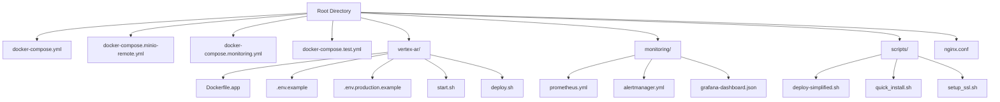
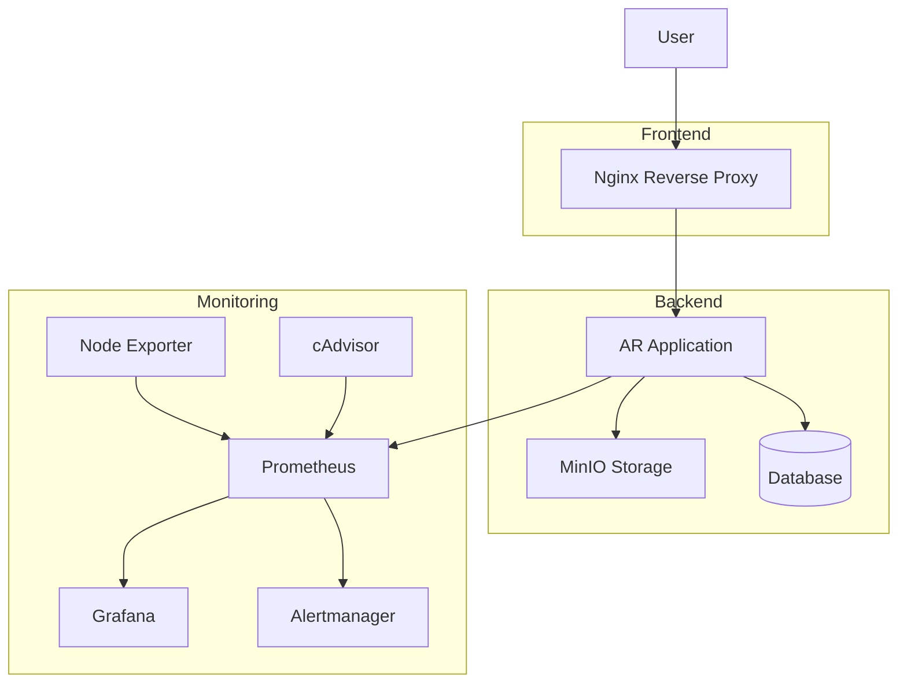
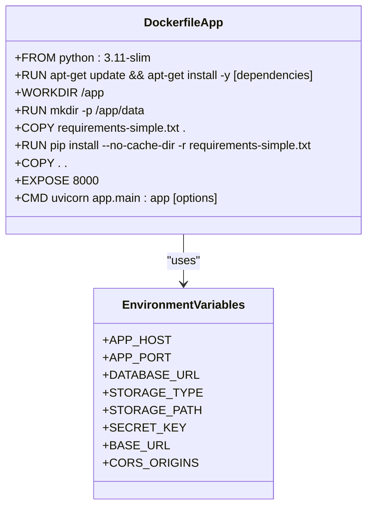
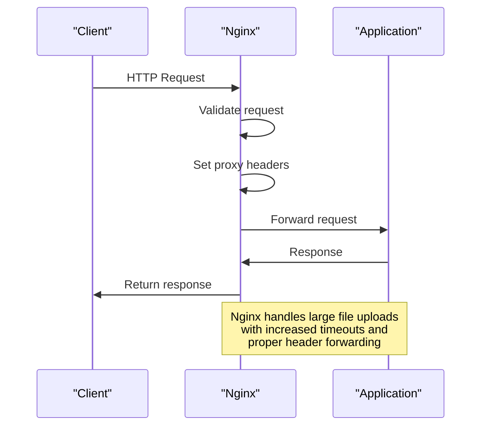
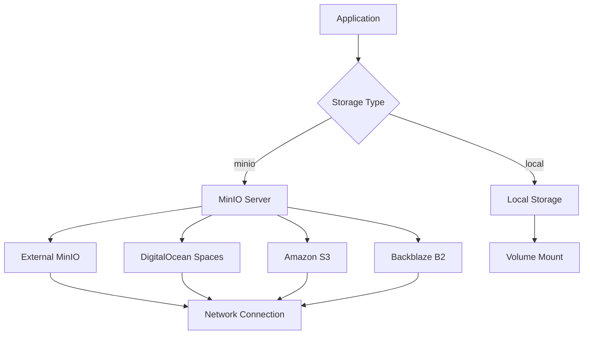
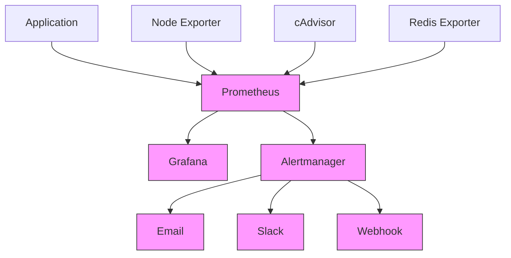
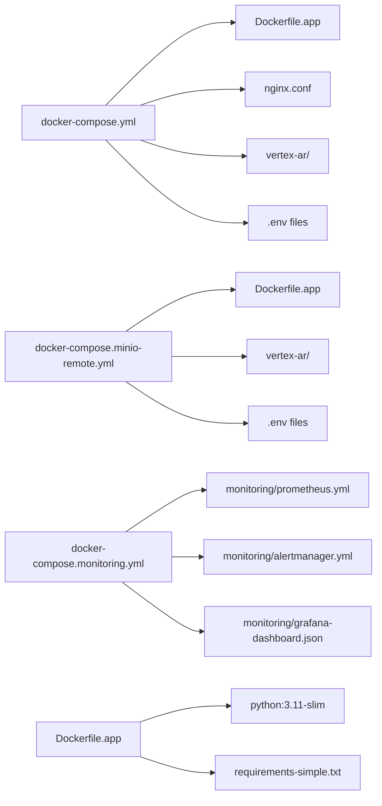

# Docker Deployment

<cite>
**Referenced Files in This Document**   
- [docker-compose.yml](file://docker-compose.yml)
- [docker-compose.minio-remote.yml](file://docker-compose.minio-remote.yml)
- [docker-compose.monitoring.yml](file://docker-compose.monitoring.yml)
- [docker-compose.test.yml](file://docker-compose.test.yml)
- [Dockerfile.app](file://Dockerfile.app)
- [vertex-ar/.env.example](file://vertex-ar/.env.example)
- [vertex-ar/.env.production.example](file://vertex-ar/.env.production.example)
- [monitoring/prometheus.yml](file://monitoring/prometheus.yml)
- [monitoring/alertmanager.yml](file://monitoring/alertmanager.yml)
- [nginx.conf](file://nginx.conf)
- [nginx.test.conf](file://nginx.test.conf)
- [vertex-ar/start.sh](file://vertex-ar/start.sh)
- [vertex-ar/deploy.sh](file://vertex-ar/deploy.sh)
</cite>

## Table of Contents
1. [Introduction](#introduction)
2. [Project Structure](#project-structure)
3. [Core Components](#core-components)
4. [Architecture Overview](#architecture-overview)
5. [Detailed Component Analysis](#detailed-component-analysis)
6. [Dependency Analysis](#dependency-analysis)
7. [Performance Considerations](#performance-considerations)
8. [Troubleshooting Guide](#troubleshooting-guide)
9. [Conclusion](#conclusion)

## Introduction
This document provides comprehensive Docker deployment documentation for the AR backend application. It details the use of docker-compose for orchestrating services including the main application, MinIO for remote storage, monitoring stack (Prometheus, Grafana, Alertmanager), and testing environments. The documentation covers service dependencies, network configuration, volume mounts, and environment variable injection. It also provides examples of starting, stopping, and scaling services, along with best practices for image building, container security, and production optimizations.

## Project Structure

The AR backend application is organized with a clear structure that separates configuration, source code, and operational components. The Docker-related files are located at the root level, while application code resides in the vertex-ar directory. Monitoring configurations are stored in a dedicated monitoring directory, and various scripts for deployment and operations are available in the scripts directory.

**Diagram sources**
- [docker-compose.yml](file://docker-compose.yml)
- [vertex-ar/](file://vertex-ar/)
- [monitoring/](file://monitoring/)

**Section sources**
- [docker-compose.yml](file://docker-compose.yml)
- [vertex-ar/](file://vertex-ar/)

## Core Components

The AR backend application's Docker deployment consists of several core components that work together to provide a complete solution. The main application container is built from a custom Dockerfile that includes all necessary system dependencies for AR processing. Nginx serves as a reverse proxy, handling incoming requests and routing them to the appropriate services. For storage, the application supports both local storage and remote MinIO instances, with configuration options to switch between them. The monitoring stack includes Prometheus for metrics collection, Grafana for visualization, and Alertmanager for alert handling.

**Section sources**
- [Dockerfile.app](file://Dockerfile.app)
- [docker-compose.yml](file://docker-compose.yml)
- [nginx.conf](file://nginx.conf)

## Architecture Overview

The Docker deployment architecture for the AR backend application is designed to be modular and scalable. The main application runs in a container built from a custom Dockerfile that includes all necessary system dependencies for AR processing. Nginx acts as a reverse proxy, handling incoming HTTP requests and routing them to the application container. For persistent storage, the application uses volume mounts to ensure data persistence across container restarts. The monitoring stack runs in separate containers, collecting metrics from the application and system components.

**Diagram sources**
- [docker-compose.yml](file://docker-compose.yml)
- [docker-compose.monitoring.yml](file://docker-compose.monitoring.yml)
- [nginx.conf](file://nginx.conf)

## Detailed Component Analysis

### Main Application Container
The main application container is built from the Dockerfile.app, which is based on python:3.11-slim. It installs all necessary system dependencies for AR processing, including OpenCV and other multimedia libraries. The container exposes port 8000 and uses environment variables for configuration.

**Diagram sources**
- [Dockerfile.app](file://Dockerfile.app)
- [vertex-ar/.env.example](file://vertex-ar/.env.example)

### Nginx Reverse Proxy
The Nginx reverse proxy is configured to handle incoming HTTP requests and route them to the application container. It includes specific configurations for handling large file uploads, health checks, and proper header forwarding. The configuration also includes commented sections for SSL termination.

**Diagram sources**
- [nginx.conf](file://nginx.conf)
- [docker-compose.yml](file://docker-compose.yml)

### Remote Storage with MinIO
The application supports remote storage using MinIO, an S3-compatible object storage service. The docker-compose.minio-remote.yml file provides configuration for connecting to an external MinIO server. Environment variables control the connection details, including endpoint, access keys, bucket name, and security settings.

**Diagram sources**
- [docker-compose.minio-remote.yml](file://docker-compose.minio-remote.yml)
- [vertex-ar/.env.production.example](file://vertex-ar/.env.production.example)

### Monitoring Stack
The monitoring stack consists of multiple components that work together to provide comprehensive monitoring and alerting capabilities. Prometheus collects metrics from the application and system components, Grafana provides visualization, and Alertmanager handles alert routing and deduplication.

**Diagram sources**
- [docker-compose.monitoring.yml](file://docker-compose.monitoring.yml)
- [monitoring/prometheus.yml](file://monitoring/prometheus.yml)
- [monitoring/alertmanager.yml](file://monitoring/alertmanager.yml)

## Dependency Analysis

The Docker deployment of the AR backend application has several key dependencies that must be properly configured for the system to function correctly. The main application depends on Nginx for reverse proxy functionality, with the nginx.conf file defining the routing rules and proxy settings. For storage, the application can use either local storage (via volume mounts) or remote MinIO storage, with the choice controlled by environment variables.

The monitoring stack has dependencies on several external components, including Prometheus for metrics collection, Grafana for visualization, and Alertmanager for alert handling. These components are configured to work together through shared network configurations and volume mounts for data persistence.

**Diagram sources**
- [docker-compose.yml](file://docker-compose.yml)
- [docker-compose.minio-remote.yml](file://docker-compose.minio-remote.yml)
- [docker-compose.monitoring.yml](file://docker-compose.monitoring.yml)
- [Dockerfile.app](file://Dockerfile.app)

**Section sources**
- [docker-compose.yml](file://docker-compose.yml)
- [docker-compose.minio-remote.yml](file://docker-compose.minio-remote.yml)
- [docker-compose.monitoring.yml](file://docker-compose.monitoring.yml)

## Performance Considerations

The Docker deployment of the AR backend application includes several performance optimizations. The main application container uses a slim Python base image to reduce size and improve startup time. The Dockerfile installs system dependencies in a single layer to minimize image size. The application is configured to run with multiple workers based on the number of CPU cores available, improving request handling capacity.

Nginx is configured with increased timeouts to handle large file uploads, which is essential for AR content. The monitoring stack is configured to collect metrics at appropriate intervals to balance performance and monitoring granularity. Volume mounts are used for persistent storage to ensure data persistence while maintaining good I/O performance.

**Section sources**
- [Dockerfile.app](file://Dockerfile.app)
- [nginx.conf](file://nginx.conf)
- [docker-compose.yml](file://docker-compose.yml)

## Troubleshooting Guide

When deploying the AR backend application with Docker, several common issues may arise. Container networking issues can occur if the Docker network configuration is not properly set up. Persistent storage issues may happen if volume mounts are not correctly configured or if the host directories do not have the proper permissions.

For logging issues, ensure that the log configuration in the .env file is properly set and that the log directory has the correct permissions. If the application fails to start, check the Docker logs for error messages and verify that all required environment variables are set. For monitoring issues, verify that Prometheus can scrape the application metrics endpoint and that Alertmanager is properly configured to receive alerts.

**Section sources**
- [docker-compose.yml](file://docker-compose.yml)
- [vertex-ar/.env.example](file://vertex-ar/.env.example)
- [nginx.conf](file://nginx.conf)

## Conclusion

The Docker deployment documentation for the AR backend application provides a comprehensive guide to setting up and managing the application in a containerized environment. The use of docker-compose files allows for easy orchestration of multiple services, including the main application, Nginx reverse proxy, MinIO storage, and monitoring components. The configuration is flexible, supporting both local and remote storage options, and includes production-ready settings for security and performance. By following this documentation, users can deploy a robust and scalable AR backend application with comprehensive monitoring and alerting capabilities.