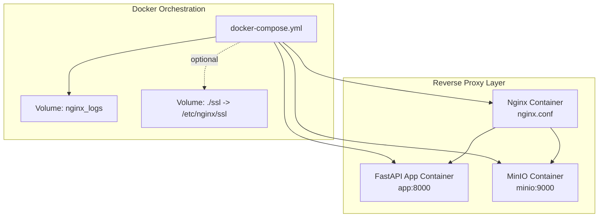
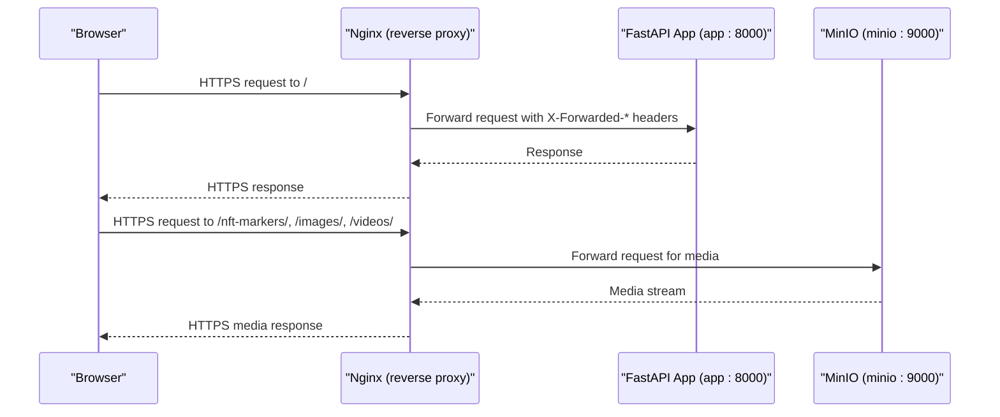
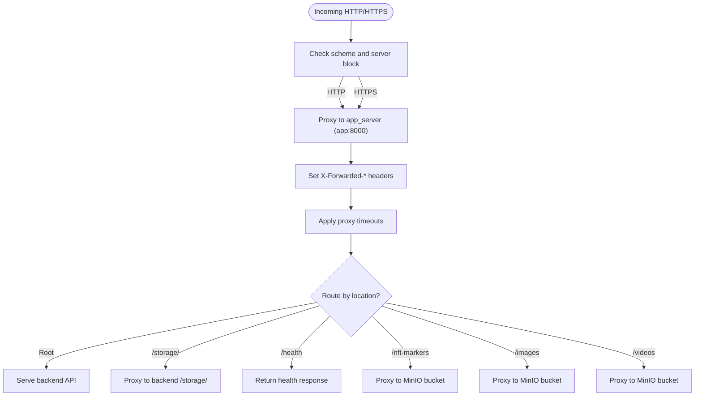
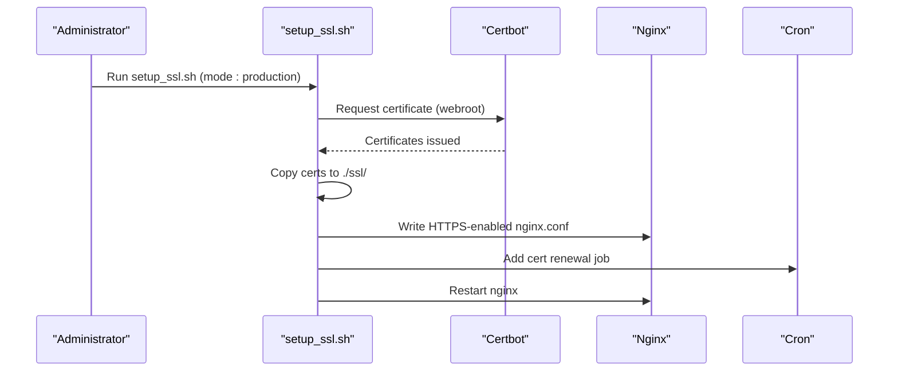
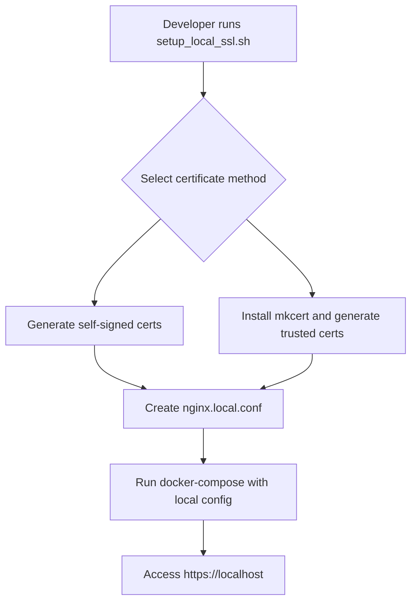
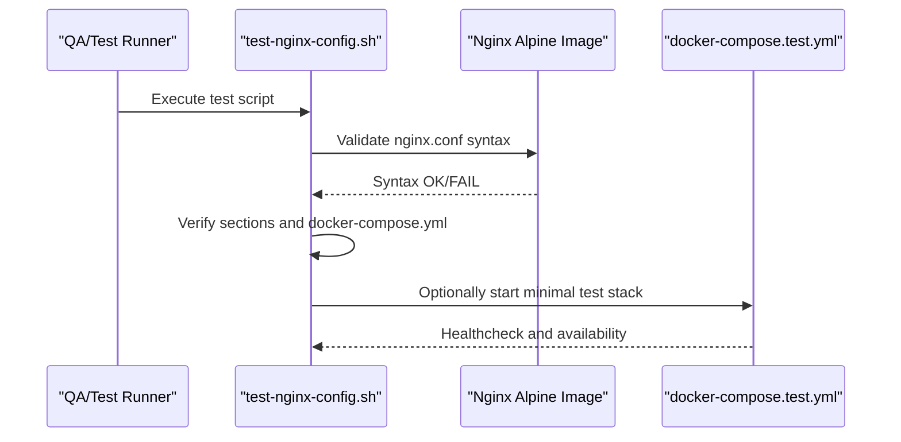
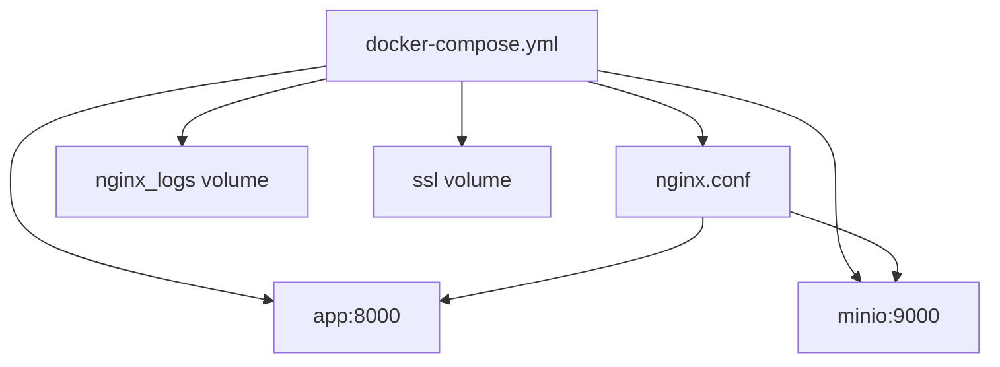

# Nginx and SSL Setup

<cite>
**Referenced Files in This Document**
- [nginx.conf](file://nginx.conf)
- [docker-compose.yml](file://docker-compose.yml)
- [scripts/setup_ssl.sh](file://scripts/setup_ssl.sh)
- [scripts/setup_local_ssl.sh](file://scripts/setup_local_ssl.sh)
- [scripts/test-nginx-config.sh](file://scripts/test-nginx-config.sh)
- [docs/deployment/nginx-ssl-setup.md](file://docs/deployment/nginx-ssl-setup.md)
- [docs/deployment/ssl-installation.md](file://docs/deployment/ssl-installation.md)
- [docker-compose.test.yml](file://docker-compose.test.yml)
- [nginx.test.conf](file://nginx.test.conf)
- [setup_ssl_local.conf](file://setup_ssl_local.conf)
</cite>

## Table of Contents
1. [Introduction](#introduction)
2. [Project Structure](#project-structure)
3. [Core Components](#core-components)
4. [Architecture Overview](#architecture-overview)
5. [Detailed Component Analysis](#detailed-component-analysis)
6. [Dependency Analysis](#dependency-analysis)
7. [Performance Considerations](#performance-considerations)
8. [Troubleshooting Guide](#troubleshooting-guide)
9. [Conclusion](#conclusion)
10. [Appendices](#appendices)

## Introduction
This document explains how to configure Nginx as a reverse proxy for the AR backend with SSL termination. It covers the nginx.conf structure, server blocks, upstream definitions, and SSL certificate configuration. It also explains how to set up HTTPS using Let’s Encrypt or custom certificates via the provided setup scripts, and outlines security hardening practices such as TLS version restrictions, HSTS, and secure headers. Guidance is included for testing configurations, handling certificate renewal, and debugging common Nginx issues like 502 errors or misrouted requests.

## Project Structure
The Nginx configuration and SSL setup are primarily driven by:
- A base Nginx configuration file that defines HTTP server and proxying behavior
- A Docker Compose file that mounts the Nginx config and optionally SSL certificates
- Scripts that automate SSL certificate acquisition and local development SSL setup
- Documentation that describes activation steps, security hardening, and troubleshooting

**Diagram sources**
- [docker-compose.yml](file://docker-compose.yml#L1-L50)
- [nginx.conf](file://nginx.conf#L1-L119)

**Section sources**
- [docker-compose.yml](file://docker-compose.yml#L1-L50)
- [nginx.conf](file://nginx.conf#L1-L119)

## Core Components
- Nginx HTTP server block: listens on port 80, proxies to the FastAPI app, and exposes a health endpoint
- Upstream definition: routes traffic to the backend service
- Optional HTTPS server block: can be activated after obtaining SSL certificates
- Docker Compose: mounts the Nginx config and optionally SSL certificates; includes health checks and port mappings

Key responsibilities:
- Reverse proxy routing to the backend
- Request header forwarding for the backend to reconstruct original client information
- Optional static asset and MinIO passthrough for media resources
- Health checking and readiness verification

**Section sources**
- [nginx.conf](file://nginx.conf#L1-L119)
- [docker-compose.yml](file://docker-compose.yml#L1-L50)

## Architecture Overview
The AR backend is served behind Nginx, which terminates SSL/TLS and forwards requests to the FastAPI application. Optionally, Nginx can also proxy specific paths directly to MinIO for media delivery.

**Diagram sources**
- [nginx.conf](file://nginx.conf#L1-L119)
- [docker-compose.yml](file://docker-compose.yml#L1-L50)

## Detailed Component Analysis

### Nginx Configuration Structure
- Events and HTTP blocks define global behavior and MIME types
- Resolver configuration enables dynamic DNS resolution for upstreams
- HTTP server block:
  - Listens on port 80
  - Proxies to the backend service with forwarded headers
  - Includes explicit timeouts for large uploads
  - Defines locations for root path, static storage passthrough, and health endpoint
- Optional HTTPS server block:
  - Commented out by default
  - Demonstrates SSL certificate paths, TLS protocols, cipher suites, and location blocks

Security-related observations:
- The HTTPS block demonstrates recommended TLS protocol versions and cipher suite selection
- The configuration includes placeholders for HSTS and OCSP stapling, which can be enabled when HTTPS is active

**Section sources**
- [nginx.conf](file://nginx.conf#L1-L119)

### Upstream Definitions and Proxy Behavior
- Upstream is defined in the updated configuration to route to the backend service
- Proxy headers are set to preserve client identity and scheme for the backend
- Timeouts are increased to accommodate large file uploads

**Diagram sources**
- [nginx.conf](file://nginx.conf#L1-L119)

**Section sources**
- [nginx.conf](file://nginx.conf#L1-L119)

### SSL Certificate Configuration and Activation
Two primary approaches are supported:

- Let’s Encrypt (production):
  - Obtain certificates using Certbot with webroot verification
  - Copy certificates into the project’s ssl directory
  - Update Nginx configuration to enable HTTPS server block and mount SSL volume
  - Add automatic renewal via cron

- Local development:
  - Generate self-signed certificates or use mkcert for locally-trusted certificates
  - Create a dedicated local Nginx configuration for localhost/127.0.0.1
  - Mount SSL volume and run containers with HTTPS enabled

**Diagram sources**
- [scripts/setup_ssl.sh](file://scripts/setup_ssl.sh#L131-L255)
- [docs/deployment/nginx-ssl-setup.md](file://docs/deployment/nginx-ssl-setup.md#L129-L185)

**Section sources**
- [scripts/setup_ssl.sh](file://scripts/setup_ssl.sh#L131-L255)
- [docs/deployment/nginx-ssl-setup.md](file://docs/deployment/nginx-ssl-setup.md#L1-L185)

### Local Development SSL Setup
- Generates self-signed or mkcert certificates
- Creates a local Nginx configuration for localhost/127.0.0.1 with HTTPS
- Provides usage instructions for Docker-based local development

**Diagram sources**
- [scripts/setup_local_ssl.sh](file://scripts/setup_local_ssl.sh#L1-L365)
- [setup_ssl_local.conf](file://setup_ssl_local.conf#L1-L90)

**Section sources**
- [scripts/setup_local_ssl.sh](file://scripts/setup_local_ssl.sh#L1-L365)
- [setup_ssl_local.conf](file://setup_ssl_local.conf#L1-L90)

### Testing and Validation
- A dedicated script validates Nginx configuration syntax and structure, checks for required sections, and optionally spins up a minimal test environment
- A separate test compose file and configuration provide a lightweight proxy test bed

**Diagram sources**
- [scripts/test-nginx-config.sh](file://scripts/test-nginx-config.sh#L1-L190)
- [docker-compose.test.yml](file://docker-compose.test.yml#L1-L46)
- [nginx.test.conf](file://nginx.test.conf#L1-L35)

**Section sources**
- [scripts/test-nginx-config.sh](file://scripts/test-nginx-config.sh#L1-L190)
- [docker-compose.test.yml](file://docker-compose.test.yml#L1-L46)
- [nginx.test.conf](file://nginx.test.conf#L1-L35)

## Dependency Analysis
- Nginx depends on the backend service being healthy and reachable
- Docker Compose orchestrates Nginx, the backend, and optional MinIO
- SSL activation depends on certificate presence and correct file permissions
- Health checks ensure readiness before traffic is routed

**Diagram sources**
- [docker-compose.yml](file://docker-compose.yml#L1-L50)
- [nginx.conf](file://nginx.conf#L1-L119)

**Section sources**
- [docker-compose.yml](file://docker-compose.yml#L1-L50)
- [nginx.conf](file://nginx.conf#L1-L119)

## Performance Considerations
- Increased proxy timeouts are configured to handle large uploads
- Resolver caching reduces DNS overhead for upstream resolution
- Health checks ensure only healthy instances receive traffic

[No sources needed since this section provides general guidance]

## Troubleshooting Guide
Common issues and resolutions:

- Nginx fails to start due to missing SSL files:
  - Ensure certificate and key files exist and have correct permissions
  - Validate Nginx syntax inside the container
  - Confirm the SSL volume is mounted when HTTPS is enabled

- Port 443 already in use:
  - Identify the conflicting process and stop it
  - Reconfigure the conflicting service or change Nginx port

- Certificate verification failures:
  - For self-signed certificates, accept the warning in development
  - For Let’s Encrypt, verify DNS records and port 80 accessibility

- 502 Bad Gateway or misrouted requests:
  - Check backend service health and network connectivity
  - Verify proxy headers and upstream target
  - Inspect Nginx access and error logs

- Automated renewal:
  - Add a cron job to renew certificates and restart Nginx
  - Monitor renewal logs and test HTTPS connectivity post-renewal

**Section sources**
- [docs/deployment/nginx-ssl-setup.md](file://docs/deployment/nginx-ssl-setup.md#L129-L185)
- [scripts/test-nginx-config.sh](file://scripts/test-nginx-config.sh#L1-L190)

## Conclusion
The repository provides a robust foundation for Nginx reverse proxying with optional SSL termination. The configuration is modular, enabling easy activation of HTTPS after obtaining certificates. The included scripts streamline local development and production SSL setup, while the test utilities help validate deployments. Applying security hardening practices such as TLS version restrictions, HSTS, and OCSP stapling further strengthens the deployment posture.

[No sources needed since this section summarizes without analyzing specific files]

## Appendices

### Security Hardening Practices
- TLS version restrictions:
  - Enforce modern TLS versions in the HTTPS server block
- HSTS:
  - Add strict transport security header in the HTTPS server block
- OCSP stapling:
  - Enable stapling and configure trusted certificate chain
- Secure headers:
  - Consider adding frame options and content type options headers

**Section sources**
- [docs/deployment/nginx-ssl-setup.md](file://docs/deployment/nginx-ssl-setup.md#L158-L185)
- [scripts/setup_ssl.sh](file://scripts/setup_ssl.sh#L190-L238)

### Quick Reference: Activating HTTPS
- Generate or obtain certificates
- Update Nginx configuration to enable HTTPS server block
- Mount SSL volume in Docker Compose
- Add automated renewal via cron
- Restart Nginx and verify connectivity

**Section sources**
- [docs/deployment/nginx-ssl-setup.md](file://docs/deployment/nginx-ssl-setup.md#L71-L127)
- [scripts/setup_ssl.sh](file://scripts/setup_ssl.sh#L244-L255)