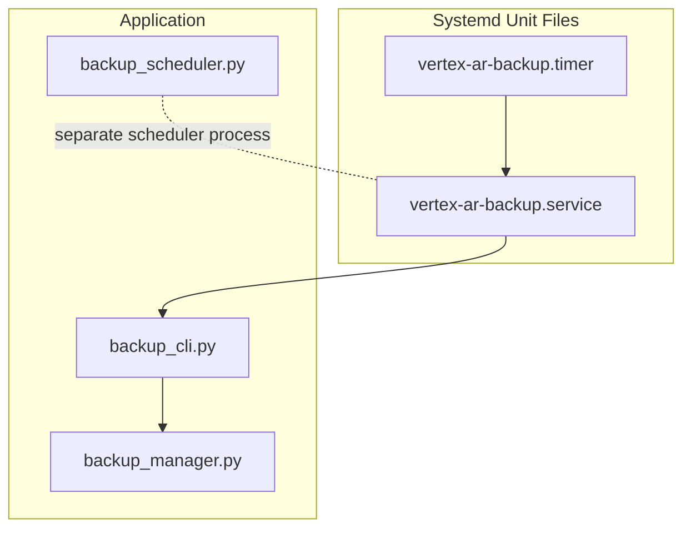
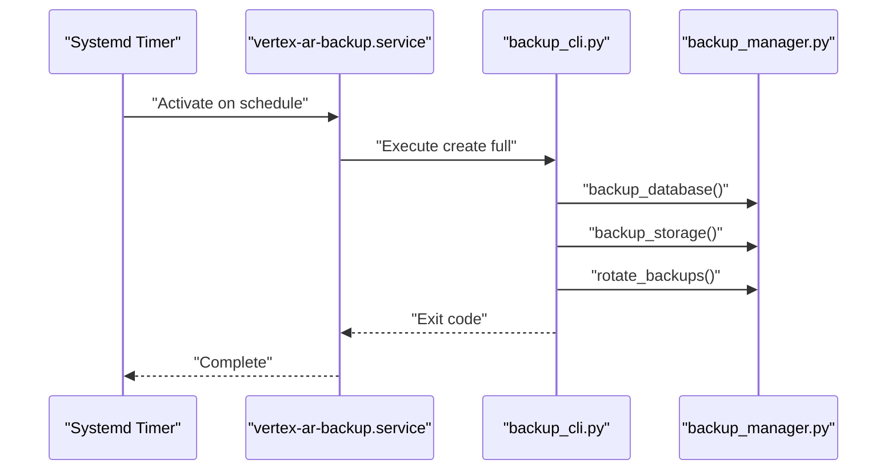
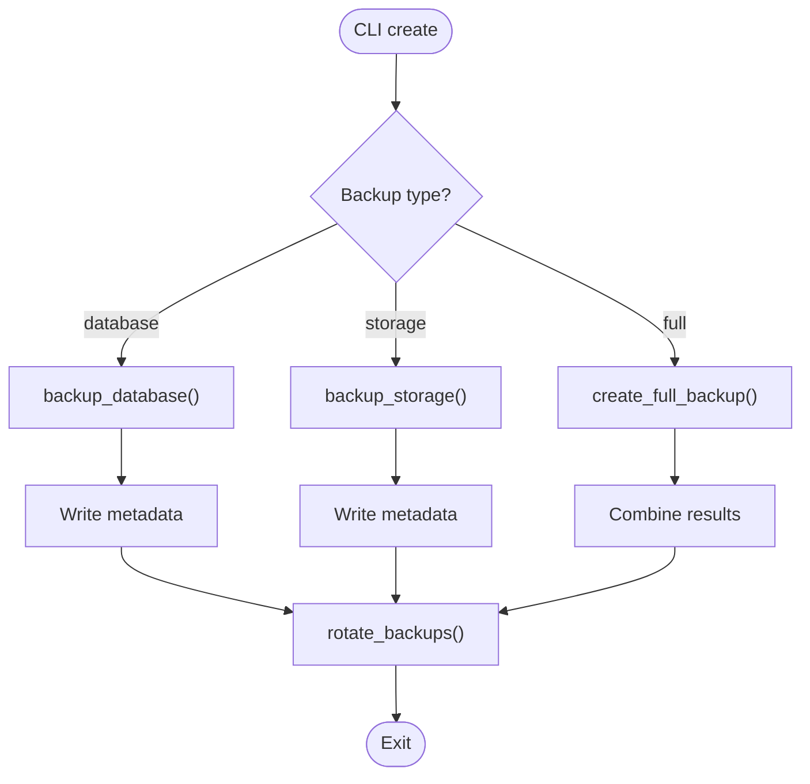
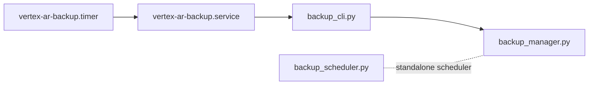

# Systemd Service Configuration

<cite>
**Referenced Files in This Document**
- [vertex-ar/systemd/vertex-ar-backup.service](file://vertex-ar/systemd/vertex-ar-backup.service)
- [vertex-ar/systemd/vertex-ar-backup.timer](file://vertex-ar/systemd/vertex-ar-backup.timer)
- [vertex-ar/systemd/README.md](file://vertex-ar/systemd/README.md)
- [vertex-ar/backup_cli.py](file://vertex-ar/backup_cli.py)
- [vertex-ar/backup_manager.py](file://vertex-ar/backup_manager.py)
- [vertex-ar/backup_scheduler.py](file://vertex-ar/backup_scheduler.py)
- [vertex-ar/backup.sh](file://vertex-ar/backup.sh)
- [docs/operations/backup-system.md](file://docs/operations/backup-system.md)
</cite>

## Table of Contents
1. [Introduction](#introduction)
2. [Project Structure](#project-structure)
3. [Core Components](#core-components)
4. [Architecture Overview](#architecture-overview)
5. [Detailed Component Analysis](#detailed-component-analysis)
6. [Dependency Analysis](#dependency-analysis)
7. [Performance Considerations](#performance-considerations)
8. [Troubleshooting Guide](#troubleshooting-guide)
9. [Conclusion](#conclusion)

## Introduction
This document explains the systemd service configuration used to manage backup processes in the AR application. It covers the vertex-ar-backup.service and vertex-ar-backup.timer, including execution frequency, user permissions, logging, and integration with the application’s backup scheduler and CLI. It also provides installation, enabling, starting, and monitoring steps, along with troubleshooting guidance for common systemd issues.

## Project Structure
The systemd integration resides under vertex-ar/systemd and orchestrates the backup execution via a one-shot service that invokes the backup CLI. The backup CLI coordinates with the backup manager to create database, storage, or full backups and rotates old backups afterward.

**Diagram sources**
- [vertex-ar/systemd/vertex-ar-backup.service](file://vertex-ar/systemd/vertex-ar-backup.service#L1-L18)
- [vertex-ar/systemd/vertex-ar-backup.timer](file://vertex-ar/systemd/vertex-ar-backup.timer#L1-L14)
- [vertex-ar/backup_cli.py](file://vertex-ar/backup_cli.py#L1-L317)
- [vertex-ar/backup_manager.py](file://vertex-ar/backup_manager.py#L1-L200)
- [vertex-ar/backup_scheduler.py](file://vertex-ar/backup_scheduler.py#L1-L120)

**Section sources**
- [vertex-ar/systemd/vertex-ar-backup.service](file://vertex-ar/systemd/vertex-ar-backup.service#L1-L18)
- [vertex-ar/systemd/vertex-ar-backup.timer](file://vertex-ar/systemd/vertex-ar-backup.timer#L1-L14)
- [vertex-ar/systemd/README.md](file://vertex-ar/systemd/README.md#L1-L137)

## Core Components
- vertex-ar-backup.service: Defines a one-shot systemd service that runs the backup CLI to create a full backup and rotates old backups.
- vertex-ar-backup.timer: Schedules the service to run daily at 2:00 AM and persists missed runs until the next boot.
- backup_cli.py: Command-line interface that creates backups (database, storage, full), lists backups, shows stats, restores, and rotates backups.
- backup_manager.py: Implements backup creation, rotation, verification, and restore logic for database and storage.
- backup_scheduler.py: Optional APScheduler-based scheduler that can run backups independently of systemd (environment-controlled schedules and toggles).
- backup.sh: Shell wrapper that activates a virtual environment, checks prerequisites, executes the backup CLI, logs outcomes, and sends optional notifications.

Key systemd characteristics:
- Type=oneshot ensures the service exits after completion.
- User and Group define the OS user/group context.
- WorkingDirectory sets the application path.
- Environment PATH includes the virtual environment bin.
- ExecStart invokes the Python backup CLI with arguments.
- StandardOutput and StandardError are directed to the systemd journal with a syslog identifier.

Execution frequency:
- The timer schedules daily at 2:00 AM and keeps Persistent=true so missed runs execute on next boot.

Permissions:
- The service runs under a dedicated user/group. Ensure the backup directory is owned by this user/group and writable.

Logging:
- Logs are written to the systemd journal with a syslog identifier for easy filtering.

Integration:
- The service calls the backup CLI, which delegates to the backup manager to perform actual backup operations and rotation.

**Section sources**
- [vertex-ar/systemd/vertex-ar-backup.service](file://vertex-ar/systemd/vertex-ar-backup.service#L1-L18)
- [vertex-ar/systemd/vertex-ar-backup.timer](file://vertex-ar/systemd/vertex-ar-backup.timer#L1-L14)
- [vertex-ar/backup_cli.py](file://vertex-ar/backup_cli.py#L1-L317)
- [vertex-ar/backup_manager.py](file://vertex-ar/backup_manager.py#L1-L200)
- [vertex-ar/backup_scheduler.py](file://vertex-ar/backup_scheduler.py#L1-L120)
- [vertex-ar/backup.sh](file://vertex-ar/backup.sh#L1-L224)

## Architecture Overview
The systemd timer triggers the one-shot service, which executes the backup CLI. The CLI uses the backup manager to create backups and rotate old ones. The backup manager writes metadata and handles large-file splitting and checksum verification.

**Diagram sources**
- [vertex-ar/systemd/vertex-ar-backup.timer](file://vertex-ar/systemd/vertex-ar-backup.timer#L1-L14)
- [vertex-ar/systemd/vertex-ar-backup.service](file://vertex-ar/systemd/vertex-ar-backup.service#L1-L18)
- [vertex-ar/backup_cli.py](file://vertex-ar/backup_cli.py#L1-L317)
- [vertex-ar/backup_manager.py](file://vertex-ar/backup_manager.py#L1-L200)

## Detailed Component Analysis

### Systemd Service and Timer
- Service file:
  - Type=oneshot
  - User and Group set to the application user
  - WorkingDirectory points to the application root
  - Environment PATH includes the virtual environment bin
  - ExecStart runs the backup CLI with arguments to create a full backup
  - StandardOutput and StandardError go to journal with a syslog identifier
  - Install targets multi-user.target
- Timer file:
  - OnCalendar=daily and OnCalendar=02:00
  - Persistent=true to run missed occurrences on next boot
  - Requires=vertex-ar-backup.service

Installation and customization:
- Copy unit files to /etc/systemd/system/, adjust User/Group/WorkingDirectory/Environment, reload systemd, enable and start the timer, and monitor with journalctl.

Monitoring:
- Use systemctl status and list-timers to inspect state and next run.
- Use journalctl -u vertex-ar-backup.service to review logs.

Manual trigger:
- Start the service unit directly to run a backup immediately.

**Section sources**
- [vertex-ar/systemd/vertex-ar-backup.service](file://vertex-ar/systemd/vertex-ar-backup.service#L1-L18)
- [vertex-ar/systemd/vertex-ar-backup.timer](file://vertex-ar/systemd/vertex-ar-backup.timer#L1-L14)
- [vertex-ar/systemd/README.md](file://vertex-ar/systemd/README.md#L1-L137)

### Backup CLI and Manager Integration
- backup_cli.py:
  - Supports create, list, stats, restore, and rotate commands
  - Delegates to backup_manager to perform operations
  - Optionally rotates backups after creation
- backup_manager.py:
  - Creates database backups using SQLite’s backup API
  - Creates compressed storage backups and metadata
  - Rotates old backups by removing oldest files beyond retention
  - Verifies backups via checksums and optional archive checks
  - Supports chunked backups for large files and merges them on restore

**Diagram sources**
- [vertex-ar/backup_cli.py](file://vertex-ar/backup_cli.py#L1-L317)
- [vertex-ar/backup_manager.py](file://vertex-ar/backup_manager.py#L1-L200)

**Section sources**
- [vertex-ar/backup_cli.py](file://vertex-ar/backup_cli.py#L1-L317)
- [vertex-ar/backup_manager.py](file://vertex-ar/backup_manager.py#L1-L200)

### Backup Scheduler (Optional)
While the systemd timer drives backups, the application also includes an optional APScheduler-based scheduler that can run backups independently. It reads environment variables for schedules and toggles, and logs job execution and failures.

- Reads environment variables for schedules and enables/disables jobs
- Uses CronTrigger.from_crontab for scheduling
- Graceful misfire handling and logging

This scheduler is separate from the systemd units and can be started/stopped as a long-running service.

**Section sources**
- [vertex-ar/backup_scheduler.py](file://vertex-ar/backup_scheduler.py#L1-L120)

### Shell Script Wrapper (backup.sh)
The shell script wraps the backup process:
- Activates a virtual environment if present
- Checks Python availability and disk space
- Invokes the backup CLI with type, max backups, and backup directory
- Logs to a file and optionally sends Telegram notifications
- Prints statistics and duration on completion

It complements the systemd integration by providing a robust wrapper for manual runs and cron-based automation.

**Section sources**
- [vertex-ar/backup.sh](file://vertex-ar/backup.sh#L1-L224)

## Dependency Analysis
The systemd units depend on the backup CLI and manager. The backup CLI depends on the backup manager. The optional scheduler is independent of systemd but shares the same manager.

**Diagram sources**
- [vertex-ar/systemd/vertex-ar-backup.service](file://vertex-ar/systemd/vertex-ar-backup.service#L1-L18)
- [vertex-ar/systemd/vertex-ar-backup.timer](file://vertex-ar/systemd/vertex-ar-backup.timer#L1-L14)
- [vertex-ar/backup_cli.py](file://vertex-ar/backup_cli.py#L1-L317)
- [vertex-ar/backup_manager.py](file://vertex-ar/backup_manager.py#L1-L200)
- [vertex-ar/backup_scheduler.py](file://vertex-ar/backup_scheduler.py#L1-L120)

**Section sources**
- [vertex-ar/systemd/vertex-ar-backup.service](file://vertex-ar/systemd/vertex-ar-backup.service#L1-L18)
- [vertex-ar/systemd/vertex-ar-backup.timer](file://vertex-ar/systemd/vertex-ar-backup.timer#L1-L14)
- [vertex-ar/backup_cli.py](file://vertex-ar/backup_cli.py#L1-L317)
- [vertex-ar/backup_manager.py](file://vertex-ar/backup_manager.py#L1-L200)
- [vertex-ar/backup_scheduler.py](file://vertex-ar/backup_scheduler.py#L1-L120)

## Performance Considerations
- Execution frequency: The timer runs daily at 2:00 AM. Adjust OnCalendar in the timer file to fit operational needs.
- Retention: The CLI rotates old backups after creation; tune the maximum number retained to balance storage usage and recovery needs.
- Large files: The manager splits large backups into chunks and merges them on restore; ensure adequate disk space and consider compression settings.
- Logging overhead: Journal logging is lightweight; ensure the journal is rotated to prevent excessive disk usage.

[No sources needed since this section provides general guidance]

## Troubleshooting Guide
Common systemd issues and resolutions:
- Timer not running:
  - Check status and whether it is enabled; enable and start the timer if needed.
- Backup fails:
  - Inspect logs with journalctl for the service unit.
  - Manually run the backup as the application user to reproduce the issue.
  - Verify backup directory permissions and ownership.
- Permission errors:
  - Ensure the backup directory is writable by the service user/group.
  - Recreate or fix ownership and permissions accordingly.
- Log inspection:
  - Use journalctl to view recent logs and follow logs in real time.
- Monitoring:
  - Use systemctl status and list-timers to confirm schedule and next run time.

Installation and maintenance steps are documented in the systemd README, including copying unit files, updating paths, reloading systemd, enabling and starting the timer, and checking status.

**Section sources**
- [vertex-ar/systemd/README.md](file://vertex-ar/systemd/README.md#L1-L137)
- [vertex-ar/systemd/vertex-ar-backup.service](file://vertex-ar/systemd/vertex-ar-backup.service#L1-L18)
- [vertex-ar/systemd/vertex-ar-backup.timer](file://vertex-ar/systemd/vertex-ar-backup.timer#L1-L14)

## Conclusion
The systemd service and timer provide a reliable, automated mechanism to run Vertex AR backups daily at 2:00 AM. The service executes the backup CLI, which coordinates with the backup manager to create database and storage backups and rotate old backups. The optional scheduler offers an alternative execution model controlled by environment variables. Proper user permissions, logging, and monitoring ensure smooth operation and quick troubleshooting.