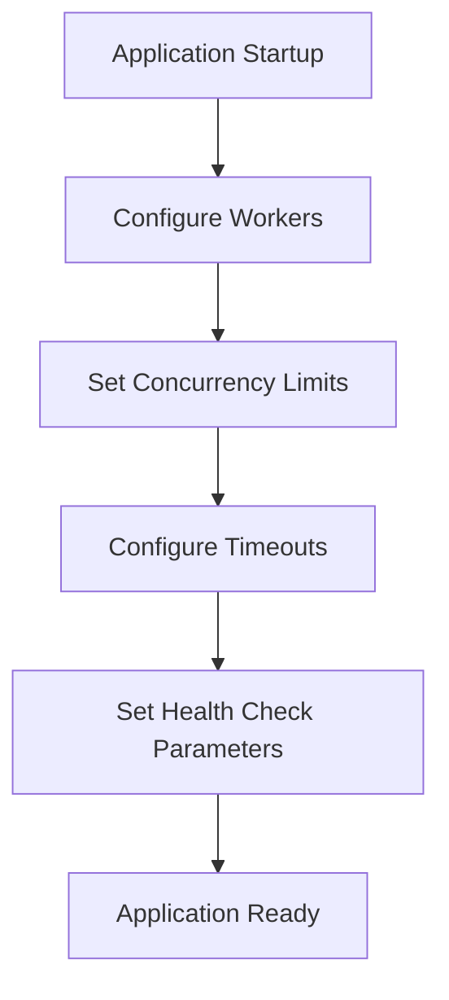
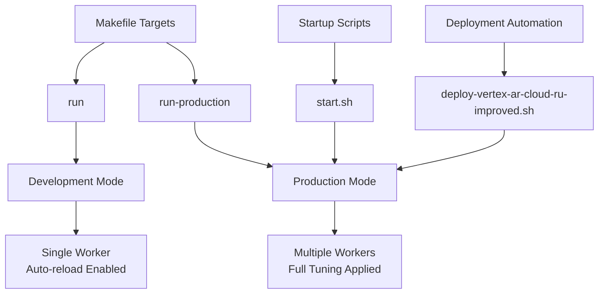

# Uvicorn Performance Tuning

<cite>
**Referenced Files in This Document**   
- [uvicorn-tuning.md](file://docs/deployment/uvicorn-tuning.md)
- [Makefile](file://vertex-ar/Makefile)
- [start.sh](file://vertex-ar/start.sh)
- [deploy-vertex-ar-cloud-ru-improved.sh](file://deploy-vertex-ar-cloud-ru-improved.sh)
- [config.py](file://vertex-ar/app/config.py)
- [main.py](file://vertex-ar/app/main.py)
- [test_uvicorn_config.py](file://test_files/unit/test_uvicorn_config.py)
</cite>

## Table of Contents
1. [Introduction](#introduction)
2. [Worker Process Configuration](#worker-process-configuration)
3. [Threading and Concurrency](#threading-and-concurrency)
4. [Timeout Settings](#timeout-settings)
5. [Memory Optimization](#memory-optimization)
6. [Optimal Worker Count Determination](#optimal-worker-count-determination)
7. [Deployment Integration](#deployment-integration)
8. [Monitoring and Performance Assessment](#monitoring-and-performance-assessment)
9. [Environment-Specific Configurations](#environment-specific-configurations)
10. [Troubleshooting](#troubleshooting)

## Introduction

This document provides comprehensive performance tuning guidance for Uvicorn, the ASGI server running the AR FastAPI application. The AR application leverages Uvicorn's capabilities to handle asynchronous requests efficiently, with specific tuning parameters optimized for different deployment scenarios. The configuration system is designed to balance performance, resource utilization, and reliability across development, staging, and production environments.

The tuning framework includes worker process management, connection handling, timeout configurations, and memory optimization strategies. These settings are integrated with deployment scripts and Makefile targets, allowing for consistent configuration across different environments. The system also includes monitoring indicators to identify performance bottlenecks and assess the impact of tuning adjustments.

**Section sources**
- [uvicorn-tuning.md](file://docs/deployment/uvicorn-tuning.md#L1-L623)

## Worker Process Configuration

The AR application implements a sophisticated worker process configuration system that automatically calculates optimal worker counts based on available CPU resources. The default worker count follows the industry-standard formula: `(2 * CPU cores) + 1`, which provides optimal performance for both CPU-bound and I/O-bound workloads.

The worker configuration is managed through environment variables that can be overridden for specific deployment requirements. The primary settings include:

- `UVICORN_WORKERS`: Controls the number of worker processes (default: `(2 * CPU cores) + 1`)
- `UVICORN_PROXY_HEADERS`: Enables parsing of X-Forwarded-* headers when behind a reverse proxy
- `ENVIRONMENT`: Determines whether to run in development mode (single worker with reload) or production mode (multi-worker)

The configuration is implemented in multiple components of the deployment system, including the Makefile, startup scripts, and deployment automation. In development mode, the application runs with a single worker and auto-reload enabled for faster development cycles. In production mode, the full worker configuration is applied based on the calculated or specified worker count.

**Section sources**
- [Makefile](file://vertex-ar/Makefile#L42-L61)
- [start.sh](file://vertex-ar/start.sh#L33-L49)
- [config.py](file://vertex-ar/app/config.py#L209-L214)

## Threading and Concurrency

The AR application manages concurrency through several Uvicorn settings that control connection handling and request processing. The threading model is designed to maximize throughput while preventing resource exhaustion under high load conditions.

Key concurrency settings include:

- `UVICORN_LIMIT_CONCURRENCY`: Limits the maximum number of concurrent connections per worker (0 = unlimited)
- `UVICORN_BACKLOG`: Sets the connection queue size for pending connections
- `UVICORN_TIMEOUT_KEEP_ALIVE`: Controls how long idle connections are kept open

These settings work together to manage the application's capacity to handle concurrent requests. The `UVICORN_LIMIT_CONCURRENCY` setting prevents individual workers from being overwhelmed by too many simultaneous connections, while `UVICORN_BACKLOG` ensures that incoming connections are queued appropriately when workers are busy. The keep-alive timeout balances connection reuse with resource cleanup, allowing clients to reuse connections for multiple requests while preventing idle connections from consuming server resources indefinitely.

The configuration is validated through unit tests that verify the proper parsing and application of these settings from environment variables.

**Section sources**
- [uvicorn-tuning.md](file://docs/deployment/uvicorn-tuning.md#L103-L135)
- [config.py](file://vertex-ar/app/config.py#L217-L219)
- [test_uvicorn_config.py](file://test_files/unit/test_uvicorn_config.py#L115-L146)

## Timeout Settings

The AR application implements comprehensive timeout management to ensure reliable operation under various conditions. These settings control how the application handles request processing, connection maintenance, and graceful shutdowns.

Key timeout configurations include:

- `UVICORN_TIMEOUT_GRACEFUL_SHUTDOWN`: Time to wait for active requests during shutdown (default: 30 seconds)
- `UVICORN_TIMEOUT_KEEP_ALIVE`: Alternative keep-alive timeout setting
- `WEB_HEALTH_CHECK_TIMEOUT`: Health check request timeout in seconds

The graceful shutdown timeout is particularly important for ensuring that long-running operations such as file uploads or video processing can complete during deployment cycles. This prevents active requests from being abruptly terminated when the application is restarted.

The health check timeout setting allows monitoring systems to detect application issues without generating false positives during periods of high load. This setting should be tuned based on the application's typical response times to ensure reliable monitoring.



**Diagram sources**
- [config.py](file://vertex-ar/app/config.py#L214-L221)
- [uvicorn-tuning.md](file://docs/deployment/uvicorn-tuning.md#L153-L165)

**Section sources**
- [config.py](file://vertex-ar/app/config.py#L214-L221)
- [uvicorn-tuning.md](file://docs/deployment/uvicorn-tuning.md#L153-L165)

## Memory Optimization

The AR application includes several memory optimization strategies to ensure efficient resource utilization across different deployment scenarios. The memory footprint is primarily determined by the number of worker processes, with each worker consuming approximately 200-300 MB of RAM under typical load.

Memory optimization is achieved through:

1. **Worker count management**: The default worker calculation formula `(2 * CPU cores) + 1` provides optimal performance while avoiding excessive memory consumption
2. **Concurrency limiting**: The `UVICORN_LIMIT_CONCURRENCY` setting prevents memory exhaustion from handling too many concurrent requests
3. **Connection backlog tuning**: The `UVICORN_BACKLOG` setting can be reduced in memory-constrained environments to minimize memory usage

For memory-constrained environments (< 2 GB RAM), the configuration can be optimized by reducing the worker count to the minimum viable level (typically 3 workers) and implementing concurrency limits to prevent memory exhaustion.

The deployment scripts include validation checks for system requirements, including minimum memory thresholds, to prevent deployment to systems that cannot adequately support the application.

**Section sources**
- [uvicorn-tuning.md](file://docs/deployment/uvicorn-tuning.md#L319-L333)
- [deploy-vertex-ar-cloud-ru-improved.sh](file://deploy-vertex-ar-cloud-ru-improved.sh#L38-L40)

## Optimal Worker Count Determination

The optimal worker count for the AR application is determined by a combination of CPU resources, workload characteristics, and available memory. The system implements a default calculation formula that provides a solid starting point for most deployment scenarios.

### Default Calculation Formula

The default worker count follows the formula: `(2 * CPU cores) + 1`

This formula is based on industry best practices and has been tested across systems with 1-64 CPU cores. The rationale for this formula includes:

- 2× cores handles both CPU-bound and I/O-bound tasks effectively
- +1 ensures at least one worker is always available during reloads or maintenance
- Extensive testing has validated this formula across various hardware configurations

### Workload-Based Adjustments

The optimal worker count should be adjusted based on the specific workload characteristics:

**Increase workers when:**
- CPU utilization is consistently below 70% but the request queue is growing
- High throughput requirements (1000+ requests per second)
- Sufficient RAM is available (200-300 MB per worker)
- The application handles primarily I/O-bound operations

**Decrease workers when:**
- Operating in memory-constrained environments
- Traffic levels are low (< 100 requests per second)
- Database connection pool limits constrain performance
- Running in development or testing environments

The worker count can be explicitly overridden using the `UVICORN_WORKERS` environment variable, allowing for fine-tuned configuration based on specific deployment requirements.

**Section sources**
- [uvicorn-tuning.md](file://docs/deployment/uvicorn-tuning.md#L40-L86)
- [config.py](file://vertex-ar/app/config.py#L210-L214)
- [test_uvicorn_config.py](file://test_files/unit/test_uvicorn_config.py#L42-L86)

## Deployment Integration

The Uvicorn performance tuning configuration is integrated with multiple deployment mechanisms to ensure consistent application across different environments. The system provides several interfaces for applying and managing the tuning settings.

### Makefile Integration

The Makefile provides convenient targets for running the application with appropriate configurations:

- `make run`: Starts the application in development mode with a single worker and auto-reload
- `make run-production`: Starts the application in production mode with full worker configuration and environment-based settings

The production run target automatically calculates the worker count based on CPU cores and applies all relevant tuning parameters from environment variables.

### Startup Scripts

The `start.sh` script provides a simplified startup process that:
1. Creates and activates a virtual environment
2. Installs dependencies
3. Loads environment variables from `.env` file
4. Calculates default workers based on CPU count
5. Starts the server with appropriate Uvicorn settings

The script automatically detects the environment mode and applies either development settings (with reload) or production settings (with multiple workers).

### Deployment Automation

The `deploy-vertex-ar-cloud-ru-improved.sh` script implements a comprehensive deployment process that:
1. Performs pre-flight system checks
2. Creates backups before deployment
3. Validates production configuration
4. Generates Supervisor configuration with optimized flags
5. Logs applied configuration settings

This ensures that the Uvicorn tuning settings are consistently applied and validated during deployment.



**Diagram sources**
- [Makefile](file://vertex-ar/Makefile#L42-L61)
- [start.sh](file://vertex-ar/start.sh#L33-L66)
- [deploy-vertex-ar-cloud-ru-improved.sh](file://deploy-vertex-ar-cloud-ru-improved.sh#L777-L800)

**Section sources**
- [Makefile](file://vertex-ar/Makefile#L42-L61)
- [start.sh](file://vertex-ar/start.sh#L33-L66)
- [deploy-vertex-ar-cloud-ru-improved.sh](file://deploy-vertex-ar-cloud-ru-improved.sh#L777-L800)

## Monitoring and Performance Assessment

The AR application includes comprehensive monitoring capabilities to identify performance bottlenecks and assess the impact of tuning adjustments. These monitoring indicators provide visibility into the application's health and performance characteristics.

### Key Monitoring Indicators

**Process Metrics:**
- Worker process count (should match `UVICORN_WORKERS + 1` for master and workers)
- CPU utilization across all workers
- Memory consumption per worker process

**Connection Statistics:**
- Active connections (should stay below `UVICORN_WORKERS * UVICORN_LIMIT_CONCURRENCY`)
- Connection queue length
- Keep-alive connection count

**Health Check Monitoring:**
- Health check response time
- Health check success rate
- Monitoring overhead on server resources

### Performance Validation

The effectiveness of tuning adjustments can be assessed through:

1. **Process verification**: Using `ps aux | grep uvicorn` to confirm the correct number of worker processes
2. **Connection monitoring**: Using `netstat` to monitor active connections and ensure they stay within configured limits
3. **Log analysis**: Checking application logs for startup messages that confirm the applied configuration
4. **Supervisor status**: Using `supervisorctl status` to verify the application is running correctly

The system includes a performance test target in the Makefile (`make perf-test`) that uses Locust to simulate load and measure performance metrics.

**Section sources**
- [uvicorn-tuning.md](file://docs/deployment/uvicorn-tuning.md#L374-L455)
- [Makefile](file://vertex-ar/Makefile#L120-L122)

## Environment-Specific Configurations

The AR application provides optimized configuration profiles for different deployment environments, balancing performance, resource utilization, and development convenience.

### Development Environment

```bash
# .env configuration for development
UVICORN_WORKERS=1                   # Single worker for easier debugging
UVICORN_LIMIT_CONCURRENCY=0         # No artificial limits
WEB_HEALTH_CHECK_COOLDOWN=10        # Fast feedback
ENVIRONMENT=development             # Enables auto-reload
```

This configuration prioritizes developer experience with fast feedback loops and easy debugging, using a single worker process with auto-reload enabled.

### Staging Environment

```bash
# .env configuration for staging
UVICORN_WORKERS=5                   # Moderate worker count
UVICORN_LIMIT_CONCURRENCY=500       # Reasonable concurrency limit
UVICORN_BACKLOG=2048                # Standard backlog
UVICORN_KEEPALIVE_TIMEOUT=5         # Standard keep-alive
WEB_HEALTH_CHECK_USE_HEAD=true      # Reduce monitoring load
```

The staging configuration balances performance testing with resource efficiency, using a moderate worker count suitable for pre-production testing.

### Production Environment

```bash
# .env configuration for high-traffic production
UVICORN_WORKERS=17                  # 8-core server
UVICORN_LIMIT_CONCURRENCY=1000      # Per worker
UVICORN_BACKLOG=8192                # Large queue
UVICORN_KEEPALIVE_TIMEOUT=15        # Keep connections open
UVICORN_PROXY_HEADERS=true          # Behind Nginx
WEB_HEALTH_CHECK_USE_HEAD=true      # Reduce monitoring load
WEB_HEALTH_CHECK_COOLDOWN=60        # Less frequent checks
```

The production configuration maximizes throughput and reliability, with worker counts optimized for the available CPU cores and connection settings tuned for high-traffic scenarios.

**Section sources**
- [uvicorn-tuning.md](file://docs/deployment/uvicorn-tuning.md#L301-L373)

## Troubleshooting

This section addresses common issues encountered when configuring Uvicorn performance settings and provides solutions for resolving them.

### Workers Not Starting

**Symptoms:**
- Application fails to start
- Supervisor shows `FATAL` status
- Error logs show port binding issues

**Solutions:**
- Check port availability using `netstat -tlnp | grep :8000`
- Verify worker calculation with `python3 -c "import psutil; print((2 * (psutil.cpu_count() or 1)) + 1)"`
- Temporarily reduce worker count to isolate resource issues

### Out of Memory

**Symptoms:**
- Workers being killed by OOM killer
- Slow performance with swapping
- Memory utilization exceeding 90%

**Solutions:**
- Reduce worker count based on available RAM
- Implement concurrency limits with `UVICORN_LIMIT_CONCURRENCY`
- Monitor per-worker memory usage with `ps aux --sort=-rss | head -10`

### Connection Refused

**Symptoms:**
- Health checks fail with connection errors
- "Connection refused" messages in logs
- Intermittent 502 errors from Nginx

**Solutions:**
- Increase backlog with `UVICORN_BACKLOG=4096`
- Verify the application is listening on the expected port
- Check that the process is running with `ps aux | grep uvicorn`

### Slow Graceful Shutdown

**Symptoms:**
- Deployments take too long
- `stopwaitsecs` timeout in Supervisor
- Active requests being killed during restart

**Solutions:**
- Increase graceful shutdown timeout with `UVICORN_TIMEOUT_GRACEFUL_SHUTDOWN=60`
- Match Supervisor's `stopwaitsecs` to the graceful shutdown timeout
- Ensure the deployment process allows sufficient time for shutdown

**Section sources**
- [uvicorn-tuning.md](file://docs/deployment/uvicorn-tuning.md#L456-L574)