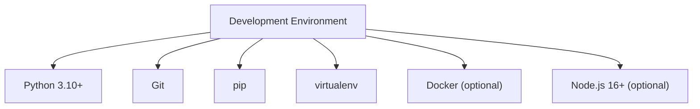
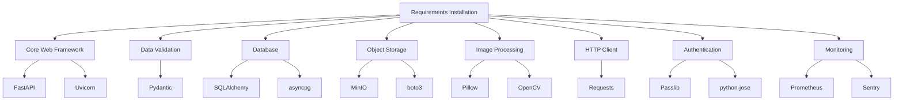
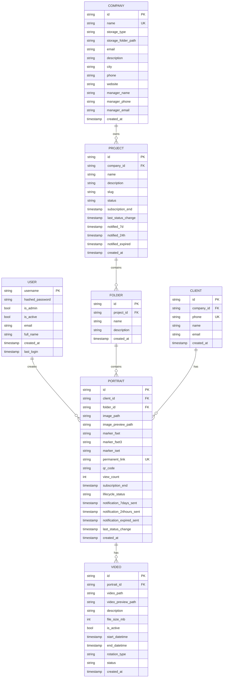
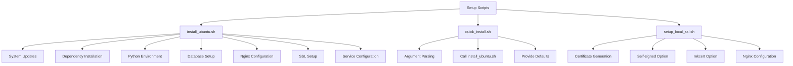
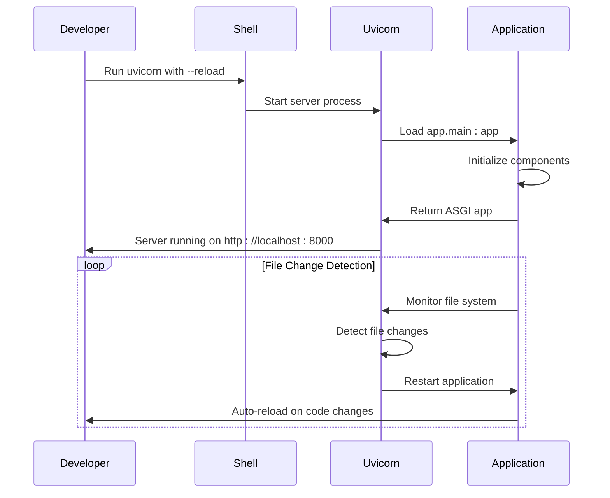

# Development Setup

<cite>
**Referenced Files in This Document**   
- [vertex-ar/README.md](file://vertex-ar/README.md)
- [docs/development/setup.md](file://docs/development/setup.md)
- [scripts/install_ubuntu.sh](file://scripts/install_ubuntu.sh)
- [scripts/quick_install.sh](file://scripts/quick_install.sh)
- [scripts/setup_local_ssl.sh](file://scripts/setup_local_ssl.sh)
- [vertex-ar/.env.example](file://vertex-ar/.env.example)
- [vertex-ar/requirements.txt](file://vertex-ar/requirements.txt)
- [vertex-ar/start.sh](file://vertex-ar/start.sh)
- [vertex-ar/app/main.py](file://vertex-ar/app/main.py)
- [vertex-ar/app/config.py](file://vertex-ar/app/config.py)
- [vertex-ar/app/database.py](file://vertex-ar/app/database.py)
</cite>

## Table of Contents
1. [Introduction](#introduction)
2. [Prerequisites](#prerequisites)
3. [Python Environment Setup](#python-environment-setup)
4. [Dependency Installation](#dependency-installation)
5. [Virtual Environment Configuration](#virtual-environment-configuration)
6. [Database Setup](#database-setup)
7. [Configuration and Environment Variables](#configuration-and-environment-variables)
8. [Setup Scripts](#setup-scripts)
9. [Local SSL Configuration](#local-ssl-configuration)
10. [Running the Application](#running-the-application)
11. [IDE and Debugging Setup](#ide-and-debugging-setup)
12. [Database Migrations](#database-migrations)
13. [Common Setup Issues](#common-setup-issues)
14. [Verification Steps](#verification-steps)
15. [Conclusion](#conclusion)

## Introduction

This document provides comprehensive instructions for setting up a local development environment for the AR backend application. The guide covers all essential aspects including Python dependency management, virtual environment configuration, database setup, SSL configuration, and application execution with hot reloading. The instructions are designed to help developers quickly establish a functional development environment with minimal configuration overhead.

The AR backend is built on FastAPI with Python 3.10+ and uses SQLite for local development. The application includes a comprehensive set of setup scripts to automate the installation process and ensure consistency across development environments. This document will guide you through each step of the setup process, from initial prerequisites to final verification.

**Section sources**
- [vertex-ar/README.md](file://vertex-ar/README.md#L1-L123)
- [docs/development/setup.md](file://docs/development/setup.md#L1-L800)

## Prerequisites

Before setting up the development environment, ensure your system meets the following requirements:

- **Python 3.10 or higher**: The application requires Python 3.10 or later for full compatibility with all dependencies.
- **Git**: Required for cloning the repository and managing version control.
- **pip**: Python's package installer, used for installing Python dependencies.
- **virtualenv**: For creating isolated Python environments (included with Python 3.3+).
- **Optional: Docker and Docker Compose**: For containerized development and testing.
- **Optional: Node.js 16+**: Required only if you plan to modify frontend assets.

The application has been tested on Ubuntu 20.04/22.04/24.04 LTS, but should work on any modern Linux distribution, macOS, and Windows with appropriate configuration.



**Diagram sources**
- [vertex-ar/README.md](file://vertex-ar/README.md#L108-L111)
- [docs/development/setup.md](file://docs/development/setup.md#L24-L28)

## Python Environment Setup

To set up the Python environment for the AR backend, follow these steps:

1. Clone the repository to your local machine:
```bash
git clone https://github.com/your-org/vertex-ar.git
cd vertex-ar
```

2. Create a virtual environment using Python's built-in venv module:
```bash
# Linux/macOS
python3 -m venv .venv

# Windows
python -m venv .venv
```

3. Activate the virtual environment:
```bash
# Linux/macOS
source .venv/bin/activate

# Windows
.venv\Scripts\activate
```

The virtual environment isolates the project's dependencies from your system-wide Python installation, preventing conflicts between different projects and ensuring consistent behavior across development environments.

**Section sources**
- [docs/development/setup.md](file://docs/development/setup.md#L41-L51)
- [vertex-ar/start.sh](file://vertex-ar/start.sh#L9-L13)

## Dependency Installation

After setting up the virtual environment, install the required Python dependencies:

1. Install production dependencies from requirements.txt:
```bash
pip install -r vertex-ar/requirements.txt
```

2. For development, install additional testing and development tools:
```bash
pip install pytest pytest-asyncio pytest-cov flake8 pylint mypy black isort httpx
```

The requirements.txt file contains all necessary packages for the application to run, including:
- FastAPI: Modern web framework for building APIs
- SQLAlchemy: Database toolkit and ORM
- Pydantic: Data validation and settings management
- Uvicorn: ASGI server for running the application
- MinIO: S3-compatible object storage client
- OpenCV: Computer vision library for AR functionality
- Pillow: Image processing library
- Requests: HTTP library for external API calls



**Diagram sources**
- [vertex-ar/requirements.txt](file://vertex-ar/requirements.txt#L1-L71)
- [docs/development/setup.md](file://docs/development/setup.md#L57-L60)

## Virtual Environment Configuration

Proper virtual environment configuration is crucial for maintaining a clean and isolated development environment. The AR backend uses a virtual environment to manage dependencies and prevent conflicts with other Python projects.

After creating and activating the virtual environment as described in the previous section, verify that it's working correctly:

1. Confirm the Python interpreter is using the virtual environment:
```bash
which python
# Should return path containing .venv
```

2. Verify pip is using the correct environment:
```bash
which pip
# Should return path containing .venv
```

3. Check the Python version:
```bash
python --version
# Should show Python 3.10 or higher
```

The virtual environment should be activated whenever working on the project. Consider adding an alias to your shell configuration file to simplify activation:

```bash
# Add to ~/.bashrc or ~/.zshrc
alias ardev='cd /path/to/vertex-ar && source .venv/bin/activate'
```

For IDE integration, configure your development environment to use the virtual environment's Python interpreter. This ensures that code completion, linting, and debugging use the correct dependencies.

**Section sources**
- [docs/development/setup.md](file://docs/development/setup.md#L41-L51)
- [vertex-ar/start.sh](file://vertex-ar/start.sh#L16)

## Database Setup

The AR backend uses SQLite for local development, with support for PostgreSQL in production environments. The database setup process is automated through the application's initialization routines.

To set up the database:

1. Ensure the storage directory structure exists:
```bash
mkdir -p vertex-ar/storage/{ar_content,nft-markers,qr-codes,temp,previews,images,videos}
```

2. The database will be automatically created when the application starts. The default configuration creates a SQLite database file named app_data.db in the application directory.

3. For manual database initialization, run:
```bash
python -c "from vertex-ar.app.database import Database; from vertex-ar.app.config import settings; db = Database(settings.DB_PATH)"
```

The database schema includes tables for users, AR content, clients, portraits, videos, companies, projects, and folders. The schema is automatically created and updated when the application starts, with migration scripts handling schema changes between versions.



**Diagram sources**
- [vertex-ar/app/database.py](file://vertex-ar/app/database.py#L87-L799)
- [vertex-ar/app/config.py](file://vertex-ar/app/config.py#L23-L24)

## Configuration and Environment Variables

Proper configuration is essential for the AR backend to function correctly. The application uses environment variables for configuration, with a template file provided for easy setup.

1. Create a .env file by copying the example:
```bash
cp vertex-ar/.env.example vertex-ar/.env
```

2. Edit the .env file to configure the application for your development environment. Key variables include:

| Variable | Description | Default Value |
|---------|-------------|---------------|
| DEBUG | Enable debug mode | True |
| SECRET_KEY | Secret key for JWT tokens | change-this-to-a-secure-random-key-in-production |
| APP_HOST | Host address to bind to | 0.0.0.0 |
| APP_PORT | Port to listen on | 8000 |
| BASE_URL | Base URL for the application | http://localhost:8000 |
| DATABASE_URL | Database connection string | sqlite:///./app_data.db |
| STORAGE_TYPE | Storage type (local or minio) | local |
| STORAGE_PATH | Local storage path | ./storage |
| MINIO_ENDPOINT | MinIO endpoint | localhost:9000 |
| MINIO_ACCESS_KEY | MinIO access key | minioadmin |
| MINIO_SECRET_KEY | MinIO secret key | minioadmin |
| MINIO_BUCKET | MinIO bucket name | vertex-ar |
| CORS_ORIGINS | Allowed CORS origins | * |

3. For development, minimal changes are needed. Ensure DEBUG=True and consider changing the SECRET_KEY for security.

The configuration system loads settings from the .env file and provides them to the application through the Settings class in app/config.py. The settings are validated and type-converted automatically.

**Section sources**
- [vertex-ar/.env.example](file://vertex-ar/.env.example#L1-L339)
- [vertex-ar/app/config.py](file://vertex-ar/app/config.py#L9-L244)

## Setup Scripts

The AR backend includes several setup scripts to automate the installation and configuration process:

### install_ubuntu.sh

The primary installation script for Ubuntu systems, supporting versions 20.04, 22.04, and 24.04 LTS. This script automates the entire installation process, including:

- System updates and dependency installation
- Python environment setup
- Database configuration
- Nginx and SSL setup
- Service configuration and startup

Usage:
```bash
# Make script executable
chmod +x scripts/install_ubuntu.sh

# Run with domain and email for SSL
sudo ./scripts/install_ubuntu.sh --domain example.com --email admin@example.com

# Run without SSL
sudo ./scripts/install_ubuntu.sh --no-ssl
```

### quick_install.sh

A simplified wrapper script that calls install_ubuntu.sh with appropriate parameters based on provided arguments. This script provides a quicker installation experience with sensible defaults.

Usage:
```bash
# With SSL
./scripts/quick_install.sh example.com admin@example.com

# Without SSL
./scripts/quick_install.sh
```

### setup_local_ssl.sh

Configures SSL certificates for local development using either self-signed certificates or mkcert for locally-trusted certificates.

Usage:
```bash
# Run the script
./scripts/setup_local_ssl.sh

# Choose between self-signed or mkcert
# Generated certificates will be in ./ssl directory
```

These scripts handle platform-specific considerations and ensure a consistent setup across different development environments.



**Diagram sources**
- [scripts/install_ubuntu.sh](file://scripts/install_ubuntu.sh#L1-L800)
- [scripts/quick_install.sh](file://scripts/quick_install.sh#L1-L75)
- [scripts/setup_local_ssl.sh](file://scripts/setup_local_ssl.sh#L1-L365)

## Local SSL Configuration

For local development with HTTPS, the AR backend provides the setup_local_ssl.sh script to configure SSL certificates. This is particularly useful for testing features that require secure contexts, such as certain browser APIs.

The script offers two methods for SSL certificate generation:

### Self-signed Certificates
- Automatically generated for localhost
- Browser will show security warnings
- Suitable for basic testing
- No additional software required

### mkcert (Locally-trusted Certificates)
- Creates certificates trusted by the local system
- No browser security warnings
- Requires mkcert installation
- More secure and realistic testing environment

To set up local SSL:

1. Run the setup script:
```bash
./scripts/setup_local_ssl.sh
```

2. Choose your preferred method (1 for self-signed, 2 for mkcert)

3. The script will generate:
   - Certificate (cert.pem) and private key (key.pem) in ./ssl directory
   - Nginx configuration (nginx.local.conf) for local development

4. Use the generated configuration with Docker:
```bash
docker-compose -f docker-compose.yml -f docker-compose.local.yml up
```

5. Access the application at https://localhost

The SSL configuration enables testing of secure features and ensures that the application behaves correctly in HTTPS environments, which is essential for production deployment.

**Section sources**
- [scripts/setup_local_ssl.sh](file://scripts/setup_local_ssl.sh#L1-L365)
- [vertex-ar/app/config.py](file://vertex-ar/app/config.py#L35-L38)

## Running the Application

Once the environment is set up, you can run the AR backend in development mode with hot reloading.

### Development Mode with Hot Reloading

The application can be started in development mode with automatic code reloading:

```bash
# Activate virtual environment
source .venv/bin/activate

# Navigate to application directory
cd vertex-ar

# Start with hot reloading
uvicorn app.main:app --reload --host 0.0.0.0 --port 8000
```

Alternatively, use the provided start.sh script:
```bash
# Make script executable
chmod +x start.sh

# Run the application
./start.sh
```

### Production Mode

For production-like testing, run without hot reloading:
```bash
uvicorn app.main:app --host 0.0.0.0 --port 8000
```

### Environment Variables for Development

Set these environment variables for optimal development experience:
```bash
export DEBUG=True
export RELOAD=True
export SHOW_ERROR_DETAILS=True
export CORS_ORIGINS="*"
```

The application will be available at http://localhost:8000, with the admin panel at /admin and API documentation at /docs.



**Diagram sources**
- [vertex-ar/start.sh](file://vertex-ar/start.sh#L62-L66)
- [vertex-ar/app/main.py](file://vertex-ar/app/main.py#L475-L476)
- [vertex-ar/.env.example](file://vertex-ar/.env.example#L308-L312)

## IDE and Debugging Setup

Proper IDE configuration enhances productivity and simplifies debugging. The following recommendations apply to popular Python IDEs:

### VS Code Configuration

1. Install recommended extensions:
   - Python
   - Pylance
   - Python Test Explorer
   - Docker (optional)

2. Create .vscode/settings.json:
```json
{
  "python.linting.enabled": true,
  "python.linting.pylintEnabled": true,
  "python.linting.flake8Enabled": true,
  "python.formatting.provider": "black",
  "python.testing.pytestEnabled": true,
  "python.testing.unittestEnabled": false,
  "editor.formatOnSave": true,
  "editor.codeActionsOnSave": {
    "source.organizeImports": true
  }
}
```

3. Configure debugger in .vscode/launch.json:
```json
{
  "version": "0.2.0",
  "configurations": [
    {
      "name": "Python: FastAPI",
      "type": "python",
      "request": "launch",
      "module": "uvicorn",
      "args": [
        "main:app",
        "--reload",
        "--host",
        "0.0.0.0",
        "--port",
        "8000"
      ],
      "jinja": true,
      "justMyCode": false
    }
  ]
}
```

### PyCharm Configuration

1. Set Python interpreter to the virtual environment (.venv)
2. Enable pytest as the default test runner
3. Configure code style to follow PEP 8
4. Enable type checking and linting

### Debugging Techniques

1. Use Python's built-in debugger:
```python
import pdb; pdb.set_trace()
# or in Python 3.7+
breakpoint()
```

2. Enable debug logging:
```python
import logging
logging.basicConfig(level=logging.DEBUG)
```

3. Use the interactive API documentation at /docs for testing endpoints.

**Section sources**
- [docs/development/setup.md](file://docs/development/setup.md#L123-L155)
- [vertex-ar/app/main.py](file://vertex-ar/app/main.py#L475-L476)

## Database Migrations

The AR backend handles database schema changes through automated migration scripts and schema evolution. The system uses a combination of explicit schema changes and automatic detection to maintain database integrity.

### Migration Process

1. Schema changes are implemented in the database.py file through ALTER TABLE statements wrapped in try-except blocks:
```python
try:
    self._connection.execute("ALTER TABLE ar_content ADD COLUMN image_preview_path TEXT")
except sqlite3.OperationalError:
    pass  # Column already exists
```

2. New tables are created with CREATE TABLE IF NOT EXISTS statements to prevent errors if the table already exists.

3. Data migration is handled within the schema alteration process, with appropriate default values and data transformation.

### Running Migrations

Migrations are automatically applied when the application starts. The database initialization process:
1. Creates the database file if it doesn't exist
2. Creates all required tables
3. Applies any pending schema alterations
4. Seeds default data (e.g., default company)

For manual migration verification:
```bash
# Check database schema
sqlite3 vertex-ar/app_data.db ".schema"
```

The migration system is designed to be non-destructive and backward compatible, ensuring that existing data is preserved during upgrades.

**Section sources**
- [vertex-ar/app/database.py](file://vertex-ar/app/database.py#L262-L602)
- [vertex-ar/app/database.py](file://vertex-ar/app/database.py#L87-L799)

## Common Setup Issues

This section addresses common issues encountered during environment setup and their solutions.

### Permission Errors

**Issue**: Script fails with permission denied errors.
**Solution**: Make scripts executable:
```bash
chmod +x scripts/*.sh
```

### Missing Dependencies

**Issue**: Python packages fail to install due to missing system dependencies.
**Solution**: Install required system packages:
```bash
# Ubuntu/Debian
sudo apt-get install build-essential python3-dev libmagic1 libffi-dev libssl-dev

# CentOS/RHEL
sudo yum install gcc python3-devel libmagic libffi-devel openssl-devel
```

### Port Conflicts

**Issue**: Application fails to start due to port already in use.
**Solution**: Change the port in .env file:
```bash
APP_PORT=8080
```

### Database Connection Issues

**Issue**: Database not found or connection errors.
**Solution**: Ensure the storage directory exists:
```bash
mkdir -p vertex-ar/storage
```

### SSL Certificate Errors

**Issue**: SSL setup fails with certificate errors.
**Solution**: Clear existing certificates and retry:
```bash
rm -rf ssl/
./scripts/setup_local_ssl.sh
```

### Virtual Environment Issues

**Issue**: Python packages installed but not found.
**Solution**: Ensure virtual environment is activated:
```bash
source .venv/bin/activate
```

These common issues and their solutions should help resolve most setup problems encountered during development environment configuration.

**Section sources**
- [scripts/install_ubuntu.sh](file://scripts/install_ubuntu.sh#L247-L263)
- [scripts/setup_local_ssl.sh](file://scripts/setup_local_ssl.sh#L348-L360)
- [vertex-ar/start.sh](file://vertex-ar/start.sh#L9-L13)

## Verification Steps

After completing the setup, verify that the development environment is functioning correctly:

1. **Check Application Startup**:
```bash
uvicorn app.main:app --reload
```
Verify the server starts without errors and displays the startup message.

2. **Access the Application**:
Open http://localhost:8000 in your browser. You should see the application homepage.

3. **Verify API Documentation**:
Navigate to http://localhost:8000/docs to access the interactive API documentation.

4. **Check Admin Panel**:
Access http://localhost:8000/admin and verify the login page loads.

5. **Test Database Connection**:
```bash
# Check if database file was created
ls -la vertex-ar/app_data.db

# Verify database schema
sqlite3 vertex-ar/app_data.db ".tables"
```

6. **Run Tests**:
```bash
# Run unit tests
pytest vertex-ar/tests/

# Run integration tests
pytest test_files/integration/
```

7. **Verify SSL Setup** (if configured):
Access https://localhost and confirm the connection is secure (no browser warnings if using mkcert).

8. **Check Background Services**:
Verify that background tasks like monitoring and email queue are starting correctly by checking the application logs.

Successful completion of these verification steps confirms that your development environment is properly configured and ready for development work.

**Section sources**
- [vertex-ar/app/main.py](file://vertex-ar/app/main.py#L210-L211)
- [vertex-ar/main.py](file://vertex-ar/main.py#L13-L19)
- [test_files/run_tests.sh](file://test_files/run_tests.sh)

## Conclusion

This document has provided a comprehensive guide for setting up a local development environment for the AR backend. The setup process covers all essential components including Python environment configuration, dependency management, database setup, SSL configuration, and application execution.

The AR backend is designed to be developer-friendly with automated setup scripts and clear configuration patterns. By following the steps outlined in this document, you should have a fully functional development environment capable of supporting all development activities.

Key takeaways:
- Use virtual environments to isolate dependencies
- Leverage the provided setup scripts to automate installation
- Configure environment variables appropriately for development
- Utilize hot reloading during development for faster iteration
- Verify the setup with the provided verification steps

With the development environment properly configured, you can begin contributing to the AR backend application, implementing new features, and fixing issues.

**Section sources**
- [vertex-ar/README.md](file://vertex-ar/README.md#L1-L123)
- [docs/development/setup.md](file://docs/development/setup.md#L1-L800)
- [scripts/install_ubuntu.sh](file://scripts/install_ubuntu.sh#L1-L800)