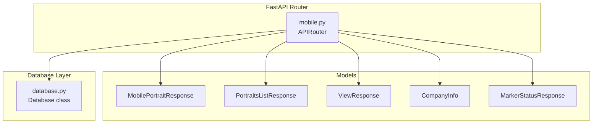
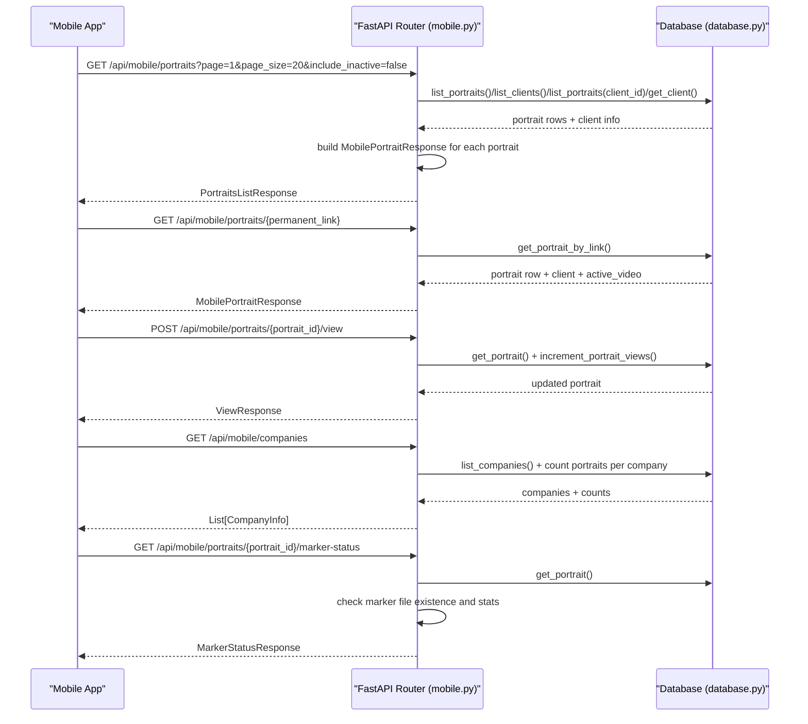
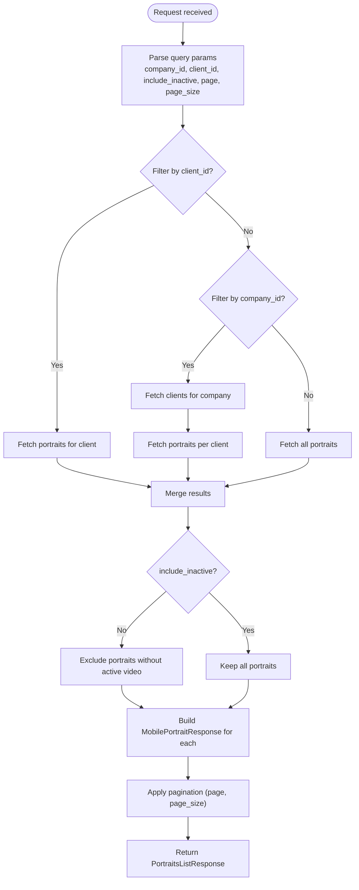
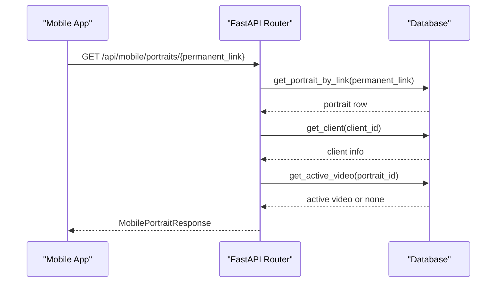
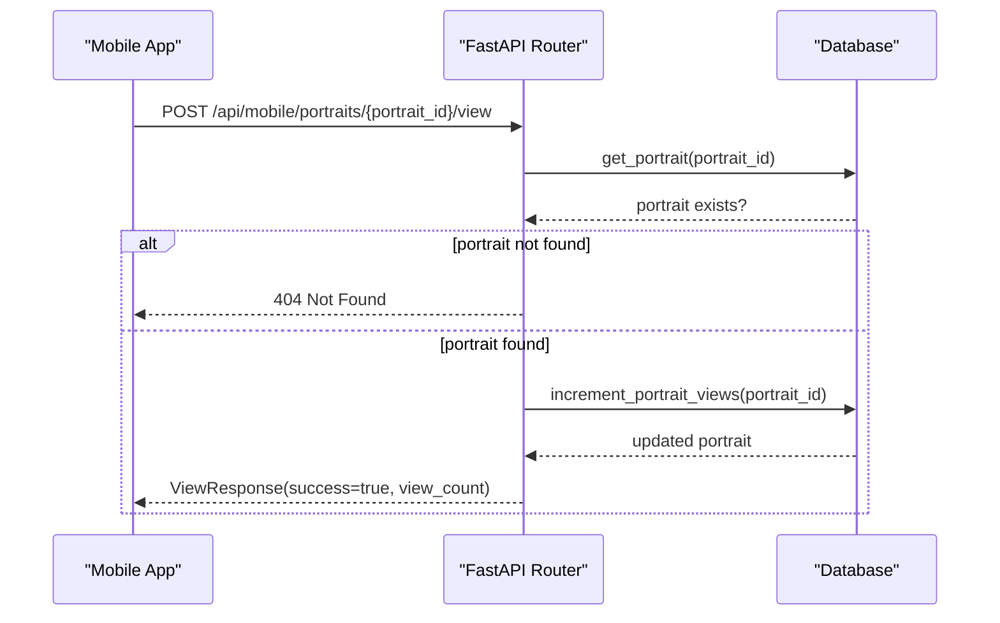
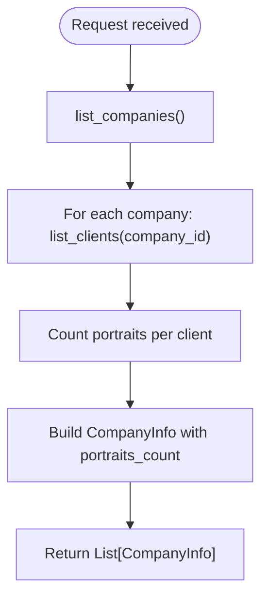
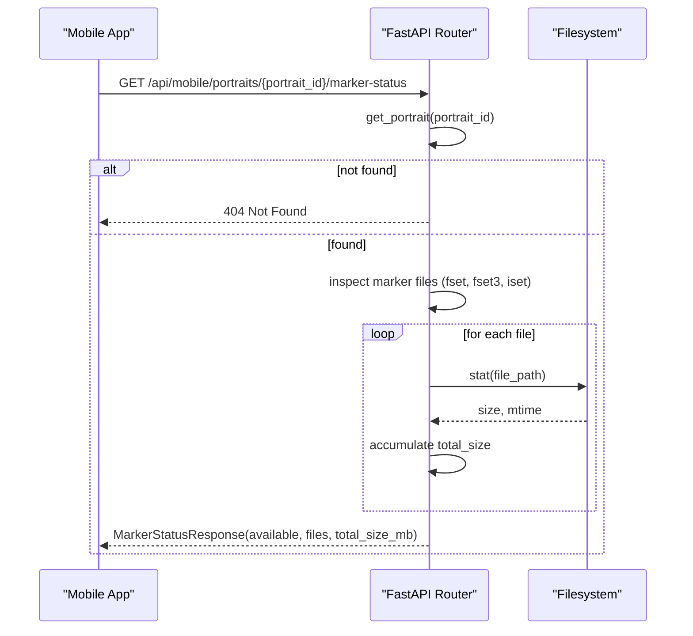
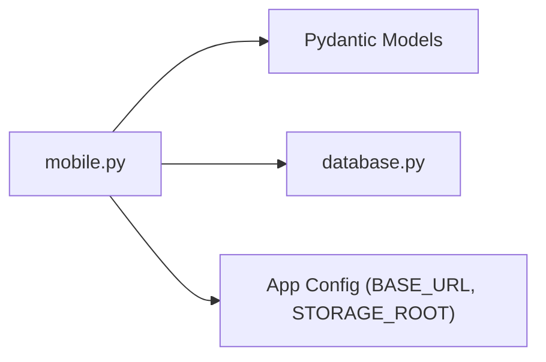

# API Endpoints

<cite>
**Referenced Files in This Document**
- [mobile.py](file://vertex-ar/app/api/mobile.py)
- [mobile-api-schema.json](file://docs/api/mobile-api-schema.json)
- [mobile-examples.md](file://docs/api/mobile-examples.md)
- [ar-implementation.md](file://docs/mobile/ar-implementation.md)
- [app-guide.md](file://docs/mobile/app-guide.md)
- [database.py](file://vertex-ar/app/database.py)
</cite>

## Table of Contents
1. [Introduction](#introduction)
2. [Project Structure](#project-structure)
3. [Core Components](#core-components)
4. [Architecture Overview](#architecture-overview)
5. [Detailed Component Analysis](#detailed-component-analysis)
6. [Dependency Analysis](#dependency-analysis)
7. [Performance Considerations](#performance-considerations)
8. [Troubleshooting Guide](#troubleshooting-guide)
9. [Conclusion](#conclusion)

## Introduction
This document provides detailed API documentation for all mobile-specific endpoints exposed by the backend. It covers:
- GET /api/mobile/portraits: portrait listing with filtering and pagination
- GET /api/mobile/portraits/{permanent_link}: public portrait access via permanent link
- POST /api/mobile/portraits/{portrait_id}/view: view tracking for analytics
- GET /api/mobile/companies: company listing with portrait counts
- GET /api/mobile/portraits/{portrait_id}/marker-status: NFT marker status checking

It explains the purpose, request parameters, response schemas, examples, error handling, and performance considerations tailored for mobile networks.

## Project Structure
The mobile endpoints are implemented in a FastAPI router module and backed by a SQLite-based database abstraction. The endpoints are grouped under the mobile namespace and return optimized payloads for mobile AR viewing.

**Diagram sources**
- [mobile.py](file://vertex-ar/app/api/mobile.py#L1-L120)
- [database.py](file://vertex-ar/app/database.py#L1-L120)

**Section sources**
- [mobile.py](file://vertex-ar/app/api/mobile.py#L1-L120)
- [database.py](file://vertex-ar/app/database.py#L1-L120)

## Core Components
- MobilePortraitResponse: Optimized portrait payload for mobile AR, including image URLs, marker URLs, optional active video, QR code, view count, and created timestamp.
- PortraitsListResponse: Paginated list containing portraits, total count, page, and page size.
- ViewResponse: Tracks successful view recording and updated view count.
- CompanyInfo: Company metadata with portrait count.
- MarkerStatusResponse: Availability and file metadata for NFT marker files.

These models define the shape of responses and are used by the endpoints to serialize data for mobile consumption.

**Section sources**
- [mobile.py](file://vertex-ar/app/api/mobile.py#L94-L140)

## Architecture Overview
The mobile endpoints are implemented as FastAPI routes under a dedicated router. They rely on a shared database abstraction to fetch and update data. The router builds optimized responses by constructing URLs for images, videos, and NFT markers based on configuration and storage roots.

**Diagram sources**
- [mobile.py](file://vertex-ar/app/api/mobile.py#L215-L500)
- [database.py](file://vertex-ar/app/database.py#L1-L200)

## Detailed Component Analysis

### GET /api/mobile/portraits
- Purpose: Retrieve a paginated list of portraits optimized for mobile AR. Supports filtering by company_id or client_id and inclusion of portraits without active video.
- Authentication: Requires a valid bearer token.
- URL: /api/mobile/portraits
- Query parameters:
  - company_id (string, optional): Filter by company ID.
  - client_id (string, optional): Filter by client ID.
  - include_inactive (boolean, default false): Include portraits without active video.
  - page (integer, default 1, min 1)
  - page_size (integer, default 20, min 1, max 100)
- Response: PortraitsListResponse
  - portraits: List of MobilePortraitResponse
  - total: integer
  - page: integer
  - page_size: integer
- Example request:
  - GET /api/mobile/portraits?company_id=COMPANY_ID&page=1&page_size=20&include_inactive=false
- Example response:
  - 200 OK with PortraitsListResponse
- Error handling:
  - 401 Unauthorized if missing/invalid token.
  - 422 Unprocessable Entity for invalid parameters.
  - 500 Internal Server Error if internal failure occurs while building responses.

**Diagram sources**
- [mobile.py](file://vertex-ar/app/api/mobile.py#L215-L302)

**Section sources**
- [mobile.py](file://vertex-ar/app/api/mobile.py#L215-L302)
- [mobile-api-schema.json](file://docs/api/mobile-api-schema.json#L47-L69)
- [mobile-examples.md](file://docs/api/mobile-examples.md#L75-L138)
- [ar-implementation.md](file://docs/mobile/ar-implementation.md#L14-L19)

### GET /api/mobile/portraits/{permanent_link}
- Purpose: Public endpoint to fetch a specific portrait by its permanent link. Used for direct access via QR codes.
- Authentication: Not required.
- URL: /api/mobile/portraits/{permanent_link}
- Path parameters:
  - permanent_link (string): Unique permanent link for a portrait.
- Response: MobilePortraitResponse
- Example request:
  - GET /api/mobile/portraits/portrait_abcd1234
- Example response:
  - 200 OK with MobilePortraitResponse
- Error handling:
  - 404 Not Found if portrait not found.

**Diagram sources**
- [mobile.py](file://vertex-ar/app/api/mobile.py#L305-L349)

**Section sources**
- [mobile.py](file://vertex-ar/app/api/mobile.py#L305-L349)
- [mobile-examples.md](file://docs/api/mobile-examples.md#L141-L175)
- [app-guide.md](file://docs/mobile/app-guide.md#L36-L48)

### POST /api/mobile/portraits/{portrait_id}/view
- Purpose: Track portrait view events for analytics. Increments view count and records device/AR information.
- Authentication: Not required.
- URL: /api/mobile/portraits/{portrait_id}/view
- Path parameters:
  - portrait_id (string): Portrait identifier.
- Request body: PortraitViewRequest
  - timestamp (string): ISO 8601 timestamp.
  - duration_seconds (integer): Non-negative view duration in seconds.
  - device_info (DeviceInfo): Device platform, OS version, app version, optional model.
  - ar_info (ARInfo, optional): AR scanning metrics (scan_time_ms, fps_average, marker_lost_count).
  - session_id (string, optional): Unique session identifier.
- Response: ViewResponse
  - success (boolean)
  - view_count (integer): Updated portrait view count.
- Example request:
  - POST /api/mobile/portraits/{portrait_id}/view
  - Body: PortraitViewRequest
- Example response:
  - 200 OK with ViewResponse
- Error handling:
  - 404 Not Found if portrait does not exist.
  - 500 Internal Server Error if view increment fails.

**Diagram sources**
- [mobile.py](file://vertex-ar/app/api/mobile.py#L351-L401)

**Section sources**
- [mobile.py](file://vertex-ar/app/api/mobile.py#L53-L60)
- [mobile.py](file://vertex-ar/app/api/mobile.py#L351-L401)
- [mobile-examples.md](file://docs/api/mobile-examples.md#L179-L200)

### GET /api/mobile/companies
- Purpose: Provide a list of companies along with the total number of portraits associated with each company. Used for company selection in the mobile app.
- Authentication: Requires a valid bearer token.
- URL: /api/mobile/companies
- Response: List of CompanyInfo
  - id (string)
  - name (string)
  - portraits_count (integer)
  - created_at (string)
- Example request:
  - GET /api/mobile/companies
- Example response:
  - 200 OK with List[CompanyInfo]
- Error handling:
  - 401 Unauthorized if missing/invalid token.

**Diagram sources**
- [mobile.py](file://vertex-ar/app/api/mobile.py#L403-L437)

**Section sources**
- [mobile.py](file://vertex-ar/app/api/mobile.py#L121-L127)
- [mobile.py](file://vertex-ar/app/api/mobile.py#L403-L437)
- [mobile-examples.md](file://docs/api/mobile-examples.md#L840-L857)

### GET /api/mobile/portraits/{portrait_id}/marker-status
- Purpose: Check availability and metadata of NFT marker files for a given portrait. Returns whether all files are present and their sizes/timestamps for caching decisions.
- Authentication: Requires a valid bearer token.
- URL: /api/mobile/portraits/{portrait_id}/marker-status
- Path parameters:
  - portrait_id (string): Portrait identifier.
- Response: MarkerStatusResponse
  - available (boolean): True if all three marker files exist and are readable.
  - files (Dict[string, MarkerStatusFile]): Keys are "fset", "fset3", "iset".
  - total_size_mb (float): Sum of file sizes in MB.
- MarkerStatusFile:
  - size (integer): File size in bytes.
  - updated_at (string): Last modified timestamp (ISO 8601).
- Example request:
  - GET /api/mobile/portraits/{portrait_id}/marker-status
- Example response:
  - 200 OK with MarkerStatusResponse
- Error handling:
  - 404 Not Found if portrait does not exist.

**Diagram sources**
- [mobile.py](file://vertex-ar/app/api/mobile.py#L439-L499)

**Section sources**
- [mobile.py](file://vertex-ar/app/api/mobile.py#L129-L140)
- [mobile.py](file://vertex-ar/app/api/mobile.py#L439-L499)
- [mobile-api-schema.json](file://docs/api/mobile-api-schema.json#L436-L453)

## Dependency Analysis
- Router-to-models: The router defines Pydantic models for request/response bodies and uses them in route signatures.
- Router-to-database: Routes call database methods to fetch portraits, clients, videos, and companies; they also update view counts.
- Router-to-configuration: The router reads base URL and storage root from application state to construct resource URLs.

**Diagram sources**
- [mobile.py](file://vertex-ar/app/api/mobile.py#L215-L500)
- [database.py](file://vertex-ar/app/database.py#L1-L120)

**Section sources**
- [mobile.py](file://vertex-ar/app/api/mobile.py#L215-L500)
- [database.py](file://vertex-ar/app/database.py#L1-L120)

## Performance Considerations
- Pagination defaults and limits:
  - Default page_size is 20 items per page.
  - Maximum page_size is 100 items per page.
  - These defaults help reduce payload size and improve responsiveness on mobile networks.
- Minimal payloads:
  - Responses include only essential fields for AR viewing (image URLs, marker URLs, optional active video, QR code, view count).
- Caching-friendly metadata:
  - Marker status endpoint returns file sizes and timestamps to support efficient caching and offline preparation.
- Network resilience:
  - Use exponential backoff and retry strategies for transient failures.
  - Implement request timeouts appropriate for mobile networks.

[No sources needed since this section provides general guidance]

## Troubleshooting Guide
- Authentication errors:
  - 401 Unauthorized: Ensure a valid bearer token is included in Authorization header.
- Validation errors:
  - 422 Unprocessable Entity: Verify query parameters (page, page_size, include_inactive) meet constraints.
- Resource not found:
  - 404 Not Found: Occurs when portrait, client, or company does not exist. Confirm IDs and links.
- Internal server errors:
  - 500 Internal Server Error: Indicates backend failure while building responses or updating view counts. Retry after a short delay.
- Marker file issues:
  - MarkerStatusResponse.available may be false if files are missing or unreadable. Verify storage paths and permissions.

**Section sources**
- [mobile.py](file://vertex-ar/app/api/mobile.py#L321-L349)
- [mobile.py](file://vertex-ar/app/api/mobile.py#L371-L401)
- [mobile.py](file://vertex-ar/app/api/mobile.py#L456-L499)

## Conclusion
The mobile API provides a focused set of endpoints optimized for AR portrait browsing and analytics on constrained networks. By leveraging pagination, minimal payloads, and explicit marker status checks, the system supports efficient mobile experiences. The documented models and error handling patterns enable robust client-side implementations.