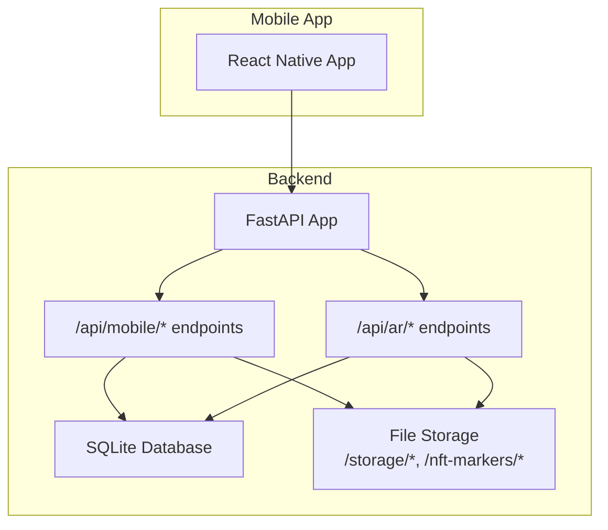
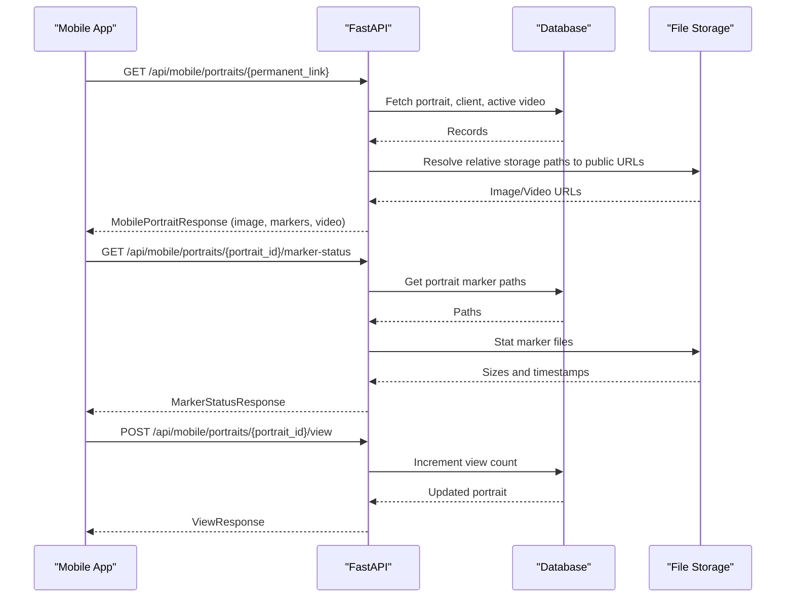
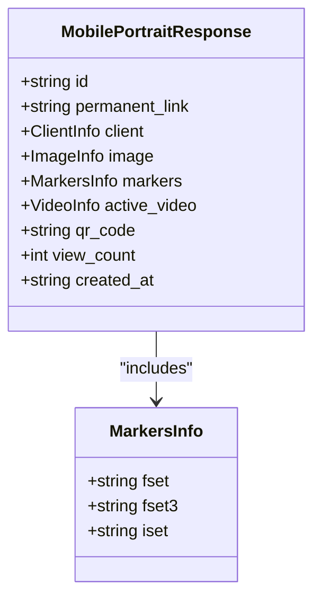
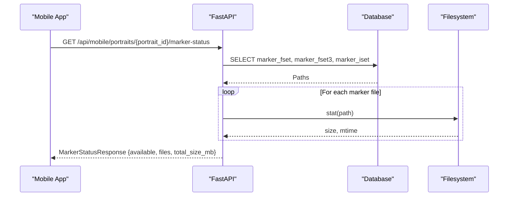
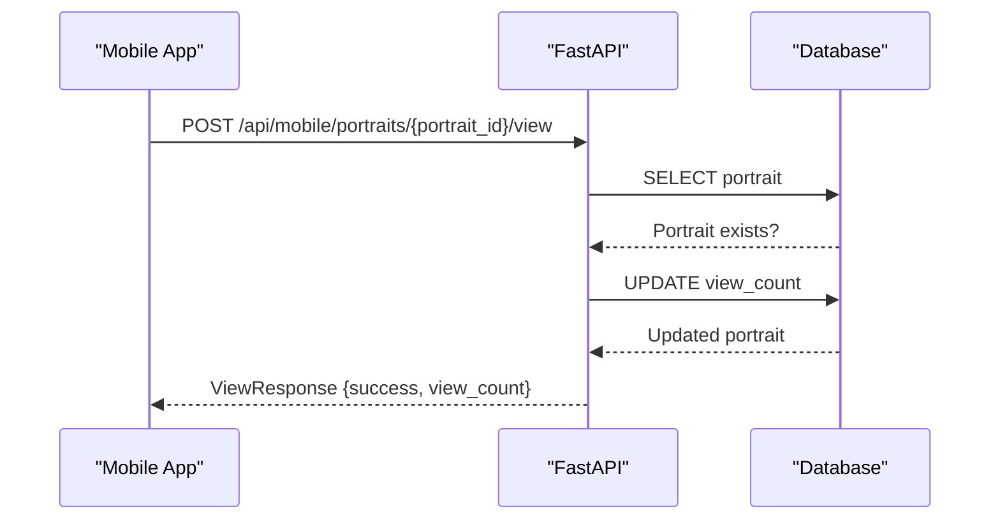
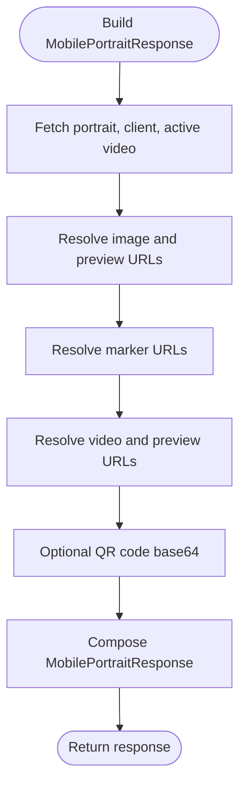
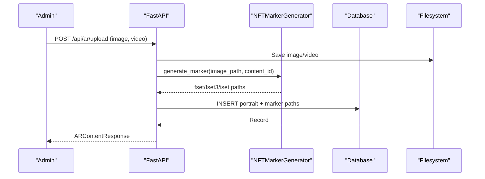
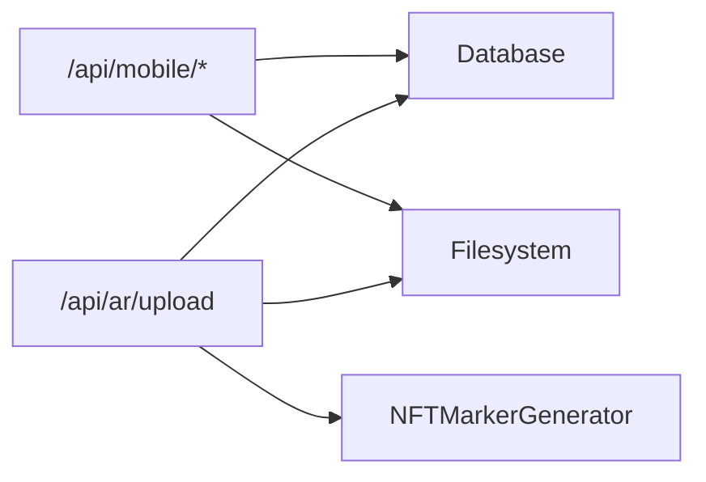

# AR Integration

<cite>
**Referenced Files in This Document**
- [mobile.py](file://vertex-ar/app/api/mobile.py)
- [ar.py](file://vertex-ar/app/api/ar.py)
- [nft_marker_generator.py](file://vertex-ar/nft_marker_generator.py)
- [nft_maker.py](file://vertex-ar/nft_maker.py)
- [database.py](file://vertex-ar/app/database.py)
- [mobile-data-flow.md](file://docs/api/mobile-data-flow.md)
- [mobile-examples.md](file://docs/api/mobile-examples.md)
- [mobile-rn-requirements.md](file://docs/api/mobile-rn-requirements.md)
- [app-guide.md](file://docs/mobile/app-guide.md)
- [storage.py](file://vertex-ar/app/storage.py)
</cite>

## Table of Contents
1. [Introduction](#introduction)
2. [Project Structure](#project-structure)
3. [Core Components](#core-components)
4. [Architecture Overview](#architecture-overview)
5. [Detailed Component Analysis](#detailed-component-analysis)
6. [Dependency Analysis](#dependency-analysis)
7. [Performance Considerations](#performance-considerations)
8. [Troubleshooting Guide](#troubleshooting-guide)
9. [Conclusion](#conclusion)
10. [Appendices](#appendices)

## Introduction
This document explains the AR integration between mobile applications and the backend focused on:
- Delivering NFT marker files (.fset, .fset3, .iset) via the MarkersInfo model and the /nft-markers/{portrait_id} endpoints.
- Enabling mobile apps to check marker file availability and sizes using the marker status endpoint.
- Capturing AR session analytics through the portrait view tracking endpoint.
- Optimizing data delivery for AR viewing by bundling all necessary assets (image, markers, video) in the MobilePortraitResponse.
- Guidance on implementing marker caching, offline operation support, and handling marker generation delays.
- Performance optimization tips for AR rendering and network usage.

## Project Structure
The AR integration spans several modules:
- Mobile API endpoints and models for AR viewing and analytics.
- NFT marker generation pipeline for .fset, .fset3, and .iset files.
- Database schema for portraits, markers, and videos.
- Storage abstraction and provisioning helpers.
- Documentation covering data flow, examples, and requirements.

**Diagram sources**
- [mobile-data-flow.md](file://docs/api/mobile-data-flow.md#L5-L64)
- [mobile.py](file://vertex-ar/app/api/mobile.py#L142-L213)
- [ar.py](file://vertex-ar/app/api/ar.py#L42-L158)

**Section sources**
- [mobile-data-flow.md](file://docs/api/mobile-data-flow.md#L5-L64)

## Core Components
- MobilePortraitResponse: Bundles image, markers, active video, client info, QR code, and metadata for AR viewing.
- MarkersInfo: Provides URLs for .fset, .fset3, and .iset marker files.
- MarkerStatusResponse: Reports availability and sizes of marker files for cache management.
- PortraitViewRequest: Carries AR session analytics (scan_time_ms, fps_average, marker_lost_count) and device info.
- NFTMarkerGenerator: Generates .fset, .fset3, and .iset files from images with caching and analysis.

**Section sources**
- [mobile.py](file://vertex-ar/app/api/mobile.py#L62-L113)
- [mobile.py](file://vertex-ar/app/api/mobile.py#L129-L140)
- [mobile.py](file://vertex-ar/app/api/mobile.py#L351-L390)
- [nft_marker_generator.py](file://vertex-ar/nft_marker_generator.py#L45-L80)

## Architecture Overview
The mobile AR workflow integrates:
- Mobile app requests portrait data and marker status.
- Backend builds URLs for image, markers, and video.
- Marker status endpoint checks file existence and sizes.
- Analytics endpoint tracks AR session metrics and increments view counts.

**Diagram sources**
- [mobile.py](file://vertex-ar/app/api/mobile.py#L142-L213)
- [mobile.py](file://vertex-ar/app/api/mobile.py#L351-L390)
- [mobile.py](file://vertex-ar/app/api/mobile.py#L439-L499)
- [database.py](file://vertex-ar/app/database.py#L180-L209)

## Detailed Component Analysis

### NFT Marker Delivery via MarkersInfo
- The backend constructs marker URLs under /nft-markers/{portrait_id}/{portrait_id}.fset, .fset3, .iset.
- These URLs are included in MobilePortraitResponse.markers to deliver all AR assets in one payload.

**Diagram sources**
- [mobile.py](file://vertex-ar/app/api/mobile.py#L70-L105)
- [mobile.py](file://vertex-ar/app/api/mobile.py#L160-L166)

**Section sources**
- [mobile.py](file://vertex-ar/app/api/mobile.py#L142-L213)

### Marker Status Endpoint
- The endpoint checks the presence and sizes of marker files and returns a consolidated status.
- It computes total size in MB and indicates availability when all three files exist.

**Diagram sources**
- [mobile.py](file://vertex-ar/app/api/mobile.py#L439-L499)

**Section sources**
- [mobile.py](file://vertex-ar/app/api/mobile.py#L439-L499)

### Portrait View Tracking and AR Analytics
- The view tracking endpoint increments the portrait’s view count and logs analytics.
- The request model includes AR session metrics (scan_time_ms, fps_average, marker_lost_count) and device info.

**Diagram sources**
- [mobile.py](file://vertex-ar/app/api/mobile.py#L351-L390)

**Section sources**
- [mobile.py](file://vertex-ar/app/api/mobile.py#L351-L390)
- [mobile-examples.md](file://docs/api/mobile-examples.md#L179-L240)
- [app-guide.md](file://docs/mobile/app-guide.md#L210-L239)

### MobilePortraitResponse Bundling
- The backend builds a single response containing:
  - Image URL and optional preview URL.
  - Marker URLs (.fset, .fset3, .iset).
  - Active video URL, preview URL, description, file size, duration.
  - Client info, QR code (base64), view count, created timestamp.

**Diagram sources**
- [mobile.py](file://vertex-ar/app/api/mobile.py#L142-L213)

**Section sources**
- [mobile.py](file://vertex-ar/app/api/mobile.py#L142-L213)

### NFT Marker Generation Pipeline
- Admin uploads image and video to create AR content.
- The backend generates .fset, .fset3, and .iset using NFTMarkerGenerator.
- Generated marker paths are stored in the database for later retrieval by mobile clients.

**Diagram sources**
- [ar.py](file://vertex-ar/app/api/ar.py#L42-L158)
- [nft_marker_generator.py](file://vertex-ar/nft_marker_generator.py#L603-L663)
- [database.py](file://vertex-ar/app/database.py#L180-L209)

**Section sources**
- [ar.py](file://vertex-ar/app/api/ar.py#L42-L158)
- [nft_marker_generator.py](file://vertex-ar/nft_marker_generator.py#L211-L256)
- [nft_marker_generator.py](file://vertex-ar/nft_marker_generator.py#L603-L663)
- [database.py](file://vertex-ar/app/database.py#L180-L209)

## Dependency Analysis
- Mobile API depends on:
  - Database for portrait, client, and video records.
  - Storage root and base URL to construct public URLs for image, video, and markers.
- Marker status endpoint depends on filesystem stats for marker files.
- Admin AR upload endpoint depends on NFTMarkerGenerator and database schema for AR content.

**Diagram sources**
- [mobile.py](file://vertex-ar/app/api/mobile.py#L142-L213)
- [ar.py](file://vertex-ar/app/api/ar.py#L42-L158)
- [nft_marker_generator.py](file://vertex-ar/nft_marker_generator.py#L211-L256)

**Section sources**
- [mobile.py](file://vertex-ar/app/api/mobile.py#L142-L213)
- [ar.py](file://vertex-ar/app/api/ar.py#L42-L158)
- [nft_marker_generator.py](file://vertex-ar/nft_marker_generator.py#L211-L256)

## Performance Considerations
- Bundle assets in MobilePortraitResponse to minimize round-trips.
- Use marker status endpoint to pre-check availability and sizes before downloading markers.
- Implement client-side caching for images, videos, and markers with ETag/Last-Modified checks.
- Prefer HEAD requests to probe content length and last-modified headers for efficient caching.
- Optimize video delivery by providing preview thumbnails and durations for adaptive playback.
- Monitor slow queries and consider indexing strategies for portrait and video lookups.

[No sources needed since this section provides general guidance]

## Troubleshooting Guide
- Marker files missing:
  - Verify marker status endpoint returns available=true and files populated.
  - Confirm filesystem paths exist and are readable.
- Marker generation delays:
  - Use the admin endpoint to regenerate markers when needed.
  - Implement retry/backoff logic in the mobile app.
- View tracking failures:
  - Ensure portrait exists before sending view events.
  - Queue offline events and retry when connectivity is restored.
- Storage configuration:
  - Ensure STORAGE_ROOT and BASE_URL are configured correctly.
  - Confirm storage adapter supports public URL generation for /storage and /nft-markers routes.

**Section sources**
- [mobile.py](file://vertex-ar/app/api/mobile.py#L439-L499)
- [mobile-examples.md](file://docs/api/mobile-examples.md#L179-L240)
- [mobile-rn-requirements.md](file://docs/api/mobile-rn-requirements.md#L433-L453)

## Conclusion
The backend provides a cohesive AR integration for mobile apps:
- MobilePortraitResponse bundles all AR assets for streamlined delivery.
- MarkersInfo exposes URLs for .fset, .fset3, and .iset files.
- Marker status endpoint enables cache-aware downloads.
- View tracking captures AR session analytics and increments view counts.
- Admin endpoints generate NFT markers reliably, with robust error handling and logging.

[No sources needed since this section summarizes without analyzing specific files]

## Appendices

### API Reference Highlights
- Marker status endpoint:
  - GET /api/mobile/portraits/{portrait_id}/marker-status
  - Returns MarkerStatusResponse with available flag, per-file size and updated_at, and total_size_mb.
- View tracking endpoint:
  - POST /api/mobile/portraits/{portrait_id}/view
  - Accepts PortraitViewRequest with AR analytics and device info; returns ViewResponse with success and updated view_count.

**Section sources**
- [mobile.py](file://vertex-ar/app/api/mobile.py#L439-L499)
- [mobile.py](file://vertex-ar/app/api/mobile.py#L351-L390)
- [mobile-rn-requirements.md](file://docs/api/mobile-rn-requirements.md#L433-L453)

### Implementation Guidance
- Implement marker caching:
  - Use marker status to compute total size and decide whether to download.
  - Store markers locally with versioning and periodic revalidation.
- Offline operation:
  - Queue view events and sync when online.
  - Cache images and videos with ETag/Last-Modified checks.
- Handling marker generation delays:
  - Poll marker status until available.
  - Show user feedback and retry with exponential backoff.

**Section sources**
- [mobile-examples.md](file://docs/api/mobile-examples.md#L179-L240)
- [mobile-examples.md](file://docs/api/mobile-examples.md#L366-L397)