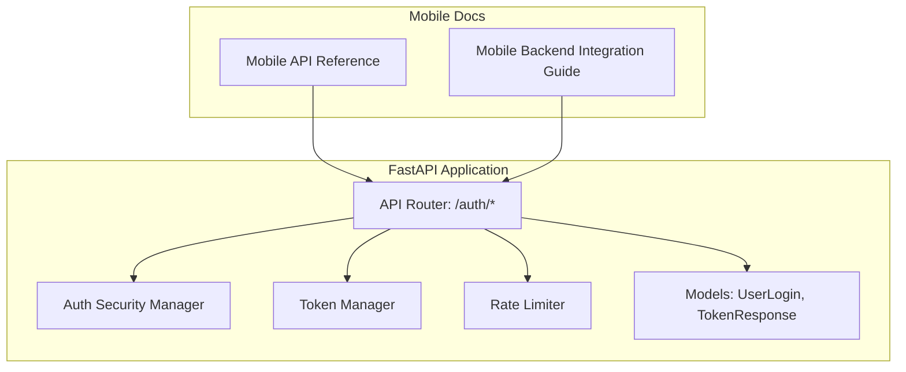
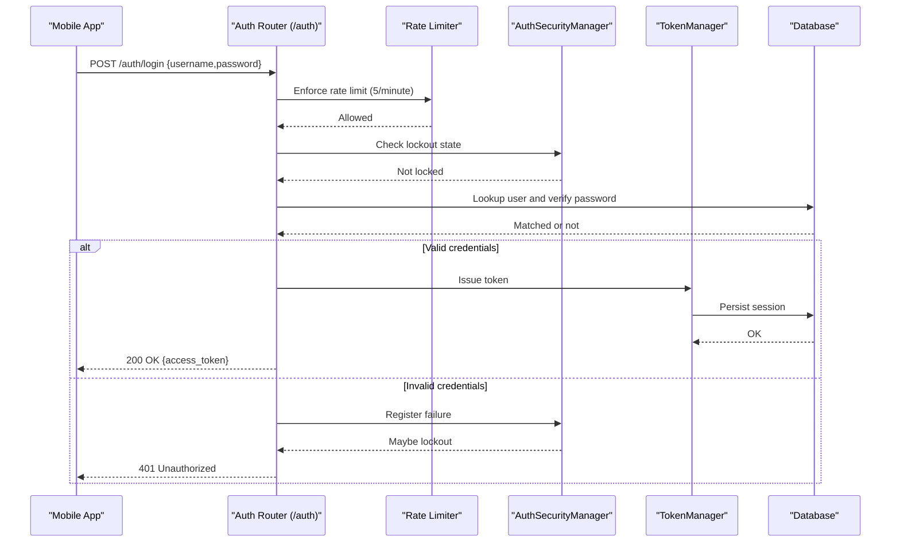
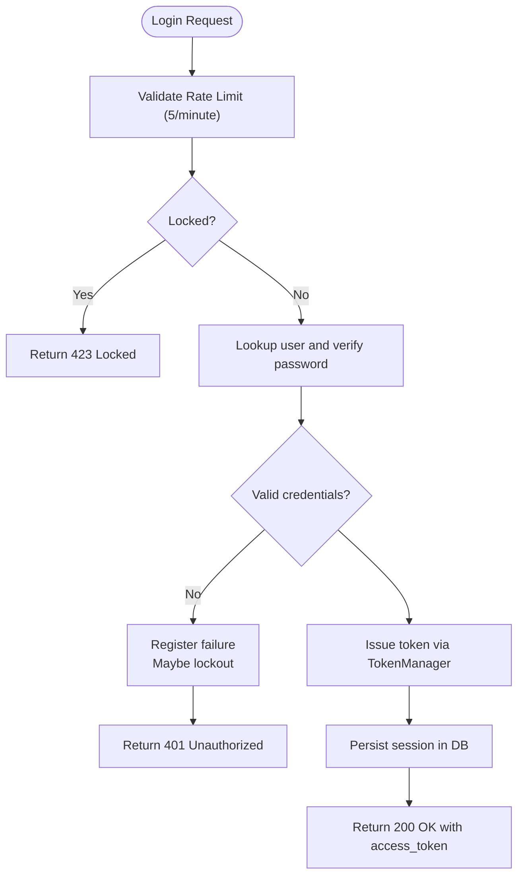
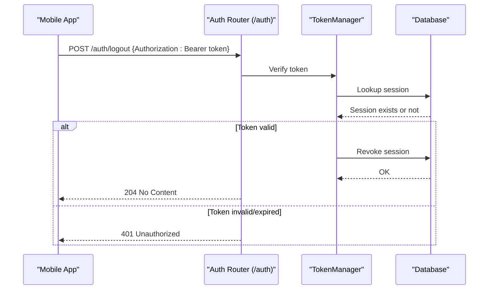
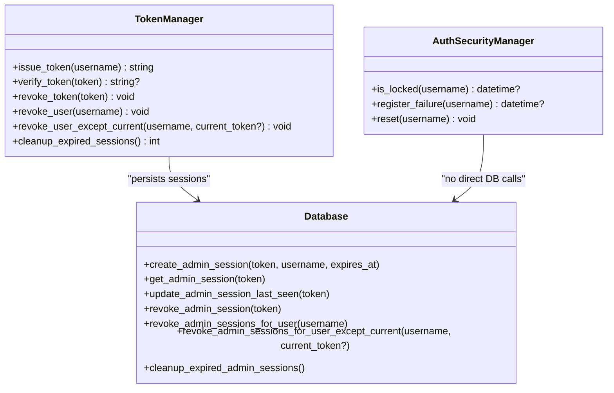
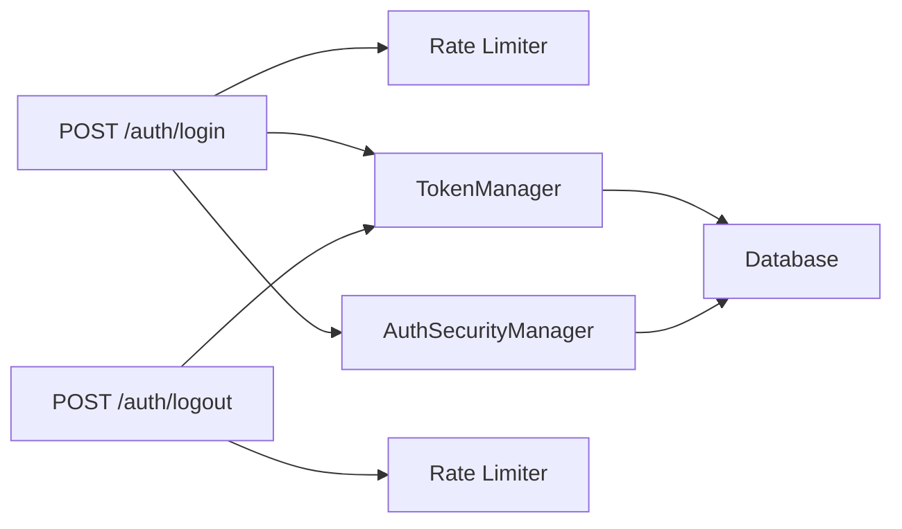

# Authentication

<cite>
**Referenced Files in This Document**
- [auth.py](file://vertex-ar/app/api/auth.py)
- [models.py](file://vertex-ar/app/models.py)
- [auth.py](file://vertex-ar/app/auth.py)
- [rate_limiter.py](file://vertex-ar/app/rate_limiter.py)
- [config.py](file://vertex-ar/app/config.py)
- [api-reference.md](file://docs/mobile/api-reference.md)
- [backend-integration.md](file://docs/mobile/backend-integration.md)
- [test_api.py](file://test_files/unit/test_api.py)
</cite>

## Table of Contents
1. [Introduction](#introduction)
2. [Project Structure](#project-structure)
3. [Core Components](#core-components)
4. [Architecture Overview](#architecture-overview)
5. [Detailed Component Analysis](#detailed-component-analysis)
6. [Dependency Analysis](#dependency-analysis)
7. [Performance Considerations](#performance-considerations)
8. [Troubleshooting Guide](#troubleshooting-guide)
9. [Conclusion](#conclusion)

## Introduction
This document provides comprehensive API documentation for mobile authentication endpoints focused on:
- POST /auth/login
- POST /auth/logout

It covers HTTP methods, URL patterns, request/response schemas, authentication methods, JWT-based authentication flow, token expiration behavior, and secure storage recommendations for mobile platforms. It also includes implementation guidance for Swift, Kotlin, and TypeScript, along with error handling strategies for 401 Unauthorized, 423 Locked, and 429 Too Many Requests responses, plus security considerations and troubleshooting steps.

## Project Structure
The authentication endpoints are implemented in the FastAPI application under the API router for authentication. Supporting components include:
- Token management and security managers
- Rate limiting
- Pydantic models for request/response schemas
- Mobile API reference and integration guidelines

**Diagram sources**
- [auth.py](file://vertex-ar/app/api/auth.py#L1-L192)
- [auth.py](file://vertex-ar/app/auth.py#L1-L153)
- [rate_limiter.py](file://vertex-ar/app/rate_limiter.py#L1-L124)
- [models.py](file://vertex-ar/app/models.py#L20-L30)
- [api-reference.md](file://docs/mobile/api-reference.md#L56-L106)
- [backend-integration.md](file://docs/mobile/backend-integration.md#L133-L300)

**Section sources**
- [auth.py](file://vertex-ar/app/api/auth.py#L1-L192)
- [auth.py](file://vertex-ar/app/auth.py#L1-L153)
- [rate_limiter.py](file://vertex-ar/app/rate_limiter.py#L1-L124)
- [models.py](file://vertex-ar/app/models.py#L20-L30)
- [api-reference.md](file://docs/mobile/api-reference.md#L56-L106)
- [backend-integration.md](file://docs/mobile/backend-integration.md#L133-L300)

## Core Components
- Authentication endpoints:
  - POST /auth/login: Issues a JWT access token upon successful authentication.
  - POST /auth/logout: Revokes the provided token.
- Token management:
  - TokenManager stores issued tokens in the database and verifies/revoke them.
  - Session timeout is configured via environment variables.
- Security:
  - AuthSecurityManager enforces lockout after repeated failed attempts.
  - Rate limiting is enforced per endpoint.
- Models:
  - UserLogin: request schema for login.
  - TokenResponse: response schema for login.

**Section sources**
- [auth.py](file://vertex-ar/app/api/auth.py#L109-L191)
- [auth.py](file://vertex-ar/app/auth.py#L27-L103)
- [rate_limiter.py](file://vertex-ar/app/rate_limiter.py#L87-L124)
- [models.py](file://vertex-ar/app/models.py#L20-L30)
- [config.py](file://vertex-ar/app/config.py#L42-L53)

## Architecture Overview
The authentication flow integrates request validation, rate limiting, credential verification, token issuance, and secure storage recommendations.

**Diagram sources**
- [auth.py](file://vertex-ar/app/api/auth.py#L109-L169)
- [rate_limiter.py](file://vertex-ar/app/rate_limiter.py#L87-L111)
- [auth.py](file://vertex-ar/app/auth.py#L105-L153)
- [auth.py](file://vertex-ar/app/auth.py#L27-L83)

## Detailed Component Analysis

### POST /auth/login
- Method: POST
- URL: /auth/login
- Purpose: Authenticate a user and return an access token.
- Request schema:
  - UserLogin: username, password
- Response schema:
  - TokenResponse: access_token, token_type (bearer)
- Authentication method:
  - Uses Authorization Bearer header or authToken cookie for subsequent protected requests.
- Rate limiting:
  - 5 requests per minute per IP and endpoint.
- Security:
  - Account lockout after repeated failed attempts.
  - On success, last login timestamp is updated.
- Token expiration:
  - Session timeout is configured via SESSION_TIMEOUT_MINUTES (default 30 minutes).
  - The mobile reference documents expires_in as 1800 seconds (30 minutes) for bearer tokens.

**Diagram sources**
- [auth.py](file://vertex-ar/app/api/auth.py#L109-L169)
- [rate_limiter.py](file://vertex-ar/app/rate_limiter.py#L87-L111)
- [auth.py](file://vertex-ar/app/auth.py#L27-L83)

**Section sources**
- [auth.py](file://vertex-ar/app/api/auth.py#L109-L169)
- [models.py](file://vertex-ar/app/models.py#L20-L30)
- [config.py](file://vertex-ar/app/config.py#L42-L46)
- [api-reference.md](file://docs/mobile/api-reference.md#L56-L90)
- [backend-integration.md](file://docs/mobile/backend-integration.md#L133-L160)

### POST /auth/logout
- Method: POST
- URL: /auth/logout
- Purpose: Revoke the provided token.
- Authentication method:
  - Requires Authorization Bearer header (or authToken cookie).
- Rate limiting:
  - 5 requests per minute per IP and endpoint.
- Behavior:
  - Verifies token; if invalid/expired, returns 401 Unauthorized.
  - On success, revokes the token and returns 204 No Content.

**Diagram sources**
- [auth.py](file://vertex-ar/app/api/auth.py#L172-L191)
- [auth.py](file://vertex-ar/app/auth.py#L64-L83)

**Section sources**
- [auth.py](file://vertex-ar/app/api/auth.py#L172-L191)
- [auth.py](file://vertex-ar/app/auth.py#L64-L83)
- [backend-integration.md](file://docs/mobile/backend-integration.md#L224-L259)

### Token Management and Expiration
- TokenManager:
  - Issues tokens and persists them in the database.
  - Verifies tokens and updates last seen timestamps.
  - Revokes tokens and can revoke all tokens for a user.
- Session timeout:
  - Configurable via SESSION_TIMEOUT_MINUTES (default 30 minutes).
- Expires in:
  - The mobile reference documents expires_in as 1800 seconds (30 minutes) for bearer tokens.

**Diagram sources**
- [auth.py](file://vertex-ar/app/auth.py#L27-L103)
- [auth.py](file://vertex-ar/app/auth.py#L105-L153)

**Section sources**
- [auth.py](file://vertex-ar/app/auth.py#L27-L103)
- [config.py](file://vertex-ar/app/config.py#L42-L46)
- [api-reference.md](file://docs/mobile/api-reference.md#L147-L153)

### Secure Storage Recommendations
- iOS: Use Keychain (LocalAuthentication framework).
- Android: Use Keystore.
- Flutter: Use flutter_secure_storage.
- React Native: Use react-native-keychain.

These recommendations apply to storing the access_token securely on-device.

**Section sources**
- [backend-integration.md](file://docs/mobile/backend-integration.md#L263-L268)

### Implementation Examples (Swift, Kotlin, TypeScript)
- Swift:
  - Construct POST /auth/login with JSON body {username,password}.
  - Send Authorization: Bearer header on subsequent requests.
  - Save token to Keychain.
- Kotlin:
  - Use HttpClient to POST /auth/login with JSON body.
  - Save token to Android Keystore.
  - Send Authorization: Bearer header on subsequent requests.
- TypeScript:
  - Use fetch to POST /auth/login.
  - Store token in secure storage (e.g., react-native-keychain).
  - Send Authorization: Bearer header on subsequent requests.

Error handling:
- 401 Unauthorized: Invalid credentials or token expired.
- 423 Locked: Account locked due to multiple failed attempts.
- 429 Too Many Requests: Rate limit exceeded; respect Retry-After.

Token refresh strategy:
- The mobile reference documents expires_in as 1800 seconds (30 minutes).
- Implement a check before each request to determine if the token is near expiry and trigger re-authentication if needed.

**Section sources**
- [backend-integration.md](file://docs/mobile/backend-integration.md#L161-L192)
- [backend-integration.md](file://docs/mobile/backend-integration.md#L194-L222)
- [backend-integration.md](file://docs/mobile/backend-integration.md#L240-L259)
- [backend-integration.md](file://docs/mobile/backend-integration.md#L269-L288)
- [api-reference.md](file://docs/mobile/api-reference.md#L56-L90)

## Dependency Analysis
- Endpoints depend on:
  - TokenManager for issuing and verifying tokens.
  - AuthSecurityManager for enforcing lockout policies.
  - Rate limiter dependency for throttling requests.
  - Database for user lookup and session persistence.

**Diagram sources**
- [auth.py](file://vertex-ar/app/api/auth.py#L109-L191)
- [rate_limiter.py](file://vertex-ar/app/rate_limiter.py#L87-L124)
- [auth.py](file://vertex-ar/app/auth.py#L27-L103)

**Section sources**
- [auth.py](file://vertex-ar/app/api/auth.py#L109-L191)
- [rate_limiter.py](file://vertex-ar/app/rate_limiter.py#L87-L124)
- [auth.py](file://vertex-ar/app/auth.py#L27-L103)

## Performance Considerations
- Rate limiting:
  - Enforced per endpoint with a global limiter instance and per-endpoint dependencies.
  - Returns 429 with Retry-After header when exceeded.
- Token verification:
  - Database-backed verification ensures robustness across Uvicorn workers.
- Session timeout:
  - Configurable via environment variables; default 30 minutes.

**Section sources**
- [rate_limiter.py](file://vertex-ar/app/rate_limiter.py#L87-L111)
- [config.py](file://vertex-ar/app/config.py#L42-L46)

## Troubleshooting Guide
Common issues and resolutions:
- 401 Unauthorized:
  - Invalid credentials or expired/invalid token.
  - Trigger re-authentication flow.
- 423 Locked:
  - Account locked after repeated failed attempts.
  - Wait for lockout period (default 15 minutes) or contact administrator.
- 429 Too Many Requests:
  - Rate limit exceeded (default 5/minute for /auth endpoints).
  - Implement exponential backoff and respect Retry-After.
- Token expiration:
  - expires_in documented as 1800 seconds (30 minutes).
  - Implement pre-call checks to refresh before expiry.

Validation references:
- Unit tests confirm login returns 200 with access_token and logout returns 204 with invalid token returning 401.

**Section sources**
- [auth.py](file://vertex-ar/app/api/auth.py#L139-L156)
- [auth.py](file://vertex-ar/app/api/auth.py#L172-L191)
- [test_api.py](file://test_files/unit/test_api.py#L131-L170)
- [api-reference.md](file://docs/mobile/api-reference.md#L56-L90)
- [backend-integration.md](file://docs/mobile/backend-integration.md#L269-L288)

## Conclusion
The authentication endpoints provide a robust, rate-limited, and secure mechanism for mobile applications. By following the documented request/response schemas, adhering to rate limits, and implementing secure token storage and refresh strategies, mobile apps can reliably authenticate users and manage sessions. The provided diagrams and references help align client-side implementations with server-side behavior.