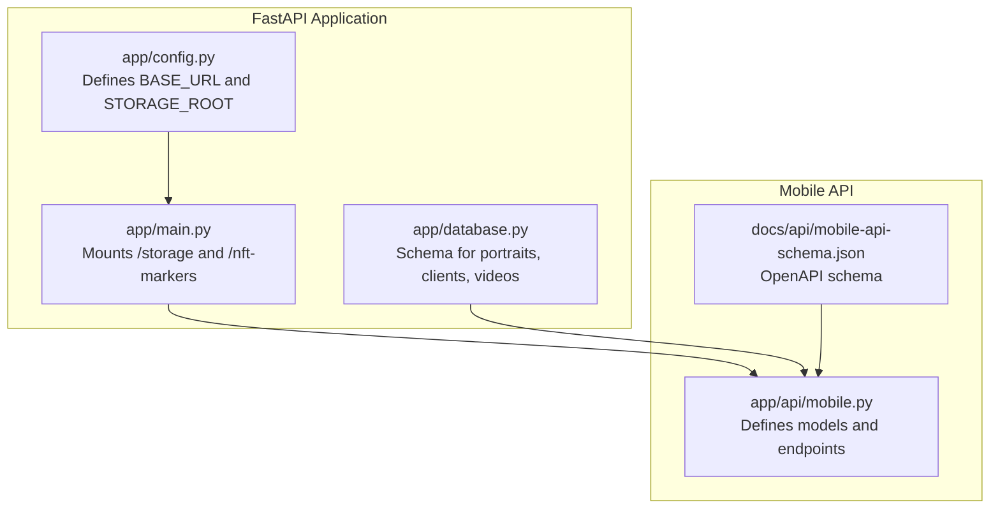
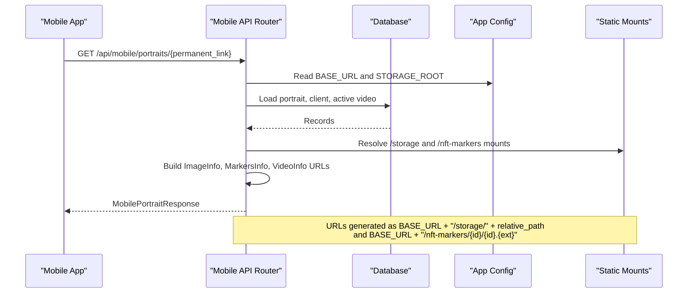
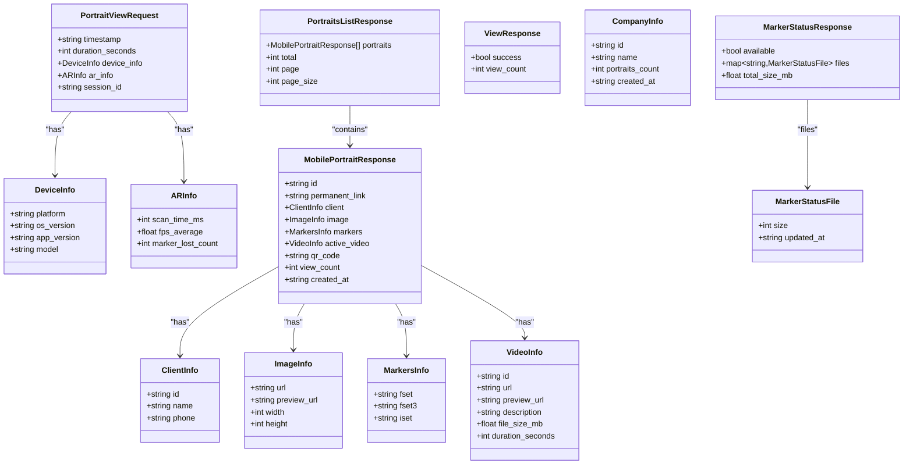
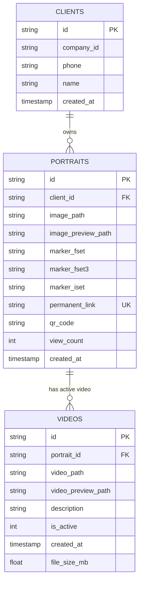
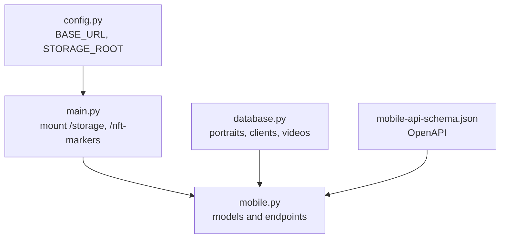

# Data Models

<cite>
**Referenced Files in This Document**
- [mobile.py](file://vertex-ar/app/api/mobile.py)
- [database.py](file://vertex-ar/app/database.py)
- [main.py](file://vertex-ar/app/main.py)
- [config.py](file://vertex-ar/app/config.py)
- [mobile-api-schema.json](file://docs/api/mobile-api-schema.json)
</cite>

## Table of Contents
1. [Introduction](#introduction)
2. [Project Structure](#project-structure)
3. [Core Components](#core-components)
4. [Architecture Overview](#architecture-overview)
5. [Detailed Component Analysis](#detailed-component-analysis)
6. [Dependency Analysis](#dependency-analysis)
7. [Performance Considerations](#performance-considerations)
8. [Troubleshooting Guide](#troubleshooting-guide)
9. [Conclusion](#conclusion)
10. [Appendices](#appendices)

## Introduction
This document provides comprehensive data model documentation for the mobile API. It focuses on the following Pydantic models used by the mobile endpoints:
- MobilePortraitResponse
- PortraitsListResponse
- ViewResponse
- CompanyInfo
- MarkerStatusResponse
- PortraitViewRequest
- DeviceInfo
- ARInfo
- ImageInfo
- MarkersInfo
- VideoInfo
- ClientInfo

It explains how MobilePortraitResponse aggregates portrait, client, image, markers, and active video data into a single optimized payload for mobile AR viewing. It also documents nested structures, URL generation using base_url and storage_root, validation rules, and provides examples of serialized JSON output.

## Project Structure
The mobile API models and their usage are defined in the mobile API router module and are consumed by the mobile endpoints. The application mounts static storage and NFT marker directories, and reads configuration values for base URL and storage root from settings.

**Diagram sources**
- [main.py](file://vertex-ar/app/main.py#L76-L84)
- [config.py](file://vertex-ar/app/config.py#L24-L36)
- [database.py](file://vertex-ar/app/database.py#L105-L209)
- [mobile.py](file://vertex-ar/app/api/mobile.py#L36-L141)
- [mobile-api-schema.json](file://docs/api/mobile-api-schema.json#L1-L324)

**Section sources**
- [main.py](file://vertex-ar/app/main.py#L76-L84)
- [config.py](file://vertex-ar/app/config.py#L24-L36)
- [database.py](file://vertex-ar/app/database.py#L105-L209)
- [mobile.py](file://vertex-ar/app/api/mobile.py#L36-L141)
- [mobile-api-schema.json](file://docs/api/mobile-api-schema.json#L1-L324)

## Core Components
This section documents each model with fields, data types, descriptions, and relationships. It also covers validation rules and URL generation logic.

- DeviceInfo
  - Fields:
    - platform: string, enum ["ios", "android"]
    - os_version: string
    - app_version: string
    - model: string (optional)
  - Validation: platform must be one of the allowed values.
  - Relationship: Part of PortraitViewRequest.

- ARInfo
  - Fields:
    - scan_time_ms: integer (optional)
    - fps_average: number (optional)
    - marker_lost_count: integer (optional)
  - Relationship: Part of PortraitViewRequest.

- PortraitViewRequest
  - Fields:
    - timestamp: string (ISO 8601)
    - duration_seconds: integer (>= 0)
    - device_info: DeviceInfo
    - ar_info: ARInfo (optional)
    - session_id: string (optional)
  - Validation: duration_seconds must be non-negative; timestamp must be a valid date-time string.

- ImageInfo
  - Fields:
    - url: string
    - preview_url: string (optional)
    - width: integer (optional)
    - height: integer (optional)
  - Relationship: Part of MobilePortraitResponse.image.

- MarkersInfo
  - Fields:
    - fset: string
    - fset3: string
    - iset: string
  - Validation: All fields are required in the OpenAPI schema.
  - Relationship: Part of MobilePortraitResponse.markers.

- VideoInfo
  - Fields:
    - id: string
    - url: string
    - preview_url: string (optional)
    - description: string (optional)
    - file_size_mb: number (optional)
    - duration_seconds: integer (optional)
  - Relationship: Part of MobilePortraitResponse.active_video.

- ClientInfo
  - Fields:
    - id: string
    - name: string
    - phone: string
  - Relationship: Part of MobilePortraitResponse.client.

- MobilePortraitResponse
  - Fields:
    - id: string
    - permanent_link: string
    - client: ClientInfo
    - image: ImageInfo
    - markers: MarkersInfo
    - active_video: VideoInfo (optional)
    - qr_code: string (optional)
    - view_count: integer
    - created_at: string (ISO 8601)
  - Relationship: Root response for a single portrait optimized for mobile AR viewing.

- PortraitsListResponse
  - Fields:
    - portraits: array of MobilePortraitResponse
    - total: integer
    - page: integer
    - page_size: integer
  - Relationship: Paginated list response for mobile portrait listing.

- ViewResponse
  - Fields:
    - success: boolean
    - view_count: integer
  - Relationship: Response for view tracking endpoint.

- CompanyInfo
  - Fields:
    - id: string
    - name: string
    - portraits_count: integer
    - created_at: string (ISO 8601)
  - Relationship: Lightweight company info for mobile selection.

- MarkerStatusFile
  - Fields:
    - size: integer
    - updated_at: string (ISO 8601)
  - Relationship: Part of MarkerStatusResponse.files.

- MarkerStatusResponse
  - Fields:
    - available: boolean
    - files: object with keys ["fset","fset3","iset"] and values MarkerStatusFile
    - total_size_mb: number
  - Relationship: Status of NFT marker files for caching and offline AR.

**Section sources**
- [mobile.py](file://vertex-ar/app/api/mobile.py#L36-L141)
- [mobile-api-schema.json](file://docs/api/mobile-api-schema.json#L186-L321)

## Architecture Overview
The mobile API builds a single optimized response by combining portrait, client, image, markers, and active video data. It generates URLs using the configured base URL and storage root, and serves marker files via a dedicated static mount.

**Diagram sources**
- [mobile.py](file://vertex-ar/app/api/mobile.py#L142-L213)
- [main.py](file://vertex-ar/app/main.py#L76-L84)
- [config.py](file://vertex-ar/app/config.py#L24-L36)

**Section sources**
- [mobile.py](file://vertex-ar/app/api/mobile.py#L142-L213)
- [main.py](file://vertex-ar/app/main.py#L76-L84)
- [config.py](file://vertex-ar/app/config.py#L24-L36)

## Detailed Component Analysis

### MobilePortraitResponse Composition
MobilePortraitResponse consolidates portrait, client, image, markers, and optional active video into a single payload for mobile AR. The builder function constructs URLs for images, videos, and NFT markers using base_url and storage_root.

Key relationships:
- client: ClientInfo derived from client record
- image: ImageInfo with url and optional preview_url
- markers: MarkersInfo with fset, fset3, iset URLs
- active_video: VideoInfo when an active video exists
- qr_code: Optional inline base64 image when present

URL generation rules:
- Image URL: BASE_URL + "/storage/" + relative_to(storage_root)
- Video URL: BASE_URL + "/storage/" + relative_to(storage_root)
- NFT marker URLs: BASE_URL + "/nft-markers/{portrait_id}/{portrait_id}.fset", ".fset3", ".iset"
- QR code: data:image/png;base64,<base64_data> when portrait contains qr_code

Validation rules:
- duration_seconds must be >= 0
- platform must be "ios" or "android"
- timestamp must be a valid date-time string
- MarkersInfo requires all three marker fields

**Diagram sources**
- [mobile.py](file://vertex-ar/app/api/mobile.py#L36-L141)

**Section sources**
- [mobile.py](file://vertex-ar/app/api/mobile.py#L36-L141)
- [mobile.py](file://vertex-ar/app/api/mobile.py#L142-L213)

### URL Generation for Images, Videos, and NFT Markers
The builder function computes relative paths from storage_root and prefixes them with base_url. NFT marker files are served under a dedicated static mount.

- Image URL: BASE_URL + "/storage/" + relative_to(STORAGE_ROOT)
- Video URL: BASE_URL + "/storage/" + relative_to(STORAGE_ROOT)
- NFT marker URLs: BASE_URL + "/nft-markers/{portrait_id}/{portrait_id}.fset", ".fset3", ".iset"
- QR code: data:image/png;base64,<base64_data> when portrait contains qr_code

These URLs are constructed from configuration values and mounted directories.

**Section sources**
- [mobile.py](file://vertex-ar/app/api/mobile.py#L142-L213)
- [main.py](file://vertex-ar/app/main.py#L76-L84)
- [config.py](file://vertex-ar/app/config.py#L24-L36)

### Nested Structure Mapping to Database Entities
The mobile response builder consumes records from the following database tables:
- portraits: id, client_id, image_path, image_preview_path, marker_fset, marker_fset3, marker_iset, permanent_link, qr_code, view_count, created_at
- clients: id, company_id, phone, name, created_at
- videos: id, portrait_id, video_path, video_preview_path, description, is_active, created_at, file_size_mb

Relationships:
- portraits.client_id -> clients.id
- portraits.id -> videos.portrait_id (active video)

**Diagram sources**
- [database.py](file://vertex-ar/app/database.py#L166-L209)

**Section sources**
- [database.py](file://vertex-ar/app/database.py#L166-L209)

### Example Serialized JSON Output
Below are example outputs for each model. Replace values with actual data from your environment.

- DeviceInfo
  {
    "platform": "ios",
    "os_version": "17.5",
    "app_version": "2.1.0",
    "model": "iPhone 15 Pro"
  }

- ARInfo
  {
    "scan_time_ms": 120,
    "fps_average": 30.5,
    "marker_lost_count": 2
  }

- PortraitViewRequest
  {
    "timestamp": "2025-01-15T10:30:00Z",
    "duration_seconds": 45,
    "device_info": { "platform": "android", "os_version": "14", "app_version": "2.1.0" },
    "ar_info": { "scan_time_ms": 150, "fps_average": 29.8 },
    "session_id": "sess_abc123"
  }

- ImageInfo
  {
    "url": "https://your-server.com/storage/2025/01/15/image_abc123.jpg",
    "preview_url": "https://your-server.com/storage/2025/01/15/image_abc123_preview.jpg",
    "width": 1080,
    "height": 1920
  }

- MarkersInfo
  {
    "fset": "https://your-server.com/nft-markers/abcd1234/abcd1234.fset",
    "fset3": "https://your-server.com/nft-markers/abcd1234/abcd1234.fset3",
    "iset": "https://your-server.com/nft-markers/abcd1234/abcd1234.iset"
  }

- VideoInfo
  {
    "id": "vid_5678ef",
    "url": "https://your-server.com/storage/2025/01/15/video_xyz789.mp4",
    "preview_url": "https://your-server.com/storage/2025/01/15/video_xyz789_preview.jpg",
    "description": "AR demonstration video",
    "file_size_mb": 45.2,
    "duration_seconds": 120
  }

- ClientInfo
  {
    "id": "cli_abcd1234",
    "name": "Alex Johnson",
    "phone": "+1234567890"
  }

- MobilePortraitResponse
  {
    "id": "abcd1234",
    "permanent_link": "link_abc123",
    "client": { "id": "cli_abcd1234", "name": "Alex Johnson", "phone": "+1234567890" },
    "image": {
      "url": "https://your-server.com/storage/2025/01/15/image_abc123.jpg",
      "preview_url": "https://your-server.com/storage/2025/01/15/image_abc123_preview.jpg"
    },
    "markers": {
      "fset": "https://your-server.com/nft-markers/abcd1234/abcd1234.fset",
      "fset3": "https://your-server.com/nft-markers/abcd1234/abcd1234.fset3",
      "iset": "https://your-server.com/nft-markers/abcd1234/abcd1234.iset"
    },
    "active_video": {
      "id": "vid_5678ef",
      "url": "https://your-server.com/storage/2025/01/15/video_xyz789.mp4",
      "preview_url": "https://your-server.com/storage/2025/01/15/video_xyz789_preview.jpg",
      "description": "AR demonstration video",
      "file_size_mb": 45.2,
      "duration_seconds": 120
    },
    "qr_code": "data:image/png;base64,iVBORw0K...",
    "view_count": 120,
    "created_at": "2025-01-10T08:45:00Z"
  }

- PortraitsListResponse
  {
    "portraits": [ /* array of MobilePortraitResponse */ ],
    "total": 120,
    "page": 1,
    "page_size": 20
  }

- ViewResponse
  {
    "success": true,
    "view_count": 121
  }

- CompanyInfo
  {
    "id": "comp_12345",
    "name": "Vertex AR Demo",
    "portraits_count": 42,
    "created_at": "2024-01-01T00:00:00Z"
  }

- MarkerStatusFile
  {
    "size": 1048576,
    "updated_at": "2025-01-14T12:34:56Z"
  }

- MarkerStatusResponse
  {
    "available": true,
    "files": {
      "fset": { "size": 1048576, "updated_at": "2025-01-14T12:34:56Z" },
      "fset3": { "size": 1048576, "updated_at": "2025-01-14T12:34:56Z" },
      "iset": { "size": 1048576, "updated_at": "2025-01-14T12:34:56Z" }
    },
    "total_size_mb": 3.0
  }

**Section sources**
- [mobile.py](file://vertex-ar/app/api/mobile.py#L142-L213)
- [mobile-api-schema.json](file://docs/api/mobile-api-schema.json#L186-L321)

## Dependency Analysis
The mobile API depends on:
- Configuration for BASE_URL and STORAGE_ROOT
- Mounted static directories for storage and NFT markers
- Database schema for portraits, clients, and videos
- OpenAPI schema for model definitions

**Diagram sources**
- [config.py](file://vertex-ar/app/config.py#L24-L36)
- [main.py](file://vertex-ar/app/main.py#L76-L84)
- [database.py](file://vertex-ar/app/database.py#L166-L209)
- [mobile.py](file://vertex-ar/app/api/mobile.py#L36-L141)
- [mobile-api-schema.json](file://docs/api/mobile-api-schema.json#L186-L321)

**Section sources**
- [config.py](file://vertex-ar/app/config.py#L24-L36)
- [main.py](file://vertex-ar/app/main.py#L76-L84)
- [database.py](file://vertex-ar/app/database.py#L166-L209)
- [mobile.py](file://vertex-ar/app/api/mobile.py#L36-L141)
- [mobile-api-schema.json](file://docs/api/mobile-api-schema.json#L186-L321)

## Performance Considerations
- URL generation uses relative path computation; ensure storage_root aligns with actual storage layout to avoid expensive path resolution.
- Serving NFT markers from a dedicated static mount reduces overhead compared to dynamic handlers.
- Pagination in PortraitsListResponse limits payload size for mobile networks.
- QR code embedded as base64 increases payload size; consider serving QR images separately if bandwidth is constrained.

[No sources needed since this section provides general guidance]

## Troubleshooting Guide
Common issues and resolutions:
- Missing or incorrect BASE_URL or STORAGE_ROOT:
  - Verify configuration values and mounted directories.
  - Confirm that /storage and /nft-markers are mounted and accessible.
- Portrait not found:
  - Ensure permanent_link exists and corresponds to a valid portrait record.
- Client not found:
  - Validate client_id linkage in portraits table.
- No active video:
  - active_video may be null; handle gracefully in the mobile app.
- Marker files not available:
  - Check MarkerStatusResponse.available and files for missing or non-existent files.

**Section sources**
- [mobile.py](file://vertex-ar/app/api/mobile.py#L305-L349)
- [mobile.py](file://vertex-ar/app/api/mobile.py#L439-L500)

## Conclusion
The mobile API models provide a compact, URL-rich representation of AR content tailored for mobile AR viewing. MobilePortraitResponse integrates portrait metadata, client info, image and video URLs, NFT marker locations, and optional QR code data. URL generation relies on configurable base_url and storage_root, while static mounts serve storage and NFT marker assets efficiently. Validation rules ensure robustness, and pagination supports scalable mobile consumption.

[No sources needed since this section summarizes without analyzing specific files]

## Appendices

### Validation Rules Summary
- DeviceInfo.platform must be "ios" or "android".
- PortraitViewRequest.duration_seconds must be >= 0.
- PortraitViewRequest.timestamp must be a valid date-time string.
- MarkersInfo requires all three marker fields (fset, fset3, iset).

**Section sources**
- [mobile-api-schema.json](file://docs/api/mobile-api-schema.json#L186-L241)
- [mobile.py](file://vertex-ar/app/api/mobile.py#L36-L60)