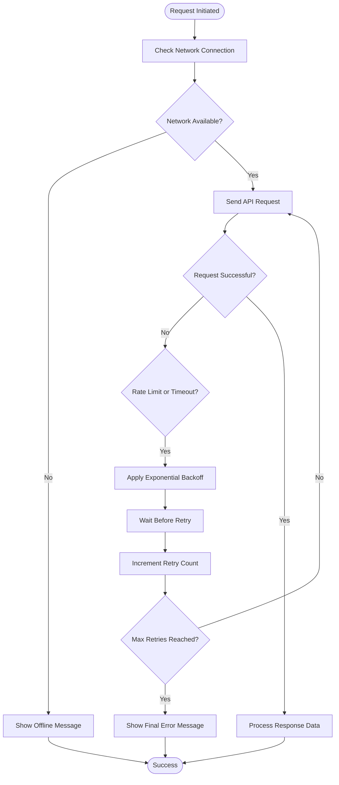

# Error Handling

<cite>
**Referenced Files in This Document**   
- [mobile.py](file://vertex-ar/app/api/mobile.py)
- [middleware.py](file://vertex-ar/app/middleware.py)
- [rate_limiter.py](file://vertex-ar/app/rate_limiter.py)
- [auth.py](file://vertex-ar/app/api/auth.py)
- [backend-integration.md](file://docs/mobile/backend-integration.md)
- [reference-table.md](file://docs/mobile/reference-table.md)
- [api-reference.md](file://docs/mobile/api-reference.md)
- [logging_setup.py](file://vertex-ar/logging_setup.py)
</cite>

## Table of Contents
1. [HTTP Status Codes](#http-status-codes)
2. [Custom Error Response Format](#custom-error-response-format)
3. [Custom Error Codes](#custom-error-codes)
4. [Error Handling Best Practices for Mobile Applications](#error-handling-best-practices-for-mobile-applications)
5. [Example Error Responses](#example-error-responses)
6. [Server Error and Degraded Functionality Handling](#server-error-and-degraded-functionality-handling)

## HTTP Status Codes

The mobile API uses standard HTTP status codes to indicate the outcome of requests. Each code has a specific meaning in the context of the mobile application:

- **200 OK**: The request was successful. This is returned for successful GET, PUT, and PATCH requests.
- **201 Created**: The resource was successfully created. This is returned after successful POST requests that create a new resource.
- **204 No Content**: The request was successful but there is no content to return. This is typically used for DELETE operations.
- **400 Bad Request**: The request was invalid or cannot be served. The payload may contain a detailed error message indicating the specific validation failure.
- **401 Unauthorized**: Authentication is required and has failed or has not been provided. This occurs when a request lacks valid authentication credentials.
- **403 Forbidden**: The request is valid, but the server is refusing action. This may occur when a user has valid credentials but lacks sufficient permissions.
- **404 Not Found**: The requested resource could not be found. This is returned when attempting to access a non-existent portrait, client, or other entity.
- **409 Conflict**: Indicates that the request could not be completed due to a conflict with the current state of the resource, such as attempting to create a duplicate client with the same phone number.
- **423 Locked**: The user account has been locked due to multiple failed login attempts. The user must wait for the lockout period to expire before attempting to log in again.
- **429 Too Many Requests**: The user has sent too many requests in a given amount of time (rate limiting). The response includes a Retry-After header indicating when the user can try again.
- **500 Server Error**: A generic error message indicating that the server encountered an unexpected condition that prevented it from fulfilling the request.

**Section sources**
- [reference-table.md](file://docs/mobile/reference-table.md#L304-L315)
- [backend-integration.md](file://docs/mobile/backend-integration.md#L813-L823)
- [api-reference.md](file://docs/mobile/api-reference.md#L648-L658)

## Custom Error Response Format

The mobile API returns a standardized error response format that includes several key fields to help clients handle errors effectively:

- **detail**: A human-readable description of the error that can be displayed directly to users.
- **error_code**: A machine-readable code that identifies the specific error type, allowing for programmatic handling of different error scenarios.
- **timestamp**: An ISO 8601 timestamp indicating when the error occurred, useful for debugging and logging.
- **request_id**: A unique identifier for the request that generated the error, which can be used for tracing and debugging on the server side.

This consistent format allows mobile applications to parse and handle errors uniformly across different endpoints. The request_id field is particularly valuable for support scenarios, as users can provide this ID when reporting issues, enabling developers to quickly locate the corresponding server logs.

**Section sources**
- [reference-table.md](file://docs/mobile/reference-table.md#L287-L294)
- [backend-integration.md](file://docs/mobile/backend-integration.md#L797-L802)

## Custom Error Codes

The API defines several custom error codes that provide more specific information about the nature of an error:

- **INVALID_CREDENTIALS**: Returned when login credentials are incorrect. This error is associated with HTTP 401 Unauthorized status.
- **ACCOUNT_LOCKED**: Indicates that the user account has been temporarily locked due to multiple failed login attempts. This corresponds to HTTP 423 Locked status.
- **RATE_LIMIT_EXCEEDED**: Returned when a client has exceeded the allowed number of requests within a specified time window. This triggers an HTTP 429 Too Many Requests response.
- **VALIDATION_ERROR**: Indicates that the request data failed validation. This is returned with HTTP 400 Bad Request status and may include details about which fields failed validation.
- **RESOURCE_NOT_FOUND**: Returned when a requested resource (such as a portrait or client) does not exist. This corresponds to HTTP 404 Not Found status.
- **UNAUTHORIZED**: A general authentication failure when a user tries to access a protected resource without proper authentication. This results in HTTP 401 Unauthorized status.
- **FORBIDDEN**: Indicates that the authenticated user does not have permission to perform the requested action. This is returned with HTTP 403 Forbidden status.

These custom error codes allow mobile applications to implement specific handling logic for different error scenarios, such as showing appropriate messages to users or triggering specific recovery workflows.

**Section sources**
- [reference-table.md](file://docs/mobile/reference-table.md#L321-L332)
- [api-reference.md](file://docs/mobile/api-reference.md#L664-L670)

## Error Handling Best Practices for Mobile Applications

Mobile applications should implement robust error handling strategies to provide a smooth user experience even when errors occur.

### Retry Mechanisms with Exponential Backoff

For transient errors such as network timeouts or rate limiting, mobile apps should implement retry mechanisms with exponential backoff. This approach involves waiting progressively longer between retry attempts, which helps prevent overwhelming the server during periods of high load. For example, after a 429 Too Many Requests response, the app should wait according to the Retry-After header before attempting the request again. For network failures, a typical exponential backoff might retry after 1 second, then 2 seconds, then 4 seconds, up to a maximum number of attempts.



**Diagram sources**
- [backend-integration.md](file://docs/mobile/backend-integration.md#L1714-L1729)
- [rate_limiter.py](file://vertex-ar/app/rate_limiter.py#L106-L110)

### User-Friendly Error Message Display

Error messages should be presented to users in a clear and non-technical manner. Instead of showing raw error codes or server messages, applications should translate these into user-friendly messages. For example, "Invalid credentials" should be displayed as "Incorrect email or password" rather than showing the technical error code. The app should also provide guidance on how to resolve the issue, such as suggesting the user reset their password or check their internet connection.

### Logging Strategies

Applications should implement comprehensive logging to capture error details for debugging and monitoring. This includes logging the request_id from error responses, which can be correlated with server-side logs. Sensitive information such as passwords or tokens should be redacted from logs. Structured logging with consistent fields (timestamp, level, message, context) makes it easier to analyze logs and identify patterns in errors. Client-side logs can be particularly valuable for diagnosing issues that are difficult to reproduce.

**Section sources**
- [backend-integration.md](file://docs/mobile/backend-integration.md#L1817-L1855)
- [logging_setup.py](file://vertex-ar/logging_setup.py#L14-L80)

## Example Error Responses

The following examples illustrate common error scenarios and their corresponding responses:

### Portrait Not Found (404)

When attempting to access a portrait that does not exist:

```json
{
  "detail": "Portrait not found",
  "error_code": "RESOURCE_NOT_FOUND",
  "timestamp": "2024-01-15T10:30:00Z",
  "request_id": "abc123-def456-ghi789"
}
```

This response indicates that the requested portrait does not exist in the system. The mobile app should handle this by showing a user-friendly message such as "The requested portrait could not be found" and potentially redirecting the user to a default view.

### Authentication Failures (401)

When login credentials are incorrect:

```json
{
  "detail": "Invalid credentials",
  "error_code": "INVALID_CREDENTIALS",
  "timestamp": "2024-01-15T10:30:00Z",
  "request_id": "abc123-def456-ghi789"
}
```

For expired or invalid tokens:

```json
{
  "detail": "Not authenticated",
  "error_code": "UNAUTHORIZED",
  "timestamp": "2024-01-15T10:30:00Z",
  "request_id": "abc123-def456-ghi789"
}
```

In both cases, the mobile app should prompt the user to re-enter their credentials. For token expiration, the app might automatically redirect to the login screen.

### Rate Limiting (429)

When a client exceeds the allowed number of requests:

```json
{
  "detail": "Rate limit exceeded. Try again in 60 seconds",
  "error_code": "RATE_LIMIT_EXCEEDED",
  "timestamp": "2024-01-15T10:30:00Z",
  "request_id": "abc123-def456-ghi789"
}
```

The response includes information about when the user can try again. The mobile app should respect this timing and implement a retry mechanism with exponential backoff, as shown in the previous section.

**Section sources**
- [mobile.py](file://vertex-ar/app/api/mobile.py#L324-L327)
- [backend-integration.md](file://docs/mobile/backend-integration.md#L842-L852)
- [auth.py](file://vertex-ar/app/api/auth.py#L155)

## Server Error and Degraded Functionality Handling

When encountering server errors (500) or degraded functionality, mobile applications should implement graceful degradation strategies. This includes maintaining a local cache of recently accessed data that can be displayed when the server is unavailable. The app should also provide clear feedback to users about the nature of the issue and expected resolution time when available.

For critical functionality, the app can implement fallback mechanisms or alternative workflows. For example, if portrait upload is failing due to server issues, the app might allow users to save the portrait locally and queue it for upload when the service is restored.

Monitoring server health through periodic health checks can help the app anticipate and prepare for potential service disruptions. When degraded performance is detected, the app can adjust its behavior, such as reducing the frequency of background sync operations or lowering the quality of media uploads to reduce server load.

**Section sources**
- [backend-integration.md](file://docs/mobile/backend-integration.md#L714-L720)
- [middleware.py](file://vertex-ar/app/middleware.py#L18-L74)