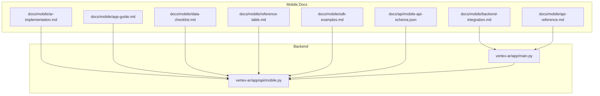
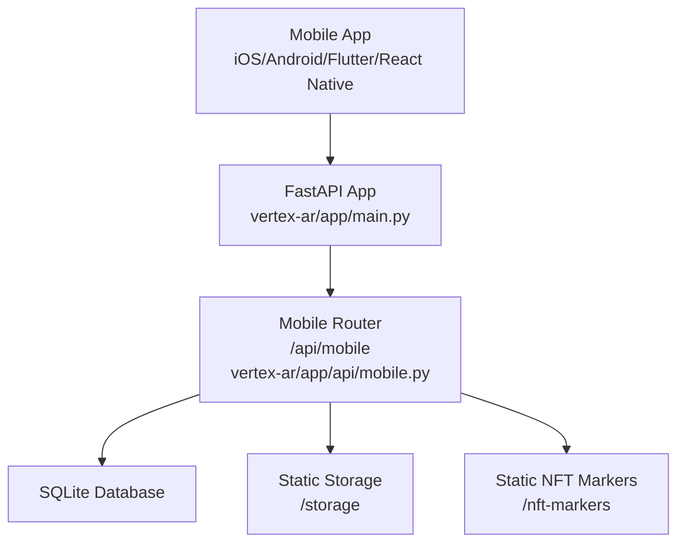
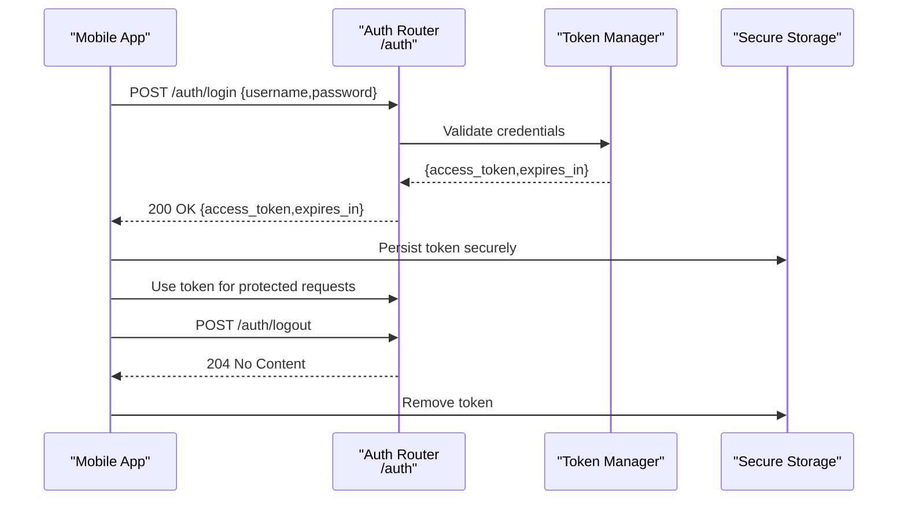
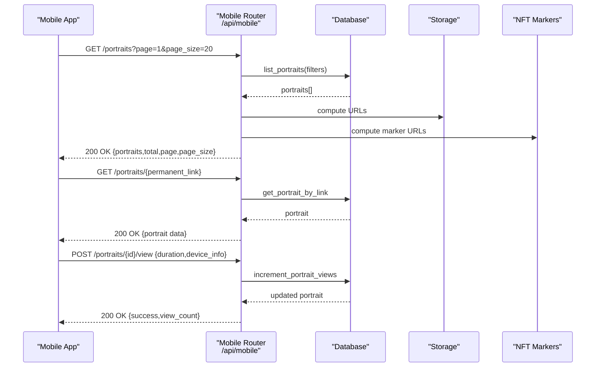
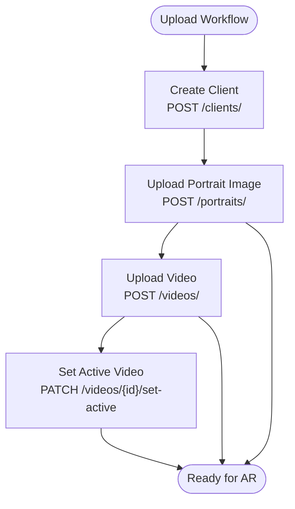
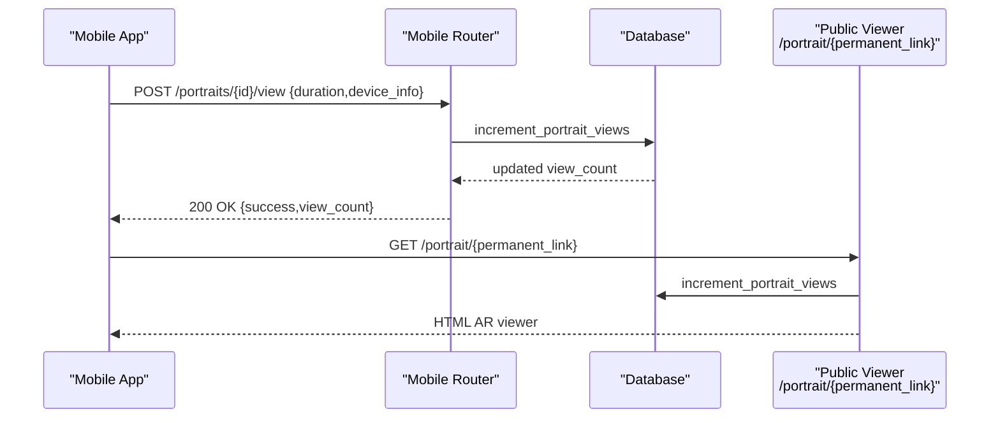
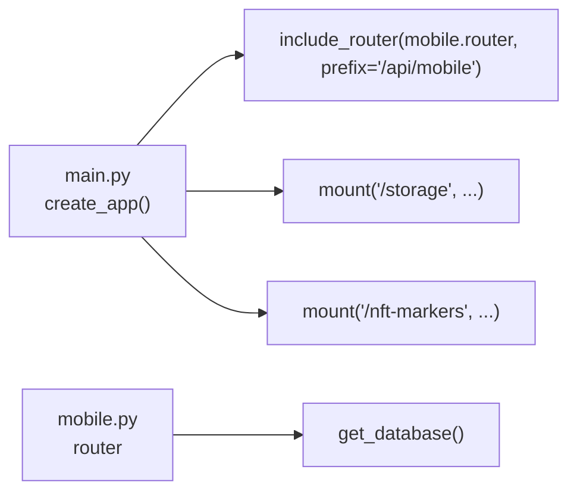

# Mobile Integration Guide

<cite>
**Referenced Files in This Document**
- [mobile-backend-integration.md](file://docs/mobile/backend-integration.md)
- [mobile-api-reference.md](file://docs/mobile/api-reference.md)
- [ar-implementation.md](file://docs/mobile/ar-implementation.md)
- [app-guide.md](file://docs/mobile/app-guide.md)
- [data-checklist.md](file://docs/mobile/data-checklist.md)
- [reference-table.md](file://docs/mobile/reference-table.md)
- [sdk-examples.md](file://docs/mobile/sdk-examples.md)
- [mobile-api-schema.json](file://docs/api/mobile-api-schema.json)
- [mobile.py](file://vertex-ar/app/api/mobile.py)
- [main.py](file://vertex-ar/app/main.py)
</cite>

## Table of Contents
1. [Introduction](#introduction)
2. [Project Structure](#project-structure)
3. [Core Components](#core-components)
4. [Architecture Overview](#architecture-overview)
5. [Detailed Component Analysis](#detailed-component-analysis)
6. [Dependency Analysis](#dependency-analysis)
7. [Performance Considerations](#performance-considerations)
8. [Troubleshooting Guide](#troubleshooting-guide)
9. [Conclusion](#conclusion)
10. [Appendices](#appendices)

## Introduction
This guide explains how to integrate mobile applications (iOS, Android, Flutter, React Native) with the Vertex AR backend. It covers authentication, mobile API endpoints, AR marker delivery, content upload workflows, real-time synchronization, request/response formats, error handling, and performance considerations for mobile networks. It also provides integration checklists and testing recommendations for development teams.

## Project Structure
The mobile integration spans:
- Frontend documentation under docs/mobile covering API references, AR implementation notes, quick start guides, and data checklists.
- Backend implementation under vertex-ar/app/api/mobile.py exposing optimized endpoints for mobile consumption.
- Application wiring under vertex-ar/app/main.py registering the mobile router and serving static assets for AR markers and storage.

**Diagram sources**
- [mobile-backend-integration.md](file://docs/mobile/backend-integration.md#L1-L120)
- [mobile-api-reference.md](file://docs/mobile/api-reference.md#L1-L120)
- [ar-implementation.md](file://docs/mobile/ar-implementation.md#L1-L60)
- [app-guide.md](file://docs/mobile/app-guide.md#L1-L60)
- [data-checklist.md](file://docs/mobile/data-checklist.md#L1-L60)
- [reference-table.md](file://docs/mobile/reference-table.md#L1-L60)
- [sdk-examples.md](file://docs/mobile/sdk-examples.md#L1-L60)
- [mobile-api-schema.json](file://docs/api/mobile-api-schema.json#L1-L60)
- [mobile.py](file://vertex-ar/app/api/mobile.py#L1-L60)
- [main.py](file://vertex-ar/app/main.py#L150-L190)

**Section sources**
- [mobile-backend-integration.md](file://docs/mobile/backend-integration.md#L1-L120)
- [mobile-api-reference.md](file://docs/mobile/api-reference.md#L1-L120)
- [ar-implementation.md](file://docs/mobile/ar-implementation.md#L1-L60)
- [app-guide.md](file://docs/mobile/app-guide.md#L1-L60)
- [data-checklist.md](file://docs/mobile/data-checklist.md#L1-L60)
- [reference-table.md](file://docs/mobile/reference-table.md#L1-L60)
- [sdk-examples.md](file://docs/mobile/sdk-examples.md#L1-L60)
- [mobile-api-schema.json](file://docs/api/mobile-api-schema.json#L1-L60)
- [mobile.py](file://vertex-ar/app/api/mobile.py#L1-L60)
- [main.py](file://vertex-ar/app/main.py#L150-L190)

## Core Components
- Authentication: JWT-based bearer tokens with login/logout endpoints and rate limits.
- Mobile API: Optimized endpoints for portrait lists, QR-based portrait retrieval, view tracking, company listing, and marker status checks.
- AR marker delivery: Static mount for NFT marker files and computed URLs in responses.
- Upload workflows: Client and portrait creation, portrait image upload, video upload, and video activation.
- Real-time synchronization: View tracking endpoint for analytics and counters.

**Section sources**
- [mobile-backend-integration.md](file://docs/mobile/backend-integration.md#L133-L223)
- [mobile-api-reference.md](file://docs/mobile/api-reference.md#L56-L120)
- [mobile.py](file://vertex-ar/app/api/mobile.py#L215-L500)
- [main.py](file://vertex-ar/app/main.py#L76-L90)

## Architecture Overview
The mobile integration relies on:
- FastAPI application with CORS and static mounts for storage and NFT markers.
- Mobile router registered under /api/mobile with JWT-protected and public endpoints.
- Pydantic models for request/response schemas aligned with mobile needs.
- AR marker files served statically for AR.js to consume.

**Diagram sources**
- [main.py](file://vertex-ar/app/main.py#L76-L90)
- [main.py](file://vertex-ar/app/main.py#L158-L183)
- [mobile.py](file://vertex-ar/app/api/mobile.py#L1-L60)

**Section sources**
- [main.py](file://vertex-ar/app/main.py#L76-L90)
- [main.py](file://vertex-ar/app/main.py#L158-L183)
- [mobile.py](file://vertex-ar/app/api/mobile.py#L1-L60)

## Detailed Component Analysis

### Authentication Flow
- Login: POST /auth/login returns a JWT access token and expiration.
- Logout: POST /auth/logout revokes the token.
- Token management: Store securely (Keychain/KeyStore), attach Authorization header, refresh before expiry.

**Diagram sources**
- [mobile-backend-integration.md](file://docs/mobile/backend-integration.md#L133-L223)
- [mobile-api-reference.md](file://docs/mobile/api-reference.md#L56-L120)

**Section sources**
- [mobile-backend-integration.md](file://docs/mobile/backend-integration.md#L133-L223)
- [mobile-api-reference.md](file://docs/mobile/api-reference.md#L56-L120)

### Mobile API Endpoints
- GET /api/mobile/portraits: Paginated list with filters (company_id, client_id, include_inactive).
- GET /api/mobile/portraits/{permanent_link}: Public portrait retrieval by permanent link.
- POST /api/mobile/portraits/{portrait_id}/view: Public view tracking with device/AR analytics.
- GET /api/mobile/companies: Companies with portrait counts.
- GET /api/mobile/portraits/{portrait_id}/marker-status: Marker availability and sizes.

**Diagram sources**
- [mobile.py](file://vertex-ar/app/api/mobile.py#L215-L500)
- [main.py](file://vertex-ar/app/main.py#L158-L183)

**Section sources**
- [mobile.py](file://vertex-ar/app/api/mobile.py#L215-L500)
- [mobile-api-schema.json](file://docs/api/mobile-api-schema.json#L20-L175)

### AR Marker Delivery and Content Upload Workflows
- Marker delivery: Static mount for NFT markers; backend computes URLs for fset/fset3/iset.
- Upload workflows:
  - Create client: POST /clients/
  - Upload portrait image: POST /portraits/ (multipart/form-data)
  - Upload video: POST /videos/ (multipart/form-data)
  - Activate video: PATCH /videos/{id}/set-active
  - Delete resources: DELETE /portraits/{id}, DELETE /videos/{id}

**Diagram sources**
- [mobile-backend-integration.md](file://docs/mobile/backend-integration.md#L302-L410)
- [mobile-api-reference.md](file://docs/mobile/api-reference.md#L108-L247)

**Section sources**
- [mobile-backend-integration.md](file://docs/mobile/backend-integration.md#L302-L410)
- [mobile-api-reference.md](file://docs/mobile/api-reference.md#L108-L247)

### Real-Time Synchronization Mechanisms
- View tracking: POST /api/mobile/portraits/{portrait_id}/view increments view count and records device/AR metrics.
- Public portrait access: GET /portrait/{permanent_link} for QR-based direct access.

**Diagram sources**
- [mobile.py](file://vertex-ar/app/api/mobile.py#L351-L401)
- [main.py](file://vertex-ar/app/main.py#L213-L263)

**Section sources**
- [mobile.py](file://vertex-ar/app/api/mobile.py#L351-L401)
- [main.py](file://vertex-ar/app/main.py#L213-L263)

### Mobile API Schema and Data Exchange Patterns
- OpenAPI schema defines request/response models for mobile consumption.
- Models include DeviceInfo, ARInfo, PortraitViewRequest, ImageInfo, MarkersInfo, VideoInfo, ClientInfo, MobilePortraitResponse, PortraitsListResponse, ViewResponse, CompanyInfo, MarkerStatusResponse.

```mermaid
classDiagram
class DeviceInfo {
+string platform
+string os_version
+string app_version
+string model
}
class ARInfo {
+int scan_time_ms
+float fps_average
+int marker_lost_count
}
class PortraitViewRequest {
+string timestamp
+int duration_seconds
+DeviceInfo device_info
+ARInfo ar_info
+string session_id
}
class ImageInfo {
+string url
+string preview_url
+int width
+int height
}
class MarkersInfo {
+string fset
+string fset3
+string iset
}
class VideoInfo {
+string id
+string url
+string preview_url
+string description
+float file_size_mb
+int duration_seconds
}
class ClientInfo {
+string id
+string name
+string phone
}
class MobilePortraitResponse {
+string id
+string permanent_link
+ClientInfo client
+ImageInfo image
+MarkersInfo markers
+VideoInfo active_video
+string qr_code
+int view_count
+string created_at
}
class PortraitsListResponse {
+MobilePortraitResponse[] portraits
+int total
+int page
+int page_size
}
class ViewResponse {
+bool success
+int view_count
}
class CompanyInfo {
+string id
+string name
+int portraits_count
+string created_at
}
class MarkerStatusFile {
+int size
+string updated_at
}
class MarkerStatusResponse {
+bool available
+dict files
+float total_size_mb
}
```

**Diagram sources**
- [mobile-api-schema.json](file://docs/api/mobile-api-schema.json#L176-L324)

**Section sources**
- [mobile-api-schema.json](file://docs/api/mobile-api-schema.json#L176-L324)

### Example Mobile-Specific Operations
- AR content retrieval via permanent link: GET /api/mobile/portraits/{permanent_link}.
- Status updates: POST /api/mobile/portraits/{portrait_id}/view with device_info and ar_info.
- Company filtering: GET /api/mobile/portraits?company_id={id}.
- Marker status checks: GET /api/mobile/portraits/{portrait_id}/marker-status.

**Section sources**
- [ar-implementation.md](file://docs/mobile/ar-implementation.md#L1-L120)
- [app-guide.md](file://docs/mobile/app-guide.md#L36-L96)
- [data-checklist.md](file://docs/mobile/data-checklist.md#L78-L147)

## Dependency Analysis
- Mobile router registration: main.py includes mobile.router under /api/mobile.
- Static mounts: main.py mounts /storage and /nft-markers for file access.
- Database access: mobile.py uses get_database() and app state configuration.

**Diagram sources**
- [main.py](file://vertex-ar/app/main.py#L158-L183)
- [main.py](file://vertex-ar/app/main.py#L76-L90)
- [mobile.py](file://vertex-ar/app/api/mobile.py#L22-L34)

**Section sources**
- [main.py](file://vertex-ar/app/main.py#L158-L183)
- [main.py](file://vertex-ar/app/main.py#L76-L90)
- [mobile.py](file://vertex-ar/app/api/mobile.py#L22-L34)

## Performance Considerations
- Network conditions: Implement timeouts, retries with exponential backoff, and rate-limit awareness.
- Caching: Cache portrait lists, previews, and NFT markers locally; use marker-status endpoint to manage cache freshness.
- Bandwidth: Prefer preview images and videos; optionally cache full assets for frequently viewed portraits.
- Background tasks: Use background jobs for uploads and analytics to keep UI responsive.

[No sources needed since this section provides general guidance]

## Troubleshooting Guide
- Authentication errors: 401 Unauthorized, 423 Locked, 429 Too Many Requests.
- Validation errors: 400 Bad Request with validation_errors payload.
- Resource not found: 404 Not Found for portraits or companies.
- Internal errors: 500 Internal Server Error; check logs and Sentry integration.

**Section sources**
- [reference-table.md](file://docs/mobile/reference-table.md#L299-L333)
- [mobile-api-reference.md](file://docs/mobile/api-reference.md#L641-L671)

## Conclusion
The Vertex AR backend provides a streamlined mobile integration surface with JWT authentication, optimized mobile endpoints, AR marker delivery, and robust upload workflows. By following the documented schemas, endpoints, and best practices, teams can deliver reliable AR experiences across platforms with efficient caching and offline-ready designs.

## Appendices

### Integration Checklist
- Setup: Initialize client with base URL, timeouts, and retry policy.
- Authentication: Implement login/logout, secure token storage, and header injection.
- CRUD clients: Create, list, update, delete clients.
- Upload content: Upload portrait images and videos; activate videos.
- AR viewing: Fetch portrait by permanent link; track views with analytics.
- Caching: Implement cache for metadata, previews, and markers; use marker-status.
- Testing: Validate on slow 3G, offline scenarios, and large datasets.

**Section sources**
- [reference-table.md](file://docs/mobile/reference-table.md#L336-L442)
- [data-checklist.md](file://docs/mobile/data-checklist.md#L218-L377)

### Testing Recommendations
- Unit tests: Mock API client and validate request/response shapes.
- Integration tests: End-to-end flows for login, upload, and AR viewing.
- Load testing: Simulate concurrent uploads and view tracking.
- Offline testing: Verify cache behavior and offline queue submission.

**Section sources**
- [reference-table.md](file://docs/mobile/reference-table.md#L406-L442)
- [data-checklist.md](file://docs/mobile/data-checklist.md#L292-L349)