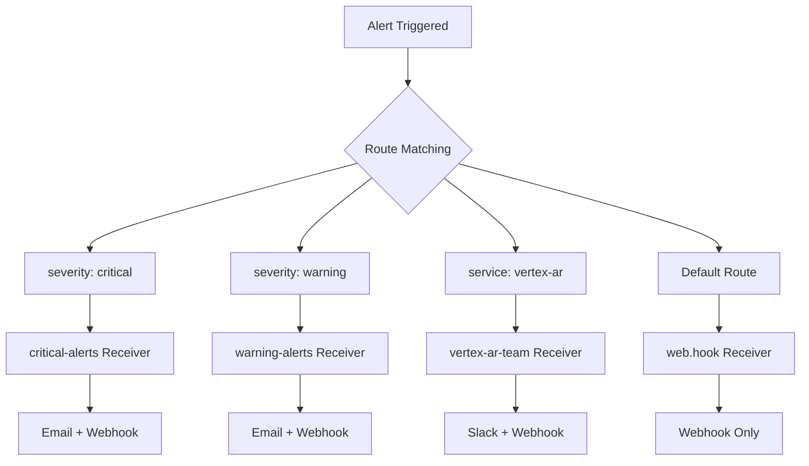
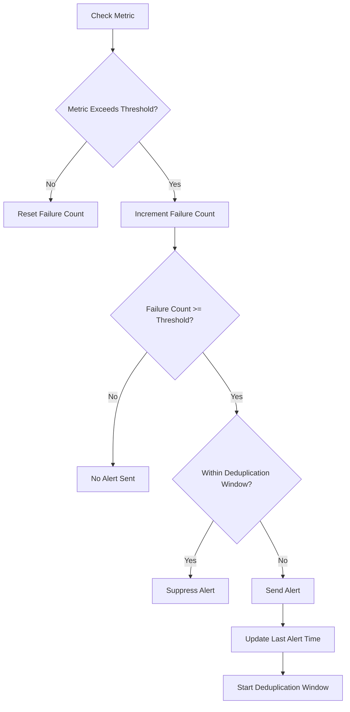
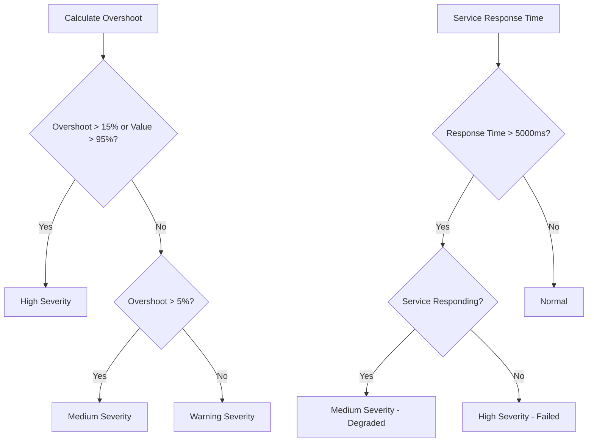
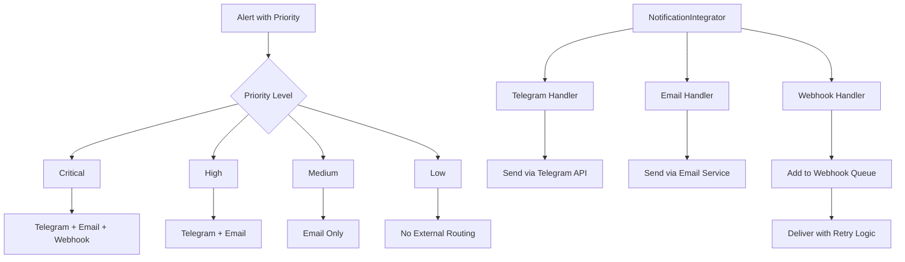
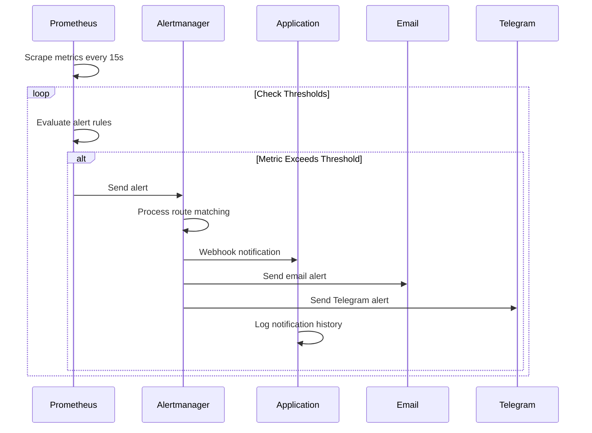

# Alerting Management

<cite>
**Referenced Files in This Document**   
- [alertmanager.yml](file://monitoring/alertmanager.yml)
- [alert_rules.yml](file://monitoring/alert_rules.yml)
- [prometheus.yml](file://monitoring/prometheus.yml)
- [alerting.py](file://vertex-ar/app/alerting.py)
- [monitoring.py](file://vertex-ar/app/monitoring.py)
- [api/monitoring.py](file://vertex-ar/app/api/monitoring.py)
- [notification_integrations.py](file://vertex-ar/notification_integrations.py)
- [test_monitoring_alert_dedup.py](file://test_files/integration/test_monitoring_alert_dedup.py)
- [alert-stabilization.md](file://docs/monitoring/alert-stabilization.md)
- [.env.notification-example](file://.env.notification-example)
</cite>

## Table of Contents
1. [Introduction](#introduction)
2. [Alert Configuration in Alertmanager](#alert-configuration-in-alertmanager)
3. [Alert Deduplication Mechanism](#alert-deduplication-mechanism)
4. [Alert Severity Levels](#alert-severity-levels)
5. [Notification Channels and Escalation Policies](#notification-channels-and-escalation-policies)
6. [Alert Triggering and Processing](#alert-triggering-and-processing)
7. [Common Issues and Solutions](#common-issues-and-solutions)
8. [Conclusion](#conclusion)

## Introduction

The alerting management system in Vertex AR is designed to provide comprehensive monitoring and notification capabilities for system health and performance. This documentation details the configuration and operation of the alerting system, focusing on Alertmanager configuration, alert deduplication, severity determination, and notification routing. The system is built to prevent alert storms while ensuring critical issues are properly escalated through multiple channels including email, Telegram, and webhooks. The documentation provides both conceptual understanding for beginners and technical depth for experienced developers, with concrete examples from the codebase showing how alerts are configured, triggered, and processed.

**Section sources**
- [alertmanager.yml](file://monitoring/alertmanager.yml#L1-L97)
- [alert_rules.yml](file://monitoring/alert_rules.yml#L1-L210)
- [alert-stabilization.md](file://docs/monitoring/alert-stabilization.md#L1-L295)

## Alert Configuration in Alertmanager

The Alertmanager configuration in Vertex AR is defined in the `alertmanager.yml` file and consists of three main components: route definitions, receivers, and inhibition rules. The route configuration establishes a hierarchical structure for alert processing, with the global route serving as the default path and specific routes handling alerts based on severity or service type. The configuration groups alerts by alert name and service, with a group wait time of 10 seconds and a repeat interval of 1 hour for most alerts. Critical alerts have a shorter group wait time of 5 seconds and a repeat interval of 30 minutes to ensure rapid response to severe issues.

Receivers are configured to handle alerts through multiple channels, including email, webhooks, and Slack. The 'critical-alerts' receiver sends notifications to the admin email address with a subject prefix of '[CRITICAL]' and includes detailed alert information in the email body. Similarly, the 'warning-alerts' receiver sends notifications to the team email address with a '[WARNING]' prefix. The 'vertex-ar-team' receiver is configured to send alerts to a Slack channel named '#vertex-ar-alerts' using a webhook URL, with a formatted message that includes the alert summary, description, severity, and service information. All receivers are also configured to send resolved alerts, providing closure on issues that have been fixed.

The configuration also includes inhibition rules that prevent lower-severity alerts from being sent when a higher-severity alert exists for the same alert name and service. This prevents alert noise during critical incidents. For example, if a critical alert is active for a service, warning alerts for the same service will be inhibited. The configuration also defines time intervals for business hours and weekends, which can be used to route alerts differently based on the time of day, although these are not currently utilized in the routing configuration.

**Diagram sources **
- [alertmanager.yml](file://monitoring/alertmanager.yml#L8-L97)

**Section sources**
- [alertmanager.yml](file://monitoring/alertmanager.yml#L8-L97)
- [alert_rules.yml](file://monitoring/alert_rules.yml#L2-L210)

## Alert Deduplication Mechanism

The alert deduplication mechanism in Vertex AR employs a dual approach combining consecutive failure thresholds and deduplication windows to prevent alert storms while ensuring sustained issues are properly escalated. The system tracks consecutive failures for each metric or service independently, requiring a configurable number of consecutive failures before escalating an alert. By default, the system requires three consecutive failures before sending an alert, which prevents single noisy samples or transient spikes from triggering notifications. This threshold is configurable via the `MONITORING_CONSECUTIVE_FAILURES` setting in the environment configuration.

Once an alert is escalated, a deduplication window prevents the same alert type from being re-sent for a configurable period. The default deduplication window is 300 seconds (5 minutes), which is configurable via the `MONITORING_DEDUP_WINDOW` setting. During this window, subsequent alerts of the same type are suppressed, even if the issue persists. This prevents alert spam while the issue is being addressed. The deduplication window is tracked independently for each alert type, allowing different metrics to have their own suppression periods.

The implementation is handled by the `_should_escalate_alert` method in the `SystemMonitor` class, which manages both the consecutive failure tracking and deduplication window logic. When a metric exceeds its threshold, the failure count for that metric is incremented. If the failure count reaches the consecutive failure threshold and the deduplication window has expired, the alert is escalated. The failure count is reset to zero when the metric returns to a healthy state, ensuring that recovered issues do not contribute to future alert calculations. This mechanism is tested comprehensively in the `test_monitoring_alert_dedup.py` integration tests, which verify that single spikes do not trigger alerts, sustained issues do trigger alerts after the threshold is reached, and the deduplication window prevents rapid re-alerts.

**Diagram sources **
- [monitoring.py](file://vertex-ar/app/monitoring.py#L152-L181)
- [test_monitoring_alert_dedup.py](file://test_files/integration/test_monitoring_alert_dedup.py#L30-L113)

**Section sources**
- [monitoring.py](file://vertex-ar/app/monitoring.py#L152-L181)
- [test_monitoring_alert_dedup.py](file://test_files/integration/test_monitoring_alert_dedup.py#L30-L113)
- [alert-stabilization.md](file://docs/monitoring/alert-stabilization.md#L9-L37)

## Alert Severity Levels

Alert severity levels in Vertex AR are determined based on the degree to which a metric exceeds its threshold, with three distinct levels: warning, medium, and high. The severity is calculated using a percentage overshoot formula that considers both the relative overshoot and absolute values. For a metric to be classified as "high" severity, it must either exceed its threshold by more than 15% or reach an absolute value above 95%. This dual criteria ensures that metrics approaching critical system limits are treated with appropriate urgency regardless of their threshold setting.

The `_determine_severity` method in the `SystemMonitor` class implements this logic by first calculating the percentage overshoot as ((value - threshold) / threshold) * 100. If the value exceeds 95% or the overshoot is greater than 15%, the severity is set to "high". If the overshoot is between 5% and 15%, the severity is set to "medium". For overshoots of 5% or less, the severity is set to "warning". This graduated approach allows for appropriate response levels based on the severity of the issue, with critical issues receiving immediate attention while minor threshold breaches are treated as lower-priority warnings.

Service-specific severity determination is also implemented, with different criteria for different types of issues. For example, slow service response times are classified as "medium" severity when they exceed 5000ms but the service is still responding, while complete service failures are classified as "high" severity. This distinction between degraded and failed services allows for more nuanced alerting that reflects the actual impact on system functionality. The severity level influences both the alert routing and the urgency of the response, with high-severity alerts typically routed to all available notification channels and medium-severity alerts potentially limited to email or other less intrusive channels.

**Diagram sources **
- [monitoring.py](file://vertex-ar/app/monitoring.py#L193-L216)
- [alert-stabilization.md](file://docs/monitoring/alert-stabilization.md#L47-L54)

**Section sources**
- [monitoring.py](file://vertex-ar/app/monitoring.py#L193-L216)
- [alert-stabilization.md](file://docs/monitoring/alert-stabilization.md#L47-L54)
- [test_monitoring_alert_dedup.py](file://test_files/integration/test_monitoring_alert_dedup.py#L115-L141)

## Notification Channels and Escalation Policies

The notification system in Vertex AR supports multiple channels including email, Telegram, and webhooks, with configurable escalation policies based on alert priority. The `.env.notification-example` file provides configuration options for each channel, including SMTP settings for email, bot tokens and chat IDs for Telegram, and webhook URLs for integration with external services like Slack, Discord, or Microsoft Teams. Each notification channel can be enabled or disabled independently through environment variables, allowing administrators to customize the notification setup based on their requirements.

Escalation policies are defined through priority-based routing, with different notification routes configured for critical, high, medium, and low priority alerts. The `CRITICAL_NOTIFICATION_ROUTES`, `HIGH_NOTIFICATION_ROUTES`, `MEDIUM_NOTIFICATION_ROUTES`, and `LOW_NOTIFICATION_ROUTES` environment variables specify which channels should be used for each priority level. For example, critical alerts might be routed to all available channels (Telegram, email, and webhooks), while medium alerts might be limited to email only. This tiered approach ensures that critical issues receive immediate attention through multiple channels, while less severe issues are communicated through less intrusive means.

The `NotificationIntegrator` class manages the routing of notifications to the appropriate channels based on priority. It maintains a registry of integration handlers for each channel type and routes notifications accordingly. The system also includes a webhook queue that manages the delivery of webhook notifications, with retry logic and error handling to ensure reliable delivery. The `get_webhook_queue` API endpoint allows administrators to monitor the status of pending webhook deliveries, providing visibility into the notification delivery process. Notification history is stored in the database, allowing for auditing and troubleshooting of notification delivery issues.

**Diagram sources **
- [.env.notification-example](file://.env.notification-example#L31-L81)
- [notification_integrations.py](file://vertex-ar/notification_integrations.py#L48-L65)
- [api/notifications_management.py](file://vertex-ar/app/api/notifications_management.py#L307-L334)

**Section sources**
- [.env.notification-example](file://.env.notification-example#L31-L81)
- [notification_integrations.py](file://vertex-ar/notification_integrations.py#L48-L65)
- [api/notifications_management.py](file://vertex-ar/app/api/notifications_management.py#L307-L334)

## Alert Triggering and Processing

The alert triggering and processing flow in Vertex AR follows a comprehensive sequence from metric collection to notification delivery. The process begins with Prometheus scraping metrics from the application at regular intervals, as configured in `prometheus.yml`. These metrics include system-level information such as CPU usage, memory consumption, and disk usage, as well as application-specific metrics. When a metric exceeds its defined threshold for the specified duration (as defined in `alert_rules.yml`), Prometheus triggers an alert and sends it to Alertmanager.

Alertmanager processes the alert according to its routing configuration, matching the alert against defined routes based on labels such as severity and service. The alert is then sent to the appropriate receiver, which may include email, webhooks, or other notification channels. The webhook receiver sends the alert to the application's webhook endpoint at `/admin/monitoring/webhook/alert`, where it is processed by the application's alerting system. This integration allows the application to respond to alerts with custom logic, such as triggering additional diagnostics or initiating automated recovery procedures.

Within the application, the `SystemMonitor` class performs regular health checks and evaluates metrics against configurable thresholds. When a metric exceeds its threshold, the system tracks consecutive failures and applies deduplication logic before escalating the alert through the `AlertManager` class. The `AlertManager` class sends notifications through all configured channels, including email via the `send_email_alert` method and Telegram via the `send_telegram_alert` method. Each notification is logged in the database through the `add_notification_history` method, providing an audit trail of all notifications sent. The entire process is tested through integration tests that verify the end-to-end alerting flow, from metric threshold crossing to notification delivery.

**Diagram sources **
- [prometheus.yml](file://monitoring/prometheus.yml#L1-L51)
- [alert_rules.yml](file://monitoring/alert_rules.yml#L2-L210)
- [alerting.py](file://vertex-ar/app/alerting.py#L23-L257)
- [monitoring.py](file://vertex-ar/app/monitoring.py#L152-L181)

**Section sources**
- [prometheus.yml](file://monitoring/prometheus.yml#L1-L51)
- [alert_rules.yml](file://monitoring/alert_rules.yml#L2-L210)
- [alerting.py](file://vertex-ar/app/alerting.py#L23-L257)

## Common Issues and Solutions

Common issues in the alerting system typically revolve around alert storms, misconfigured thresholds, and notification delivery problems. Alert storms can occur when thresholds are set too aggressively or when the deduplication mechanism is not properly configured. To address this, administrators should review the `MONITORING_CONSECUTIVE_FAILURES` and `MONITORING_DEDUP_WINDOW` settings, potentially increasing the consecutive failure threshold to 4 or 5 and extending the deduplication window to 600 seconds (10 minutes) for noisy environments. The system logs provide valuable information for troubleshooting, with debug logs showing failure counts and deduplication status, and info logs indicating when alerts are escalated.

Misconfigured thresholds are another common issue, where thresholds are set too low, resulting in excessive alerts, or too high, failing to detect real issues. Administrators should review historical metrics through the `/monitoring/trends` API endpoint to establish appropriate baselines before setting thresholds. The system supports dynamic threshold adjustment through the `/admin/monitoring/settings` API endpoint, allowing thresholds to be updated without restarting the application. When important issues are not being alerted, administrators should verify that the consecutive failure threshold is not set too high and that the monitoring loop is running correctly.

Notification delivery issues can occur due to misconfigured channels or network problems. The system provides several tools for diagnosing these issues, including the `test_alert_system` method in the `AlertManager` class, which tests all configured channels, and the `/admin/monitoring/test-alert` API endpoint, which sends a test alert through all channels. The webhook queue status can be monitored through the `/admin/notifications-management/webhooks/queue` endpoint, showing pending deliveries and any delivery errors. Notification history is stored in the database and can be accessed through the `/admin/notifications-management/history` endpoint, providing a complete record of all notifications sent and their delivery status.

**Section sources**
- [alert-stabilization.md](file://docs/monitoring/alert-stabilization.md#L248-L264)
- [alerting.py](file://vertex-ar/app/alerting.py#L355-L378)
- [api/monitoring.py](file://vertex-ar/app/api/monitoring.py#L270-L296)
- [api/notifications_management.py](file://vertex-ar/app/api/notifications_management.py#L307-L334)

## Conclusion

The alerting management system in Vertex AR provides a robust and configurable framework for monitoring system health and performance. By combining Prometheus for metric collection and alert triggering with a sophisticated in-application alert processing system, the solution offers comprehensive coverage of both infrastructure and application-level issues. The dual mechanism of consecutive failure tracking and deduplication windows effectively prevents alert storms while ensuring sustained issues are properly escalated. The graduated severity levels based on threshold overshoot allow for appropriate response levels, and the flexible notification routing enables administrators to customize alert delivery based on priority.

The system's design emphasizes reliability and maintainability, with comprehensive logging, testing, and diagnostic tools. The integration between Prometheus Alertmanager and the application's internal alerting system provides both immediate notifications and the ability to trigger custom response logic. Configuration is managed through environment variables and API endpoints, allowing for dynamic adjustment without requiring application restarts. For optimal operation, administrators should carefully tune thresholds based on historical data, monitor the webhook queue for delivery issues, and regularly test notification channels to ensure they are functioning correctly. The system represents a mature alerting solution that balances sensitivity to real issues with resilience against transient noise.

**Section sources**
- [alertmanager.yml](file://monitoring/alertmanager.yml#L1-L97)
- [alert_rules.yml](file://monitoring/alert_rules.yml#L1-L210)
- [alerting.py](file://vertex-ar/app/alerting.py#L1-L383)
- [monitoring.py](file://vertex-ar/app/monitoring.py#L1-L1704)