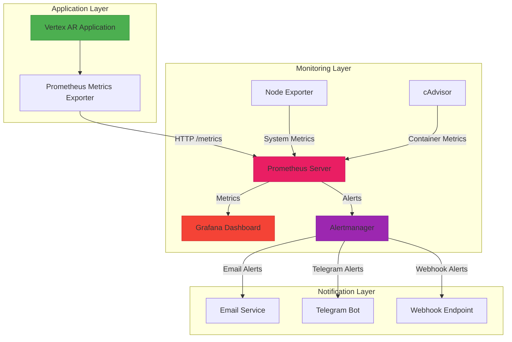
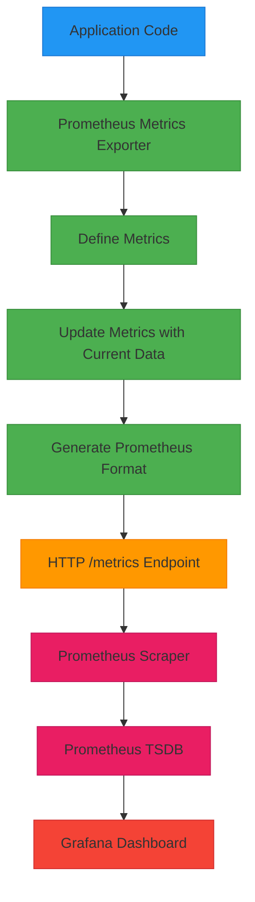
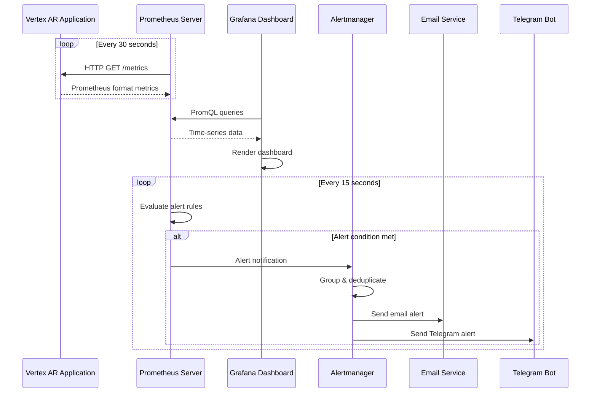
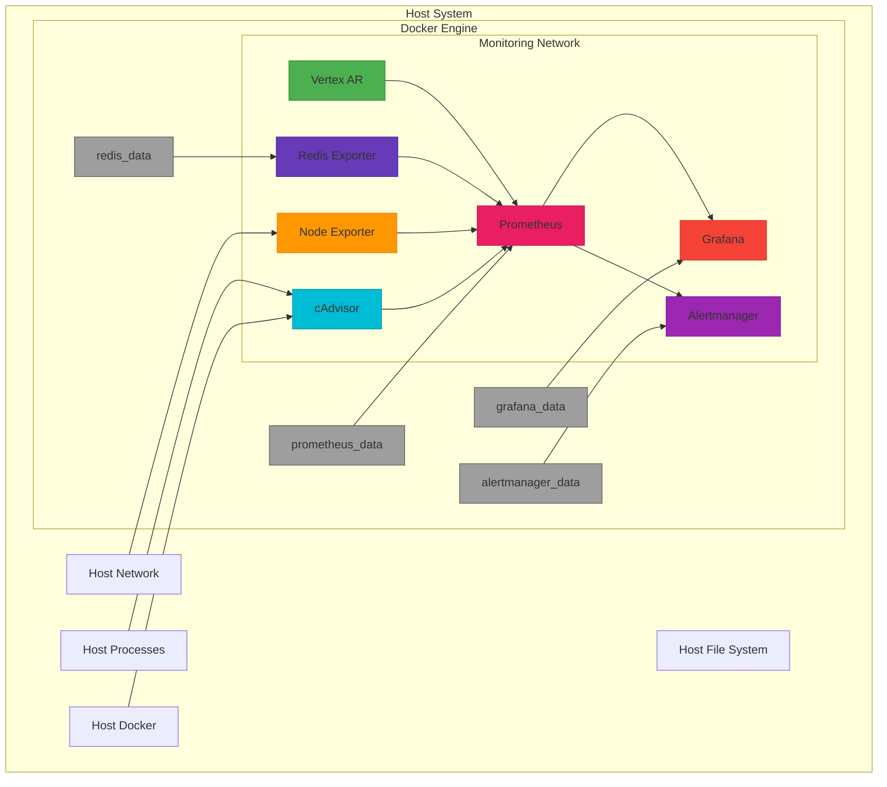

# Grafana Visualization

<cite>
**Referenced Files in This Document**   
- [grafana-dashboard.json](file://monitoring/grafana-dashboard.json)
- [prometheus.yml](file://monitoring/prometheus.yml)
- [alert_rules.yml](file://monitoring/alert_rules.yml)
- [alertmanager.yml](file://monitoring/alertmanager.yml)
- [docker-compose.monitoring.yml](file://docker-compose.monitoring.yml)
- [prometheus_metrics.py](file://vertex-ar/app/prometheus_metrics.py)
- [monitoring.py](file://vertex-ar/app/monitoring.py)
- [main.py](file://vertex-ar/app/main.py)
- [config.py](file://vertex-ar/app/config.py)
</cite>

## Table of Contents
1. [Introduction](#introduction)
2. [System Architecture](#system-architecture)
3. [Dashboard Structure](#dashboard-structure)
4. [Panel Configurations](#panel-configurations)
5. [Data Source Integration](#data-source-integration)
6. [Component Interactions](#component-interactions)
7. [Key Visualizations](#key-visualizations)
8. [Infrastructure Requirements](#infrastructure-requirements)
9. [Scalability Considerations](#scalability-considerations)
10. [Deployment Topology](#deployment-topology)
11. [Cross-Cutting Concerns](#cross-cutting-concerns)
12. [Technology Stack](#technology-stack)
13. [Conclusion](#conclusion)

## Introduction

The Grafana visualization system provides comprehensive monitoring and observability for the Vertex AR application. This documentation details the architecture, configuration, and integration of the monitoring stack, which includes Grafana, Prometheus, and Alertmanager. The system is designed to provide real-time insights into system health, performance trends, and service status through a rich set of visualizations and alerting mechanisms.

The monitoring solution is containerized and deployed alongside the application using Docker Compose, with Prometheus collecting metrics from the application and system components, Grafana providing visualization dashboards, and Alertmanager handling notification routing. The system is configured to monitor critical metrics including CPU usage, memory consumption, disk utilization, network traffic, and service health.

**Section sources**
- [grafana-dashboard.json](file://monitoring/grafana-dashboard.json#L1-L257)
- [docker-compose.monitoring.yml](file://docker-compose.monitoring.yml#L1-L132)

## System Architecture

The monitoring architecture follows a modern observability stack pattern with Prometheus as the metrics collection and storage backend, Grafana as the visualization layer, and Alertmanager for alert routing and deduplication. The Vertex AR application exposes metrics in Prometheus format through a dedicated endpoint, which is scraped by Prometheus at regular intervals.

**Diagram sources**
- [docker-compose.monitoring.yml](file://docker-compose.monitoring.yml#L1-L132)
- [prometheus.yml](file://monitoring/prometheus.yml#L1-L51)
- [main.py](file://vertex-ar/app/main.py#L1-L477)

**Section sources**
- [docker-compose.monitoring.yml](file://docker-compose.monitoring.yml#L1-L132)
- [prometheus.yml](file://monitoring/prometheus.yml#L1-L51)

## Dashboard Structure

The Grafana dashboard is organized into a comprehensive monitoring view with multiple panels arranged in a grid layout. The dashboard titled "Vertex AR Server Monitoring" is structured to provide an at-a-glance overview of system health and performance metrics. The layout follows a logical grouping of related metrics, with status indicators at the top, followed by time-series graphs for trend analysis.

The dashboard contains 13 panels organized into three rows:
- **Row 1 (Status Indicators)**: CPU Usage, Memory Usage, Disk Usage, and Service Health
- **Row 2 (Trend Analysis)**: CPU Load Average and Memory Breakdown
- **Row 3 (Network and Process Metrics)**: Network Traffic, Disk I/O, Service Response Times, Network Errors & Drops, Process Metrics, Disk Temperature, and Network Connections

Each panel is configured with appropriate units, thresholds, and visualization types to effectively communicate the current state and historical trends of the monitored metrics. The dashboard refreshes automatically every 30 seconds to provide near real-time monitoring.

```mermaid
graph TB
Dashboard["Vertex AR Server Monitoring"]
subgraph "Row 1"
CPU[CPU Usage]
Memory[Memory Usage]
Disk[Disk Usage]
Health[Service Health]
end
subgraph "Row 2"
Load[CPU Load Average]
MemBreakdown[Memory Breakdown]
end
subgraph "Row 3"
Network[Network Traffic]
DiskIO[Disk I/O]
Response[Service Response Times]
Errors[Network Errors & Drops]
Process[Process Metrics]
Temperature[Disk Temperature]
Connections[Network Connections]
end
Dashboard --> CPU
Dashboard --> Memory
Dashboard --> Disk
Dashboard --> Health
Dashboard --> Load
Dashboard --> MemBreakdown
Dashboard --> Network
Dashboard --> DiskIO
Dashboard --> Response
Dashboard --> Errors
Dashboard --> Process
Dashboard --> Temperature
Dashboard --> Connections
style Dashboard fill:#2196F3,stroke:#1976D2
style CPU fill:#FF9800,stroke:#F57C00
style Memory fill:#FF9800,stroke:#F57C00
style Disk fill:#FF9800,stroke:#F57C00
style Health fill:#FF9800,stroke:#F57C00
style Load fill:#8BC34A,stroke:#689F38
style MemBreakdown fill:#8BC34A,stroke:#689F38
style Network fill:#00BCD4,stroke:#0097A7
style DiskIO fill:#00BCD4,stroke:#0097A7
style Response fill:#00BCD4,stroke:#0097A7
style Errors fill:#00BCD4,stroke:#0097A7
style Process fill:#00BCD4,stroke:#0097A7
style Temperature fill:#00BCD4,stroke:#0097A7
style Connections fill:#00BCD4,stroke:#0097A7
```

**Diagram sources**
- [grafana-dashboard.json](file://monitoring/grafana-dashboard.json#L1-L257)

**Section sources**
- [grafana-dashboard.json](file://monitoring/grafana-dashboard.json#L1-L257)

## Panel Configurations

The Grafana dashboard panels are configured with specific visualization types, thresholds, and data queries to effectively represent different types of metrics. The configuration follows best practices for monitoring dashboards, using appropriate visualizations for different data types and setting meaningful thresholds for alerting.

### Status Panels (Stat Type)
The first row of panels uses the "stat" visualization type to display current values with color-coded thresholds:

- **CPU Usage**: Displays current CPU usage percentage with green (<70%), yellow (70-90%), and red (>90%) thresholds
- **Memory Usage**: Shows memory usage percentage with green (<80%), yellow (80-95%), and red (>95%) thresholds  
- **Disk Usage**: Indicates disk usage percentage with green (<85%), yellow (85-95%), and red (>95%) thresholds
- **Service Health**: Displays service health status as a binary value (0=unhealthy, 1=healthy) with red for 0 and green for 1

### Time-Series Graphs
The remaining panels use graph visualizations to show historical trends:

- **CPU Load Average**: Line graph showing 1-minute, 5-minute, and 15-minute load averages
- **Memory Breakdown**: Stacked area graph displaying memory usage by type (used, available, total, swap)
- **Network Traffic**: Line graph showing bytes per second for sent and received traffic by interface
- **Disk I/O**: Graph displaying read and write operations in bytes per second
- **Service Response Times**: Line graph showing response times in milliseconds for different services
- **Network Errors & Drops**: Graph tracking error and drop rates for network interfaces
- **Process Metrics**: Combined graph showing process CPU percentage and RSS memory usage
- **Disk Temperature**: Line graph displaying temperature in Celsius for storage devices
- **Network Connections**: Graph showing the number of connections by status (ESTABLISHED, LISTEN, etc.)

Each graph panel is configured with appropriate Y-axis labels, units, and legends to ensure clarity and readability.

**Section sources**
- [grafana-dashboard.json](file://monitoring/grafana-dashboard.json#L1-L257)

## Data Source Integration

The Grafana visualization system integrates with multiple data sources to provide comprehensive monitoring coverage. The primary data source is Prometheus, which collects metrics from the Vertex AR application and system components. The integration is configured through the docker-compose.monitoring.yml file, which defines the services and their network connectivity.

### Prometheus Configuration
The Prometheus server is configured to scrape metrics from several endpoints:

- **Vertex AR Application**: Scrapes application metrics from localhost:8000/metrics every 30 seconds
- **Prometheus Server**: Self-monitoring by scraping its own metrics endpoint
- **Node Exporter**: Collects system-level metrics (CPU, memory, disk, network) from localhost:9100
- **cAdvisor**: Gathers container metrics from localhost:8080
- **PostgreSQL Exporter**: Monitors database metrics from localhost:9187
- **Redis Exporter**: Tracks Redis performance from localhost:9121

The scrape configuration includes specific intervals and timeouts to balance monitoring frequency with system load. The Prometheus configuration also includes rule files for alerting, which are defined in the alert_rules.yml file.

### Application Metrics Export
The Vertex AR application exposes metrics through a dedicated /metrics endpoint implemented in the prometheus_metrics.py module. The application uses the prometheus_client library to define and export metrics in the Prometheus text format. The metrics exporter is integrated into the FastAPI application through a custom endpoint in main.py that returns the generated metrics.

The application exports a comprehensive set of metrics covering:
- System resources (CPU, memory, disk, network)
- Service health and response times
- Process-level metrics (CPU, memory, threads)
- Application-specific metrics (alerts, deep diagnostics)

**Diagram sources**
- [prometheus.yml](file://monitoring/prometheus.yml#L1-L51)
- [prometheus_metrics.py](file://vertex-ar/app/prometheus_metrics.py#L1-L262)
- [main.py](file://vertex-ar/app/main.py#L186-L197)

**Section sources**
- [prometheus.yml](file://monitoring/prometheus.yml#L1-L51)
- [prometheus_metrics.py](file://vertex-ar/app/prometheus_metrics.py#L1-L262)

## Component Interactions

The monitoring components interact through well-defined interfaces and protocols, creating a cohesive observability system. The interactions follow a pull-based model where Prometheus actively scrapes metrics from various endpoints, processes them, and makes them available for visualization and alerting.

### Data Flow
The primary data flow begins with the Vertex AR application, which collects system and application metrics through the monitoring.py module. These metrics are exposed via the /metrics endpoint in Prometheus format. Prometheus scrapes this endpoint at regular intervals (every 30 seconds) and stores the time-series data in its TSDB (Time Series Database).

When Grafana needs to display data, it queries Prometheus using PromQL (Prometheus Query Language) to retrieve the relevant metrics. Grafana then renders these metrics in the configured visualizations on the dashboard. For alerting, Prometheus evaluates the alert rules defined in alert_rules.yml against the collected metrics. When an alert condition is met, Prometheus sends alert notifications to Alertmanager.

Alertmanager processes these alerts, applying grouping, deduplication, and routing rules defined in alertmanager.yml. Based on the alert severity and type, Alertmanager sends notifications to the appropriate receivers, which can include email, Telegram, and webhook endpoints.

### Alerting Workflow
The alerting workflow follows a specific sequence:

1. **Metric Collection**: Application and system metrics are collected and exposed
2. **Scraping**: Prometheus scrapes metrics from all configured endpoints
3. **Rule Evaluation**: Prometheus evaluates alert rules against the collected metrics
4. **Alert Firing**: When conditions are met, alerts are sent to Alertmanager
5. **Alert Processing**: Alertmanager groups, deduplicates, and routes alerts
6. **Notification Delivery**: Alerts are delivered to configured receivers
7. **Visualization**: Alert states are displayed in Grafana dashboards

This workflow ensures that alerts are processed efficiently and delivered reliably, while minimizing notification noise through intelligent grouping and deduplication.

**Diagram sources**
- [prometheus.yml](file://monitoring/prometheus.yml#L1-L51)
- [alert_rules.yml](file://monitoring/alert_rules.yml#L1-L210)
- [alertmanager.yml](file://monitoring/alertmanager.yml#L1-L97)

**Section sources**
- [prometheus.yml](file://monitoring/prometheus.yml#L1-L51)
- [alert_rules.yml](file://monitoring/alert_rules.yml#L1-L210)
- [alertmanager.yml](file://monitoring/alertmanager.yml#L1-L97)

## Key Visualizations

The Grafana dashboard includes several key visualizations designed to provide immediate insights into system health, performance trends, and service status. These visualizations are carefully selected and configured to highlight critical information and enable quick diagnosis of potential issues.

### System Health Overview
The top row of the dashboard provides a high-level overview of system health with four stat panels:

- **CPU Usage**: This panel shows the current CPU utilization percentage with color-coded thresholds. The green-to-red color scale provides an immediate visual indication of CPU load, with values above 90% indicating critical conditions that may impact application performance.

- **Memory Usage**: Displays the current memory utilization percentage, highlighting when the system is approaching memory capacity. The thresholds are set to provide early warning (yellow at 80%) and critical alert (red at 95%) levels.

- **Disk Usage**: Shows disk utilization for the storage mount point, with thresholds designed to prevent running out of disk space. The panel helps identify storage growth trends and potential capacity issues.

- **Service Health**: A binary indicator showing whether the core services (database, storage, web server) are healthy (1) or unhealthy (0). This provides an immediate status of the application's operational state.

### Performance Trend Analysis
The dashboard includes several time-series graphs that show performance trends over time:

- **CPU Load Average**: This graph displays the 1-minute, 5-minute, and 15-minute load averages, allowing operators to distinguish between temporary spikes and sustained high load. The comparison between these values helps identify whether the system load is increasing or decreasing over time.

- **Memory Breakdown**: A detailed view of memory usage showing the distribution between used, available, and swap memory. This helps identify memory pressure and potential swapping issues that could impact performance.

- **Service Response Times**: Tracks the response times of core services, helping to identify performance degradation. The graph can reveal patterns such as increasing response times during peak usage periods.

### Network and I/O Monitoring
The dashboard provides comprehensive network and disk I/O monitoring:

- **Network Traffic**: Shows incoming and outgoing network traffic by interface, helping to identify bandwidth usage patterns and potential network bottlenecks.

- **Disk I/O**: Monitors read and write operations on storage devices, providing insights into disk performance and potential I/O bottlenecks.

- **Network Errors & Drops**: Tracks network errors and packet drops, which can indicate network connectivity issues or hardware problems.

- **Network Connections**: Shows the number of network connections by status, helping to identify connection leaks or abnormal connection patterns.

These visualizations work together to provide a comprehensive view of system performance, enabling operators to quickly identify and diagnose issues before they impact users.

**Section sources**
- [grafana-dashboard.json](file://monitoring/grafana-dashboard.json#L1-L257)

## Infrastructure Requirements

The Grafana visualization system has specific infrastructure requirements to ensure reliable operation and optimal performance. These requirements cover hardware specifications, software dependencies, and network configuration.

### Hardware Requirements
The monitoring stack requires modest hardware resources, as the components are designed to be lightweight and efficient:

- **CPU**: Minimum 1 core, recommended 2 cores for production environments
- **Memory**: Minimum 2GB RAM, recommended 4GB RAM to accommodate time-series data storage
- **Storage**: Minimum 10GB disk space, with additional space required for Prometheus time-series data retention (default 30 days)
- **Network**: Standard Ethernet connectivity with sufficient bandwidth to handle metric scraping traffic

### Software Dependencies
The monitoring system relies on several key software components:

- **Docker**: Required for containerized deployment of monitoring components
- **Docker Compose**: Used to define and orchestrate the multi-container monitoring stack
- **Prometheus**: Version 2.0 or later for metrics collection and storage
- **Grafana**: Version 8.0 or later for visualization and dashboarding
- **Alertmanager**: Version 0.20 or later for alert routing and deduplication
- **Node Exporter**: For system-level metric collection
- **cAdvisor**: For container-level metric collection

The system also requires the Vertex AR application to be configured with Prometheus metrics export enabled, which depends on the prometheus_client Python library.

### Network Configuration
The monitoring components require specific network ports to be available:

- **Prometheus**: Port 9090 for web interface and API
- **Grafana**: Port 3000 for web interface
- **Alertmanager**: Port 9093 for web interface and API
- **Node Exporter**: Port 9100 for system metrics
- **cAdvisor**: Port 8080 for container metrics
- **Application**: Port 8000 for metrics endpoint

The components communicate over a dedicated Docker network named "monitoring" to ensure secure and reliable communication between services.

**Section sources**
- [docker-compose.monitoring.yml](file://docker-compose.monitoring.yml#L1-L132)
- [prometheus.yml](file://monitoring/prometheus.yml#L1-L51)

## Scalability Considerations

The Grafana visualization system is designed with scalability in mind, allowing it to accommodate growing monitoring needs as the application environment expands. The architecture supports both vertical and horizontal scaling approaches to handle increased metric volume and user load.

### Vertical Scaling
The monitoring stack can be scaled vertically by increasing the resources allocated to individual components:

- **Prometheus**: Can be scaled by increasing CPU, memory, and storage resources. The time-series database performance is primarily limited by disk I/O, so using faster storage (SSD) can significantly improve performance.

- **Grafana**: Scales well with additional CPU and memory, allowing it to handle more concurrent users and complex dashboards.

- **Alertmanager**: Requires minimal resources and can handle a large number of alerts with modest hardware.

The docker-compose configuration includes resource limits that can be adjusted based on monitoring requirements and available infrastructure.

### Horizontal Scaling
For larger environments, the monitoring stack can be scaled horizontally:

- **Multiple Prometheus Instances**: In very large environments, multiple Prometheus servers can be deployed to shard monitoring responsibilities by service or region.

- **Grafana High Availability**: Grafana can be deployed in a high-availability configuration with multiple instances sharing a common database.

- **Federation**: Prometheus supports federation, allowing multiple Prometheus servers to scrape metrics from each other, enabling hierarchical monitoring topologies.

### Data Retention and Performance
The system includes configuration options to balance data retention with performance:

- **Retention Period**: Prometheus is configured with a 30-day retention period, which can be adjusted based on storage capacity and monitoring needs.

- **Scraping Intervals**: The scraping intervals are configured to balance monitoring granularity with system load. Critical metrics are scraped more frequently (15-30 seconds) while less critical metrics use longer intervals.

- **Metric Cardinality**: The system is designed to avoid high-cardinality metrics that could impact performance. Labels are used judiciously to prevent explosion of time series.

### Future Scalability
The architecture supports future scalability enhancements:

- **Long-term Storage**: Integration with remote storage solutions like Thanos or Cortex for long-term metric retention and horizontal scaling.

- **Distributed Tracing**: Potential integration with distributed tracing systems like Jaeger or Zipkin for deeper performance analysis.

- **Log Aggregation**: Integration with log aggregation systems like Loki (from the same team as Grafana) for unified logs and metrics.

These scalability considerations ensure that the monitoring system can grow with the application, providing consistent observability regardless of environment size.

**Section sources**
- [docker-compose.monitoring.yml](file://docker-compose.monitoring.yml#L1-L132)
- [prometheus.yml](file://monitoring/prometheus.yml#L1-L51)

## Deployment Topology

The monitoring stack is deployed using Docker Compose, which defines a multi-container application topology with all monitoring components running in isolated containers on the same host. This deployment approach provides a simple, reproducible, and portable monitoring solution that can be easily deployed in development, staging, and production environments.

### Container Architecture
The deployment consists of seven containers connected via a dedicated Docker network:

- **vertex-ar**: The main application container that exposes metrics for scraping
- **prometheus**: The Prometheus server container responsible for metrics collection and storage
- **grafana**: The Grafana container that provides the visualization dashboard
- **alertmanager**: The Alertmanager container that handles alert routing and deduplication  
- **node-exporter**: The Node Exporter container that collects system-level metrics
- **cadvisor**: The cAdvisor container that gathers container-level metrics
- **redis-exporter**: The Redis Exporter container that monitors Redis performance

All containers are connected to a bridge network named "monitoring" that enables secure communication between components while isolating them from other services on the host.

### Volume Configuration
The deployment uses Docker volumes to persist critical data across container restarts:

- **prometheus_data**: Persists Prometheus time-series data
- **grafana_data**: Stores Grafana configuration, dashboards, and user data
- **alertmanager_data**: Maintains Alertmanager configuration and state
- **redis_data**: Persists Redis data

These volumes ensure that monitoring data and configuration are not lost when containers are restarted or recreated.

### Service Dependencies
The containers have specific dependencies and startup order requirements:

- **Prometheus** depends on configuration files mounted from the host
- **Grafana** depends on the prometheus_data volume for dashboard provisioning
- **Alertmanager** requires its configuration file to be mounted from the host
- **Node Exporter** requires host system access to collect metrics
- **cAdvisor** needs privileged access to monitor container activity

The docker-compose file defines these dependencies and ensures that containers are started in the correct order with the necessary privileges and mounts.

**Diagram sources**
- [docker-compose.monitoring.yml](file://docker-compose.monitoring.yml#L1-L132)

**Section sources**
- [docker-compose.monitoring.yml](file://docker-compose.monitoring.yml#L1-L132)

## Cross-Cutting Concerns

The Grafana visualization system addresses several cross-cutting concerns that are critical for a production monitoring solution, including security, monitoring, and disaster recovery. These concerns are integrated throughout the architecture to ensure the reliability, security, and maintainability of the monitoring stack.

### Security
Security is a primary consideration in the monitoring system design:

- **Authentication**: Grafana is configured with password authentication, requiring users to log in before accessing dashboards. The default admin password is set in the docker-compose file but should be changed in production.

- **Authorization**: Access to monitoring data is restricted to authorized personnel through role-based access control in Grafana.

- **Network Security**: The monitoring components are isolated on a dedicated Docker network, limiting exposure to other services. Only necessary ports are exposed to the host network.

- **Configuration Security**: Sensitive configuration data, such as SMTP passwords and Telegram tokens, are stored in environment variables or configuration files with appropriate permissions.

- **Data Privacy**: The monitoring system collects only operational metrics and does not include sensitive user data in its metrics.

### Monitoring
The monitoring system practices what it preaches by monitoring its own health:

- **Self-Monitoring**: Prometheus is configured to scrape its own metrics, allowing operators to monitor the health and performance of the monitoring system itself.

- **Service Health Checks**: The system includes health checks for all monitoring components, with alerts configured for critical failures.

- **Resource Monitoring**: Key resources such as disk space, memory usage, and CPU load are monitored for all monitoring components.

- **Uptime Monitoring**: The system tracks the uptime of all components and generates alerts for unexpected restarts or downtime.

### Disaster Recovery
The system includes several disaster recovery features:

- **Data Persistence**: Critical data is stored in Docker volumes that persist across container restarts, preventing data loss during maintenance or failures.

- **Configuration Backup**: Monitoring configuration files are stored in version control, allowing for quick recovery of configuration in case of corruption.

- **High Availability**: While the current deployment is single-instance, the architecture supports high availability configurations for production environments with critical uptime requirements.

- **Disaster Recovery Plan**: The containerized nature of the deployment allows for quick restoration on alternative infrastructure in case of host failure.

- **Alerting Redundancy**: Alerts are configured to be sent through multiple channels (email, Telegram, webhook) to ensure delivery even if one channel fails.

These cross-cutting concerns ensure that the monitoring system is not only effective at monitoring the application but is also reliable, secure, and resilient itself.

**Section sources**
- [docker-compose.monitoring.yml](file://docker-compose.monitoring.yml#L1-L132)
- [grafana-dashboard.json](file://monitoring/grafana-dashboard.json#L1-L257)
- [alertmanager.yml](file://monitoring/alertmanager.yml#L1-L97)

## Technology Stack

The Grafana visualization system is built on a modern technology stack that combines industry-standard monitoring tools with containerization for easy deployment and management. The stack is designed to be lightweight, efficient, and easy to maintain while providing comprehensive monitoring capabilities.

### Core Components
The technology stack consists of several key components:

- **Grafana**: The visualization layer that provides dashboards and graphs for monitoring data. Grafana version latest is used, providing access to the latest features and security updates.

- **Prometheus**: The monitoring and alerting toolkit that collects and stores time-series data. Prometheus serves as the primary data source for Grafana and handles alert rule evaluation.

- **Alertmanager**: Handles alerts sent by Prometheus servers, grouping them and routing them to the correct receiver (email, Telegram, etc.).

- **Node Exporter**: A Prometheus exporter that collects hardware and OS metrics from *nix systems.

- **cAdvisor**: Analyzes resource usage and performance characteristics of running containers.

### Containerization
The entire monitoring stack is containerized using Docker:

- **Docker**: Provides containerization for all monitoring components, ensuring consistent deployment across environments.

- **Docker Compose**: Defines the multi-container application configuration, making it easy to deploy and manage the entire monitoring stack as a single unit.

- **Container Images**: Official images from Docker Hub are used for all components, ensuring security and reliability.

### Application Integration
The monitoring system integrates with the Vertex AR application through several mechanisms:

- **Prometheus Client Library**: The Python prometheus_client library is used to define and export application metrics.

- **FastAPI Integration**: The metrics endpoint is integrated into the FastAPI application through a dedicated route.

- **System Monitoring**: The monitoring.py module collects system and application metrics using psutil and other system libraries.

### Configuration Management
The system uses a combination of configuration files and environment variables:

- **YAML Configuration**: Prometheus, Alertmanager, and Grafana are configured using YAML files that define scraping jobs, alert rules, and notification routes.

- **Environment Variables**: Sensitive configuration data and deployment-specific settings are managed through environment variables.

- **Docker Volumes**: Persistent data is stored in Docker volumes to survive container restarts.

### Third-Party Dependencies
The monitoring stack relies on several third-party dependencies:

- **Prometheus Ecosystem**: Various exporters for different services (PostgreSQL, Redis, etc.)
- **Notification Services**: Integration with email servers and Telegram for alert delivery
- **Container Runtime**: Docker Engine for container execution
- **Operating System**: Linux kernel features for system metric collection

The version compatibility is maintained by using the latest stable versions of all components, with regular updates to ensure security and feature parity.

**Section sources**
- [docker-compose.monitoring.yml](file://docker-compose.monitoring.yml#L1-L132)
- [prometheus.yml](file://monitoring/prometheus.yml#L1-L51)
- [alertmanager.yml](file://monitoring/alertmanager.yml#L1-L97)
- [prometheus_metrics.py](file://vertex-ar/app/prometheus_metrics.py#L1-L262)

## Conclusion

The Grafana visualization system provides a comprehensive monitoring solution for the Vertex AR application, offering real-time insights into system health, performance trends, and service status. The architecture combines Prometheus for metrics collection and alerting, Grafana for visualization, and Alertmanager for notification routing, creating a powerful observability platform.

Key strengths of the system include its containerized deployment, which ensures consistency across environments and simplifies management; its comprehensive coverage of system and application metrics; and its flexible alerting system that can notify operators through multiple channels. The dashboard design follows best practices with clear visualizations and meaningful thresholds, enabling quick identification of issues.

The system is designed with scalability in mind, supporting both vertical and horizontal scaling to accommodate growing monitoring needs. It addresses critical cross-cutting concerns including security, self-monitoring, and disaster recovery, ensuring that the monitoring system itself is reliable and secure.

Future enhancements could include integration with distributed tracing for deeper performance analysis, long-term storage solutions for historical data analysis, and additional visualization dashboards for specific application components. The current implementation provides a solid foundation for observability that can be extended as monitoring requirements evolve.