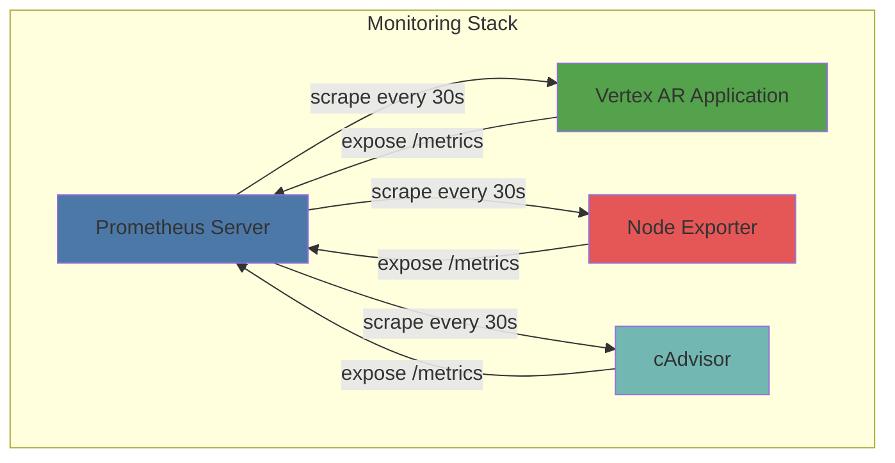
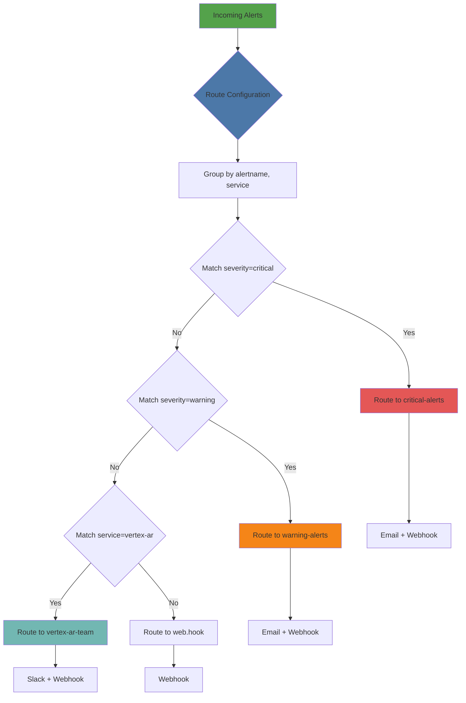
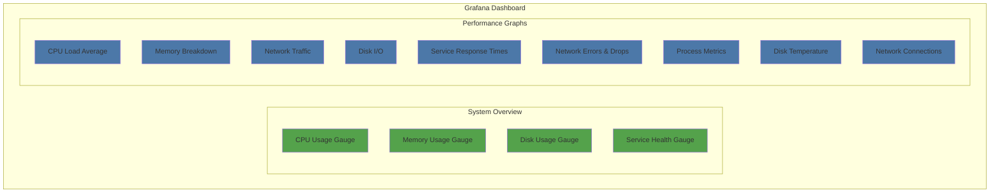
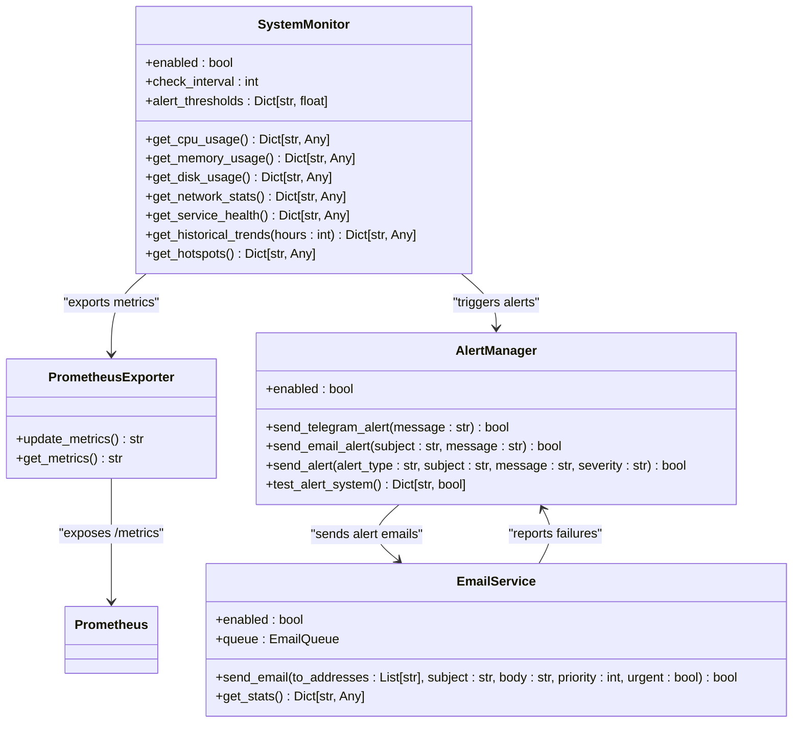
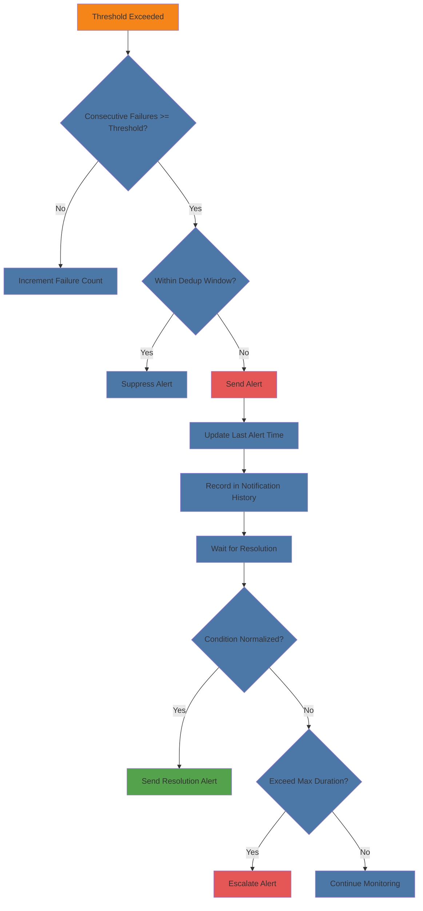

# Monitoring & Observability

<cite>
**Referenced Files in This Document**   
- [prometheus.yml](file://monitoring/prometheus.yml)
- [alertmanager.yml](file://monitoring/alertmanager.yml)
- [alert_rules.yml](file://monitoring/alert_rules.yml)
- [grafana-dashboard.json](file://monitoring/grafana-dashboard.json)
- [docker-compose.monitoring.yml](file://docker-compose.monitoring.yml)
- [setup-monitoring.sh](file://setup-monitoring.sh)
- [app/prometheus_metrics.py](file://vertex-ar/app/prometheus_metrics.py)
- [app/monitoring.py](file://vertex-ar/app/monitoring.py)
- [app/api/monitoring.py](file://vertex-ar/app/api/monitoring.py)
- [app/alerting.py](file://vertex-ar/app/alerting.py)
- [app/email_service.py](file://vertex-ar/app/email_service.py)
- [app/config.py](file://vertex-ar/app/config.py)
- [docs/monitoring/comprehensive.md](file://docs/monitoring/comprehensive.md)
- [docs/monitoring/setup.md](file://docs/monitoring/setup.md)
- [docs/monitoring/implementation.md](file://docs/monitoring/implementation.md)
</cite>

## Table of Contents
1. [Introduction](#introduction)
2. [Prometheus Metrics and Scraping Configuration](#prometheus-metrics-and-scraping-configuration)
3. [Alertmanager Configuration and Alert Routing](#alertmanager-configuration-and-alert-routing)
4. [Grafana Dashboard Setup and Key Visualizations](#grafana-dashboard-setup-and-key-visualizations)
5. [Application-Level Monitoring and Error Tracking](#application-level-monitoring-and-error-tracking)
6. [Log Management and Centralized Logging](#log-management-and-centralized-logging)
7. [Alert Deduplication and Incident Management](#alert-deduplication-and-incident-management)
8. [Extending the Monitoring Stack](#extending-the-monitoring-stack)
9. [Conclusion](#conclusion)

## Introduction

The Vertex AR monitoring and observability system provides comprehensive visibility into application health, performance, and operational status. The system integrates Prometheus for metrics collection, Alertmanager for alert routing, and Grafana for visualization, creating a robust observability stack. This documentation details the complete monitoring infrastructure, including metrics exposure, alert configuration, dashboard setup, and incident management workflows. The system monitors critical infrastructure components including CPU, memory, disk usage, network performance, and service health, with automated alerting through multiple channels when thresholds are exceeded.

**Section sources**
- [docs/monitoring/comprehensive.md](file://docs/monitoring/comprehensive.md#L1-L537)
- [docs/monitoring/implementation.md](file://docs/monitoring/implementation.md#L1-L426)

## Prometheus Metrics and Scraping Configuration

The monitoring system exposes comprehensive metrics in Prometheus format through the `/metrics` endpoint, which is scraped every 30 seconds. The system exports over 50 metrics covering CPU usage, memory consumption, disk utilization, network statistics, service health, and application performance. Custom metrics follow the naming convention `vertex_ar_<metric_name>` and include detailed labels for dimensional analysis.

Key metrics include:
- `vertex_ar_cpu_usage_percent`: CPU usage percentage by core
- `vertex_ar_memory_usage_percent`: Memory usage percentage for virtual and swap memory
- `vertex_ar_disk_usage_percent`: Disk usage percentage for storage mount points
- `vertex_ar_service_health`: Service health status (1=healthy, 0=unhealthy)
- `vertex_ar_service_response_time_ms`: Service response time in milliseconds
- `vertex_ar_network_errors_total`: Network errors counter
- `vertex_ar_process_memory_bytes`: Process memory usage in bytes

The Prometheus configuration in `prometheus.yml` defines scraping jobs for the Vertex AR application, Prometheus itself, and optional exporters for system metrics (node-exporter), container metrics (cAdvisor), PostgreSQL, and Redis. The scraping interval is set to 30 seconds for the application, with a scrape timeout of 10 seconds to prevent hanging requests.



**Diagram sources**
- [prometheus.yml](file://monitoring/prometheus.yml#L1-L51)
- [app/prometheus_metrics.py](file://vertex-ar/app/prometheus_metrics.py#L1-L262)

**Section sources**
- [prometheus.yml](file://monitoring/prometheus.yml#L1-L51)
- [app/prometheus_metrics.py](file://vertex-ar/app/prometheus_metrics.py#L1-L262)
- [docs/monitoring/comprehensive.md](file://docs/monitoring/comprehensive.md#L221-L241)

## Alertmanager Configuration and Alert Routing

The Alertmanager configuration in `alertmanager.yml` defines a sophisticated alert routing system with multiple notification channels, deduplication, and escalation policies. The system routes alerts based on severity and service type, with different notification strategies for critical, warning, and service-specific alerts.

The routing configuration groups alerts by `alertname` and `service`, with a 10-second group wait time and 10-second group interval. Critical alerts (severity: critical) are routed to the `critical-alerts` receiver with a 5-second group wait and 30-minute repeat interval, ensuring rapid response to severe issues. Warning alerts (severity: warning) are routed to the `warning-alerts` receiver with a 2-hour repeat interval to prevent notification fatigue.

Notification channels include:
- **Email**: Critical alerts are sent to admin@vertex-ar.example.com with detailed descriptions
- **Webhook**: All alerts are forwarded to the application's webhook endpoint for internal processing
- **Slack**: Service-specific alerts for the vertex-ar team are sent to the #vertex-ar-alerts channel

The configuration also includes inhibition rules that suppress warning alerts when a critical alert for the same alertname and service is active, preventing redundant notifications. Time intervals are defined for business hours (Monday-Friday, 09:00-17:00) and weekends, allowing for different alerting policies during different times.



**Diagram sources**
- [alertmanager.yml](file://monitoring/alertmanager.yml#L1-L97)
- [docs/monitoring/comprehensive.md](file://docs/monitoring/comprehensive.md#L319-L327)

**Section sources**
- [alertmanager.yml](file://monitoring/alertmanager.yml#L1-L97)
- [docs/monitoring/comprehensive.md](file://docs/monitoring/comprehensive.md#L297-L318)

## Grafana Dashboard Setup and Key Visualizations

The Grafana dashboard, defined in `grafana-dashboard.json`, provides a comprehensive view of system health with 13 panels organized into logical groups. The dashboard is automatically provisioned when the monitoring stack starts and is accessible at http://localhost:3000 with the default credentials (admin/admin123).

Key visualizations include:

**System Overview Panels:**
- CPU Usage: Gauge showing current CPU usage percentage with green/yellow/red thresholds at 70%/90%
- Memory Usage: Gauge showing virtual memory usage percentage with green/yellow/red thresholds at 80%/95%
- Disk Usage: Gauge showing storage disk usage percentage with green/yellow/red thresholds at 85%/95%
- Service Health: Gauge showing average service health (1=healthy, 0=unhealthy)

**Performance Graphs:**
- CPU Load Average: Graph showing 1-minute, 5-minute, and 15-minute load averages
- Memory Breakdown: Graph showing memory usage by type (used, available, total, swap)
- Network Traffic: Graph showing network bytes per second by interface and direction
- Disk I/O: Graph showing disk I/O bytes per second by read/write direction
- Service Response Times: Graph showing response times in milliseconds for all services
- Network Errors & Drops: Graph showing error and drop rates for network interfaces
- Process Metrics: Graph showing process CPU percentage and RSS memory usage
- Disk Temperature: Graph showing disk temperature in Celsius by device
- Network Connections: Graph showing network connections by status (ESTABLISHED, LISTEN, etc.)

The dashboard refreshes every 30 seconds and displays data from the last hour by default, providing real-time visibility into system performance. Each panel includes appropriate thresholds and color coding to quickly identify potential issues.



**Diagram sources**
- [grafana-dashboard.json](file://monitoring/grafana-dashboard.json#L1-L257)
- [docker-compose.monitoring.yml](file://docker-compose.monitoring.yml#L39-L53)

**Section sources**
- [grafana-dashboard.json](file://monitoring/grafana-dashboard.json#L1-L257)
- [docs/monitoring/comprehensive.md](file://docs/monitoring/comprehensive.md#L328-L345)

## Application-Level Monitoring and Error Tracking

Application-level monitoring is implemented through the `SystemMonitor` class in `app/monitoring.py`, which collects comprehensive system metrics and performs health checks. The system monitors CPU usage, memory consumption, disk utilization, network performance, and service health, with configurable thresholds for alerting.

The monitoring system includes deep diagnostics capabilities:
- **Process monitoring**: Tracks CPU and memory usage for individual processes
- **Slow query detection**: Identifies database queries exceeding configurable thresholds
- **Slow endpoint tracking**: Monitors HTTP endpoints with response times above thresholds
- **Memory leak detection**: Uses tracemalloc to capture memory snapshots when thresholds are exceeded
- **Historical trend analysis**: Maintains time-series data for trend detection and anomaly detection

The `PrometheusExporter` class in `app/prometheus_metrics.py` exposes these metrics in Prometheus format, making them available for scraping. The system updates metrics every 30 seconds, balancing freshness with performance overhead.

Application error tracking is integrated with the alerting system, which captures and reports errors through multiple channels. The email service includes comprehensive monitoring with queue depth tracking, failure rate analysis, and retry histograms. The system also tracks recent errors in log files and includes this information in alerts and reports.



**Diagram sources**
- [app/monitoring.py](file://vertex-ar/app/monitoring.py#L1-L1704)
- [app/prometheus_metrics.py](file://vertex-ar/app/prometheus_metrics.py#L1-L262)
- [app/alerting.py](file://vertex-ar/app/alerting.py#L1-L383)
- [app/email_service.py](file://vertex-ar/app/email_service.py#L1-L627)

**Section sources**
- [app/monitoring.py](file://vertex-ar/app/monitoring.py#L1-L1704)
- [app/prometheus_metrics.py](file://vertex-ar/app/prometheus_metrics.py#L1-L262)
- [app/alerting.py](file://vertex-ar/app/alerting.py#L1-L383)

## Log Management and Centralized Logging

The monitoring system implements comprehensive log management with centralized logging configuration. Log rotation is configured through the `setup-monitoring.sh` script, which creates a logrotate configuration that rotates logs daily and keeps 30 days of history. This prevents log files from consuming excessive disk space while maintaining sufficient history for troubleshooting.

The system uses structured logging with the `logging_setup.py` module, which configures loggers with appropriate levels and formats. Error messages are logged with stack traces when appropriate, and key events such as alert triggers and system health checks are logged at the INFO level.

Application logs are stored in the `logs/` directory and include:
- Application logs: General application events and errors
- Monitoring logs: System health checks and alerting events
- Email service logs: Email queue processing and delivery attempts
- Backup logs: Backup operations and results

The log management strategy includes:
- **Log rotation**: Daily rotation with 30-day retention
- **Compression**: Compressed rotated logs to save space
- **Permissions**: Secure file permissions (644) for log files
- **Centralized location**: All logs stored in the `logs/` directory
- **Structured format**: JSON-like formatting for easy parsing

The system also integrates with external monitoring tools through the exposed metrics and webhook endpoints, allowing logs and metrics to be forwarded to centralized logging solutions like ELK stack or Splunk.

**Section sources**
- [setup-monitoring.sh](file://setup-monitoring.sh#L166-L185)
- [app/monitoring.py](file://vertex-ar/app/monitoring.py#L1-L1704)
- [logging_setup.py](file://vertex-ar/logging_setup.py)

## Alert Deduplication and Incident Management

The monitoring system implements sophisticated alert deduplication and incident management workflows to prevent alert fatigue and ensure effective incident response. The deduplication system uses multiple mechanisms to avoid sending redundant notifications.

Key deduplication features:
- **Consecutive failure threshold**: Alerts require a configurable number of consecutive failures (default: 3) before being escalated
- **Deduplication window**: Similar alerts are suppressed within a configurable time window (default: 300 seconds)
- **Cooldown period**: The same alert type cannot be sent more frequently than the cooldown interval (5 minutes)
- **Alert recovery**: Alerts automatically resolve when conditions return to normal, with a configurable recovery window

The incident management workflow includes:
1. **Detection**: System monitors detect threshold violations
2. **Validation**: Consecutive failures are counted to confirm issues
3. **Alerting**: Notifications are sent through configured channels (email, Telegram, Slack)
4. **Escalation**: Unacknowledged critical alerts can be escalated to additional contacts
5. **Resolution**: Alerts automatically resolve when conditions improve
6. **Documentation**: All alerts and responses are logged for audit and analysis

The system also includes a manual override capability through the admin API, allowing administrators to:
- Test alert channels
- Send test alerts
- Manually trigger health checks
- View recent alerts
- Update alert thresholds

This comprehensive approach ensures that alerts are meaningful, actionable, and focused on genuine issues rather than transient fluctuations.



**Diagram sources**
- [app/monitoring.py](file://vertex-ar/app/monitoring.py#L152-L217)
- [app/alerting.py](file://vertex-ar/app/alerting.py#L218-L227)

**Section sources**
- [app/monitoring.py](file://vertex-ar/app/monitoring.py#L1-L1704)
- [app/alerting.py](file://vertex-ar/app/alerting.py#L1-L383)
- [app/config.py](file://vertex-ar/app/config.py#L1-L244)

## Extending the Monitoring Stack

The monitoring stack can be extended through several mechanisms to meet specific operational requirements. The system is designed with extensibility in mind, allowing for custom dashboards, additional metrics, and integration with external systems.

**Creating Custom Dashboards:**
1. Export existing dashboard JSON from Grafana
2. Modify panels, queries, and visualizations as needed
3. Save to `monitoring/` directory with `.json` extension
4. The dashboard will be automatically provisioned on startup

**Adding Custom Metrics:**
1. Define new metrics in `app/prometheus_metrics.py` using appropriate metric types (Gauge, Counter, Histogram)
2. Register metrics with the global registry
3. Update the `update_metrics` method to populate values
4. Create corresponding alert rules in `alert_rules.yml`

**Extending Alert Rules:**
Custom alert rules can be added to `alert_rules.yml` following the Prometheus rule format:
```yaml
- alert: CustomAlertName
  expr: custom_metric_name > threshold
  for: 5m
  labels:
    severity: warning
    service: vertex-ar
  annotations:
    summary: "Custom alert triggered"
    description: "Custom metric {{ $value }} exceeded threshold"
```

**Integrating External Systems:**
The system can integrate with external monitoring tools through:
- **Webhooks**: Configure webhook URLs in environment variables to forward alerts
- **Prometheus federation**: Scrape metrics from other Prometheus servers
- **Remote write**: Send metrics to remote storage systems
- **API integrations**: Use the monitoring API endpoints for custom integrations

The `docker-compose.monitoring.yml` file can be extended to include additional monitoring components such as:
- PostgreSQL exporter for database metrics
- Redis exporter for cache metrics
- Custom exporters for business metrics
- Additional Grafana data sources

This extensible architecture allows the monitoring stack to grow with the application, providing comprehensive observability across all components and services.

**Section sources**
- [docker-compose.monitoring.yml](file://docker-compose.monitoring.yml#L1-L132)
- [alert_rules.yml](file://monitoring/alert_rules.yml#L1-L210)
- [app/prometheus_metrics.py](file://vertex-ar/app/prometheus_metrics.py#L1-L262)
- [setup-monitoring.sh](file://setup-monitoring.sh#L1-L282)

## Conclusion

The Vertex AR monitoring and observability system provides a comprehensive solution for monitoring application health, performance, and operational status. The integrated stack of Prometheus, Alertmanager, and Grafana offers robust metrics collection, intelligent alerting, and insightful visualizations. The system's extensible architecture allows for customization and growth, ensuring it can meet evolving monitoring requirements.

Key strengths of the system include:
- Comprehensive coverage of system and application metrics
- Intelligent alerting with deduplication and escalation policies
- Real-time visualization through customizable dashboards
- Multiple notification channels for reliable alert delivery
- Extensible architecture for custom metrics and integrations
- Automated setup and configuration through scripts

The monitoring system is production-ready and provides the visibility needed to maintain high availability and performance. By implementing the practices and configurations documented here, operations teams can ensure the reliable operation of the Vertex AR application and respond effectively to any issues that arise.

**Section sources**
- [docs/monitoring/comprehensive.md](file://docs/monitoring/comprehensive.md#L535-L537)
- [docs/monitoring/implementation.md](file://docs/monitoring/implementation.md#L192-L192)