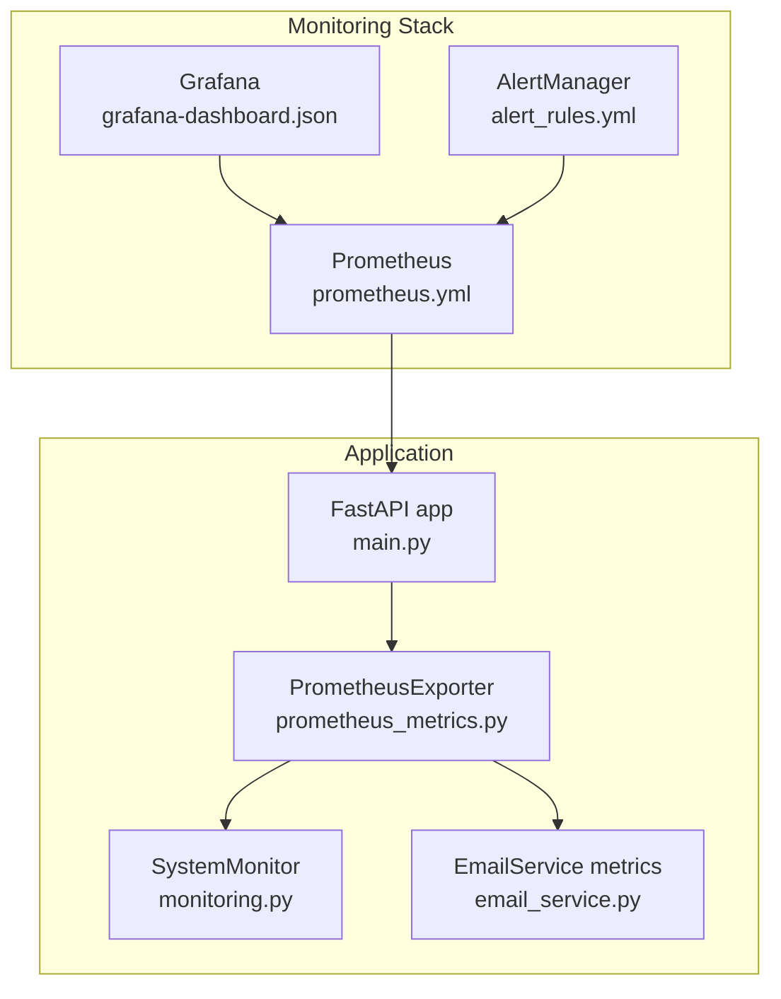
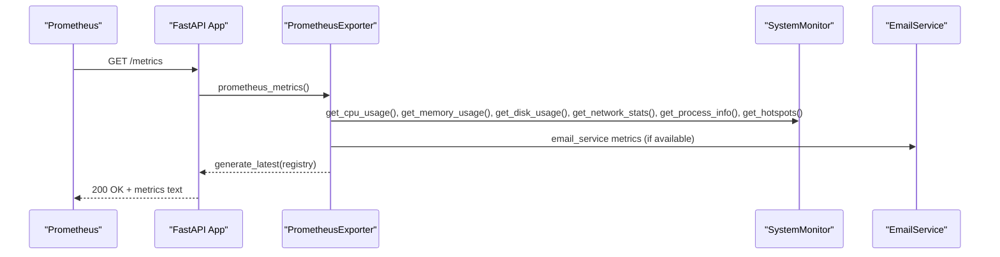
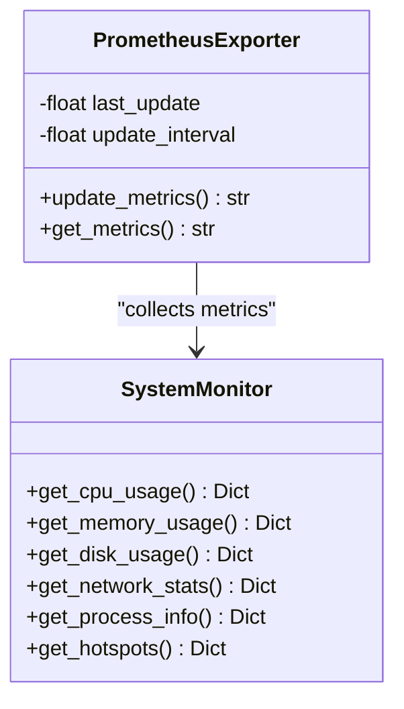
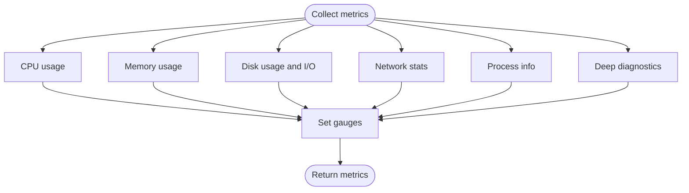
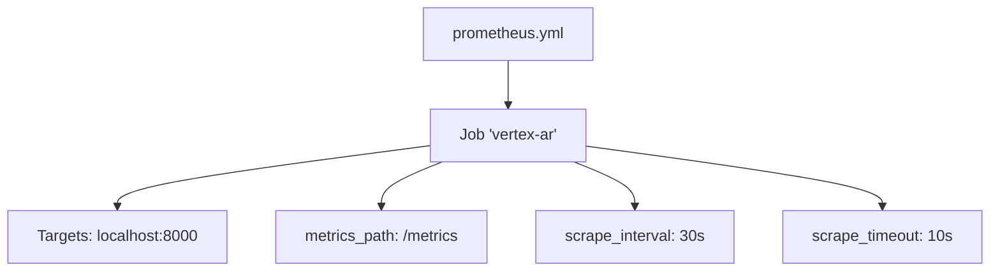
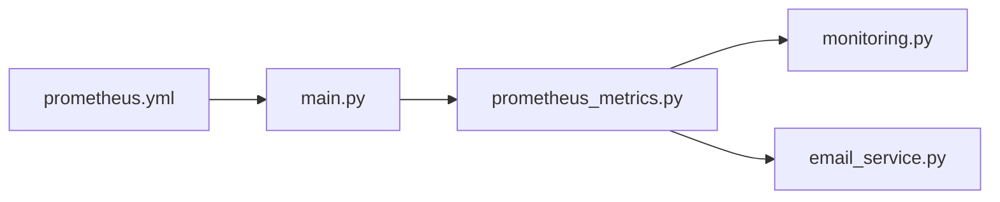

# Prometheus Metrics Export

<cite>
**Referenced Files in This Document**
- [prometheus_metrics.py](file://vertex-ar/app/prometheus_metrics.py)
- [monitoring.py](file://vertex-ar/app/monitoring.py)
- [main.py](file://vertex-ar/app/main.py)
- [prometheus.yml](file://monitoring/prometheus.yml)
- [alert_rules.yml](file://monitoring/alert_rules.yml)
- [grafana-dashboard.json](file://monitoring/grafana-dashboard.json)
- [email_service.py](file://vertex-ar/app/email_service.py)
- [config.py](file://vertex-ar/app/config.py)
- [database.py](file://vertex-ar/app/database.py)
- [monitoring.py (admin API)](file://vertex-ar/app/api/monitoring.py)
</cite>

## Table of Contents
1. [Introduction](#introduction)
2. [Project Structure](#project-structure)
3. [Core Components](#core-components)
4. [Architecture Overview](#architecture-overview)
5. [Detailed Component Analysis](#detailed-component-analysis)
6. [Dependency Analysis](#dependency-analysis)
7. [Performance Considerations](#performance-considerations)
8. [Troubleshooting Guide](#troubleshooting-guide)
9. [Conclusion](#conclusion)
10. [Appendices](#appendices)

## Introduction
This document explains the Prometheus metrics export system for the Vertex AR application. It covers all exported metrics (system-level CPU, memory, disk, network), service health, application performance, and deep diagnostics metrics. It also documents metric naming conventions, label structures, data types, update intervals, and collection mechanisms. Guidance is included for configuring Prometheus to scrape the application, creating custom queries and alerts, and troubleshooting common issues.

## Project Structure
The metrics system is implemented as a dedicated exporter that serves Prometheus-compatible metrics at the application’s /metrics endpoint. It integrates with the internal SystemMonitor to collect system and application telemetry, and it exposes both core system metrics and deep diagnostics.

**Diagram sources**
- [main.py](file://vertex-ar/app/main.py#L185-L196)
- [prometheus_metrics.py](file://vertex-ar/app/prometheus_metrics.py#L75-L262)
- [monitoring.py](file://vertex-ar/app/monitoring.py#L21-L120)
- [email_service.py](file://vertex-ar/app/email_service.py#L192-L220)
- [prometheus.yml](file://monitoring/prometheus.yml#L16-L23)
- [alert_rules.yml](file://monitoring/alert_rules.yml#L1-L200)
- [grafana-dashboard.json](file://monitoring/grafana-dashboard.json#L1-L257)

**Section sources**
- [main.py](file://vertex-ar/app/main.py#L185-L196)
- [prometheus_metrics.py](file://vertex-ar/app/prometheus_metrics.py#L75-L262)
- [monitoring.py](file://vertex-ar/app/monitoring.py#L21-L120)
- [prometheus.yml](file://monitoring/prometheus.yml#L16-L23)

## Core Components
- PrometheusExporter: Collects and exports metrics in Prometheus format at /metrics.
- SystemMonitor: Provides system telemetry (CPU, memory, disk, network, service health, process info) and deep diagnostics (slow queries/endpoints, memory snapshots, process trends).
- EmailService: Registers Prometheus metrics for email queue and delivery analytics.
- Prometheus configuration: Defines jobs and scrape intervals for the application and optional exporters.

Key metrics exported include:
- System-level: CPU usage percent, load averages, per-core usage; memory usage bytes and percent; disk usage bytes/percent/io and latency; network bytes/packets/errors/drops and connections; disk temperature.
- Service health: Health status and response time per service.
- Application: Process memory bytes, CPU percent, threads.
- Alerts: Total alerts and active alerts by severity.
- Deep diagnostics: Slow queries and endpoints counts and durations, memory snapshots count, process history and trends.

**Section sources**
- [prometheus_metrics.py](file://vertex-ar/app/prometheus_metrics.py#L26-L73)
- [monitoring.py](file://vertex-ar/app/monitoring.py#L218-L800)
- [email_service.py](file://vertex-ar/app/email_service.py#L192-L220)

## Architecture Overview
The application exposes a /metrics endpoint that returns Prometheus-formatted text. Prometheus scrapes the application according to the configuration, and Grafana dashboards visualize the metrics. Alert rules define conditions that trigger alerts.

**Diagram sources**
- [main.py](file://vertex-ar/app/main.py#L185-L196)
- [prometheus_metrics.py](file://vertex-ar/app/prometheus_metrics.py#L256-L262)
- [monitoring.py](file://vertex-ar/app/monitoring.py#L218-L800)
- [email_service.py](file://vertex-ar/app/email_service.py#L612-L623)

## Detailed Component Analysis

### PrometheusExporter
- Responsibilities:
  - Maintains a custom registry for Vertex AR metrics.
  - Defines gauges/counters for system, service, application, alert, temperature, trend, and deep diagnostics metrics.
  - Updates metrics periodically (every 30 seconds) by calling SystemMonitor methods and setting metric values.
  - Returns Prometheus-formatted text via generate_latest(registry).
- Update interval: 30 seconds.
- Data types:
  - Gauges for instantaneous values (percent, bytes, ms, counts).
  - Counters for cumulative totals (when applicable).
- Labels:
  - Core: per-core CPU usage.
  - Type: memory usage type (used/available/total/swap_used/swap_total), disk usage type (used/free/total), direction (read/write), status (connection states).
  - Service: service name.
  - Period: load average periods (1min/5min/15min).
  - Device/mountpoint: disk devices and mount points.
  - PID: process identifier for trends.

**Diagram sources**
- [prometheus_metrics.py](file://vertex-ar/app/prometheus_metrics.py#L75-L262)
- [monitoring.py](file://vertex-ar/app/monitoring.py#L218-L800)

**Section sources**
- [prometheus_metrics.py](file://vertex-ar/app/prometheus_metrics.py#L75-L262)

### SystemMonitor
- Provides comprehensive system telemetry:
  - CPU: percent, load averages, per-core usage, top processes.
  - Memory: virtual and swap usage, top memory processes.
  - Disk: storage usage, partitions, I/O stats, latency, temperature.
  - Network: total and per-interface counters, errors/drops, connections by status.
  - Process: current process CPU/memory/threads.
  - Deep diagnostics: slow queries/endpoints, memory snapshots, process history trends.
- Configuration:
  - Thresholds and intervals are loaded from settings and can be persisted to the database.
  - Tracemalloc-based memory snapshots can be enabled for leak detection.

**Diagram sources**
- [monitoring.py](file://vertex-ar/app/monitoring.py#L218-L800)
- [prometheus_metrics.py](file://vertex-ar/app/prometheus_metrics.py#L90-L247)

**Section sources**
- [monitoring.py](file://vertex-ar/app/monitoring.py#L218-L800)

### EmailService Metrics
- EmailService registers Prometheus metrics in a custom registry and exposes a snapshot of metrics via API.
- Metrics include sent/failed totals, queue depth, pending, failed counts, and send duration histograms.
- These metrics are also included in the application’s /metrics output when the email service is available.

**Section sources**
- [email_service.py](file://vertex-ar/app/email_service.py#L192-L220)
- [email_service.py](file://vertex-ar/app/email_service.py#L612-L623)

### Metrics Catalog and Naming Conventions
- Metric families and labels:
  - vertex_ar_cpu_usage_percent: Gauge, labels: core.
  - vertex_ar_cpu_overall_percent: Gauge.
  - vertex_ar_cpu_load_average: Gauge, labels: period.
  - vertex_ar_memory_usage_bytes: Gauge, labels: type.
  - vertex_ar_memory_usage_percent: Gauge, labels: type.
  - vertex_ar_disk_usage_bytes: Gauge, labels: mountpoint, type.
  - vertex_ar_disk_usage_percent: Gauge, labels: mountpoint.
  - vertex_ar_disk_io_bytes: Gauge, labels: direction.
  - vertex_ar_disk_io_count: Gauge, labels: direction.
  - vertex_ar_disk_latency_ms: Gauge, labels: direction.
  - vertex_ar_disk_temperature_celsius: Gauge, labels: device.
  - vertex_ar_network_bytes_total: Gauge, labels: interface, direction.
  - vertex_ar_network_packets_total: Gauge, labels: interface, direction.
  - vertex_ar_network_errors_total: Gauge, labels: interface, direction.
  - vertex_ar_network_drops_total: Gauge, labels: interface, direction.
  - vertex_ar_network_connections: Gauge, labels: status.
  - vertex_ar_service_health: Gauge, labels: service.
  - vertex_ar_service_response_time_ms: Gauge, labels: service.
  - vertex_ar_process_memory_bytes: Gauge, labels: type.
  - vertex_ar_process_cpu_percent: Gauge.
  - vertex_ar_process_threads: Gauge.
  - vertex_ar_alerts_total: Counter, labels: type, severity.
  - vertex_ar_active_alerts: Gauge, labels: severity.
  - vertex_ar_metric_trend: Gauge, labels: metric.
  - vertex_ar_slow_queries_count: Gauge.
  - vertex_ar_slow_queries_slowest_ms: Gauge.
  - vertex_ar_slow_endpoints_count: Gauge.
  - vertex_ar_slow_endpoints_slowest_ms: Gauge.
  - vertex_ar_memory_snapshots_count: Gauge.
  - vertex_ar_process_history_count: Gauge.
  - vertex_ar_process_trend_cpu_avg: Gauge, labels: pid.
  - vertex_ar_process_trend_rss_mb: Gauge, labels: pid.
- Data types:
  - Gauges: instantaneous values (percent, bytes, ms, counts).
  - Counters: cumulative totals (when applicable).
- Label semantics:
  - Direction: read/write.
  - Type: used/available/total/swap_used/swap_total for memory; used/free/total for disk.
  - Period: 1min/5min/15min for load average.
  - Status: connection states (e.g., ESTABLISHED).
  - Service: core services and external services.
  - Mountpoint: filesystem mount points.
  - Device: disk devices.
  - PID: process identifiers.

**Section sources**
- [prometheus_metrics.py](file://vertex-ar/app/prometheus_metrics.py#L26-L73)

### Update Interval and Collection Mechanism
- Update interval: 30 seconds.
- Collection mechanism:
  - Prometheus scrapes the application at a configured interval (default 30s).
  - The exporter checks the last update time and refreshes metrics if the interval has elapsed.
  - Metrics are served as plain text with the appropriate Prometheus content-type.

**Section sources**
- [prometheus_metrics.py](file://vertex-ar/app/prometheus_metrics.py#L75-L90)
- [prometheus.yml](file://monitoring/prometheus.yml#L16-L23)

### Example Metrics
- vertex_ar_cpu_usage_percent: Instantaneous CPU usage per core.
- vertex_ar_memory_usage_bytes: Memory usage broken down by type (used/available/total/swap).
- vertex_ar_slow_queries_count: Number of tracked slow database queries.
- vertex_ar_slow_endpoints_slowest_ms: Duration of the slowest tracked HTTP endpoint in milliseconds.

These metrics are updated by SystemMonitor and exposed via PrometheusExporter.

**Section sources**
- [prometheus_metrics.py](file://vertex-ar/app/prometheus_metrics.py#L90-L247)
- [monitoring.py](file://vertex-ar/app/monitoring.py#L218-L800)

### Configuration for Prometheus Scraping
- Job configuration:
  - Job name: vertex-ar
  - Targets: localhost:8000
  - metrics_path: /metrics
  - scrape_interval: 30s
  - scrape_timeout: 10s
- Additional optional jobs:
  - Prometheus self-monitoring, Node Exporter, cAdvisor, PostgreSQL Exporter, Redis Exporter.

**Diagram sources**
- [prometheus.yml](file://monitoring/prometheus.yml#L16-L23)

**Section sources**
- [prometheus.yml](file://monitoring/prometheus.yml#L16-L23)

### Creating Custom Queries and Alerts
- Grafana dashboards:
  - CPU usage, memory breakdown, network traffic, disk I/O, service response times, network errors/drops, process metrics, disk temperature, network connections.
- Example PromQL queries:
  - CPU usage percent: vertex_ar_cpu_usage_percent
  - Memory percent (virtual): vertex_ar_memory_usage_percent{type="virtual"}
  - Network error rate: rate(vertex_ar_network_errors_total[5m])
  - Process RSS memory: vertex_ar_process_memory_bytes{type="rss"}
  - Disk temperature: vertex_ar_disk_temperature_celsius
  - Network connections by status: vertex_ar_network_connections
- Example alert rules:
  - High CPU usage: vertex_ar_cpu_usage_percent > 80 for 5m
  - Critical CPU usage: vertex_ar_cpu_usage_percent > 95 for 2m
  - High memory usage (virtual): vertex_ar_memory_usage_percent{type="virtual"} > 85 for 5m
  - Critical memory usage (virtual): vertex_ar_memory_usage_percent{type="virtual"} > 95 for 2m
  - High disk usage: vertex_ar_disk_usage_percent > 85 for 5m
  - Critical disk usage: vertex_ar_disk_usage_percent > 95 for 2m
  - High disk temperature: vertex_ar_disk_temperature_celsius > 60 for 5m
  - Critical disk temperature: vertex_ar_disk_temperature_celsius > 70 for 2m
  - Service down: vertex_ar_service_health == 0 for 1m
  - Service slow response: vertex_ar_service_response_time_ms > 5000 for 5m
  - Database slow response: vertex_ar_service_response_time_ms{service="database"} > 1000 for 5m
  - High network error rate: rate(vertex_ar_network_errors_total[5m]) > 10 for 5m
  - High network drop rate: rate(vertex_ar_network_drops_total[5m]) > 5 for 5m
  - Process high memory usage: vertex_ar_process_memory_bytes{type="rss"} > 2GiB for 10m
  - Too many connections: sum(vertex_ar_network_connections{status="ESTABLISHED"}) > 1000 for 10m
  - CPU increasing trend: vertex_ar_metric_trend{metric="cpu"} > 0.5 for 30m
  - Memory increasing trend: vertex_ar_metric_trend{metric="memory"} > 0.5 for 30m

**Section sources**
- [alert_rules.yml](file://monitoring/alert_rules.yml#L1-L200)
- [grafana-dashboard.json](file://monitoring/grafana-dashboard.json#L95-L257)

## Dependency Analysis
- PrometheusExporter depends on SystemMonitor for telemetry and on the email service for additional metrics.
- The application mounts the /metrics endpoint via FastAPI instrumentation and a custom route.
- Prometheus configuration defines the scraping job for the application.

**Diagram sources**
- [prometheus_metrics.py](file://vertex-ar/app/prometheus_metrics.py#L75-L262)
- [monitoring.py](file://vertex-ar/app/monitoring.py#L218-L800)
- [email_service.py](file://vertex-ar/app/email_service.py#L192-L220)
- [main.py](file://vertex-ar/app/main.py#L185-L196)
- [prometheus.yml](file://monitoring/prometheus.yml#L16-L23)

**Section sources**
- [prometheus_metrics.py](file://vertex-ar/app/prometheus_metrics.py#L75-L262)
- [monitoring.py](file://vertex-ar/app/monitoring.py#L218-L800)
- [email_service.py](file://vertex-ar/app/email_service.py#L192-L220)
- [main.py](file://vertex-ar/app/main.py#L185-L196)
- [prometheus.yml](file://monitoring/prometheus.yml#L16-L23)

## Performance Considerations
- Update interval: 30 seconds balances freshness and overhead.
- SystemMonitor collects metrics using psutil and OS APIs; ensure these calls are not overly frequent to avoid contention.
- Deep diagnostics (slow queries/endpoints, memory snapshots) add overhead; enable only when needed for troubleshooting.
- Prometheus scrape interval should align with update interval to minimize redundant work.

[No sources needed since this section provides general guidance]

## Troubleshooting Guide
- Metrics not appearing:
  - Verify the /metrics endpoint is reachable and returns text/plain content.
  - Confirm Prometheus job targets localhost:8000 and metrics_path is /metrics.
- Missing metrics:
  - Some metrics depend on availability (e.g., disk temperature, email service). If unavailable, labels may be empty or metrics absent.
- High CPU usage alerts firing intermittently:
  - Check load averages and per-core usage; investigate top processes.
- High memory usage:
  - Review virtual and swap usage; check top memory processes.
- Disk I/O anomalies:
  - Inspect read/write bytes and latency; check partition usage.
- Network errors/drops:
  - Monitor error and drop rates per interface; review connection statuses.
- Service health issues:
  - Check service health and response times; verify external service connectivity.
- Deep diagnostics:
  - Enable tracemalloc for memory snapshots when investigating leaks; adjust thresholds appropriately.
- Configuration:
  - Adjust thresholds and intervals via admin endpoints or environment variables; persisted settings override defaults.

**Section sources**
- [prometheus.yml](file://monitoring/prometheus.yml#L16-L23)
- [monitoring.py](file://vertex-ar/app/monitoring.py#L218-L800)
- [monitoring.py (admin API)](file://vertex-ar/app/api/monitoring.py#L71-L117)
- [config.py](file://vertex-ar/app/config.py#L123-L138)
- [database.py](file://vertex-ar/app/database.py#L3683-L3768)

## Conclusion
The Vertex AR Prometheus metrics export system provides comprehensive visibility into system resources, service health, application performance, and deep diagnostics. With clear naming conventions, structured labels, and configurable thresholds, operators can build robust monitoring and alerting. Prometheus configuration is straightforward, and Grafana dashboards offer ready-to-use visualizations. Use the troubleshooting guidance to diagnose and resolve common issues quickly.

[No sources needed since this section summarizes without analyzing specific files]

## Appendices

### Appendix A: Admin API for Monitoring and Diagnostics
- /admin/monitoring/metrics: Returns current system metrics.
- /admin/monitoring/detailed-metrics: Returns detailed metrics with trends.
- /admin/monitoring/trends: Returns historical trends.
- /admin/monitoring/hotspots: Returns deep diagnostics (slow queries/endpoints, memory snapshots, process trends).
- /admin/monitoring/email-stats: Returns email service statistics and Prometheus metrics snapshot.

**Section sources**
- [monitoring.py (admin API)](file://vertex-ar/app/api/monitoring.py#L140-L267)
- [monitoring.py (admin API)](file://vertex-ar/app/api/monitoring.py#L616-L721)

### Appendix B: Monitoring Settings Persistence
- Default thresholds and intervals are loaded from environment variables and seeded into the database.
- Runtime updates can be persisted to the database via admin endpoints.

**Section sources**
- [config.py](file://vertex-ar/app/config.py#L123-L138)
- [database.py](file://vertex-ar/app/database.py#L3642-L3768)
- [monitoring.py (admin API)](file://vertex-ar/app/api/monitoring.py#L367-L433)
- [monitoring.py (admin API)](file://vertex-ar/app/api/monitoring.py#L503-L559)