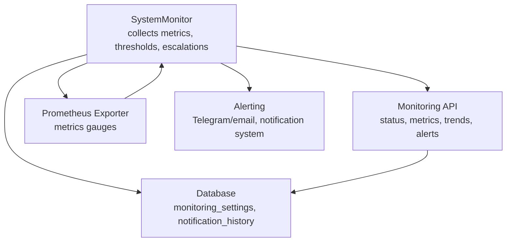
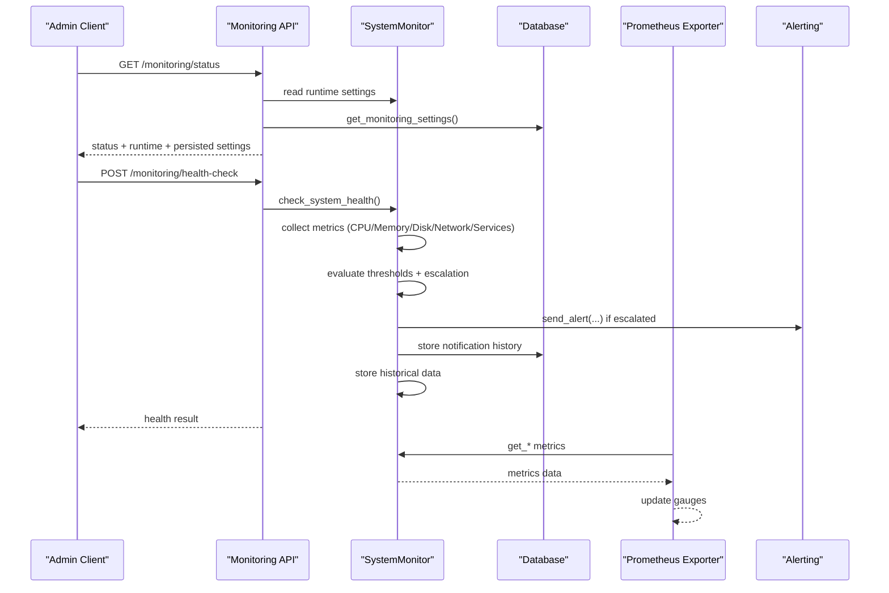
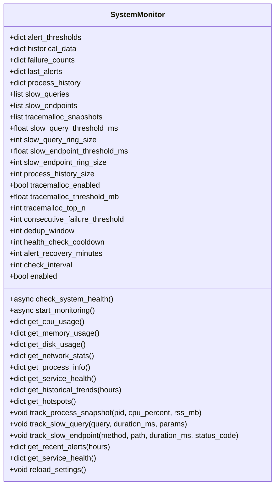
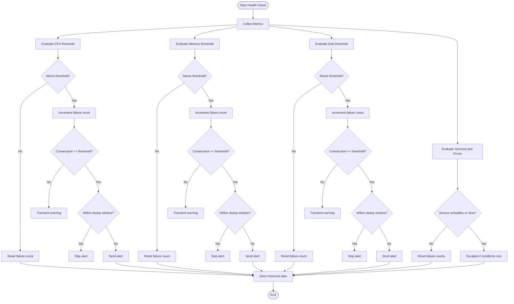
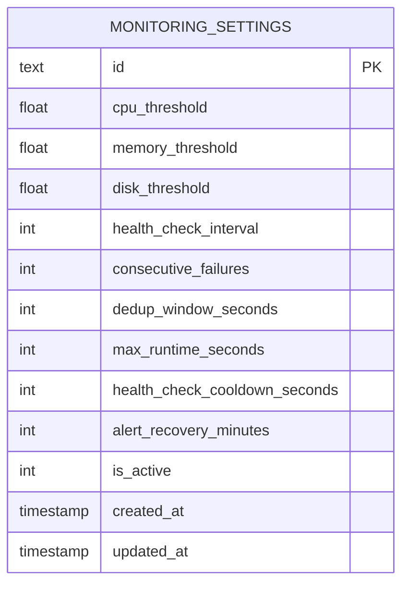
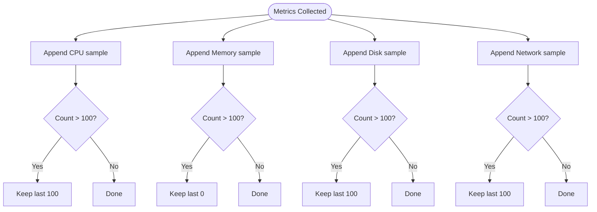
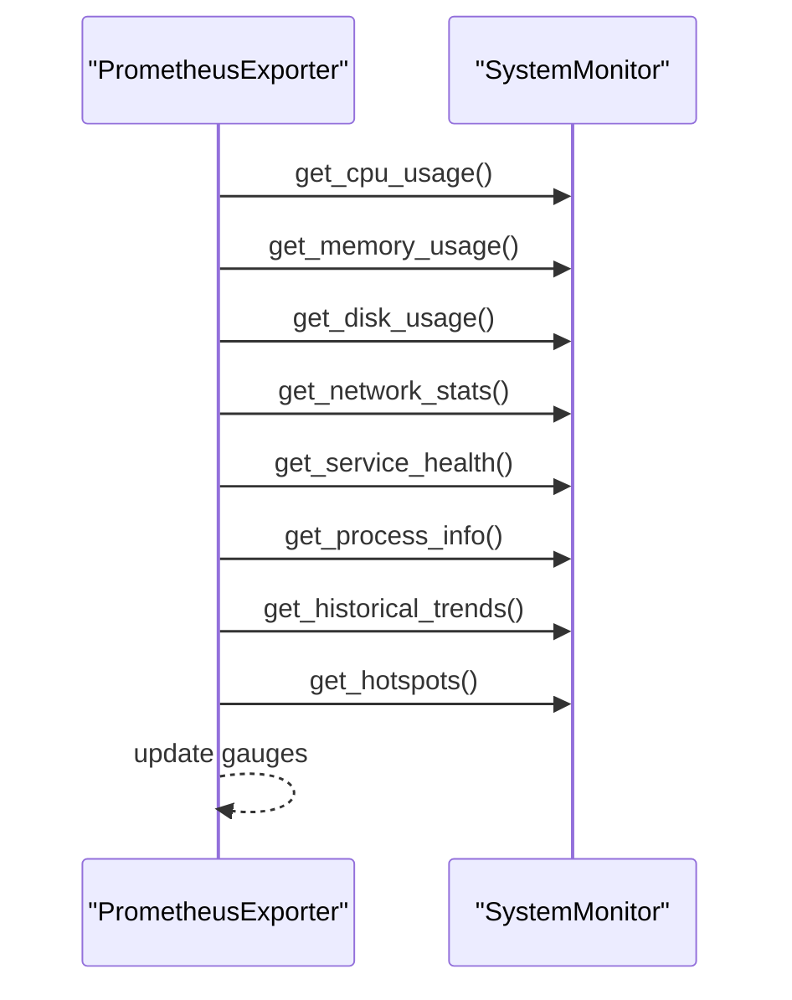
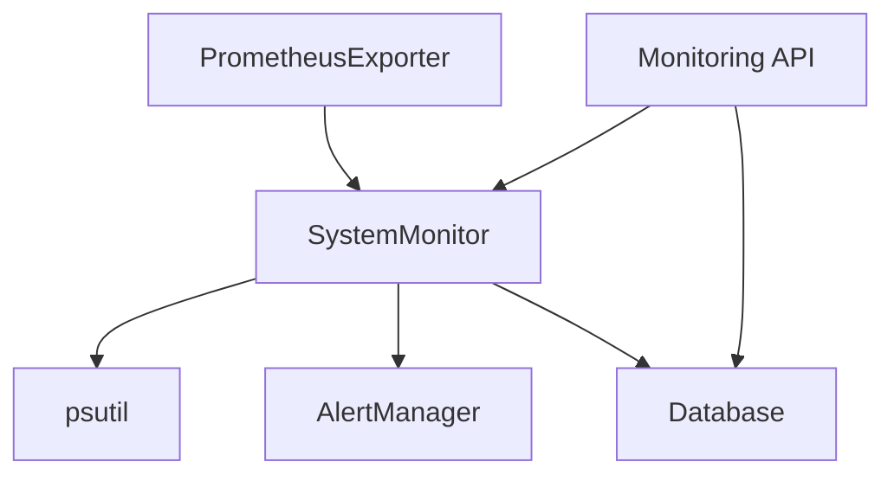

# System Monitoring

<cite>
**Referenced Files in This Document**
- [monitoring.py](file://vertex-ar/app/monitoring.py)
- [api_monitoring.py](file://vertex-ar/app/api/monitoring.py)
- [prometheus_metrics.py](file://vertex-ar/app/prometheus_metrics.py)
- [database.py](file://vertex-ar/app/database.py)
- [alerting.py](file://vertex-ar/app/alerting.py)
- [persistent-settings.md](file://docs/monitoring/persistent-settings.md)
</cite>

## Table of Contents
1. [Introduction](#introduction)
2. [Project Structure](#project-structure)
3. [Core Components](#core-components)
4. [Architecture Overview](#architecture-overview)
5. [Detailed Component Analysis](#detailed-component-analysis)
6. [Dependency Analysis](#dependency-analysis)
7. [Performance Considerations](#performance-considerations)
8. [Troubleshooting Guide](#troubleshooting-guide)
9. [Conclusion](#conclusion)
10. [Appendices](#appendices)

## Introduction
This document provides comprehensive data model documentation for the SystemMonitor class and related monitoring components. It covers entity relationships, field definitions, data types, validation and business rules for thresholds and alerts, database schema, historical data storage, access patterns, caching strategies, performance characteristics, lifecycle and retention, security and access control, and migration/version management for monitoring schema changes.

## Project Structure
The monitoring system spans several modules:
- SystemMonitor: collects metrics, evaluates thresholds, escalates alerts, stores historical data, and runs the monitoring loop.
- API endpoints: expose status, metrics, trends, alerts, and settings management.
- Prometheus exporter: exposes metrics for scraping.
- Database: persists monitoring settings and notification history.
- Alerting: sends notifications via email and Telegram and integrates with the notification system.

**Diagram sources**
- [monitoring.py](file://vertex-ar/app/monitoring.py#L1-L120)
- [api_monitoring.py](file://vertex-ar/app/api/monitoring.py#L70-L120)
- [prometheus_metrics.py](file://vertex-ar/app/prometheus_metrics.py#L1-L120)
- [database.py](file://vertex-ar/app/database.py#L757-L780)
- [alerting.py](file://vertex-ar/app/alerting.py#L1-L60)

**Section sources**
- [monitoring.py](file://vertex-ar/app/monitoring.py#L1-L120)
- [api_monitoring.py](file://vertex-ar/app/api/monitoring.py#L70-L120)
- [prometheus_metrics.py](file://vertex-ar/app/prometheus_metrics.py#L1-L120)
- [database.py](file://vertex-ar/app/database.py#L757-L780)
- [alerting.py](file://vertex-ar/app/alerting.py#L1-L60)

## Core Components
- SystemMonitor: central orchestrator for health checks, thresholds, escalation, deduplication, and historical data.
- Monitoring API: admin endpoints to inspect status, trigger checks, manage thresholds/settings, and view alerts/trends.
- Prometheus Exporter: exposes system and application metrics for Prometheus scraping.
- Database: persists monitoring settings and notification history.
- Alerting: manages channels and routes notifications.

Key responsibilities:
- Threshold evaluation and severity determination.
- Consecutive failure escalation and deduplication windows.
- Historical data storage and trend analysis.
- Concurrency controls (lock, cooldown, max runtime).
- Persistence of settings and retrieval of recent alerts.

**Section sources**
- [monitoring.py](file://vertex-ar/app/monitoring.py#L1-L120)
- [api_monitoring.py](file://vertex-ar/app/api/monitoring.py#L70-L120)
- [prometheus_metrics.py](file://vertex-ar/app/prometheus_metrics.py#L1-L120)
- [database.py](file://vertex-ar/app/database.py#L757-L780)
- [alerting.py](file://vertex-ar/app/alerting.py#L1-L60)

## Architecture Overview
The monitoring pipeline integrates collection, evaluation, persistence, and alerting.

**Diagram sources**
- [api_monitoring.py](file://vertex-ar/app/api/monitoring.py#L70-L120)
- [monitoring.py](file://vertex-ar/app/monitoring.py#L1373-L1604)
- [prometheus_metrics.py](file://vertex-ar/app/prometheus_metrics.py#L75-L200)
- [alerting.py](file://vertex-ar/app/alerting.py#L218-L317)
- [database.py](file://vertex-ar/app/database.py#L3683-L3768)

## Detailed Component Analysis

### SystemMonitor Data Model and Behavior
SystemMonitor encapsulates:
- Runtime settings: thresholds, intervals, dedup window, cooldown, max runtime, recovery minutes.
- Historical data buffers: CPU, memory, disk, network (last 100 points).
- Deep diagnostics: process history, slow queries, slow endpoints, tracemalloc snapshots.
- Concurrency and state: lock, last check timestamps, failure counts, last alert timestamps.

Fields and types:
- alert_thresholds: dict[str, float] for cpu/memory/disk percent thresholds.
- historical_data: dict[str, list[dict]] keyed by metric type with timestamped samples.
- failure_counts: dict[str, int] for consecutive failure tracking.
- last_alerts: dict[str, datetime] for deduplication window enforcement.
- process_history: dict[int, list[dict]] for per-process CPU/RSS snapshots.
- slow_queries, slow_endpoints: ring buffers of slow operation records.
- tracemalloc_snapshots: list[dict] of memory snapshots.

Validation and business rules:
- Threshold crossing triggers escalation only after consecutive failures reach threshold.
- Deduplication window prevents repeated alerts within a configurable time window.
- Severity determined by overshoot percentage and absolute thresholds.
- Recovery window prevents re-alerting for the same issue until recovery period elapses.
- Concurrency guards: asyncio lock prevents overlapping checks; cooldown enforces minimum gap; optional max_runtime limits check duration.

Historical data storage:
- Stores up to 100 samples per metric type.
- Samples include timestamp, percent usage, and relevant derived metrics.

Trend analysis:
- Computes slope and direction over recent hours.
- Supports CPU, memory, disk, and network trends.

Deep diagnostics:
- Tracks top processes by CPU/RSS.
- Records slow database queries and HTTP endpoints exceeding thresholds.
- Captures tracemalloc snapshots when enabled and thresholds met.

**Diagram sources**
- [monitoring.py](file://vertex-ar/app/monitoring.py#L21-L120)
- [monitoring.py](file://vertex-ar/app/monitoring.py#L1214-L1372)
- [monitoring.py](file://vertex-ar/app/monitoring.py#L1373-L1604)
- [monitoring.py](file://vertex-ar/app/monitoring.py#L1606-L1704)

**Section sources**
- [monitoring.py](file://vertex-ar/app/monitoring.py#L21-L120)
- [monitoring.py](file://vertex-ar/app/monitoring.py#L1214-L1372)
- [monitoring.py](file://vertex-ar/app/monitoring.py#L1373-L1604)
- [monitoring.py](file://vertex-ar/app/monitoring.py#L1606-L1704)

### Threshold Checking and Alert Generation
Threshold evaluation:
- CPU, memory, disk thresholds are compared against current percent usage.
- Service health and response times are evaluated for degradation/failure.
- Error log volume is monitored for high error counts.

Escalation logic:
- Increment failure count per alert key.
- Only escalate if consecutive failures meet threshold.
- Respect deduplication window to suppress duplicates.
- Severity levels: warning, medium, high based on overshoot and absolute thresholds.
- Recovery window prevents re-alerting until elapsed.

**Diagram sources**
- [monitoring.py](file://vertex-ar/app/monitoring.py#L1373-L1604)

**Section sources**
- [monitoring.py](file://vertex-ar/app/monitoring.py#L1373-L1604)

### Database Schema for Monitoring Settings
The monitoring settings are persisted in a dedicated table with fields for thresholds, intervals, and concurrency controls.

- Default values and tunables are documented in the persistent settings guide.
- The database seeds defaults from environment variables on first run.
- API endpoints update both runtime and persisted settings.

**Diagram sources**
- [database.py](file://vertex-ar/app/database.py#L757-L780)
- [persistent-settings.md](file://docs/monitoring/persistent-settings.md#L24-L42)

**Section sources**
- [database.py](file://vertex-ar/app/database.py#L757-L780)
- [database.py](file://vertex-ar/app/database.py#L3666-L3772)
- [persistent-settings.md](file://docs/monitoring/persistent-settings.md#L24-L42)

### Historical Monitoring Data
Historical data is stored in-memory with a fixed-size buffer per metric type. The SystemMonitor appends timestamped samples and maintains the last 100 points.

**Diagram sources**
- [monitoring.py](file://vertex-ar/app/monitoring.py#L1214-L1278)

**Section sources**
- [monitoring.py](file://vertex-ar/app/monitoring.py#L1214-L1278)

### Prometheus Metrics Export
The Prometheus exporter reads current metrics from SystemMonitor and updates gauges for CPU, memory, disk, network, services, process, alerts, and deep diagnostics.

**Diagram sources**
- [prometheus_metrics.py](file://vertex-ar/app/prometheus_metrics.py#L75-L200)
- [monitoring.py](file://vertex-ar/app/monitoring.py#L1280-L1372)

**Section sources**
- [prometheus_metrics.py](file://vertex-ar/app/prometheus_metrics.py#L1-L262)
- [monitoring.py](file://vertex-ar/app/monitoring.py#L1280-L1372)

### API Endpoints for Monitoring
Admin endpoints provide:
- Status: runtime and persisted settings, lock status, recent alerts.
- Manual health check: triggers a single check.
- Metrics: current CPU, memory, disk, network, process, services.
- Trends: historical trends over configurable hours.
- Alerts: recent alerts from the notification system.
- Settings: get/update thresholds and monitoring settings.
- Hotspots: deep diagnostics (slow queries/endpoints, memory snapshots, process trends).

**Section sources**
- [api_monitoring.py](file://vertex-ar/app/api/monitoring.py#L70-L120)
- [api_monitoring.py](file://vertex-ar/app/api/monitoring.py#L120-L170)
- [api_monitoring.py](file://vertex-ar/app/api/monitoring.py#L196-L267)
- [api_monitoring.py](file://vertex-ar/app/api/monitoring.py#L299-L341)
- [api_monitoring.py](file://vertex-ar/app/api/monitoring.py#L366-L433)
- [api_monitoring.py](file://vertex-ar/app/api/monitoring.py#L435-L474)
- [api_monitoring.py](file://vertex-ar/app/api/monitoring.py#L616-L661)
- [api_monitoring.py](file://vertex-ar/app/api/monitoring.py#L663-L721)
- [api_monitoring.py](file://vertex-ar/app/api/monitoring.py#L723-L776)

### Alerting and Notification Integration
The alerting subsystem:
- Sends Telegram messages via Bot API.
- Sends email via EmailService with SMTP configuration from the notification settings.
- Integrates with the enhanced notification system, aggregating and routing notifications based on priority.
- Maintains cooldown to avoid alert spam.

**Section sources**
- [alerting.py](file://vertex-ar/app/alerting.py#L1-L120)
- [alerting.py](file://vertex-ar/app/alerting.py#L120-L217)
- [alerting.py](file://vertex-ar/app/alerting.py#L218-L317)
- [alerting.py](file://vertex-ar/app/alerting.py#L318-L383)

## Dependency Analysis
- SystemMonitor depends on:
  - psutil for system metrics.
  - AlertManager for alert dispatch.
  - Database for persisted settings and notification history.
  - PrometheusExporter for metric exports.
- API endpoints depend on SystemMonitor and Database.
- PrometheusExporter depends on SystemMonitor.

**Diagram sources**
- [monitoring.py](file://vertex-ar/app/monitoring.py#L1-L120)
- [prometheus_metrics.py](file://vertex-ar/app/prometheus_metrics.py#L1-L120)
- [api_monitoring.py](file://vertex-ar/app/api/monitoring.py#L70-L120)
- [alerting.py](file://vertex-ar/app/alerting.py#L1-L60)
- [database.py](file://vertex-ar/app/database.py#L757-L780)

**Section sources**
- [monitoring.py](file://vertex-ar/app/monitoring.py#L1-L120)
- [prometheus_metrics.py](file://vertex-ar/app/prometheus_metrics.py#L1-L120)
- [api_monitoring.py](file://vertex-ar/app/api/monitoring.py#L70-L120)
- [alerting.py](file://vertex-ar/app/alerting.py#L1-L60)
- [database.py](file://vertex-ar/app/database.py#L757-L780)

## Performance Considerations
- Concurrency controls:
  - AsyncIO lock prevents overlapping checks.
  - Cooldown ensures minimum gap between checks.
  - Optional max runtime avoids runaway checks.
- Sampling and buffering:
  - Historical buffers keep last 100 points per metric type.
  - Trend calculations use simple linear regression over recent samples.
- Export overhead:
  - Prometheus exporter updates gauges periodically; avoid excessive scrape intervals.
- Deep diagnostics:
  - Slow query and endpoint rings are bounded by ring sizes.
  - Tracemalloc snapshots are rate-limited and bounded in count.

[No sources needed since this section provides general guidance]

## Troubleshooting Guide
Common issues and resolutions:
- Settings not persisting: verify database migration and seed; confirm persisted settings are loaded at startup.
- Overlapping health checks: increase max runtime or cooldown; review lock status via status endpoint.
- Excessive alerts: increase consecutive failures threshold, dedup window, or alert recovery minutes; adjust thresholds.
- Missing alerts: verify alerting enabled, channels configured, and test alert system.

**Section sources**
- [persistent-settings.md](file://docs/monitoring/persistent-settings.md#L380-L443)
- [api_monitoring.py](file://vertex-ar/app/api/monitoring.py#L269-L297)

## Conclusion
The SystemMonitor class provides a robust, configurable, and persistent monitoring framework with strong concurrency controls, historical analytics, and integrated alerting. Its data model and APIs support real-time observability, trend analysis, and operational insights, while the database-backed settings ensure resilience across deployments.

## Appendices

### Data Access Patterns and Caching Strategies
- Access patterns:
  - Real-time metrics via SystemMonitor getters and Prometheus exporter.
  - Historical trends via in-memory buffers with trend computation.
  - Settings via Database methods; API endpoints update both runtime and persisted settings.
- Caching:
  - In-memory historical buffers act as a lightweight cache for trend analysis.
  - Prometheus gauges serve as a caching layer for scraped metrics.
  - No explicit external cache is used for monitoring data.

**Section sources**
- [monitoring.py](file://vertex-ar/app/monitoring.py#L1214-L1372)
- [prometheus_metrics.py](file://vertex-ar/app/prometheus_metrics.py#L75-L200)
- [database.py](file://vertex-ar/app/database.py#L3683-L3768)

### Data Lifecycle, Retention, and Archival
- Historical data retention:
  - Fixed-size buffers (last 100 points) per metric type.
  - No explicit archival or offloading mechanism is implemented.
- Notification history:
  - Stored in notification_history table; no documented retention policy in the referenced files.
- Recommendations:
  - Consider periodic purges of notification history if storage grows large.
  - Archive historical metrics externally if needed for long-term trend analysis.

**Section sources**
- [monitoring.py](file://vertex-ar/app/monitoring.py#L1214-L1278)
- [database.py](file://vertex-ar/app/database.py#L667-L709)

### Security, Privacy, and Access Control
- Access control:
  - Monitoring endpoints require admin authentication.
- Sensitive data:
  - Notification history includes messages and subjects; protect access to admin endpoints.
  - Email SMTP credentials are encrypted in admin_settings; ensure secure storage and access.
- Recommendations:
  - Restrict admin endpoints to trusted networks.
  - Audit notification history access and retention.

**Section sources**
- [api_monitoring.py](file://vertex-ar/app/api/monitoring.py#L70-L120)
- [database.py](file://vertex-ar/app/database.py#L492-L508)

### Data Migration and Version Management
- Automatic migration:
  - On first startup, monitoring_settings table is created and seeded from environment variables.
  - SystemMonitor loads persisted settings on initialization.
- Version management:
  - Settings updates via API persist to database; reload_settings refreshes runtime values.
  - No explicit schema versioning is shown in the referenced files; rely on migrations and seeding.

**Section sources**
- [persistent-settings.md](file://docs/monitoring/persistent-settings.md#L444-L469)
- [monitoring.py](file://vertex-ar/app/monitoring.py#L88-L117)
- [database.py](file://vertex-ar/app/database.py#L3666-L3678)
- [database.py](file://vertex-ar/app/database.py#L3683-L3768)