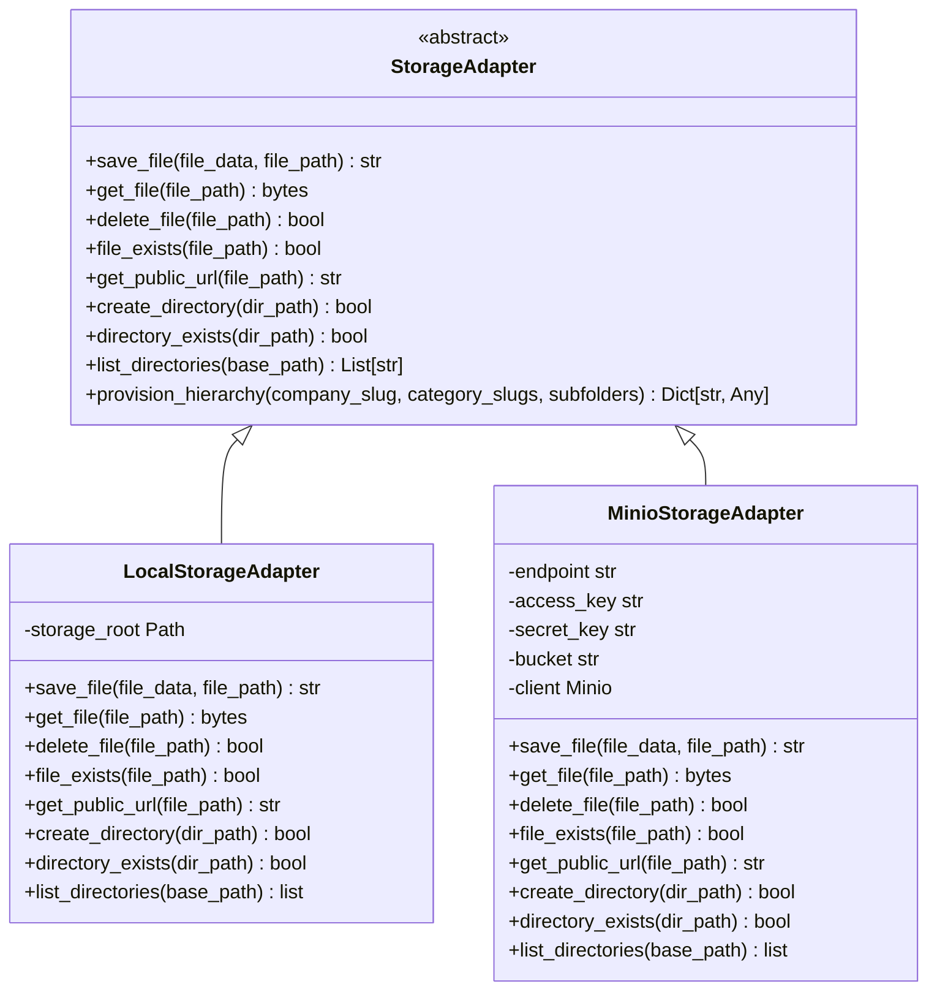
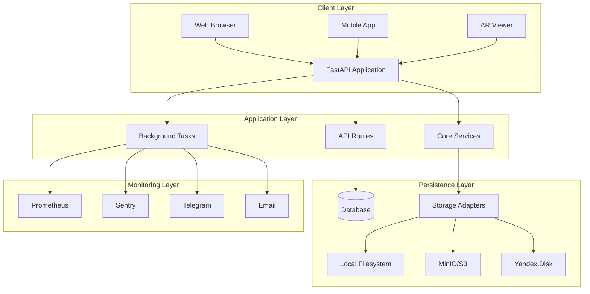

# Project Overview

<cite>
**Referenced Files in This Document**   
- [vertex-ar/README.md](file://vertex-ar/README.md)
- [vertex-ar/app/main.py](file://vertex-ar/app/main.py)
- [vertex-ar/app/config.py](file://vertex-ar/app/config.py)
- [vertex-ar/app/storage.py](file://vertex-ar/app/storage.py)
- [vertex-ar/app/storage_local.py](file://vertex-ar/app/storage_local.py)
- [vertex-ar/app/storage_minio.py](file://vertex-ar/app/storage_minio.py)
- [vertex-ar/app/api/companies.py](file://vertex-ar/app/api/companies.py)
- [vertex-ar/app/api/portraits.py](file://vertex-ar/app/api/portraits.py)
- [vertex-ar/app/api/videos.py](file://vertex-ar/app/api/videos.py)
- [docs/architecture/overview.md](file://docs/architecture/overview.md)
- [docs/architecture/structure.md](file://docs/architecture/structure.md)
</cite>

## Table of Contents
1. [Introduction](#introduction)
2. [Core Capabilities](#core-capabilities)
3. [Architectural Style](#architectural-style)
4. [Key Components](#key-components)
5. [System Architecture](#system-architecture)
6. [Integration Points](#integration-points)
7. [User Workflows](#user-workflows)
8. [Conclusion](#conclusion)

## Introduction

The AR backend application is a FastAPI-based service designed for augmented reality (AR) content management, multi-tenant company administration, and storage orchestration. It enables users to upload portraits, associate videos, generate NFT markers, and view AR scenes through web or mobile clients. The system supports hierarchical content organization (Company → Project → Folder → Portrait), automated video scheduling, NFT generation, and robust backup mechanisms. With a modular, domain-driven architecture, the application provides a scalable foundation for managing AR experiences across multiple organizations.

**Section sources**
- [vertex-ar/README.md](file://vertex-ar/README.md)
- [docs/architecture/overview.md](file://docs/architecture/overview.md)

## Core Capabilities

The AR backend delivers a comprehensive suite of capabilities for managing AR content and company resources:

- **NFT Generation**: Automated creation of NFT markers from portrait images using feature detection algorithms. The system generates .fset, .fset3, and .iset files required for AR.js marker tracking, with configurable quality settings and batch processing support.
- **Video Scheduling**: Advanced video management with scheduling, rotation, and lifecycle controls. Videos can be assigned start/end times, configured for sequential or cyclic rotation, and automatically archived based on expiration policies.
- **Automated Backups**: Comprehensive backup system for both database and file storage. The application supports scheduled backups with rotation policies, remote storage integration (MinIO, Yandex.Disk), and restoration capabilities through CLI tools.
- **Monitoring and Alerting**: Built-in monitoring for system health, including CPU, memory, disk usage, and application performance. The system generates alerts for threshold violations and supports integration with Telegram, email, and webhook notification channels.
- **Multi-tenant Company Administration**: Support for multiple companies with isolated storage configurations, custom branding, and independent content management. Each company can have its own storage backend, folder structure, and access policies.
- **Storage Orchestration**: Flexible storage management with support for local filesystem, MinIO/S3, and Yandex.Disk. The system abstracts storage operations through an adapter pattern, allowing seamless switching between storage backends.

**Section sources**
- [vertex-ar/README.md](file://vertex-ar/README.md)
- [docs/architecture/overview.md](file://docs/architecture/overview.md)

## Architectural Style

The AR backend follows a modular, domain-driven design with clear separation of concerns. The architecture is organized around business domains such as companies, portraits, videos, and storage, with each domain encapsulated in dedicated modules. The application uses a layered approach with distinct API, service, and data access layers.

Key architectural characteristics include:
- **Modular Structure**: Components are organized into discrete modules (API routes, services, storage adapters) that can be developed and tested independently.
- **Dependency Injection**: Core services (database, storage, cache) are injected into route handlers through FastAPI's dependency system.
- **Adapter Pattern**: Storage operations are abstracted through a common interface with concrete implementations for different storage backends.
- **Event-Driven Background Processing**: Background tasks (monitoring, backups, email processing) are initiated at application startup using FastAPI's event system.
- **Configuration-Driven Behavior**: System behavior is controlled through environment variables and configuration files, enabling different settings for development, staging, and production environments.

**Section sources**
- [vertex-ar/app/main.py](file://vertex-ar/app/main.py)
- [docs/architecture/structure.md](file://docs/architecture/structure.md)

## Key Components

### API Layer
The API layer exposes RESTful endpoints for all application functionality. Implemented using FastAPI, it provides automatic OpenAPI documentation, request validation, and dependency injection. Key API modules include:
- **Authentication**: JWT-based authentication with rate limiting and account lockout protection
- **Company Management**: CRUD operations for multi-tenant company administration
- **Portrait Management**: Upload, retrieval, and management of portrait images and associated metadata
- **Video Management**: Upload, scheduling, and activation of videos for AR experiences
- **NFT Generation**: Endpoints for marker creation, analysis, and regeneration

### Storage Adapters
The storage system implements an adapter pattern to support multiple storage backends:

**Diagram sources**
- [vertex-ar/app/storage.py](file://vertex-ar/app/storage.py)
- [vertex-ar/app/storage_local.py](file://vertex-ar/app/storage_local.py)
- [vertex-ar/app/storage_minio.py](file://vertex-ar/app/storage_minio.py)

### Background Schedulers
The application includes several background schedulers for automated operations:
- **Video Animation Scheduler**: Manages video activation based on schedules and rotation policies
- **Lifecycle Scheduler**: Handles subscription status changes and content lifecycle management
- **Backup Scheduler**: Coordinates automated backup operations at configured intervals
- **Email Queue Processor**: Manages asynchronous email delivery with retry logic
- **System Monitor**: Continuously monitors system health metrics and triggers alerts

**Section sources**
- [vertex-ar/app/main.py](file://vertex-ar/app/main.py)
- [vertex-ar/app/config.py](file://vertex-ar/app/config.py)

## System Architecture

The AR backend follows a three-tier architecture with clear separation between presentation, application logic, and data storage layers. The system is designed for scalability and can be deployed in various configurations from single-server setups to distributed environments.

**Diagram sources**
- [docs/architecture/overview.md](file://docs/architecture/overview.md)

The application uses FastAPI as the web framework, leveraging its async capabilities for handling concurrent requests. The database layer uses SQLAlchemy ORM with SQLite (development) or PostgreSQL (production) for data persistence. Storage operations are abstracted through the storage adapter interface, allowing the application to work with different storage backends without changing business logic.

## Integration Points

The AR backend integrates with several external systems and services:

### Mobile Clients
The application provides a REST API for mobile clients to:
- Authenticate users with JWT tokens
- Retrieve portrait and video content
- View AR scenes through public endpoints
- Manage user profiles and preferences

API endpoints are documented in OpenAPI/Swagger format and accessible at `/docs`. The mobile API follows REST conventions with JSON payloads and standard HTTP status codes.

### Yandex.Disk
Yandex.Disk integration enables cloud storage for company content:
- OAuth2 authentication for secure access
- Folder selection and validation through API endpoints
- Direct file operations using Yandex.Disk API
- Configuration stored in the database with encrypted credentials

The integration is implemented in `app/storage_yandex.py` and accessed through the storage adapter interface, providing a consistent API regardless of the underlying storage backend.

### MinIO
MinIO/S3 integration provides object storage capabilities:
- Standard S3-compatible API for file operations
- Bucket management with automatic creation
- Secure credential management
- Configuration through environment variables

The MinIO adapter implements the same interface as other storage adapters, allowing seamless switching between storage backends based on company configuration.

### Monitoring Stack
The application integrates with a comprehensive monitoring stack:
- **Prometheus**: Metrics collection for API performance, system health, and business metrics
- **Grafana**: Visualization of monitoring data through dashboards
- **Alertmanager**: Alert routing and deduplication
- **Sentry**: Error tracking and exception monitoring
- **Telegram/Email**: Notification delivery for critical alerts

Monitoring configuration files are located in the `monitoring/` directory and include alert rules, dashboard definitions, and integration settings.

**Section sources**
- [vertex-ar/app/api/companies.py](file://vertex-ar/app/api/companies.py)
- [vertex-ar/app/storage_minio.py](file://vertex-ar/app/storage_minio.py)
- [monitoring/alert_rules.yml](file://monitoring/alert_rules.yml)
- [monitoring/grafana-dashboard.json](file://monitoring/grafana-dashboard.json)

## User Workflows

### Administrator Workflow
Administrators manage the system through the web-based admin panel:
1. **Login**: Authenticate with username/password credentials
2. **Company Management**: Create and configure companies with specific storage settings
3. **Content Organization**: Set up projects, folders, and category hierarchies
4. **User Management**: Create and manage user accounts with role-based access
5. **Monitoring**: View system health metrics and respond to alerts
6. **Backup Management**: Initiate and monitor backup operations

Administrators can also use CLI tools for advanced operations like backup management and system diagnostics.

### Developer Workflow
Developers interact with the system through the API and codebase:
1. **Environment Setup**: Configure development environment using Docker or virtual environments
2. **API Exploration**: Use Swagger documentation to understand available endpoints
3. **Integration Development**: Build client applications using the REST API
4. **Testing**: Run unit and integration tests using pytest
5. **Deployment**: Deploy changes using provided scripts and configuration files

The codebase includes comprehensive documentation in the `docs/` directory and follows Python best practices for code quality and maintainability.

### DevOps Engineer Workflow
DevOps engineers manage the deployment and operation of the application:
1. **Infrastructure Setup**: Configure servers, databases, and storage backends
2. **Deployment**: Use Docker Compose or deployment scripts to deploy the application
3. **Monitoring Configuration**: Set up Prometheus, Grafana, and alerting rules
4. **Backup Strategy**: Implement and test backup procedures for disaster recovery
5. **Performance Optimization**: Tune application settings and infrastructure for optimal performance
6. **Security Management**: Configure SSL, rate limiting, and access controls

The system provides scripts and configuration files to automate many DevOps tasks, reducing manual intervention and potential errors.

**Section sources**
- [vertex-ar/README.md](file://vertex-ar/README.md)
- [docs/architecture/overview.md](file://docs/architecture/overview.md)

## Conclusion

The AR backend application provides a robust platform for managing augmented reality content with support for multi-tenant company administration, flexible storage orchestration, and comprehensive operational capabilities. Built on FastAPI with a modular, domain-driven architecture, the system offers a scalable foundation for AR experiences. Key features like NFT generation, video scheduling, automated backups, and integrated monitoring make it suitable for production environments. The application's well-documented API and integration points enable seamless connectivity with mobile clients and external services, while its modular design facilitates future enhancements and customization.