# Authentication Mechanisms

<cite>
**Referenced Files in This Document**   
- [auth.py](file://vertex-ar/app/auth.py)
- [api/auth.py](file://vertex-ar/app/api/auth.py)
- [utils.py](file://vertex-ar/app/utils.py)
- [test_auth.py](file://test_files/unit/test_auth.py)
- [database.py](file://vertex-ar/app/database.py)
</cite>

## Table of Contents
1. [Introduction](#introduction)
2. [Authentication Architecture Overview](#authentication-architecture-overview)
3. [JWT-Based Authentication Flow](#jwt-based-authentication-flow)
4. [Password Hashing and Verification](#password-hashing-and-verification)
5. [Token Management System](#token-management-system)
6. [Authentication Endpoints](#authentication-endpoints)
7. [Security and Lockout Mechanisms](#security-and-lockout-mechanisms)
8. [Integration with FastAPI Security](#integration-with-fastapi-security)
9. [Error Handling and Status Codes](#error-handling-and-status-codes)
10. [Performance and Scalability Considerations](#performance-and-scalability-considerations)

## Introduction
The AR backend application implements a robust authentication system centered around token-based security with comprehensive session management. This document details the implementation of JWT-like token authentication, password security, session handling, and integration with the FastAPI framework. The system is designed to provide secure access control while maintaining performance and scalability in multi-threaded environments.

## Authentication Architecture Overview
The authentication system is built around several key components that work together to provide secure user access:

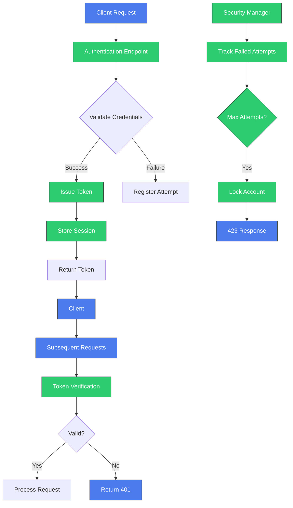

**Diagram sources**
- [auth.py](file://vertex-ar/app/auth.py)
- [api/auth.py](file://vertex-ar/app/api/auth.py)

## JWT-Based Authentication Flow
The authentication system implements a token-based flow that follows JWT principles, though using custom token generation rather than standard JWT encoding. The flow consists of token issuance, validation, and revocation mechanisms that ensure secure access to protected resources.

### Token Issuance Process
When a user successfully authenticates, the system generates a cryptographically secure token and associates it with a session in the database. The token issuance process follows these steps:

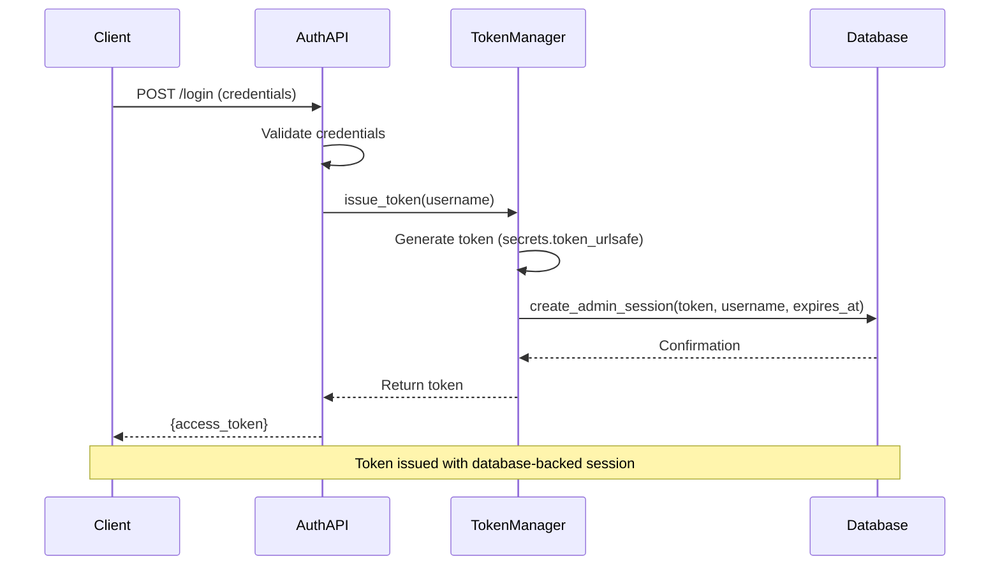

**Diagram sources**
- [auth.py](file://vertex-ar/app/auth.py#L33-L45)
- [api/auth.py](file://vertex-ar/app/api/auth.py#L163-L169)

### Token Validation Process
Token validation occurs on each request to protected endpoints, ensuring that only valid and current sessions can access protected resources:

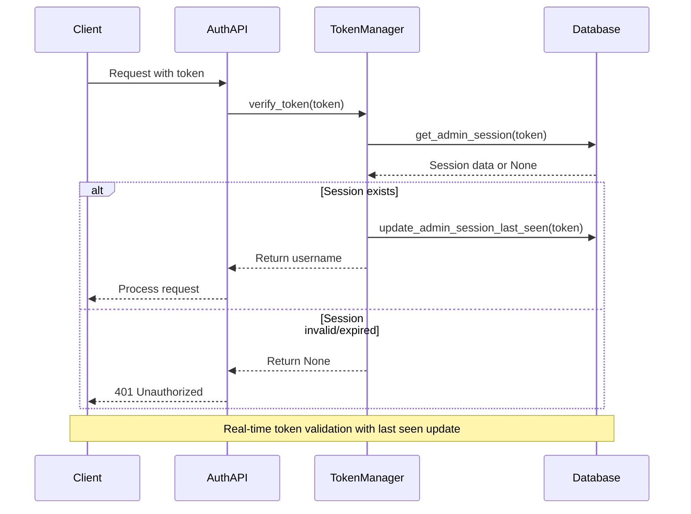

**Diagram sources**
- [auth.py](file://vertex-ar/app/auth.py#L47-L61)
- [api/auth.py](file://vertex-ar/app/api/auth.py#L41-L65)

### Token Revocation Process
The system provides multiple mechanisms for token revocation to support logout functionality and security requirements:

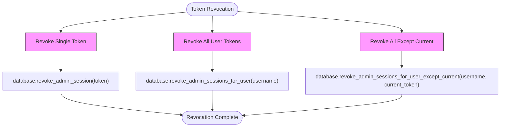

**Diagram sources**
- [auth.py](file://vertex-ar/app/auth.py#L63-L91)

## Password Hashing and Verification
The system implements password security using SHA-256 hashing with a straightforward verification mechanism.

### Password Hashing Implementation
The password hashing function converts plaintext passwords into secure hash representations:

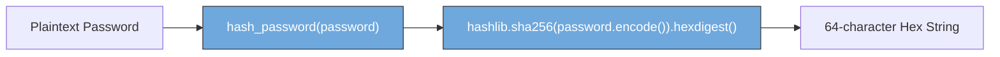

**Section sources**
- [utils.py](file://vertex-ar/app/utils.py#L9-L11)

### Password Verification Logic
The verification process compares provided passwords against stored hashes to authenticate users:

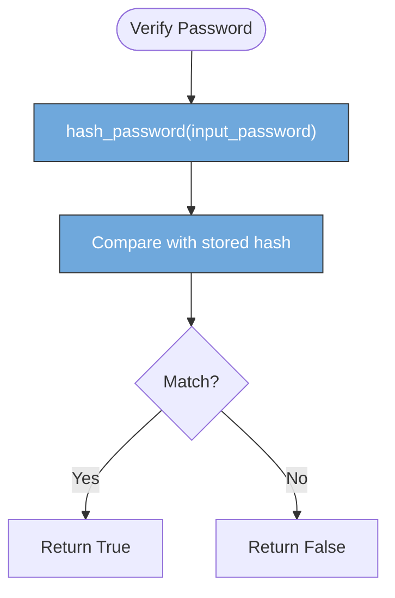

**Section sources**
- [utils.py](file://vertex-ar/app/utils.py#L14-L16)

## Token Management System
The TokenManager class provides comprehensive session management with thread-safe operations and database-backed persistence.

### TokenManager Class Structure
The core token management system is implemented as a stateful class with thread safety guarantees:

```mermaid
classDiagram
class TokenManager {
+session_timeout : timedelta
+_lock : threading.Lock
+issue_token(username : str) : str
+verify_token(token : str) : Optional[str]
+revoke_token(token : str) : None
+revoke_user(username : str) : None
+revoke_user_except_current(username : str, current_token : Optional[str]) : None
+cleanup_expired_sessions() : int
}
class SessionData {
+username : str
+issued_at : datetime
+last_seen : datetime
}
TokenManager --> SessionData : "manages"
TokenManager --> Database : "uses"
note right of TokenManager
Thread-safe operations with
threading.Lock for multi-worker
environment compatibility
end
```

**Diagram sources**
- [auth.py](file://vertex-ar/app/auth.py#L27-L101)

### Session Management with Database Storage
Unlike in-memory token storage, this implementation uses database persistence to ensure compatibility across Uvicorn workers:

```mermaid
flowchart TB
A[TokenManager] --> B[Database Storage]
B --> C[(admin_sessions Table)]
subgraph Database Schema
C --> D["token: VARCHAR(255) PRIMARY KEY"]
C --> E["username: VARCHAR(255)"]
C --> F["issued_at: TIMESTAMP"]
C --> G["last_seen: TIMESTAMP"]
C --> H["expires_at: TIMESTAMP"]
C --> I["is_revoked: BOOLEAN"]
end
A --> J["issue_token()"]
A --> K["verify_token()"]
A --> L["revoke_token()"]
J --> C: INSERT
K --> C: SELECT + UPDATE
L --> C: UPDATE is_revoked
style C fill:#f9f,stroke:#333
```

**Section sources**
- [auth.py](file://vertex-ar/app/auth.py)
- [database.py](file://vertex-ar/app/database.py)

## Authentication Endpoints
The system exposes RESTful endpoints for authentication operations, following standard API design principles.

### Login Endpoint Structure
The login endpoint handles user authentication and token issuance:

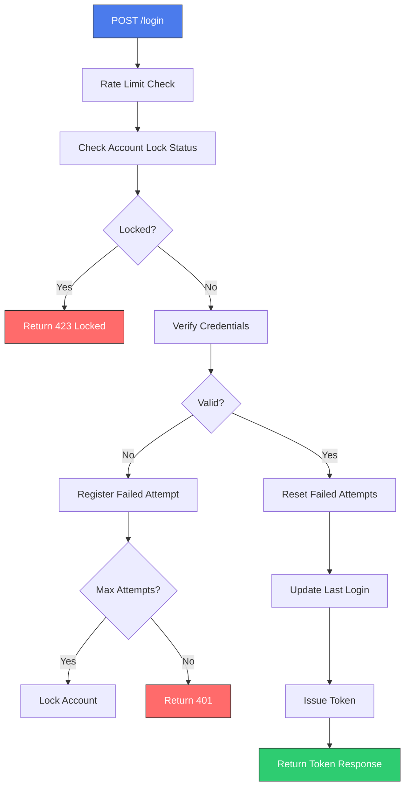

**Section sources**
- [api/auth.py](file://vertex-ar/app/api/auth.py#L109-L169)

### Request/Response Schemas
The authentication endpoints use well-defined data schemas for request and response payloads:

```mermaid
erDiagram
USER_LOGIN {
string username PK
string password
}
TOKEN_RESPONSE {
string access_token PK
}
USER_LOGIN ||--|| TOKEN_RESPONSE : "authenticates"
note over USER_LOGIN
Used in POST /login request body
Validated by Pydantic model
end
note over TOKEN_RESPONSE
Returned on successful authentication
Contains token for subsequent requests
end
```

**Section sources**
- [api/auth.py](file://vertex-ar/app/api/auth.py#L10-L11)
- [models.py](file://vertex-ar/app/models.py)

## Security and Lockout Mechanisms
The system implements account lockout functionality to prevent brute force attacks.

### AuthSecurityManager Operation
The security manager tracks failed login attempts and enforces lockout policies:

```mermaid
classDiagram
class AuthSecurityManager {
+max_attempts : int
+lockout_duration : timedelta
+_failed_attempts : Dict[str, int]
+_lockouts : Dict[str, datetime]
+register_failure(username : str) : Optional[datetime]
+is_locked(username : str) : Optional[datetime]
+reset(username : str) : None
}
AuthSecurityManager --> TokenManager : "integrated with"
AuthSecurityManager --> "Login Endpoint" : "used by"
note right of AuthSecurityManager
Thread-safe dictionary access
Automatic cleanup of expired locks
Configurable lockout parameters
end
```

**Section sources**
- [auth.py](file://vertex-ar/app/auth.py)
- [test_auth.py](file://test_files/unit/test_auth.py#L140-L266)

### Lockout State Management
The system handles lockout states with automatic expiration and cleanup:

```mermaid
stateDiagram-v2
[*] --> Normal
Normal --> Locked : register_failure() when at threshold
Locked --> Normal : is_locked() when expired
Locked --> Normal : reset()
Normal --> Normal : register_failure() below threshold
Normal --> Normal : reset() when not locked
note Locked
Stores lock end time
Prevents further login attempts
Automatically expires
end
```

**Section sources**
- [auth.py](file://vertex-ar/app/auth.py)
- [test_auth.py](file://test_files/unit/test_auth.py)

## Integration with FastAPI Security
The authentication system integrates seamlessly with FastAPI's dependency injection and security framework.

### Dependency Injection Pattern
The system uses FastAPI's dependency system to provide authentication services:

```mermaid
flowchart TD
A[FastAPI Application] --> B[app.state.tokens]
A --> C[app.state.auth_security]
A --> D[app.state.database]
E[Authentication Endpoint] --> F[Depends(get_token_manager)]
E --> G[Depends(get_auth_security)]
E --> H[Depends(get_database)]
F --> B
G --> C
H --> D
style A fill:#4B7BEC,stroke:#333,color:#fff
style E fill:#4B7BEC,stroke:#333,color:#fff
style B,C,D,F,G,H fill:#2ECC71,stroke:#333,color:#fff
```

**Section sources**
- [api/auth.py](file://vertex-ar/app/api/auth.py#L23-L38)

### Security Dependency Chain
The authentication dependencies form a chain that ensures proper security checks:

```mermaid
flowchart TD
A[HTTP Request] --> B[HTTPBearer Security]
B --> C[get_current_user()]
C --> D[Token Verification]
D --> E{Valid?}
E --> |Yes| F[Return User]
E --> |No| G[401 Unauthorized]
F --> H[Endpoint Function]
H --> I[Business Logic]
style B fill:#6FA8DC,stroke:#333,color:#fff
style C fill:#6FA8DC,stroke:#333,color:#fff
style D fill:#6FA8DC,stroke:#333,color:#fff
```

**Section sources**
- [api/auth.py](file://vertex-ar/app/api/auth.py#L41-L65)

## Error Handling and Status Codes
The system implements comprehensive error handling with appropriate HTTP status codes.

### Authentication Error Types
The authentication system returns specific error responses for different failure scenarios:

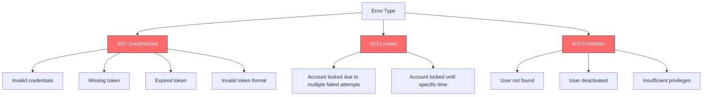

**Section sources**
- [api/auth.py](file://vertex-ar/app/api/auth.py)

### Error Handling Flow
The error handling process ensures consistent responses across the authentication system:

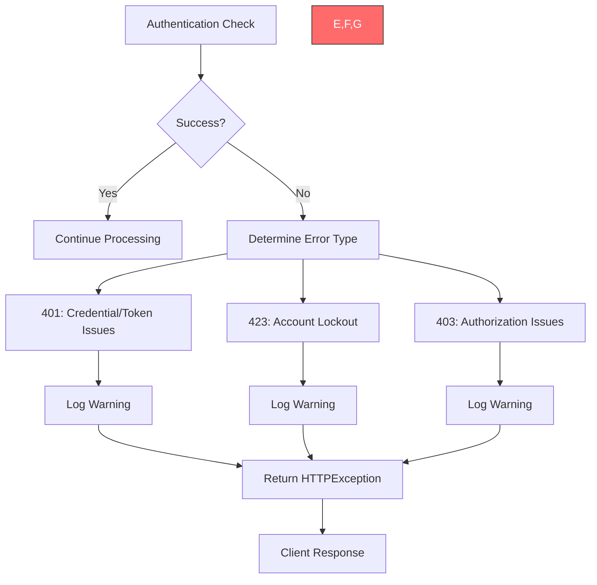

**Section sources**
- [api/auth.py](file://vertex-ar/app/api/auth.py)

## Performance and Scalability Considerations
The authentication system is designed with performance and scalability in mind for production environments.

### Token Validation Performance
The database-backed token validation system balances security with performance:

```mermaid
flowchart LR
A[Token Validation] --> B[Database Query]
B --> C{Index Usage?}
C --> |Yes| D[Fast Lookup O(log n)]
C --> |No| E[Slow Full Scan O(n)]
D --> F[Update last_seen]
F --> G[Return Result]
note over B
Indexed on token field
Covered index on (token, is_revoked, expires_at)
Query optimized for high-frequency access
end
```

**Section sources**
- [database.py](file://vertex-ar/app/database.py)
- [auth.py](file://vertex-ar/app/auth.py)

### Thread Safety Guarantees
The system ensures thread safety in multi-threaded environments:

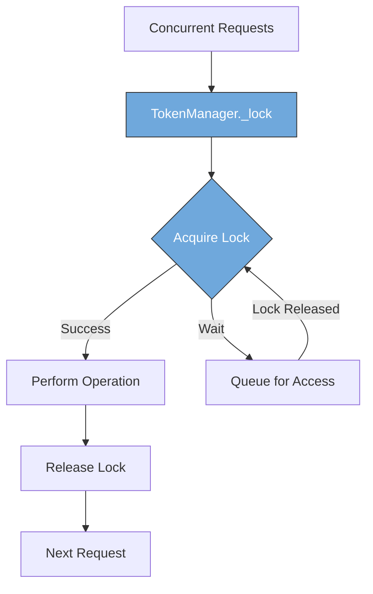

**Section sources**
- [auth.py](file://vertex-ar/app/auth.py#L31-L31)

### Scalability Recommendations
For high-scale deployments, several optimizations can be implemented:

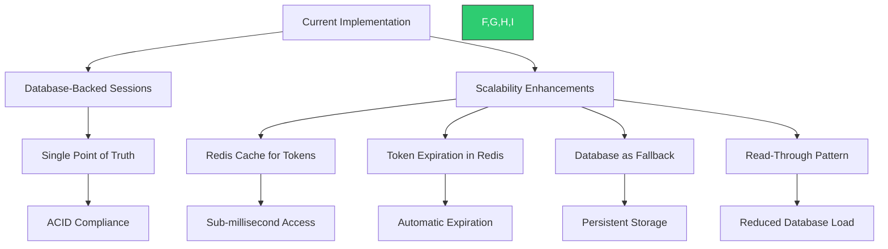

**Section sources**
- [auth.py](file://vertex-ar/app/auth.py)
- [database.py](file://vertex-ar/app/database.py)