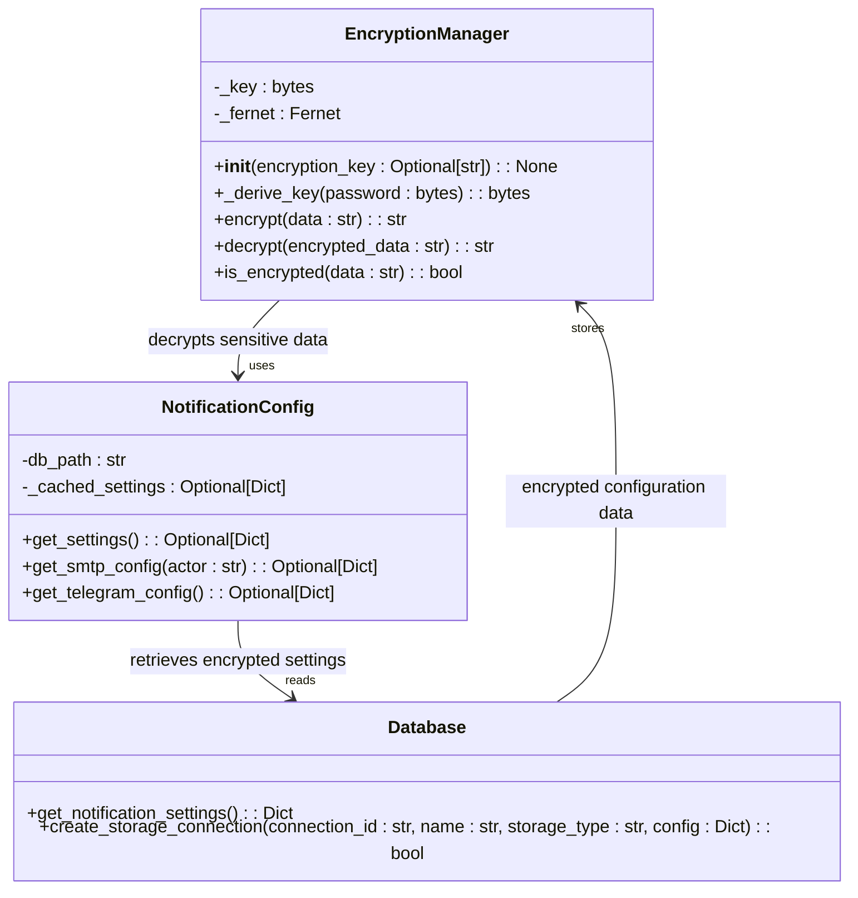
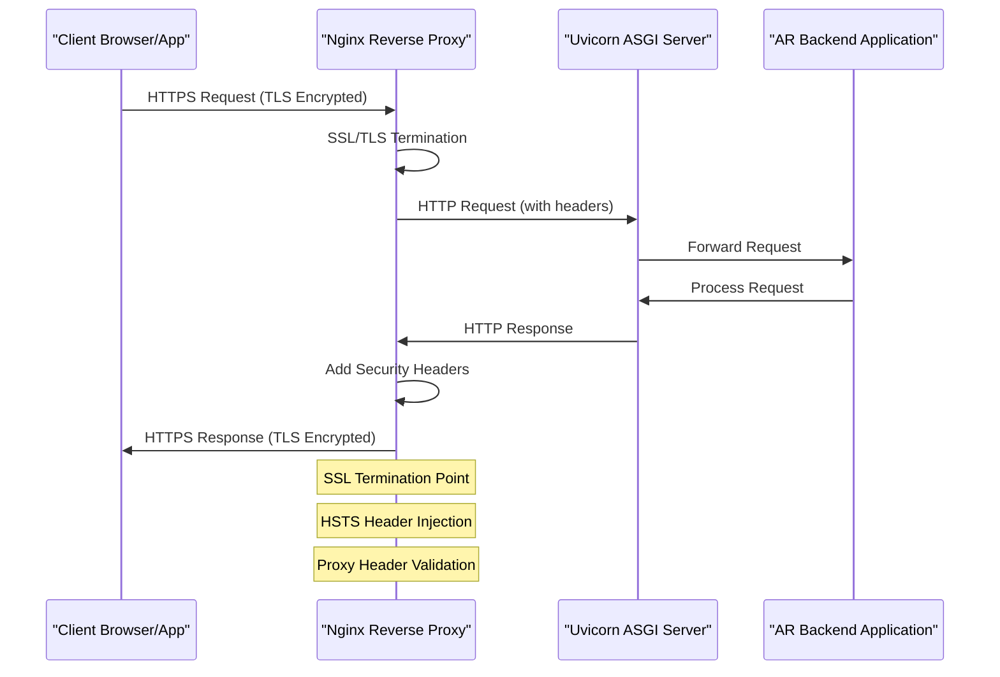

# Data Encryption

<cite>
**Referenced Files in This Document**   
- [encryption.py](file://vertex-ar/app/encryption.py)
- [notification_config.py](file://vertex-ar/app/notification_config.py)
- [nginx.conf](file://nginx.conf)
- [nginx-ssl-setup.md](file://docs/deployment/nginx-ssl-setup.md)
- [production-setup.md](file://docs/deployment/production-setup.md)
- [.env.example](file://vertex-ar/.env.example)
- [.env.production.example](file://vertex-ar/.env.production.example)
</cite>

## Table of Contents
1. [Introduction](#introduction)
2. [At-Rest Encryption](#at-rest-encryption)
3. [In-Transit Encryption](#in-transit-encryption)
4. [Integration and Security Headers](#integration-and-security-headers)
5. [Common Issues and Troubleshooting](#common-issues-and-troubleshooting)
6. [Performance Considerations](#performance-considerations)
7. [Conclusion](#conclusion)

## Introduction
This document provides a comprehensive overview of data encryption in the AR backend application, covering both at-rest and in-transit encryption mechanisms. The AR backend application implements robust security measures to protect sensitive data through cryptographic techniques and secure communication protocols. At-rest encryption is handled by the application's encryption module using Fernet symmetric encryption with PBKDF2 key derivation, while in-transit encryption is managed through Nginx SSL/TLS configuration. The system protects sensitive information such as SMTP credentials, Telegram bot tokens, and other configuration secrets by encrypting them before storage in the database. For external communications, the application uses Nginx as a reverse proxy with SSL termination to ensure all data transmitted between clients and the server is encrypted using modern TLS protocols. This documentation details the implementation specifics, configuration requirements, and operational considerations for maintaining a secure encryption infrastructure in both development and production environments.

## At-Rest Encryption

The AR backend application implements at-rest encryption through the `encryption.py` module, which provides a comprehensive encryption management system for protecting sensitive data stored in the database. The implementation uses the Fernet symmetric encryption scheme from the Python cryptography library, which combines AES-128 in CBC mode with HMAC using SHA256 for authenticated encryption. This approach ensures both confidentiality and integrity of encrypted data, preventing unauthorized modification. The encryption key is derived using PBKDF2HMAC with SHA256, 100,000 iterations, and a static salt value, providing strong protection against brute force attacks. Key derivation uses a secret obtained from the `ENCRYPTION_SECRET` environment variable, with a default fallback value that must be changed in production environments.

Sensitive data such as SMTP passwords and Telegram bot tokens are encrypted before being stored in the database and decrypted when needed for service operations. The system uses dedicated encrypted columns in the database schema (e.g., `smtp_password_encrypted`) to store cipher text, ensuring that sensitive information never persists in plain text. The `NotificationConfig` class handles the automatic decryption of these fields when loading configuration data, with proper error handling to manage decryption failures gracefully. The encryption manager also includes utility methods to detect whether data is already encrypted, preventing double-encryption scenarios. This implementation follows security best practices by separating encryption logic from business logic and providing a centralized encryption service accessible throughout the application.

**Diagram sources**
- [encryption.py](file://vertex-ar/app/encryption.py#L16-L83)
- [notification_config.py](file://vertex-ar/app/notification_config.py#L40-L221)

**Section sources**
- [encryption.py](file://vertex-ar/app/encryption.py#L1-L83)
- [notification_config.py](file://vertex-ar/app/notification_config.py#L1-L221)

## In-Transit Encryption

The AR backend application implements in-transit encryption through Nginx SSL/TLS configuration, providing secure communication channels between clients and the server. The current configuration supports both HTTP and HTTPS protocols, with HTTPS functionality initially commented out and designed to be activated after obtaining valid SSL certificates. When enabled, the SSL configuration supports modern security protocols including TLSv1.2 and TLSv1.3, with a carefully selected cipher suite that prioritizes high-strength encryption algorithms while excluding known vulnerable ciphers. The cipher suite configuration `HIGH:!aNULL:!MD5:!EXPORT:!DES:!RC4:!PSK:!aECDH:!EDH-DSS-DES-CBC3-SHA:!EDH-RSA-DES-CBC3-SHA:!KRB5-DES-CBC3-SHA` specifically disables null encryption, MD5-based ciphers, export-grade ciphers, DES, RC4, and various other weak or compromised algorithms.

SSL certificates can be obtained through multiple methods including self-signed certificates for development, Let's Encrypt for production environments, or commercial certificate authorities. The deployment documentation provides detailed instructions for each approach, including automated certificate renewal processes using Certbot with cron scheduling. For production deployments, the system recommends using the Mozilla SSL Configuration Generator to select appropriate security profiles based on compatibility requirements. The configuration includes support for OCSP stapling to improve certificate revocation checking performance and HSTS (HTTP Strict Transport Security) to enforce secure connections and prevent downgrade attacks. Certificate validation is performed with a 10-second DNS cache timeout to balance security and performance considerations.

**Diagram sources**
- [nginx.conf](file://nginx.conf#L72-L117)
- [nginx-ssl-setup.md](file://docs/deployment/nginx-ssl-setup.md#L1-L185)

**Section sources**
- [nginx.conf](file://nginx.conf#L1-L119)
- [nginx-ssl-setup.md](file://docs/deployment/nginx-ssl-setup.md#L1-L185)

## Integration and Security Headers

The AR backend application integrates Uvicorn, Nginx, and security headers to create a comprehensive security infrastructure that protects data in transit and mitigates common web vulnerabilities. Nginx serves as a reverse proxy and SSL termination point, handling incoming HTTPS connections and forwarding decrypted traffic to the Uvicorn ASGI server over HTTP. This architecture allows Nginx to manage SSL/TLS operations efficiently while enabling Uvicorn to focus on application processing. The integration includes proper header forwarding to preserve client information through the proxy chain, with Nginx setting headers such as `X-Forwarded-Proto`, `X-Forwarded-For`, and `X-Real-IP` to maintain accurate client data for the application.

Security headers are implemented at the Nginx level to enhance protection against various attacks. The configuration supports HTTP Strict Transport Security (HSTS) through the `Strict-Transport-Security` header, which instructs browsers to only communicate with the server over HTTPS for a specified duration (typically one year). Additional security measures include OCSP stapling to improve certificate revocation checking performance and proper MIME type handling to prevent content sniffing attacks. The proxy configuration includes appropriate timeouts and connection limits to mitigate denial-of-service attacks, with client body timeouts set to 300 seconds and proxy read/write timeouts similarly configured. The system also supports WebSocket connections through proper upgrade header handling, ensuring secure real-time communication when needed.

The integration between components follows a defense-in-depth approach, with multiple layers of security controls. Nginx validates and sanitizes incoming requests before forwarding them to Uvicorn, which then processes the application logic. Response headers are carefully managed to prevent information leakage, and sensitive data is protected through the at-rest encryption mechanisms described earlier. The deployment configuration ensures that all components run with appropriate permissions and resource limits, further enhancing the overall security posture of the system.

**Section sources**
- [nginx.conf](file://nginx.conf#L1-L119)
- [production-setup.md](file://docs/deployment/production-setup.md#L1-L273)

## Common Issues and Troubleshooting

The AR backend application may encounter several common issues related to encryption configuration and certificate management, particularly during deployment and maintenance. Certificate expiration is a frequent concern, as SSL certificates have limited validity periods (typically 90 days for Let's Encrypt). The system addresses this through automated renewal processes using Certbot with cron scheduling (`0 */12 * * * certbot renew --quiet && docker-compose restart nginx`), which checks for expiring certificates twice daily and renews them automatically. Monitoring certificate expiration dates using `openssl x509 -in ssl/cert.pem -noout -dates` is recommended to verify the renewal process is functioning correctly.

Mixed content warnings can occur when HTTPS pages load resources over HTTP, potentially compromising security. This is typically resolved by ensuring all application URLs use HTTPS and configuring the `MINIO_PUBLIC_URL` appropriately when using external storage services. Weak cipher vulnerabilities may arise if outdated cipher suites are enabled; the recommended solution is to use the Mozilla SSL Configuration Generator to select appropriate cipher suites based on security requirements. Nginx startup failures commonly occur when SSL certificates are missing or have incorrect permissions, which can be diagnosed using `docker compose exec nginx nginx -t` to test configuration syntax and verify certificate file existence and access rights.

Other troubleshooting scenarios include port conflicts on 443, which can be identified using `sudo lsof -i :443`, and DNS resolution issues that affect certificate validation. The deployment documentation provides comprehensive troubleshooting guidance, including steps to verify SSL configuration, check certificate validity, and diagnose connection problems using tools like `openssl s_client` and `curl`. For development environments, self-signed certificate warnings in browsers can be bypassed by accepting the certificate exception, though this should never be done in production environments.

**Section sources**
- [nginx-ssl-setup.md](file://docs/deployment/nginx-ssl-setup.md#L137-L155)
- [production-setup.md](file://docs/deployment/production-setup.md#L212-L213)

## Performance Considerations

The AR backend application's encryption implementation involves several performance considerations for both SSL termination and storage encryption operations. SSL termination at the Nginx layer introduces computational overhead for encryption and decryption operations, particularly during the initial TLS handshake process. The system mitigates this impact through SSL session caching (`ssl_session_cache shared:SSL:10m`) with a 10-minute timeout, which allows reuse of established sessions and reduces the need for repeated full handshakes. Perfect Forward Secrecy (PFS) is balanced with performance by using ECDHE key exchange while maintaining reasonable session reuse. The cipher suite is optimized to prioritize high-performance modern ciphers while excluding computationally expensive or vulnerable algorithms.

For at-rest encryption, the PBKDF2 key derivation function uses 100,000 iterations of SHA256 hashing, which provides strong protection against brute force attacks but introduces measurable latency during encryption and decryption operations. This overhead is generally acceptable for configuration data access patterns, where encryption operations occur relatively infrequently compared to the application's overall request volume. The system caches decrypted configuration data to minimize repeated decryption operations during normal operation. Storage operations involving encrypted fields have minimal performance impact since encryption is applied only to specific sensitive fields rather than entire database records or large data payloads.

The architecture separates encryption concerns appropriately, with SSL/TLS handling network-level encryption and application-level encryption protecting specific sensitive data elements. This layered approach avoids redundant encryption operations while maintaining strong security. The use of efficient cryptographic algorithms (AES-128-CBC with HMAC-SHA256 for Fernet) ensures good performance characteristics without compromising security. For high-load scenarios, the system can be scaled horizontally with multiple Uvicorn workers behind the Nginx proxy, distributing both SSL termination and application processing loads across available CPU cores.

**Section sources**
- [nginx.conf](file://nginx.conf#L82-L87)
- [encryption.py](file://vertex-ar/app/encryption.py#L38-L43)

## Conclusion
The AR backend application implements a comprehensive data encryption strategy that effectively protects sensitive information both at rest and in transit. The at-rest encryption system, centered around the `EncryptionManager` class, provides robust protection for sensitive configuration data using industry-standard Fernet encryption with PBKDF2 key derivation. This implementation ensures that credentials such as SMTP passwords and API tokens are securely encrypted before storage and properly managed throughout their lifecycle. For in-transit encryption, the Nginx-based SSL/TLS configuration provides strong protection for data transmitted between clients and the server, supporting modern cryptographic protocols and ciphers while offering flexible deployment options for both development and production environments.

The integration between Uvicorn, Nginx, and the application's security headers creates a defense-in-depth architecture that addresses multiple attack vectors. The system includes practical solutions for common operational challenges, including automated certificate renewal, comprehensive troubleshooting guidance, and performance optimizations for encryption operations. However, several security considerations require attention in production deployments, particularly regarding the management of the encryption secret and the transition from development to production configurations. The current implementation provides a solid foundation for data security, but ongoing maintenance and monitoring are essential to ensure continued protection against evolving threats and to maintain compliance with security best practices.