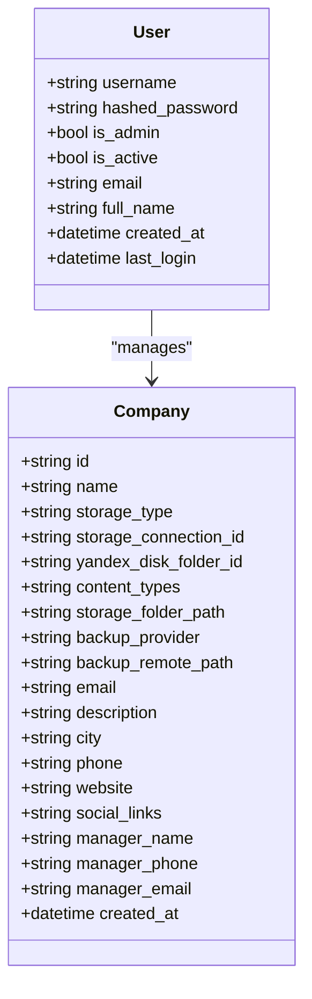
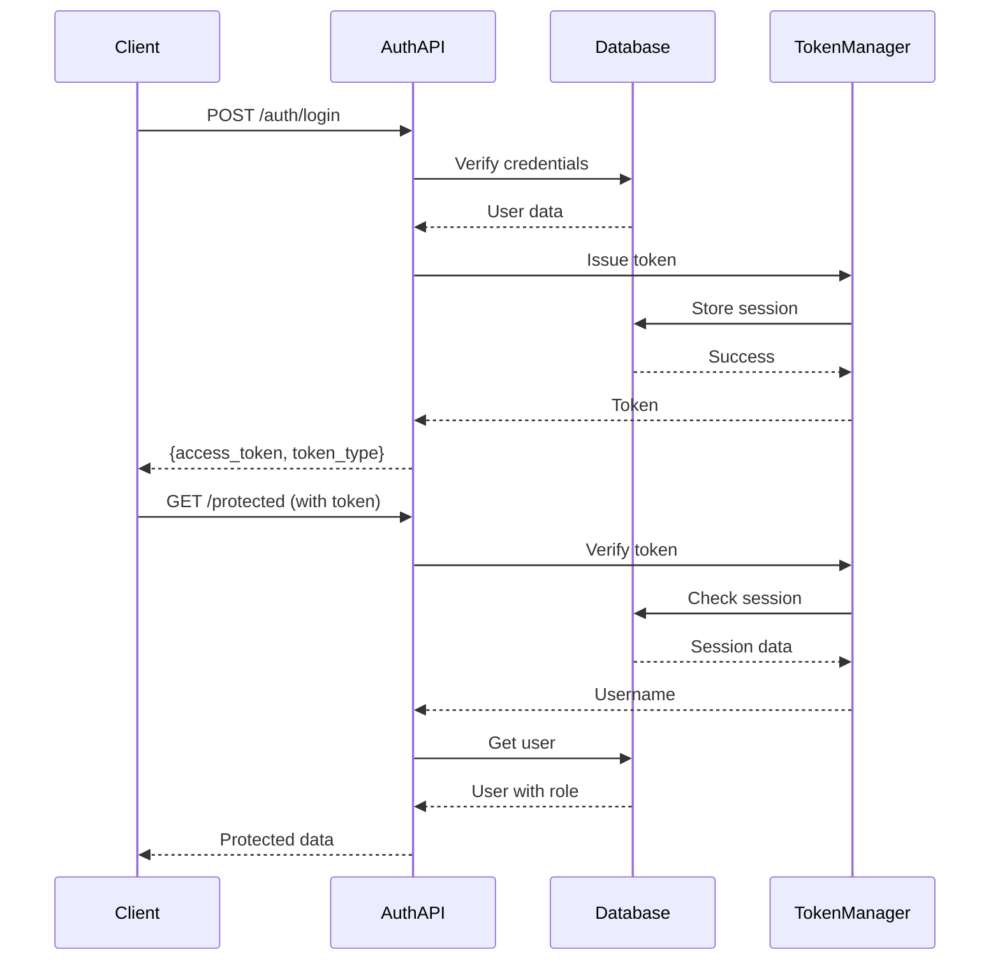
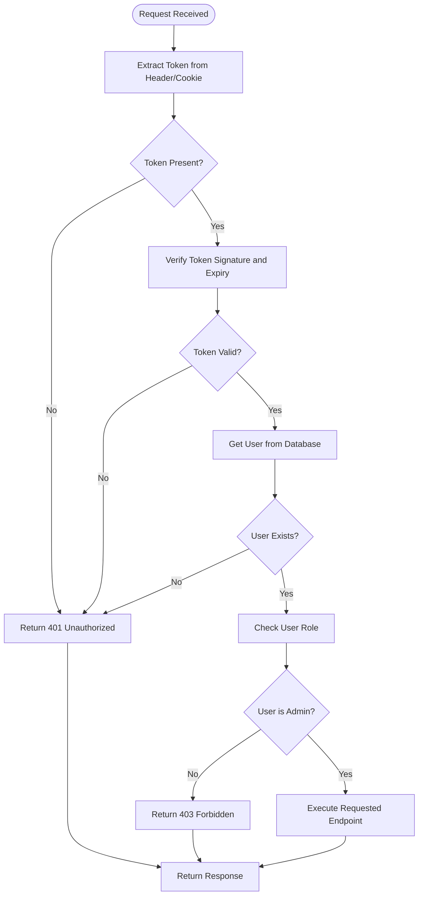
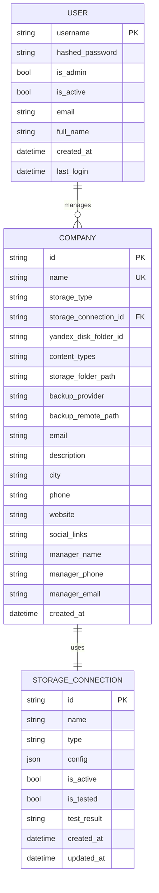

# Role-Based Access Control

<cite>
**Referenced Files in This Document**   
- [auth.py](file://vertex-ar/app/auth.py)
- [api/auth.py](file://vertex-ar/app/api/auth.py)
- [api/admin.py](file://vertex-ar/app/api/admin.py)
- [api/companies.py](file://vertex-ar/app/api/companies.py)
- [api/users.py](file://vertex-ar/app/api/users.py)
- [database.py](file://vertex-ar/app/database.py)
- [main.py](file://vertex-ar/app/main.py)
- [models.py](file://vertex-ar/app/models.py)
- [middleware.py](file://vertex-ar/app/middleware.py)
- [COMPANY_ADMIN_UI.md](file://COMPANY_ADMIN_UI.md)
- [USER_MANAGEMENT.md](file://docs/guides/USER_MANAGEMENT.md)
</cite>

## Table of Contents
1. [Introduction](#introduction)
2. [User Roles and Permissions](#user-roles-and-permissions)
3. [Authentication and Token Management](#authentication-and-token-management)
4. [Role Enforcement in API Endpoints](#role-enforcement-in-api-endpoints)
5. [Data Isolation in Multi-Company Scenarios](#data-isolation-in-multi-company-scenarios)
6. [Security Considerations](#security-considerations)
7. [Performance and Caching](#performance-and-caching)
8. [Extending the Role System](#extending-the-role-system)
9. [Conclusion](#conclusion)

## Introduction
The AR backend application implements a role-based access control (RBAC) system to manage user permissions and enforce security policies across API endpoints. This system defines three primary roles: admin, user, and company_admin, each with distinct permissions and access levels. The RBAC system is implemented through middleware, decorators, and JWT token validation to ensure that users can only access resources and perform actions appropriate to their assigned roles. This document provides a comprehensive overview of the RBAC implementation, including role definitions, permission enforcement, data isolation mechanisms, and security considerations.

## User Roles and Permissions
The AR backend application defines three primary user roles: admin, user, and company_admin. The admin role has the highest level of access, allowing users to perform all administrative functions including user management, company configuration, and system settings. The user role is designed for regular users with limited access to specific features and data. The company_admin role provides intermediate access, allowing management of company-specific resources while restricting access to global system settings.

User roles are stored in the database as boolean flags within the users table. The `is_admin` field determines whether a user has administrative privileges, while additional role-specific fields may be used to define more granular permissions. When a user authenticates, their role information is extracted from the database and included in the JWT token payload, enabling role-based access decisions throughout the application.

**Diagram sources**
- [database.py](file://vertex-ar/app/database.py#L91-133)
- [models.py](file://vertex-ar/app/models.py#L79-192)

**Section sources**
- [database.py](file://vertex-ar/app/database.py#L91-133)
- [models.py](file://vertex-ar/app/models.py#L79-192)

## Authentication and Token Management
The authentication system in the AR backend application is built around JWT tokens and session management. When a user logs in, their credentials are verified against the database, and upon successful authentication, a JWT token is issued and stored in the database with an expiration time. The token is returned to the client and can be used for subsequent requests either in the Authorization header or as a cookie.

The TokenManager class handles the creation, verification, and revocation of tokens. It stores session information in the database to ensure compatibility across Uvicorn workers and provides methods for issuing new tokens, verifying existing tokens, and revoking tokens when users log out or change their password. The system also implements a session cleanup task that periodically removes expired sessions from the database.

**Diagram sources**
- [auth.py](file://vertex-ar/app/auth.py#L27-103)
- [api/auth.py](file://vertex-ar/app/api/auth.py#L109-169)

**Section sources**
- [auth.py](file://vertex-ar/app/auth.py#L27-103)
- [api/auth.py](file://vertex-ar/app/api/auth.py#L109-169)

## Role Enforcement in API Endpoints
Role enforcement is implemented through middleware and decorator patterns that validate user roles before allowing access to protected endpoints. The system uses dependency injection with FastAPI's Depends function to inject role-checking functions into route handlers. These functions extract the JWT token from the request, verify its validity, and check the user's role against the required permissions for the endpoint.

The require_admin function is a key component of the role enforcement system, used to protect administrative endpoints. It checks for the presence of a valid token in either the Authorization header or authToken cookie, verifies the token, and confirms that the user has the admin role. If any of these checks fail, appropriate HTTP error responses are returned (401 for authentication failures, 403 for authorization failures).

**Diagram sources**
- [api/auth.py](file://vertex-ar/app/api/auth.py#L68-106)
- [api/admin.py](file://vertex-ar/app/api/admin.py#L246-258)

**Section sources**
- [api/auth.py](file://vertex-ar/app/api/auth.py#L68-106)
- [api/admin.py](file://vertex-ar/app/api/admin.py#L246-258)

## Data Isolation in Multi-Company Scenarios
The AR backend application implements data isolation to ensure that users can only access resources belonging to their associated company. This is particularly important in multi-company scenarios where multiple organizations use the same system but must maintain separation of their data. The company_admin role allows users to manage their company's resources while preventing access to other companies' data.

When a company_admin user makes a request, the system verifies that the requested resource belongs to their company by checking the company_id field in the relevant database records. This check is performed in the _get_admin_user function, which validates both the user's authentication and their authorization to access company-specific resources. The system also implements additional safeguards, such as preventing the deletion of the default company and restricting changes to critical storage settings.

**Diagram sources**
- [database.py](file://vertex-ar/app/database.py#L124-133)
- [models.py](file://vertex-ar/app/models.py#L79-192)

**Section sources**
- [api/companies.py](file://vertex-ar/app/api/companies.py#L47-84)
- [COMPANY_ADMIN_UI.md](file://COMPANY_ADMIN_UI.md#L384-388)

## Security Considerations
The role-based access control system includes several security measures to prevent common vulnerabilities and attacks. The system implements rate limiting on authentication endpoints to prevent brute force attacks, with a maximum of 5 login attempts per minute. After exceeding this limit, accounts are temporarily locked for 15 minutes to further deter automated attacks.

The system also includes protection against privilege escalation attempts by validating role assignments at multiple levels. When a user attempts to perform an administrative action, the system verifies both their authentication status and their authorization level. The database schema includes constraints to prevent invalid role assignments, and the application code includes validation to ensure that only authorized users can modify role assignments.

Additional security considerations include input validation for all user-provided data, protection against CSRF attacks through cookie-based authentication with SameSite attributes, and encryption of sensitive data such as OAuth tokens and SMTP passwords. The system also implements proper error handling that avoids leaking sensitive information in error messages.

**Section sources**
- [auth.py](file://vertex-ar/app/auth.py#L105-153)
- [COMPANY_ADMIN_UI.md](file://COMPANY_ADMIN_UI.md#L384-388)
- [USER_MANAGEMENT.md](file://docs/guides/USER_MANAGEMENT.md#L289-294)

## Performance and Caching
The role-based access control system is designed with performance considerations in mind, particularly for permission checking and frequently accessed authorization data. The system uses a caching mechanism to store frequently accessed user and company data, reducing the number of database queries required for role verification.

The cache manager is initialized in the main application factory and can use either Redis or an in-memory LRU cache depending on the configuration. User data, including role information, is cached after the first authentication to minimize database access for subsequent requests. The system also implements a session cleanup task that runs every 10 minutes to remove expired sessions from the database, helping to maintain optimal performance.

For high-traffic scenarios, the system could be further optimized by implementing more granular caching strategies, such as caching role permissions separately from user profile data. The current implementation strikes a balance between performance and memory usage, ensuring that the RBAC system remains responsive even under heavy load.

**Section sources**
- [main.py](file://vertex-ar/app/main.py#L106-120)
- [auth.py](file://vertex-ar/app/auth.py#L394-402)

## Extending the Role System
The role-based access control system can be extended to support additional roles or more granular permissions as needed. The current implementation uses a simple boolean flag (is_admin) to distinguish between administrative and regular users, but this could be expanded to support a more sophisticated role hierarchy.

To add new roles, the database schema would need to be updated to include additional role fields or a separate roles table with a many-to-many relationship between users and roles. The authentication system would also need to be modified to include the new role information in the JWT token payload and to implement role-checking functions for the new roles.

For granular permissions, the system could implement a permission-based model where specific actions are associated with permissions that can be granted to roles or individual users. This would allow for more fine-grained access control, such as allowing certain users to view but not modify data, or granting access to specific features within the application.

**Section sources**
- [database.py](file://vertex-ar/app/database.py#L91-133)
- [models.py](file://vertex-ar/app/models.py#L21-29)

## Conclusion
The role-based access control system in the AR backend application provides a robust and secure mechanism for managing user permissions and enforcing access policies. By leveraging JWT tokens, middleware, and decorator patterns, the system effectively protects API endpoints and ensures that users can only access resources appropriate to their roles. The implementation includes important security features such as rate limiting, input validation, and protection against privilege escalation, while also considering performance through caching and efficient database queries. The system is designed to be extensible, allowing for the addition of new roles and more granular permissions as the application evolves.