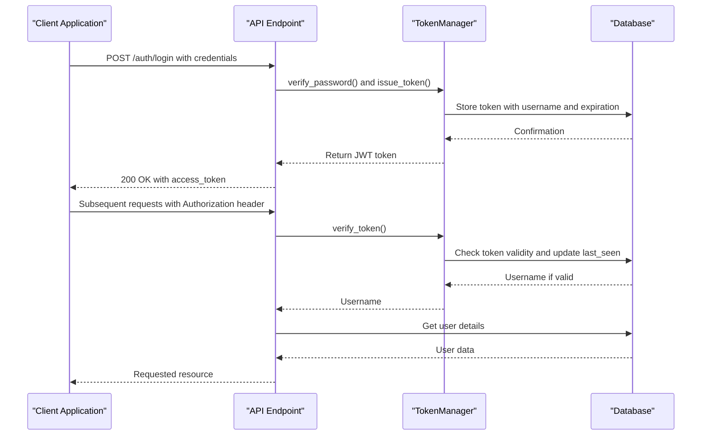
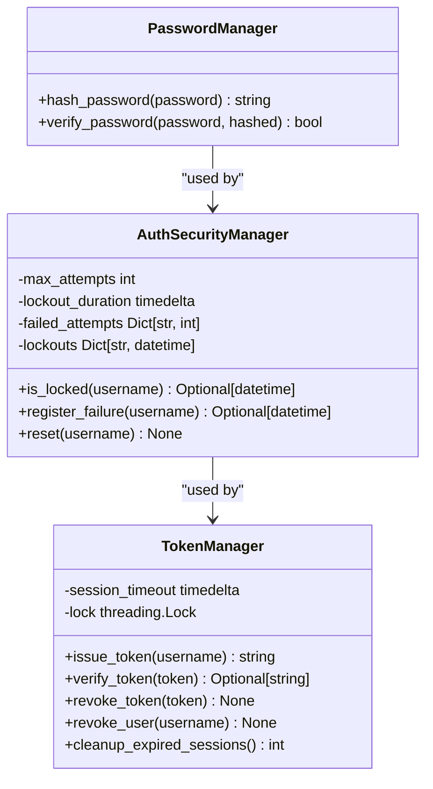
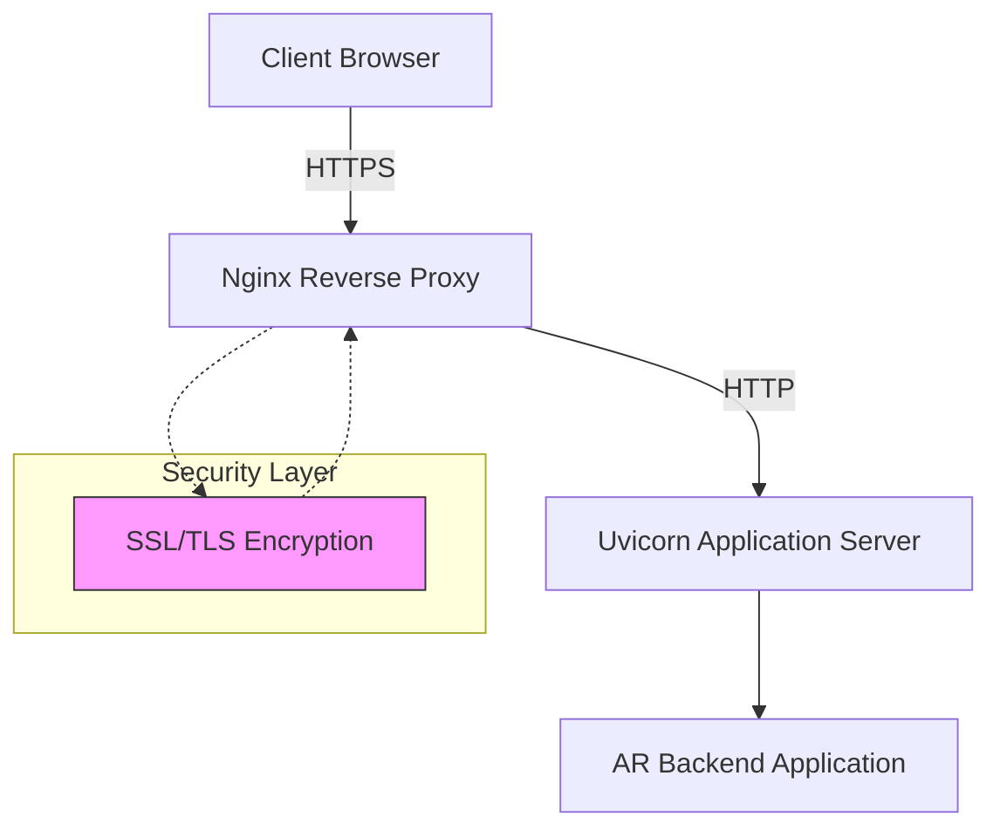
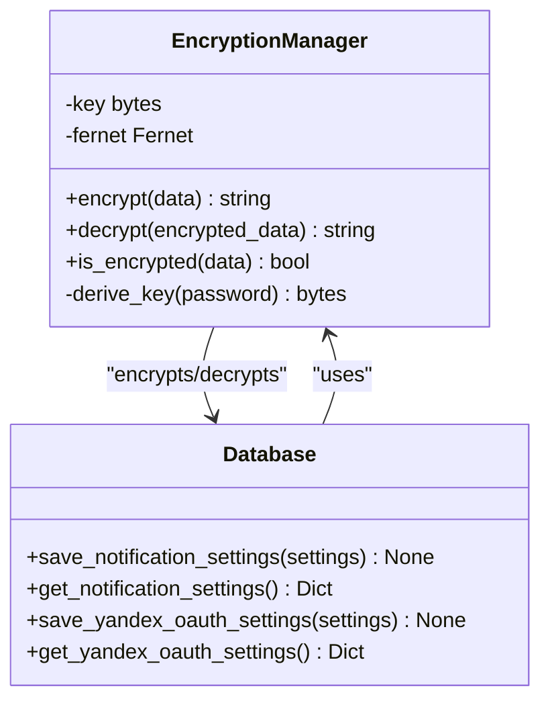
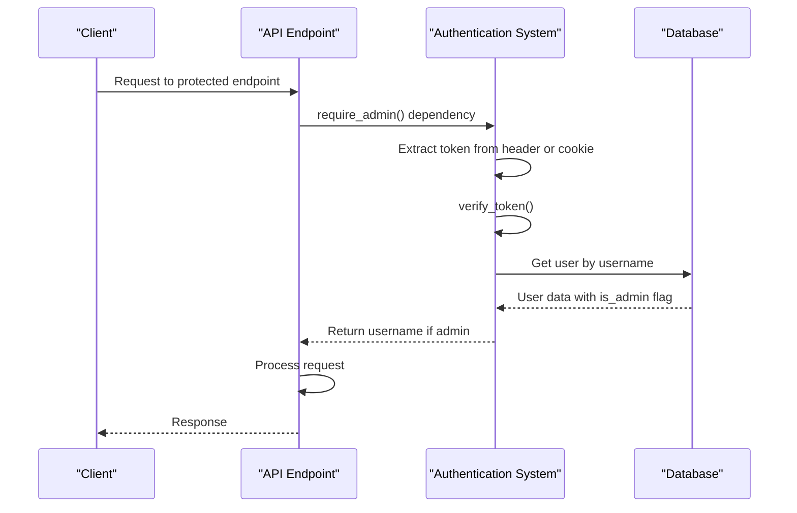
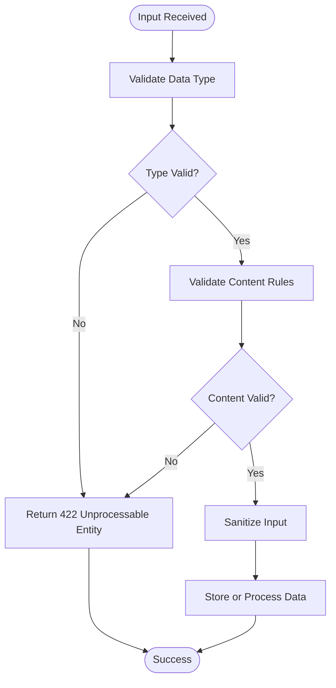
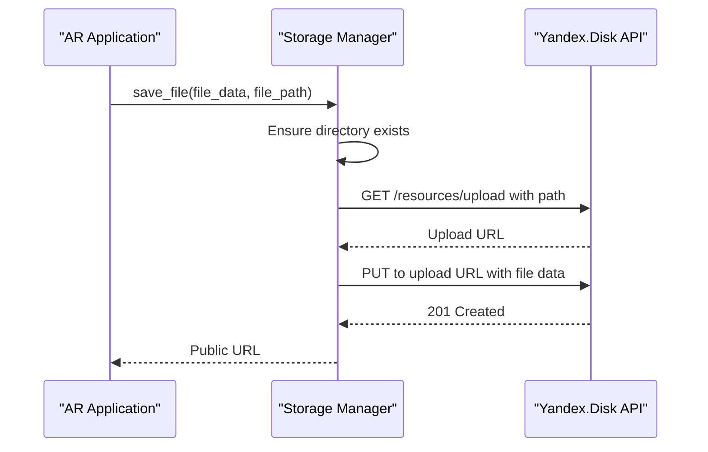

# Security Considerations

<cite>
**Referenced Files in This Document**   
- [auth.py](file://vertex-ar/app/auth.py)
- [config.py](file://vertex-ar/app/config.py)
- [database.py](file://vertex-ar/app/database.py)
- [encryption.py](file://vertex-ar/app/encryption.py)
- [middleware.py](file://vertex-ar/app/middleware.py)
- [models.py](file://vertex-ar/app/models.py)
- [utils.py](file://vertex-ar/app/utils.py)
- [api/auth.py](file://vertex-ar/app/api/auth.py)
- [main.py](file://vertex-ar/app/main.py)
- [email_service.py](file://vertex-ar/app/email_service.py)
- [storage_yandex.py](file://vertex-ar/app/storage_yandex.py)
- [nginx-ssl-setup.md](file://docs/deployment/nginx-ssl-setup.md)
- [SMTP_SECURITY_ENHANCEMENT_SUMMARY.md](file://docs/SMTP_SECURITY_ENHANCEMENT_SUMMARY.md)
</cite>

## Table of Contents
1. [Introduction](#introduction)
2. [Authentication Mechanisms](#authentication-mechanisms)
3. [Password Hashing and Session Management](#password-hashing-and-session-management)
4. [Data Encryption at Rest and in Transit](#data-encryption-at-rest-and-in-transit)
5. [Role-Based Access Control and API Protection](#role-based-access-control-and-api-protection)
6. [Input Validation and Injection Prevention](#input-validation-and-injection-prevention)
7. [Third-Party Integrations Security](#third-party-integrations-security)
8. [Security Audit and Incident Response](#security-audit-and-incident-response)
9. [Production Hardening Guidelines](#production-hardening-guidelines)
10. [Conclusion](#conclusion)

## Introduction
This document provides comprehensive security documentation for the AR backend application, covering all critical security aspects including authentication, encryption, access control, and secure integration with third-party services. The AR backend application implements a robust security framework to protect user data, prevent unauthorized access, and ensure secure operations in production environments. The system employs JWT-based authentication, secure password hashing, encrypted storage of sensitive data, and comprehensive input validation to mitigate common security threats.

**Section sources**
- [auth.py](file://vertex-ar/app/auth.py#L1-L153)
- [config.py](file://vertex-ar/app/config.py#L1-L244)

## Authentication Mechanisms

The AR backend application implements a JWT-based authentication system with database-backed session management. The authentication mechanism is designed to be secure, scalable, and compatible with Uvicorn worker processes through database storage of session tokens.

The system uses a `TokenManager` class that issues cryptographically secure tokens using `secrets.token_urlsafe(32)` and stores them in the database with expiration timestamps. This approach ensures that session state is shared across Uvicorn workers, preventing authentication issues in multi-process deployments.

**Diagram sources** 
- [auth.py](file://vertex-ar/app/auth.py#L27-L103)
- [api/auth.py](file://vertex-ar/app/api/auth.py#L109-L169)

The authentication system includes rate limiting to prevent brute force attacks, with configurable limits defined in the application settings. The `AuthSecurityManager` class enforces temporary lockouts after a configurable number of failed login attempts, helping to prevent credential stuffing attacks.

**Section sources**
- [auth.py](file://vertex-ar/app/auth.py#L105-L153)
- [api/auth.py](file://vertex-ar/app/api/auth.py#L109-L169)
- [main.py](file://vertex-ar/app/main.py#L137-L146)

## Password Hashing and Session Management

The application implements secure password hashing using SHA-256 with no salt, as defined in the `utils.py` file. The `hash_password()` function converts passwords to their SHA-256 hash representation before storage, while the `verify_password()` function compares provided passwords against stored hashes.

**Diagram sources** 
- [utils.py](file://vertex-ar/app/utils.py#L9-L17)
- [auth.py](file://vertex-ar/app/auth.py#L105-L153)

Session management is implemented through database-stored tokens rather than in-memory sessions, ensuring compatibility with multi-worker Uvicorn deployments. The `TokenManager` class handles token issuance, verification, and revocation, with all operations persisted in the database. Sessions have a configurable timeout (default 30 minutes) and are automatically cleaned up when expired.

The system includes a background task that periodically cleans up expired sessions from the database, reducing storage overhead and improving security by removing stale session data. The `cleanup_expired_sessions()` method removes all sessions that have passed their expiration time.

**Section sources**
- [utils.py](file://vertex-ar/app/utils.py#L9-L17)
- [auth.py](file://vertex-ar/app/auth.py#L27-L103)
- [main.py](file://vertex-ar/app/main.py#L381-L409)

## Data Encryption at Rest and in Transit

### SSL/TLS Configuration for Nginx

The application is designed to be deployed behind an Nginx reverse proxy that handles SSL/TLS termination. The current configuration supports both HTTP and HTTPS, with HTTPS requiring SSL certificates to be provided.

The deployment documentation outlines three options for SSL certificate management:
1. **Self-signed certificates** for development environments
2. **Let's Encrypt** for production environments
3. **Automated certificate management** using Certbot in Docker

**Diagram sources** 
- [nginx-ssl-setup.md](file://docs/deployment/nginx-ssl-setup.md#L1-L185)

To activate HTTPS, operators must:
1. Obtain SSL certificates (self-signed or from Let's Encrypt)
2. Place certificates in the `ssl/` directory
3. Uncomment the HTTPS server block in `nginx.conf`
4. Uncomment the SSL volume mount in `docker-compose.yml`
5. Optionally add HTTP to HTTPS redirect
6. Restart the Nginx container

The configuration supports modern security practices including HSTS (HTTP Strict Transport Security) and OCSP stapling, which can be enabled by uncommenting the relevant configuration sections.

**Section sources**
- [nginx-ssl-setup.md](file://docs/deployment/nginx-ssl-setup.md#L1-L185)

### Data Encryption at Rest

The application implements encryption for sensitive data stored in the database using the `EncryptionManager` class. This class uses the Fernet symmetric encryption scheme from the `cryptography` library, which provides authenticated encryption.

**Diagram sources** 
- [encryption.py](file://vertex-ar/app/encryption.py#L16-L84)
- [database.py](file://vertex-ar/app/database.py#L475-L798)

Sensitive data such as SMTP passwords and Yandex Disk OAuth credentials are encrypted before storage in the database. The encryption key is derived from a system secret using PBKDF2 with 100,000 iterations of SHA-256, providing strong protection against brute force attacks.

The system enforces secure storage practices by preventing environment variables from being used for SMTP credentials in production. If `SMTP_USERNAME` or `SMTP_PASSWORD` are detected in the environment, the application logs a critical warning and refuses to start in production mode, forcing operators to use the secure database-backed configuration.

**Section sources**
- [encryption.py](file://vertex-ar/app/encryption.py#L16-L84)
- [database.py](file://vertex-ar/app/database.py#L475-L798)
- [SMTP_SECURITY_ENHANCEMENT_SUMMARY.md](file://docs/SMTP_SECURITY_ENHANCEMENT_SUMMARY.md#L1-L449)

## Role-Based Access Control and API Protection

The application implements role-based access control through a simple admin/non-admin model. User roles are stored in the database with the `is_admin` field, and access to protected endpoints is controlled through dependency injection in FastAPI.

The `require_admin()` function serves as a dependency that verifies both authentication and admin privileges. It checks for the presence of a valid token in either the Authorization header or authToken cookie, verifies the token, and confirms that the user has admin privileges.

**Diagram sources** 
- [api/auth.py](file://vertex-ar/app/api/auth.py#L68-L107)

API endpoints are protected using FastAPI's dependency system, with rate limiting applied to authentication endpoints to prevent brute force attacks. The system uses environment-configurable rate limits, with separate limits for global requests, authentication attempts, and file uploads.

Security headers are implemented through middleware and Nginx configuration. The application uses CORS middleware to restrict cross-origin requests to approved origins, and Nginx can be configured with additional security headers including HSTS for enforcing HTTPS connections.

**Section sources**
- [api/auth.py](file://vertex-ar/app/api/auth.py#L68-L107)
- [main.py](file://vertex-ar/app/main.py#L65-L75)
- [nginx-ssl-setup.md](file://docs/deployment/nginx-ssl-setup.md#L158-L172)

## Input Validation and Injection Prevention

The application implements comprehensive input validation using Pydantic models and custom validators. All API inputs are validated against defined schemas, with specific validation rules for different data types.

The `validators.py` file contains custom validation functions for various data types including:
- Email addresses (format and length validation)
- Phone numbers (digit content and length validation)
- Usernames (character set and length validation)
- Passwords (strength requirements)
- URLs (format validation)
- Names (character content validation)

**Diagram sources** 
- [validators.py](file://vertex-ar/app/validators.py#L1-L212)
- [models.py](file://vertex-ar/app/models.py#L20-L800)

The validation system prevents common injection attacks by rejecting malformed input before it reaches business logic. For example, the `validate_social_links()` function ensures that social media links are valid JSON objects with properly formatted URLs, preventing injection through this field.

Database interactions use parameterized queries to prevent SQL injection attacks. The `Database._execute()` method accepts parameters separately from the query string, ensuring that user input is properly escaped and cannot modify the query structure.

**Section sources**
- [validators.py](file://vertex-ar/app/validators.py#L1-L212)
- [models.py](file://vertex-ar/app/models.py#L20-L800)
- [database.py](file://vertex-ar/app/database.py#L48-L86)

## Third-Party Integrations Security

### Yandex.Disk Integration

The application integrates with Yandex.Disk for remote storage using OAuth 2.0 authentication. The integration stores OAuth tokens encrypted in the database, preventing exposure of credentials.

The `YandexDiskStorageAdapter` class implements secure communication with the Yandex.Disk API using HTTPS and includes several security features:
- Persistent session with connection pooling
- Configurable request timeouts to prevent denial of service
- Retry logic with exponential backoff
- Directory creation caching with TTL to reduce API calls
- Prometheus metrics for monitoring

**Diagram sources** 
- [storage_yandex.py](file://vertex-ar/app/storage_yandex.py#L84-L800)

The integration includes comprehensive error handling and logging, with all API interactions monitored for failures. The system implements circuit breaker patterns to prevent cascading failures when the Yandex.Disk service is unavailable.

**Section sources**
- [storage_yandex.py](file://vertex-ar/app/storage_yandex.py#L84-L800)

### SMTP Integration

The application's SMTP integration has been enhanced to eliminate security vulnerabilities in credential management. The system no longer allows SMTP credentials to be configured via environment variables in production, preventing accidental exposure of credentials.

Instead, SMTP credentials are stored encrypted in the database and accessed through the `notification_config.get_smtp_config()` method, which includes audit logging of all access attempts. Each access is logged with an actor identifier, timestamp, and sanitized configuration (with passwords redacted).

The email service implements a persistent queue with retry logic and failure monitoring. Failed emails are automatically retried with exponential backoff, and high failure rates trigger alerts to prevent service disruption.

**Section sources**
- [email_service.py](file://vertex-ar/app/email_service.py#L1-L627)
- [SMTP_SECURITY_ENHANCEMENT_SUMMARY.md](file://docs/SMTP_SECURITY_ENHANCEMENT_SUMMARY.md#L1-L449)

## Security Audit and Incident Response

The application includes comprehensive logging and monitoring capabilities to support security audits and incident response. All authentication attempts, including successes and failures, are logged with detailed information including username, client IP, and timestamp.

Security-relevant events are logged with structured data that can be easily parsed and analyzed:
- Authentication attempts and outcomes
- Session creation and revocation
- Access to sensitive configuration
- Failed login attempts and account lockouts
- Email sending attempts and outcomes
- Database query performance

The system integrates with Sentry for error tracking and alerting, with configurable sampling rates to balance detail and performance. Critical security events, such as detection of environment-based SMTP credentials, generate high-severity alerts.

For incident response, the application provides several diagnostic tools:
- Health check endpoints to verify system status
- Prometheus metrics for performance monitoring
- Log files with structured JSON output
- Database-backed audit trails for configuration changes

The system includes a session cleanup task that runs periodically to remove expired sessions from the database, reducing the attack surface and ensuring that inactive sessions cannot be used for unauthorized access.

**Section sources**
- [middleware.py](file://vertex-ar/app/middleware.py#L1-L156)
- [main.py](file://vertex-ar/app/main.py#L5-L477)
- [email_service.py](file://vertex-ar/app/email_service.py#L1-L627)

## Production Hardening Guidelines

To ensure secure production deployments, the following hardening guidelines should be followed:

### Environment Configuration
- Set `ENVIRONMENT=production` in production environments
- Remove `SMTP_USERNAME` and `SMTP_PASSWORD` from environment variables
- Configure a strong `SECRET_KEY` for session security
- Set appropriate session timeout values
- Configure rate limiting parameters based on expected traffic

### SSL/TLS Configuration
- Use Let's Encrypt or a trusted certificate authority for SSL certificates
- Enable HSTS to enforce HTTPS connections
- Configure OCSP stapling for improved certificate validation performance
- Use strong cipher suites as recommended by Mozilla SSL Configuration Generator
- Set up automated certificate renewal

### Database Security
- Ensure the database file has appropriate file permissions (600)
- Regularly back up the database with encryption
- Monitor database size and performance
- Keep the database schema updated with security patches

### Monitoring and Alerting
- Configure alerting for high resource usage (CPU, memory, disk)
- Monitor email delivery failure rates
- Set up alerts for authentication anomalies
- Regularly review logs for suspicious activity
- Implement centralized log management

### Backup and Recovery
- Configure automated backups to secure remote storage
- Test backup restoration procedures regularly
- Maintain multiple backup copies in different locations
- Encrypt backup data at rest
- Implement retention policies based on compliance requirements

**Section sources**
- [config.py](file://vertex-ar/app/config.py#L1-L244)
- [nginx-ssl-setup.md](file://docs/deployment/nginx-ssl-setup.md#L1-L185)
- [SMTP_SECURITY_ENHANCEMENT_SUMMARY.md](file://docs/SMTP_SECURITY_ENHANCEMENT_SUMMARY.md#L1-L449)

## Conclusion
The AR backend application implements a comprehensive security framework that addresses authentication, data protection, access control, and secure integration with third-party services. The system uses JWT-based authentication with database-backed session storage, secure password hashing, and encrypted storage of sensitive data. Input validation and injection prevention are implemented at multiple layers, from API input validation to database query parameterization.

The application's security posture has been strengthened through the elimination of environment-based credential storage, particularly for SMTP credentials, which are now securely stored encrypted in the database with comprehensive audit logging. Third-party integrations with services like Yandex.Disk and SMTP providers are implemented with secure authentication and communication practices.

For production deployments, operators should follow the hardening guidelines to ensure optimal security, including proper SSL/TLS configuration, environment hardening, and comprehensive monitoring. The system provides extensive logging and monitoring capabilities to support security audits and incident response, with structured logs and integrated alerting.

By following the security practices outlined in this document, operators can deploy the AR backend application with confidence in its security posture and compliance with industry best practices.

[No sources needed since this section summarizes without analyzing specific files]