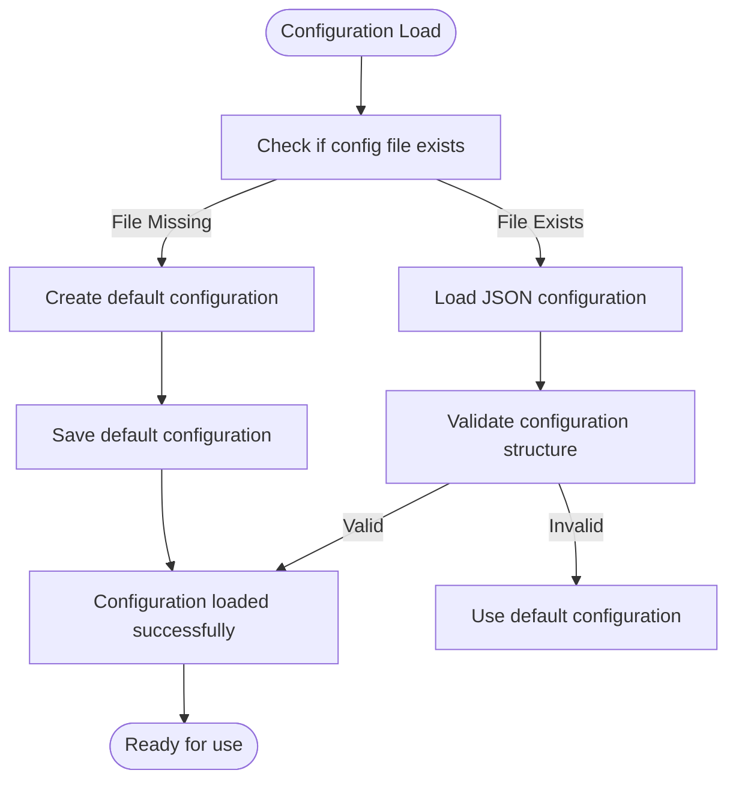
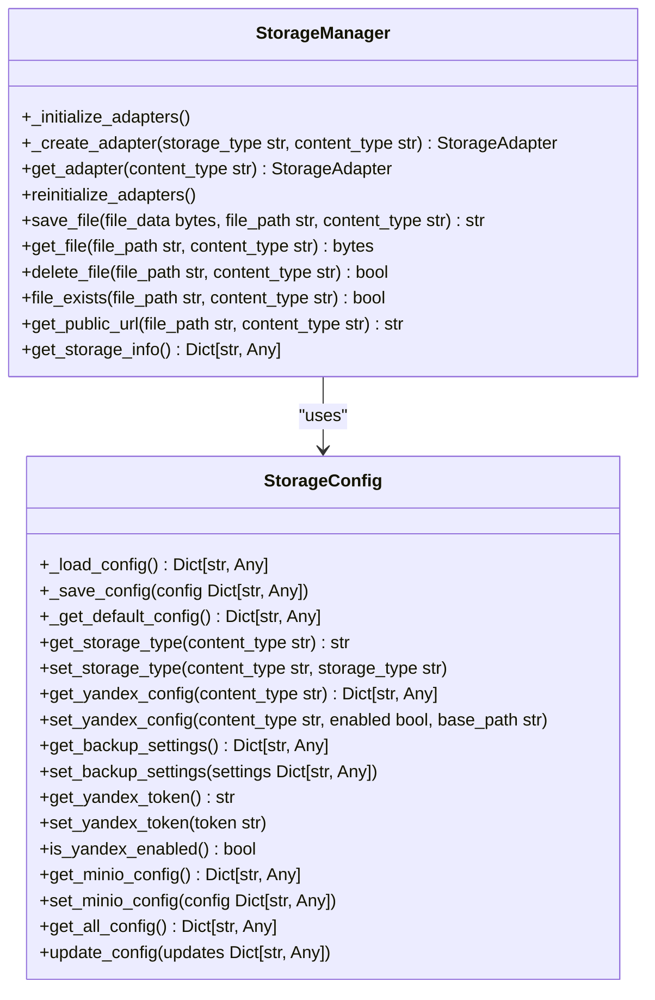
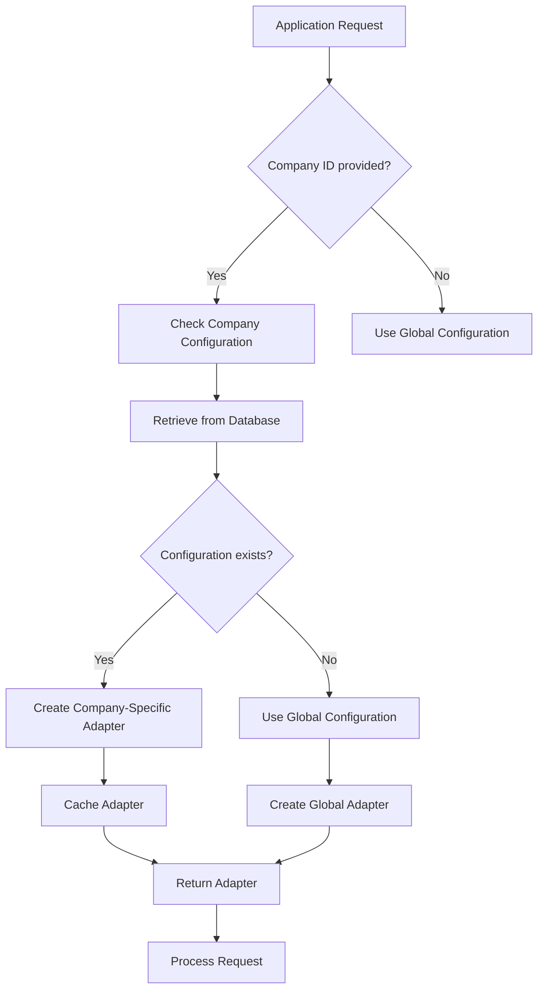
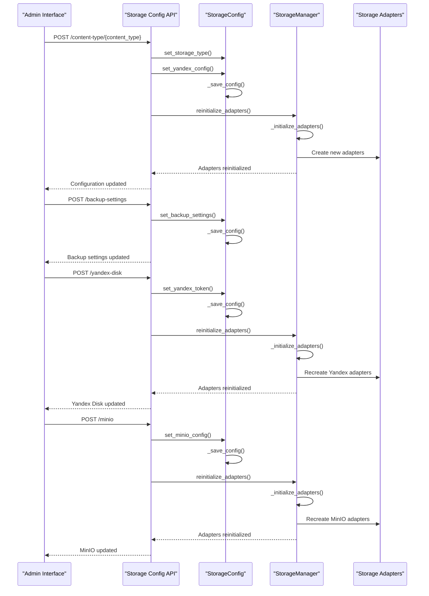
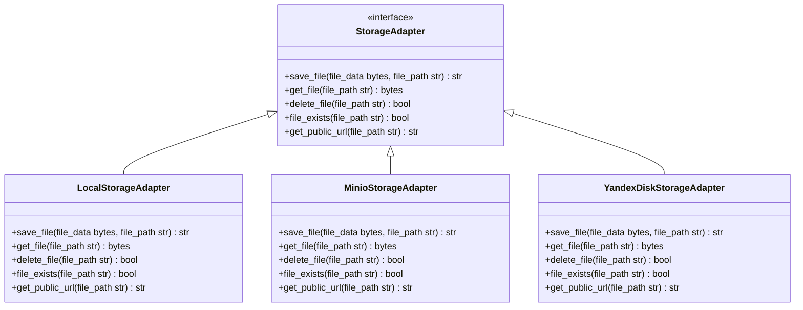
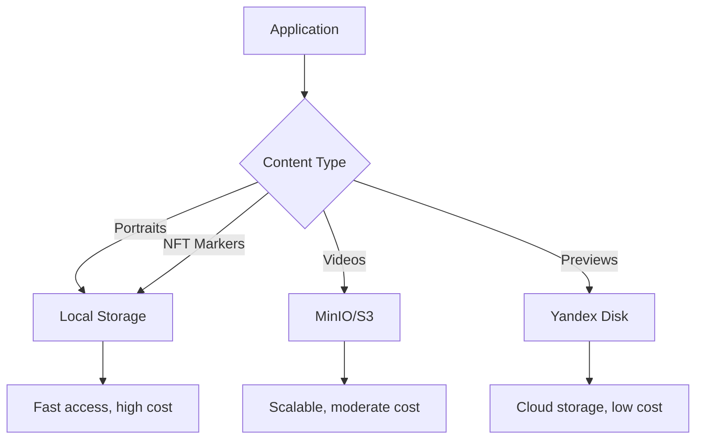

# Configuration Management

<cite>
**Referenced Files in This Document**   
- [storage_config.json](file://vertex-ar/config/storage_config.json)
- [remote_storage.example.json](file://vertex-ar/config/remote_storage.example.json)
- [storage_config.py](file://vertex-ar/storage_config.py)
- [storage_manager.py](file://vertex-ar/storage_manager.py)
- [app/api/storage_config.py](file://vertex-ar/app/api/storage_config.py)
- [app/storage_minio.py](file://vertex-ar/app/storage_minio.py)
- [app/storage_yandex.py](file://vertex-ar/app/storage_yandex.py)
- [.env.example](file://vertex-ar/.env.example)
- [.env.production.example](file://vertex-ar/.env.production.example)
- [backup_manager.py](file://vertex-ar/backup_manager.py)
</cite>

## Table of Contents
1. [Introduction](#introduction)
2. [Configuration Schema](#configuration-schema)
3. [Configuration Loading and Validation](#configuration-loading-and-validation)
4. [Hierarchical Configuration System](#hierarchical-configuration-system)
5. [Runtime Configuration Reloading](#runtime-configuration-reloading)
6. [Storage Adapters and Propagation](#storage-adapters-and-propagation)
7. [Security Considerations](#security-considerations)
8. [Deployment Scenarios](#deployment-scenarios)
9. [Backup Configuration](#backup-configuration)
10. [Best Practices](#best-practices)

## Introduction

The Vertex AR system implements a comprehensive storage configuration management system that supports both JSON configuration files and environment variables. This system enables flexible storage management across different content types including portraits, videos, previews, and NFT markers. The configuration system supports a hierarchical approach with global defaults and company-specific overrides, allowing for both centralized management and tenant isolation in multi-company deployments.

The system provides API endpoints for dynamic configuration updates, runtime reloading of settings, and integration with multiple storage backends including local storage, MinIO/S3-compatible services, and Yandex Disk. Configuration changes are validated and propagated to storage adapters automatically, ensuring consistency across the application.

**Section sources**
- [storage_config.py](file://vertex-ar/storage_config.py#L1-L203)
- [storage_manager.py](file://vertex-ar/storage_manager.py#L1-L582)

## Configuration Schema

The storage configuration schema is defined in the `storage_config.json` file and consists of several key sections that control different aspects of storage management.

### Content Types Configuration

The `content_types` section defines storage settings for different content categories in the system:

```json
"content_types": {
  "portraits": {
    "storage_type": "local",
    "yandex_disk": {
      "enabled": false,
      "base_path": "vertex-ar/portraits"
    }
  },
  "videos": {
    "storage_type": "local",
    "yandex_disk": {
      "enabled": false,
      "base_path": "vertex-ar/videos"
    }
  },
  "previews": {
    "storage_type": "local",
    "yandex_disk": {
      "enabled": false,
      "base_path": "vertex-ar/previews"
    }
  },
  "nft_markers": {
    "storage_type": "local",
    "yandex_disk": {
      "enabled": false,
      "base_path": "vertex-ar/nft_markers"
    }
  }
}
```

Each content type can have its own storage type (`local`, `minio`, or `yandex_disk`) and specific configuration for Yandex Disk integration, including whether it's enabled and the base path on Yandex Disk.

### Backup Settings

The `backup_settings` section controls the behavior of automated backups:

```json
"backup_settings": {
  "auto_split_backups": true,
  "max_backup_size_mb": 500,
  "chunk_size_mb": 100,
  "compression": "gz"
}
```

These settings determine whether large backups should be automatically split into smaller chunks, the maximum size of backup files, the chunk size for splitting, and the compression algorithm to use.

### Yandex Disk Configuration

The `yandex_disk` section contains global settings for Yandex Disk integration:

```json
"yandex_disk": {
  "oauth_token": "",
  "enabled": false
}
```

This includes the OAuth token for authentication and a global enable/disable flag.

### MinIO Configuration

The `minio` section configures the MinIO/S3-compatible storage backend:

```json
"minio": {
  "enabled": false,
  "endpoint": "",
  "access_key": "",
  "secret_key": "",
  "bucket": ""
}
```

This includes connection details such as the endpoint URL, access credentials, and bucket name.

**Section sources**
- [storage_config.json](file://vertex-ar/config/storage_config.json#L1-L49)
- [storage_config.py](file://vertex-ar/storage_config.py#L58-L107)

## Configuration Loading and Validation

The storage configuration system follows a well-defined process for loading, validating, and managing configuration data.

### Configuration Loading Process

The `StorageConfig` class in `storage_config.py` handles the loading of configuration from the JSON file:



When the configuration file is missing, the system creates a default configuration based on predefined settings. The configuration is loaded from `config/storage_config.json` by default, but a custom path can be specified during initialization.

### Configuration Validation

The system performs several validation checks when loading configuration:

1. **File existence**: Checks if the configuration file exists
2. **JSON parsing**: Validates that the file contains valid JSON
3. **Structure validation**: Ensures required sections exist
4. **Default fallback**: Uses default values for missing configuration options

The validation process is implemented in the `_load_config` method of the `StorageConfig` class, which attempts to load the configuration and falls back to defaults if loading fails.

### Environment Variable Integration

While the primary configuration is stored in JSON files, the system also integrates with environment variables for certain settings. The `.env.example` file defines several storage-related environment variables:

```env
# Storage type: "local" or "minio"
STORAGE_TYPE=local

# Local storage path (relative to application directory)
STORAGE_PATH=./storage

# MinIO endpoint (without http://)
MINIO_ENDPOINT=localhost:9000

# MinIO access credentials
MINIO_ACCESS_KEY=minioadmin
MINIO_SECRET_KEY=minioadmin

# MinIO bucket name
MINIO_BUCKET=vertex-ar

# Use secure connection (HTTPS) - set to True for production/remote MinIO
MINIO_SECURE=False
```

These environment variables provide an alternative way to configure storage settings, particularly useful for containerized deployments and environment-specific configurations.



**Diagram sources**
- [storage_config.py](file://vertex-ar/storage_config.py#L15-L203)
- [storage_manager.py](file://vertex-ar/storage_manager.py#L19-L582)

**Section sources**
- [storage_config.py](file://vertex-ar/storage_config.py#L28-L43)
- [.env.example](file://vertex-ar/.env.example#L42-L65)

## Hierarchical Configuration System

The Vertex AR system implements a hierarchical configuration system that supports both global defaults and company-specific overrides, enabling flexible multi-tenant storage management.

### Global Configuration

The global configuration is stored in `storage_config.json` and serves as the default for all companies. This configuration defines the baseline storage settings that apply system-wide unless overridden by company-specific settings.

### Company-Specific Overrides

The system supports company-specific storage configurations through the `StorageManager` class. When a company has specific storage requirements, these can be configured through the database rather than the global configuration file.

The `get_company_adapter` method in `StorageManager` handles the retrieval of company-specific storage adapters:

```python
def get_company_adapter(self, company_id: str, content_type: str) -> StorageAdapter:
    """Get storage adapter for specific company and content type."""
    # Check if we have cached adapter for this company
    if company_id in self._company_adapters and content_type in self._company_adapters[company_id]:
        return self._company_adapters[company_id][content_type]
    
    # Get company storage configuration from database
    from app.main import get_current_app
    app = get_current_app()
    database = app.state.database
    
    company = database.get_company(company_id)
    if not company:
        logger.error(f"Company not found: {company_id}, using default storage")
        return self.get_adapter(content_type)
    
    storage_type = company.get('storage_type', 'local')
    storage_connection_id = company.get('storage_connection_id')
    yandex_disk_folder_id = company.get('yandex_disk_folder_id')
    
    # Create adapter based on company configuration
    adapter = self._create_adapter_for_company(
        storage_type, 
        storage_connection_id, 
        content_type,
        yandex_disk_folder_id
    )
    
    # Cache the adapter
    if company_id not in self._company_adapters:
        self._company_adapters[company_id] = {}
    self._company_adapters[company_id][content_type] = adapter
    
    return adapter
```

This method first checks for a cached adapter, then retrieves the company configuration from the database, and creates an appropriate storage adapter based on the company's settings.

### Configuration Priority

The system follows a specific priority order when determining which configuration to use:

1. **Company-specific configuration** (highest priority)
2. **Global configuration** (default)
3. **Environment variables** (deployment-specific overrides)
4. **Hardcoded defaults** (lowest priority)

This hierarchy allows for flexible configuration management, where most companies can use the global defaults while specific companies can have customized storage configurations.



**Diagram sources**
- [storage_manager.py](file://vertex-ar/storage_manager.py#L200-L243)

**Section sources**
- [storage_manager.py](file://vertex-ar/storage_manager.py#L200-L243)
- [storage_manager.py](file://vertex-ar/storage_manager.py#L244-L316)

## Runtime Configuration Reloading

The Vertex AR system supports runtime configuration reloading, allowing administrators to modify storage settings without restarting the application.

### API-Driven Configuration Updates

The system provides a comprehensive API for updating storage configuration at runtime. The `app/api/storage_config.py` file defines several endpoints for modifying different aspects of the configuration:



### Configuration Propagation

When configuration changes are made through the API, they are automatically propagated to the storage system:

1. The configuration is updated in memory and saved to the JSON file
2. The `reinitialize_adapters()` method is called on the `StorageManager`
3. All storage adapters are recreated with the new configuration
4. The changes take effect immediately for subsequent requests

This ensures that configuration changes are applied consistently across the entire system without requiring a restart.

### Configuration Validation on Update

Before applying configuration changes, the system performs validation to ensure the new settings are valid:

```python
@router.post("/content-type/{content_type}")
async def update_content_type_storage(
    content_type: str,
    config: StorageTypeConfig,
    _admin=Depends(require_admin)
) -> Dict[str, Any]:
    """
    Update storage configuration for a content type.
    """
    if content_type not in ["portraits", "videos", "previews", "nft_markers"]:
        raise HTTPException(status_code=400, detail=f"Invalid content type: {content_type}")
    
    try:
        storage_config = get_storage_config()
        
        # Set storage type
        storage_config.set_storage_type(content_type, config.storage_type)
        
        # Set Yandex Disk config if provided
        if config.yandex_disk:
            storage_config.set_yandex_config(
                content_type,
                config.yandex_disk.get("enabled", False),
                config.yandex_disk.get("base_path")
            )
        
        # Reinitialize storage manager
        storage_manager = get_storage_manager()
        storage_manager.reinitialize_adapters()
        
        return {
            "success": True,
            "message": f"Storage configuration for {content_type} updated successfully",
            "content_type": content_type,
            "storage_type": config.storage_type
        }
        
    except Exception as e:
        logger.error("Failed to update storage config", error=str(e), exc_info=e)
        raise HTTPException(status_code=500, detail=f"Failed to update config: {str(e)}")
```

The validation includes checking for valid content types and handling exceptions that might occur during the update process.

**Diagram sources**
- [app/api/storage_config.py](file://vertex-ar/app/api/storage_config.py#L76-L124)

**Section sources**
- [app/api/storage_config.py](file://vertex-ar/app/api/storage_config.py#L76-L124)
- [storage_manager.py](file://vertex-ar/storage_manager.py#L106-L108)

## Storage Adapters and Propagation

The Vertex AR system uses a modular storage adapter architecture that allows for different storage backends to be used interchangeably.

### Storage Adapter Architecture

The system implements a factory pattern for creating storage adapters based on the configured storage type:

```python
def _create_adapter(self, storage_type: str, content_type: str) -> StorageAdapter:
    """Create storage adapter for given type and content."""
    if is_local_storage(storage_type):
        return LocalStorageAdapter(self.storage_root)
    
    elif storage_type == "minio":
        minio_config = self.config.get_minio_config()
        return MinioStorageAdapter(
            endpoint=minio_config.get("endpoint", "localhost:9000"),
            access_key=minio_config.get("access_key", "minioadmin"),
            secret_key=minio_config.get("secret_key", "minioadmin"),
            bucket=minio_config.get("bucket", "vertex-ar")
        )
    
    elif storage_type == "yandex_disk":
        token = self.config.get_yandex_token()
        if not token:
            logger.error("Yandex Disk token not configured, falling back to local storage")
            return LocalStorageAdapter(self.storage_root)
        
        yandex_config = self.config.get_yandex_config(content_type)
        base_path = yandex_config.get("base_path", f"vertex-ar/{content_type}")
        
        # Get tuning parameters from settings
        from app.config import settings
        
        return YandexDiskStorageAdapter(
            oauth_token=token,
            base_path=base_path,
            timeout=settings.YANDEX_REQUEST_TIMEOUT,
            chunk_size_mb=settings.YANDEX_CHUNK_SIZE_MB,
            upload_concurrency=settings.YANDEX_UPLOAD_CONCURRENCY,
            cache_ttl=settings.YANDEX_DIRECTORY_CACHE_TTL,
            cache_size=settings.YANDEX_DIRECTORY_CACHE_SIZE,
            pool_connections=settings.YANDEX_SESSION_POOL_CONNECTIONS,
            pool_maxsize=settings.YANDEX_SESSION_POOL_MAXSIZE
        )
    
    else:
        logger.warning(
            "Unknown storage type, falling back to local",
            storage_type=storage_type
        )
        return LocalStorageAdapter(self.storage_root)
```

This factory method creates the appropriate adapter based on the storage type specified in the configuration.

### Adapter Propagation

When configuration changes occur, the system propagates these changes to the storage adapters through the `reinitialize_adapters()` method:

```python
def reinitialize_adapters(self):
    """Reinitialize all adapters (useful after config change)."""
    self._initialize_adapters()
```

This method recreates all storage adapters with the updated configuration, ensuring that all subsequent operations use the new settings.

### Supported Storage Types

The system supports three main storage types:

1. **Local storage**: Files are stored on the local filesystem
2. **MinIO/S3-compatible**: Files are stored in a MinIO or S3-compatible object storage
3. **Yandex Disk**: Files are stored in Yandex Disk cloud storage

Each storage type has its own adapter implementation that handles the specific details of interacting with that storage backend.



**Diagram sources**
- [storage_manager.py](file://vertex-ar/storage_manager.py#L50-L93)
- [app/storage_minio.py](file://vertex-ar/app/storage_minio.py#L10-L237)
- [app/storage_yandex.py](file://vertex-ar/app/storage_yandex.py#L84-L103)

**Section sources**
- [storage_manager.py](file://vertex-ar/storage_manager.py#L50-L93)
- [app/storage_minio.py](file://vertex-ar/app/storage_minio.py#L10-L237)
- [app/storage_yandex.py](file://vertex-ar/app/storage_yandex.py#L84-L103)

## Security Considerations

The Vertex AR system implements several security measures to protect sensitive configuration data and ensure secure storage operations.

### Sensitive Credential Management

The system handles sensitive credentials such as API keys and tokens with care:

1. **Yandex Disk OAuth token**: Stored in the configuration file but should be protected with appropriate file permissions
2. **MinIO credentials**: Can be stored in environment variables or configuration files
3. **Database credentials**: Managed separately from storage configuration

The `.env.production.example` file provides guidance for production deployments:

```env
# Use MinIO for scalable storage
STORAGE_TYPE=minio

# Option 1: Self-hosted MinIO on separate server
MINIO_ENDPOINT=minio.yourdomain.com:9000
MINIO_ACCESS_KEY=your-production-access-key
MINIO_SECRET_KEY=your-production-secret-key
MINIO_BUCKET=vertex-ar-production
MINIO_SECURE=True

# Public URL (if using CDN or reverse proxy)
MINIO_PUBLIC_URL=https://cdn.yourdomain.com
```

### Configuration File Security

The system recommends the following security practices for configuration files:

1. **File permissions**: Restrict access to configuration files to authorized users only
2. **Version control**: Exclude sensitive configuration files from version control
3. **Environment separation**: Use different configuration files for development, staging, and production

The `.env.example` file includes important security notes:

```env
# ============================================
# Notes
# ============================================

# 1. Never commit the .env file to version control
# 2. Generate a strong SECRET_KEY for production
# 3. Change default MINIO credentials in production
# 4. Enable HTTPS in production
# 5. Configure proper CORS_ORIGINS in production
# 6. Enable rate limiting in production
# 7. Set up proper logging and monitoring
# 8. Use PostgreSQL instead of SQLite for production
# 9. Use Redis for session storage in production
# 10. Regular backups of database and storage
```

### API Security

The storage configuration API endpoints require administrative authentication:

```python
@router.post("/content-type/{content_type}")
async def update_content_type_storage(
    content_type: str,
    config: StorageTypeConfig,
    _admin=Depends(require_admin)
) -> Dict[str, Any]:
    """
    Update storage configuration for a content type.
    
    Requires admin authentication.
    """
```

This ensures that only authorized administrators can modify storage settings.

### Secure Defaults

The system implements secure defaults for production deployments:

```env
# Production settings
DEBUG=False
SHOW_ERROR_DETAILS=False
CORS_ORIGINS=https://yourdomain.com
BASE_URL=https://yourdomain.com
RATE_LIMIT_ENABLED=True
ANALYTICS_ENABLED=True
```

These defaults disable debug mode, hide detailed error messages, restrict CORS origins, and enable rate limiting and analytics.

**Section sources**
- [.env.example](file://vertex-ar/.env.example#L328-L338)
- [.env.production.example](file://vertex-ar/.env.production.example#L1-L93)
- [app/api/storage_config.py](file://vertex-ar/app/api/storage_config.py#L76-L124)

## Deployment Scenarios

The Vertex AR system supports multiple deployment scenarios through different configuration approaches.

### Development Environment

For development, the system uses local storage with minimal configuration:

```json
{
  "content_types": {
    "portraits": {
      "storage_type": "local",
      "yandex_disk": {
        "enabled": false,
        "base_path": "vertex-ar/portraits"
      }
    },
    "videos": {
      "storage_type": "local",
      "yandex_disk": {
        "enabled": false,
        "base_path": "vertex-ar/videos"
      }
    }
  },
  "backup_settings": {
    "auto_split_backups": true,
    "max_backup_size_mb": 500,
    "chunk_size_mb": 100,
    "compression": "gz"
  },
  "yandex_disk": {
    "oauth_token": "",
    "enabled": false
  },
  "minio": {
    "enabled": false,
    "endpoint": "",
    "access_key": "",
    "secret_key": "",
    "bucket": ""
  }
}
```

The `.env.example` file provides development-friendly settings:

```env
DEBUG=True
STORAGE_TYPE=local
STORAGE_PATH=./storage
MINIO_ENDPOINT=localhost:9000
MINIO_ACCESS_KEY=minioadmin
MINIO_SECRET_KEY=minioadmin
MINIO_BUCKET=vertex-ar
MINIO_SECURE=False
```

### Production Environment

For production deployments, the system supports remote storage backends:

```env
# Production environment
DEBUG=False
STORAGE_TYPE=minio
MINIO_ENDPOINT=minio.yourdomain.com:9000
MINIO_ACCESS_KEY=your-production-access-key
MINIO_SECRET_KEY=your-production-secret-key
MINIO_BUCKET=vertex-ar-production
MINIO_SECURE=True
MINIO_PUBLIC_URL=https://cdn.yourdomain.com
```

Or for Yandex Disk:

```json
{
  "yandex_disk": {
    "oauth_token": "your-oauth-token",
    "enabled": true
  },
  "content_types": {
    "portraits": {
      "storage_type": "yandex_disk",
      "yandex_disk": {
        "enabled": true,
        "base_path": "vertex-ar/portraits"
      }
    }
  }
}
```

### Hybrid Storage Configuration

The system supports hybrid configurations where different content types use different storage backends:

```json
{
  "content_types": {
    "portraits": {
      "storage_type": "local"
    },
    "videos": {
      "storage_type": "minio"
    },
    "previews": {
      "storage_type": "yandex_disk",
      "yandex_disk": {
        "enabled": true,
        "base_path": "vertex-ar/previews"
      }
    }
  }
}
```

This allows organizations to optimize storage costs and performance by using different backends for different content types.



**Diagram sources**
- [storage_config.json](file://vertex-ar/config/storage_config.json#L1-L49)
- [.env.production.example](file://vertex-ar/.env.production.example#L1-L93)

**Section sources**
- [storage_config.json](file://vertex-ar/config/storage_config.json#L1-L49)
- [.env.example](file://vertex-ar/.env.example#L42-L65)
- [.env.production.example](file://vertex-ar/.env.production.example#L1-L93)

## Backup Configuration

The backup system in Vertex AR is tightly integrated with the storage configuration and provides comprehensive backup capabilities.

### Backup Settings Configuration

The `backup_settings` section in the configuration file controls backup behavior:

```json
"backup_settings": {
  "auto_split_backups": true,
  "max_backup_size_mb": 500,
  "chunk_size_mb": 100,
  "compression": "gz"
}
```

These settings are used by the `BackupManager` class to control backup operations.

### Backup Process Integration

The backup system integrates with the storage configuration to determine backup settings:

```python
def _get_backup_settings(self) -> Dict[str, Any]:
    """
    Get backup settings from configuration file.
    
    Returns:
        Dictionary with backup settings
    """
    try:
        config_file = Path("app_data/backup_settings.json")
        if config_file.exists():
            with open(config_file, 'r') as f:
                return json.load(f)
    except Exception as e:
        logger.error("Failed to load backup settings", error=str(e))
    
    # Load settings from storage config
    try:
        from storage_config import get_storage_config
        config = get_storage_config()
        backup_settings = config.get_backup_settings()
        
        # Default settings
        return {
            "compression": backup_settings.get("compression", "gz"),
            "max_backups": backup_settings.get("max_backups", 7),
            "auto_split_backups": backup_settings.get("auto_split_backups", True),
            "max_backup_size_mb": backup_settings.get("max_backup_size_mb", 500),
            "chunk_size_mb": backup_settings.get("chunk_size_mb", 100)
        }
    except Exception as e:
        logger.error("Failed to load storage config for backup settings", error=str(e))
        # Fallback defaults
        return {
            "compression": "gz",
            "max_backups": 7,
            "auto_split_backups": True,
            "max_backup_size_mb": 500,
            "chunk_size_mb": 100
        }
```

The system first attempts to load backup settings from a dedicated file, then falls back to the storage configuration, and finally uses hardcoded defaults.

### Remote Backup Synchronization

The system supports synchronizing backups to remote storage services:

```python
def sync_to_remote(self, backup_path: Path, remote_storage, remote_dir: str = "vertex-ar-backups") -> Dict[str, Any]:
    """
    Sync a backup to remote storage.
    
    Args:
        backup_path: Path to local backup file
        remote_storage: RemoteStorage instance
        remote_dir: Remote directory path
        
    Returns:
        Dictionary with sync result
    """
```

This allows backups to be stored in Yandex Disk, Google Drive, or other remote storage services for added redundancy.

**Section sources**
- [backup_manager.py](file://vertex-ar/backup_manager.py#L164-L202)
- [storage_config.json](file://vertex-ar/config/storage_config.json#L32-L37)

## Best Practices

The following best practices are recommended for configuring storage in the Vertex AR system.

### Configuration Management

1. **Use version control**: Keep configuration files under version control, but exclude sensitive files like `.env`
2. **Environment-specific configurations**: Use different configuration files for development, staging, and production
3. **Regular backups**: Regularly backup configuration files along with application data
4. **Document changes**: Maintain documentation of configuration changes and their rationale

### Security

1. **Protect sensitive data**: Store API keys, tokens, and credentials securely
2. **Use strong authentication**: Implement strong authentication for administrative interfaces
3. **Regular audits**: Conduct regular security audits of configuration files and access controls
4. **Principle of least privilege**: Grant minimal necessary permissions to users and services

### Performance

1. **Choose appropriate storage**: Select storage backends based on performance requirements and access patterns
2. **Monitor usage**: Regularly monitor storage usage and performance metrics
3. **Optimize configurations**: Tune configuration settings for optimal performance
4. **Plan for growth**: Design storage architecture to accommodate future growth

### Reliability

1. **Implement redundancy**: Use redundant storage solutions to prevent data loss
2. **Test backups**: Regularly test backup and restore procedures
3. **Monitor health**: Implement monitoring for storage system health
4. **Plan for failures**: Have disaster recovery plans in place

### Multi-Tenant Considerations

1. **Isolate company data**: Ensure proper isolation of data between companies
2. **Customizable storage**: Allow companies to configure their own storage settings when needed
3. **Resource limits**: Implement resource limits to prevent one company from affecting others
4. **Billing integration**: Integrate storage usage with billing systems for chargeback

**Section sources**
- [.env.example](file://vertex-ar/.env.example#L328-L338)
- [.env.production.example](file://vertex-ar/.env.production.example#L1-L93)
- [storage_config.json](file://vertex-ar/config/storage_config.json#L1-L49)