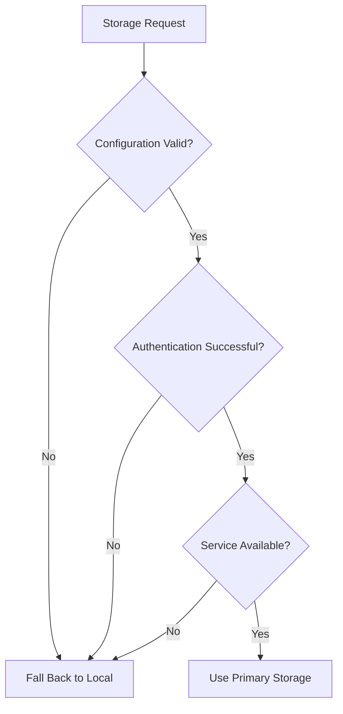
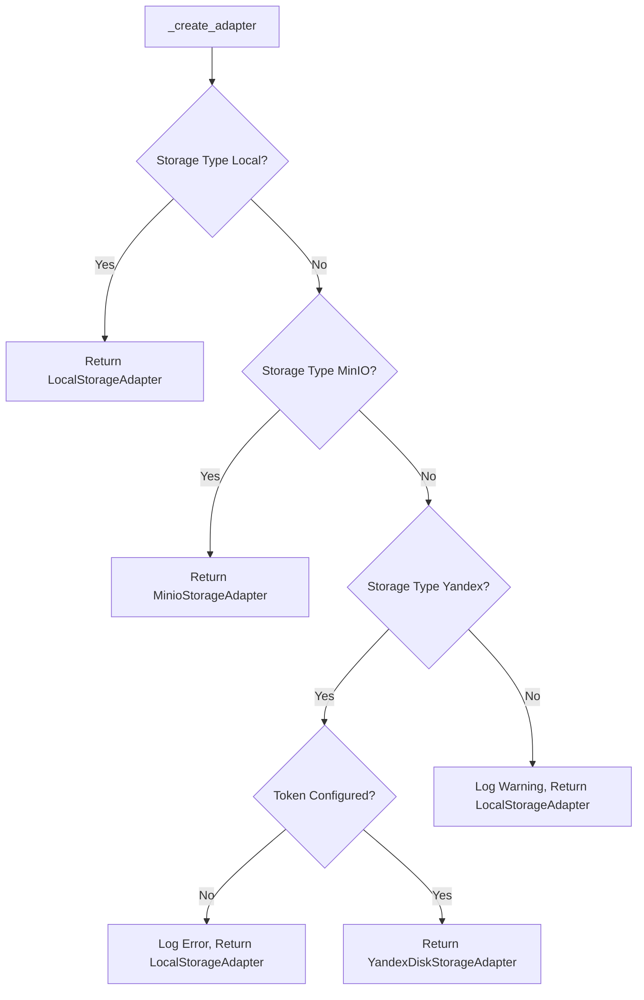
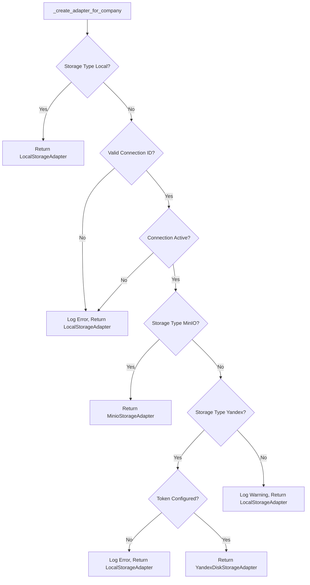
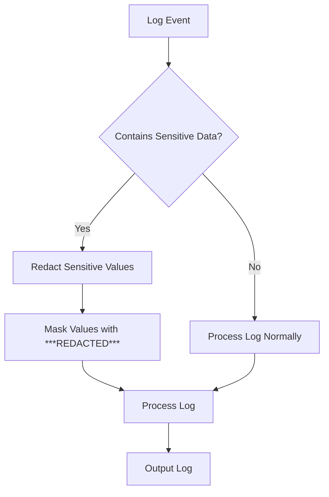

# Fallback Mechanisms

<cite>
**Referenced Files in This Document**   
- [storage_manager.py](file://vertex-ar/storage_manager.py)
- [storage_config.py](file://vertex-ar/storage_config.py)
- [storage_adapter.py](file://vertex-ar/storage_adapter.py)
- [app/storage_utils.py](file://vertex-ar/app/storage_utils.py)
- [app/storage_yandex.py](file://vertex-ar/app/storage_yandex.py)
- [logging_setup.py](file://vertex-ar/logging_setup.py)
</cite>

## Table of Contents
1. [Introduction](#introduction)
2. [Fallback Triggers](#fallback-triggers)
3. [Implementation in StorageManager](#implementation-in-storagemanager)
4. [Logging and Monitoring](#logging-and-monitoring)
5. [Troubleshooting Fallback Situations](#troubleshooting-fallback-situations)
6. [System Implications](#system-implications)
7. [Operational Best Practices](#operational-best-practices)

## Introduction
The Vertex AR storage system implements a robust fallback mechanism that ensures system continuity by defaulting to local storage when primary storage systems fail or are misconfigured. This documentation details the fallback architecture, which is designed to maintain application functionality during storage-related failures while providing clear logging and monitoring capabilities. The system prioritizes reliability by gracefully degrading to local storage rather than failing completely when remote storage services are unavailable or improperly configured.

**Section sources**
- [storage_manager.py](file://vertex-ar/storage_manager.py#L1-L582)
- [storage_config.py](file://vertex-ar/storage_config.py#L1-L203)

## Fallback Triggers
The Vertex AR storage system activates fallback mechanisms in response to several specific scenarios that indicate primary storage unavailability or misconfiguration. These triggers are designed to detect both configuration issues and runtime failures.

### Configuration Issues
The system falls back to local storage when storage configuration is missing, invalid, or incomplete. This includes scenarios where:
- Yandex Disk OAuth token is not configured in the storage configuration
- Unknown storage types are specified in configuration
- Required connection parameters for MinIO are missing
- Company-specific storage connections are inactive or not found

### Authentication Failures
When the system cannot authenticate with remote storage services, it automatically falls back to local storage. This occurs when:
- Yandex Disk OAuth tokens are invalid or expired
- MinIO access credentials are incorrect or missing
- Authentication credentials in storage connections are invalid

### Network and Service Availability
The fallback mechanism activates when network connectivity issues prevent access to remote storage services:
- Network connectivity problems to MinIO endpoints
- Yandex Disk service unavailability
- Timeout errors when attempting to establish connections
- DNS resolution failures for storage endpoints

### Company Configuration Issues
For company-specific storage configurations, fallback occurs when:
- Company records cannot be found in the database
- Storage connection IDs reference non-existent or inactive connections
- Required company storage configuration fields are missing

**Diagram sources**
- [storage_manager.py](file://vertex-ar/storage_manager.py#L50-L93)
- [storage_config.py](file://vertex-ar/storage_config.py#L155-L166)

**Section sources**
- [storage_manager.py](file://vertex-ar/storage_manager.py#L50-L93)
- [storage_config.py](file://vertex-ar/storage_config.py#L155-L166)

## Implementation in StorageManager
The fallback mechanism is primarily implemented in the StorageManager class through its adapter creation methods, which handle both global and company-specific storage configurations.

### _create_adapter Method
The `_create_adapter` method in StorageManager handles fallback for global storage configuration. When a storage type of "yandex_disk" is specified, the method first checks for a valid OAuth token. If the token is missing, it logs an error and returns a LocalStorageAdapter instance:

**Diagram sources**
- [storage_manager.py](file://vertex-ar/storage_manager.py#L50-L93)

### _create_adapter_for_company Method
The `_create_adapter_for_company` method implements fallback logic for company-specific storage configurations. This method checks for valid storage connections in the database and falls back to local storage if connections are not found or inactive:

**Diagram sources**
- [storage_manager.py](file://vertex-ar/storage_manager.py#L244-L315)

### Error Handling Strategy
The implementation uses a defensive programming approach that prioritizes system availability over storage preference. Rather than throwing exceptions when primary storage cannot be initialized, the system silently falls back to local storage while logging the issue. This ensures that application functionality continues uninterrupted while administrators are notified of the configuration issue through logs.

**Section sources**
- [storage_manager.py](file://vertex-ar/storage_manager.py#L50-L315)

## Logging and Monitoring
The fallback mechanism includes comprehensive logging to facilitate detection and troubleshooting of fallback events.

### Log Messages
The system generates specific log messages when fallback occurs:
- Error logs when Yandex Disk token is not configured
- Warning logs for unknown storage types
- Error logs when storage connections are not found or inactive
- Informational logs for successful adapter creation

These logs include contextual information such as storage type, content type, company ID (when applicable), and storage connection ID to aid in troubleshooting.

### Sensitive Data Protection
The logging system includes redaction capabilities to prevent sensitive information from being exposed in logs. The `_redact_sensitive_data` processor in logging_setup.py masks values for keys containing sensitive terms like "password", "secret", "token", "key", "credentials", and "auth". This ensures that even if configuration errors involving authentication credentials trigger fallback, the sensitive data is not exposed in log output.

**Diagram sources**
- [logging_setup.py](file://vertex-ar/logging_setup.py#L14-L80)

### Monitoring Considerations
To effectively monitor fallback events, administrators should set up alerts for specific log patterns:
- ERROR logs containing "falling back to local storage"
- WARNING logs for "Unknown storage type"
- ERROR logs for "Storage connection not found"
- Repeated fallback events within a short time period

These alerts can be integrated with the system's monitoring infrastructure to provide timely notification of storage configuration issues.

**Section sources**
- [logging_setup.py](file://vertex-ar/logging_setup.py#L14-L80)
- [storage_manager.py](file://vertex-ar/storage_manager.py#L67-L68)

## Troubleshooting Fallback Situations
When the system falls back to local storage, administrators should follow a systematic approach to diagnose and resolve the underlying issue.

### Diagnostic Steps
1. Check system logs for error messages indicating the reason for fallback
2. Verify storage configuration in storage_config.json
3. Validate authentication credentials for remote storage services
4. Test network connectivity to storage endpoints
5. Check the status of remote storage services

### Restoring Primary Storage
To restore primary storage functionality after a fallback event:

1. **For Yandex Disk issues:**
   - Verify the OAuth token is correctly configured
   - Check token validity and refresh if expired
   - Validate base path configuration
   - Test connectivity to Yandex Disk API

2. **For MinIO issues:**
   - Verify endpoint URL and port
   - Check access key and secret key
   - Validate bucket name
   - Ensure MinIO service is running

3. **For company-specific issues:**
   - Verify company storage configuration in the database
   - Check that storage connections are active
   - Validate connection configuration parameters

After correcting the configuration, the storage adapters can be reinitialized by calling the `reinitialize_adapters()` method on the StorageManager instance, which will attempt to establish connections to the primary storage systems.

**Section sources**
- [storage_manager.py](file://vertex-ar/storage_manager.py#L106-L108)
- [storage_config.py](file://vertex-ar/storage_config.py#L159-L166)

## System Implications
The fallback to local storage has several implications for system behavior, performance, and data management.

### Performance Impact
When operating in fallback mode, the system experiences different performance characteristics:
- **Latency**: Local storage typically provides lower latency for read/write operations compared to remote storage services
- **Throughput**: Performance is limited by local disk I/O rather than network bandwidth
- **Scalability**: Local storage capacity is constrained by available disk space on the application server

### Data Location and Persistence
In fallback mode, all data is stored on the local filesystem of the application server. This has implications for:
- **Data durability**: Local storage may not have the same redundancy and backup mechanisms as cloud storage services
- **Data accessibility**: Files are only accessible from the server where they are stored
- **Storage capacity**: Limited to the available disk space on the application server

### Backup Strategies
The fallback mechanism affects backup operations:
- Backup processes must account for files stored in both primary and fallback locations
- Backup scripts may need to handle multiple storage locations
- Data consistency between primary and fallback storage should be monitored

### Cache Behavior
The system's caching behavior changes in fallback mode:
- Yandex Disk directory cache is not utilized
- Local filesystem access patterns may affect OS-level caching
- Cache invalidation mechanisms may need adjustment

**Section sources**
- [storage_manager.py](file://vertex-ar/storage_manager.py#L373-L412)
- [storage_adapter.py](file://vertex-ar/storage_adapter.py#L48-L127)

## Operational Best Practices
To minimize fallback occurrences and ensure system resilience, administrators should follow these operational practices.

### Configuration Management
- Regularly audit storage configuration files for accuracy
- Implement configuration validation before deployment
- Use configuration management tools to ensure consistency across environments
- Maintain up-to-date documentation of storage configurations

### Monitoring and Alerting
- Set up alerts for fallback events to enable rapid response
- Monitor storage service health and availability
- Track fallback frequency to identify recurring issues
- Implement health checks for storage connectivity

### Testing Procedures
- Test fallback mechanisms in staging environments
- Simulate storage service failures to validate fallback behavior
- Verify data integrity after fallback and recovery
- Test reinitialization of storage adapters after configuration changes

### Recovery Planning
- Document clear procedures for restoring primary storage
- Maintain backup authentication credentials
- Keep network connectivity information for storage services
- Establish communication protocols for storage-related incidents

By following these best practices, administrators can ensure the storage system remains resilient while minimizing the operational impact of fallback events.

**Section sources**
- [storage_manager.py](file://vertex-ar/storage_manager.py#L106-L108)
- [storage_config.py](file://vertex-ar/storage_config.py#L159-L166)