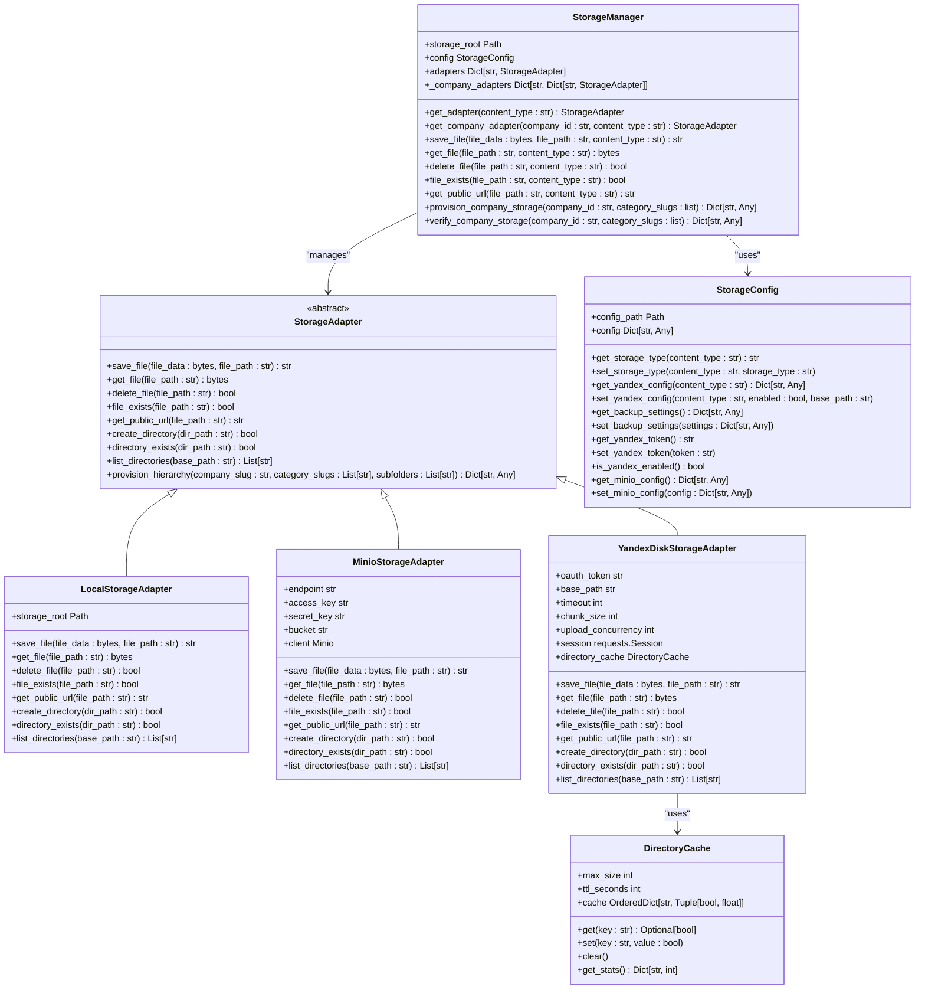
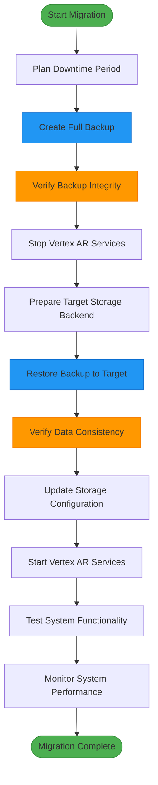
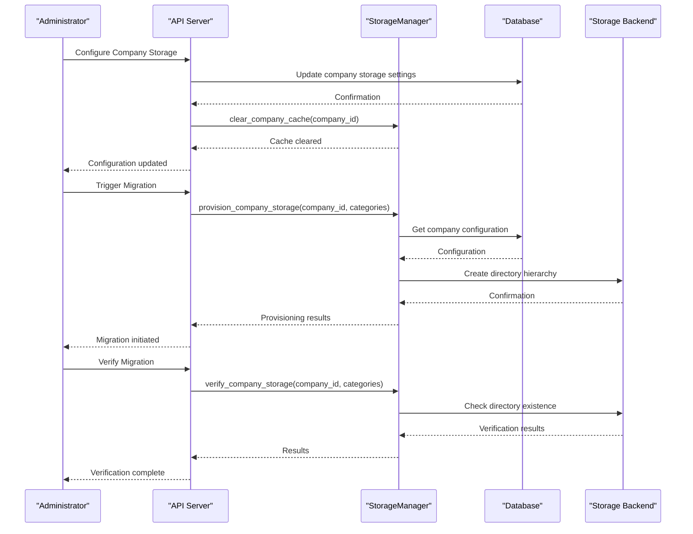

# Migration Strategies

<cite>
**Referenced Files in This Document**   
- [backup_manager.py](file://vertex-ar/backup_manager.py)
- [backup_cli.py](file://vertex-ar/backup_cli.py)
- [storage_manager.py](file://vertex-ar/storage_manager.py)
- [storage_config.py](file://vertex-ar/storage_config.py)
- [app/storage_local.py](file://vertex-ar/app/storage_local.py)
- [app/storage_minio.py](file://vertex-ar/app/storage_minio.py)
- [app/storage_yandex.py](file://vertex-ar/app/storage_yandex.py)
- [app/storage.py](file://vertex-ar/app/storage.py)
- [operations/remote-storage-setup.md](file://docs/operations/remote-storage-setup.md)
- [features/storage-implementation.md](file://docs/features/storage-implementation.md)
- [features/yandex-disk-storage-flow.md](file://docs/features/yandex-disk-storage-flow.md)
</cite>

## Table of Contents
1. [Introduction](#introduction)
2. [Storage Architecture Overview](#storage-architecture-overview)
3. [Backup and Restore Migration Strategy](#backup-and-restore-migration-strategy)
4. [Company-Level Storage Migration Workflow](#company-level-storage-migration-workflow)
5. [Migration Scenarios](#migration-scenarios)
6. [Performance Optimization for Large-Scale Migrations](#performance-optimization-for-large-scale-migrations)
7. [Error Recovery and Verification Procedures](#error-recovery-and-verification-procedures)
8. [Limitations and Future Enhancements](#limitations-and-future-enhancements)

## Introduction

The Vertex AR system supports multiple storage backends including local storage, MinIO, and Yandex.Disk. This document details the available strategies for migrating data between these storage backends, with a primary focus on the backup/restore method as the recommended approach. The system provides a comprehensive framework for storage migration that ensures data consistency, supports large datasets, and minimizes downtime. The migration process is designed to be reliable and verifiable, with built-in mechanisms for error recovery and data validation.

**Section sources**
- [backup_manager.py](file://vertex-ar/backup_manager.py#L1-L933)
- [storage_manager.py](file://vertex-ar/storage_manager.py#L1-L582)

## Storage Architecture Overview

The Vertex AR system implements a flexible storage architecture that supports multiple storage backends through a unified interface. The system uses a storage manager that routes requests to appropriate storage adapters based on content type and company configuration.



**Diagram sources**
- [storage_manager.py](file://vertex-ar/storage_manager.py#L19-L582)
- [app/storage.py](file://vertex-ar/app/storage.py#L9-L175)
- [app/storage_local.py](file://vertex-ar/app/storage_local.py#L12-L162)
- [app/storage_minio.py](file://vertex-ar/app/storage_minio.py#L10-L237)
- [app/storage_yandex.py](file://vertex-ar/app/storage_yandex.py#L84-L1168)
- [storage_config.py](file://vertex-ar/storage_config.py#L15-L203)

## Backup and Restore Migration Strategy

The primary migration strategy in the Vertex AR system is the backup and restore method. This approach ensures data consistency and integrity during migration between different storage backends. The process involves creating a complete backup of the current storage state and then restoring it to the target storage backend.

### Backup Process

The backup process creates compressed archives of both the database and storage files. The system supports three types of backups:

1. **Database backup**: Creates a copy of the SQLite database using the database's built-in backup API for consistency.
2. **Storage backup**: Creates a compressed tar archive of the entire storage directory.
3. **Full backup**: Creates both database and storage backups with a combined metadata file.

The backup system automatically handles large files by splitting them into smaller chunks when they exceed the configured size limit (default 500MB). Each backup includes metadata with timestamps, file sizes, and SHA256 checksums for verification.



**Diagram sources**
- [backup_manager.py](file://vertex-ar/backup_manager.py#L212-L799)
- [backup_cli.py](file://vertex-ar/backup_cli.py#L25-L317)

**Section sources**
- [backup_manager.py](file://vertex-ar/backup_manager.py#L212-L799)
- [backup_cli.py](file://vertex-ar/backup_cli.py#L25-L317)

### Step-by-Step Migration Procedure

1. **Preparation Phase**
   - Schedule migration during a maintenance window
   - Notify users of planned downtime
   - Verify sufficient storage space on target backend
   - Test backup and restore procedures on a staging environment

2. **Backup Creation**
   ```bash
   python backup_cli.py create --type full
   ```

3. **Backup Verification**
   ```bash
   python backup_cli.py verify backups/full/full_backup_20240101_120000.json
   ```

4. **System Shutdown**
   - Stop all Vertex AR services
   - Ensure no active file operations

5. **Data Restoration**
   ```bash
   python backup_cli.py restore backups/full/full_backup_20240101_120000.json
   ```

6. **Configuration Update**
   - Update `storage_config.json` with new storage backend settings
   - Configure authentication credentials for remote storage

7. **System Validation**
   - Start Vertex AR services
   - Verify data accessibility and integrity
   - Test all functionality

### Considerations for Large Datasets

For large datasets, the following considerations are essential:

- **Backup Chunking**: Large backup files are automatically split into chunks (default 100MB) to facilitate transfer and reduce memory usage.
- **Network Bandwidth**: Plan for sufficient network bandwidth to transfer backup files between storage locations.
- **Storage Quotas**: Verify that the target storage backend has sufficient quota for the migrated data.
- **Transfer Time**: Estimate transfer time based on dataset size and network speed.
- **Disk Space**: Ensure adequate temporary disk space for backup creation and restoration.

The system automatically handles file splitting and merging during backup and restore operations, ensuring that large datasets can be migrated reliably.

**Section sources**
- [backup_manager.py](file://vertex-ar/backup_manager.py#L63-L163)
- [backup_manager.py](file://vertex-ar/backup_manager.py#L334-L347)
- [backup_manager.py](file://vertex-ar/backup_manager.py#L126-L163)

## Company-Level Storage Migration Workflow

The Vertex AR system supports per-company storage configuration, allowing different companies to use different storage backends. This feature enables granular control over storage migration at the company level.

### Company Storage Configuration

Each company can have its own storage configuration, including:
- Storage backend type (local, MinIO, Yandex.Disk)
- Storage connection details
- Yandex.Disk folder ID for isolation

The storage manager caches company-specific adapters to improve performance, and provides methods to clear this cache when configurations change.



**Diagram sources**
- [storage_manager.py](file://vertex-ar/storage_manager.py#L200-L353)
- [storage_manager.py](file://vertex-ar/storage_manager.py#L435-L566)

### Migration Workflow

1. **Configuration Update**
   - Update the company's storage type in the database
   - Specify the storage connection ID for remote backends
   - Set Yandex.Disk folder ID if using Yandex.Disk

2. **Cache Management**
   - Clear the company's storage adapter cache to force reinitialization
   - The storage manager will create new adapters based on the updated configuration

3. **Storage Provisioning**
   - Use the `provision_company_storage` method to create the directory hierarchy on the new storage backend
   - This method handles both local and remote storage provisioning

4. **Data Migration**
   - Use the backup/restore process to migrate the company's data
   - Verify that all files are accessible through the new storage backend

5. **Verification**
   - Use the `verify_company_storage` method to confirm that all required directories exist
   - Test file access for key content types

The company-level migration workflow ensures that data isolation is maintained during migration, and that each company's data is migrated independently.

**Section sources**
- [storage_manager.py](file://vertex-ar/storage_manager.py#L200-L353)
- [storage_manager.py](file://vertex-ar/storage_manager.py#L435-L566)

## Migration Scenarios

This section provides examples of common migration scenarios in the Vertex AR system.

### Scenario 1: Local Storage to Yandex.Disk

Migrating from local storage to Yandex.Disk involves configuring the Yandex.Disk adapter and transferring data via backup/restore.

**Prerequisites:**
- Yandex.Disk OAuth token
- Sufficient storage quota on Yandex.Disk
- Network connectivity to Yandex.Disk API

**Steps:**
1. Configure Yandex.Disk settings in `storage_config.json`:
```json
{
  "yandex_disk": {
    "oauth_token": "your_oauth_token",
    "enabled": true
  },
  "content_types": {
    "portraits": {
      "storage_type": "yandex_disk"
    },
    "videos": {
      "storage_type": "yandex_disk"
    }
  }
}
```

2. Create a full backup:
```bash
python backup_cli.py create --type full
```

3. Stop Vertex AR services and migrate data:
```bash
python backup_cli.py restore /path/to/backup --target-storage yandex_disk
```

4. Update company storage configurations to use Yandex.Disk.

### Scenario 2: MinIO to MinIO (Different Instances)

Migrating between MinIO instances requires updating the MinIO configuration and transferring data.

**Steps:**
1. Update MinIO configuration in `storage_config.json`:
```json
{
  "minio": {
    "endpoint": "new-minio-server:9000",
    "access_key": "new_access_key",
    "secret_key": "new_secret_key",
    "bucket": "new-bucket-name"
  }
}
```

2. Perform backup/restore migration as described in the previous section.

3. Update any company-specific storage connections that reference the old MinIO instance.

### Scenario 3: Company-Specific Migration

Migrating a specific company to a different storage backend while keeping others on the current backend.

**Steps:**
1. Update the company's storage configuration in the database:
```sql
UPDATE companies 
SET storage_type = 'yandex_disk', 
    storage_connection_id = 'conn_123',
    yandex_disk_folder_id = 'company_folder_456'
WHERE id = 'company_789';
```

2. Clear the company's storage adapter cache:
```python
storage_manager.clear_company_cache('company_789')
```

3. Provision storage for the company:
```python
storage_manager.provision_company_storage(
    company_id='company_789',
    category_slugs=['portraits', 'videos'],
    subfolders=['Image', 'QR', 'nft_markers']
)
```

4. Migrate the company's data using backup/restore.

**Section sources**
- [storage_config.py](file://vertex-ar/storage_config.py#L108-L183)
- [storage_manager.py](file://vertex-ar/storage_manager.py#L435-L566)
- [backup_manager.py](file://vertex-ar/backup_manager.py#L212-L799)

## Performance Optimization for Large-Scale Migrations

Large-scale migrations require careful planning and optimization to minimize downtime and ensure reliability.

### Optimization Strategies

1. **Parallel Processing**
   - The Yandex.Disk adapter supports configurable upload concurrency (default 3)
   - Multiple chunks can be uploaded simultaneously to maximize bandwidth utilization

2. **Chunked Transfers**
   - Large files are split into chunks (configurable size, default 10MB)
   - Chunked transfers reduce memory usage and allow for resumable uploads

3. **Connection Pooling**
   - The Yandex.Disk adapter uses persistent HTTP sessions with connection pooling
   - Configurable pool size (default 10 connections, max 20)

4. **Directory Caching**
   - Yandex.Disk adapter caches directory existence checks with TTL
   - Reduces API calls for frequently accessed directories

5. **Compression**
   - Storage backups are compressed using gzip by default
   - Reduces backup size and transfer time

### Configuration Parameters

The following parameters can be tuned for optimal migration performance:

| Parameter | Default Value | Description |
|---------|-------------|-------------|
| YANDEX_REQUEST_TIMEOUT | 30 | Request timeout in seconds |
| YANDEX_CHUNK_SIZE_MB | 10 | Chunk size for uploads/downloads in MB |
| YANDEX_UPLOAD_CONCURRENCY | 3 | Maximum concurrent chunk uploads |
| YANDEX_DIRECTORY_CACHE_TTL | 300 | Directory cache TTL in seconds |
| YANDEX_DIRECTORY_CACHE_SIZE | 1000 | Maximum directory cache entries |
| YANDEX_SESSION_POOL_CONNECTIONS | 10 | Connection pool size |
| YANDEX_SESSION_POOL_MAXSIZE | 20 | Maximum pool size |

### Migration Time Estimation

Migration time can be estimated using the following formula:

```
Estimated Time = (Data Size / Network Bandwidth) + Processing Overhead
```

For example, migrating 100GB of data over a 100Mbps connection:
- Transfer time: (100 * 1024) / 100 = 1024 seconds (~17 minutes)
- Add processing overhead for compression, verification, etc.

**Section sources**
- [app/storage_yandex.py](file://vertex-ar/app/storage_yandex.py#L92-L103)
- [app/storage_yandex.py](file://vertex-ar/app/storage_yandex.py#L146-L167)
- [app/storage_yandex.py](file://vertex-ar/app/storage_yandex.py#L33-L82)

## Error Recovery and Verification Procedures

Robust error recovery and verification procedures are essential for successful storage migrations.

### Data Consistency Requirements

The migration process must maintain data consistency by:
- Ensuring atomic operations where possible
- Using checksums to verify data integrity
- Maintaining referential integrity between database records and stored files
- Preserving file metadata and directory structure

### Downtime Considerations

Downtime should be minimized by:
- Scheduling migrations during low-usage periods
- Performing backup operations while the system is running
- Completing the actual migration (restore and configuration update) quickly
- Having rollback procedures ready

### Verification Procedures

After migration, the following verification procedures should be performed:

1. **Backup Verification**
   ```bash
   python backup_cli.py verify /path/to/backup
   ```

2. **Storage Verification**
   ```python
   # Verify company storage
   result = storage_manager.verify_company_storage(
       company_id='company_123',
       category_slugs=['portraits', 'videos']
   )
   ```

3. **Data Integrity Checks**
   - Compare file counts between source and target
   - Verify checksums of critical files
   - Test file access for various content types

4. **System Functionality Tests**
   - Upload a test file
   - Download a previously stored file
   - Verify that all application features work correctly

### Error Recovery Strategies

In case of migration failure, the following recovery strategies are available:

1. **Rollback to Previous Configuration**
   - Restore the previous `storage_config.json`
   - Restart services with the original storage configuration

2. **Restore from Backup**
   - Use the pre-migration backup to restore the original state
   - Verify that the system functions correctly

3. **Incremental Recovery**
   - For partial failures, identify and re-migrate only the affected data
   - Use the backup/restore process for specific companies or content types

4. **Data Reconciliation**
   - Compare source and target storage to identify missing or corrupted files
   - Re-transfer any missing files

The backup system maintains multiple backup versions (configurable count, default 7), allowing recovery from various points in time.

**Section sources**
- [backup_manager.py](file://vertex-ar/backup_manager.py#L630-L698)
- [storage_manager.py](file://vertex-ar/storage_manager.py#L513-L566)
- [backup_manager.py](file://vertex-ar/backup_manager.py#L465-L530)

## Limitations and Future Enhancements

### Current Limitations

1. **Downtime Requirement**
   - The backup/restore method requires system downtime during the restore phase
   - No live migration capability is currently available

2. **Storage Backend Constraints**
   - Yandex.Disk has API rate limits that may affect large migrations
   - MinIO configuration is global, limiting flexibility for multiple MinIO instances

3. **Migration Scope**
   - Migration is all-or-nothing at the content type level
   - No incremental migration capability based on file age or usage

4. **Monitoring**
   - Limited real-time monitoring of migration progress
   - No built-in migration dashboard

### Future Enhancements

1. **Live Migration**
   - Implement a live migration capability that synchronizes data between storage backends without downtime
   - Use a dual-write strategy during transition period

2. **Incremental Migration**
   - Support migration of data based on filters (date, size, content type)
   - Allow phased migration of large datasets

3. **Enhanced Monitoring**
   - Add real-time progress tracking for migrations
   - Implement a migration dashboard in the admin interface

4. **Multiple MinIO Support**
   - Allow configuration of multiple MinIO instances with different settings
   - Enable per-company selection of MinIO instances

5. **Automated Migration Scheduling**
   - Add capability to schedule migrations during off-peak hours
   - Implement automated verification and rollback procedures

6. **Bandwidth Throttling**
   - Add controls to limit network bandwidth usage during migration
   - Prevent migration from impacting normal system performance

7. **Cloud Storage Integration**
   - Add support for additional cloud storage providers (AWS S3, Google Cloud Storage)
   - Implement unified interface for multiple cloud providers

These enhancements would improve the flexibility, reliability, and user experience of storage migrations in the Vertex AR system.

**Section sources**
- [backup_manager.py](file://vertex-ar/backup_manager.py#L1-L933)
- [storage_manager.py](file://vertex-ar/storage_manager.py#L1-L582)
- [storage_config.py](file://vertex-ar/storage_config.py#L1-L203)
- [app/storage_yandex.py](file://vertex-ar/app/storage_yandex.py#L1-L1168)
- [app/storage_minio.py](file://vertex-ar/app/storage_minio.py#L1-L237)