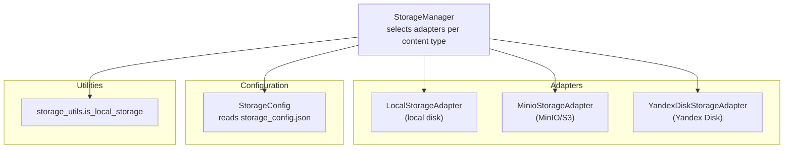
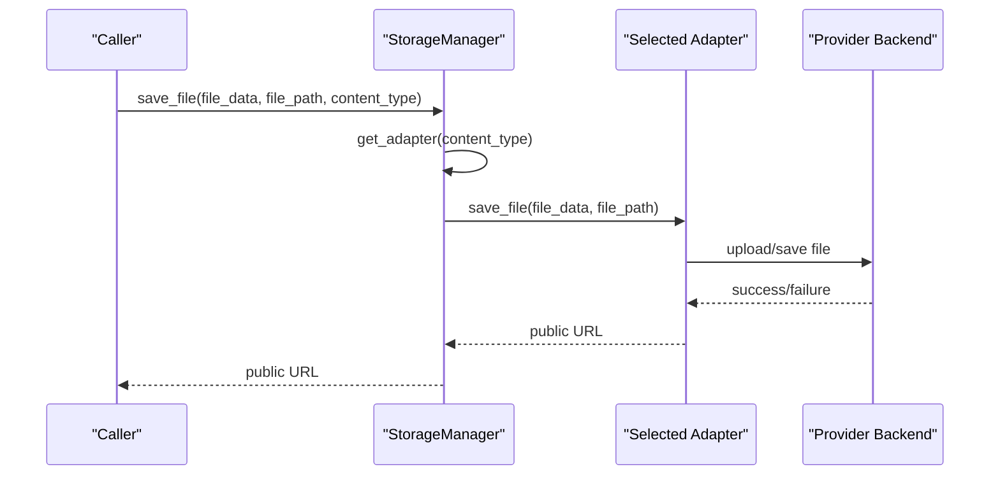
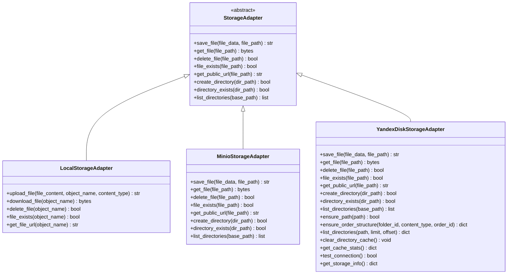
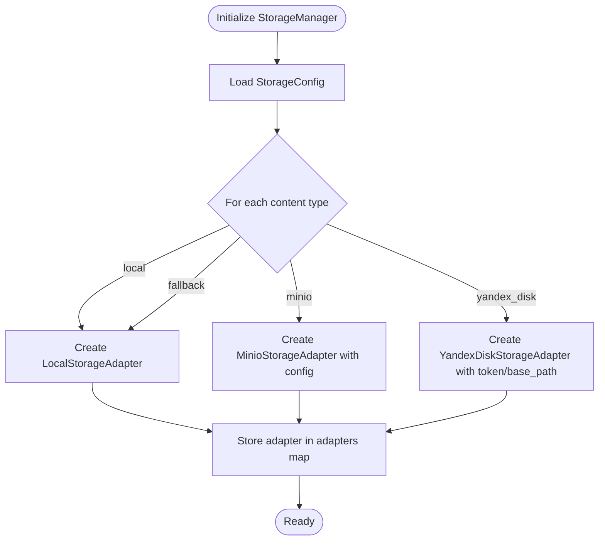
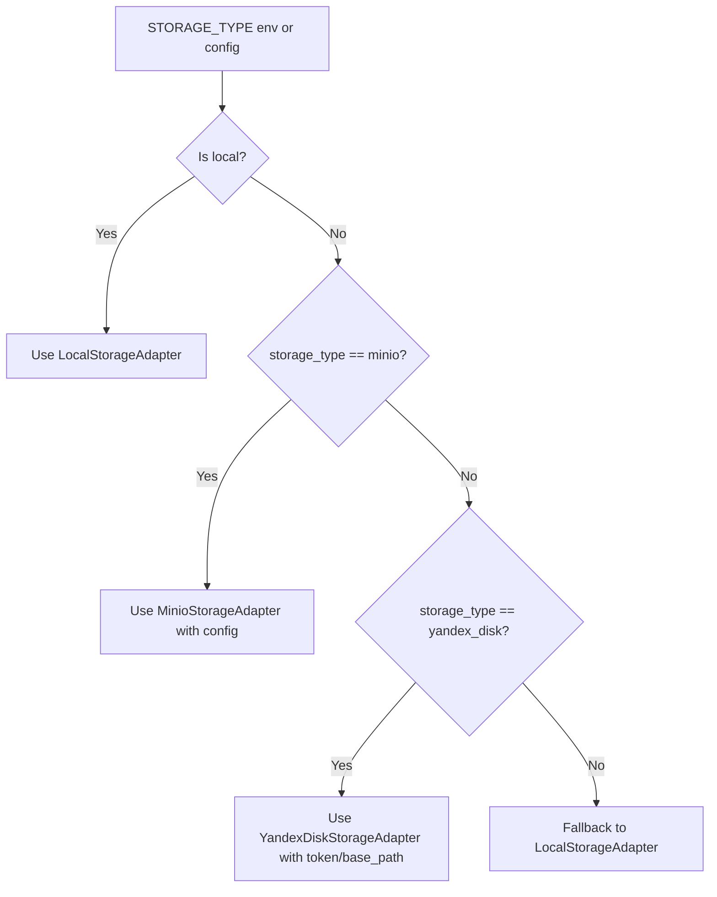
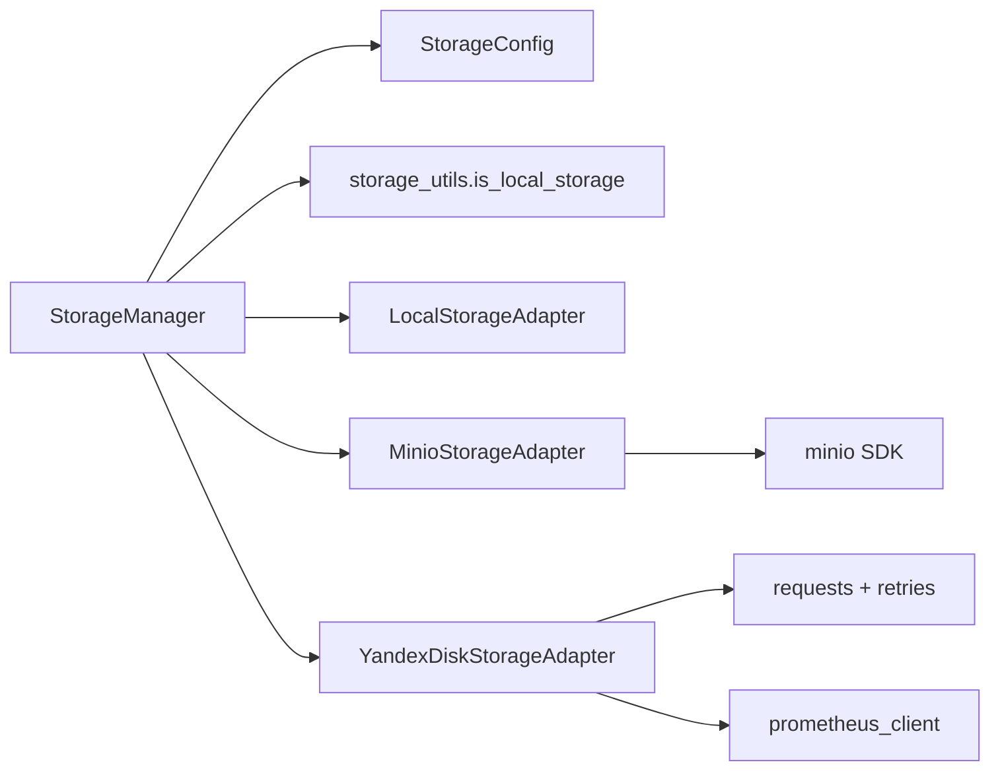

# Storage Adapter Pattern

<cite>
**Referenced Files in This Document**
- [storage_adapter.py](file://vertex-ar/storage_adapter.py)
- [storage_manager.py](file://vertex-ar/storage_manager.py)
- [storage_config.py](file://vertex-ar/storage_config.py)
- [storage_utils.py](file://vertex-ar/app/storage_utils.py)
- [storage_minio.py](file://vertex-ar/app/storage_minio.py)
- [storage_yandex.py](file://vertex-ar/app/storage_yandex.py)
- [storage_local.py](file://vertex-ar/storage_local.py)
- [markers-storage-analysis.md](file://docs/architecture/markers-storage-analysis.md)
- [storage-implementation.md](file://docs/features/storage-implementation.md)
- [test_storage_adapter.py](file://test_files/unit/test_storage_adapter.py)
- [test_storage_integration.py](file://test_files/integration/test_storage_integration.py)
</cite>

## Table of Contents
1. [Introduction](#introduction)
2. [Project Structure](#project-structure)
3. [Core Components](#core-components)
4. [Architecture Overview](#architecture-overview)
5. [Detailed Component Analysis](#detailed-component-analysis)
6. [Dependency Analysis](#dependency-analysis)
7. [Performance Considerations](#performance-considerations)
8. [Troubleshooting Guide](#troubleshooting-guide)
9. [Conclusion](#conclusion)
10. [Appendices](#appendices)

## Introduction
This document explains the Storage Adapter Pattern implementation in the Vertex AR system. It demonstrates how a unified interface enables pluggable storage backends—local disk, MinIO (S3-compatible), and Yandex Disk—through a consistent abstraction. The pattern isolates storage concerns behind a shared contract, enabling runtime flexibility, testability, and easy extension. We cover the base StorageAdapter class, concrete implementations, the StorageManager orchestrator, configuration-driven selection, and operational guidance for error handling, performance, and security.

## Project Structure
The storage subsystem is organized around a shared interface and multiple adapters, plus a manager that selects and routes operations based on configuration.

**Diagram sources**
- [storage_manager.py](file://vertex-ar/storage_manager.py#L19-L110)
- [storage_config.py](file://vertex-ar/storage_config.py#L108-L141)
- [storage_utils.py](file://vertex-ar/app/storage_utils.py#L7-L17)

**Section sources**
- [storage_manager.py](file://vertex-ar/storage_manager.py#L19-L110)
- [storage_config.py](file://vertex-ar/storage_config.py#L108-L141)
- [storage_utils.py](file://vertex-ar/app/storage_utils.py#L7-L17)

## Core Components
- StorageAdapter: Abstract base class defining the contract for storage operations.
- LocalStorageAdapter: Filesystem-backed storage for local development and simple deployments.
- MinioStorageAdapter: S3-compatible storage via MinIO, suitable for local or remote clusters.
- YandexDiskStorageAdapter: Cloud storage via Yandex Disk API with chunked transfers, directory caching, and metrics.
- StorageManager: Central coordinator that selects adapters per content type and provides unified APIs for saving, retrieving, deleting, existence checks, and URL generation.
- StorageConfig: Manages per-content-type storage type and provider-specific settings.
- storage_utils: Utility to normalize and detect local storage types.

Key interface methods (contract):
- save_file(file_data: bytes, file_path: str) -> str
- get_file(file_path: str) -> bytes
- delete_file(file_path: str) -> bool
- file_exists(file_path: str) -> bool
- get_public_url(file_path: str) -> str

Notes:
- The legacy module in vertex-ar/storage_adapter.py defines a different set of methods (upload_file, download_file, delete_file, file_exists, get_file_url) and a factory/getter. The modern app-level adapters (in app/) define the unified contract with async methods and additional directory operations.

**Section sources**
- [storage_adapter.py](file://vertex-ar/storage_adapter.py#L19-L46)
- [storage_minio.py](file://vertex-ar/app/storage_minio.py#L43-L135)
- [storage_yandex.py](file://vertex-ar/app/storage_yandex.py#L452-L713)
- [storage_manager.py](file://vertex-ar/storage_manager.py#L110-L175)

## Architecture Overview
The StorageManager reads configuration and instantiates the appropriate adapter per content type. It exposes async methods that delegate to the selected adapter. The adapters encapsulate provider-specific logic (filesystem, MinIO SDK, Yandex Disk HTTP API).

**Diagram sources**
- [storage_manager.py](file://vertex-ar/storage_manager.py#L110-L122)
- [storage_minio.py](file://vertex-ar/app/storage_minio.py#L43-L63)
- [storage_yandex.py](file://vertex-ar/app/storage_yandex.py#L452-L492)

## Detailed Component Analysis

### StorageAdapter Contract and Implementations
- Contract: The app-level adapters implement a consistent async contract with directory operations and public URL generation.
- Local adapter: Writes to a configurable base path, supports subdirectories, and generates a local URL.
- MinIO adapter: Uses the MinIO SDK to upload/download/delete/list and to check existence/stat. Provides a public URL derived from endpoint and bucket.
- Yandex Disk adapter: Implements chunked upload/download, directory caching with TTL, persistent sessions with retries, and Prometheus metrics. Public URL generation is routed through the app’s proxy endpoint.

**Diagram sources**
- [storage_minio.py](file://vertex-ar/app/storage_minio.py#L43-L135)
- [storage_yandex.py](file://vertex-ar/app/storage_yandex.py#L452-L713)
- [storage_adapter.py](file://vertex-ar/storage_adapter.py#L19-L46)

**Section sources**
- [storage_minio.py](file://vertex-ar/app/storage_minio.py#L43-L135)
- [storage_yandex.py](file://vertex-ar/app/storage_yandex.py#L452-L713)
- [storage_adapter.py](file://vertex-ar/storage_adapter.py#L19-L46)

### StorageManager Orchestration
- Initializes adapters per content type (portraits, videos, previews, nft_markers) based on StorageConfig.
- Supports company-scoped adapters with per-company storage connections.
- Provides unified async APIs for save, get, delete, existence checks, and URL retrieval.
- Offers utilities to provision storage hierarchies, verify directory existence, and manage Yandex Disk directory cache.

**Diagram sources**
- [storage_manager.py](file://vertex-ar/storage_manager.py#L35-L94)

**Section sources**
- [storage_manager.py](file://vertex-ar/storage_manager.py#L35-L94)
- [storage_manager.py](file://vertex-ar/storage_manager.py#L176-L216)
- [storage_manager.py](file://vertex-ar/storage_manager.py#L244-L316)

### Configuration-Driven Adapter Selection
- StorageConfig manages per-content-type storage_type and provider settings (MinIO and Yandex Disk).
- storage_utils.is_local_storage treats both "local" and "local_disk" as local storage.
- StorageManager reads configuration and constructs adapters accordingly.

**Diagram sources**
- [storage_config.py](file://vertex-ar/storage_config.py#L108-L141)
- [storage_utils.py](file://vertex-ar/app/storage_utils.py#L7-L17)
- [storage_manager.py](file://vertex-ar/storage_manager.py#L50-L94)

**Section sources**
- [storage_config.py](file://vertex-ar/storage_config.py#L108-L141)
- [storage_utils.py](file://vertex-ar/app/storage_utils.py#L7-L17)
- [storage_manager.py](file://vertex-ar/storage_manager.py#L50-L94)

### Example Usage Patterns
- Saving a file to a specific content type:
  - Use StorageManager.save_file(file_data, file_path, content_type) to persist and receive a public URL.
- Retrieving a file:
  - Use StorageManager.get_file(file_path, content_type) to fetch raw bytes.
- Existence checks and deletion:
  - Use StorageManager.file_exists(file_path, content_type) and StorageManager.delete_file(file_path, content_type).
- Getting a public URL:
  - Use StorageManager.get_public_url(file_path, content_type).

These patterns are demonstrated in the architecture documentation and tests.

**Section sources**
- [markers-storage-analysis.md](file://docs/architecture/markers-storage-analysis.md#L1228-L1261)
- [storage_manager.py](file://vertex-ar/storage_manager.py#L110-L175)

## Dependency Analysis
- Coupling:
  - StorageManager depends on StorageConfig and the adapter classes.
  - Adapters depend on external providers (filesystem, MinIO SDK, Yandex Disk HTTP API).
- Cohesion:
  - Each adapter encapsulates provider-specific logic, keeping StorageManager focused on orchestration.
- External dependencies:
  - MinIO SDK for MinIO adapter.
  - requests with connection pooling and retry strategy for Yandex Disk adapter.
  - Prometheus metrics for observability in Yandex adapter.

**Diagram sources**
- [storage_manager.py](file://vertex-ar/storage_manager.py#L19-L110)
- [storage_config.py](file://vertex-ar/storage_config.py#L108-L141)
- [storage_utils.py](file://vertex-ar/app/storage_utils.py#L7-L17)
- [storage_minio.py](file://vertex-ar/app/storage_minio.py#L1-L42)
- [storage_yandex.py](file://vertex-ar/app/storage_yandex.py#L146-L174)

**Section sources**
- [storage_manager.py](file://vertex-ar/storage_manager.py#L19-L110)
- [storage_minio.py](file://vertex-ar/app/storage_minio.py#L1-L42)
- [storage_yandex.py](file://vertex-ar/app/storage_yandex.py#L146-L174)

## Performance Considerations
- Local storage:
  - Fast for small files; I/O bound by disk throughput and latency.
  - Subdirectory creation and path normalization are O(1) operations relative to file size.
- MinIO:
  - Network-bound; performance scales with bandwidth and latency.
  - Directory operations emulate directories via marker objects; existence checks are fast via stat.
- Yandex Disk:
  - Network-bound; uses chunked uploads/downloads to handle large files efficiently.
  - Directory cache with TTL reduces repeated API calls; concurrency controls chunk upload parallelism.
  - Persistent session with connection pooling and retry strategy improves reliability under network variability.

Operational tips:
- Tune chunk sizes and upload concurrency for Yandex Disk based on network conditions.
- Use directory_exists and create_directory judiciously to minimize API calls.
- Prefer batched operations where possible and avoid unnecessary stat calls.

[No sources needed since this section provides general guidance]

## Troubleshooting Guide
Common issues and strategies:
- MinIO connectivity:
  - Verify endpoint, credentials, and bucket existence. Ensure secure flag matches deployment.
  - Use directory_exists and list_directories to probe structure.
- Yandex Disk:
  - Check OAuth token validity and permissions. Use test_connection to validate.
  - Inspect directory cache stats and clear cache when storage structure changes externally.
- Local storage:
  - Confirm STORAGE_PATH and bucket name resolution. Ensure write permissions and directory creation succeeds.
- Configuration drift:
  - Reinitialize adapters after changing storage_config.json or environment variables.
  - Use StorageManager.reinitialize_adapters to refresh.

**Section sources**
- [storage_minio.py](file://vertex-ar/app/storage_minio.py#L166-L196)
- [storage_yandex.py](file://vertex-ar/app/storage_yandex.py#L816-L833)
- [storage_manager.py](file://vertex-ar/storage_manager.py#L106-L109)

## Conclusion
The Storage Adapter Pattern cleanly separates storage concerns from application logic. By defining a unified contract and selecting adapters based on configuration, the system achieves:
- Extensibility: Adding new backends is a matter of implementing the interface and wiring configuration.
- Testability: Adapters can be mocked or replaced in tests.
- Runtime flexibility: Switching backends per content type or per company is seamless.
- Operational robustness: Provider-specific optimizations (chunking, caching, retries) are encapsulated within adapters.

[No sources needed since this section summarizes without analyzing specific files]

## Appendices

### Interface Contract Reference
- save_file(file_data: bytes, file_path: str) -> str
- get_file(file_path: str) -> bytes
- delete_file(file_path: str) -> bool
- file_exists(file_path: str) -> bool
- get_public_url(file_path: str) -> str
- create_directory(dir_path: str) -> bool
- directory_exists(dir_path: str) -> bool
- list_directories(base_path: str = "") -> list

**Section sources**
- [storage_minio.py](file://vertex-ar/app/storage_minio.py#L43-L135)
- [storage_yandex.py](file://vertex-ar/app/storage_yandex.py#L452-L713)
- [storage_adapter.py](file://vertex-ar/storage_adapter.py#L19-L46)

### Implementing a New Storage Adapter
Steps:
1. Define a new class that inherits from the base StorageAdapter contract.
2. Implement all required methods (save_file, get_file, delete_file, file_exists, get_public_url) plus any additional directory operations.
3. Add configuration loading and provider initialization in StorageManager._create_adapter or a dedicated factory.
4. Wire content-type mapping in StorageConfig and ensure is_local_storage handles any new local-like types.
5. Add tests validating upload, download, existence checks, and URL generation.

**Section sources**
- [storage_manager.py](file://vertex-ar/storage_manager.py#L50-L94)
- [storage_config.py](file://vertex-ar/storage_config.py#L108-L141)
- [storage_utils.py](file://vertex-ar/app/storage_utils.py#L7-L17)

### Example: Using StorageManager in Application Code
- Save a file and get a public URL:
  - Use StorageManager.save_file(file_data, file_path, content_type).
- Retrieve a file:
  - Use StorageManager.get_file(file_path, content_type).
- Delete a file:
  - Use StorageManager.delete_file(file_path, content_type).
- Check existence:
  - Use StorageManager.file_exists(file_path, content_type).
- Get public URL:
  - Use StorageManager.get_public_url(file_path, content_type).

**Section sources**
- [markers-storage-analysis.md](file://docs/architecture/markers-storage-analysis.md#L1228-L1261)
- [storage_manager.py](file://vertex-ar/storage_manager.py#L110-L175)

### Tests and Integration References
- Unit tests for adapter behavior and factory:
  - [test_storage_adapter.py](file://test_files/unit/test_storage_adapter.py#L1-L216)
- Integration tests for MinIO and local storage:
  - [test_storage_integration.py](file://test_files/integration/test_storage_integration.py#L1-L656)

**Section sources**
- [test_storage_adapter.py](file://test_files/unit/test_storage_adapter.py#L1-L216)
- [test_storage_integration.py](file://test_files/integration/test_storage_integration.py#L1-L656)