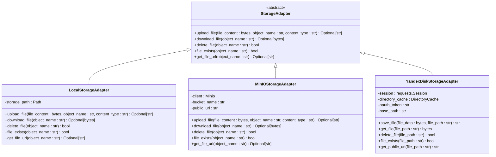
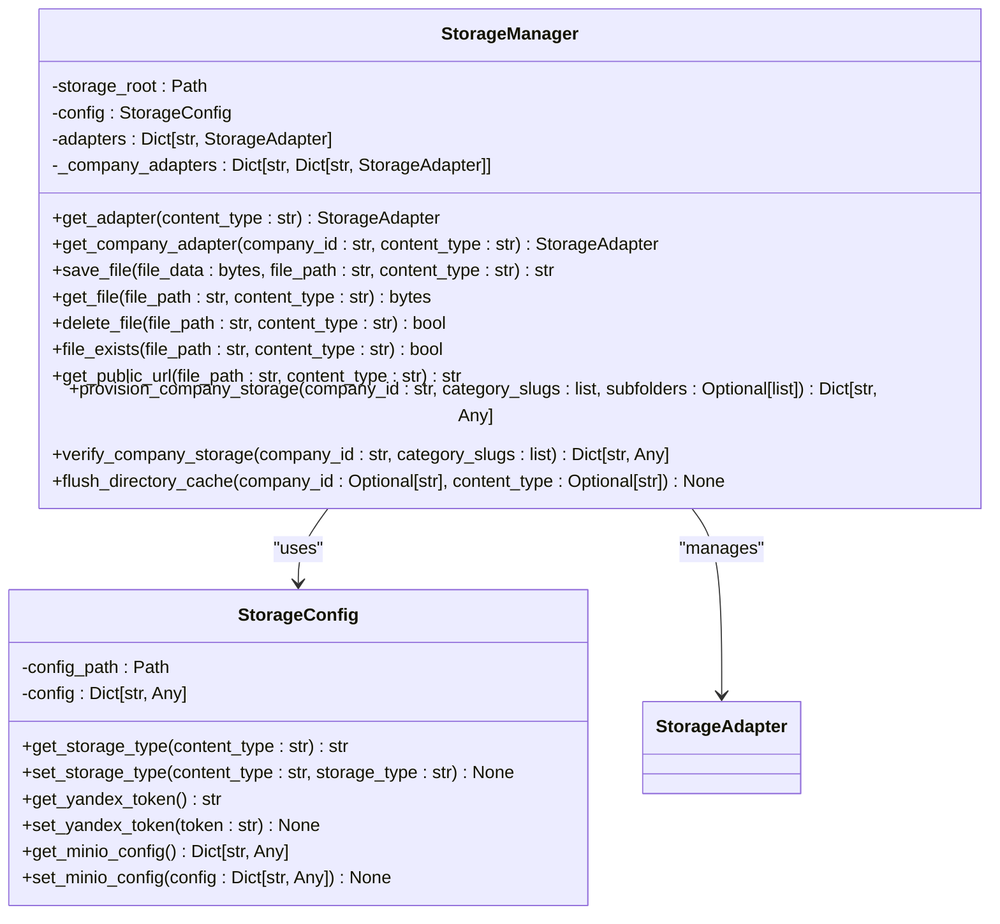
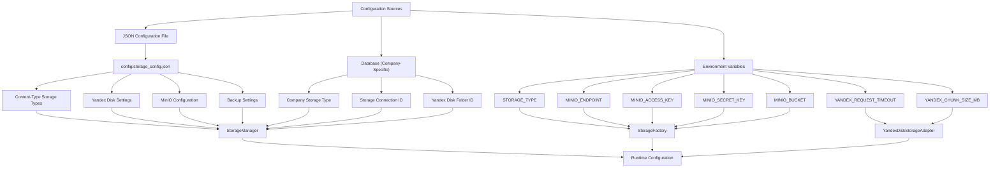
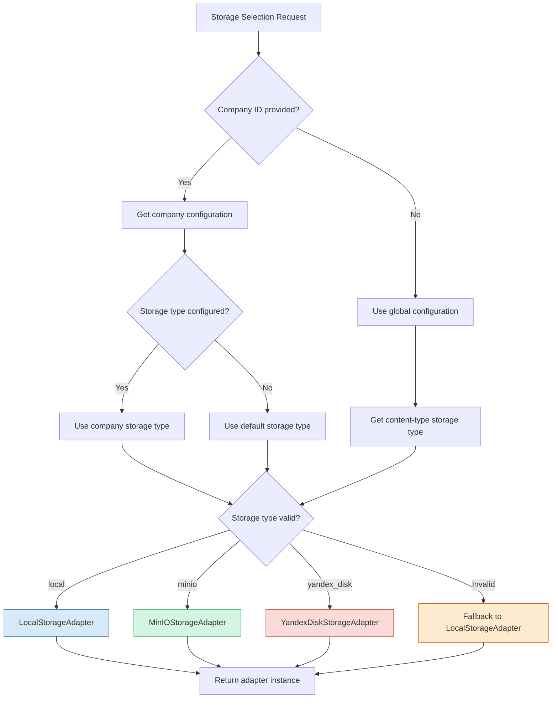
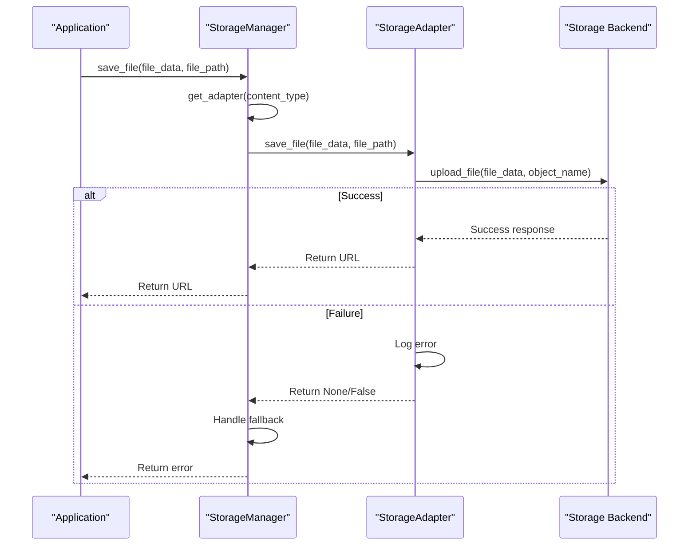
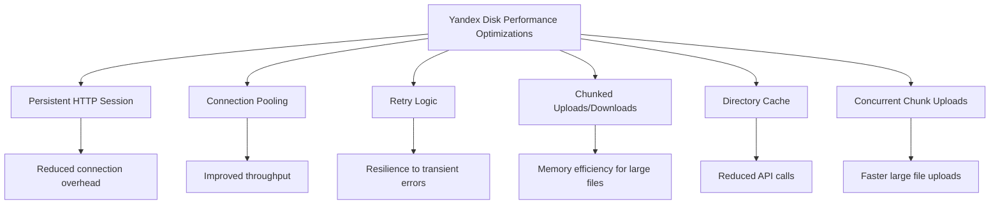

# Storage System Architecture

<cite>
**Referenced Files in This Document**   
- [storage_adapter.py](file://vertex-ar/storage_adapter.py)
- [storage_manager.py](file://vertex-ar/storage_manager.py)
- [storage_config.py](file://vertex-ar/storage_config.py)
- [app/storage_yandex.py](file://vertex-ar/app/storage_yandex.py)
- [app/storage_utils.py](file://vertex-ar/app/storage_utils.py)
- [app/config.py](file://vertex-ar/app/config.py)
- [config/storage_config.json](file://vertex-ar/config/storage_config.json)
</cite>

## Table of Contents
1. [Introduction](#introduction)
2. [Storage Adapter Pattern Implementation](#storage-adapter-pattern-implementation)
3. [Storage Manager Architecture](#storage-manager-architecture)
4. [Configuration Management](#configuration-management)
5. [Runtime Storage Selection Logic](#runtime-storage-selection-logic)
6. [Migration Strategies](#migration-strategies)
7. [Data Consistency and Fallback Procedures](#data-consistency-and-fallback-procedures)
8. [Performance Characteristics](#performance-characteristics)
9. [Security Considerations](#security-considerations)
10. [Monitoring and Diagnostics](#monitoring-and-diagnostics)

## Introduction

The Vertex AR storage orchestration system provides a flexible, pluggable architecture for managing media assets across multiple storage backends. The system supports local storage, MinIO (S3-compatible), and Yandex.Disk, enabling organizations to choose the most appropriate storage solution based on their requirements for performance, cost, and geographic distribution.

The architecture is built around the Storage Adapter Pattern, which abstracts storage operations behind a common interface while allowing for backend-specific optimizations. This design enables seamless switching between storage providers without requiring changes to application code that interacts with storage.

**Section sources**
- [storage_adapter.py](file://vertex-ar/storage_adapter.py#L1-L341)
- [storage_manager.py](file://vertex-ar/storage_manager.py#L1-L582)

## Storage Adapter Pattern Implementation

The Storage Adapter Pattern is implemented through an abstract base class that defines a consistent interface for all storage operations. This pattern enables pluggable backends by decoupling the application logic from specific storage implementations.



**Diagram sources**
- [storage_adapter.py](file://vertex-ar/storage_adapter.py#L19-L247)
- [app/storage_yandex.py](file://vertex-ar/app/storage_yandex.py#L84-L800)

The `StorageAdapter` abstract base class defines five core methods that all storage implementations must provide:
- `upload_file`: Uploads file content to storage
- `download_file`: Retrieves file content from storage
- `delete_file`: Removes a file from storage
- `file_exists`: Checks if a file exists in storage
- `get_file_url`: Generates a public URL for file access

Each concrete adapter implements these methods according to the specific API and capabilities of its underlying storage system. The factory pattern is used to instantiate the appropriate adapter based on configuration, ensuring that the application receives a consistent interface regardless of the backend.

**Section sources**
- [storage_adapter.py](file://vertex-ar/storage_adapter.py#L19-L247)
- [storage_manager.py](file://vertex-ar/storage_manager.py#L19-L582)

## Storage Manager Architecture

The Storage Manager serves as the central orchestration component that manages multiple storage adapters for different content types and companies. It provides a unified interface for storage operations while handling the complexity of multi-tenant storage configurations.



**Diagram sources**
- [storage_manager.py](file://vertex-ar/storage_manager.py#L19-L582)
- [storage_config.py](file://vertex-ar/storage_config.py#L15-L203)

The Storage Manager architecture includes several key components:

1. **Content-Type Specific Adapters**: The manager maintains separate storage adapters for different content types (portraits, videos, previews, NFT markers), allowing each type to use a different storage backend optimized for its access patterns.

2. **Company-Specific Configuration**: For multi-tenant scenarios, the manager supports company-specific storage configurations, enabling different companies to use different storage providers or configurations.

3. **Hierarchical Storage Provisioning**: The manager can provision complete storage hierarchies for companies, creating the necessary directory structures across different storage backends.

4. **Caching Mechanism**: Company-specific adapters are cached to avoid repeated initialization, improving performance for frequently accessed company storage.

The manager uses lazy initialization to create adapters only when needed, and provides methods to reinitialize adapters when configuration changes. It also includes comprehensive logging to track storage operations and configuration changes.

**Section sources**
- [storage_manager.py](file://vertex-ar/storage_manager.py#L19-L582)
- [storage_config.py](file://vertex-ar/storage_config.py#L15-L203)

## Configuration Management

Storage configuration is managed through a combination of JSON configuration files and environment variables, providing flexibility for different deployment scenarios.



**Diagram sources**
- [config/storage_config.json](file://vertex-ar/config/storage_config.json#L1-L49)
- [app/config.py](file://vertex-ar/app/config.py#L9-L244)
- [storage_config.py](file://vertex-ar/storage_config.py#L15-L203)

### JSON Configuration File

The primary configuration is stored in `config/storage_config.json`, which defines the storage configuration for different content types:

```json
{
  "content_types": {
    "portraits": {
      "storage_type": "local",
      "yandex_disk": {
        "enabled": false,
        "base_path": "vertex-ar/portraits"
      }
    },
    "videos": {
      "storage_type": "local",
      "yandex_disk": {
        "enabled": false,
        "base_path": "vertex-ar/videos"
      }
    }
  },
  "backup_settings": {
    "auto_split_backups": true,
    "max_backup_size_mb": 500,
    "chunk_size_mb": 100,
    "compression": "gz"
  },
  "yandex_disk": {
    "oauth_token": "",
    "enabled": false
  },
  "minio": {
    "enabled": false,
    "endpoint": "",
    "access_key": "",
    "secret_key": "",
    "bucket": ""
  }
}
```

The configuration file is automatically created with default values if it doesn't exist, and supports dynamic updates that are persisted to disk.

### Environment Variables

Environment variables provide deployment-specific configuration and override settings in the JSON file:

- `STORAGE_TYPE`: Global storage type (local or minio)
- `MINIO_ENDPOINT`: MinIO server endpoint
- `MINIO_ACCESS_KEY`: MinIO access key
- `MINIO_SECRET_KEY`: MinIO secret key
- `MINIO_BUCKET`: MinIO bucket name
- `YANDEX_REQUEST_TIMEOUT`: Yandex Disk request timeout in seconds
- `YANDEX_CHUNK_SIZE_MB`: Chunk size for Yandex Disk uploads/downloads in megabytes
- `YANDEX_UPLOAD_CONCURRENCY`: Maximum concurrent chunk uploads to Yandex Disk

### Runtime Configuration API

The system provides a comprehensive API for runtime configuration management:

```python
config = get_storage_config()
# Get storage type for portraits
storage_type = config.get_storage_type("portraits")
# Set storage type for videos
config.set_storage_type("videos", "minio")
# Update MinIO configuration
config.set_minio_config({
    "endpoint": "minio.example.com",
    "access_key": "myaccesskey",
    "secret_key": "mysecretkey",
    "bucket": "mybucket"
})
# Set Yandex Disk token
config.set_yandex_token("my-oauth-token")
```

This allows for dynamic reconfiguration without requiring application restarts.

**Section sources**
- [config/storage_config.json](file://vertex-ar/config/storage_config.json#L1-L49)
- [app/config.py](file://vertex-ar/app/config.py#L9-L244)
- [storage_config.py](file://vertex-ar/storage_config.py#L15-L203)

## Runtime Storage Selection Logic

The storage orchestration system implements sophisticated runtime selection logic that determines which storage backend to use for each operation based on content type, company configuration, and system settings.



**Diagram sources**
- [storage_manager.py](file://vertex-ar/storage_manager.py#L200-L331)
- [storage_adapter.py](file://vertex-ar/storage_adapter.py#L263-L274)

The selection process follows these steps:

1. **Company Context Check**: The system first checks if a company ID is provided. If so, it attempts to retrieve the company's storage configuration from the database.

2. **Configuration Retrieval**: For company-specific requests, the system retrieves the company's storage type, storage connection ID, and Yandex Disk folder ID. For global requests, it uses the content-type specific configuration from the JSON file.

3. **Adapter Creation**: Based on the storage type, the system creates the appropriate adapter:
   - `local`: Uses `LocalStorageAdapter` with the local file system
   - `minio`: Uses `MinIOStorageAdapter` with MinIO/S3-compatible storage
   - `yandex_disk`: Uses `YandexDiskStorageAdapter` with Yandex.Disk cloud storage

4. **Fallback Mechanism**: If the configured storage type is invalid or the connection details are missing, the system falls back to local storage to ensure availability.

5. **Caching**: Company-specific adapters are cached to avoid repeated database queries and adapter initialization.

The system also supports lazy initialization of MinIO adapters, which can be useful in test environments where MinIO may not be available.

**Section sources**
- [storage_manager.py](file://vertex-ar/storage_manager.py#L200-L331)
- [storage_adapter.py](file://vertex-ar/storage_adapter.py#L263-L274)

## Migration Strategies

The storage orchestration system provides several strategies for migrating data between storage backends, from simple configuration changes to comprehensive data migration workflows.

### Configuration-Only Migration

The simplest migration strategy involves changing the storage configuration without moving existing data:

```python
# Change storage type for videos from local to minio
config = get_storage_config()
config.set_storage_type("videos", "minio")

# Update MinIO configuration
config.set_minio_config({
    "endpoint": "minio.example.com",
    "access_key": "myaccesskey",
    "secret_key": "mysecretkey",
    "bucket": "mybucket"
})

# Reinitialize storage manager to use new configuration
storage_manager = get_storage_manager()
storage_manager.reinitialize_adapters()
```

With this approach, new data will be stored in the new backend, while existing data remains in the original backend. The system can read from both backends, allowing for a gradual transition.

### Data Migration Workflow

For complete migrations that move existing data, the system provides a provisioning API:

```python
# Provision storage hierarchy for a company
result = storage_manager.provision_company_storage(
    company_id="company123",
    category_slugs=["portraits", "videos"],
    subfolders=["raw", "processed", "thumbnails"]
)

# Verify storage hierarchy
verification = storage_manager.verify_company_storage(
    company_id="company123",
    category_slugs=["portraits", "videos"]
)
```

This workflow creates the necessary directory structure in the target storage backend and can be extended to copy existing data.

### Zero-Downtime Migration

For critical systems requiring zero downtime, a phased migration approach can be used:

1. **Phase 1**: Configure the system to write to both old and new storage backends
2. **Phase 2**: Copy existing data from old to new backend
3. **Phase 3**: Switch to reading from the new backend
4. **Phase 4**: Decommission the old backend

The system's adapter pattern makes this approach feasible by allowing multiple storage instances to be managed simultaneously.

### Migration Considerations

When planning migrations, consider the following factors:

- **Data Volume**: Large datasets may require batch processing and monitoring
- **Network Bandwidth**: Cloud-to-cloud transfers may be limited by network throughput
- **Consistency**: Ensure data integrity during the migration process
- **Testing**: Validate the migration process in a staging environment first
- **Rollback Plan**: Have a strategy for reverting to the original configuration if issues arise

**Section sources**
- [storage_manager.py](file://vertex-ar/storage_manager.py#L435-L566)
- [storage_config.py](file://vertex-ar/storage_config.py#L112-L121)

## Data Consistency and Fallback Procedures

The storage orchestration system implements several mechanisms to ensure data consistency and provide fallback procedures for handling storage failures.

### Data Consistency Mechanisms



**Diagram sources**
- [storage_adapter.py](file://vertex-ar/storage_adapter.py#L66-L246)
- [app/storage_yandex.py](file://vertex-ar/app/storage_yandex.py#L452-L505)

The system ensures data consistency through:

1. **Atomic Operations**: Each storage operation is designed to be atomic, ensuring that files are either completely uploaded or not uploaded at all.

2. **Checksum Verification**: For Yandex Disk, the system uses chunked uploads with range headers to ensure data integrity during transfer.

3. **Existence Checks**: Before overwriting files, the system verifies their existence and handles conflicts appropriately.

4. **Transaction Logging**: All storage operations are logged with detailed information for auditing and troubleshooting.

### Fallback Procedures

The system implements a comprehensive fallback strategy to maintain availability in case of storage failures:

1. **Configuration Fallback**: When an invalid storage type is specified, the system falls back to local storage:
```python
if storage_type == "minio":
    return MinIOStorageAdapter()
elif is_local_storage(storage_type):
    return LocalStorageAdapter()
else:
    logger.warning(f"Unknown storage type '{storage_type}', defaulting to local storage")
    return LocalStorageAdapter()
```

2. **Connection Fallback**: For company-specific storage connections, if the configured connection is not found or inactive, the system falls back to local storage:
```python
if not connection or not connection.get('is_active', False):
    logger.error(f"Storage connection not found or inactive: {storage_connection_id}, falling back to local")
    return LocalStorageAdapter(self.storage_root)
```

3. **Yandex Disk Token Fallback**: If Yandex Disk is configured but no token is available, the system falls back to local storage:
```python
if not token:
    logger.error("Yandex Disk token not configured, falling back to local storage")
    return LocalStorageAdapter(self.storage_root)
```

4. **Method-Level Fallback**: Individual operations return appropriate error values (None for uploads, False for deletions) rather than raising exceptions, allowing calling code to handle failures gracefully.

### Error Handling

The system implements consistent error handling across all storage adapters:

- **Detailed Logging**: All errors are logged with context-specific information to aid in troubleshooting
- **Graceful Degradation**: When possible, operations fail gracefully rather than causing application crashes
- **Retry Logic**: Yandex Disk adapter includes retry logic for transient network errors
- **Circuit Breaking**: The system can detect persistent failures and temporarily disable problematic storage backends

**Section sources**
- [storage_adapter.py](file://vertex-ar/storage_adapter.py#L269-L274)
- [storage_manager.py](file://vertex-ar/storage_manager.py#L65-L69)
- [app/storage_yandex.py](file://vertex-ar/app/storage_yandex.py#L148-L167)

## Performance Characteristics

The storage orchestration system exhibits different performance characteristics depending on the selected backend, with trade-offs between latency, throughput, and scalability.

### Performance Comparison

| Storage Type | Latency | Throughput | Scalability | Use Case |
|--------------|---------|----------|-------------|----------|
| Local Storage | Low (ms) | High | Limited by disk capacity | High-frequency access, temporary storage |
| MinIO | Medium (10-100ms) | High | High (distributed) | Production workloads, distributed systems |
| Yandex.Disk | High (100ms-1s) | Medium | High (cloud) | Archival, backup, geographically distributed access |

### Local Storage Performance

Local storage provides the best performance characteristics:

- **Latency**: Typically 1-10ms for read/write operations
- **Throughput**: Limited only by disk I/O performance
- **Scalability**: Limited by local disk capacity and I/O bandwidth
- **Advantages**: No network overhead, highest reliability
- **Limitations**: Single point of failure, limited geographic distribution

The local storage adapter uses the file system directly, with minimal overhead for path resolution and directory creation.

### MinIO Performance

MinIO offers a balance of performance and scalability:

- **Latency**: 10-100ms depending on network conditions
- **Throughput**: High, especially with multiple nodes
- **Scalability**: Horizontal scaling by adding nodes
- **Advantages**: High availability, data replication, S3 compatibility
- **Limitations**: Network dependency, configuration complexity

The MinIO adapter uses the official MinIO client with connection pooling and efficient object handling.

### Yandex.Disk Performance

Yandex.Disk provides cloud-based storage with specific performance characteristics:

- **Latency**: 100ms-1s due to network round trips
- **Throughput**: Medium, limited by internet bandwidth
- **Scalability**: High, with virtually unlimited capacity
- **Advantages**: Geographic distribution, built-in redundancy
- **Limitations**: Internet dependency, rate limiting

The Yandex.Disk adapter includes several performance optimizations:



**Diagram sources**
- [app/storage_yandex.py](file://vertex-ar/app/storage_yandex.py#L124-L174)

Key optimizations include:
- **Persistent Session**: Reuses HTTP connections to reduce overhead
- **Connection Pooling**: Limits concurrent connections to avoid rate limiting
- **Retry Logic**: Handles transient network errors with exponential backoff
- **Chunked Transfers**: Processes large files in chunks to manage memory usage
- **Directory Cache**: Caches directory existence checks to reduce API calls
- **Concurrent Uploads**: Uploads file chunks in parallel within limits

### Configuration Tuning

Performance can be tuned through configuration parameters:

- `YANDEX_REQUEST_TIMEOUT`: Adjust based on network conditions
- `YANDEX_CHUNK_SIZE_MB`: Optimize for file size distribution
- `YANDEX_UPLOAD_CONCURRENCY`: Balance between speed and resource usage
- `YANDEX_DIRECTORY_CACHE_TTL`: Adjust based on directory structure stability
- `YANDEX_SESSION_POOL_CONNECTIONS`: Tune for concurrent access patterns

**Section sources**
- [app/config.py](file://vertex-ar/app/config.py#L200-L207)
- [app/storage_yandex.py](file://vertex-ar/app/storage_yandex.py#L92-L103)

## Security Considerations

The storage orchestration system implements several security measures to protect data and prevent unauthorized access.

### Authentication and Authorization

- **Yandex Disk**: Uses OAuth 2.0 tokens for authentication, with tokens stored securely in configuration
- **MinIO**: Uses access keys and secret keys, which should be rotated regularly
- **Local Storage**: Relies on file system permissions and application-level access controls

The system follows the principle of least privilege, using dedicated credentials for storage access rather than administrative accounts.

### Data Protection

- **Encryption at Rest**: For cloud storage (MinIO, Yandex.Disk), data is encrypted at rest by the provider
- **Encryption in Transit**: All cloud storage communications use HTTPS
- **Secure Configuration**: Sensitive credentials are not exposed in the application settings object

### Configuration Security

The system includes security checks for configuration:

```python
# SECURITY: Check for deprecated env-based SMTP credentials
if _env_smtp_username or _env_smtp_password:
    _logger.critical(warning_msg)
    # In production, refuse to start with env-based credentials
    if environment == "production":
        _logger.critical("FATAL: Cannot start in production with env-based SMTP credentials")
        sys.exit(1)
```

This prevents sensitive credentials from being stored in environment variables, which could be exposed through process listings or logs.

### Input Validation

All storage operations include input validation to prevent path traversal and other security issues:

- File paths are validated to prevent directory traversal attacks
- Content types are validated against allowed types
- File sizes are limited to prevent denial-of-service attacks

### Secure Defaults

The system uses secure defaults:

- Local storage is the default backend, minimizing external dependencies
- HTTPS is used by default for MinIO connections
- Sensitive credentials are not logged
- Error messages do not reveal sensitive information

**Section sources**
- [app/config.py](file://vertex-ar/app/config.py#L81-L113)
- [app/storage_yandex.py](file://vertex-ar/app/storage_yandex.py#L94-L103)

## Monitoring and Diagnostics

The storage orchestration system includes comprehensive monitoring and diagnostics capabilities to ensure reliability and performance.

### Prometheus Metrics

The Yandex Disk adapter integrates with Prometheus for detailed monitoring:

```python
# Operation counters
cls.operations_total = Counter(
    'vertex_ar_yandex_operations_total',
    'Total Yandex Disk operations',
    ['operation', 'status'],
    registry=registry
)

# Latency histogram
cls.operation_duration = Histogram(
    'vertex_ar_yandex_operation_duration_seconds',
    'Yandex Disk operation duration',
    ['operation'],
    buckets=(0.1, 0.5, 1.0, 2.0, 5.0, 10.0, 30.0, 60.0),
    registry=registry
)

# Error counter
cls.errors_total = Counter(
    'vertex_ar_yandex_errors_total',
    'Total Yandex Disk errors',
    ['operation', 'error_type'],
    registry=registry
)
```

These metrics track:
- Operation counts by type and status
- Operation latency distributions
- Error rates by operation and error type
- Chunk transfer statistics
- Directory cache performance

### Cache Monitoring

The Yandex Disk adapter includes detailed cache monitoring:

```python
def get_cache_stats(self) -> Dict[str, int]:
    """Get directory cache statistics."""
    now = time.time()
    expired = sum(1 for _, (_, ts) in self.cache.items() if now - ts > self.ttl_seconds)
    return {
        "total_entries": len(self.cache),
        "expired_entries": expired,
        "valid_entries": len(self.cache) - expired,
        "max_size": self.max_size,
        "ttl_seconds": self.ttl_seconds
    }
```

This allows administrators to monitor cache effectiveness and tune the cache size and TTL accordingly.

### Diagnostic Commands

The system provides diagnostic capabilities through the Storage Manager:

```python
def get_storage_info(self) -> Dict[str, Any]:
    """Get storage information for all configured adapters."""
    info = {
        "content_types": {},
        "global": {}
    }
    
    for content_type, adapter in self.adapters.items():
        storage_type = self.config.get_storage_type(content_type)
        info["content_types"][content_type] = {
            "storage_type": storage_type,
            "adapter_type": type(adapter).__name__
        }
        
        # Get additional info for Yandex Disk adapters
        if isinstance(adapter, YandexDiskStorageAdapter):
            try:
                yandex_info = adapter.get_storage_info()
                info["content_types"][content_type]["yandex_disk_info"] = yandex_info
            except Exception as e:
                logger.error("Failed to get Yandex Disk info", error=str(e))
    
    return info
```

This returns detailed information about the current storage configuration and status.

### Health Checks

The system integrates with the application's health check system, reporting storage connectivity and performance issues. The monitoring system can detect and alert on:

- Storage backend connectivity issues
- High latency operations
- Failed storage operations
- Cache performance degradation
- Configuration inconsistencies

These monitoring capabilities enable proactive detection and resolution of storage issues before they impact users.

**Section sources**
- [app/storage_yandex.py](file://vertex-ar/app/storage_yandex.py#L176-L259)
- [storage_manager.py](file://vertex-ar/storage_manager.py#L176-L198)