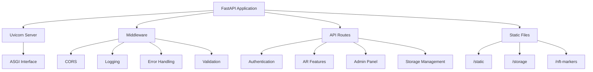
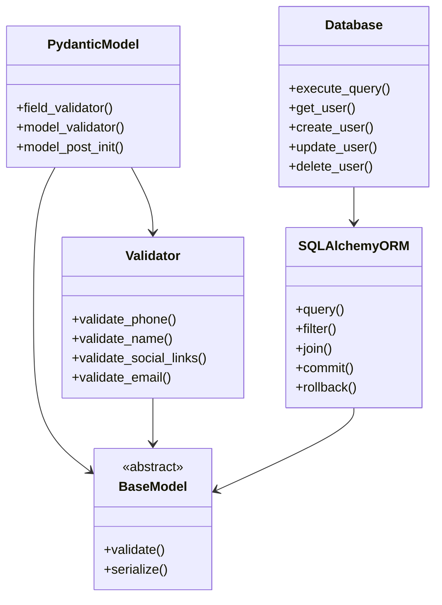
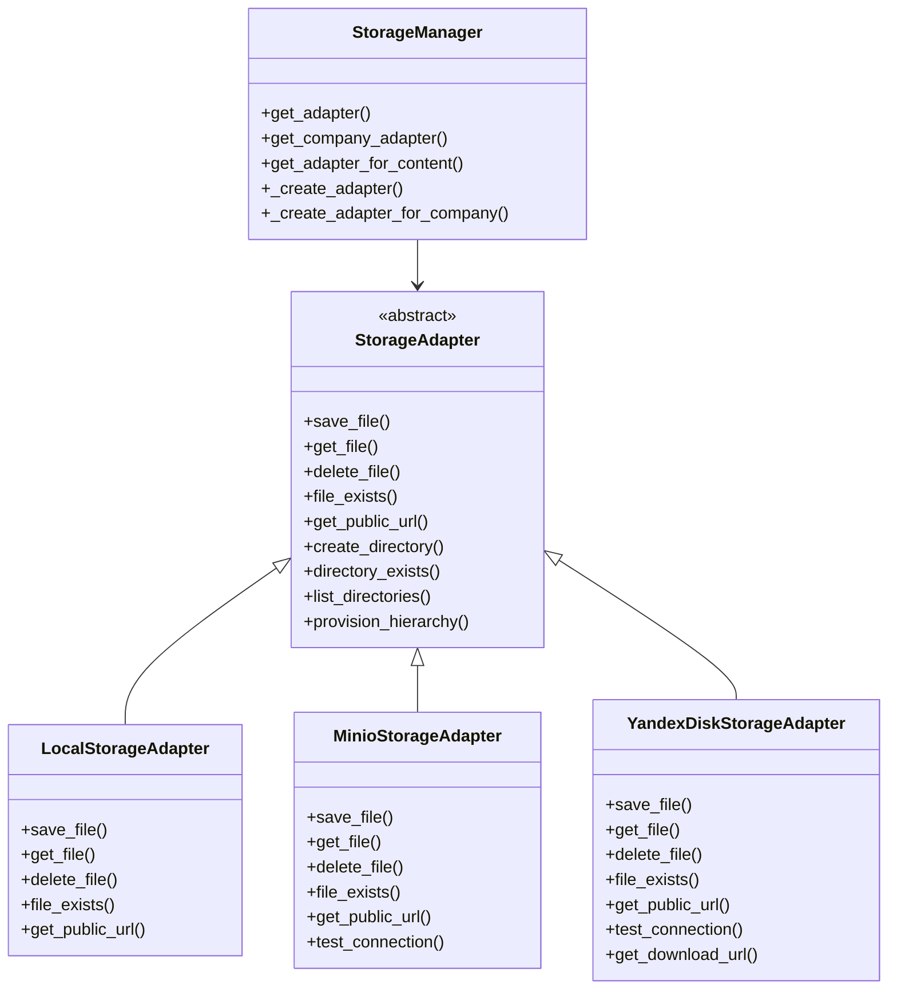
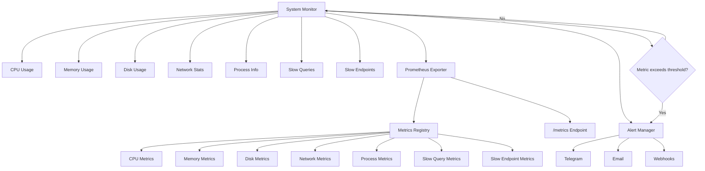
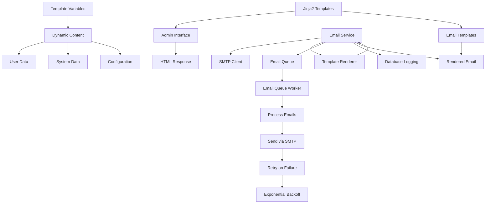
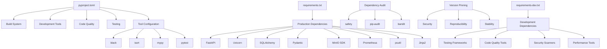

# Technology Stack & Dependencies

<cite>
**Referenced Files in This Document**   
- [pyproject.toml](file://vertex-ar/pyproject.toml)
- [requirements.txt](file://vertex-ar/requirements.txt)
- [requirements-dev.txt](file://vertex-ar/requirements-dev.txt)
- [main.py](file://vertex-ar/main.py)
- [app/main.py](file://vertex-ar/app/main.py)
- [app/config.py](file://vertex-ar/app/config.py)
- [app/models.py](file://vertex-ar/app/models.py)
- [app/validators.py](file://vertex-ar/app/validators.py)
- [app/database.py](file://vertex-ar/app/database.py)
- [app/prometheus_metrics.py](file://vertex-ar/app/prometheus_metrics.py)
- [app/monitoring.py](file://vertex-ar/app/monitoring.py)
- [app/storage.py](file://vertex-ar/app/storage.py)
- [app/storage_yandex.py](file://vertex-ar/app/storage_yandex.py)
- [app/api/yandex_disk.py](file://vertex-ar/app/api/yandex_disk.py)
- [app/api/storage_management.py](file://vertex-ar/app/api/storage_management.py)
- [app/api/storage_config.py](file://vertex-ar/app/api/storage_config.py)
- [app/api/admin.py](file://vertex-ar/app/api/admin.py)
- [app/services/email_service.py](file://vertex-ar/app/services/email_service.py)
- [app/api/email_templates.py](file://vertex-ar/app/api/email_templates.py)
- [storage.py](file://vertex-ar/storage.py)
- [remote_storage.py](file://vertex-ar/remote_storage.py)
</cite>

## Table of Contents
1. [Core Framework & Server](#core-framework--server)
2. [Data Validation & ORM](#data-validation--orm)
3. [Storage & Integration](#storage--integration)
4. [Monitoring & System Metrics](#monitoring--system-metrics)
5. [Templating & Email](#templating--email)
6. [Dependency Management](#dependency-management)
7. [Security & Audit](#security--audit)

## Core Framework & Server

The AR backend is built on the FastAPI framework, a modern, high-performance web framework for building APIs with Python 3.7+ based on standard Python type hints. FastAPI provides automatic API documentation (Swagger UI and ReDoc), data validation, serialization, and dependency injection out of the box. The application is served using Uvicorn, an ASGI server implementation that provides high performance with support for HTTP/1.1, HTTP/2, and WebSockets.

The FastAPI application is instantiated through the `create_app()` function in `app/main.py`, which configures the application with various middleware, CORS settings, static file mounting, and API route registration. The application factory pattern allows for flexible configuration and testing. Uvicorn is used as the production server, configured in `main.py` to run on host 0.0.0.0 and port 8000 with access logging enabled.

The application follows a modular structure with API routes organized in the `app/api/` directory, each responsible for specific functionality (auth, ar, admin, clients, etc.). The main application instance is stored globally to allow access from other modules when needed. The server configuration includes settings for worker processes based on CPU count, keep-alive timeouts, and graceful shutdown periods to ensure optimal performance and reliability.

**Diagram sources**
- [app/main.py](file://vertex-ar/app/main.py#L35-L444)
- [main.py](file://vertex-ar/main.py#L1-L23)

**Section sources**
- [app/main.py](file://vertex-ar/app/main.py#L35-L444)
- [main.py](file://vertex-ar/main.py#L1-L23)
- [requirements.txt](file://vertex-ar/requirements.txt#L2-L3)

## Data Validation & ORM

The AR backend utilizes Pydantic for data validation and settings management, and SQLAlchemy as the ORM for database interactions. Pydantic v2 is used throughout the application for request/response model validation, ensuring data integrity and providing automatic documentation in the API schema. Pydantic models are defined in `app/models.py` and used in API endpoints to validate incoming data and serialize outgoing responses.

SQLAlchemy is used as the ORM for interacting with the SQLite database, providing an abstraction layer over raw SQL queries. The database connection is managed through the `Database` class in `app/database.py`, which handles schema initialization, query execution, and transaction management. The application uses SQLAlchemy's Core rather than ORM for direct control over SQL execution while maintaining the benefits of connection pooling and query composition.

Data validation extends beyond Pydantic models to include custom validators in `app/validators.py` for specific business rules such as phone number, name, and social link validation. These validators are used both in Pydantic models through field validators and in business logic throughout the application. The validation system ensures data quality and prevents common input errors.

**Diagram sources**
- [app/models.py](file://vertex-ar/app/models.py#L255-L287)
- [app/validators.py](file://vertex-ar/app/validators.py#L157-L198)
- [app/database.py](file://vertex-ar/app/database.py#L46-L634)

**Section sources**
- [app/models.py](file://vertex-ar/app/models.py#L255-L287)
- [app/validators.py](file://vertex-ar/app/validators.py#L157-L198)
- [app/database.py](file://vertex-ar/app/database.py#L46-L634)
- [requirements.txt](file://vertex-ar/requirements.txt#L8-L13)

## Storage & Integration

The AR backend implements a flexible storage architecture that supports multiple storage backends including local storage, MinIO (S3-compatible), and Yandex.Disk. The storage system is abstracted through the `StorageAdapter` interface defined in `app/storage.py`, which provides a consistent API for file operations regardless of the underlying storage implementation.

The MinIO integration is handled through the `MinioStorageAdapter` class, which uses the MinIO SDK to interact with S3-compatible storage. Configuration for MinIO is managed through environment variables, allowing for easy deployment in different environments. The Yandex.Disk integration uses the Yandex.Disk API to provide remote storage capabilities, with authentication handled through OAuth tokens stored securely in the application configuration.

Storage adapters are managed by the `StorageManager` class, which provides methods to retrieve the appropriate adapter based on storage type or company configuration. The system supports provisioning complete folder hierarchies for companies and categories, ensuring consistent directory structures across different storage backends. The storage system is integrated with the API through endpoints in `app/api/storage_management.py` and `app/api/storage_config.py`, allowing administrators to test connections and manage storage configurations.

**Diagram sources**
- [app/storage.py](file://vertex-ar/app/storage.py#L9-L175)
- [app/api/storage_management.py](file://vertex-ar/app/api/storage_management.py#L185-L221)
- [app/api/storage_config.py](file://vertex-ar/app/api/storage_config.py#L274-L312)
- [app/storage_yandex.py](file://vertex-ar/app/storage_yandex.py#L694-L732)

**Section sources**
- [app/storage.py](file://vertex-ar/app/storage.py#L9-L175)
- [app/api/storage_management.py](file://vertex-ar/app/api/storage_management.py#L185-L221)
- [app/api/storage_config.py](file://vertex-ar/app/api/storage_config.py#L274-L312)
- [app/storage_yandex.py](file://vertex-ar/app/storage_yandex.py#L694-L732)
- [remote_storage.py](file://vertex-ar/remote_storage.py#L47-L87)
- [requirements.txt](file://vertex-ar/requirements.txt#L16-L17)

## Monitoring & System Metrics

The AR backend includes a comprehensive monitoring system built around Prometheus for metrics collection and alerting. The system monitor, implemented in `app/monitoring.py`, tracks CPU, memory, disk, and network usage, providing detailed insights into system health and performance. The monitoring system is configured through environment variables that define thresholds for CPU, memory, and disk usage, as well as intervals for health checks and alert deduplication.

Prometheus metrics are exposed through the `/metrics` endpoint, which is automatically created by the `prometheus-fastapi-instrumentator` package. The application extends the default metrics with custom metrics for slow queries, slow endpoints, memory snapshots, and process trends. These metrics are collected and updated by the `PrometheusExporter` class in `app/prometheus_metrics.py`, which integrates with the system monitor to provide real-time performance data.

The monitoring system includes deep diagnostics capabilities such as tracking slow database queries and HTTP endpoints, monitoring process resource usage over time, and capturing memory snapshots when thresholds are exceeded. Alerting is managed through the `alert_manager` in `app/alerting.py`, which can send notifications via Telegram, email, or webhooks based on the severity and type of alert. The system supports configurable alert routing with different notification channels for critical, high, medium, and low severity alerts.

**Diagram sources**
- [app/monitoring.py](file://vertex-ar/app/monitoring.py#L1-L800)
- [app/prometheus_metrics.py](file://vertex-ar/app/prometheus_metrics.py#L64-L262)
- [app/alerting.py](file://vertex-ar/app/alerting.py)

**Section sources**
- [app/monitoring.py](file://vertex-ar/app/monitoring.py#L1-L800)
- [app/prometheus_metrics.py](file://vertex-ar/app/prometheus_metrics.py#L64-L262)
- [requirements.txt](file://vertex-ar/requirements.txt#L50-L52)

## Templating & Email

The AR backend uses Jinja2 for templating in both the admin interface and email notifications. Jinja2 templates are used to render HTML pages for the admin panel, with templates stored in the `templates/` directory. The application initializes the Jinja2 template engine in `app/main.py` and stores the template instance in the application state for access by API routes.

Email functionality is implemented through the `EmailService` class in `app/services/email_service.py`, which handles sending emails using SMTP with support for HTML and plain text content. The service integrates with Jinja2 for template rendering, allowing dynamic content in email messages. Email templates are stored in the database and can be managed through the admin interface, providing a flexible system for customizing notification content.

The email system includes a persistent queue with worker pools to ensure reliable delivery, even during periods of high load or temporary SMTP server issues. The queue is initialized during application startup and workers are started to process queued emails. The system supports retry logic with exponential backoff for failed deliveries, configurable through environment variables. Email history is logged in the database, providing an audit trail of sent notifications.

**Diagram sources**
- [app/services/email_service.py](file://vertex-ar/app/services/email_service.py#L151-L527)
- [app/api/email_templates.py](file://vertex-ar/app/api/email_templates.py#L31-L37)
- [app/api/admin.py](file://vertex-ar/app/api/admin.py#L207-L212)

**Section sources**
- [app/services/email_service.py](file://vertex-ar/app/services/email_service.py#L151-L527)
- [app/api/email_templates.py](file://vertex-ar/app/api/email_templates.py#L31-L37)
- [app/api/admin.py](file://vertex-ar/app/api/admin.py#L207-L212)
- [requirements.txt](file://vertex-ar/requirements.txt#L47)

## Dependency Management

The AR backend uses a comprehensive dependency management system with both `pyproject.toml` and traditional `requirements.txt` files for maximum compatibility and flexibility. The `pyproject.toml` file defines build system requirements and development tools, while `requirements.txt` contains the production dependencies. This dual approach allows for modern Python packaging standards while maintaining compatibility with traditional deployment workflows.

The project includes separate requirements files for different environments: `requirements.txt` for production, `requirements-dev.txt` for development, and `requirements-no-asyncpg.txt` for environments where asyncpg cannot be installed. This approach ensures that dependencies are tailored to specific deployment scenarios while maintaining consistency across environments.

Development dependencies include tools for code quality (black, isort, flake8, mypy), testing (pytest, pytest-cov, pytest-mock), security scanning (bandit, safety, pip-audit), and performance testing (locust, memory-profiler). These tools are configured in `pyproject.toml` with specific settings for code formatting, type checking, and test coverage requirements.

**Diagram sources**
- [pyproject.toml](file://vertex-ar/pyproject.toml#L1-L96)
- [requirements.txt](file://vertex-ar/requirements.txt#L1-L71)
- [requirements-dev.txt](file://vertex-ar/requirements-dev.txt#L1-L46)

**Section sources**
- [pyproject.toml](file://vertex-ar/pyproject.toml#L1-L96)
- [requirements.txt](file://vertex-ar/requirements.txt#L1-L71)
- [requirements-dev.txt](file://vertex-ar/requirements-dev.txt#L1-L46)

## Security & Audit

The AR backend implements a comprehensive security and audit system to ensure the integrity and safety of the application and its data. Security practices include environment-based configuration with sensible defaults, secure credential management, and regular dependency auditing. The application includes a security audit process documented in `DEPENDENCY_AUDIT_REPORT_JAN_2025.md` and `DEPENDENCY_AUDIT_SUMMARY_JAN_2025.md`, which details the methodology and findings of regular security reviews.

Credential management follows security best practices, with a deprecation warning for environment-based SMTP credentials in favor of encrypted storage in the database. The application refuses to start in production if deprecated credential methods are detected, enforcing secure configuration practices. Sensitive configuration is stored in the database with encryption, accessible only through the admin interface.

Dependency security is maintained through regular auditing using tools like safety, pip-audit, and bandit, which are included in the development dependencies. The audit process identifies vulnerable packages and recommends updates or alternatives. The application uses pinned versions for critical dependencies to ensure reproducible builds and prevent supply chain attacks.

```mermaid
flowchart TD
A["Security Practices"] --> B["Environment Configuration"]
A --> C["Credential Management"]
A --> D["Dependency Auditing"]
A --> E["Code Quality"]
A --> F["Access Control"]
G["Credential Management"] --> H["Deprecation Warning"]
G --> I["Production Enforcement"]
G --> J["Encrypted Storage"]
G --> K["Admin Interface"]
L["Dependency Auditing"] --> M["safety"]
L --> N["pip-audit"]
L --> O["bandit"]
L --> P["Regular Reports"]
L --> Q["Version Pinning"]
R["Access Control"] --> S["Authentication"]
R --> T["Authorization"]
R --> U["Rate Limiting"]
R --> V["Session Management"]
W["Code Quality"] --> X["Static Analysis"]
W --> Y["Type Checking"]
W --> Z["Formatting"]
W --> AA["Testing"]
AB["Security Outcomes"] --> AC["Reduced Vulnerabilities"]
AB --> AD["Compliance"]
AB --> AE["Trust"]
AB --> AF["Reliability"]
```

**Diagram sources**
- [app/config.py](file://vertex-ar/app/config.py#L81-L113)
- [DEPENDENCY_AUDIT_REPORT_JAN_2025.md](file://DEPENDENCY_AUDIT_REPORT_JAN_2025.md)
- [DEPENDENCY_AUDIT_SUMMARY_JAN_2025.md](file://DEPENDENCY_AUDIT_SUMMARY_JAN_2025.md)

**Section sources**
- [app/config.py](file://vertex-ar/app/config.py#L81-L113)
- [DEPENDENCY_AUDIT_REPORT_JAN_2025.md](file://DEPENDENCY_AUDIT_REPORT_JAN_2025.md)
- [DEPENDENCY_AUDIT_SUMMARY_JAN_2025.md](file://DEPENDENCY_AUDIT_SUMMARY_JAN_2025.md)
- [requirements-dev.txt](file://vertex-ar/requirements-dev.txt#L19-L22)