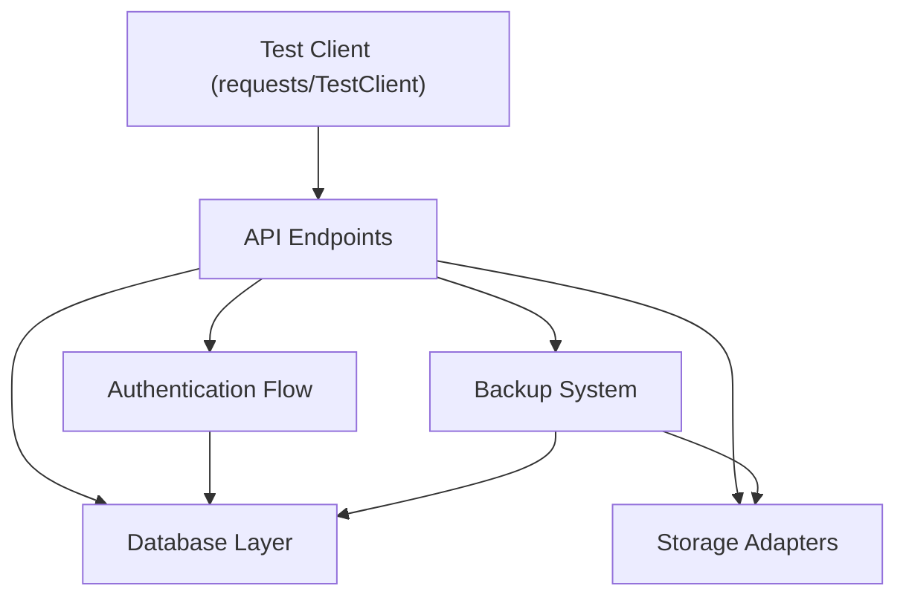
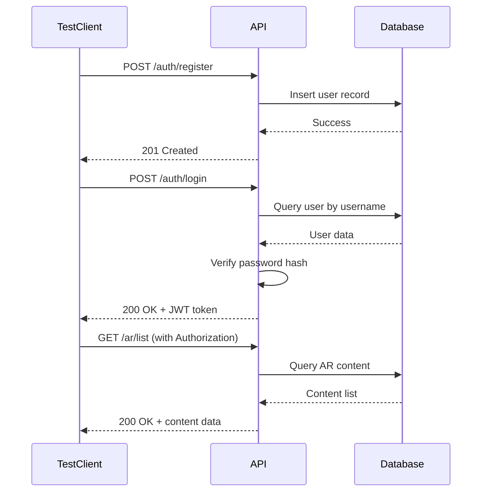
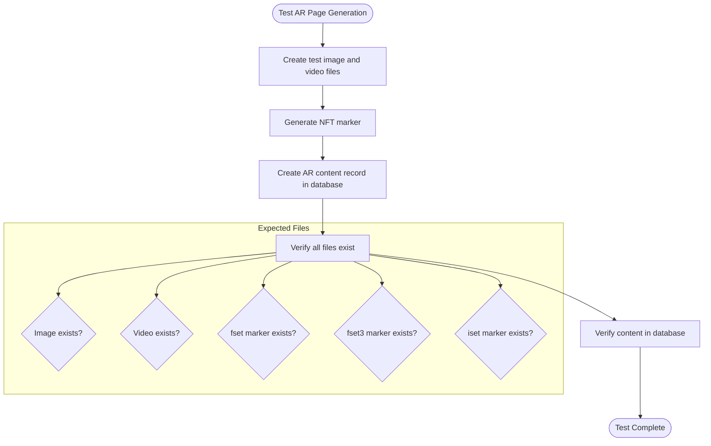
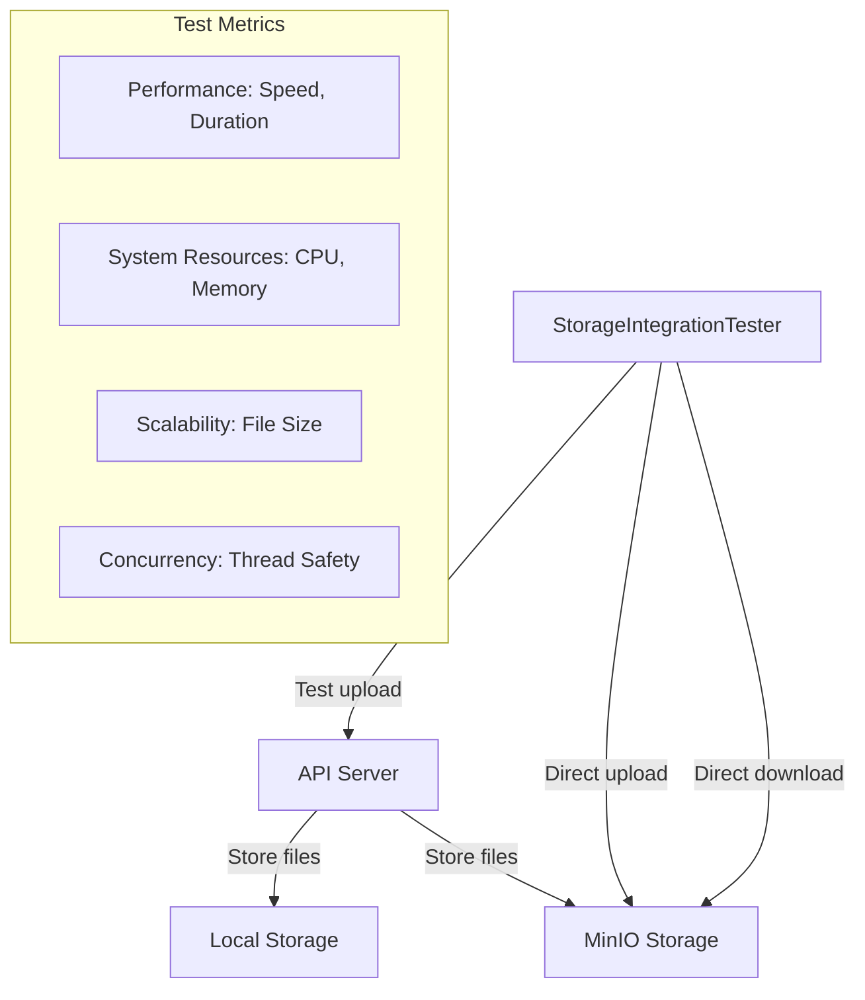
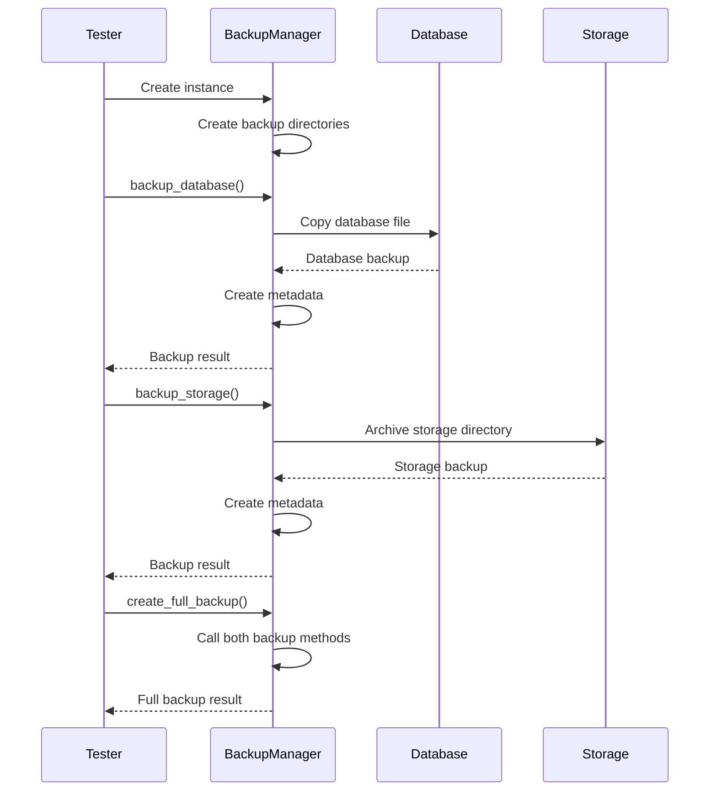

# Integration Testing

<cite>
**Referenced Files in This Document**   
- [test_api_endpoints.py](file://test_files/integration/test_api_endpoints.py)
- [test_ar_functionality.py](file://test_files/integration/test_ar_functionality.py)
- [test_api_upload.py](file://test_files/integration/test_api_upload.py)
- [test_backup_system.py](file://test_files/integration/test_backup_system.py)
- [test_storage_integration.py](file://test_files/integration/test_storage_integration.py)
- [conftest.py](file://test_files/conftest.py)
- [backup_manager.py](file://vertex-ar/backup_manager.py)
- [storage.py](file://vertex-ar/storage.py)
</cite>

## Table of Contents
1. [Introduction](#introduction)
2. [Test Infrastructure Overview](#test-infrastructure-overview)
3. [API Endpoint Integration Testing](#api-endpoint-integration-testing)
4. [AR Functionality Testing](#ar-functionality-testing)
5. [Storage Integration Testing](#storage-integration-testing)
6. [Backup System Testing](#backup-system-testing)
7. [Authentication and Session Management](#authentication-and-session-management)
8. [Test Data Management and Isolation](#test-data-management-and-isolation)
9. [Performance and Concurrency Testing](#performance-and-concurrency-testing)
10. [Common Testing Challenges](#common-testing-challenges)
11. [Best Practices and Recommendations](#best-practices-and-recommendations)

## Introduction

Integration testing in the Vertex AR system ensures that various components work together as expected, particularly focusing on interactions between API endpoints, database layers, storage adapters, and authentication flows. These tests verify end-to-end request handling, session management, and state transitions across the application. The integration test suite is organized in the `test_files/integration/` directory and covers critical workflows such as user authentication, AR content upload, and backup operations. Tests use real system components rather than mocks to validate actual integration points and data flow between services.

## Test Infrastructure Overview

The integration testing framework is built on Python's unittest and requests libraries, with tests organized to validate multi-step workflows across the system. The test infrastructure uses temporary directories and in-memory databases to isolate test data and ensure consistent test execution. The `conftest.py` file configures the Python path to include the main application modules, enabling direct imports from the `vertex-ar` package during testing.

**Diagram sources**
- [conftest.py](file://test_files/conftest.py#L1-L17)
- [test_api_endpoints.py](file://test_files/integration/test_api_endpoints.py#L1-L400)

**Section sources**
- [conftest.py](file://test_files/conftest.py#L1-L17)

## API Endpoint Integration Testing

Integration tests for API endpoints validate the functionality of various endpoints including health checks, authentication, AR content management, and administrative functions. The `test_api_endpoints.py` file contains comprehensive tests that verify endpoint responses, data validation, and error handling. Tests use the FastAPI TestClient to simulate HTTP requests and validate JSON responses.

The test suite verifies:
- Health and version endpoints return proper status codes and response structures
- Authentication endpoints handle user registration and login correctly
- AR content endpoints require proper authentication and return appropriate responses
- Input validation prevents invalid data submission
- Error handling returns appropriate HTTP status codes for invalid requests

**Diagram sources**
- [test_api_endpoints.py](file://test_files/integration/test_api_endpoints.py#L22-L396)

**Section sources**
- [test_api_endpoints.py](file://test_files/integration/test_api_endpoints.py#L22-L396)

## AR Functionality Testing

The AR functionality tests in `test_ar_functionality.py` validate the core augmented reality features of the system, including AR page generation, view counting, and marker access URLs. These tests ensure that AR content is properly created, stored, and accessible through the application.

Key aspects tested:
- AR page generation creates all necessary files and database records
- View counter increments correctly and persists between requests
- Marker files are generated and accessible via proper URLs
- File paths are correctly stored in the database

The tests use temporary directories to simulate the storage environment and verify that all generated files exist with the expected names and locations. The NFT marker generator is tested to ensure it produces the required marker file types (fset, fset3, iset) that are essential for AR functionality.

**Diagram sources**
- [test_ar_functionality.py](file://test_files/integration/test_ar_functionality.py#L16-L195)

**Section sources**
- [test_ar_functionality.py](file://test_files/integration/test_ar_functionality.py#L16-L195)

## Storage Integration Testing

Storage integration tests validate the system's interaction with both local and remote storage systems. The `test_storage_integration.py` file contains comprehensive tests that evaluate performance, reliability, and functionality of storage operations. These tests verify that files are properly uploaded, stored, and retrieved through the application's storage adapters.

Key test areas include:
- Local storage upload and download functionality
- MinIO integration for remote storage
- Performance comparison between storage types
- Scalability with different file sizes
- Concurrent storage operations
- System resource usage during storage operations

The tests create realistic test files of various sizes (1MB, 5MB, 10MB, 20MB) to simulate actual user content. Performance metrics such as upload/download speed, duration, and system resource consumption are measured and reported. The test framework handles both successful operations and error conditions, ensuring proper error handling and recovery.

**Diagram sources**
- [test_storage_integration.py](file://test_files/integration/test_storage_integration.py#L44-L656)

**Section sources**
- [test_storage_integration.py](file://test_files/integration/test_storage_integration.py#L44-L656)

## Backup System Testing

The backup system tests in `test_backup_system.py` validate the functionality of the backup manager, which handles database and storage backups with rotation and restoration capabilities. These tests ensure that critical data can be reliably backed up and restored, protecting against data loss.

Tested functionality includes:
- Backup manager creation and directory setup
- Database backup creation and verification
- Storage backup creation and file integrity
- Full backup operations combining database and storage
- Backup rotation to maintain a specified number of backups
- Database and storage restoration from backups
- Backup statistics and listing functionality

The tests use temporary directories to simulate the production environment and verify that backup files are created with proper naming conventions, metadata, and checksums. Restoration tests modify the original data and then restore from backup to verify data integrity. The backup rotation tests create multiple backups and verify that older backups are properly removed according to the retention policy.

**Diagram sources**
- [test_backup_system.py](file://test_files/integration/test_backup_system.py#L14-L468)
- [backup_manager.py](file://vertex-ar/backup_manager.py#L21-L200)

**Section sources**
- [test_backup_system.py](file://test_files/integration/test_backup_system.py#L14-L468)

## Authentication and Session Management

Authentication and session management are critical components tested across multiple integration tests. The system uses JWT-based authentication to manage user sessions, with tokens issued upon successful login and required for accessing protected endpoints.

Key authentication tests include:
- User registration with proper input validation
- Login with username and password verification
- JWT token generation and validation
- Protected endpoint access with valid tokens
- Error handling for invalid or missing tokens

The tests verify that authentication state is properly maintained across requests and that session tokens provide appropriate access control. The test suite creates test users with different roles (including administrators) to validate role-based access to various endpoints.

## Test Data Management and Isolation

The integration tests employ several strategies to ensure test data isolation and consistency:

1. **Temporary directories**: Each test creates its own temporary directory using Python's `tempfile` module, ensuring file system isolation
2. **In-memory databases**: Tests use SQLite databases created in temporary directories, preventing interference with production data
3. **Test-specific data**: Each test uses unique identifiers and data to prevent conflicts between test runs
4. **Cleanup procedures**: Tests include cleanup code in `finally` blocks to remove temporary files and directories

The test data setup creates realistic scenarios with proper relationships between entities (users, content, storage). For example, AR content tests create a test user before creating AR content associated with that user. This ensures referential integrity and tests the complete data creation workflow.

## Performance and Concurrency Testing

The storage integration tests include performance and concurrency testing to evaluate system behavior under load. These tests measure:

- Upload and download speeds for different file sizes
- System resource consumption (CPU, memory) during operations
- Performance differences between local and remote storage
- Behavior during concurrent operations

The concurrency tests use Python's `concurrent.futures` module to simulate multiple simultaneous upload operations, verifying that the system can handle concurrent requests without data corruption or race conditions. Performance metrics are collected and included in test reports to identify potential bottlenecks.

## Common Testing Challenges

Integration testing the Vertex AR system presents several challenges that the test suite addresses:

1. **External dependencies**: The system relies on external services like MinIO for storage. Tests handle this by attempting to connect to MinIO but continuing with local storage tests if unavailable.
2. **File system operations**: Tests involving file creation and deletion require careful cleanup to prevent disk space issues.
3. **Database state management**: Tests must ensure database state is properly reset between tests to prevent interference.
4. **Timing issues**: Some operations have variable execution times, requiring flexible assertions.
5. **Resource consumption**: Large file tests can consume significant memory and storage, requiring monitoring.

The test framework addresses these challenges through comprehensive cleanup procedures, isolated test environments, and graceful handling of optional dependencies.

## Best Practices and Recommendations

Based on the integration test suite, several best practices emerge for testing the Vertex AR system:

1. **Use isolated test environments**: Always use temporary directories and test databases to prevent interference with production data
2. **Test real integrations**: Use actual system components rather than mocks to validate true integration points
3. **Include cleanup procedures**: Ensure all test resources are properly cleaned up, even if tests fail
4. **Test edge cases**: Include tests for error conditions and invalid inputs
5. **Measure performance**: Collect performance metrics to identify potential bottlenecks
6. **Validate data integrity**: After operations that modify data, verify the results through separate queries
7. **Use realistic test data**: Create test files and data that reflect actual usage patterns

The integration test suite serves as a comprehensive validation of the system's core functionality, ensuring that components work together as expected in realistic scenarios.