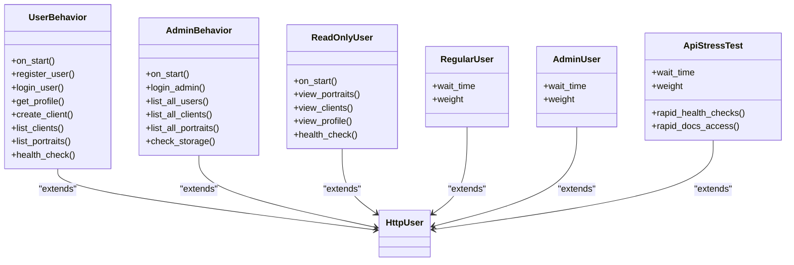
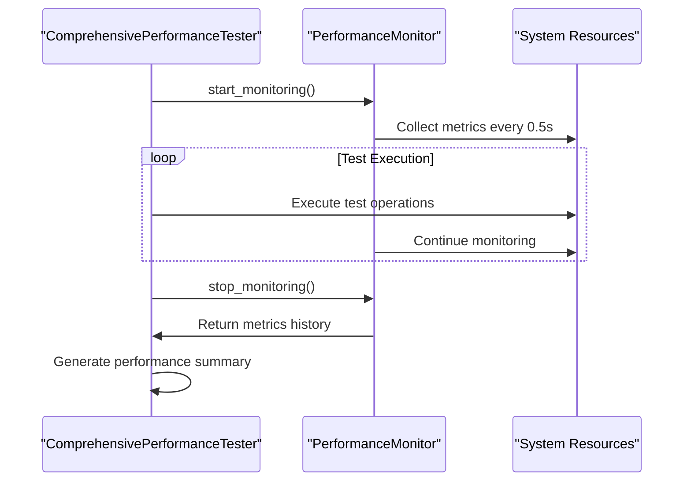
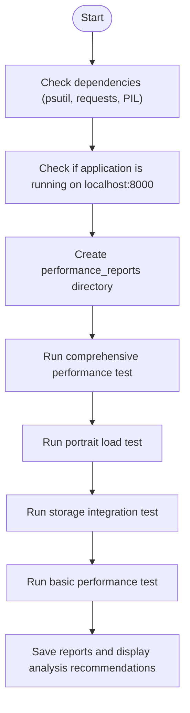
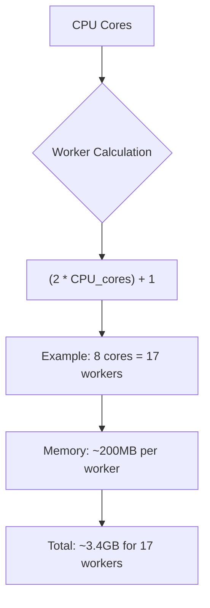

# Performance Testing

<cite>
**Referenced Files in This Document**   
- [locustfile.py](file://locustfile.py)
- [test_files/run_performance_tests.sh](file://test_files/run_performance_tests.sh)
- [test_files/performance/test_performance.py](file://test_files/performance/test_performance.py)
- [test_files/performance/test_comprehensive_performance.py](file://test_files/performance/test_comprehensive_performance.py)
- [test_files/performance/test_portraits_load.py](file://test_files/performance/test_portraits_load.py)
- [docs/deployment/uvicorn-tuning.md](file://docs/deployment/uvicorn-tuning.md)
- [docs/operations/performance-optimization.md](file://docs/operations/performance-optimization.md)
- [vertex-ar/app/main.py](file://vertex-ar/app/main.py)
- [monitoring/prometheus.yml](file://monitoring/prometheus.yml)
</cite>

## Table of Contents
1. [Introduction](#introduction)
2. [Performance Testing Framework](#performance-testing-framework)
3. [Locust Load Testing](#locust-load-testing)
4. [Custom Performance Scripts](#custom-performance-scripts)
5. [Test Execution and CI/CD Integration](#test-execution-and-ci-cd-integration)
6. [Common Performance Issues](#common-performance-issues)
7. [Optimization Strategies](#optimization-strategies)
8. [Monitoring and Metrics Collection](#monitoring-and-metrics-collection)
9. [Conclusion](#conclusion)

## Introduction

Performance testing is a critical component of the Vertex AR application lifecycle, ensuring the system can handle concurrent users interacting with key endpoints such as AR content retrieval, video scheduling, and portrait generation. This documentation details the comprehensive performance testing strategy using Locust for load testing and custom Python scripts for benchmarking and stress testing. The testing framework simulates real-world user behavior, measures API response times under various load conditions, and identifies potential bottlenecks in the system. Performance tests are integrated into the CI/CD pipeline through automated scripts, enabling continuous performance validation. The documentation also covers common performance issues such as resource bottlenecks, connection pooling limits, and garbage collection impacts, along with optimization strategies for database queries, caching, and Uvicorn worker configuration based on observed metrics.

## Performance Testing Framework

The performance testing framework for Vertex AR consists of multiple components designed to evaluate system performance under various conditions. The framework includes Locust for simulating concurrent user loads, custom Python scripts for comprehensive performance testing, and automated execution scripts for integration into the development workflow. The testing environment is designed to closely mimic production conditions, with tests targeting key endpoints that handle AR content retrieval, video scheduling, and portrait generation. Performance metrics are collected and analyzed to identify bottlenecks and optimize system performance. The framework supports different testing scenarios, including baseline performance testing, load testing, stress testing, and endurance testing. Test results are saved in structured JSON format for detailed analysis and historical comparison. The framework is designed to be extensible, allowing for the addition of new test scenarios and performance metrics as the application evolves.

**Section sources**
- [test_files/run_performance_tests.sh](file://test_files/run_performance_tests.sh)
- [test_files/performance/test_performance.py](file://test_files/performance/test_performance.py)
- [test_files/performance/test_comprehensive_performance.py](file://test_files/performance/test_comprehensive_performance.py)

## Locust Load Testing

### User Behavior Modeling

Locust is used to simulate concurrent users interacting with the Vertex AR application through the `locustfile.py` configuration. The framework defines multiple user classes that model different user behaviors and privilege levels. The `UserBehavior` class simulates a sequential workflow of a regular user, including registration, login, profile access, client creation, and content browsing. The `AdminBehavior` class models administrative users with elevated privileges, focusing on system monitoring and user management operations. The `ReadOnlyUser` class represents lightweight users that primarily consume content through read operations. The `RegularUser` and `AdminUser` classes orchestrate these behaviors with different weights to simulate realistic user distributions. The `ApiStressTest` class is designed for stress testing with rapid-fire requests to key endpoints.

**Diagram sources**
- [locustfile.py](file://locustfile.py#L12-L242)

### Task Distribution and Metrics Collection

The Locust configuration implements sophisticated task distribution to simulate realistic user behavior patterns. The `WebsiteUser` class models a typical user journey, including visiting the homepage, registering, logging in, browsing content, and creating new content. Tasks are weighted to reflect the frequency of different operations, with higher weights assigned to common actions like viewing portraits and clients. The `wait_time` parameter introduces realistic delays between user actions, with ranges defined for different user types. Metrics collection is automated through Locust's built-in reporting, capturing response times, request rates, and error rates. The Web UI at http://localhost:8089 provides real-time visualization of test results, allowing for immediate analysis of system performance under load. Custom print statements in the task methods provide additional visibility into the execution flow, helping to identify specific operations that may be causing performance issues.

**Section sources**
- [locustfile.py](file://locustfile.py#L244-L321)

## Custom Performance Scripts

### Comprehensive Performance Testing

The `test_comprehensive_performance.py` script provides a holistic assessment of system performance by monitoring CPU, memory, disk I/O, and network usage during test execution. The `PerformanceMonitor` class uses psutil to collect system metrics at regular intervals, creating a detailed history of resource utilization. The `ComprehensivePerformanceTester` orchestrates multiple test scenarios, including large file performance, concurrent requests, memory leak detection, and database performance. Each test starts the performance monitor, executes the test scenario, and stops the monitor to collect metrics. The results include detailed summaries of CPU usage, memory consumption, disk operations, and network traffic. The script identifies potential memory leaks by tracking memory usage over time and detects performance degradation in database operations through batch insert and query timing.

**Diagram sources**
- [test_files/performance/test_comprehensive_performance.py](file://test_files/performance/test_comprehensive_performance.py#L58-L197)

### Benchmarking API Response Times

The `test_performance.py` script focuses on benchmarking API response times under various conditions. It includes tests for large file uploads, multiple file uploads, application performance under load, and memory/CPU usage. The large file upload test creates 10MB image and 5MB video files to measure upload performance and throughput. The multiple file upload test simulates concurrent uploads of several file pairs to assess system behavior under sustained load. The application under load test executes a series of API requests, including content upload, listing, and administrative operations, to measure end-to-end performance. The memory and CPU usage test monitors resource consumption during database operations, helping to identify potential scalability issues. Each test captures execution time and success status, providing quantitative metrics for performance evaluation.

**Section sources**
- [test_files/performance/test_performance.py](file://test_files/performance/test_performance.py#L33-L351)

## Test Execution and CI/CD Integration

### Automated Test Execution

The `run_performance_tests.sh` script automates the execution of all performance tests, ensuring consistent and repeatable test runs. The script first verifies the presence of required dependencies, including psutil, requests, PIL, and memory-profiler. It then checks if the application is running on localhost:8000 before proceeding with tests. The script executes four main test categories: comprehensive performance testing with psutil, load testing for portrait APIs, storage integration testing, and basic performance testing. Each test result determines whether the test passes or fails, with appropriate messaging. Test reports are saved in a dedicated `performance_reports` directory with timestamps to enable historical comparison. The script provides detailed recommendations for analyzing results, including checking for memory leaks, CPU peaks, and comparing storage performance between MinIO and local storage.

**Diagram sources**
- [test_files/run_performance_tests.sh](file://test_files/run_performance_tests.sh#L1-L91)

### CI/CD Pipeline Integration

Performance tests are integrated into the CI/CD pipeline through the automated execution script and monitoring configuration. The `docker-compose.yml` file defines the application and Nginx services with health checks that ensure service availability before accepting traffic. The Prometheus configuration in `monitoring/prometheus.yml` scrapes metrics from the application, Node Exporter, cAdvisor, and other monitoring components, providing a comprehensive view of system performance. Alert rules are configured in `alert_rules.yml` to trigger notifications for performance degradation or resource exhaustion. The integration ensures that performance tests are executed automatically during deployment, preventing the release of code that may introduce performance regressions. The monitoring stack provides continuous visibility into application performance in production, enabling proactive identification and resolution of issues.

**Section sources**
- [docker-compose.yml](file://docker-compose.yml#L1-L50)
- [monitoring/prometheus.yml](file://monitoring/prometheus.yml#L1-L51)

## Common Performance Issues

### Resource Bottlenecks

Resource bottlenecks are a common performance issue in the Vertex AR application, particularly under high load conditions. CPU bottlenecks can occur during intensive operations such as video processing, AR content generation, and database queries. Memory bottlenecks may arise from inefficient data structures, memory leaks in long-running processes, or insufficient garbage collection. Disk I/O bottlenecks can impact performance during large file uploads, database operations, and storage management tasks. Network bottlenecks may occur when transferring large files between clients and servers or when integrating with external storage services. The performance testing framework helps identify these bottlenecks by monitoring resource utilization during test execution and correlating resource usage with response times and error rates.

### Connection Pooling Limits

Connection pooling limits can significantly impact application performance, particularly in high-concurrency scenarios. The database connection pool may become exhausted when too many concurrent requests are made, leading to connection timeouts and request failures. Similarly, HTTP connection pools in the application server or reverse proxy may reach their limits, preventing new connections from being established. The Uvicorn server configuration includes settings for connection backlog and keep-alive timeout that can be tuned to optimize connection handling. The performance tests simulate high-concurrency scenarios to identify connection pooling issues and determine optimal configuration values for different deployment scenarios.

### Garbage Collection Impacts

Garbage collection can have a significant impact on application performance, particularly in long-running processes or under sustained load. Inefficient memory management can lead to frequent garbage collection cycles, causing application pauses and increased response times. The performance testing framework includes memory leak detection tests that monitor memory usage over time to identify objects that are not being properly released. The `test_memory_leak_detection` method in `test_comprehensive_performance.py` creates numerous database records and monitors memory consumption to detect potential leaks. Understanding garbage collection behavior is essential for optimizing application performance and ensuring stable operation under various load conditions.

**Section sources**
- [test_files/performance/test_comprehensive_performance.py](file://test_files/performance/test_comprehensive_performance.py#L349-L396)

## Optimization Strategies

### Database Query Optimization

Database query optimization is critical for improving application performance. The `test_database_performance.py` script includes tests for batch insert operations and query performance, providing metrics for evaluating database efficiency. Optimization strategies include using batch operations for multiple inserts, implementing proper indexing on frequently queried fields, and optimizing query complexity. The application should leverage database-specific features such as connection pooling, prepared statements, and query caching to reduce overhead. Monitoring slow queries and analyzing query execution plans can identify opportunities for optimization. The performance tests help validate the effectiveness of database optimizations by measuring the impact on response times and resource utilization.

### Caching Strategies

Caching strategies are essential for reducing database load and improving response times. The application implements a cache manager that can use Redis or an LRU cache, configured through environment variables. Key caching strategies include caching frequently accessed data such as user profiles, client lists, and portrait metadata. The cache should have appropriate TTL (time-to-live) values to balance freshness and performance. Cache invalidation strategies should be implemented to ensure data consistency when updates occur. The performance tests measure the impact of caching on response times and system resource utilization, helping to determine optimal cache sizes and eviction policies. Monitoring cache hit rates provides insight into the effectiveness of the caching strategy.

### Uvicorn Worker Tuning

Uvicorn worker tuning is crucial for optimizing application performance and resource utilization. The default worker count follows the industry-standard formula: `(2 * CPU_cores) + 1`, which balances CPU-bound and I/O-bound tasks while ensuring availability during worker reloads. The `docs/deployment/uvicorn-tuning.md` provides detailed guidance on worker sizing for different scenarios:

**Diagram sources**
- [docs/deployment/uvicorn-tuning.md](file://docs/deployment/uvicorn-tuning.md#L40-L64)

Additional tuning parameters include:
- **Keep-alive timeout**: Controls how long idle connections are kept open (default: 5 seconds)
- **Concurrency limits**: Limits concurrent connections per worker (0 = unlimited)
- **Backlog**: Maximum number of queued connections (default: 2048)
- **Graceful shutdown timeout**: Time to wait for requests to complete during shutdown

The tuning strategy varies based on deployment scenario:
- **High-traffic production**: 17 workers, 1000 concurrency limit, 8192 backlog
- **Memory-constrained**: 3 workers, 100 concurrency limit, 512 backlog
- **Long-running requests**: 5 workers, 50 concurrency limit, 120-second graceful shutdown

**Section sources**
- [docs/deployment/uvicorn-tuning.md](file://docs/deployment/uvicorn-tuning.md#L40-L347)

## Monitoring and Metrics Collection

### Prometheus Integration

The application integrates with Prometheus for comprehensive metrics collection and monitoring. The `prometheus_fastapi_instrumentator` library instruments the FastAPI application to expose standard metrics such as request count, request duration, and exception count. Custom metrics are exposed through the `/metrics` endpoint, providing detailed insights into application performance. The Prometheus configuration scrapes metrics from multiple sources, including the application, Node Exporter for system metrics, cAdvisor for container metrics, and specialized exporters for databases and caches. This multi-layered approach provides a complete view of system performance, enabling correlation between application-level metrics and infrastructure-level metrics.

### Performance Dashboard

The monitoring stack includes Grafana for visualizing performance metrics through customizable dashboards. The dashboards display key performance indicators such as request rates, error rates, response times, CPU usage, memory consumption, and disk I/O. Alerting rules are configured to notify administrators of performance degradation or resource exhaustion. The performance testing framework generates detailed reports that can be imported into Grafana for historical analysis and trend identification. The combination of real-time monitoring and historical performance data enables proactive optimization and capacity planning.

**Section sources**
- [monitoring/prometheus.yml](file://monitoring/prometheus.yml#L1-L51)
- [vertex-ar/app/main.py](file://vertex-ar/app/main.py#L56-L57)

## Conclusion

The performance testing framework for Vertex AR provides a comprehensive approach to ensuring application reliability and scalability. By combining Locust for load testing with custom Python scripts for detailed performance analysis, the framework enables thorough evaluation of system behavior under various conditions. The automated test execution script integrates performance testing into the development workflow, while the monitoring stack provides continuous visibility into production performance. Addressing common issues such as resource bottlenecks, connection pooling limits, and garbage collection impacts requires a combination of proper configuration, code optimization, and infrastructure tuning. The optimization strategies outlined in this documentation, particularly around database queries, caching, and Uvicorn worker configuration, provide a roadmap for improving application performance. Continuous performance testing and monitoring are essential for maintaining a high-quality user experience as the application evolves and scales.