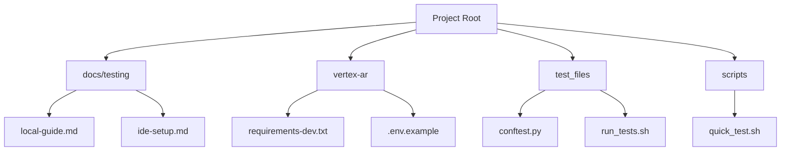
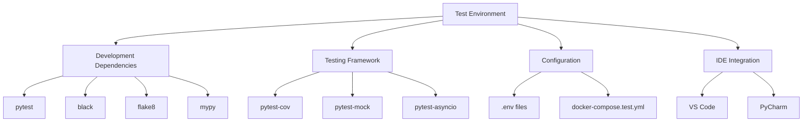
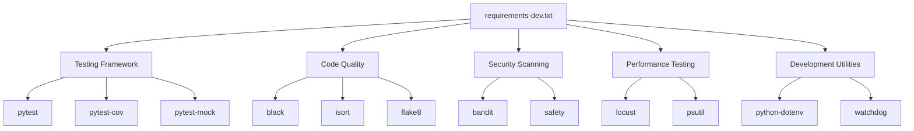
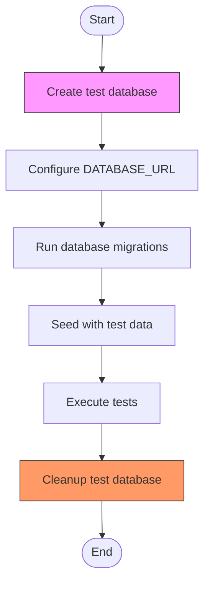
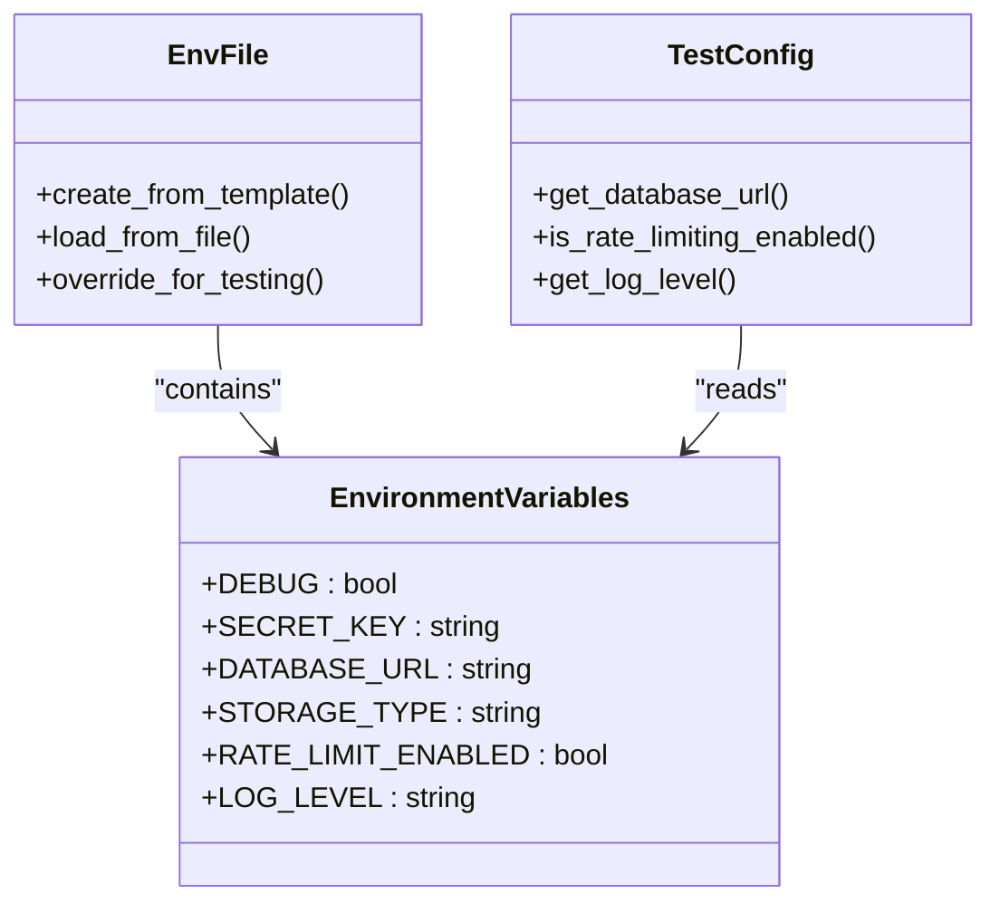
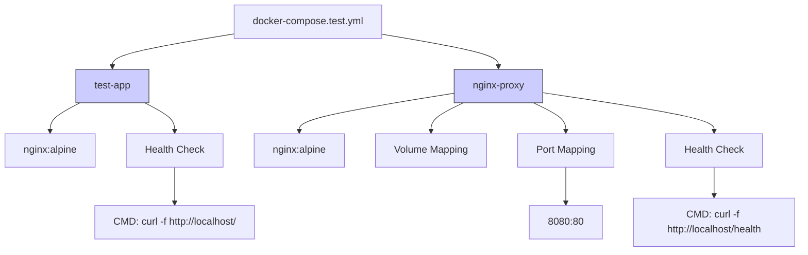
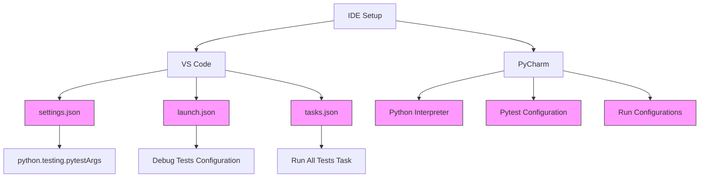
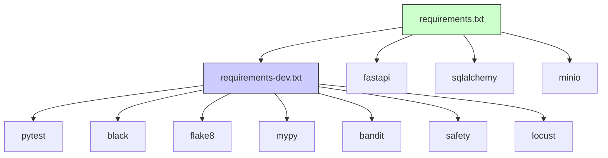
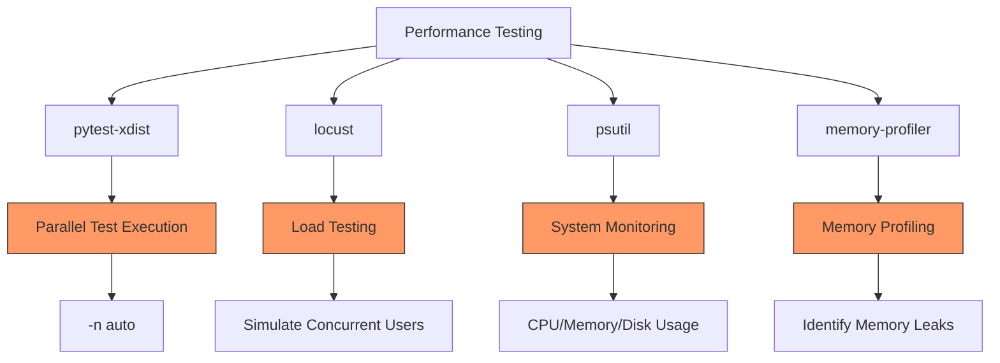
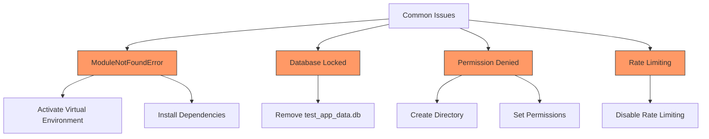

# Test Environment Setup

<cite>
**Referenced Files in This Document**   
- [requirements-dev.txt](file://vertex-ar/requirements-dev.txt)
- [docker-compose.test.yml](file://docker-compose.test.yml)
- [local-guide.md](file://docs/testing/local-guide.md)
- [ide-setup.md](file://docs/testing/ide-setup.md)
- [.env.example](file://vertex-ar/.env.example)
- [run_tests.sh](file://test_files/run_tests.sh)
- [conftest.py](file://test_files/conftest.py)
- [pytest.ini](file://pytest.ini)
</cite>

## Table of Contents
1. [Introduction](#introduction)
2. [Project Structure](#project-structure)
3. [Core Components](#core-components)
4. [Architecture Overview](#architecture-overview)
5. [Detailed Component Analysis](#detailed-component-analysis)
6. [Dependency Analysis](#dependency-analysis)
7. [Performance Considerations](#performance-considerations)
8. [Troubleshooting Guide](#troubleshooting-guide)
9. [Conclusion](#conclusion)

## Introduction
This document provides comprehensive guidance for setting up a local test environment for the Vertex AR project. It covers dependency configuration, test database initialization, environment variable management, containerized testing with Docker Compose, and IDE-specific configurations for VS Code and PyCharm. The guide also includes step-by-step setup procedures, test fixture configuration, database cleanup strategies, mock services usage, and solutions for common setup issues such as port conflicts, missing binaries, and permission problems.

## Project Structure
The project follows a modular structure with clear separation between application code, tests, documentation, and configuration files. The test environment is primarily configured through dedicated files in specific directories.

**Diagram sources**
- [local-guide.md](file://docs/testing/local-guide.md)
- [ide-setup.md](file://docs/testing/ide-setup.md)
- [requirements-dev.txt](file://vertex-ar/requirements-dev.txt)
- [.env.example](file://vertex-ar/.env.example)
- [conftest.py](file://test_files/conftest.py)
- [run_tests.sh](file://test_files/run_tests.sh)

**Section sources**
- [local-guide.md](file://docs/testing/local-guide.md)
- [ide-setup.md](file://docs/testing/ide-setup.md)

## Core Components
The test environment setup relies on several core components including dependency management through requirements-dev.txt, environment variable configuration via .env files, containerized testing with docker-compose.test.yml, and IDE-specific configurations documented in ide-setup.md. The local-guide.md provides step-by-step instructions for setting up the testing environment, while various scripts automate common testing tasks.

**Section sources**
- [requirements-dev.txt](file://vertex-ar/requirements-dev.txt)
- [docker-compose.test.yml](file://docker-compose.test.yml)
- [local-guide.md](file://docs/testing/local-guide.md)
- [ide-setup.md](file://docs/testing/ide-setup.md)

## Architecture Overview
The test environment architecture consists of multiple layers including development dependencies, testing infrastructure, configuration management, and IDE integration. The system uses pytest as the primary testing framework with various plugins for coverage, mocking, and performance testing. Environment variables control application behavior during testing, while Docker Compose enables isolated service testing.

**Diagram sources**
- [requirements-dev.txt](file://vertex-ar/requirements-dev.txt)
- [docker-compose.test.yml](file://docker-compose.test.yml)
- [.env.example](file://vertex-ar/.env.example)
- [ide-setup.md](file://docs/testing/ide-setup.md)

## Detailed Component Analysis

### Dependency Configuration
The test environment uses requirements-dev.txt to manage development and testing dependencies. This file includes testing frameworks, code quality tools, security scanners, performance testing tools, and development utilities.

**Diagram sources**
- [requirements-dev.txt](file://vertex-ar/requirements-dev.txt)

**Section sources**
- [requirements-dev.txt](file://vertex-ar/requirements-dev.txt)

### Test Database Initialization
The test environment initializes SQLite databases for testing purposes. The configuration specifies test-friendly database URLs and provides mechanisms for cleaning up test data between test runs.

**Diagram sources**
- [.env.example](file://vertex-ar/.env.example)
- [local-guide.md](file://docs/testing/local-guide.md)
- [run_tests.sh](file://test_files/run_tests.sh)

### Environment Variable Management
Environment variables are managed through .env files, with .env.example serving as a template. The test environment uses specific values optimized for testing, such as disabled rate limiting and debug mode enabled.

**Diagram sources**
- [.env.example](file://vertex-ar/.env.example)
- [local-guide.md](file://docs/testing/local-guide.md)

### Containerized Testing
The docker-compose.test.yml file defines a minimal Docker Compose configuration for testing isolated services. It includes a test application service and an Nginx proxy service with health checks.

**Diagram sources**
- [docker-compose.test.yml](file://docker-compose.test.yml)

### IDE Configuration
The ide-setup.md document provides detailed instructions for configuring popular IDEs like VS Code and PyCharm for testing. This includes settings for test discovery, debugging configurations, and task automation.

**Diagram sources**
- [ide-setup.md](file://docs/testing/ide-setup.md)

## Dependency Analysis
The test environment has a well-defined dependency structure with clear separation between production and development dependencies. The requirements-dev.txt file extends the core requirements.txt with testing-specific packages.

**Diagram sources**
- [requirements.txt](file://vertex-ar/requirements.txt)
- [requirements-dev.txt](file://vertex-ar/requirements-dev.txt)

**Section sources**
- [requirements.txt](file://vertex-ar/requirements.txt)
- [requirements-dev.txt](file://vertex-ar/requirements-dev.txt)

## Performance Considerations
The test environment includes performance testing capabilities through dedicated tools and scripts. The pytest.ini configuration optimizes test execution with parallel execution options and performance monitoring.

**Diagram sources**
- [requirements-dev.txt](file://vertex-ar/requirements-dev.txt)
- [pytest.ini](file://pytest.ini)
- [run_performance_tests.sh](file://test_files/run_performance_tests.sh)

## Troubleshooting Guide
Common setup issues and their solutions are documented in the local-guide.md file. These include module not found errors, database locking issues, permission problems, and rate limiting conflicts during testing.

**Diagram sources**
- [local-guide.md](file://docs/testing/local-guide.md)
- [run_tests.sh](file://test_files/run_tests.sh)

**Section sources**
- [local-guide.md](file://docs/testing/local-guide.md)
- [run_tests.sh](file://test_files/run_tests.sh)

## Conclusion
The test environment setup for Vertex AR is comprehensive and well-documented, providing developers with all necessary tools and configurations for effective testing. The combination of dependency management, environment configuration, containerized testing, and IDE integration creates a robust foundation for both unit and integration testing. By following the documented procedures, developers can quickly establish a functional test environment and begin contributing to the project.