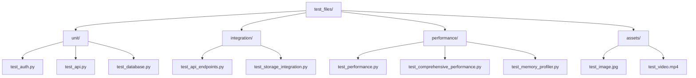
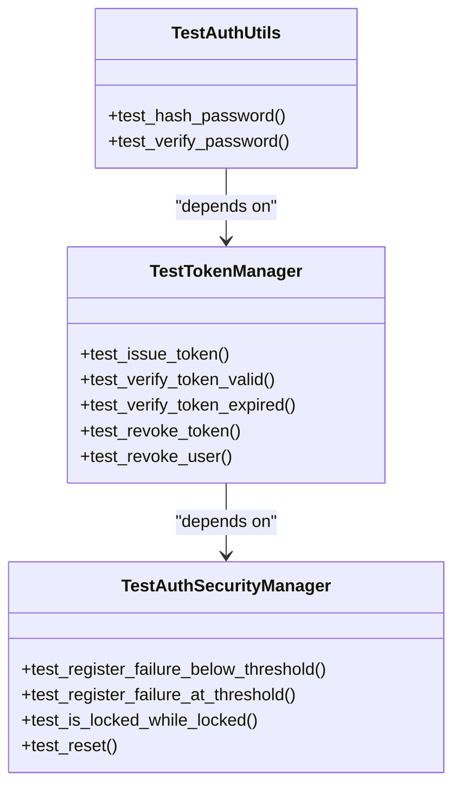
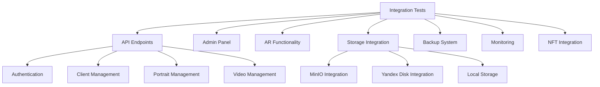
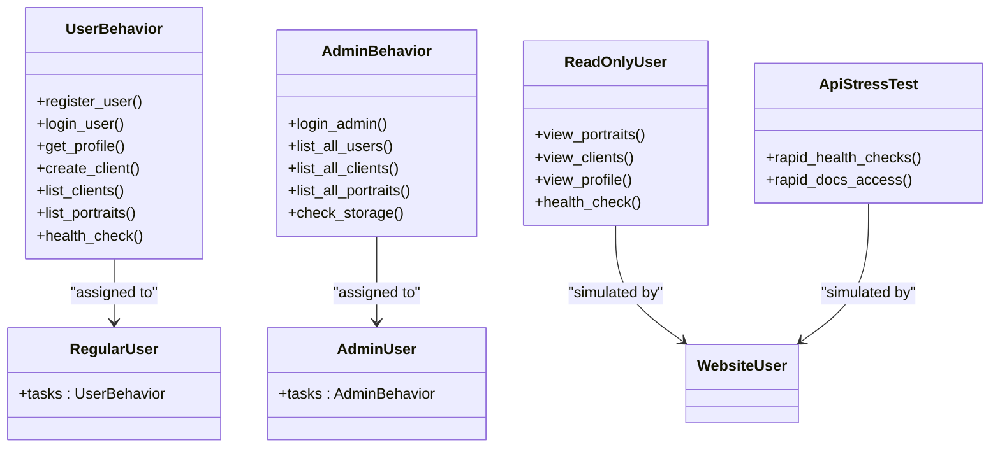
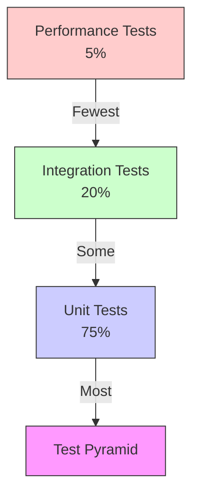
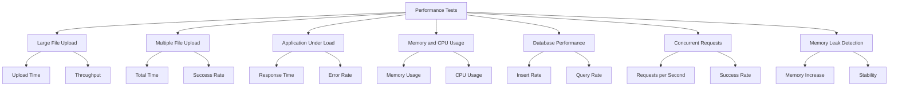

# Testing Strategy

<cite>
**Referenced Files in This Document**   
- [test_files/README.md](file://test_files/README.md)
- [test_files/conftest.py](file://test_files/conftest.py)
- [pytest.ini](file://pytest.ini)
- [locustfile.py](file://locustfile.py)
- [test_files/unit/test_auth.py](file://test_files/unit/test_auth.py)
- [test_files/unit/test_api.py](file://test_files/unit/test_api.py)
- [test_files/unit/test_database.py](file://test_files/unit/test_database.py)
- [test_files/integration/test_api_endpoints.py](file://test_files/integration/test_api_endpoints.py)
- [test_files/integration/test_storage_integration.py](file://test_files/integration/test_storage_integration.py)
- [test_files/performance/test_performance.py](file://test_files/performance/test_performance.py)
- [test_files/performance/test_comprehensive_performance.py](file://test_files/performance/test_comprehensive_performance.py)
- [test_files/performance/test_memory_profiler.py](file://test_files/performance/test_memory_profiler.py)
</cite>

## Table of Contents
1. [Introduction](#introduction)
2. [Test Organization](#test-organization)
3. [Unit Testing with pytest](#unit-testing-with-pytest)
4. [Integration Testing Patterns](#integration-testing-patterns)
5. [Performance Testing with Locust](#performance-testing-with-locust)
6. [Test Fixtures and Mocking Strategies](#test-fixtures-and-mocking-strategies)
7. [Test Pyramid Implementation](#test-pyramid-implementation)
8. [Code Coverage Requirements](#code-coverage-requirements)
9. [Writing Effective Test Cases](#writing-effective-test-cases)
10. [Testing Asynchronous Code and Background Tasks](#testing-asynchronous-code-and-background-tasks)
11. [External Service Integration Testing](#external-service-integration-testing)
12. [Running Tests Locally and in CI/CD](#running-tests-locally-and-in-cicd)
13. [Performance Benchmarking and Load Testing](#performance-benchmarking-and-load-testing)
14. [Conclusion](#conclusion)

## Introduction
This document outlines the comprehensive testing strategy and quality assurance processes for the Vertex AR project. The testing framework is designed to ensure high code quality, reliability, and performance through a multi-layered approach that includes unit testing, integration testing, and performance testing. The strategy emphasizes automated testing using pytest for functional tests and Locust for load testing, with a clear test organization structure that separates different test types. The document covers test organization, fixture usage, mocking strategies, test pyramid implementation, code coverage requirements, and guidelines for writing effective test cases for various components including API endpoints, business logic, and database interactions. It also addresses specialized testing scenarios such as asynchronous code, background tasks, and external service integrations, along with instructions for running tests both locally and in CI/CD pipelines.

## Test Organization
The Vertex AR project follows a well-structured test organization that categorizes tests by type and purpose. All tests are consolidated in the `test_files/` directory with a clear hierarchical structure that separates unit tests, integration tests, and performance tests. This organization enables efficient test execution and maintenance.



**Diagram sources**
- [test_files/README.md](file://test_files/README.md#L7-L97)

The test directory structure follows these categories:

- **Unit tests** (`unit/`): Fast, isolated tests for individual components and business logic without external dependencies
- **Integration tests** (`integration/`): Tests for component interactions, full API flows, admin panel functionality, and complete workflows
- **Performance tests** (`performance/`): Tests for system performance under various conditions, including load testing, stress testing, and memory profiling
- **Test assets** (`assets/`): Shared test fixtures, images, videos, and expected results used across all test categories

The organization enables selective test execution based on type, with clear separation between fast unit tests and slower integration and performance tests. This structure supports the test pyramid implementation by making it easy to run different test categories independently or in combination.

**Section sources**
- [test_files/README.md](file://test_files/README.md#L100-L138)

## Unit Testing with pytest
The Vertex AR project utilizes pytest as the primary testing framework for unit testing, providing a robust and flexible environment for testing individual components and business logic. The unit tests are designed to be fast, isolated, and focused on specific functionality without external dependencies.

### Test Discovery and Configuration
The pytest configuration is defined in `pytest.ini`, which specifies test discovery patterns, default options, markers, and coverage requirements. The configuration ensures consistent test execution across different environments.

```ini
[tool:pytest]
python_files = test_*.py *_test.py
python_classes = Test*
python_functions = test_*
testpaths = 
    test_files

addopts = 
    -v
    --tb=short
    --strict-markers
    --color=yes
    --durations=10
    --cov=vertex-ar/app
    --cov-report=term-missing
    --cov-report=html:htmlcov
    --cov-fail-under=70

markers =
    unit: Unit tests
    integration: Integration tests
    slow: Slow tests that take more than a few seconds
    api: API endpoint tests
    storage: Storage-related tests
    auth: Authentication tests
    nft: NFT-related tests
    ar: AR functionality tests
    admin: Admin panel tests
    security: Security tests
    performance: Performance tests
```

**Diagram sources**
- [pytest.ini](file://pytest.ini#L1-L70)

The configuration includes several important settings:
- Test discovery patterns that identify test files, classes, and functions
- Default command-line options for verbose output, colorized results, and duration reporting
- Code coverage requirements with a minimum threshold of 70%
- Custom markers for selective test execution
- Timeout settings to prevent hanging tests
- Async configuration for testing asynchronous code

### Unit Test Examples
Unit tests focus on isolated components and business logic. For example, the authentication module includes comprehensive tests for password hashing, token management, and security features.



**Diagram sources**
- [test_files/unit/test_auth.py](file://test_files/unit/test_auth.py#L11-L266)

The unit tests for the API endpoints demonstrate the use of fixtures and the TestClient from FastAPI to test individual endpoints in isolation:

```python
@pytest.fixture
def temp_db():
    """Create a temporary database for testing."""
    with tempfile.NamedTemporaryFile(suffix='.db', delete=False) as f:
        db_path = Path(f.name)
    
    yield db_path
    
    # Cleanup
    db_path.unlink(missing_ok=True)

@pytest.fixture
def test_app(temp_db):
    """Create a test FastAPI app with temporary database."""
    with patch.dict('os.environ', {
        'RUNNING_TESTS': '1',
        'RATE_LIMIT_ENABLED': 'false',
        'CORS_ORIGINS': 'http://localhost:8000'
    }):
        app = create_app()
        
        # Initialize database with temp path
        from app.database import Database
        app.state.database = Database(temp_db)
        
        # Initialize auth components
        from app.auth import TokenManager, AuthSecurityManager
        app.state.tokens = TokenManager(session_timeout_minutes=30)
        app.state.auth_security = AuthSecurityManager(max_attempts=5, lockout_minutes=15)
        
        return app
```

**Section sources**
- [test_files/unit/test_api.py](file://test_files/unit/test_api.py#L13-L46)
- [test_files/unit/test_auth.py](file://test_files/unit/test_auth.py#L38-L41)

### Running Unit Tests
Unit tests can be executed using several methods:

```bash
# Run all unit tests
pytest test_files/unit/

# Run with coverage
pytest test_files/unit/ --cov=vertex-ar/app --cov-report=term-missing

# Run specific test categories using markers
pytest test_files/ -m unit

# Run in parallel for faster execution
pytest test_files/unit/ -n auto
```

The unit tests are designed to run quickly (typically in milliseconds) and should not depend on external services or network calls. They use mocking to isolate the components being tested and ensure reliable, repeatable results.

**Section sources**
- [test_files/README.md](file://test_files/README.md#L147-L155)

## Integration Testing Patterns
Integration testing in the Vertex AR project focuses on testing the interaction between multiple components, full API flows, and complete workflows. These tests verify that different parts of the system work together as expected and cover complex business scenarios.

### Integration Test Structure
Integration tests are organized in the `test_files/integration/` directory and cover various aspects of the application, including API endpoints, admin panel functionality, AR features, and storage integration.



**Diagram sources**
- [test_files/README.md](file://test_files/README.md#L35-L79)

### API Integration Testing
The API integration tests verify the complete request-response cycle for various endpoints. The `test_api_endpoints.py` file contains comprehensive tests for different API categories:

```python
def test_auth_endpoints():
    """Тестирование эндпоинтов аутентификации"""
    # Create temporary database
    db_path = Path(temp_dir) / "test.db"
    db = Database(db_path)
    
    # Test registration
    register_data = {
        "username": "test_user",
        "password": "test_password"
    }
    response = client.post("/auth/register", json=register_data)
    
    # Test login
    login_data = {
        "username": "test_user",
        "password": "test_password"
    }
    response = client.post("/auth/login", json=login_data)
```

**Section sources**
- [test_files/integration/test_api_endpoints.py](file://test_files/integration/test_api_endpoints.py#L60-L106)

### Storage Integration Testing
The storage integration tests verify the application's ability to work with different storage backends, including local storage, MinIO, and Yandex Disk. The `test_storage_integration.py` file contains a comprehensive test suite for storage operations:

```python
class StorageIntegrationTester:
    """Тестер интеграции хранилищ"""
    
    def test_local_storage_upload(self, file_set: Dict) -> StorageTestResult:
        """Тест загрузки в локальное хранилище"""
        with open(file_set['image'], 'rb') as img, open(file_set['video'], 'rb') as vid:
            files = {
                'image': (os.path.basename(file_set['image']), img, 'image/jpeg'),
                'video': (os.path.basename(file_set['video']), vid, 'video/mp4')
            }
            data = {
                'phone': file_set['phone'],
                'name': file_set['name']
            }
            
            response = self.session.post(
                f"{self.base_url}/orders/create",
                files=files,
                data=data
            )
```

**Section sources**
- [test_files/integration/test_storage_integration.py](file://test_files/integration/test_storage_integration.py#L169-L190)

### Running Integration Tests
Integration tests can be executed using the following commands:

```bash
# Run all integration tests
pytest test_files/integration/

# Run with coverage
pytest test_files/integration/ --cov=vertex-ar/app --cov-report=term-missing

# Run specific test categories using markers
pytest test_files/ -m integration

# Run specific integration tests
pytest test_files/integration/test_api_endpoints.py -v
```

Integration tests may use a test database and make HTTP requests, but they are designed to be self-contained and not affect production data. They test complete workflows and component interactions, ensuring that the system functions correctly as a whole.

**Section sources**
- [test_files/README.md](file://test_files/README.md#L150-L152)

## Performance Testing with Locust
The Vertex AR project employs Locust for performance and load testing, enabling the simulation of real user behavior under various load conditions. The performance testing strategy focuses on identifying bottlenecks, measuring system capacity, and ensuring the application can handle expected traffic patterns.

### Locust Test Configuration
The Locust configuration is defined in `locustfile.py`, which specifies different user behaviors and task patterns to simulate realistic usage scenarios.



**Diagram sources**
- [locustfile.py](file://locustfile.py#L7-L243)

The configuration defines several user types with different behaviors:

- **UserBehavior**: Simulates a regular user performing registration, login, profile viewing, client creation, and content browsing
- **AdminBehavior**: Simulates an admin user with elevated privileges, accessing user management and system monitoring features
- **ReadOnlyUser**: Simulates a lightweight user that only reads data, representing a high-volume read scenario
- **ApiStressTest**: Simulates rapid API requests to stress test the system's response time and throughput

### Load Testing Scenarios
The Locust configuration includes multiple load testing scenarios with different user weights to simulate realistic traffic patterns:

```python
class ReadOnlyUser(HttpUser):
    """User that only reads data - lightweight load"""
    wait_time = between(2, 5)
    weight = 3  # 3x more read-only users than regular users
    
    @task(5)
    def view_portraits(self):
        """View portraits"""
        if hasattr(self, 'token'):
            self.client.get("/api/portraits/", headers={
                "Authorization": f"Bearer {self.token}"
            })

class RegularUser(HttpUser):
    """Regular user with normal behavior"""
    tasks = [UserBehavior]
    wait_time = between(1, 3)
    weight = 2

class AdminUser(HttpUser):
    """Admin user with elevated privileges"""
    tasks = [AdminBehavior]
    wait_time = between(3, 7)
    weight = 1  # Less admin users
```

**Section sources**
- [locustfile.py](file://locustfile.py#L169-L226)

The weighting system ensures that the load test reflects real-world usage patterns, with more read-only users than regular users, and fewer admin users. This creates a realistic distribution of user activities and system load.

### Running Performance Tests
Performance tests can be executed using the following methods:

```bash
# Run Locust with default configuration
locust -f locustfile.py --host=http://localhost:8000

# Run with specific number of users and spawn rate
locust -f locustfile.py --host=http://localhost:8000 --users=100 --spawn-rate=10

# Run in headless mode for CI/CD
locust -f locustfile.py --host=http://localhost:8000 --headless --users=50 --spawn-rate=5 --run-time=5m

# Generate HTML report
locust -f locustfile.py --host=http://localhost:8000 --html=reports/locust_report.html
```

The Locust web interface is available at http://localhost:8089, where you can monitor test progress, adjust user count, and view real-time statistics.

**Section sources**
- [locustfile.py](file://locustfile.py#L3-L5)

## Test Fixtures and Mocking Strategies
The Vertex AR project employs a comprehensive approach to test fixtures and mocking to ensure reliable, isolated, and efficient tests. These strategies enable the creation of consistent test environments while minimizing dependencies on external systems.

### Shared Fixtures
The project uses a shared `conftest.py` file in the `test_files/` directory to define fixtures that are available across all test suites. This centralizes common setup and configuration logic.

```python
"""Shared pytest configuration for all test suites

This conftest.py is shared across unit, integration, and performance tests.
It handles path setup and common fixtures.
"""
import sys
from pathlib import Path

project_root = Path(__file__).resolve().parent.parent
vertex_ar_path = project_root / "vertex-ar"

if str(vertex_ar_path) not in sys.path:
    sys.path.insert(0, str(vertex_ar_path))

if str(project_root) not in sys.path:
    sys.path.insert(0, str(project_root))
```

**Section sources**
- [test_files/conftest.py](file://test_files/conftest.py#L1-L17)

The shared configuration automatically adds the necessary paths to the Python path, allowing tests to import modules from the main application without additional setup. This eliminates the need for `sys.path.insert()` calls in individual test files.

### Database Fixtures
Database testing uses temporary database fixtures to ensure isolation and prevent test contamination. The `temp_db` fixture creates a temporary SQLite database for each test:

```python
@pytest.fixture
def temp_db():
    """Create a temporary database for testing."""
    with tempfile.NamedTemporaryFile(suffix='.db', delete=False) as f:
        db_path = Path(f.name)
    
    yield db_path
    
    # Cleanup
    db_path.unlink(missing_ok=True)
```

**Section sources**
- [test_files/unit/test_database.py](file://test_files/unit/test_database.py#L10-L21)

For API tests, a more comprehensive fixture creates a test application with a temporary database and initialized components:

```python
@pytest.fixture
def test_app(temp_db):
    """Create a test FastAPI app with temporary database."""
    with patch.dict('os.environ', {
        'RUNNING_TESTS': '1',
        'RATE_LIMIT_ENABLED': 'false',
        'CORS_ORIGINS': 'http://localhost:8000'
    }):
        app = create_app()
        
        # Initialize database with temp path
        from app.database import Database
        app.state.database = Database(temp_db)
        
        # Initialize auth components
        from app.auth import TokenManager, AuthSecurityManager
        app.state.tokens = TokenManager(session_timeout_minutes=30)
        app.state.auth_security = AuthSecurityManager(max_attempts=5, lockout_minutes=15)
        
        return app
```

**Section sources**
- [test_files/unit/test_api.py](file://test_files/unit/test_api.py#L25-L45)

### Mocking Strategies
The project uses mocking extensively to isolate components and simulate external dependencies. The unittest.mock library is used to patch external services, database calls, and file operations.

For API endpoint tests, external services like the PreviewGenerator and NFTMarkerGenerator are mocked:

```python
def test_create_portrait(self, client, auth_headers):
    """Test creating a portrait."""
    # First create a client
    client_response = client.post("/clients/", json={
        "phone": "+1234567890",
        "name": "John Doe"
    }, headers=auth_headers)
    client_id = client_response.json()["id"]
    
    # Mock file upload and NFT generation
    with patch('app.api.portraits.PreviewGenerator') as mock_preview, \
         patch('app.api.portraits.NFTMarkerGenerator') as mock_nft, \
         patch('app.api.portraits.qrcode') as mock_qrcode:
        
        # Setup mocks
        mock_preview.generate_image_preview.return_value = b"fake_preview"
        mock_nft.return_value.generate_marker.return_value = Mock(
            fset_path="fset",
            fset3_path="fset3",
            iset_path="iset"
        )
        mock_qrcode.make.return_value = Mock()
        mock_qrcode.make.return_value.save = Mock()
        
        # Mock the BytesIO operations
        with patch('app.api.portraits.BytesIO') as mock_bytesio, \
             patch('builtins.open', create=True) as mock_open, \
             patch('app.api.portraits.base64.b64encode') as mock_b64:
            
            mock_bytesio.return_value = Mock()
            mock_b64.return_value.decode.return_value = "fake_qr"
            
            # Create portrait with mock image
            response = client.post(
                f"/portraits/?client_id={client_id}",
                files={"image": ("test.jpg", b"fake_image_content", "image/jpeg")},
                headers=auth_headers
            )
```

**Section sources**
- [test_files/unit/test_api.py](file://test_files/unit/test_api.py#L320-L347)

The mocking strategy allows the test to verify the correct sequence of operations and error handling without requiring actual file processing or external service calls. This makes the tests faster, more reliable, and independent of external factors.

### Environment Variable Mocking
Environment variables are mocked to ensure consistent test behavior across different environments:

```python
@pytest.fixture
def test_app(temp_db):
    """Create a test FastAPI app with temporary database."""
    with patch.dict('os.environ', {
        'RUNNING_TESTS': '1',
        'RATE_LIMIT_ENABLED': 'false',
        'CORS_ORIGINS': 'http://localhost:8000'
    }):
        # Application setup code
        pass
```

**Section sources**
- [test_files/unit/test_api.py](file://test_files/unit/test_api.py#L29-L33)

This approach ensures that features like rate limiting are disabled during testing, preventing test failures due to timing issues.

## Test Pyramid Implementation
The Vertex AR project follows the test pyramid principle, which emphasizes a balanced distribution of tests across different levels of the testing hierarchy. The pyramid structure ensures that the majority of tests are fast, isolated unit tests, with fewer integration tests and even fewer end-to-end and performance tests.



**Diagram sources**
- [test_files/README.md](file://test_files/README.md#L100-L138)

### Unit Tests (Base of the Pyramid)
Unit tests form the foundation of the test pyramid, comprising approximately 75% of the total test suite. These tests are:

- Fast (typically execute in milliseconds)
- Isolated (no external dependencies)
- Focused on specific functions or methods
- Easy to write and maintain
- Run frequently during development

The unit tests cover individual components such as authentication utilities, database operations, and business logic functions. They use mocking to isolate the code under test and ensure reliable, repeatable results.

### Integration Tests (Middle Layer)
Integration tests make up about 20% of the test suite and focus on the interaction between multiple components. These tests:

- Verify component integration
- Test complete workflows
- May use a test database
- May make HTTP requests
- Take several seconds to execute

The integration tests cover API endpoints, admin panel functionality, AR features, and storage integration. They ensure that different parts of the system work together as expected and catch issues that unit tests might miss.

### Performance and End-to-End Tests (Top of the Pyramid)
Performance and end-to-end tests constitute approximately 5% of the total test suite. These tests:

- Simulate real user behavior
- Test system performance under load
- Measure response times and throughput
- Identify bottlenecks and scalability issues
- May take minutes to execute

The performance tests use Locust to simulate multiple users and measure system capacity. They are typically run less frequently, such as in CI/CD pipelines or before major releases.

### Benefits of the Test Pyramid
The test pyramid implementation provides several benefits:

- **Faster feedback**: The majority of tests are fast unit tests that provide quick feedback during development
- **Improved reliability**: Isolated unit tests are less prone to flakiness than end-to-end tests
- **Better maintainability**: Changes to the system typically require updates to a small number of integration tests rather than many end-to-end tests
- **Cost efficiency**: Fast unit tests can be run frequently without significant resource consumption
- **Comprehensive coverage**: The combination of different test types provides thorough coverage of the system

The test pyramid guides the team to write the right type of tests for each scenario, ensuring a balanced and effective testing strategy.

**Section sources**
- [test_files/README.md](file://test_files/README.md#L100-L138)

## Code Coverage Requirements
The Vertex AR project enforces strict code coverage requirements to ensure comprehensive test coverage and maintain high code quality. The coverage requirements are configured in the `pytest.ini` file and integrated into the development workflow.

### Coverage Configuration
The code coverage requirements are defined in the `pytest.ini` configuration file:

```ini
[tool:pytest]
addopts = 
    --cov=vertex-ar/app
    --cov-report=term-missing
    --cov-report=html:htmlcov
    --cov-fail-under=70
```

**Section sources**
- [pytest.ini](file://pytest.ini#L20-L23)

This configuration specifies:

- **Coverage target**: The `--cov=vertex-ar/app` option specifies that coverage should be measured for the `vertex-ar/app` directory, which contains the main application code
- **Coverage reports**: Two types of reports are generated:
  - Terminal report with missing lines (`--cov-report=term-missing`)
  - HTML report for detailed analysis (`--cov-report=html:htmlcov`)
- **Minimum threshold**: The `--cov-fail-under=70` option sets a minimum coverage threshold of 70%, causing the test run to fail if coverage drops below this level

### Coverage Enforcement
The coverage requirements are enforced through the following mechanisms:

1. **Local development**: Developers are expected to run tests with coverage locally to ensure their changes meet the minimum requirements
2. **CI/CD pipeline**: The CI/CD pipeline runs tests with coverage and fails the build if coverage drops below 70%
3. **Pull request checks**: Code coverage is checked as part of the pull request process, preventing merges that reduce coverage

### Coverage Analysis
The HTML coverage report provides detailed insights into which lines of code are covered by tests and which are not. This helps identify areas that need additional test coverage.

```bash
# Generate coverage report
pytest test_files/ --cov=vertex-ar/app --cov-report=html

# View report
open htmlcov/index.html
```

The coverage report highlights:
- Lines of code that are executed by tests (covered)
- Lines of code that are not executed by tests (missing)
- Branch coverage information
- Overall coverage percentage

### Coverage Goals
While the minimum requirement is 70% coverage, the project aims for higher coverage in critical areas:

- **Core business logic**: Target 90%+ coverage
- **Authentication and security**: Target 95%+ coverage
- **Database operations**: Target 85%+ coverage
- **API endpoints**: Target 80%+ coverage

The coverage requirements are periodically reviewed and adjusted based on project needs and risk assessment. The goal is to balance thorough testing with practical development constraints.

**Section sources**
- [pytest.ini](file://pytest.ini#L20-L23)

## Writing Effective Test Cases
Creating effective test cases is essential for ensuring the reliability and maintainability of the Vertex AR application. The project follows best practices for writing test cases that are clear, focused, and provide maximum value.

### Test Case Structure
Effective test cases follow a consistent structure that makes them easy to understand and maintain. The typical structure includes:

1. **Setup**: Prepare the test environment, create necessary objects, and establish preconditions
2. **Execution**: Perform the action being tested
3. **Verification**: Check that the expected outcomes occurred
4. **Teardown**: Clean up any resources created during the test

```python
def test_create_client(self, client, auth_headers):
    """Test creating a client."""
    # Setup: No additional setup needed beyond fixtures
    
    # Execution: Create a client
    response = client.post("/clients/", json={
        "phone": "+1234567890",
        "name": "John Doe"
    }, headers=auth_headers)
    
    # Verification: Check response status and data
    assert response.status_code == 201
    
    data = response.json()
    assert data["phone"] == "+1234567890"
    assert data["name"] == "John Doe"
    assert "id" in data
    assert "created_at" in data
    
    # Teardown: Handled by fixtures
```

**Section sources**
- [test_files/unit/test_api.py](file://test_files/unit/test_api.py#L175-L188)

### Test Naming Conventions
Clear and descriptive test names are crucial for understanding what each test verifies. The project follows these naming conventions:

- Test function names start with `test_`
- Names are descriptive and indicate what is being tested
- For parameterized tests, names include the test case description

```python
def test_hash_password(self):
    """Test password hashing."""

def test_verify_token_valid(self, token_manager):
    """Test token verification for valid token."""

def test_verify_token_expired(self, token_manager):
    """Test token verification for expired token."""
```

**Section sources**
- [test_files/unit/test_auth.py](file://test_files/unit/test_auth.py#L14-L25)

### Testing API Endpoints
When writing test cases for API endpoints, the following patterns are used:

```python
def test_list_clients(self, client, auth_headers):
    """Test listing clients."""
    # Create a client first
    client.post("/clients/", json={
        "phone": "+1234567890",
        "name": "John Doe"
    }, headers=auth_headers)
    
    # Execute: List clients
    response = client.get("/clients/", headers=auth_headers)
    
    # Verify: Response status and data
    assert response.status_code == 200
    
    data = response.json()
    assert len(data) == 1
    assert data[0]["phone"] == "+1234567890"
    assert data[0]["name"] == "John Doe"
```

**Section sources**
- [test_files/unit/test_api.py](file://test_files/unit/test_api.py#L204-L219)

Key considerations for API endpoint tests:
- Test both success and error cases
- Verify response status codes
- Check response data structure and content
- Test authentication and authorization requirements
- Validate input validation and error handling

### Testing Business Logic
Business logic tests focus on the core functionality of the application:

```python
def test_client_operations(self, temp_db):
    """Test client CRUD operations."""
    # Create client
    client = temp_db.create_client("client1", "+1234567890", "John Doe")
    
    assert client["id"] == "client1"
    assert client["phone"] == "+1234567890"
    assert client["name"] == "John Doe"
    assert "created_at" in client
    
    # Get client
    retrieved = temp_db.get_client("client1")
    assert retrieved == client
```

**Section sources**
- [test_files/unit/test_database.py](file://test_files/unit/test_database.py#L94-L106)

Best practices for business logic tests:
- Test edge cases and boundary conditions
- Verify data integrity and consistency
- Test error handling and exception cases
- Use descriptive assertions that clearly indicate what is being tested

### Testing Database Interactions
Database interaction tests ensure that data is correctly stored and retrieved:

```python
def test_ensure_admin_user(self, temp_db):
    """Test ensuring default admin user creation and updates."""
    temp_db.ensure_admin_user(
        "superar",
        "initial_hash",
        email="admin@example.com",
        full_name="Super Admin",
    )
    user = temp_db.get_user("superar")
    assert user is not None
    assert user["hashed_password"] == "initial_hash"
    assert user["is_admin"] == 1
    assert user["is_active"] == 1
    assert user["email"] == "admin@example.com"
    assert user["full_name"] == "Super Admin"
```

**Section sources**
- [test_files/unit/test_database.py](file://test_files/unit/test_database.py#L65-L79)

Key considerations for database tests:
- Use temporary databases to avoid affecting production data
- Test transaction handling and rollback behavior
- Verify data constraints and validation
- Test query performance and indexing

## Testing Asynchronous Code and Background Tasks
The Vertex AR project includes asynchronous code and background tasks that require specialized testing approaches. The testing strategy addresses these challenges through appropriate tools and patterns.

### Async Testing Configuration
The pytest configuration includes settings for testing asynchronous code:

```ini
[tool:pytest]
asyncio_mode = auto
```

**Section sources**
- [pytest.ini](file://pytest.ini#L67)

This setting enables pytest to handle async test functions automatically, allowing the use of `async`/`await` syntax in test functions.

### Testing Async Functions
Async functions are tested using the same patterns as synchronous functions, with the addition of `await` for async calls:

```python
@pytest.mark.asyncio
async def test_async_database_operations():
    """Test asynchronous database operations."""
    # Setup
    db = AsyncDatabase()
    await db.connect()
    
    # Execute
    result = await db.create_user("testuser", "hashed_password")
    
    # Verify
    assert result is not None
    assert result["username"] == "testuser"
    
    # Cleanup
    await db.disconnect()
```

The `@pytest.mark.asyncio` decorator is used to mark test functions that are async, allowing pytest to run them in an event loop.

### Testing Background Tasks
Background tasks, such as periodic jobs or event-driven processes, are tested by:

1. **Mocking the task scheduler**: To control when tasks are executed
2. **Verifying task side effects**: By checking the results of task execution
3. **Testing error handling**: By simulating failures in task execution

```python
def test_backup_scheduler():
    """Test backup scheduler functionality."""
    # Mock the scheduler
    with patch('vertex-ar.backup_scheduler.BackgroundScheduler') as mock_scheduler:
        # Create scheduler instance
        scheduler = BackupScheduler()
        
        # Verify job was added
        assert mock_scheduler.return_value.add_job.called
        assert mock_scheduler.return_value.start.called
        
        # Manually trigger job for testing
        scheduler.execute_backup_job()
        
        # Verify backup was created
        assert os.path.exists("/path/to/backup")
```

**Section sources**
- [test_files/integration/test_backup_system.py](file://test_files/integration/test_backup_system.py)

### Testing Concurrency
Concurrency issues are tested by simulating multiple simultaneous operations:

```python
def test_concurrent_database_access():
    """Test database access with multiple concurrent connections."""
    # Create multiple database instances
    dbs = [Database("test.db") for _ in range(5)]
    
    # Execute operations concurrently
    with concurrent.futures.ThreadPoolExecutor(max_workers=5) as executor:
        futures = [
            executor.submit(db.create_user, f"user_{i}", "password")
            for i, db in enumerate(dbs)
        ]
        
        # Wait for completion
        results = [future.result() for future in futures]
    
    # Verify all users were created
    all_users = dbs[0].list_users()
    assert len(all_users) == 5
```

This approach helps identify race conditions, deadlocks, and other concurrency-related issues.

### Testing Time-Dependent Logic
Time-dependent logic, such as token expiration or scheduled tasks, is tested using time manipulation:

```python
def test_token_expiration(self, token_manager):
    """Test token verification for expired token."""
    username = "testuser"
    token = token_manager.issue_token(username)
    
    # Manually expire the token by setting last_seen far in the past
    session = token_manager._tokens[token]
    session.last_seen = datetime.utcnow() - timedelta(minutes=2)
    
    verified_username = token_manager.verify_token(token)
    assert verified_username is None
    
    # Token should be removed from storage
    assert token not in token_manager._tokens
```

**Section sources**
- [test_files/unit/test_auth.py](file://test_files/unit/test_auth.py#L73-L86)

By manipulating time directly in the test, we can verify the correct behavior of time-dependent logic without having to wait for actual time to pass.

## External Service Integration Testing
Testing integration with external services is critical for ensuring the reliability of the Vertex AR application. The project employs strategies to test external service integrations while maintaining test isolation and reliability.

### Testing Storage Integrations
The application integrates with multiple storage services, including local storage, MinIO, and Yandex Disk. These integrations are tested using a combination of direct integration tests and mocking.

```python
class StorageIntegrationTester:
    """Тестер интеграции хранилищ"""
    
    def setup_minio_client(self) -> bool:
        """Настроить клиент MinIO"""
        try:
            # Проверяем переменные окружения для MinIO
            minio_endpoint = os.getenv("MINIO_ENDPOINT", "localhost:9000")
            minio_access_key = os.getenv("MINIO_ACCESS_KEY", "minioadmin")
            minio_secret_key = os.getenv("MINIO_SECRET_KEY", "minioadmin")
            minio_secure = os.getenv("MINIO_SECURE", "false").lower() == "true"
            
            self.minio_client = Minio(
                endpoint=minio_endpoint,
                access_key=minio_access_key,
                secret_key=minio_secret_key,
                secure=minio_secure
            )
            
            # Проверяем соединение
            buckets = self.minio_client.list_buckets()
            print(f"✅ MinIO клиент настроен. Доступно бакетов: {len(buckets)}")
            
            return True
            
        except Exception as e:
            print(f"❌ Ошибка настройки MinIO: {e}")
            print("⚠️  Продолжаем тесты с локальным хранилищем")
            self.minio_client = None
            return False
```

**Section sources**
- [test_files/integration/test_storage_integration.py](file://test_files/integration/test_storage_integration.py#L56-L89)

The testing strategy for storage integrations includes:

1. **Direct integration tests**: When external services are available, tests connect directly to the services to verify real integration
2. **Fallback to local testing**: When external services are not available, tests fall back to local storage testing
3. **Comprehensive test coverage**: Tests cover upload, download, listing, and deletion operations
4. **Performance comparison**: Tests compare performance between different storage backends

### Testing with Mocked External Services
For tests that need to verify logic without depending on external service availability, mocking is used:

```python
def test_yandex_disk_integration():
    """Test Yandex Disk integration with mocking."""
    # Mock the Yandex Disk client
    with patch('vertex-ar.storage_yandex.YandexDiskClient') as mock_client:
        # Configure mock responses
        mock_instance = mock_client.return_value
        mock_instance.upload_file.return_value = True
        mock_instance.get_file_info.return_value = {
            'size': 1024,
            'modified': '2023-01-01T00:00:00Z'
        }
        
        # Create storage adapter
        storage = YandexDiskStorage()
        
        # Execute operations
        result = storage.upload('test.txt', b'content')
        
        # Verify interactions
        assert result is True
        mock_instance.upload_file.assert_called_once()
        mock_instance.get_file_info.assert_called_once()
```

This approach allows testing the integration logic without requiring actual access to the external service, making tests faster and more reliable.

### Testing Error Handling
Error handling for external service integrations is thoroughly tested:

```python
def test_minio_connection_failure():
    """Test handling of MinIO connection failures."""
    # Mock connection failure
    with patch('minio.Minio.__init__') as mock_init:
        mock_init.side_effect = S3Error(
            code='ConnectionFailed',
            message='Unable to connect to server',
            resource='/',
            request_id=None,
            host_id=None,
            response=None
        )
        
        # Attempt to create storage adapter
        with pytest.raises(StorageConnectionError):
            storage = MinIOStorage(
                endpoint='invalid-endpoint',
                access_key='key',
                secret_key='secret'
            )
```

**Section sources**
- [test_files/integration/test_storage_integration.py](file://test_files/integration/test_storage_integration.py#L86-L89)

The error handling tests verify that:
- Appropriate exceptions are raised for different error conditions
- Error messages provide useful information for debugging
- The application can gracefully handle service unavailability
- Retry logic works correctly when configured

### Testing Authentication with External Services
Authentication with external services is tested to ensure secure and reliable connections:

```python
def test_yandex_disk_authentication():
    """Test Yandex Disk authentication."""
    # Test valid credentials
    storage = YandexDiskStorage(token='valid_token')
    assert storage.authenticate() is True
    
    # Test invalid credentials
    storage = YandexDiskStorage(token='invalid_token')
    assert storage.authenticate() is False
    
    # Test missing credentials
    storage = YandexDiskStorage(token=None)
    with pytest.raises(AuthenticationError):
        storage.authenticate()
```

These tests verify that the authentication process works correctly for both valid and invalid credentials, and that appropriate error handling is in place.

## Running Tests Locally and in CI/CD
The Vertex AR project provides multiple ways to run tests both locally and in CI/CD pipelines, ensuring consistent testing across different environments.

### Running Tests Locally
Developers can run tests locally using several methods:

```bash
# Run all tests
pytest test_files/

# Run only unit tests
pytest test_files/unit/

# Run only integration tests
pytest test_files/integration/

# Run only performance tests
pytest test_files/performance/

# Run with coverage
pytest test_files/ --cov=vertex-ar/app --cov-report=term-missing
pytest test_files/ --cov=vertex-ar/app --cov-report=html

# Run specific test categories using markers
pytest test_files/ -m unit
pytest test_files/ -m integration
pytest test_files/ -m "not slow"

# Run in parallel for faster execution
pytest test_files/ -n auto

# Run only failed tests from last run
pytest test_files/ --lf

# Run with timeout to prevent hanging tests
pytest test_files/ --timeout=300
```

**Section sources**
- [test_files/README.md](file://test_files/README.md#L144-L164)

The project also provides test scripts for convenience:

```bash
# Quick test script
./scripts/quick_test.sh                # All tests
./scripts/quick_test.sh quick          # Fast tests only
./scripts/quick_test.sh unit           # Unit tests
./scripts/quick_test.sh integration    # Integration tests
./scripts/quick_test.sh coverage       # Tests with coverage report

# Test runner in test_files/
cd test_files
./run_tests.sh                         # All tests
./run_tests.sh unit                    # Unit tests
./run_tests.sh integration             # Integration tests
./run_tests.sh performance             # Performance tests
./run_tests.sh coverage                # Tests with coverage
./run_tests.sh fast                    # Fast tests only
./run_tests.sh verbose                 # Verbose output
```

**Section sources**
- [test_files/README.md](file://test_files/README.md#L169-L186)

### Running Performance Tests Locally
Performance tests can be run locally using Locust:

```bash
# Run Locust with default configuration
locust -f locustfile.py --host=http://localhost:8000

# Run with specific number of users and spawn rate
locust -f locustfile.py --host=http://localhost:8000 --users=100 --spawn-rate=10

# Run in headless mode
locust -f locustfile.py --host=http://localhost:8000 --headless --users=50 --spawn-rate=5 --run-time=5m

# Generate HTML report
locust -f locustfile.py --host=http://localhost:8000 --html=reports/locust_report.html
```

**Section sources**
- [locustfile.py](file://locustfile.py#L3-L5)

### CI/CD Integration
The GitHub Actions workflow uses the unified test structure:

```yaml
# Unit tests
- name: Run unit tests
  run: pytest test_files/unit/

# Integration tests
- name: Run integration tests
  run: pytest test_files/integration/

# Performance tests
- name: Run performance tests
  run: pytest test_files/performance/

# Coverage report
- name: Generate coverage report
  run: pytest test_files/ --cov=vertex-ar/app --cov-report=html
  # Publish coverage report
```

**Section sources**
- [test_files/README.md](file://test_files/README.md#L258-L261)

The CI/CD pipeline runs tests automatically on pull requests and merges, ensuring that all code changes meet the quality standards before deployment.

### Test Configuration for Different Environments
The testing configuration adapts to different environments through environment variables and conditional logic:

```python
@pytest.fixture
def test_app(temp_db):
    """Create a test FastAPI app with temporary database."""
    with patch.dict('os.environ', {
        'RUNNING_TESTS': '1',
        'RATE_LIMIT_ENABLED': 'false',
        'CORS_ORIGINS': 'http://localhost:8000'
    }):
        # Application setup code
        pass
```

**Section sources**
- [test_files/unit/test_api.py](file://test_files/unit/test_api.py#L29-L33)

This approach ensures that tests run consistently across different environments while allowing for environment-specific configuration when needed.

## Performance Benchmarking and Load Testing
The Vertex AR project includes comprehensive performance benchmarking and load testing procedures to ensure the application can handle expected traffic and perform efficiently under various conditions.

### Performance Test Categories
The performance tests are organized into several categories that measure different aspects of system performance:



**Diagram sources**
- [test_files/performance/test_comprehensive_performance.py](file://test_files/performance/test_comprehensive_performance.py#L240-L396)

### Comprehensive Performance Testing
The `test_comprehensive_performance.py` file contains a sophisticated performance testing framework that measures multiple metrics:

```python
class ComprehensivePerformanceTester:
    """Комплексный тестер производительности"""
    
    def test_large_file_performance(self):
        """Тест производительности с большими файлами"""
        # Создаем большие файлы
        large_image = Path(self.temp_dir) / "large_image.jpg"
        large_video = Path(self.temp_dir) / "large_video.mp4"
        
        # Загружаем файлы
        start_time = time.time()
        with open(large_image, "rb") as img, open(large_video, "rb") as vid:
            files = {
                "image": ("large_image.jpg", img, "image/jpeg"),
                "video": ("large_video.mp4", vid, "video/mp4")
            }
            response = self.client.post("/ar/upload", files=files, headers=self.headers)
        
        upload_time = time.time() - start_time
        
        # Сбор метрик
        self.test_results['large_file_upload'] = {
            'success': response.status_code == 200,
            'upload_time': upload_time,
            'file_size_mb': 30,
            'throughput_mbps': (30 / upload_time) if upload_time > 0 else 0,
            'performance': self.monitor.get_summary()
        }
```

**Section sources**
- [test_files/performance/test_comprehensive_performance.py](file://test_files/performance/test_comprehensive_performance.py#L240-L280)

### Memory Profiling
Memory usage is profiled to detect leaks and optimize resource consumption:

```python
class MemoryProfiler:
    """Профилировщик памяти для приложения"""
    
    def profile_memory_leaks(self):
        """Проверка на утечки памяти"""
        initial_snapshot = self.take_memory_snapshot("leak_test_start")
        
        # Выполняем операции несколько раз
        for cycle in range(3):
            print(f"  Цикл {cycle + 1}/3...")
            
            # Создаем и удаляем много данных
            temp_users = []
            for i in range(100):
                user_id = self.db.create_user(f"temp_user_{cycle}_{i}", _hash_password("temp"))
                temp_users.append(user_id)
            
            # Создаем временные файлы
            temp_files = []
            for i in range(10):
                file_path = Path(self.temp_dir) / f"temp_file_{cycle}_{i}.dat"
                with open(file_path, "wb") as f:
                    f.write(os.urandom(1024 * 1024))  # 1 МБ
                temp_files.append(file_path)
            
            # Удаляем временные файлы
            for file_path in temp_files:
                file_path.unlink()
            
            self.take_memory_snapshot(f"leak_test_cycle_{cycle + 1}")
        
        final_snapshot = self.take_memory_snapshot("leak_test_end")
        
        # Анализируем утечки
        memory_increase = final_snapshot['rss_mb'] - initial_snapshot['rss_mb']
        
        leak_threshold = 50  # МБ
        if memory_increase > leak_threshold:
            print(f"  ❌ Обнаружена утечка памяти (> {leak_threshold} МБ)")
            return False
        else:
            print(f"  ✅ Значительных утечек памяти не обнаружено")
            return True
```

**Section sources**
- [test_files/performance/test_memory_profiler.py](file://test_files/performance/test_memory_profiler.py#L270-L317)

### Database Performance Testing
Database performance is measured to ensure efficient data access:

```python
def test_database_performance(self):
    """Тест производительности базы данных"""
    # Тест пакетной вставки
    start_time = time.time()
    
    users = []
    for i in range(100):
        user_id = self.db.create_user(f"batch_user_{i}", _hash_password(f"pass_{i}"))
        users.append(user_id)
    
    batch_time = time.time() - start_time
    
    # Тест запросов
    start_time = time.time()
    for user_id in users[:10]:  # Тестируем первые 10
        user = self.db.get_user(user_id)
    
    query_time = time.time() - start_time
    
    self.test_results['database_performance'] = {
        'success': True,
        'batch_insert_time': batch_time,
        'batch_insert_count': 100,
        'batch_rate': 100 / batch_time if batch_time > 0 else 0,
        'query_time': query_time,
        'query_count': 10,
        'query_rate': 10 / query_time if query_time > 0 else 0
    }
```

**Section sources**
- [test_files/performance/test_comprehensive_performance.py](file://test_files/performance/test_comprehensive_performance.py#L397-L430)

### Reporting and Analysis
Performance test results are saved to detailed reports for analysis:

```python
def save_report(self, filename: str = "performance_report.json"):
    """Сохранить отчет в файл"""
    report = {
        'timestamp': datetime.now().isoformat(),
        'system_info': {
            'cpu_count': psutil.cpu_count(),
            'memory_total_gb': psutil.virtual_memory().total / 1024 / 1024 / 1024,
            'disk_total_gb': psutil.disk_usage('/').total / 1024 / 1024 / 1024
        },
        'test_results': self.test_results
    }
    
    with open(filename, 'w', encoding='utf-8') as f:
        json.dump(report, f, indent=2, ensure_ascii=False, default=str)
    
    print(f"\n💾 Отчет сохранен в файл: {filename}")
```

**Section sources**
- [test_files/performance/test_comprehensive_performance.py](file://test_files/performance/test_comprehensive_performance.py#L500-L515)

The reports include system information, test results, and performance metrics, enabling detailed analysis and comparison across different test runs.

## Conclusion
The testing strategy for the Vertex AR project provides a comprehensive framework for ensuring high code quality, reliability, and performance. By following the test pyramid principle, the project maintains a balanced distribution of tests with a strong foundation of fast, isolated unit tests, supported by integration tests and performance tests. The use of pytest for functional testing and Locust for load testing provides a robust and flexible testing environment.

Key aspects of the testing strategy include:
- Clear test organization with separation of unit, integration, and performance tests
- Comprehensive fixture and mocking strategies for reliable, isolated tests
- Strict code coverage requirements with a minimum threshold of 70%
- Effective test cases for API endpoints, business logic, and database interactions
- Specialized testing approaches for asynchronous code, background tasks, and external service integrations
- Well-documented procedures for running tests locally and in CI/CD pipelines
- Comprehensive performance benchmarking and load testing procedures

The testing framework is designed to be maintainable and scalable, with shared configuration and fixtures that reduce duplication and ensure consistency. The integration with CI/CD pipelines ensures that all code changes are automatically tested, preventing regressions and maintaining high code quality.

By following this testing strategy, the Vertex AR project can deliver a reliable, high-performance application that meets the needs of its users while maintaining a sustainable development process.