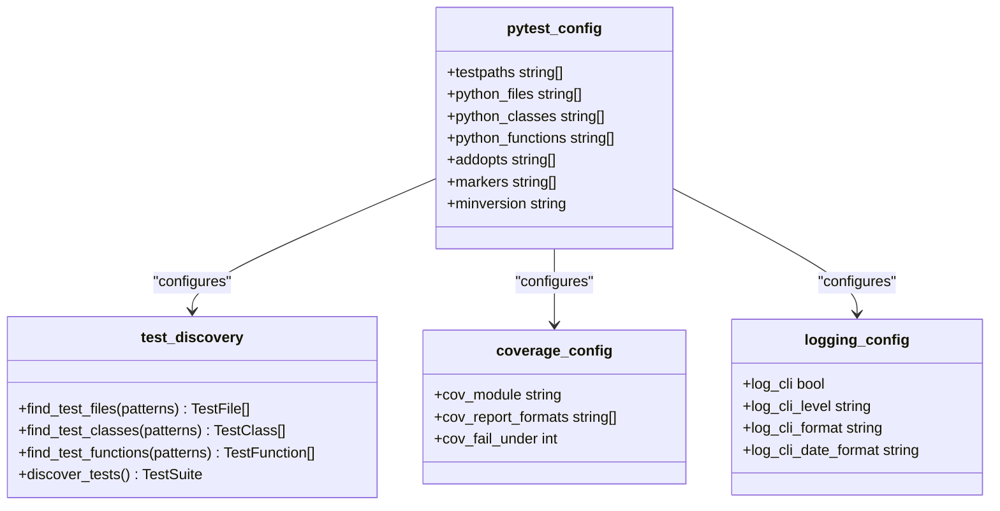
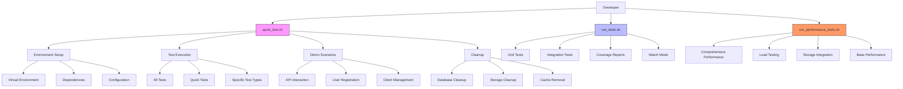
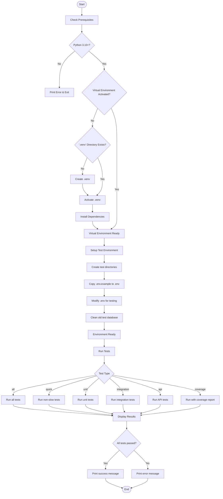
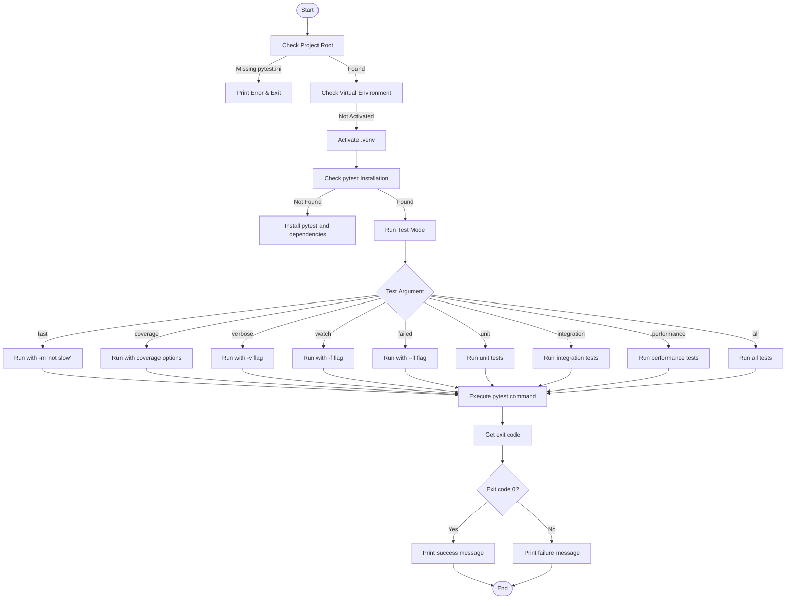
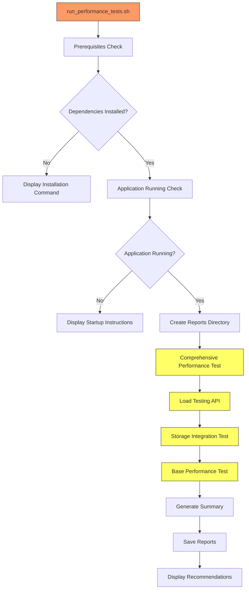

# Testing Tools and Automation Scripts

<cite>
**Referenced Files in This Document**   
- [pytest.ini](file://pytest.ini)
- [scripts/quick_test.sh](file://scripts/quick_test.sh)
- [test_files/run_tests.sh](file://test_files/run_tests.sh)
- [test_files/run_performance_tests.sh](file://test_files/run_performance_tests.sh)
- [test_files/conftest.py](file://test_files/conftest.py)
- [test_files/unit/test_api.py](file://test_files/unit/test_api.py)
- [test_files/unit/test_auth.py](file://test_files/unit/test_auth.py)
- [test_files/integration/test_api_endpoints.py](file://test_files/integration/test_api_endpoints.py)
- [test_files/integration/test_backup_system.py](file://test_files/integration/test_backup_system.py)
- [test_files/performance/test_performance.py](file://test_files/performance/test_performance.py)
- [test_files/performance/test_comprehensive_performance.py](file://test_files/performance/test_comprehensive_performance.py)
- [vertex-ar/requirements-dev.txt](file://vertex-ar/requirements-dev.txt)
</cite>

## Table of Contents
1. [Introduction](#introduction)
2. [Test Configuration with pytest.ini](#test-configuration-with-pytestini)
3. [Automation Scripts Overview](#automation-scripts-overview)
4. [quick_test.sh Script Analysis](#quick_testsh-script-analysis)
5. [run_tests.sh Script Analysis](#run_testssh-script-analysis)
6. [Performance Testing Scripts](#performance-testing-scripts)
7. [Test Organization and Structure](#test-organization-and-structure)
8. [Usage Examples for Development Workflows](#usage-examples-for-development-workflows)
9. [Troubleshooting Common Issues](#troubleshooting-common-issues)
10. [Conclusion](#conclusion)

## Introduction

The Vertex AR project employs a comprehensive testing framework designed to ensure code quality, functionality, and performance across various components of the application. This documentation details the testing tools and automation scripts that form the backbone of the project's quality assurance process. The testing infrastructure is built around pytest, the standard testing framework for Python applications, with extensive configuration and automation scripts that streamline test execution, environment setup, and result reporting.

The testing ecosystem includes multiple scripts that cater to different testing needs and development workflows. The primary automation scripts—`quick_test.sh` and `run_tests.sh`—provide developers with convenient interfaces to execute various test suites, from quick unit tests to comprehensive integration tests. These scripts handle environment setup, dependency management, and test orchestration, reducing the cognitive load on developers and ensuring consistent test execution across different development environments.

At the core of the testing configuration is the `pytest.ini` file, which defines critical settings for test discovery, coverage requirements, logging, and test categorization through markers. This centralized configuration ensures that all test runs adhere to the project's quality standards, including a minimum 70% code coverage threshold. The test suite is organized into logical categories—unit, integration, and performance tests—allowing for targeted test execution based on development needs.

This documentation will explore the configuration and functionality of these testing tools, providing detailed insights into how they enable efficient development workflows, ensure code quality, and support the project's continuous integration and delivery processes.

## Test Configuration with pytest.ini

The `pytest.ini` file serves as the central configuration point for the testing framework in the Vertex AR project, defining essential settings that govern test discovery, execution, reporting, and quality standards. This configuration file ensures consistency across all test runs and enforces the project's quality requirements.

The test discovery rules are explicitly defined in the configuration, specifying the patterns for identifying test files, classes, and functions. The `python_files` directive is set to `test_*..py *_test.py`, which means pytest will discover any Python files that start with "test_" or end with "_test.py". This pattern ensures comprehensive test discovery while maintaining a clear naming convention. For test classes, the `python_classes` directive is configured to `Test*`, meaning any class that starts with "Test" will be recognized as a test class. Similarly, the `python_functions` directive is set to `test_*`, identifying any function that starts with "test_" as a test function. These discovery rules are fundamental to pytest's ability to automatically locate and execute tests without requiring explicit test suite definitions.



**Diagram sources**
- [pytest.ini](file://pytest.ini#L4-L7)

**Section sources**
- [pytest.ini](file://pytest.ini#L1-L70)

The configuration establishes a minimum code coverage requirement of 70%, which is enforced through the `--cov-fail-under=70` option in the `addopts` directive. This setting ensures that the test suite must achieve at least 70% code coverage to pass, promoting thorough testing practices. Coverage is measured for the `vertex-ar/app` module, as specified by the `--cov=vertex-ar/app` option, and reported in both terminal output with missing lines highlighted (`--cov-report=term-missing`) and as an HTML report (`--cov-report=html:htmlcov`). This dual reporting approach provides developers with immediate feedback in the terminal while also generating a detailed, navigable HTML report for deeper analysis.

Logging is comprehensively configured to provide detailed insights into test execution. The `log_cli` option is enabled, allowing test-level logging to be displayed on the command line. The logging level is set to INFO, ensuring that important diagnostic information is captured without overwhelming verbosity. A custom log format is defined as `%(asctime)s [%(levelname)8s] %(name)s: %(message)s`, which includes timestamps, log levels, logger names, and messages, making it easier to trace the source and context of log entries. The date format is standardized to `YYYY-MM-DD HH:MM:SS` for consistency and readability.

The configuration also defines a rich set of markers for test categorization, enabling selective execution of test suites. These markers include `unit` for unit tests, `integration` for integration tests, `slow` for time-consuming tests, `api` for API endpoint tests, `storage` for storage-related tests, `auth` for authentication tests, `nft` for NFT-related functionality, `ar` for AR-specific features, `admin` for admin panel tests, `security` for security tests, and `performance` for performance tests. These markers allow developers to run specific subsets of tests using the `-m` flag, such as running all non-slow tests with `-m "not slow"` or executing only API tests with `-m "api"`.

Additional configuration options enhance the testing experience and reliability. The `--strict-markers` option ensures that only the defined markers can be used, preventing typos and enforcing consistency. Colorized output is enabled with `--color=yes`, improving readability of test results. The test duration of the 10 slowest tests is reported with `--durations=10`, helping identify performance bottlenecks. Warning filters are configured to ignore certain expected warnings, reducing noise in the test output while still capturing potentially problematic warnings. The configuration also sets a timeout of 300 seconds for individual tests and enables asyncio mode for testing asynchronous code, reflecting the project's use of asynchronous programming patterns.

## Automation Scripts Overview

The Vertex AR project employs a suite of automation scripts designed to streamline testing workflows and reduce the complexity of test execution for developers. These scripts abstract away the intricacies of environment setup, dependency management, and test orchestration, providing simple, intuitive interfaces for running various test suites. The primary automation scripts—`quick_test.sh`, `run_tests.sh`, and `run_performance_tests.sh`—serve different purposes and cater to various development scenarios, from quick local testing to comprehensive performance evaluation.

The automation scripts are strategically organized within the project structure, with `quick_test.sh` located in the `scripts` directory and `run_tests.sh` in the `test_files` directory. This organization reflects their different roles and target audiences. The `quick_test.sh` script is designed as a comprehensive tool for developers, offering a wide range of functionality beyond simple test execution, including environment setup, demonstration scenarios, and cleanup operations. In contrast, `run_tests.sh` serves as a more focused test runner, primarily concerned with executing test suites with various options. This separation of concerns allows each script to specialize in its particular domain while providing a cohesive testing experience.



**Diagram sources**
- [scripts/quick_test.sh](file://scripts/quick_test.sh#L1-L372)
- [test_files/run_tests.sh](file://test_files/run_tests.sh#L1-L103)
- [test_files/run_performance_tests.sh](file://test_files/run_performance_tests.sh#L1-L91)

**Section sources**
- [scripts/quick_test.sh](file://scripts/quick_test.sh#L1-L372)
- [test_files/run_tests.sh](file://test_files/run_tests.sh#L1-L103)
- [test_files/run_performance_tests.sh](file://test_files/run_performance_tests.sh#L1-L91)

The scripts share a common goal of simplifying the testing process, but they achieve this through different approaches and feature sets. `quick_test.sh` takes a holistic approach, functioning as a complete testing environment manager that handles everything from prerequisites checking to test execution and cleanup. It includes sophisticated error handling and user-friendly output with colorized messages, making it particularly valuable for new developers setting up their environment or for troubleshooting test failures. The script's ability to automatically detect and resolve common issues, such as missing virtual environments or dependencies, significantly reduces the barrier to entry for contributing to the project.

In contrast, `run_tests.sh` focuses on providing a flexible interface for test execution with various options tailored to different development workflows. It supports multiple execution modes, including fast testing (excluding slow tests), verbose output, watch mode for continuous testing, and failed test re-execution. This script is optimized for experienced developers who need to run specific test configurations as part of their regular development cycle. Its straightforward design and clear option structure make it easy to integrate into development workflows and continuous integration pipelines.

The automation scripts also demonstrate a thoughtful approach to user experience and developer productivity. Both scripts provide clear, informative output with color-coded status messages that make it easy to quickly assess the results of test runs. They include comprehensive help information that lists available options and their purposes, reducing the need for developers to consult documentation or examine script internals. The scripts are designed to be idempotent, meaning they can be safely run multiple times without causing issues, which is particularly important for the environment setup and cleanup operations.

## quick_test.sh Script Analysis

The `quick_test.sh` script is a comprehensive automation tool designed to streamline the testing process for the Vertex AR project, providing developers with a single interface for environment setup, test execution, demonstration scenarios, and cleanup operations. This script goes beyond simple test running by incorporating sophisticated environment management and user-friendly features that significantly enhance developer productivity and reduce the complexity of working with the project.

The script begins with a robust prerequisites checking function that ensures the testing environment is properly configured before proceeding with any operations. It verifies the Python version, requiring Python 3.10 or higher, which is essential for compatibility with the project's dependencies and language features. If the virtual environment is not activated, the script automatically detects whether a `.venv` directory exists and either activates the existing environment or creates a new one. This automatic environment management is particularly valuable for new developers or those working on multiple projects with different dependency requirements. The script also checks for the presence of pytest and installs the project's development dependencies from `vertex-ar/requirements-dev.txt` if necessary, ensuring that all required packages are available.



**Diagram sources**
- [scripts/quick_test.sh](file://scripts/quick_test.sh#L68-L109)

**Section sources**
- [scripts/quick_test.sh](file://scripts/quick_test.sh#L1-L372)

The test environment setup function creates essential directories for testing, including `test_storage`, `test_files`, and `logs`, ensuring that tests have the necessary file system structure. It also handles configuration by copying the `.env.example` file to `.env` if it doesn't already exist and modifying key settings to be more test-friendly, such as enabling debug mode and disabling rate limiting. This automated configuration management ensures consistency across different development environments and reduces the risk of configuration-related test failures.

The script supports multiple test execution modes through a flexible command-line interface. Developers can specify the type of tests to run using the first argument, with options including "all" for all tests, "quick" for non-slow tests, "unit" for unit tests only, "integration" for integration tests only, "api" for API tests only, "coverage" for tests with coverage reporting, and "demo" for interactive demonstration scenarios. The "quick" mode is particularly useful during development, as it excludes slow tests marked with the `slow` marker, allowing for faster feedback cycles. The "coverage" mode generates both terminal and HTML coverage reports, with the script even attempting to automatically open the HTML report in the default web browser when possible.

One of the most distinctive features of `quick_test.sh` is its demonstration mode, which provides an interactive walkthrough of key application functionality. When run with the "demo" argument, the script starts the application server, registers a test user, logs in, retrieves the user profile, creates a client, and lists all clients, all through API calls. This mode serves multiple purposes: it verifies that the application's core functionality works correctly, provides a ready-made example of API usage, and gives developers immediate feedback on the application's state. The script maintains the server process and provides instructions for accessing the API and Swagger UI, making it an excellent tool for onboarding new team members or demonstrating the application's capabilities.

The script also includes a comprehensive cleanup function that removes test artifacts, including test databases, storage directories, pytest cache, coverage reports, and log files. This ensures that subsequent test runs start with a clean slate, preventing potential issues from leftover files. The cleanup function can be executed independently by running the script with the "clean" argument, giving developers fine-grained control over their testing environment. The script's error handling is robust, with the `set -e` directive ensuring that it exits immediately if any command fails, preventing the execution of subsequent steps that might depend on the successful completion of previous ones.

## run_tests.sh Script Analysis

The `run_tests.sh` script serves as a streamlined test runner for the Vertex AR project, providing a simple interface for executing various test configurations with minimal overhead. Unlike the more comprehensive `quick_test.sh` script, `run_tests.sh` focuses specifically on test execution, making it ideal for integration into development workflows and continuous integration pipelines where environment setup has already been handled.

The script begins with basic validation to ensure it is being executed from the project root directory by checking for the presence of the `pytest.ini` file. This simple check prevents common errors that occur when the script is run from the wrong directory. It then verifies whether a virtual environment is activated and automatically activates the `.venv` environment if it exists but is not currently active. This lightweight environment management ensures that tests run with the correct dependencies without requiring the more extensive setup performed by `quick_test.sh`.



**Diagram sources**
- [test_files/run_tests.sh](file://test_files/run_tests.sh#L28-L45)

**Section sources**
- [test_files/run_tests.sh](file://test_files/run_tests.sh#L1-L103)

The script supports a variety of test execution modes through command-line arguments, allowing developers to tailor test runs to their specific needs. The "fast" mode runs tests with the `not slow` marker excluded, providing quick feedback during development. The "coverage" mode executes tests with coverage reporting enabled, generating both terminal output with missing lines and an HTML report in the `htmlcov` directory. The "verbose" mode increases pytest's verbosity with the `-v` flag, providing more detailed output about test execution. These modes reflect common development workflows and allow developers to balance speed and detail based on their current task.

Additional execution modes cater to specific development scenarios. The "watch" mode runs tests in file change detection mode using pytest's `-f` flag, automatically re-running tests when source files are modified. This is particularly useful during active development, as it provides immediate feedback on code changes without requiring manual test execution. The "failed" mode runs only the tests that failed in the previous run using the `--lf` flag, allowing developers to focus on fixing specific issues without re-running the entire test suite. These specialized modes demonstrate the script's focus on developer productivity and efficient workflows.

The script also provides dedicated modes for running specific test categories, including "unit" for unit tests, "integration" for integration tests, and "performance" for performance tests. This selective execution capability allows developers to focus on specific areas of the codebase when working on particular features or fixing bugs. For example, a developer working on a new API endpoint can run only the integration tests to quickly verify their changes without waiting for the entire test suite to complete.

The script's output is designed to be clear and informative, with color-coded status messages that make it easy to quickly assess the results of test runs. After executing the tests, the script captures the exit code from pytest and provides a summary message indicating whether all tests passed or some failed. This simple feedback mechanism helps developers quickly understand the outcome of their test runs. The script then exits with the same code as pytest, ensuring proper integration with other tools and scripts that might call it.

## Performance Testing Scripts

The Vertex AR project includes specialized scripts for performance testing, designed to evaluate the application's behavior under various load conditions and identify potential performance bottlenecks. The primary performance testing script, `run_performance_tests.sh`, orchestrates a comprehensive suite of performance evaluations that cover multiple aspects of the application's functionality and resource usage.

The `run_performance_tests.sh` script is implemented in Bash and follows a structured approach to performance testing, executing a series of discrete test phases that evaluate different aspects of the application's performance. The script begins with prerequisite checking, verifying the presence of essential dependencies such as psutil, requests, and Pillow, which are required for system monitoring and HTTP operations. If any dependencies are missing, the script provides clear instructions for installation, ensuring that performance tests can be executed reliably across different environments.



**Diagram sources**
- [test_files/run_performance_tests.sh](file://test_files/run_performance_tests.sh#L1-L91)

**Section sources**
- [test_files/run_performance_tests.sh](file://test_files/run_performance_tests.sh#L1-L91)

The script executes four main performance test categories, each focusing on a different aspect of the application's performance. The first test, "Comprehensive Performance with psutil," evaluates the application's resource usage under load, monitoring CPU, memory, disk I/O, and network usage during test execution. This test uses the psutil library to collect detailed system metrics, providing insights into how the application utilizes system resources and identifying potential memory leaks or excessive CPU usage.

The second test, "Load Testing API Portraits," assesses the application's ability to handle concurrent requests and high load. This test simulates multiple concurrent users accessing the API endpoints for portrait management, measuring response times, error rates, and system stability under stress. The results help identify scalability issues and ensure that the application can handle expected production loads.

The third test, "Storage Integration Testing," evaluates the performance of the application's storage subsystem, comparing the performance of different storage backends such as MinIO and local storage. This test measures upload and download speeds, latency, and reliability, ensuring that the storage infrastructure meets performance requirements and identifying any bottlenecks in data transfer operations.

The fourth test, "Base Performance Testing," focuses on fundamental performance metrics such as large file upload speed, multiple file upload efficiency, and application responsiveness under typical usage patterns. This test provides a baseline measurement of the application's performance characteristics and helps track performance improvements or regressions over time.

The script generates detailed reports for each test, saving them in a dedicated `performance_reports` directory with timestamps in the filenames. These reports include JSON files with raw performance data, making it easy to analyze results programmatically or visualize them in external tools. After completing all tests, the script provides a comprehensive summary of the results and recommendations for further analysis, such as checking the generated reports for memory leaks or comparing the performance of different storage solutions.

Complementing the orchestration script, the project includes detailed performance test implementations in Python files such as `test_performance.py` and `test_comprehensive_performance.py`. These test files contain specific test cases that evaluate various performance aspects, including large file uploads, multiple file uploads, application performance under load, and memory and CPU usage. The tests use pytest's framework to structure the performance evaluations and provide clear pass/fail criteria based on performance thresholds.

## Test Organization and Structure

The Vertex AR project follows a well-organized test structure that categorizes tests by type and functionality, making it easy to locate and execute specific test suites. The tests are organized into three main directories within the `test_files` directory: `unit`, `integration`, and `performance`, each containing tests that serve different purposes in the testing hierarchy.

The unit tests, located in the `test_files/unit` directory, focus on testing individual components and functions in isolation. These tests verify the correctness of specific functions, classes, and methods without involving external dependencies or complex system interactions. For example, the `test_auth.py` file contains unit tests for the authentication module, testing functions like password hashing and verification, as well as classes like `TokenManager` and `AuthSecurityManager`. These tests use pytest fixtures to set up test data and mock external dependencies, ensuring that each test focuses on a single unit of functionality. The unit tests are designed to be fast and reliable, providing immediate feedback on code changes.


**Diagram sources**
- [test_files/unit](file://test_files/unit)
- [test_files/integration](file://test_files/integration)
- [test_files/performance](file://test_files/performance)

**Section sources**
- [test_files/unit/test_api.py](file://test_files/unit/test_api.py#L1-L434)
- [test_files/unit/test_auth.py](file://test_files/unit/test_auth.py#L1-L266)
- [test_files/integration/test_api_endpoints.py](file://test_files/integration/test_api_endpoints.py#L1-L400)
- [test_files/integration/test_backup_system.py](file://test_files/integration/test_backup_system.py#L1-L468)
- [test_files/performance/test_performance.py](file://test_files/performance/test_performance.py#L1-L351)
- [test_files/performance/test_comprehensive_performance.py](file://test_files/performance/test_comprehensive_performance.py#L1-L529)

The integration tests, located in the `test_files/integration` directory, verify the interaction between different components and systems. These tests exercise the application's API endpoints, database interactions, and external service integrations, ensuring that the various parts of the system work together correctly. For example, the `test_api_endpoints.py` file contains integration tests that verify the functionality of various API endpoints, including health checks, authentication, AR content management, and admin panel features. These tests use the FastAPI TestClient to make actual HTTP requests to the application, simulating real-world usage patterns.

The performance tests, located in the `test_files/performance` directory, focus on evaluating the application's behavior under various load conditions and identifying performance bottlenecks. These tests measure response times, resource usage, and scalability, providing insights into how the application performs under different scenarios. The `test_performance.py` file contains tests for large file uploads, multiple file uploads, and application performance under load, while `test_comprehensive_performance.py` includes more advanced performance testing with system monitoring using psutil.

The test files share a common structure, with each file containing multiple test classes or functions that group related tests together. The tests use pytest fixtures to set up and tear down test environments, ensuring that each test runs in a clean, isolated context. The `conftest.py` file in the `test_files` directory contains shared fixtures and configuration that are available to all test files, promoting code reuse and consistency across the test suite.

The tests are categorized using pytest markers defined in the `pytest.ini` file, allowing for selective execution of test suites. The markers include `unit`, `integration`, `slow`, `api`, `storage`, `auth`, `nft`, `ar`, `admin`, `security`, and `performance`, enabling developers to run specific subsets of tests based on their needs. This categorization supports efficient development workflows, allowing developers to focus on relevant tests when working on specific features or fixing bugs.

## Usage Examples for Development Workflows

The testing tools and automation scripts in the Vertex AR project support a variety of development workflows, providing developers with flexible options for testing their code at different stages of development. These workflows range from quick feedback during active development to comprehensive testing before code submission, ensuring that code quality is maintained throughout the development process.

For quick feedback during active development, developers can use the "quick" mode of the `quick_test.sh` script to run non-slow tests. This mode executes all tests except those marked with the `slow` marker, providing fast feedback on code changes without waiting for time-consuming tests to complete. To use this mode, developers simply run:

```bash
./scripts/quick_test.sh quick
```

This command checks prerequisites, sets up the test environment if necessary, and runs all tests except slow ones, providing immediate feedback on whether recent changes have introduced any regressions. This workflow is particularly useful during the coding phase when developers are making frequent changes and need rapid feedback.

When working on specific features or fixing bugs, developers can run targeted test suites using the appropriate test mode. For example, when developing a new API endpoint, a developer can run only the integration tests to verify their changes:

```bash
./scripts/quick_test.sh integration
```

Similarly, when working on authentication functionality, a developer can run only the unit tests for the authentication module:

```bash
python -m pytest test_files/unit/test_auth.py -v
```

This targeted testing approach allows developers to focus on relevant tests and receive faster feedback, improving productivity and reducing the time spent waiting for test results.

For comprehensive testing before code submission, developers can run the full test suite with coverage reporting to ensure that their changes are thoroughly tested and meet the project's quality standards. This can be done using the "coverage" mode of the `quick_test.sh` script:

```bash
./scripts/quick_test.sh coverage
```

This command runs all tests and generates a coverage report in the `htmlcov` directory, including an HTML report that can be opened in a web browser for detailed analysis. The coverage requirement of 70% ensures that the code is adequately tested, and the HTML report highlights any lines that are not covered by tests, helping developers identify areas that need additional test coverage.

Developers can also generate HTML coverage reports using the `run_tests.sh` script:

```bash
./test_files/run_tests.sh coverage
```

This command produces the same coverage report, providing an alternative interface for developers who prefer to use the simpler test runner. The HTML report includes detailed information about which lines are covered by tests and which are not, making it easy to identify untested code paths.

For performance testing, developers can run the comprehensive performance test suite:

```bash
./test_files/run_performance_tests.sh
```

This command executes all performance tests, including comprehensive performance testing with system monitoring, load testing of API endpoints, storage integration testing, and base performance testing. The results are saved in the `performance_reports` directory, allowing developers to analyze performance characteristics and identify potential bottlenecks.

When troubleshooting test failures, developers can use the verbose output mode to get more detailed information about test execution:

```bash
./test_files/run_tests.sh verbose
```

This command runs all tests with increased verbosity, providing detailed output about each test's execution. For even more detailed information, developers can use pytest directly with the `-vv` flag:

```bash
python -m pytest test_files -vv
```

This level of verbosity is particularly useful for diagnosing intermittent test failures or understanding the sequence of operations in complex integration tests.

The scripts also support watch mode for continuous testing during active development:

```bash
./test_files/run_tests.sh watch
```

This command runs tests in file change detection mode, automatically re-running tests when source files are modified. This workflow provides immediate feedback on code changes, allowing developers to quickly verify that their changes have the intended effect and haven't introduced any regressions.

## Troubleshooting Common Issues

When working with the testing tools and automation scripts in the Vertex AR project, developers may encounter various issues that prevent successful test execution. Understanding these common problems and their solutions is essential for maintaining productivity and ensuring that the testing process runs smoothly.

One of the most common issues is missing dependencies, which can occur when the virtual environment is not properly set up or when dependencies have not been installed. This typically manifests as import errors or "command not found" messages when running the test scripts. To resolve this issue, developers should ensure that they are in the project root directory and that the virtual environment is activated. If the virtual environment does not exist, it can be created and activated with:

```bash
python -m venv .venv
source .venv/bin/activate  # On Windows: .venv\Scripts\activate
pip install -r vertex-ar/requirements-dev.txt
```

The `quick_test.sh` script automatically handles dependency installation, so running `./scripts/quick_test.sh` will typically resolve missing dependency issues by installing the required packages from `requirements-dev.txt`.

Another common issue is incorrect Python paths, which can occur when the Python interpreter cannot find the project modules. This is often indicated by import errors when running tests. The root cause is typically that the project root and `vertex-ar` directories are not in the Python path. This issue is addressed by the `conftest.py` file, which adds the necessary paths to `sys.path` when pytest discovers the file. However, if tests are run directly without using pytest's discovery mechanism, the paths may not be set correctly. The solution is to always run tests from the project root directory using the provided scripts or pytest commands that will automatically discover and execute `conftest.py`.

Database-related issues are another frequent source of test failures, particularly when test databases from previous runs interfere with current tests. The `quick_test.sh` script addresses this by cleaning old test databases during the setup phase, but developers may still encounter issues if tests are interrupted or if multiple test runs are executed simultaneously. To resolve database issues, developers can manually remove test database files:

```bash
rm test_app_data.db app_data.db
```

Alternatively, they can use the cleanup functionality provided by the `quick_test.sh` script:

```bash
./scripts/quick_test.sh clean
```

This command removes all test artifacts, including databases, storage directories, and cache files, ensuring a clean state for subsequent test runs.

Permission issues can occur when the scripts do not have execute permissions, resulting in "Permission denied" errors when attempting to run them. This can be resolved by setting the appropriate execute permissions:

```bash
chmod +x scripts/quick_test.sh
chmod +x test_files/run_tests.sh
```

On Windows systems, this issue is less common, but developers may need to ensure that their terminal has the necessary permissions to execute scripts.

Environment variable issues can also cause test failures, particularly when required configuration values are missing or incorrect. The `quick_test.sh` script addresses this by creating a `.env` file from the `.env.example` template and setting test-friendly defaults. However, if the `.env` file becomes corrupted or contains incorrect values, tests may fail. Developers can resolve this by removing the `.env` file and allowing the script to recreate it:

```bash
rm .env
./scripts/quick_test.sh setup
```

This ensures that the environment configuration is reset to known good defaults.

When performance tests fail due to missing dependencies, developers should install the required packages:

```bash
pip install psutil requests pillow minio memory-profiler
```

These packages are required for system monitoring, HTTP operations, image processing, object storage, and memory profiling, respectively. The `run_performance_tests.sh` script checks for these dependencies and provides installation instructions if they are missing.

For issues related to the application not running when performance tests are executed, developers should ensure that the application is started before running the performance tests:

```bash
cd vertex-ar
uvicorn app.main:app --host 127.0.0.1 --port 8000
```

Alternatively, they can use the demo mode of `quick_test.sh`, which starts the application as part of its execution:

```bash
./scripts/quick_test.sh demo
```

By understanding these common issues and their solutions, developers can quickly resolve problems that arise during testing, minimizing downtime and maintaining a smooth development workflow.

## Conclusion

The testing tools and automation scripts in the Vertex AR project form a comprehensive and well-integrated system that supports efficient development workflows and ensures high code quality. The combination of pytest configuration, specialized test scripts, and organized test structure provides developers with powerful tools for verifying the correctness, performance, and reliability of the application.

The `pytest.ini` configuration file establishes a solid foundation for the testing process, defining clear rules for test discovery, enforcing a minimum 70% code coverage requirement, and providing a rich set of markers for test categorization. This centralized configuration ensures consistency across all test runs and promotes thorough testing practices. The logging configuration provides detailed insights into test execution, while the warning filters reduce noise in the test output, making it easier to focus on relevant information.

The automation scripts—`quick_test.sh`, `run_tests.sh`, and `run_performance_tests.sh`—complement the pytest configuration by providing user-friendly interfaces for test execution and environment management. `quick_test.sh` serves as a comprehensive tool that handles everything from prerequisites checking to test execution and cleanup, making it particularly valuable for new developers or for troubleshooting test failures. `run_tests.sh` provides a more focused interface for test execution with various options tailored to different development workflows, while `run_performance_tests.sh` orchestrates comprehensive performance evaluations that assess the application's behavior under various load conditions.

The test organization into unit, integration, and performance categories supports efficient development workflows, allowing developers to run targeted test suites based on their current task. The use of pytest markers enables selective execution of test suites, such as running non-slow tests for quick feedback or executing only API tests when working on endpoint functionality. This flexibility supports both rapid development cycles and thorough testing before code submission.

The provided usage examples demonstrate how these tools can be integrated into various development workflows, from quick feedback during active development to comprehensive testing with coverage reporting. The troubleshooting section addresses common issues that developers may encounter, providing solutions for problems related to missing dependencies, incorrect Python paths, database issues, and permission problems.

Together, these testing tools and automation scripts create a robust testing ecosystem that promotes code quality, reduces the barrier to entry for new developers, and supports efficient development workflows. By leveraging these tools effectively, developers can ensure that the Vertex AR project maintains high standards of quality and reliability throughout its development lifecycle.