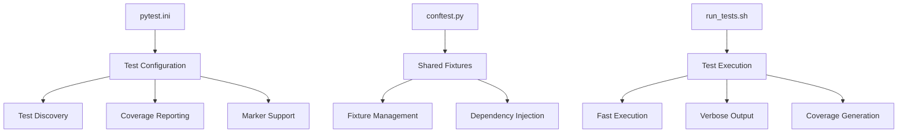
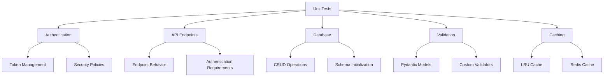
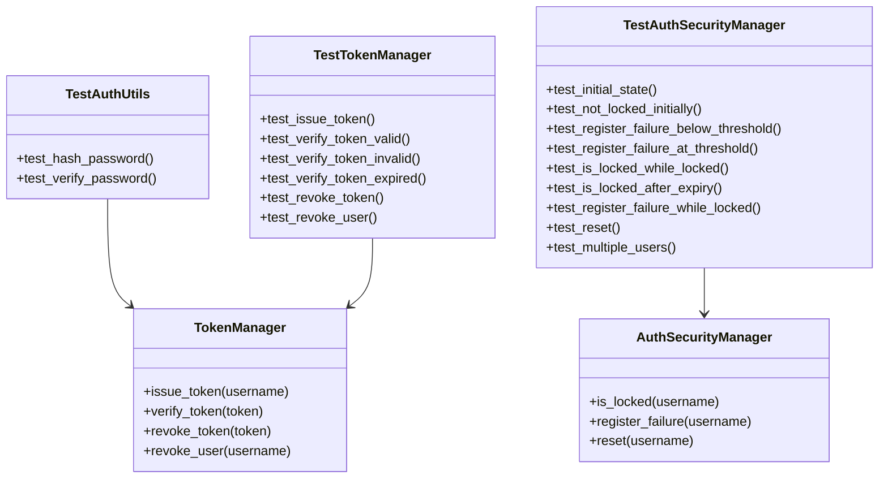
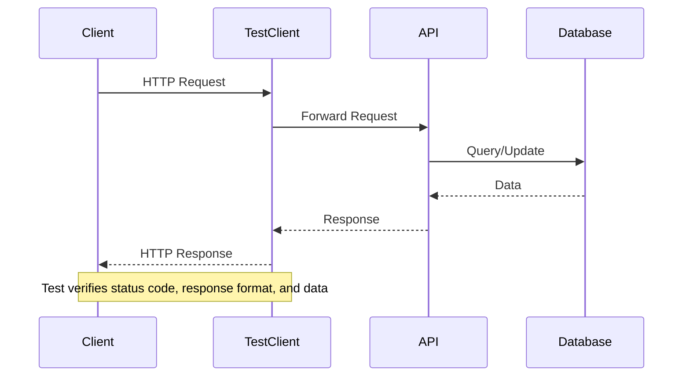
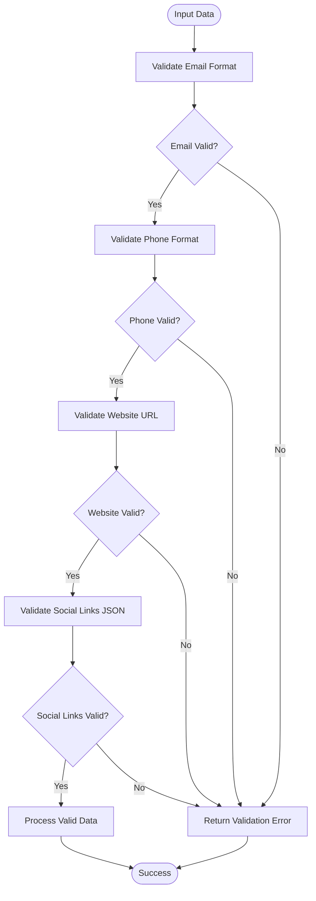
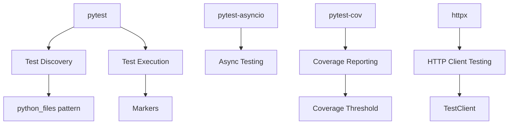

# Unit Testing

<cite>
**Referenced Files in This Document**   
- [test_auth.py](file://test_files/unit/test_auth.py)
- [test_models.py](file://test_files/unit/test_models.py)
- [test_api.py](file://test_files/unit/test_api.py)
- [test_database.py](file://test_files/unit/test_database.py)
- [test_company_validators.py](file://test_files/unit/test_company_validators.py)
- [test_cache.py](file://test_files/unit/test_cache.py)
- [conftest.py](file://test_files/conftest.py)
- [pytest.ini](file://pytest.ini)
- [run_tests.sh](file://test_files/run_tests.sh)
- [auth.py](file://vertex-ar/app/auth.py)
- [utils.py](file://vertex-ar/app/utils.py)
</cite>

## Table of Contents
1. [Introduction](#introduction)
2. [Unit Testing Framework](#unit-testing-framework)
3. [Core Components](#core-components)
4. [Architecture Overview](#architecture-overview)
5. [Detailed Component Analysis](#detailed-component-analysis)
6. [Dependency Analysis](#dependency-analysis)
7. [Performance Considerations](#performance-considerations)
8. [Troubleshooting Guide](#troubleshooting-guide)
9. [Conclusion](#conclusion)

## Introduction
The Vertex AR project implements a comprehensive unit testing strategy to ensure the reliability and correctness of individual components. Unit tests are designed to isolate and validate specific functionality within the application, including API endpoints, data models, service functions, and business logic. The testing framework leverages pytest with custom markers and fixture-based setup through conftest.py to provide a consistent and maintainable testing environment. This documentation details the unit testing approach, covering test organization, execution workflows, and specific implementation patterns observed in the codebase.

## Unit Testing Framework

The unit testing framework in the Vertex AR project is built on pytest, with configuration managed through pytest.ini and shared fixtures in conftest.py. The framework supports test discovery, coverage reporting, and various execution modes optimized for different development scenarios.

**Diagram sources**
- [pytest.ini](file://pytest.ini)
- [conftest.py](file://test_files/conftest.py)
- [run_tests.sh](file://test_files/run_tests.sh)

**Section sources**
- [pytest.ini](file://pytest.ini)
- [conftest.py](file://test_files/conftest.py)
- [run_tests.sh](file://test_files/run_tests.sh)

## Core Components

The unit testing infrastructure in Vertex AR focuses on several core components, each with specific testing requirements and patterns. These include authentication mechanisms, API endpoints, database operations, data validation, and caching functionality. The tests are organized in the test_files/unit directory and follow a consistent structure across different components.

**Section sources**
- [test_auth.py](file://test_files/unit/test_auth.py)
- [test_api.py](file://test_files/unit/test_api.py)
- [test_database.py](file://test_files/unit/test_database.py)
- [test_company_validators.py](file://test_files/unit/test_company_validators.py)
- [test_cache.py](file://test_files/unit/test_cache.py)

## Architecture Overview

The unit testing architecture in Vertex AR follows a layered approach with clear separation between test types and execution contexts. The framework supports both synchronous and asynchronous testing, with appropriate fixtures and configuration for each scenario.

**Diagram sources**
- [test_auth.py](file://test_files/unit/test_auth.py)
- [test_api.py](file://test_files/unit/test_api.py)
- [test_database.py](file://test_files/unit/test_database.py)
- [test_company_validators.py](file://test_files/unit/test_company_validators.py)
- [test_cache.py](file://test_files/unit/test_cache.py)

## Detailed Component Analysis

### Authentication Testing
The authentication component is thoroughly tested to validate token management, password hashing, and security policies. Tests verify the correct behavior of token issuance, verification, and revocation, as well as password hashing and verification functions.

**Diagram sources**
- [test_auth.py](file://test_files/unit/test_auth.py)
- [auth.py](file://vertex-ar/app/auth.py)
- [utils.py](file://vertex-ar/app/utils.py)

**Section sources**
- [test_auth.py](file://test_files/unit/test_auth.py)
- [auth.py](file://vertex-ar/app/auth.py)
- [utils.py](file://vertex-ar/app/utils.py)

### API Endpoint Testing
API endpoints are tested using FastAPI's TestClient to validate request handling, response formats, and authentication requirements. The tests cover various HTTP methods, status codes, and data validation scenarios.

**Diagram sources**
- [test_api.py](file://test_files/unit/test_api.py)

**Section sources**
- [test_api.py](file://test_files/unit/test_api.py)

### Data Validation Testing
Data validation tests focus on Pydantic models and custom validators, ensuring that input data meets specified requirements. The tests validate email addresses, phone numbers, URLs, and JSON structures for social links.

**Diagram sources**
- [test_company_validators.py](file://test_files/unit/test_company_validators.py)

**Section sources**
- [test_company_validators.py](file://test_files/unit/test_company_validators.py)

## Dependency Analysis

The unit testing framework has several key dependencies that enable its functionality. These include pytest for test discovery and execution, pytest-asyncio for asynchronous testing, pytest-cov for coverage reporting, and httpx for HTTP client testing.

**Diagram sources**
- [pytest.ini](file://pytest.ini)
- [run_tests.sh](file://test_files/run_tests.sh)

**Section sources**
- [pytest.ini](file://pytest.ini)
- [run_tests.sh](file://test_files/run_tests.sh)

## Performance Considerations

The unit testing framework is designed for fast execution, with tests running in isolated environments using temporary databases. The run_tests.sh script provides options for fast execution, verbose output, and coverage reporting, allowing developers to choose the appropriate mode for their needs.

**Section sources**
- [run_tests.sh](file://test_files/run_tests.sh)

## Troubleshooting Guide

When encountering issues with unit tests, consider the following common problems and solutions:

1. **Virtual Environment Not Activated**: Ensure the virtual environment is activated before running tests.
2. **Missing Dependencies**: Install required packages using pip3 install pytest pytest-asyncio pytest-cov pytest-mock httpx.
3. **Test Path Issues**: Run tests from the project root directory to ensure correct path resolution.
4. **Database Connection Problems**: Verify that the temporary database path is writable and accessible.
5. **Authentication Failures**: Check that authentication headers are correctly set in test requests.

**Section sources**
- [run_tests.sh](file://test_files/run_tests.sh)

## Conclusion

The unit testing framework in the Vertex AR project provides a robust and comprehensive approach to validating individual components. By leveraging pytest with custom configuration and shared fixtures, the framework ensures consistent test execution and reliable results. The tests cover critical functionality including authentication, API endpoints, data validation, and database operations, providing confidence in the correctness and reliability of the application. The framework's design supports fast execution, clear organization, and easy maintenance, making it an essential part of the development workflow.