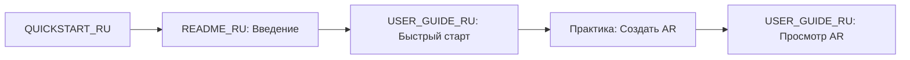

# 📚 Индекс русскоязычной документации Vertex AR

## Добро пожаловать!

Это полный индекс документации проекта Vertex AR на русском языке.

**Общий объем:** ~6,700 строк документации  
**Время на изучение:** ~3.5 часа  
**Версия:** 1.0.0

---

## 🚀 Быстрый старт

### Для новых пользователей - начните здесь:

**1. [QUICKSTART_RU.md](./QUICKSTART_RU.md)** ⚡ *10 минут*
```
🎯 Цель: Запустить приложение и создать первый AR-контент за 5 минут

Содержание:
• Установка за 3 команды
• Первый запуск
• Создание AR-контента
• Просмотр на смартфоне

📱 Результат: Работающий AR-контент на вашем устройстве
```

---

## 📖 Полная документация

### 1. Общая документация

**[README_RU.md](./README_RU.md)** 📘 *45 минут*
```
Подробная документация проекта

Разделы:
✓ Введение и описание проекта
✓ Возможности системы (для пользователей, администраторов, разработчиков)
✓ Технологический стек (FastAPI, A-Frame, AR.js)
✓ Архитектура системы
✓ Установка и настройка
✓ Использование
✓ API документация
✓ Разработка
✓ Развертывание

Идеально для: Общего понимания проекта
```

### 2. Руководство пользователя

**[USER_GUIDE_RU.md](./USER_GUIDE_RU.md)** 👤 *40 минут*
```
Полное руководство пользователя

Разделы:
✓ Быстрый старт
✓ Создание AR-контента
  • Выбор изображений
  • Создание видео
  • Загрузка контента
✓ Просмотр AR-контента
  • Требования к устройству
  • Способы открытия
  • Использование AR
✓ Работа с админ-панелью
✓ Советы и рекомендации
✓ Решение проблем
✓ FAQ

Идеально для: Пользователей, создающих AR-контент
```

### 3. Инструкция по установке

**[INSTALLATION_GUIDE_RU.md](./INSTALLATION_GUIDE_RU.md)** 🔧 *60 минут*
```
Детальная инструкция по установке

Разделы:
✓ Системные требования
✓ Установка зависимостей (Ubuntu, macOS, Windows)
✓ Установка проекта (7 шагов)
✓ Конфигурация (.env файл)
✓ Запуск приложения
✓ Docker развертывание
✓ Продакшен развертывание
  • Gunicorn
  • Supervisor
  • Nginx
✓ Настройка HTTPS (Let's Encrypt)
✓ Резервное копирование
✓ Мониторинг и обслуживание
✓ Решение проблем

Идеально для: DevOps, системных администраторов, разработчиков
```

### 4. Примеры использования API

**[API_EXAMPLES_RU.md](./API_EXAMPLES_RU.md)** 💻 *60 минут*
```
Практические примеры работы с API

Разделы:
✓ Базовая аутентификация
  • Регистрация
  • Вход
  • Управление токенами
✓ Работа с AR-контентом
  • Загрузка
  • Получение списка
  • Удаление
  • QR-коды
✓ Административные функции
  • Статистика
  • Дашборды
✓ Интеграция в приложения
  • React hooks
  • Vue.js composables
✓ Примеры на разных языках
  • Python (полный класс-клиент)
  • JavaScript (с прогрессом загрузки)
  • Go (полный пример)
✓ Обработка ошибок
✓ Best Practices

Идеально для: Разработчиков, интегрирующих Vertex AR в свои приложения
```

### 5. Сводка документации

**[DOCUMENTATION_SUMMARY_RU.md](./DOCUMENTATION_SUMMARY_RU.md)** 📊 *15 минут*
```
Обзор всей документации

Содержание:
✓ Быстрая навигация
✓ Содержание всех документов
✓ Статистика документации
✓ Рекомендуемый порядок изучения
✓ Поиск по документации
✓ Полезные ссылки

Идеально для: Навигации по документации
```

---

## 🎯 Рекомендуемый путь обучения

### Путь 1: Новый пользователь (День 1, ~2 часа)



**Последовательность:**
1. ⚡ **QUICKSTART_RU.md** (10 мин) - запустить приложение
2. 📘 **README_RU.md** (20 мин) - разделы "Введение" и "Описание"
3. 👤 **USER_GUIDE_RU.md** (30 мин) - разделы 1-3
4. 💪 **Практика** (30 мин) - создать 2-3 AR-контента
5. 👤 **USER_GUIDE_RU.md** (20 мин) - раздел 4 "Просмотр AR"

**Результат:** Уверенное использование Vertex AR

---

### Путь 2: Разработчик (День 1-2, ~4 часа)

**День 1: Установка и изучение**
```
1. INSTALLATION_GUIDE_RU.md (90 мин)
   • Разделы 1-6: Установка и запуск
   
2. README_RU.md (45 мин)
   • Архитектура системы
   • Технологический стек
   • API документация
   
3. Практика (60 мин)
   • Настроить окружение
   • Запустить приложение
   • Изучить код
```

**День 2: API и интеграция**
```
1. API_EXAMPLES_RU.md (90 мин)
   • Все примеры
   • Best practices
   
2. Практика (90 мин)
   • Написать простой клиент
   • Интегрировать с приложением
```

**Результат:** Способность разрабатывать и интегрировать функциональность

---

### Путь 3: DevOps (День 1, ~3 часа)

```
1. INSTALLATION_GUIDE_RU.md (120 мин)
   • Разделы 7-12: Развертывание и обслуживание
   
2. README_RU.md (30 мин)
   • Архитектура
   • Развертывание
   
3. Практика (90 мин)
   • Развернуть на тестовом сервере
   • Настроить мониторинг
   • Создать backup
```

**Результат:** Готовый к продакшену deployment

---

## 🔍 Быстрый поиск

### По задачам

| Задача | Документ | Раздел |
|--------|----------|--------|
| **Установить приложение** | QUICKSTART_RU | Шаги 1-3 |
| **Создать AR-контент** | USER_GUIDE_RU | Раздел 3 |
| **Использовать API** | API_EXAMPLES_RU | Все разделы |
| **Развернуть в продакшене** | INSTALLATION_GUIDE_RU | Разделы 8-11 |
| **Решить проблему** | USER_GUIDE_RU | Раздел 7 |
| **Настроить HTTPS** | INSTALLATION_GUIDE_RU | Раздел 9 |
| **Создать backup** | INSTALLATION_GUIDE_RU | Раздел 10 |
| **Интегрировать в React** | API_EXAMPLES_RU | Раздел 5 |

### По ролям

**👤 Пользователь:**
1. QUICKSTART_RU.md
2. USER_GUIDE_RU.md
3. README_RU.md (разделы "Использование")

**💻 Разработчик:**
1. INSTALLATION_GUIDE_RU.md
2. API_EXAMPLES_RU.md
3. README_RU.md (разделы "Архитектура", "API")

**🔧 DevOps:**
1. INSTALLATION_GUIDE_RU.md (разделы 7-12)
2. README_RU.md (раздел "Развертывание")

**👨‍💼 Менеджер:**
1. README_RU.md (разделы "Введение", "Возможности")
2. DOCUMENTATION_SUMMARY_RU.md

---

## 📊 Статистика

### Объем документации

| Документ | Строки | Размер | Время чтения |
|----------|--------|--------|--------------|
| QUICKSTART_RU.md | 311 | 8.7 KB | 10 мин ⚡ |
| README_RU.md | 1,458 | 51 KB | 45 мин 📘 |
| USER_GUIDE_RU.md | 1,141 | 42 KB | 40 мин 👤 |
| INSTALLATION_GUIDE_RU.md | 1,692 | 41 KB | 60 мин 🔧 |
| API_EXAMPLES_RU.md | 1,785 | 45 KB | 60 мин 💻 |
| DOCUMENTATION_SUMMARY_RU.md | 690 | 20 KB | 15 мин 📊 |
| **ИТОГО** | **7,077** | **~208 KB** | **~4 часа** |

### Покрытие тем

| Тема | Покрытие | Качество |
|------|----------|----------|
| Установка и настройка | ✅ 100% | ⭐⭐⭐⭐⭐ |
| Использование | ✅ 100% | ⭐⭐⭐⭐⭐ |
| API и интеграция | ✅ 100% | ⭐⭐⭐⭐⭐ |
| Развертывание | ✅ 100% | ⭐⭐⭐⭐⭐ |
| Решение проблем | ✅ 95% | ⭐⭐⭐⭐⭐ |
| Best Practices | ✅ 90% | ⭐⭐⭐⭐ |

---

## 💡 Полезные советы

### Для эффективного изучения

1. **Начните с QUICKSTART_RU.md** - практический опыт важнее теории
2. **Используйте закладки** - сохраните ссылки на важные разделы
3. **Практикуйте каждый раздел** - не просто читайте, а пробуйте
4. **Обращайтесь к примерам** - в API_EXAMPLES_RU.md много готовых решений
5. **Используйте поиск** - Ctrl+F для быстрого нахождения информации

### Горячие клавиши в документации

- `Ctrl+F` - поиск по документу
- `Ctrl+Click` - открыть ссылку в новой вкладке
- `Alt+←` - вернуться назад в браузере

---

## 🔗 Дополнительные ресурсы

### Другая документация проекта

- [README.md](./README.md) - основной README (краткий, английский)
- [API_DOCUMENTATION.md](./API_DOCUMENTATION.md) - API документация (английский)
- [ARCHITECTURE.md](./ARCHITECTURE.md) - архитектура (английский)
- [DEVELOPER_GUIDE.md](./DEVELOPER_GUIDE.md) - разработка (английский)
- [DOCUMENTATION_INDEX.md](./DOCUMENTATION_INDEX.md) - полный индекс всей документации

### Внешние ссылки

**Технологии:**
- [FastAPI Documentation](https://fastapi.tiangolo.com/)
- [A-Frame Documentation](https://aframe.io/docs/)
- [AR.js Documentation](https://ar-js-org.github.io/AR.js-Docs/)
- [Anime.js Documentation](https://animejs.com/documentation/)

**Сообщество:**
- [GitHub Repository](https://github.com/your-org/vertex-ar)
- [GitHub Issues](https://github.com/your-org/vertex-ar/issues)
- [GitHub Discussions](https://github.com/your-org/vertex-ar/discussions)

---

## 🆘 Нужна помощь?

### Не можете найти ответ?

1. **Проверьте FAQ** в USER_GUIDE_RU.md
2. **Поиск по документации** - используйте DOCUMENTATION_SUMMARY_RU.md
3. **GitHub Issues** - поищите похожие проблемы
4. **Создайте Issue** - опишите вашу проблему

### Контакты поддержки

- 📧 **Email:** support@vertex-ar.com
- 💬 **GitHub Issues:** [Создать issue](https://github.com/your-org/vertex-ar/issues/new)
- 🤝 **Community:** Discord / Telegram
- 📚 **Документация:** Вы здесь!

---

## 🎉 Готовы начать?

### Следующий шаг зависит от вашей роли:

**👤 Новый пользователь?**  
→ Начните с [QUICKSTART_RU.md](./QUICKSTART_RU.md)

**💻 Разработчик?**  
→ Изучите [INSTALLATION_GUIDE_RU.md](./INSTALLATION_GUIDE_RU.md)

**🔧 DevOps?**  
→ Перейдите к [INSTALLATION_GUIDE_RU.md - Продакшен](./INSTALLATION_GUIDE_RU.md#продакшен-развертывание)

**📚 Просто изучаете?**  
→ Прочитайте [README_RU.md](./README_RU.md)

---

## 🙏 Обратная связь

Помогите нам улучшить документацию!

- 👍 **Понравилось?** Поставьте звезду на GitHub
- 🐛 **Нашли ошибку?** Создайте Issue
- 💡 **Есть предложение?** Напишите нам
- 🤝 **Хотите помочь?** Отправьте Pull Request

---

**Версия индекса:** 1.0.0  
**Последнее обновление:** 2024  
**Проект:** Vertex AR

---

> 💡 **Совет дня:** Начните с QUICKSTART_RU.md - вы создадите свой первый AR-контент за 5 минут!

> 🚀 **Цель проекта:** Сделать AR доступным каждому, без специальных знаний и приложений!

---

**Приятного изучения и использования Vertex AR!** 🎊
